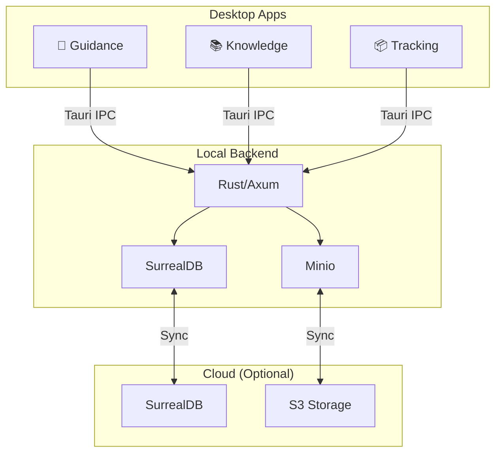

# Altair

> **Where Focus Takes Flight**

[](https://www.gnu.org/licenses/agpl-3.0)

---

## What is Altair?

Altair is a suite of three interconnected productivity apps designed for ADHD users:

| App              | Purpose                       | Key Features                             |
| ---------------- | ----------------------------- | ---------------------------------------- |
| 🎯 **Guidance**  | Task management               | Quest-Based Agile, energy-based planning |
| 📚 **Knowledge** | Personal knowledge management | Wiki-links, semantic search, folders     |
| 📦 **Tracking**  | Inventory management          | Locations, quantities, item search       |

Plus ⚡ **Quick Capture** — Zero-friction input that routes to any app.

### Why Altair?

- **Energy-aware** — Select tasks based on your current energy level
- **Zero-friction capture** — One tap to save, classify later when you have bandwidth
- **Cross-app linking** — Connect tasks to notes to inventory items
- **Offline-first** — Works without internet, syncs when connected
- **Privacy-first** — Local by default, optional cloud sync

---

## Tech Stack

| Layer    | Technology                                                        |
| -------- | ----------------------------------------------------------------- |
| Desktop  | [Tauri 2.0](https://tauri.app/) + [Svelte 5](https://svelte.dev/) |
| Mobile   | Tauri 2.0 Android                                                 |
| Backend  | Rust + [Axum](https://github.com/tokio-rs/axum)                   |
| Database | [SurrealDB](https://surrealdb.com/) (embedded + cloud)            |
| Storage  | S3-compatible (Minio, Backblaze B2)                               |
| Search   | Local ONNX embeddings + BM25 hybrid                               |

---

## Project Status

🚧 **In Development** — Not yet ready for use

See [Spec Backlog](docs/spec-backlog.md) for current progress.

---

## Getting Started

### Prerequisites

- [Rust](https://rustup.rs/) (latest stable)
- [Node.js](https://nodejs.org/) (Active LTS)
- [pnpm](https://pnpm.io/) (v10+)

> **Note:** SurrealDB runs embedded — no separate installation required.

### Development Setup

```bash
# Clone the repository
git clone https://github.com/yourusername/altair.git
cd altair

# Install dependencies
pnpm install

# Start development (backend + apps)
pnpm dev
```

The backend automatically starts an embedded SurrealDB instance and runs
migrations on first launch.

### Running Individual Apps

```bash
# Guidance (task management)
pnpm --filter guidance dev

# Knowledge (PKM)
pnpm --filter knowledge dev

# Tracking (inventory)
pnpm --filter tracking dev
```

### Standalone SurrealDB (Optional)

For debugging or direct database access:

```bash
# Install SurrealDB CLI
curl -sSf https://install.surrealdb.com | sh

# Start standalone server (development only)
surreal start --user root --pass root surrealkv:./data/db

# Connect with SQL shell
surreal sql --conn ws://localhost:8000 --ns altair --db main
```

---

## Project Structure

```text
altair/
├── apps/
│   ├── guidance/           # Quest management app
│   ├── knowledge/          # PKM app
│   ├── tracking/           # Inventory app
│   └── mobile/             # Android app
├── packages/
│   ├── ui/                 # Shared Svelte components
│   ├── bindings/           # Generated TypeScript types
│   ├── db/                 # Database queries
│   ├── sync/               # Sync engine
│   ├── storage/            # S3 client
│   └── search/             # Search engine
├── backend/                # Rust backend service
├── specs/                  # Feature specifications
└── docs/                   # Architecture & design docs
```

---

## Documentation

| Document                                                 | Description                                 |
| -------------------------------------------------------- | ------------------------------------------- |
| [Technical Architecture](docs/technical-architecture.md) | System design and technology choices        |
| [Domain Model](docs/domain-model.md)                     | Entities, relationships, and business rules |
| [User Flows](docs/user-flows.md)                         | User interactions and workflows             |
| [Glossary](docs/glossary.md)                             | Project terminology                         |
| [Decision Log](docs/decision-log.md)                     | Architectural decisions and rationale       |
| [Spec Backlog](docs/spec-backlog.md)                     | Feature roadmap and dependencies            |

---

## Contributing

### For AI-Assisted Development

This project is optimized for AI-assisted development:

- **[CLAUDE.md](CLAUDE.md)** — Context for Claude Code
- **[AGENTS.md](AGENTS.md)** — Guidelines for working with AI agents

### Development Workflow

We use **Spec-Driven Development (SDD)**:

1. **Spec** — Define what to build (`specs/{feature}/spec.md`)
2. **Plan** — Define how to build it (`specs/{feature}/plan.md`)
3. **Tasks** — Break into steps (`specs/{feature}/tasks.md`)
4. **Implement** — Write the code
5. **Review** — Verify against spec

See [AGENTS.md](AGENTS.md) for detailed workflow.

### Code Style

- **Rust**: `cargo fmt`, `cargo clippy`
- **TypeScript/Svelte**: `pnpm lint`, `pnpm typecheck`, `pnpm format`
- **Pre-commit hooks**: Use `prek` to run checks automatically before commits
- **Commits**: Conventional commits (`feat:`, `fix:`, `docs:`, etc.)

---

## Architecture Overview



**Key Design Decisions:**

- **Offline-first** — Local database is source of truth
- **Tauri IPC** — Desktop apps use direct IPC, not REST
- **Graph database** — SurrealDB for Quest→Note→Item relationships
- **Local embeddings** — Semantic search without cloud dependency
- **Last-Write-Wins sync** — Simple conflict resolution

See [Technical Architecture](docs/technical-architecture.md) for details.

---

## Core Concepts

### Quest-Based Agile (QBA)

Tasks are called **Quests** and have an **energy cost**:

| Energy      | Description               | Example              |
| ----------- | ------------------------- | -------------------- |
| 🟢 Low      | Minimal cognitive load    | "Reply to email"     |
| 🟡 Medium   | Moderate focus required   | "Review PR"          |
| 🔴 High     | Deep work, full attention | "Design new feature" |
| ⚪ Variable | Depends on context        | "Meeting prep"       |

**Daily Planning**: Select quests based on your current energy level,
not arbitrary priorities.

### Quick Capture

Zero-friction input capture:

1. **Capture** — One tap, no decisions
2. **Review** — Classify when you have bandwidth
3. **Route** — AI suggests destination (Quest/Note/Item)

### Cross-App Linking

- Quests can **reference** Notes (documentation)
- Quests can **require** Items (materials needed)
- Notes can **document** Items (manuals, guides)
- Notes **link to** Notes (wiki-style)

---

## License

[AGPL-3.0](LICENSE)

---

## Acknowledgments

- [Tauri](https://tauri.app/) — Lightweight desktop framework
- [SurrealDB](https://surrealdb.com/) — Multi-model database
- [Svelte](https://svelte.dev/) — Frontend framework
- Built with ☕ for the ADHD community
