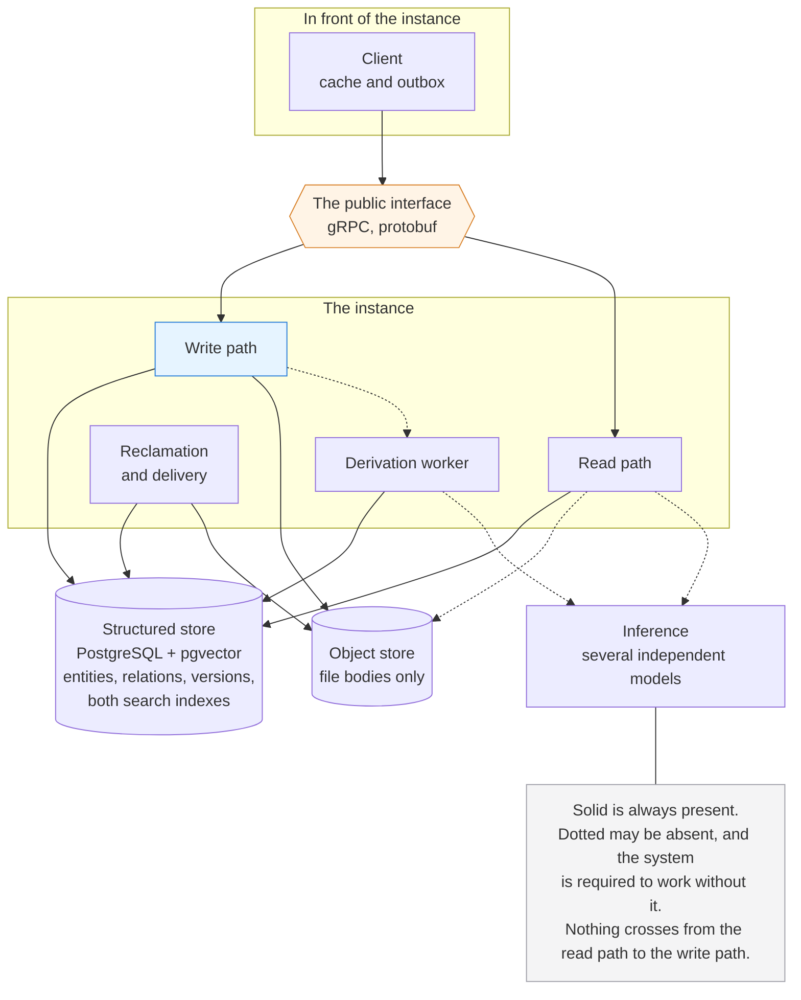

# Altair

[](https://github.com/getaltair/altair/actions/workflows/ci.yml)
[](crates/altair-conformance/README.md)
[](LICENSE)

[](#status)
[](docs/altair-v0-implementation-plan.md)
[](Cargo.toml)
[](docs/DR-002-postgresql-structured-store.md)

**A self-hosted system where the things you are working toward, the things you know, and the things you own live in one connected place you own permanently, and where a thought can always be captured whatever the network is doing.**

One instance serves one household. Nobody else can raise the price, change the terms, read the contents, or switch it off.

---

## Status

**Early construction.** The design is written and the instance answers every call in its interface; there is no client yet and nothing to install.

| Part | State |
|---|---|
| Design documents (`docs/`) | Written. The vision, three domain PRDs, the substrate, the architecture, and seven decision records |
| Wire contract (`proto/altair/v1/altair.proto`) | Accepted. Field numbers are permanent |
| Structured store schema (`crates/altaird/migrations/`) | `0001_initial.sql` is migration one, applied and exercised on PostgreSQL 18.6 with pgvector 0.8.6. `0002_write_provenance.sql` adds per-part write provenance and a lifecycle on a relation |
| Wave 0 · plumbing | Landed. Workspace, proto codegen, migration runner, a real-Postgres test harness, CI |
| Wave 1 · foundations | Landed. Store bootstrap and the audience predicate, block division, the object store, token validation, and the outbox conformance suite |
| Wave 2 · write path | 2.1 the intent spine, 2.2 type content across all three domains, and 2.3 file bodies have landed. **2.4, reclamation, was skipped and is still outstanding** — there is no retention window, no horizon value, and nothing sweeps |
| Wave 3 · read path | Landed. Literal retrieval, the per-member change stream, and health. All six calls in the interface are now served |
| Wave 4 · terminal client | The first useful day. Nothing before it is usable software |
| Waves 5 and 6 | Semantic retrieval, then the message bridge and operations |

The outbox conformance suite is **deliberately red** and will stay red until Wave 4.1 writes the outbox it judges. See [`crates/altair-conformance/README.md`](crates/altair-conformance/README.md) before touching it.

---

## What Altair is

A life does not divide neatly into projects, notes, and stuff. Rebuilding a kitchen is a plan, a pile of decisions, and a shopping list, all at once. Splitting that across three applications creates three sync boundaries, three search boxes, and three places to forget something.

**The bet:** one place where anything can connect to anything, searchable in a single pass, is worth more than best-in-class depth in any single domain.

### The two principles

Everything else descends from these. When a design decision is contested, it is resolved here first.

**Progress over perfection.** The system must be useful when the data is incomplete, imprecise, and out of date, because it always will be. A campaign with no arcs is valid. Six tracked items out of four hundred is a working inventory. "I don't know how much is left, just mark it lower" is a supported operation.

**No barriers to re-entry.** The cost of returning after three weeks away must be near zero. Nothing accumulates that must be cleared. No streak, score, or counter degrades through absence. Nothing reorganises itself while you are away, so muscle memory still works when you come back.

### Three domains, one entity model

**Guidance** is what you are working toward — campaigns, then arcs, then quests. It answers *what can I actually do right now?*

**Knowledge** is what you are learning and remembering — notes, files, links formed where the writing happens, derived backlinks. It answers *where did I write that down?*

**Tracking** is the resources a household runs on — items across nested locations, amounts at whatever precision you chose. It answers *do we have any left?*

**Anything can be linked to anything, across all three, and one query reaches all three in one pass.** That is the product, more than any individual domain is.

### Capture and retrieval

**Capture never fails.** A thought that cannot be written down when it arrives is gone. Acceptance is local and durable on the device before the person is told; credentials and connectivity never participate. A durable append-only outbox replays to the instance whenever it can.

**Retrieval is the other half.** Loose capture without good retrieval is a landfill. A literal arm and a similarity arm generate candidates together and fuse by rank position, so something is findable when you no longer recall the words you used. Literal matching is a permanent arm, not a fallback, which is why a just-captured entity is findable by its words before anything has been derived from it.

### What it will never be

Settled permanently, not a backlog: no hosted tier or vendor account, no telemetry without opt-in, no team project management (no velocity, estimation, roles, or permission matrices), no activity feeds or comments, no streaks or points or productivity scoring, no ordering that adapts to the person, no user-defined schemas or plugin runtime, no folder tree. The full list is in [the vision](docs/altair-vision.md).

Altair is for ADHD and otherwise neurodivergent adults running their own life and household, who can run a server themselves or live with someone who can. It is explicitly not for teams or organisations.

---

## Architecture in one pass

**One self-hosted instance is the authority for one household.** It owns the public interface, every write, audience enforcement, and retrieval orchestration. Stores sit behind it, clients in front, inference beside it and never authoritative. Process count is packaging, not architecture.


```mermaid
flowchart TB
    subgraph FRONT["In front of the instance"]
        CL["Client<br/>cache and outbox"]
    end

    PIF{{"The public interface<br/>gRPC, protobuf"}}

    subgraph INST["The instance"]
        WP["Write path"]
        RP["Read path"]
        RD["Reclamation<br/>and delivery"]
        DW["Derivation worker"]
    end

    SS[("Structured store<br/>PostgreSQL + pgvector<br/>entities, relations, versions,<br/>both search indexes")]
    OS[("Object store<br/>file bodies only")]
    INF["Inference<br/>several independent models"]

    CL --> PIF
    PIF --> WP
    PIF --> RP
    WP --> SS
    WP --> OS
    WP -.-> DW
    RP --> SS
    RP -.-> OS
    RP -.-> INF
    DW --> SS
    DW -.-> INF
    RD --> SS
    RD --> OS

    N["Solid is always present.<br/>Dotted may be absent, and the system<br/>is required to work without it.<br/>Nothing crosses from the read path to the write path."]
    INF --- N

    style WP fill:#e6f4ff,stroke:#2b7fd9
    style PIF fill:#fff4e6,stroke:#d9822b
    style N fill:#f4f4f5,stroke:#a1a1aa
```

**Structured store** ([DR-002](docs/DR-002-postgresql-structured-store.md)): PostgreSQL holds entities, relations, categories, membership, versions, derived text, embeddings, and *both* search indexes. The indexes live there because the audience predicate must sit inside the candidate query — filtering afterwards leaks and gets limits wrong.

**Object store** ([DR-003](docs/DR-003-object-store.md)): the filesystem behind put, get, delete, and enumerate. File bodies and nothing else. `enumerate` is load-bearing, because erasure removes the record before the bytes and the sweep is what closes that window.

**Derivation worker**: embeddings and their provenance. Its queue is a table claimed with `SELECT … FOR UPDATE SKIP LOCKED`, and it is an optimisation over work that is computable from the store. Losing it costs time, not reportability.

**Inference**: several independently-absent models. An instance without a cross-encoder is conforming, not degraded.

**Write path**: writes are field-scoped and carry a base counter. Overlapping concurrent changes retain both sides. A stale base counter is never a rejection — reject-and-retry is the familiar pattern here and it is wrong, because a device returning after three weeks cannot win a retry race against a household that has been using the system meanwhile.

**Change stream**: polled with a client-held position, and assembled **per member**. Audience broadening and narrowing must arrive as creation and deletion to the affected member; one shared stream filtered late is where a leak happens.

---

## Repository layout

```text
docs/                      Design documents. The authority the implementation is checked against
proto/altair/v1/           The public interface. Field numbers are permanent
conformance/scenarios.md   The outbox specification, made executable, run against every implementation
crates/
  altaird/                 The instance: store, block division, object store, token validation, write path
    migrations/            0001_initial.sql is migration one, and is not re-derived
  altair-proto/            Generated contract types (protox + tonic, no protoc needed)
  altair-conformance/      The conformance harness. Red on purpose until Wave 4.1
compose.yaml               PostgreSQL 18 with pgvector, for tests
mise.toml                  Toolchain and task definitions
```

---

## Building and testing

**Prerequisites:** [mise](https://mise.jdx.dev) and a Docker daemon. Everything else — the Rust toolchain, the markdown linter, the pre-commit runner — is installed by mise from `mise.toml`. No `protoc` is required; codegen goes through `protox`, which is pure Rust.

```bash
mise install                 # toolchain
cp .env.example .env         # DATABASE_URL for the test harness
mise run test                # brings up Postgres, then cargo test --workspace
```

`mise run test` is the whole loop: it runs `docker compose up -d --wait` and then the workspace suite. The harness stands up a **real PostgreSQL**, not a mock, because the audience predicate, both indexes, and `SKIP LOCKED` are Postgres behaviour. Migrations are applied once into a template database and each test branches it with `CREATE DATABASE … TEMPLATE`, so per-test isolation costs about a connection.

Where several worktrees run lanes in parallel against one Postgres, set `ALTAIR_TEST_PREFIX` per worktree so they do not fight over the template name.

To look at the red conformance suite:

```bash
mise run conformance         # expected to fail until Wave 4.1
```

It needs no database, no Authentik, and no real instance: the suite stands up its own fake instance on a local port. It prints a ledger at the end, because libtest has no third verdict and a scenario a client legitimately skips would otherwise read as a pass.

Before committing:

```bash
prek install                 # once, to wire the hooks
prek run --all-files         # rustfmt, clippy with -D warnings, mado, hygiene
```

CI runs the same hooks, so the local path and CI cannot drift apart.

---

## The documents

**Changing a document is the work.** These documents are the authority the implementation is checked against, and they form a strict hierarchy — every one names its own position in its header.

```text
altair-vision.md                          normative, permanent product identity
  ├── altair-substrate-spec.md            cross-cutting behaviour, under all three domains
  ├── altair-guidance-prd.md              \
  ├── altair-knowledge-prd.md              }  domain behaviour
  ├── altair-tracking-prd.md              /
  ├── altair-relation-types-spec.md       relation types, which belong to no single domain
  ├── altair-architecture-foundations.md  what kind of system, before any component
  │     └── altair-architecture.md        components and what they owe each other
  │           └── altair-component-model.md  every boundary, and what each side owes on absence
  ├── altair-data-model.md                every persistent thing, and it decides nothing
  ├── altair-v0-scope.md                  sequencing; defers, never amends
  │     └── altair-v0-implementation-plan.md
  └── DR-001 … DR-007                     product and technology choices made against the above
```

Three rules follow from that shape and are easy to violate:

**Assembled documents decide nothing.** [`altair-data-model.md`](docs/altair-data-model.md) and [`altair-component-model.md`](docs/altair-component-model.md) restate what their authorities require. Where one disagrees with the substrate spec, a domain PRD, or the architecture, the assembled document is what gets corrected.

**Design before architecture before tools.** Specs say what must be true, the architecture says what structure delivers it, and decision records choose products. A spec that names a product has escaped its layer.

**The scratchpad has no authority.** [`altair-scratchpad.md`](docs/altair-scratchpad.md) holds entries that are `open`, `leaning`, or `parked`. Writing something there is not deciding it.

### Decision records

| Record | Decision |
|---|---|
| [DR-001](docs/DR-001-markdown-body-not-storage.md) | Markdown is a note's body, not the storage layer |
| [DR-002](docs/DR-002-postgresql-structured-store.md) | PostgreSQL with pgvector is the structured store |
| [DR-003](docs/DR-003-object-store.md) | The object store is the filesystem behind four operations |
| [DR-004](docs/DR-004-wire-contract.md) | Protocol buffers over gRPC are the wire contract |
| [DR-005](docs/DR-005-token-validation.md) | The instance validates tokens rather than trusting a gateway |
| [DR-006](docs/DR-006-runtime-and-clients.md) | Rust for the instance, a terminal client first, Android in Kotlin later |
| [DR-007](docs/DR-007-identifier-scheme.md) | Every identifier is a random UUIDv4, and nothing reads one |

---

## The plan

[`docs/altair-v0-implementation-plan.md`](docs/altair-v0-implementation-plan.md) sequences the work. It prescribes no file list and no directory layout — every item is an outcome with a verification condition, and the layout is decided while implementing. Early waves are specific; later ones name outcomes and deliberately leave the shape open, and each is re-planned at its boundary.

| Wave | Produces |
|---|---|
| 0 · Plumbing | Workspace, proto codegen, migration runner, integration harness, CI |
| 1 · Foundations | Store bootstrap, block division, object store, token validation, outbox conformance suite |
| 2 · Write path | Intent spine, type content across all three domains, file bodies, reclamation |
| 3 · Read path | Literal retrieval arm, change stream and horizon, health |
| 4 · Terminal client | The Rust outbox, then a ratatui client. **The first useful day** |
| 5 · Semantic | Derivation worker, inference boundary and bi-encoder, semantic arm and fusion |
| 6 · Second client and ops | Message bridge, packaging, backup, restore, upgrade |

Deferred decisions have **triggers, not dates**. The embedding model is chosen at Wave 5 against a real corpus, the bridge transport at 6.1, retention constants at 2.4. None is taken early.

### Standing constraints

The ones cheapest to violate and most expensive to repair. They apply to prose changes as much as to code.

- The audience predicate lives **inside** the query that produces candidates, on every path including similarity — never a filter afterwards. One implementation, called by both paths.
- Nothing crosses from the read path to the write path. The read path writes nothing, including no record of what was asked.
- A stale base counter is never a rejection.
- Acceptance is shown only after local durability.
- Bytes before the record on creation. Record before the bytes on erasure.
- Relation types are declarations the system interprets, not branches.
- Derived data is never canonical; a person's edit to it outranks recomputation.
- Nothing may foreclose export.
- Field numbers are permanent; removed fields are reserved, never reused.
- Waiting is silent, faults signal. An unreachable instance and an expired session are the same wait. No counter rises while the person is away, and queue depth is never reported.
- No client habit becomes load-bearing. What crosses the boundary is the component model's list, not what the first client happened to need.

---

## Contributing

`main` is the single trunk and is always in a working state. Every change reaches it through a pull request from a short-lived branch, including a documents-only edit.

- Branch off `main`, and name the branch for what it contains.
- Open the pull request early, even in draft — the PR is where discussion happens, not just a final gate.
- `main` is protected: no direct pushes, no force-pushes, enforced for everyone.
- **Squash merges only.** The PR title and body become the permanent commit message, so keep them accurate. Branches are deleted on merge.
- A PR that changes `docs/` owes the review the document hierarchy implies, independent of the GitHub review count.

---

## Licence

[AGPL v3 or later](LICENSE), permanently. That is a Must in the vision document rather than a default, and it is not negotiable.
