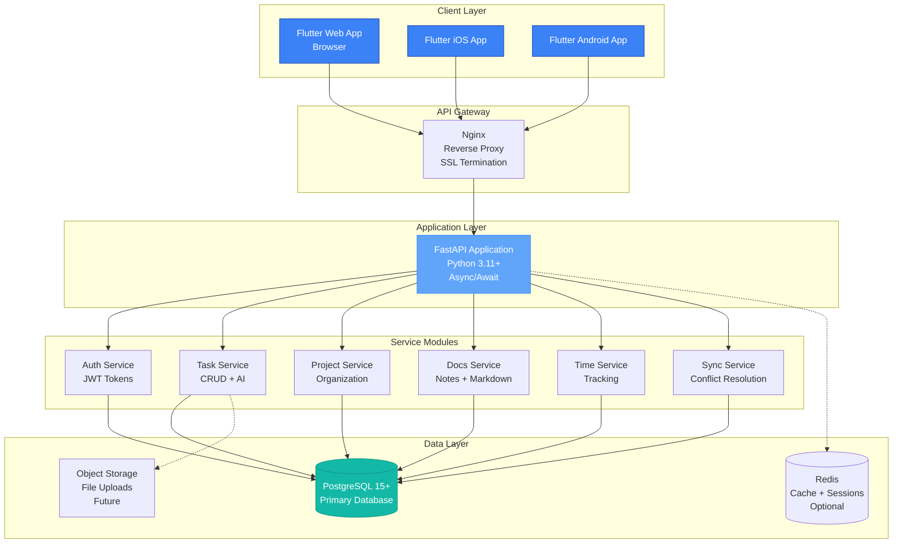
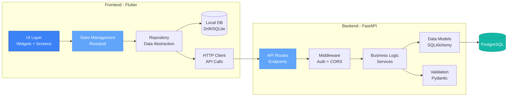
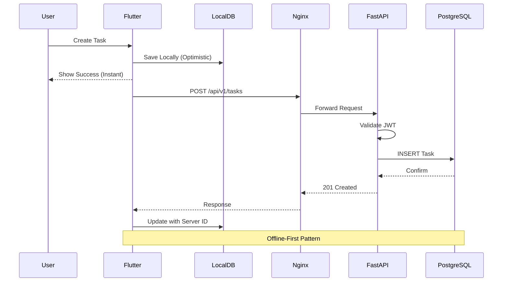
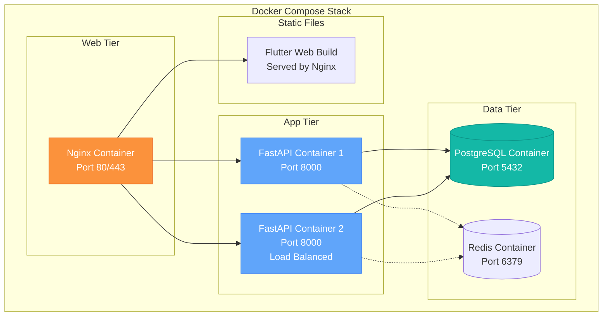
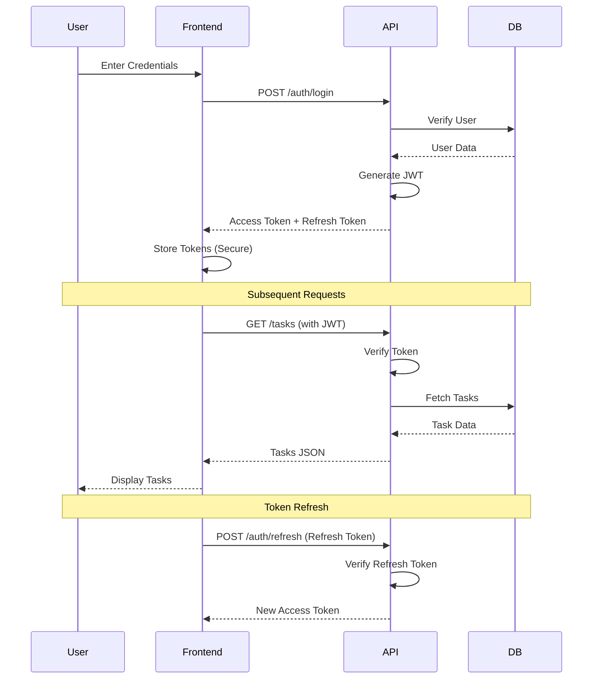
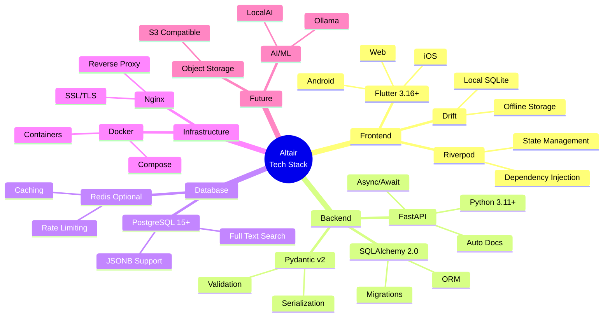
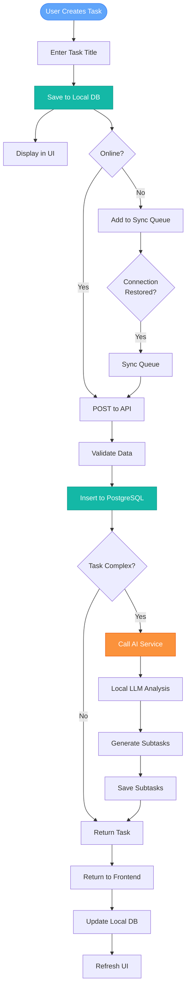
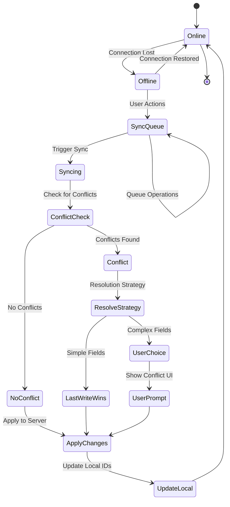
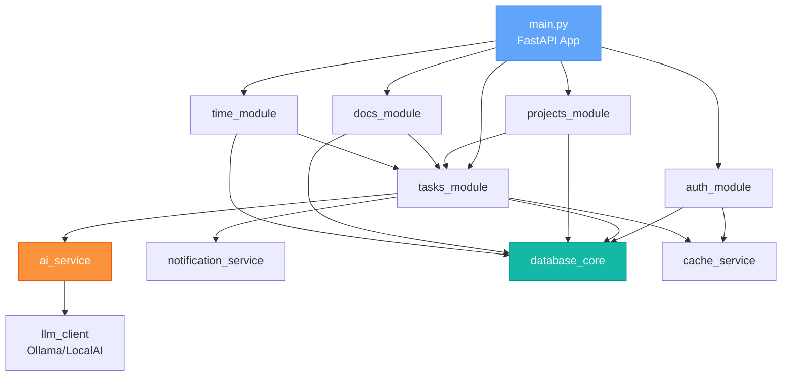
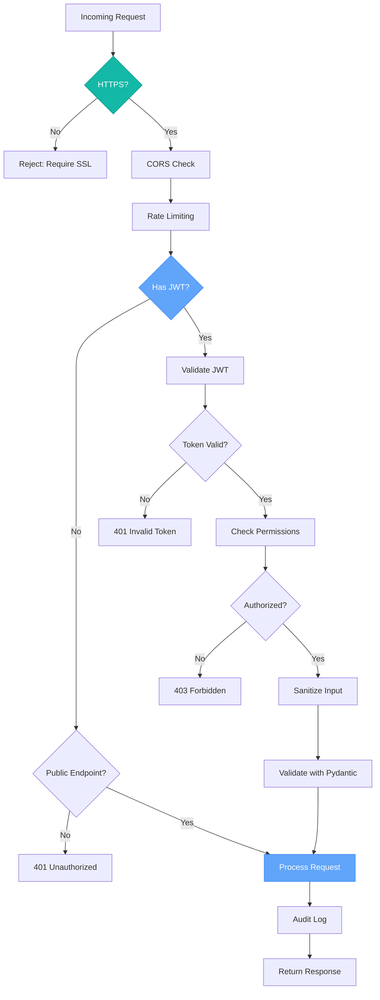

# Altair System Architecture Diagrams

## High-Level System Architecture

## Detailed Component Architecture

## Network Flow & Communication

## Deployment Architecture

## Authentication Flow

## Technology Stack Visual

## Data Flow: Task Creation with AI Breakdown

## Offline Sync Strategy

## Module Dependencies

## Security Layers

---

**Usage Notes:**
- These diagrams are in Mermaid format
- Can be rendered in GitHub README files
- Compatible with many documentation tools
- Can be exported to SVG/PNG using Mermaid CLI or online editors
- Update as architecture evolves
