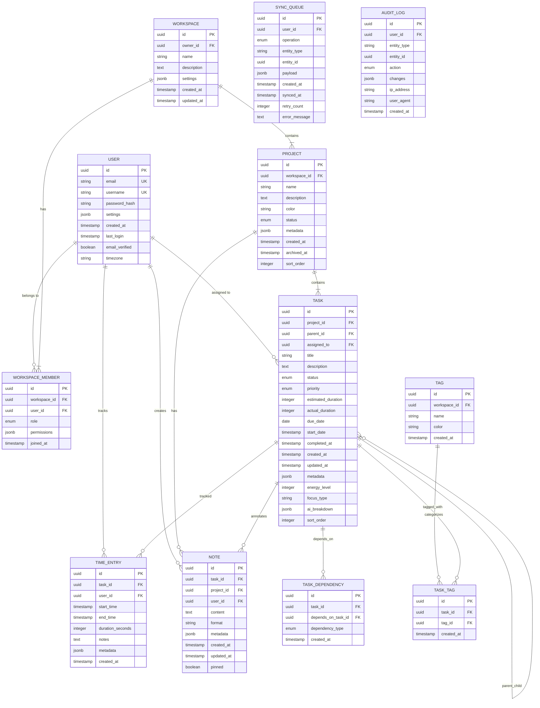
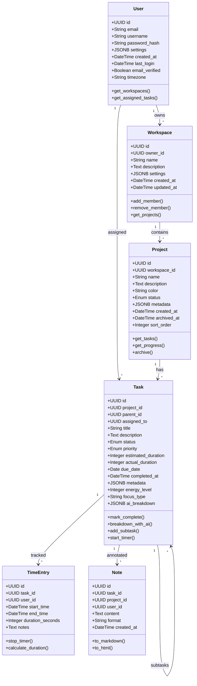
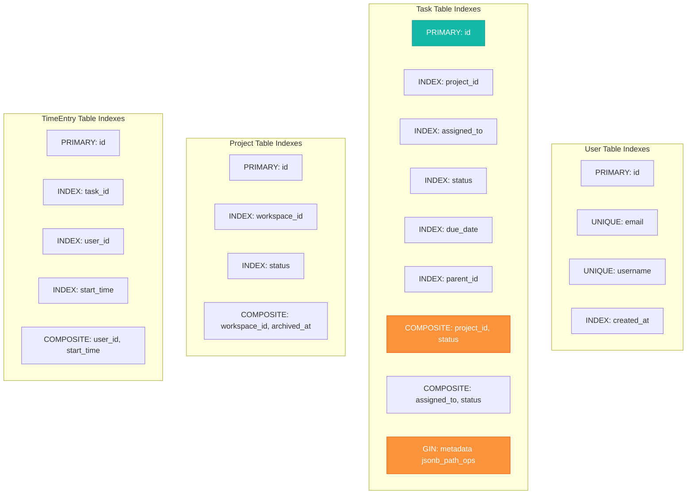
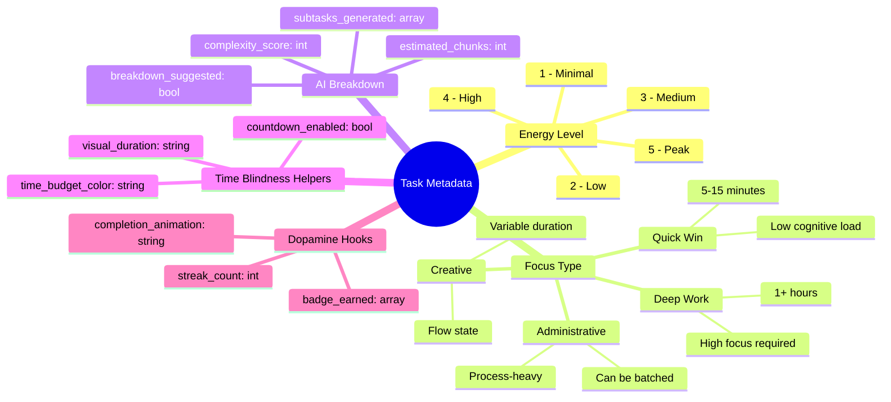
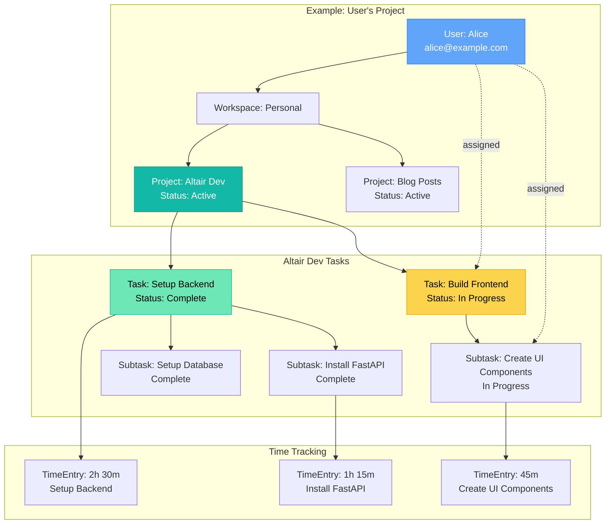
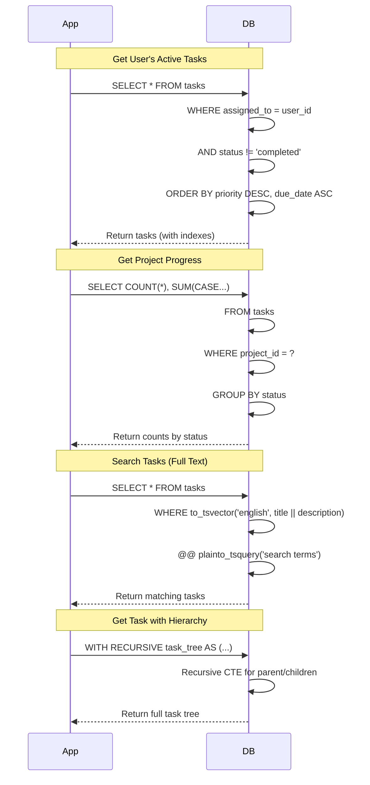
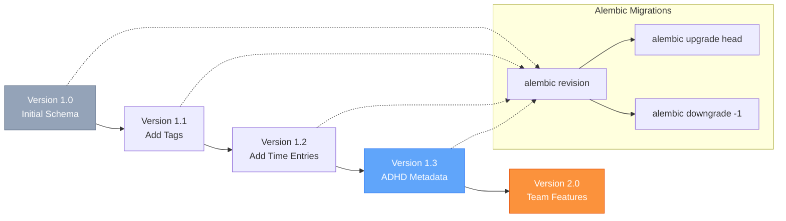
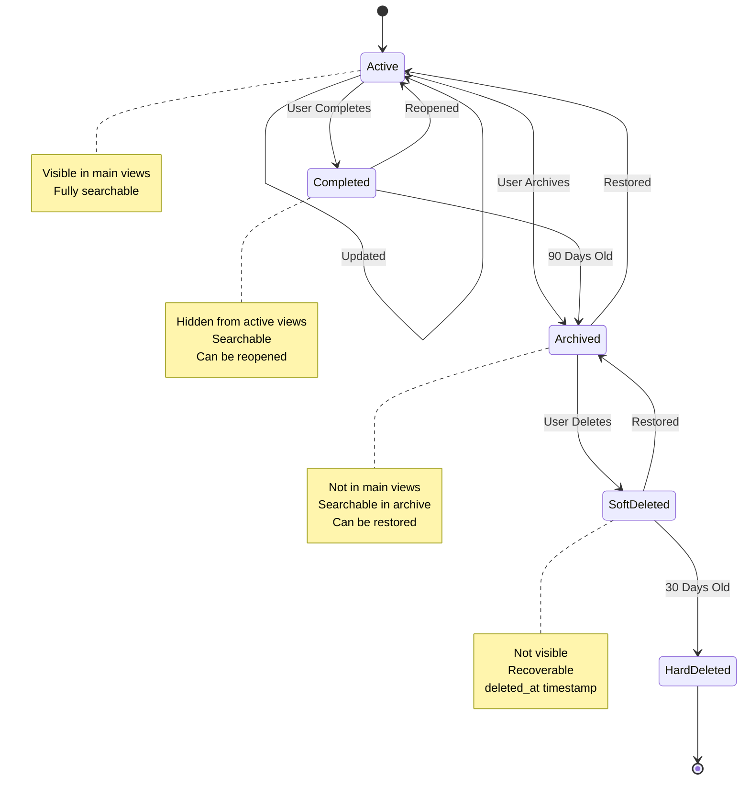

# Altair Database Schema & ERD

## Entity Relationship Diagram

## Database Schema with Details

## Table Indexes

## ADHD-Specific Fields Detail

## Sample Data Relationships

## Query Patterns

## Migration Strategy

## Data Retention & Archival

---

**Schema Notes:**

1. **UUIDs everywhere** - Better for distributed systems, offline-first
2. **JSONB for flexibility** - ADHD metadata can evolve without migrations
3. **Soft deletes** - Use `deleted_at` timestamp, never hard delete user data
4. **Timestamps** - All tables have `created_at`, mutable tables have `updated_at`
5. **Enums** - Use PostgreSQL ENUMs for status, priority, role
6. **Full-text search** - `tsvector` columns for task/note searching
7. **Indexes** - Composite indexes on common query patterns
8. **Constraints** - Foreign keys with CASCADE for data integrity
