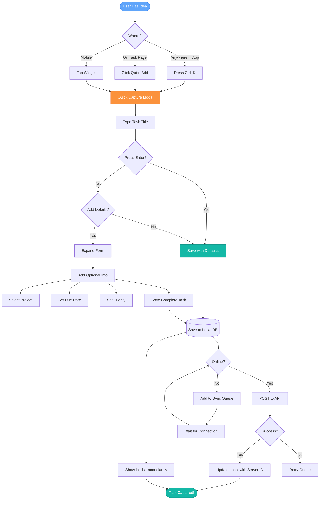
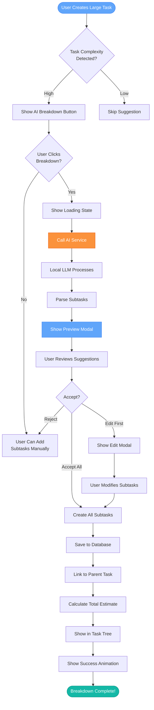
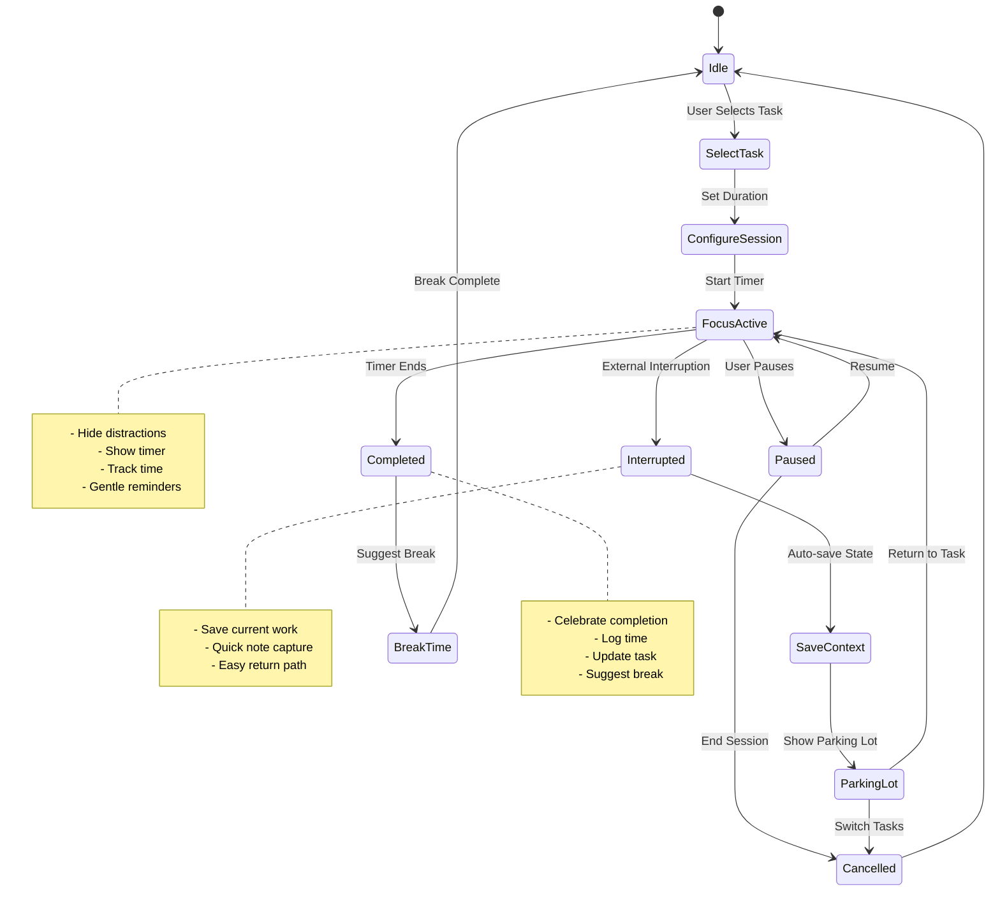
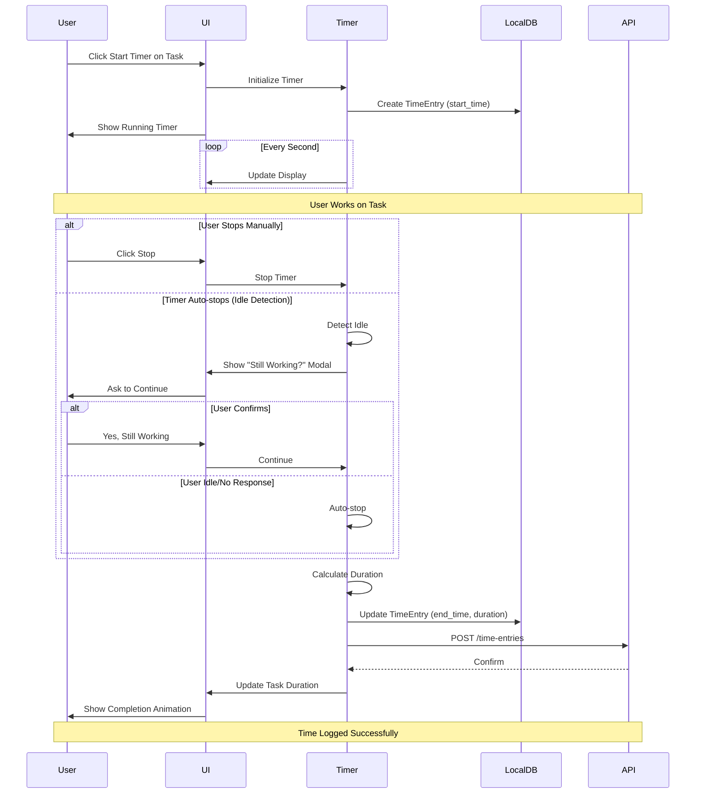
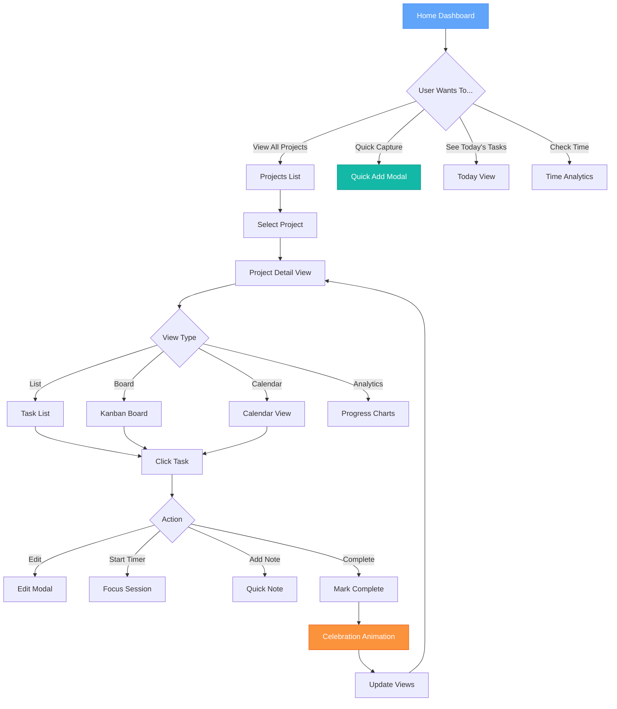
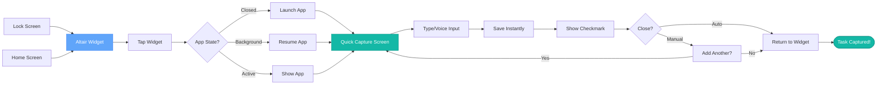
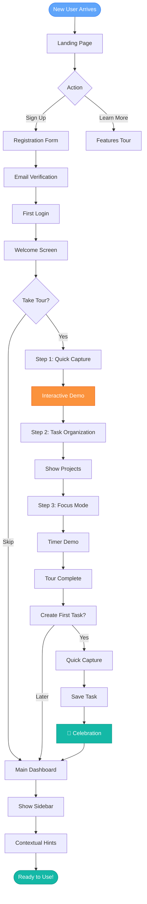
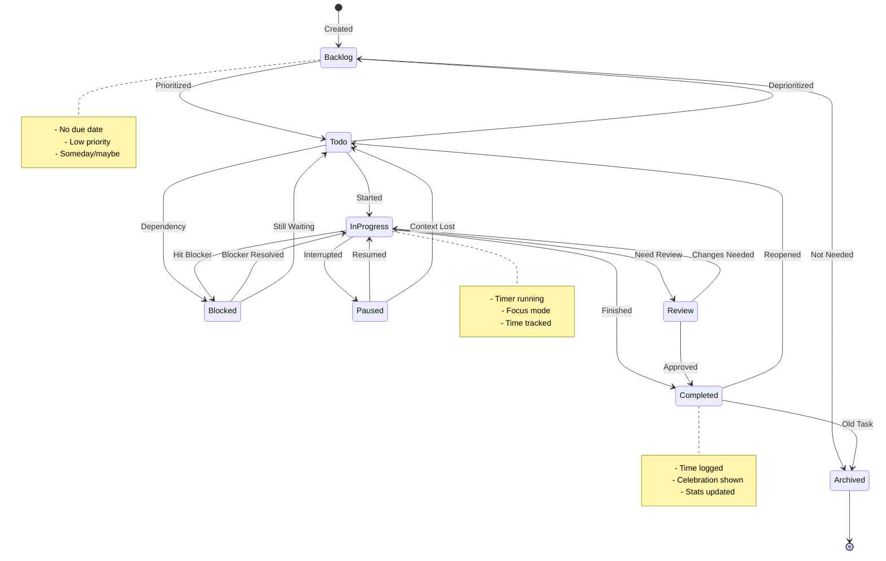
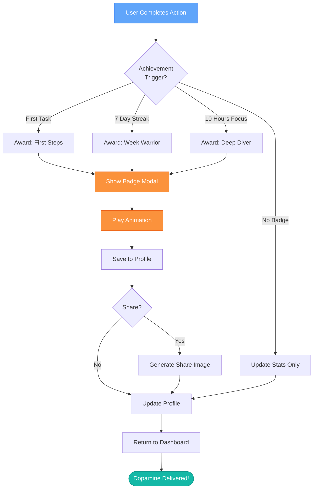
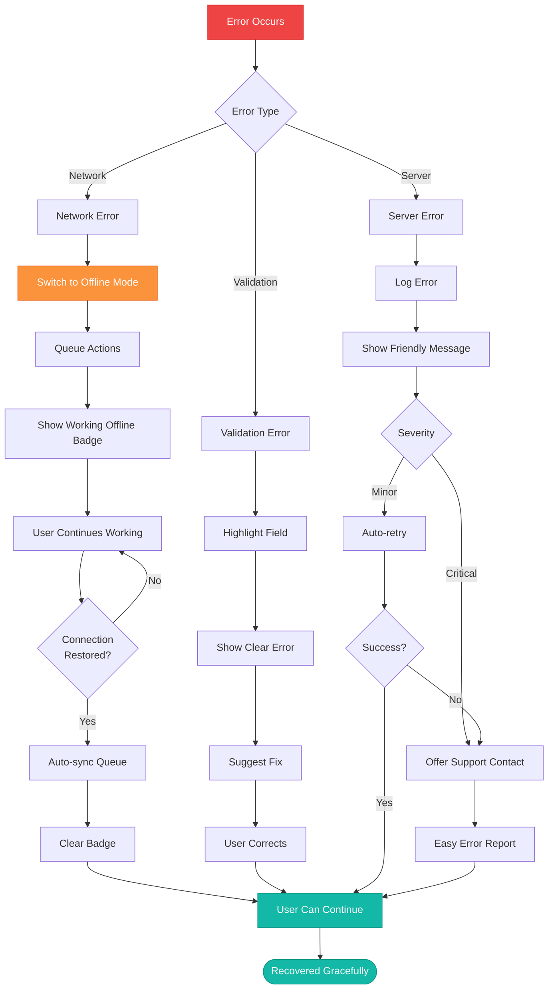

# Altair User Flow Diagrams

## Quick Task Capture Flow (ADHD-Optimized)

## AI Task Breakdown User Journey

## Focus Mode Session Flow

## Time Tracking User Flow

## Project Dashboard Navigation

## Mobile Quick Capture from Widget

## First-Time User Onboarding

## Task Status Lifecycle

## Gamification Progress Flow

## Error Recovery Flow (ADHD-Friendly)

---

**Flow Design Principles:**

1. **Minimal Clicks** - Most actions in 1-2 steps
2. **Forgiving** - Easy undo, auto-save, recovery
3. **Clear Feedback** - Every action has visible response
4. **No Dead Ends** - Always a path forward
5. **Context Preservation** - Save state on interruption
6. **Visual Progress** - Show where user is in flow
7. **Escape Hatches** - Can always cancel/go back
8. **Smart Defaults** - Reduce decisions needed
