# Altair Roadmap & Planning Visualizations

## Development Timeline (Gantt Chart)

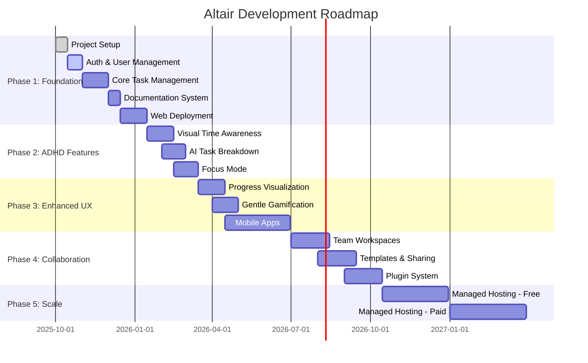

## Feature Priority Matrix

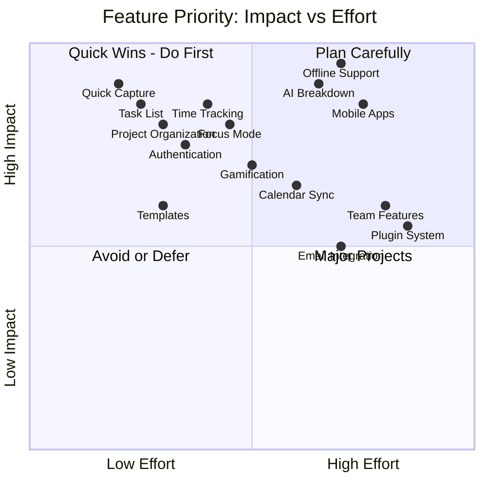

## Feature Dependency Graph

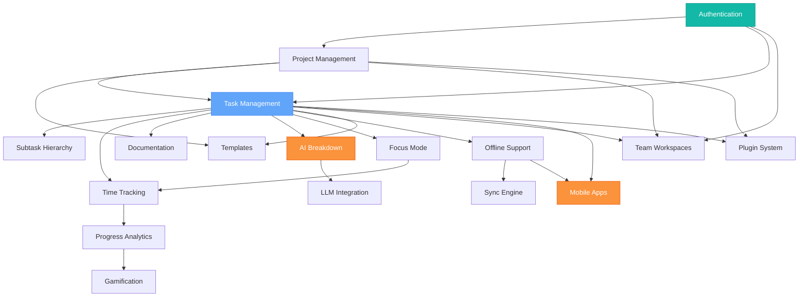

## ADHD Features Mindmap

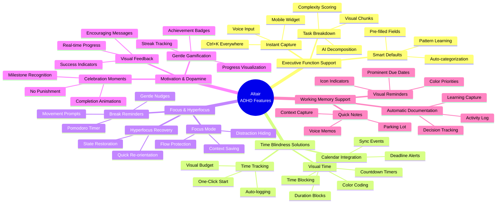

## Dogfooding Milestone Map

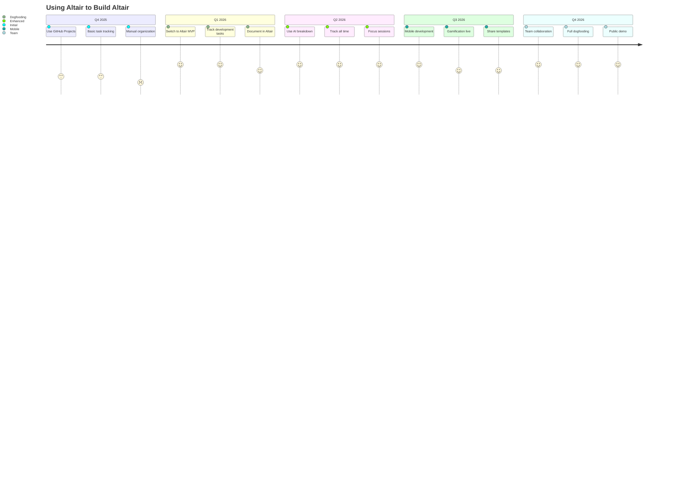

## Technology Decision Tree

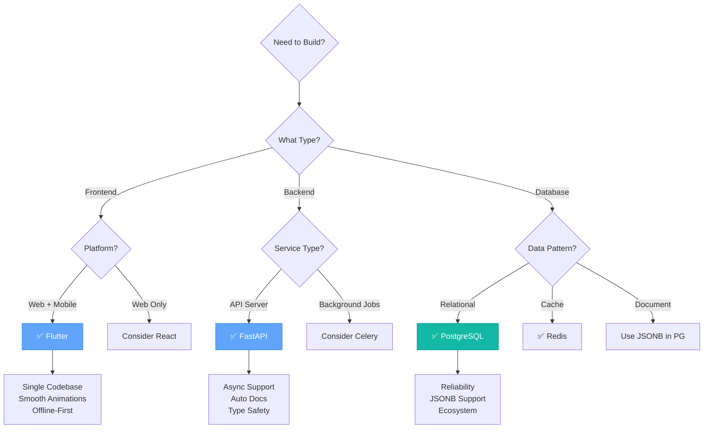

## Development Phases Breakdown

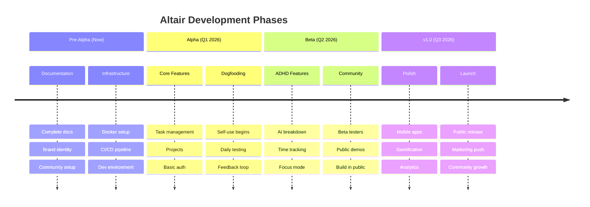

## Sprint Planning Template

```mermaid
graph LR
    subgraph "Sprint 1: Foundation"
        S1_1[Setup FastAPI]
        S1_2[Setup Flutter]
        S1_3[Database Schema]
        S1_4[Basic Auth]
    end

    subgraph "Sprint 2: Tasks"
        S2_1[Task CRUD API]
        S2_2[Task List UI]
        S2_3[Quick Capture]
        S2_4[Offline Storage]
    end

    subgraph "Sprint 3: Projects"
        S3_1[Project CRUD]
        S3_2[Project UI]
        S3_3[Task Assignment]
        S3_4[Sync Logic]
    end

    S1_1 --> S1_2 --> S1_3 --> S1_4
    S1_4 --> S2_1
    S2_1 --> S2_2 --> S2_3 --> S2_4
    S2_4 --> S3_1
    S3_1 --> S3_2 --> S3_3 --> S3_4

    style S1_1 fill:#14B8A6,stroke:#0D9488,color:#fff
    style S2_1 fill:#60A5FA,stroke:#3B82F6,color:#fff
    style S3_1 fill:#FB923C,stroke:#EA580C,color:#fff
```

## Community Growth Strategy

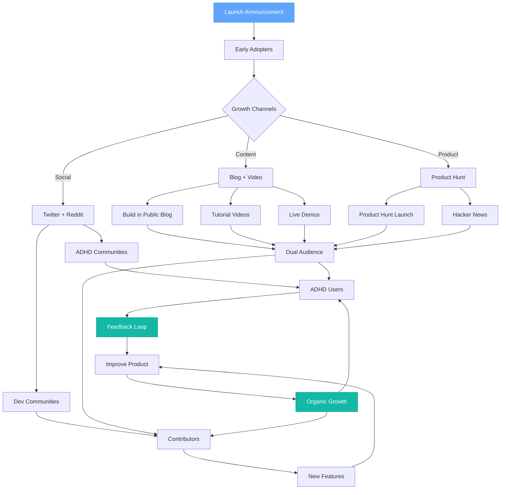

## Risk Mitigation Map

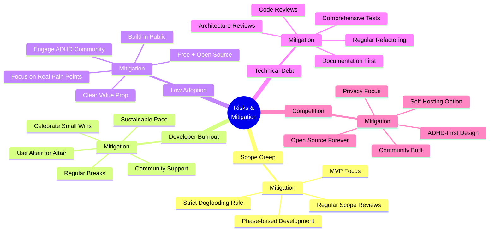

## API Development Progress

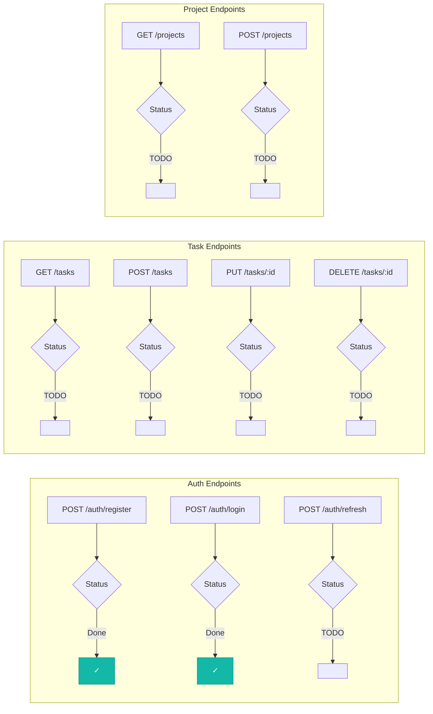

---

**Planning Guidelines:**

1. **Use Dogfooding Rule** - Only build what we need to manage Altair
2. **Ship Early, Ship Often** - Weekly deployments to demo.getaltair.app
3. **Measure Everything** - Track velocity, completion rates, user feedback
4. **Community First** - Public roadmap, transparent decisions
5. **Sustainable Pace** - No crunch, use Altair to prevent burnout
6. **Visual Progress** - Update these diagrams monthly
7. **Celebrate Milestones** - Mark phase completions publicly
