# Altair Component Architecture & Technical Flows

## Frontend Component Hierarchy

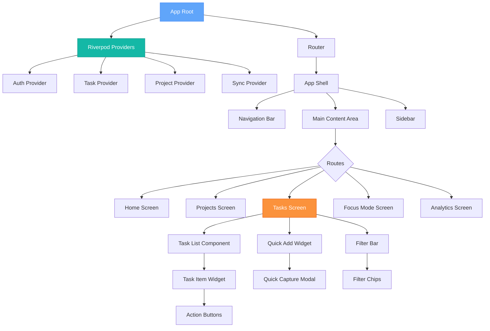

## Flutter State Management Flow (Riverpod)

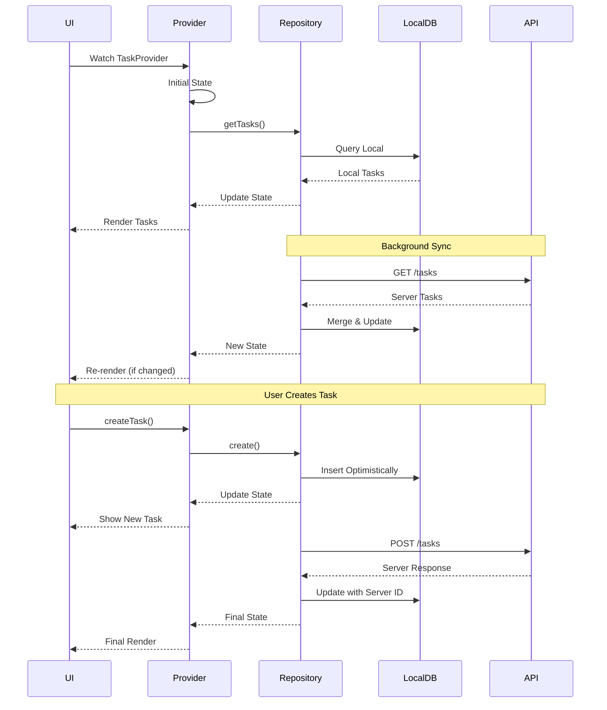

## Backend Request Lifecycle

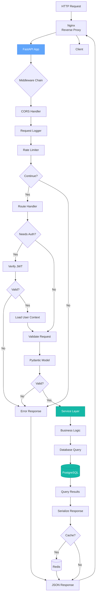

## Offline-First Data Sync Architecture

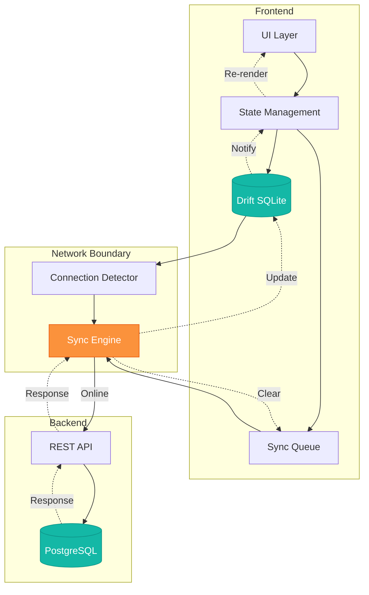

## Conflict Resolution Strategy

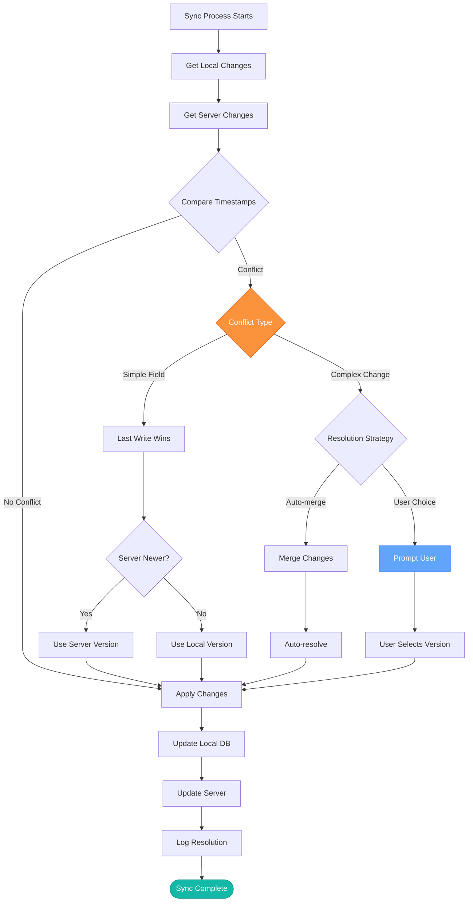

## AI Task Breakdown Architecture

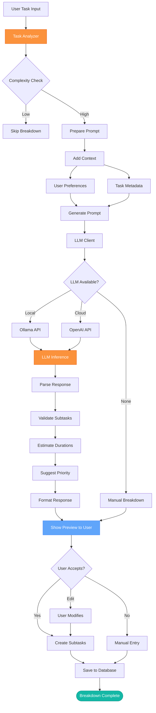

## Authentication & Security Flow

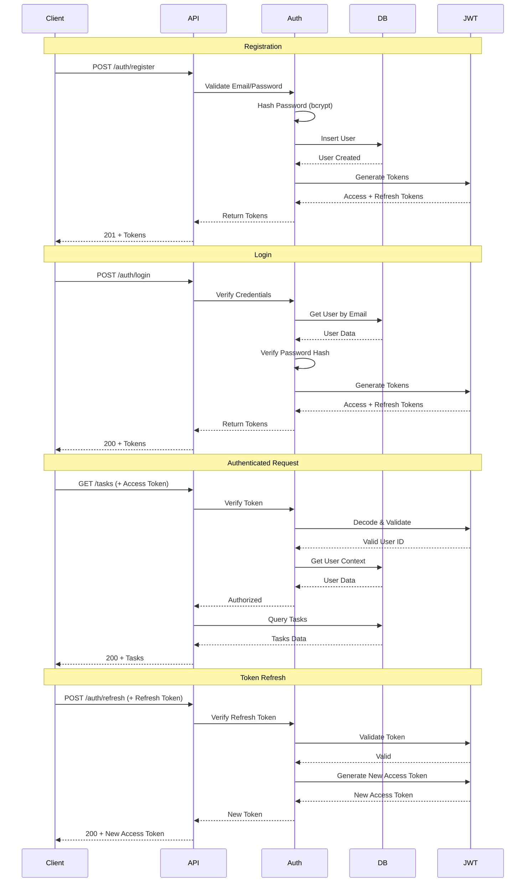

## Docker Compose Service Dependencies

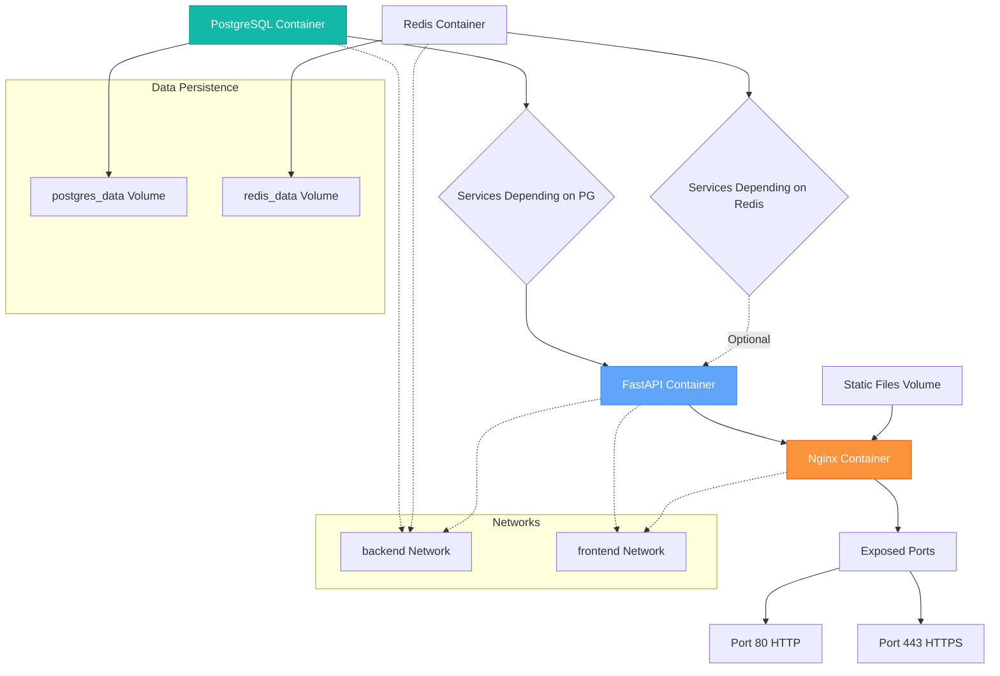

## Testing Strategy Pyramid

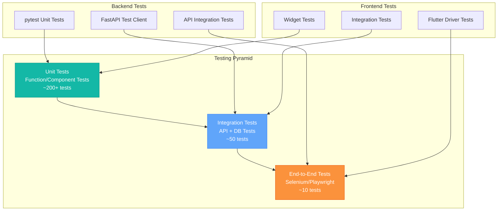

## CI/CD Pipeline

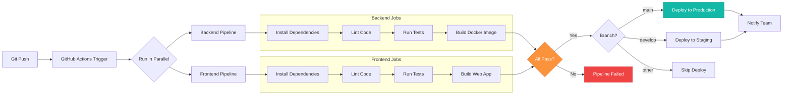

## Database Connection Pooling

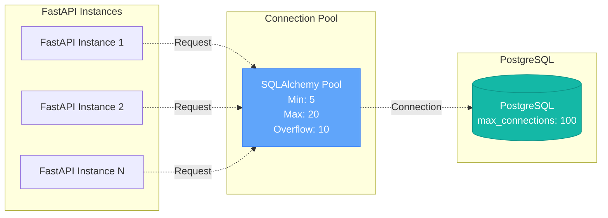

## Error Handling Flow

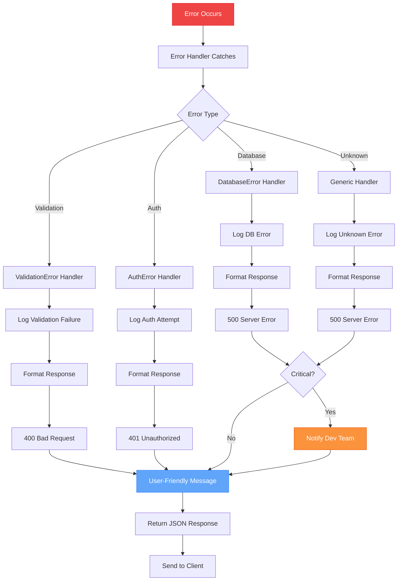

---

**Component Design Principles:**

1. **Separation of Concerns** - Clear boundaries between layers
2. **Dependency Injection** - Testable, mockable components
3. **Error Boundaries** - Graceful degradation
4. **State Management** - Unidirectional data flow
5. **Type Safety** - TypeScript/Dart + Pydantic validation
6. **Async First** - Non-blocking operations
7. **Observability** - Logging, metrics, tracing
8. **Resilience** - Retry logic, circuit breakers, fallbacks
