# Altair Deployment & Operations Diagrams

## Self-Hosting Deployment Options

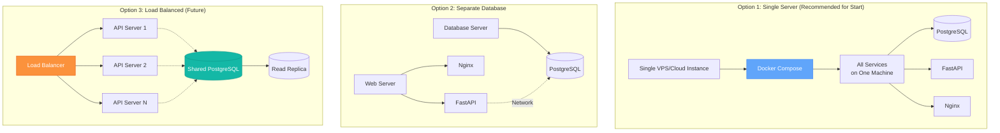

## Deployment Workflow

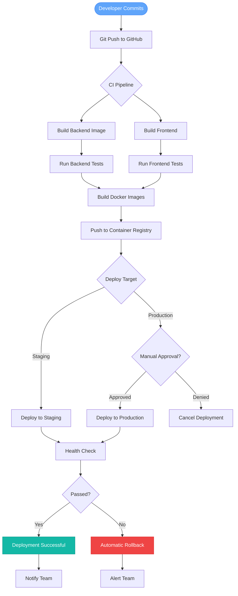

## Production Infrastructure

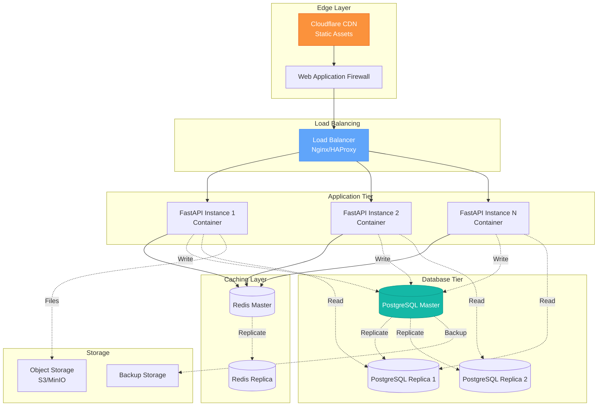

## Monitoring & Observability Stack

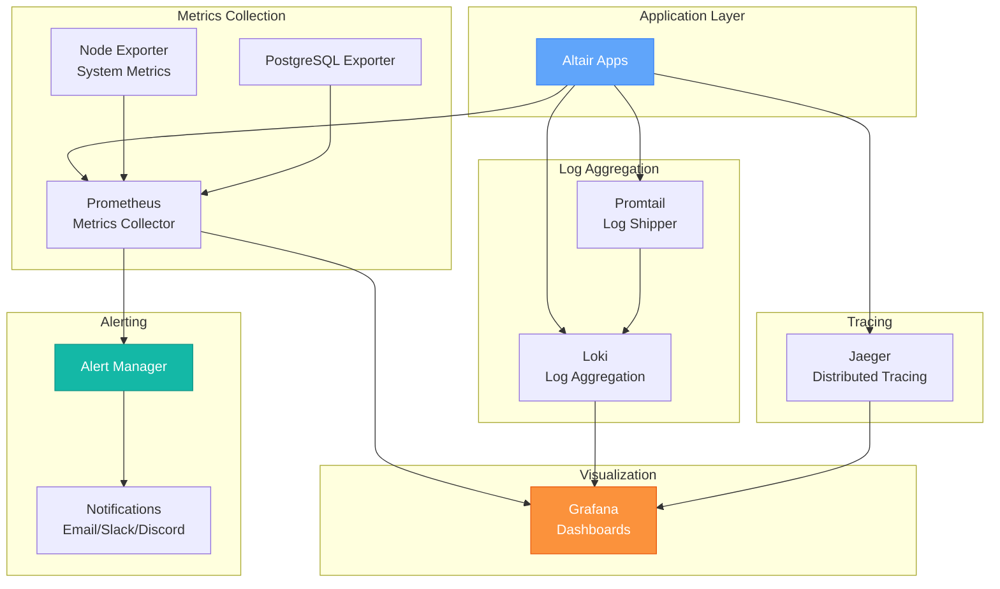

## Key Metrics Dashboard Layout

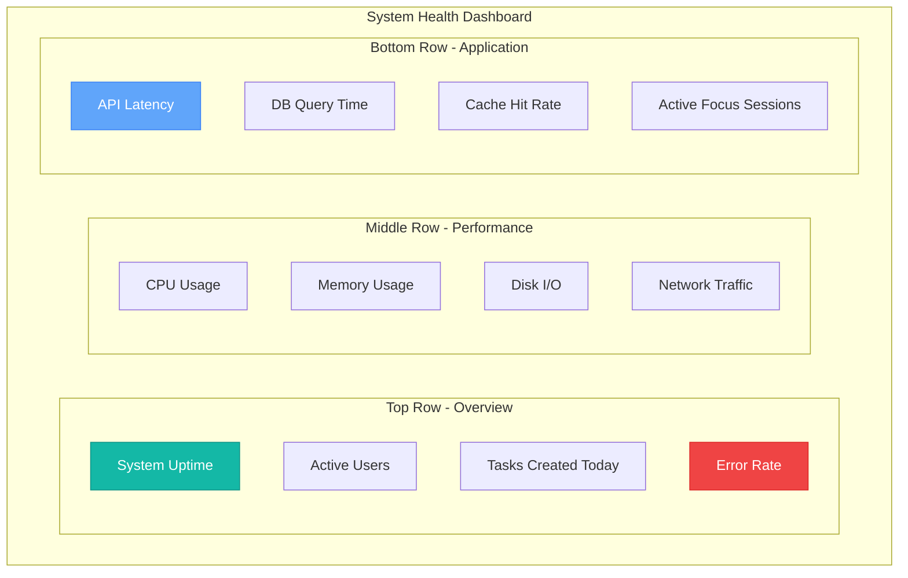

## Backup Strategy

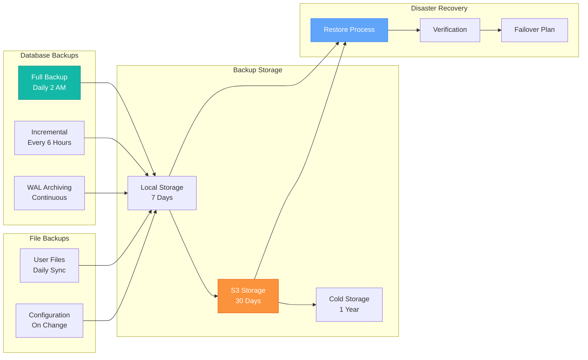

## Security Monitoring

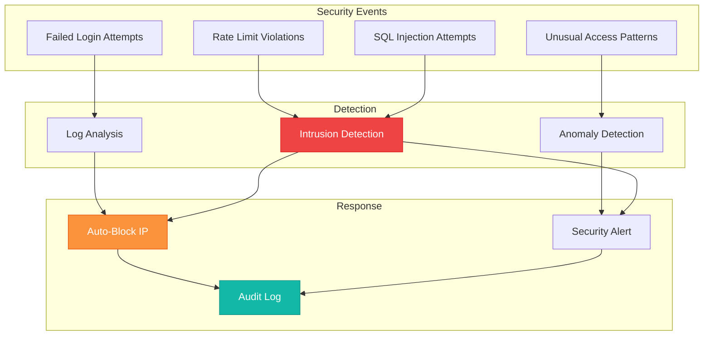

## Scaling Strategy

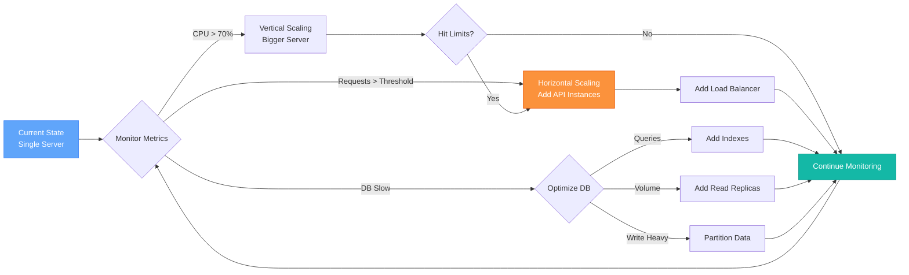

## Performance Optimization Areas

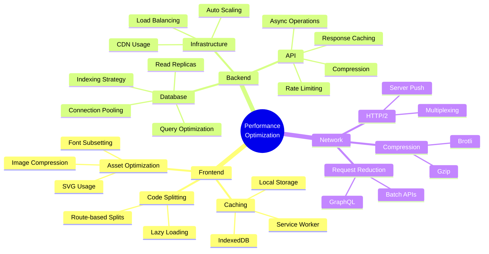

## Incident Response Flow

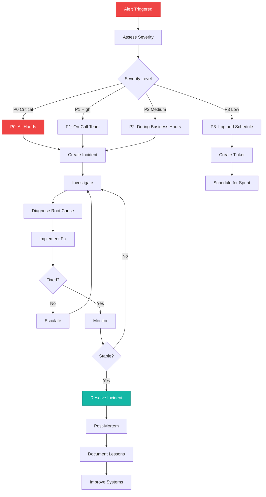

## Cost Optimization Strategy

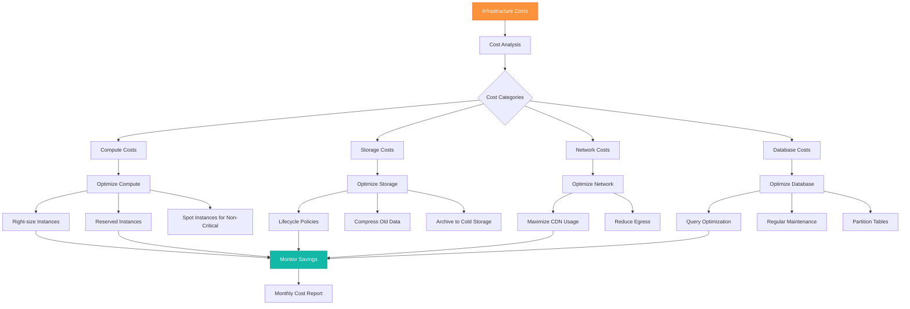

---

## Diagram Index & Quick Reference

### System Overview
1. **System Architecture** - See `01-system-architecture.md`
   - High-level architecture
   - Component relationships
   - Network flow
   - Deployment architecture

### Data Layer
2. **Database Schema** - See `02-database-schema-erd.md`
   - Entity Relationship Diagram
   - Table structures
   - Indexes and constraints
   - Query patterns

### User Experience
3. **User Flows** - See `03-user-flows.md`
   - Quick task capture
   - AI task breakdown
   - Focus mode sessions
   - Onboarding flow

### Project Management
4. **Roadmap & Planning** - See `04-roadmap-planning.md`
   - Timeline (Gantt chart)
   - Feature priority matrix
   - Dependency graphs
   - Sprint planning

### Technical Implementation
5. **Component Architecture** - See `05-component-architecture.md`
   - Frontend components
   - Backend request lifecycle
   - Offline-first architecture
   - AI integration

### Operations
6. **Deployment & Ops** - This file
   - Deployment options
   - Monitoring setup
   - Backup strategy
   - Incident response

---

**Usage Tips:**

1. **For Development** - Reference component and data diagrams
2. **For Planning** - Use roadmap and priority matrices
3. **For Operations** - Follow deployment and monitoring diagrams
4. **For Documentation** - Link to relevant diagrams in docs
5. **For Presentations** - Export diagrams as PNG/SVG

**Tools to Render:**
- **Mermaid Live Editor**: https://mermaid.live
- **VS Code Extension**: Markdown Preview Mermaid Support
- **GitHub**: Renders Mermaid automatically in .md files
- **Export**: Use mermaid-cli for PNG/SVG export

**Maintenance:**
- Update diagrams when architecture changes
- Version control with git
- Keep diagram code readable (good spacing, comments)
- Export static images for presentations
