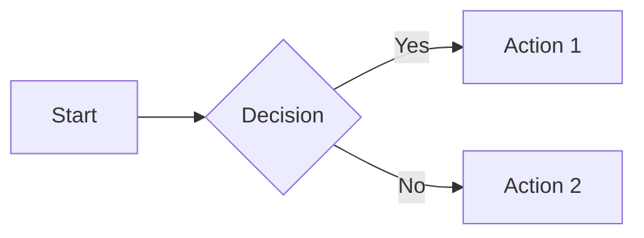
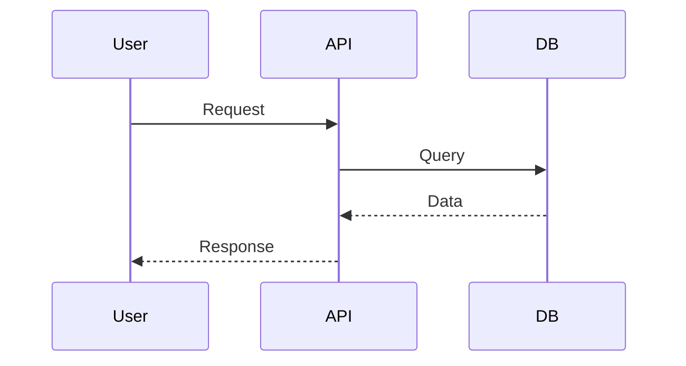
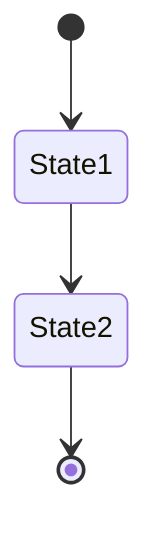
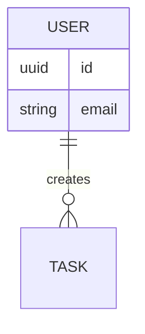
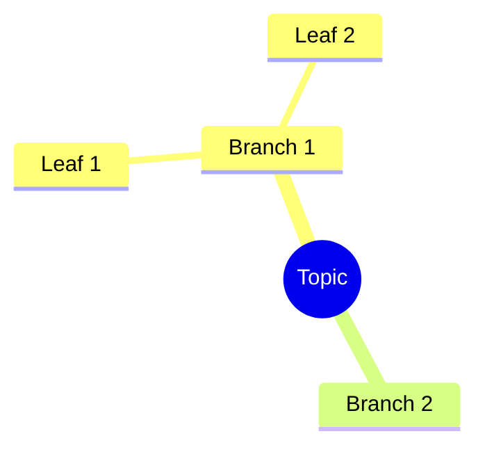
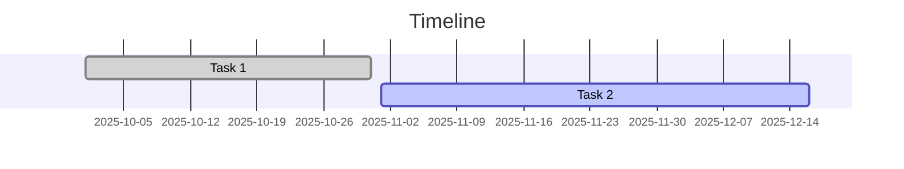
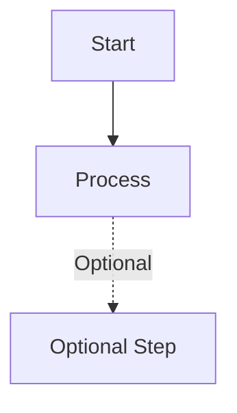

# Altair Visual Diagrams - Complete Index

**Version:** 1.0
**Last Updated:** October 2025
**Format:** Mermaid Markdown

---

## 📋 Quick Navigation

| Category | File | Best For |
|----------|------|----------|
| **System Design** | [01-system-architecture.md](01-system-architecture.md) | Understanding overall system |
| **Database** | [02-database-schema-erd.md](02-database-schema-erd.md) | Database design and queries |
| **User Experience** | [03-user-flows.md](03-user-flows.md) | UX/UI design and flows |
| **Planning** | [04-roadmap-planning.md](04-roadmap-planning.md) | Project management |
| **Implementation** | [05-component-architecture.md](05-component-architecture.md) | Development reference |
| **Operations** | [06-deployment-operations.md](06-deployment-operations.md) | DevOps and deployment |

---

## 🎯 By Use Case

### I'm a Developer
**Start here:**
1. [System Architecture](01-system-architecture.md) - Understand the stack
2. [Database Schema](02-database-schema-erd.md) - See data models
3. [Component Architecture](05-component-architecture.md) - Dive into code structure

**Then explore:**
- User flows for feature implementation
- Deployment diagrams for local setup

### I'm a Project Manager
**Start here:**
1. [Roadmap & Planning](04-roadmap-planning.md) - See timeline and priorities
2. [User Flows](03-user-flows.md) - Understand user experience
3. [Feature Dependencies](04-roadmap-planning.md#feature-dependency-graph) - Plan sprints

**Then explore:**
- Component architecture for technical discussions
- System architecture for infrastructure planning

### I'm a Designer
**Start here:**
1. [User Flows](03-user-flows.md) - See all user journeys
2. [ADHD Features Mindmap](04-roadmap-planning.md#adhd-features-mindmap) - Design principles
3. [Error Handling](03-user-flows.md#error-recovery-flow-adhd-friendly) - Edge cases

**Then explore:**
- Component hierarchy for UI structure
- Gamification flows for engagement

### I'm a DevOps Engineer
**Start here:**
1. [Deployment Options](06-deployment-operations.md) - See deployment strategies
2. [Monitoring Stack](06-deployment-operations.md#monitoring--observability-stack) - Observability setup
3. [CI/CD Pipeline](05-component-architecture.md#cicd-pipeline) - Build pipeline

**Then explore:**
- Backup strategy
- Scaling plans
- Security monitoring

### I'm New to the Project
**Recommended path:**
1. **Overview** → [System Architecture - High Level](01-system-architecture.md#high-level-system-architecture)
2. **Tech Stack** → [Technology Stack Visual](01-system-architecture.md#technology-stack-visual)
3. **Timeline** → [Development Timeline](04-roadmap-planning.md#development-timeline-gantt-chart)
4. **First Task** → [Quick Start Guide](../QUICK_START.md)

---

## 📊 Complete Diagram Catalog

### File 01: System Architecture
**Focus:** High-level system design and component interactions

| Diagram | Type | Purpose |
|---------|------|---------|
| High-Level System Architecture | Component Diagram | See all major components |
| Detailed Component Architecture | Component Diagram | Frontend/Backend breakdown |
| Network Flow & Communication | Sequence Diagram | HTTP request lifecycle |
| Deployment Architecture | Deployment Diagram | Docker Compose setup |
| Authentication Flow | Sequence Diagram | JWT auth process |
| Technology Stack Visual | Mindmap | All technologies used |
| Data Flow: Task Creation with AI | Flowchart | Task creation process |
| Offline Sync Strategy | State Diagram | Sync state machine |
| Module Dependencies | Dependency Graph | Backend module relationships |
| Security Layers | Flowchart | Security checkpoints |

**Key Takeaways:**
- FastAPI + Flutter + PostgreSQL stack
- Offline-first architecture
- Modular monolith design
- JWT-based authentication

---

### File 02: Database Schema & ERD
**Focus:** Data model and database design

| Diagram | Type | Purpose |
|---------|------|---------|
| Entity Relationship Diagram | ERD | Full database schema |
| Database Schema with Details | Class Diagram | Tables with methods |
| Table Indexes | Tree Diagram | Index strategy |
| ADHD-Specific Fields Detail | Mindmap | Special metadata fields |
| Sample Data Relationships | Graph | Example data structure |
| Query Patterns | Sequence Diagram | Common queries |
| Migration Strategy | Timeline | Version progression |
| Data Retention & Archival | State Diagram | Data lifecycle |

**Key Takeaways:**
- UUID primary keys throughout
- JSONB for ADHD metadata flexibility
- Soft deletes with timestamps
- Composite indexes for performance

---

### File 03: User Flows
**Focus:** How users interact with features

| Diagram | Type | Purpose |
|---------|------|---------|
| Quick Task Capture Flow | Flowchart | ADHD-optimized capture |
| AI Task Breakdown Journey | Flowchart | AI-assisted decomposition |
| Focus Mode Session Flow | State Diagram | Focus session lifecycle |
| Time Tracking User Flow | Sequence Diagram | Timer interactions |
| Project Dashboard Navigation | Flowchart | Navigation patterns |
| Mobile Quick Capture Widget | Flowchart | Mobile widget flow |
| First-Time User Onboarding | Flowchart | New user experience |
| Task Status Lifecycle | State Diagram | Task state transitions |
| Gamification Progress Flow | Flowchart | Achievement system |
| Error Recovery Flow | Flowchart | ADHD-friendly errors |

**Key Takeaways:**
- 1-2 click actions everywhere
- Instant feedback on all actions
- Graceful error recovery
- Context preservation on interruptions

---

### File 04: Roadmap & Planning
**Focus:** Project timeline and feature priorities

| Diagram | Type | Purpose |
|---------|------|---------|
| Development Timeline | Gantt Chart | Full project timeline |
| Feature Priority Matrix | Quadrant Chart | Impact vs Effort |
| Feature Dependency Graph | Dependency Graph | Build order |
| ADHD Features Mindmap | Mindmap | All ADHD features |
| Dogfooding Milestone Map | User Journey | Self-use progression |
| Technology Decision Tree | Decision Tree | Tech choices |
| Development Phases Breakdown | Timeline | Phase details |
| Sprint Planning Template | Flowchart | Sprint structure |
| Community Growth Strategy | Flowchart | User acquisition |
| Risk Mitigation Map | Mindmap | Risks and solutions |
| API Development Progress | Status Graph | Endpoint tracking |

**Key Takeaways:**
- Dogfooding drives development
- 5 major phases over 1.5 years
- ADHD features in Phase 2
- Community-first approach

---

### File 05: Component Architecture
**Focus:** Technical implementation details

| Diagram | Type | Purpose |
|---------|------|---------|
| Frontend Component Hierarchy | Tree Diagram | Flutter widget tree |
| Flutter State Management Flow | Sequence Diagram | Riverpod data flow |
| Backend Request Lifecycle | Flowchart | API request handling |
| Offline-First Data Sync | Architecture Diagram | Sync architecture |
| Conflict Resolution Strategy | Flowchart | Merge conflicts |
| AI Task Breakdown Architecture | Flowchart | AI integration |
| Authentication & Security Flow | Sequence Diagram | Auth process |
| Docker Compose Dependencies | Dependency Graph | Service dependencies |
| Testing Strategy Pyramid | Pyramid Diagram | Test layers |
| CI/CD Pipeline | Flowchart | Build and deploy |
| Database Connection Pooling | Architecture Diagram | Connection management |
| Error Handling Flow | Flowchart | Error processing |

**Key Takeaways:**
- Riverpod for state management
- Offline-first with optimistic updates
- Comprehensive testing strategy
- Automated CI/CD pipeline

---

### File 06: Deployment & Operations
**Focus:** Production deployment and monitoring

| Diagram | Type | Purpose |
|---------|------|---------|
| Self-Hosting Deployment Options | Architecture Diagram | Deployment choices |
| Deployment Workflow | Flowchart | Deploy process |
| Production Infrastructure | Architecture Diagram | Full production stack |
| Monitoring & Observability Stack | Architecture Diagram | Monitoring setup |
| Key Metrics Dashboard Layout | Dashboard Layout | Metrics to track |
| Backup Strategy | Flowchart | Backup process |
| Security Monitoring | Flowchart | Security events |
| Scaling Strategy | Flowchart | Growth path |
| Performance Optimization Areas | Mindmap | Optimization targets |
| Incident Response Flow | Flowchart | Handle incidents |
| Cost Optimization Strategy | Flowchart | Reduce costs |

**Key Takeaways:**
- Start with single-server Docker Compose
- Prometheus + Grafana monitoring
- Daily backups with 30-day retention
- Horizontal scaling when needed

---

## 🎨 Diagram Types Reference

### Flowcharts
**Best for:** Processes, decision trees, workflows
**Examples:** Task capture, AI breakdown, error handling



### Sequence Diagrams
**Best for:** Time-based interactions, API calls
**Examples:** Authentication, time tracking, sync



### State Diagrams
**Best for:** State machines, lifecycles
**Examples:** Task status, focus sessions, sync states



### ERD (Entity Relationship)
**Best for:** Database schemas
**Examples:** Full database design



### Mindmaps
**Best for:** Hierarchical concepts, features
**Examples:** ADHD features, tech stack, optimization areas



### Gantt Charts
**Best for:** Timelines, project schedules
**Examples:** Development roadmap



---

## 🛠️ Working with These Diagrams

### Viewing Diagrams

**Option 1: GitHub** (Recommended)
- View .md files directly on GitHub
- Diagrams render automatically
- No setup required

**Option 2: VS Code**
```bash
# Install extension
ext install bierner.markdown-mermaid

# Open any .md file
# Preview with: Ctrl+Shift+V (Cmd+Shift+V on Mac)
```

**Option 3: Mermaid Live Editor**
- Go to https://mermaid.live
- Copy/paste diagram code
- Renders instantly
- Can export PNG/SVG

**Option 4: Obsidian**
- Open diagrams folder as vault
- Native Mermaid support
- Great for linking between diagrams

### Exporting Diagrams

**To PNG/SVG:**
```bash
# Install mermaid-cli
npm install -g @mermaid-js/mermaid-cli

# Export diagram
mmdc -i diagram.mmd -o diagram.png
mmdc -i diagram.mmd -o diagram.svg
```

**Online Export:**
1. Open https://mermaid.live
2. Paste diagram code
3. Click "Export" → Choose format

### Editing Diagrams

**Tips:**
1. Use consistent indentation (2 or 4 spaces)
2. Add comments with `%% Comment text`
3. Test changes in live editor first
4. Keep diagrams under 50 nodes for readability
5. Use subgraphs to organize complex diagrams

**Example:**


---

## 📚 Additional Resources

### Mermaid Documentation
- **Official Docs:** https://mermaid.js.org/
- **Syntax Reference:** https://mermaid.js.org/intro/syntax-reference.html
- **Examples:** https://mermaid.js.org/ecosystem/integrations.html

### Diagram Best Practices
1. **Keep it simple** - One concept per diagram
2. **Use color sparingly** - Only for emphasis
3. **Label everything** - No mystery boxes
4. **Show direction** - Use arrows consistently
5. **Group related items** - Use subgraphs

### Altair-Specific Conventions

**Colors:**
- Blue (`#60A5FA`) - Primary actions, normal flow
- Green (`#14B8A6`) - Success, completion, data stores
- Orange (`#FB923C`) - Important steps, AI features
- Red (`#EF4444`) - Errors, failures, critical paths

**Shapes:**
- Rectangles - Processes, actions
- Diamonds - Decisions
- Cylinders - Databases
- Circles - Start/end points

---

## 🔄 Keeping Diagrams Updated

### When to Update

**Update diagrams when:**
- Architecture changes
- New features added
- Tech stack modified
- Processes change
- User flows evolve

### Update Process

1. **Identify affected diagrams**
2. **Update diagram code**
3. **Test rendering**
4. **Update this index if needed**
5. **Commit changes with message:**
   ```
   docs(diagrams): update [diagram name] for [reason]
   ```

### Version Control

All diagrams are:
- Version controlled in git
- Stored as plaintext (.md)
- Easy to diff and review
- Automatically rendered on GitHub

---

## 🤝 Contributing Diagrams

Want to add or improve diagrams?

1. **Create new .md file** in `/diagrams/` folder
2. **Use Mermaid syntax** (see examples above)
3. **Follow naming:** `##-descriptive-name.md`
4. **Update this index** with new diagram
5. **Submit PR** with clear description

**Diagram Checklist:**
- [ ] Renders correctly in Mermaid Live Editor
- [ ] Uses Altair color scheme
- [ ] Includes title and labels
- [ ] Has clear purpose statement
- [ ] Added to this index
- [ ] Linked from relevant docs

---

## 📞 Questions?

- **Mermaid syntax issues:** Check https://mermaid.js.org/
- **Diagram requests:** Open GitHub issue with "diagram:" label
- **General questions:** See [CONTRIBUTING.md](../CONTRIBUTING.md)

---

**Happy diagramming!** 📊

These visual aids are here to make Altair easier to understand, build, and use. If something's unclear, let's make it visual!

---

**Last Updated:** October 2025
**Diagrams:** 80+ across 6 files
**Lines of Mermaid Code:** ~3,000
