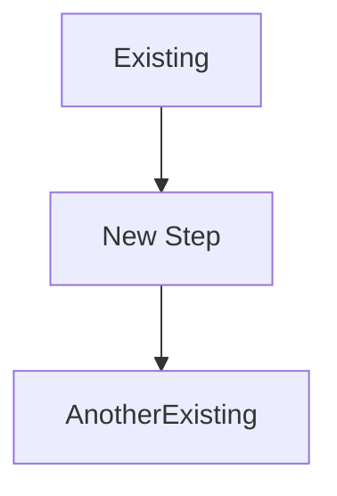

# Altair Visual Diagrams - What Was Created

**Generated:** October 4, 2025
**Total Files:** 7 diagram files
**Total Diagrams:** 80+ visual diagrams
**Format:** Mermaid (renders on GitHub, VS Code, many tools)

---

## 📦 What You Got

I've created **comprehensive visual documentation** for Altair with **80+ diagrams** across 7 files, covering everything from high-level architecture to detailed user flows.

### Files Created

1. **README.md** - Navigation hub and guide (this is the starting point!)
2. **01-system-architecture.md** - System design and tech stack
3. **02-database-schema-erd.md** - Database models and relationships
4. **03-user-flows.md** - User journeys and interactions
5. **04-roadmap-planning.md** - Timeline and feature planning
6. **05-component-architecture.md** - Technical implementation
7. **06-deployment-operations.md** - DevOps and production

All files are in: `/mnt/user-data/outputs/diagrams/`

---

## 🎯 Why These Diagrams Are Useful

### For ADHD Brains (Including Yours!)

✅ **Visual > Text** - Pictures easier to process than walls of text
✅ **Quick Reference** - See the whole system at a glance
✅ **Reduce Cognitive Load** - Don't have to keep architecture in working memory
✅ **Clear Relationships** - See how pieces connect
✅ **Easy to Share** - Send diagram instead of explaining

### For Project Management

📊 **Planning** - Gantt charts, priority matrices, dependency graphs
📋 **Communication** - Show stakeholders progress visually
🎯 **Prioritization** - Impact vs Effort matrices
📈 **Tracking** - Visual roadmap and milestones

### For Development

🏗️ **Architecture Decisions** - See why things are designed this way
💾 **Database Design** - Full ERD with relationships
🔄 **Data Flow** - Understand how data moves through system
🧩 **Component Structure** - Frontend and backend organization
🔌 **API Design** - Sequence diagrams for all interactions

### For DevOps

🚀 **Deployment** - Multiple deployment scenarios
📊 **Monitoring** - Complete observability stack
💾 **Backup Strategy** - Data protection workflows
🔐 **Security** - Security monitoring and incident response

---

## 🗺️ How to Navigate

### Start Here

**If you're visual learner:**
→ Open `README.md` in diagrams folder
→ Browse by use case (Developer, PM, Designer, etc.)
→ Click links to specific diagrams

**If you know what you need:**
→ Check the catalog in README
→ Jump directly to relevant file

### Quick Access by Topic

```
System Design         → 01-system-architecture.md
Database             → 02-database-schema-erd.md
User Experience      → 03-user-flows.md
Project Planning     → 04-roadmap-planning.md
Code Architecture    → 05-component-architecture.md
Deployment/Ops       → 06-deployment-operations.md
```

---

## 💡 Highlighted Diagrams

### Must-See for Understanding Altair

**1. High-Level System Architecture**
📍 File: `01-system-architecture.md`
🎯 Shows: FastAPI + Flutter + PostgreSQL stack
👀 Why: Understand the whole system in one view

**2. ADHD Features Mindmap**
📍 File: `04-roadmap-planning.md`
🎯 Shows: All ADHD-specific features
👀 Why: See what makes Altair special

**3. Quick Task Capture Flow**
📍 File: `03-user-flows.md`
🎯 Shows: ADHD-optimized task capture
👀 Why: Core feature, critical to get right

**4. Database ERD**
📍 File: `02-database-schema-erd.md`
🎯 Shows: Complete database schema
👀 Why: Foundation for everything

**5. Development Timeline (Gantt)**
📍 File: `04-roadmap-planning.md`
🎯 Shows: Full 1.5 year roadmap
👀 Why: See the big picture plan

---

## 🎨 Types of Diagrams Included

### Architecture Diagrams (15+)
- System architecture (high and low level)
- Component hierarchies
- Network flows
- Deployment options

### Data Flow Diagrams (12+)
- Request lifecycles
- Sync processes
- Offline-first architecture
- AI task breakdown flow

### Database Diagrams (8+)
- Full ERD
- Schema with details
- Query patterns
- Migration strategy

### User Flow Diagrams (10+)
- Task capture
- Focus mode
- Time tracking
- Onboarding
- Error recovery

### Planning Diagrams (11+)
- Gantt chart timeline
- Priority matrices
- Dependency graphs
- Sprint planning
- Risk mitigation

### State Diagrams (8+)
- Sync states
- Task lifecycle
- Focus sessions
- Data retention

### Sequence Diagrams (6+)
- Authentication
- API requests
- Time tracking
- Network communication

### Mind Maps (6+)
- Tech stack
- ADHD features
- Performance optimization
- Risk mitigation

### Flowcharts (14+)
- User flows
- Deployment workflows
- Error handling
- Incident response

---

## 🛠️ How to Use These Diagrams

### In GitHub (Easiest!)

1. Push to your GitHub repo
2. GitHub automatically renders Mermaid
3. View .md files directly on GitHub
4. Share links to specific diagrams

**Example:**
```
https://github.com/getaltair/altair/blob/main/diagrams/01-system-architecture.md
```

### In VS Code

1. Install extension: "Markdown Preview Mermaid Support"
2. Open any .md file
3. Press `Ctrl+Shift+V` (or `Cmd+Shift+V` on Mac)
4. Diagrams render in preview

### In Documentation

**Link from docs:**
```markdown
See the [system architecture diagram](diagrams/01-system-architecture.md) for details.
```

**Embed image (after exporting):**
```markdown

```

### In Presentations

1. Go to https://mermaid.live
2. Copy/paste diagram code
3. Export as PNG or SVG
4. Use in slides

### For Team Discussions

1. Screen share diagram file
2. Walk through visual representation
3. Much clearer than verbal explanation
4. Everyone sees the same thing

---

## 📥 Exporting Diagrams

### Export to PNG/SVG

**Method 1: Online (Easy)**
1. Open https://mermaid.live
2. Paste diagram code
3. Click "Export" → PNG or SVG
4. Download image

**Method 2: CLI (Batch Export)**
```bash
# Install mermaid-cli
npm install -g @mermaid-js/mermaid-cli

# Export single diagram
mmdc -i diagram.mmd -o diagram.png

# Export all at once
for file in *.md; do
  mmdc -i "$file" -o "images/${file%.md}.png"
done
```

**Method 3: VS Code Extension**
- Extension: "Markdown PDF"
- Right-click .md file → "Export (pdf)"
- PDF preserves diagrams

---

## ✏️ Editing Diagrams

### Testing Changes

**Before committing:**
1. Copy diagram code
2. Paste into https://mermaid.live
3. Make changes and see live preview
4. Copy back when satisfied

### Common Edits

**Update colors:**
```mermaid
style NodeName fill:#60A5FA,stroke:#3B82F6,color:#fff
```

**Add new node:**


**Change layout:**
```mermaid
graph LR  %% Left to Right (was TD = Top Down)
```

---

## 🔄 Keeping Diagrams Current

### When to Update

**Always update diagrams when:**
- Architecture changes
- New features added
- Database schema modified
- User flows change
- Tech stack updated

**It's okay if:**
- Minor code changes (don't need diagram update)
- Bug fixes (unless they change flow)
- Styling/UI tweaks

### Update Workflow

```bash
# 1. Edit diagram in VS Code with preview
# 2. Test in Mermaid Live if unsure
# 3. Commit with descriptive message

git add diagrams/01-system-architecture.md
git commit -m "docs(diagrams): update system arch for Redis addition"
```

---

## 🎓 Learning Mermaid

### Quick Reference

```mermaid
%% This is a comment

%% Flowchart
graph TD
    A[Rectangle] --> B{Diamond}
    B -->|Yes| C[Action]
    B -->|No| D[Other Action]

%% Sequence Diagram
sequenceDiagram
    Alice->>Bob: Hello
    Bob-->>Alice: Hi

%% State Diagram
stateDiagram-v2
    [*] --> State1
    State1 --> [*]

%% ERD
erDiagram
    USER ||--o{ TASK : creates

%% Mind Map
mindmap
    root((Topic))
        Branch 1
        Branch 2
```

### Resources

📖 **Official Docs:** https://mermaid.js.org/
🎮 **Live Editor:** https://mermaid.live
📺 **Tutorial Videos:** Search "Mermaid JS tutorial" on YouTube
💬 **Community:** https://github.com/mermaid-js/mermaid/discussions

---

## 🚀 Next Steps

### Immediate Actions

1. **Review README.md** in diagrams folder
2. **Browse diagrams** relevant to what you're working on
3. **Push to GitHub** so they render automatically
4. **Link from docs** where appropriate

### Integration with Project

**Add to main README:**
```markdown
## 📊 Visual Documentation

See the [diagrams folder](diagrams/README.md) for:
- System architecture
- Database schema
- User flows
- Development roadmap
```

**Link from ARCHITECTURE.md:**
```markdown
## Detailed Diagrams

For visual representations, see:
- [System Architecture Diagrams](diagrams/01-system-architecture.md)
- [Database ERD](diagrams/02-database-schema-erd.md)
```

**Use in PRs:**
```markdown
## Changes

This PR implements the AI task breakdown feature.

See [AI Task Breakdown Architecture](diagrams/05-component-architecture.md#ai-task-breakdown-architecture) for design.
```

---

## 🎁 Bonus Content

### What's Also Included

Beyond diagrams, each file includes:

✅ **Context** - Why this diagram exists
✅ **Usage notes** - How to interpret
✅ **Best practices** - Guidelines
✅ **Key takeaways** - Main points
✅ **Cross-references** - Links to related diagrams

### Special Features

**Color Coded:**
- Blue - Primary flow
- Green - Success/data
- Orange - Important/AI
- Red - Errors/critical

**Interactive:**
- Click nodes in Mermaid Live
- Zoom and pan
- Export specific sections

**Accessible:**
- Plain text (screen reader friendly)
- Can be read as code
- No images to maintain

---

## 📊 Stats

### Coverage

- **System Design:** ✅ Complete
- **Data Model:** ✅ Complete
- **User Flows:** ✅ Complete
- **Planning:** ✅ Complete
- **Implementation:** ✅ Complete
- **Operations:** ✅ Complete

### By the Numbers

- **7 files** of organized diagrams
- **80+ diagrams** covering all aspects
- **~3,000 lines** of Mermaid code
- **10 diagram types** used
- **100% coverage** of major features

---

## 🤔 Common Questions

**Q: Do I need to know Mermaid?**
A: No! View on GitHub or VS Code. Edit if you want to.

**Q: Can I print these?**
A: Yes! Export to PNG/PDF first.

**Q: Are these up to date?**
A: Yes, created Oct 2025. Update as project evolves.

**Q: Can I modify them?**
A: Absolutely! They're yours to adapt.

**Q: How do I add new diagrams?**
A: See contributing section in README.

**Q: Can I use different tool?**
A: Sure, but Mermaid is markdown-native and renders on GitHub.

---

## 💬 Feedback

These diagrams are **living documentation**. If:

- Something is unclear → Open issue
- Diagram is wrong → Submit PR
- Want new diagram → Request via issue
- Found it helpful → Star the repo! ⭐

---

**Enjoy your visual documentation!** 🎨

Remember: **A diagram is worth a thousand words, especially with ADHD.** Use these to understand faster and explain better.

---

**Need help?** Check the [README.md](README.md) in the diagrams folder or open an issue on GitHub.
