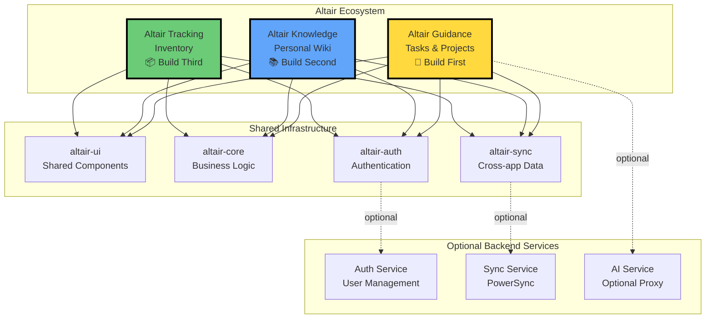
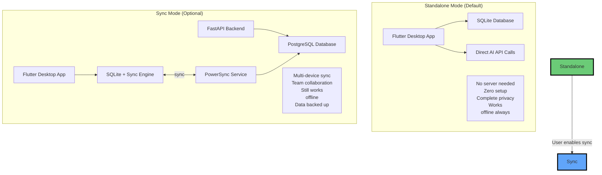
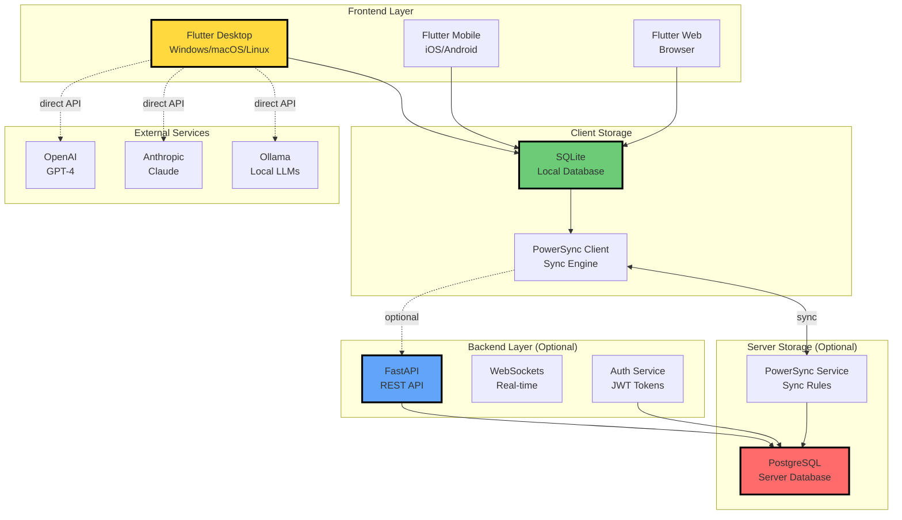
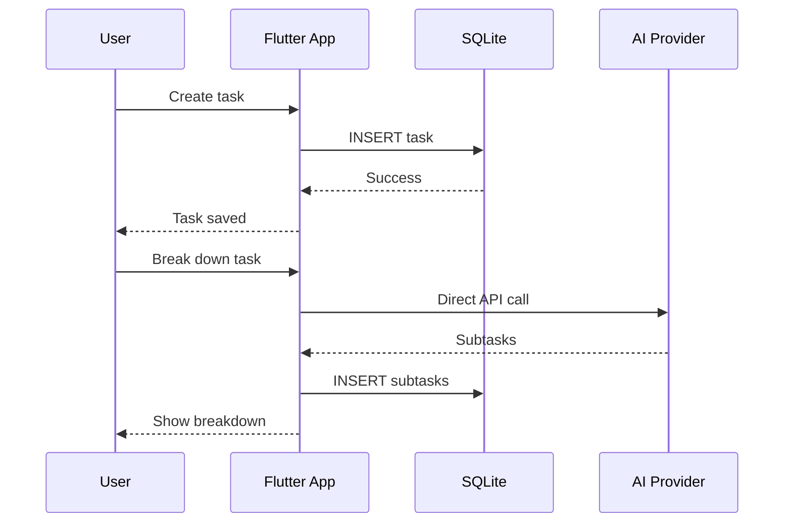
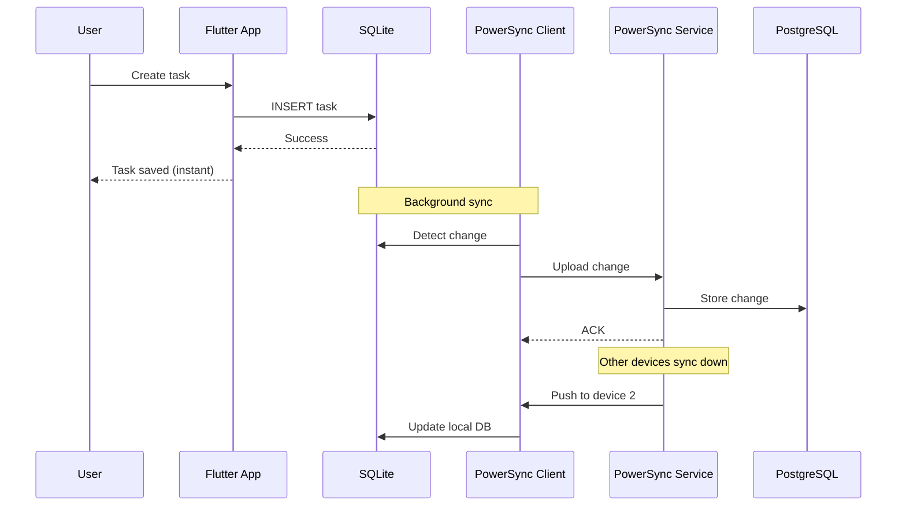
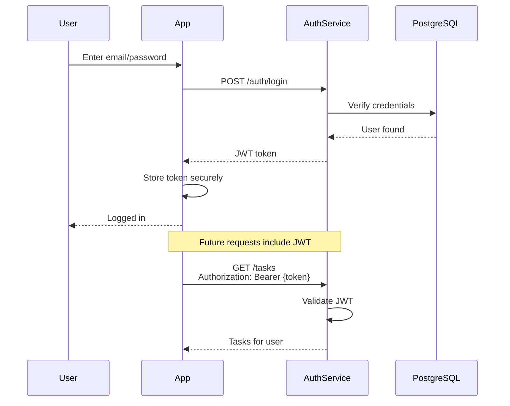

# Altair Architecture Overview

> **For:** Developers
> **Focus:** How things work

---

## ⚡ TL;DR - The Whole System in 30 Seconds

**What is Altair?** Three focused apps for ADHD project management that work
offline-first.

**Core principle:** Local-first → Download, run, done. No server required.
Add sync later if you want.

**Tech stack:** Flutter (frontend) + FastAPI (backend) + SQLite (local) +
PostgreSQL (server) + PowerSync (sync)

**Three apps:**

1. **Guidance** - Tasks & projects
2. **Knowledge** - Personal wiki
3. **Tracking** - Inventory management

**Key insight:** Each app is a standalone desktop application. Sync is
optional, not required.

---

## 🎯 Three-App Ecosystem



**Why three apps?**

- ✅ Each does one thing excellently
- ✅ Adopt incrementally (start with Guidance)
- ✅ Reduced cognitive overwhelm
- ✅ Can dogfood Guidance while building others
- ✅ Independent release cycles

**How they connect:**

- Shared UI components (consistent look & feel)
- Shared auth (one login for all)
- Cross-app sync (tasks can link to wiki pages)
- Independent databases (can run separately)

---

## 🏠 Local-First vs Sync Architecture



### Standalone Mode (Download & Run)

**What you get:**

- Single installer/executable
- Embedded SQLite database
- Direct API calls to OpenAI/Anthropic/Ollama
- No configuration required

**User experience:**

```text
Download → Double-click → Running
```

**Size:** ~200MB per app (includes everything)

### Sync Mode (Multi-Device)

**What you add:**

- FastAPI backend (can run locally or cloud)
- PostgreSQL database
- PowerSync sync engine
- Multi-device support

**User experience:**

```text
Enable sync → Enter server URL → Auto-sync
```

**Deployment:** Docker Compose one-liner

---

## 🛠️ Technology Stack & Relationships



### Component Breakdown

#### Flutter (Frontend)

- Cross-platform UI framework
- Compiles to native code (fast!)
- Shared codebase for desktop/mobile/web
- Neo-brutalist design system

#### SQLite (Local Storage)

- In-process database (no server needed)
- Embedded in app
- Lightning fast
- ACID guarantees

#### PowerSync (Sync Engine)

- Client-side: Manages local SQLite sync state
- Server-side: Sync rules & conflict resolution
- Checkpoint-based consistency
- Works offline, syncs when online

#### FastAPI (Backend)

- Python web framework
- Fast & async
- Auto-generated API docs
- Optional: can embed in desktop app

#### PostgreSQL (Server Storage)

- Production-grade SQL database
- Powers sync in multi-device mode
- Only needed if using sync

#### AI Providers

- Direct API calls (no proxy)
- User controls API keys
- Supports: OpenAI, Anthropic, Ollama (local)
- Optional team proxy for shared features

---

## 🔧 How the Pieces Fit Together

### Standalone Workflow (Default)



**Key points:**

- Everything happens locally
- No network required (except AI calls)
- Instant response
- Data never leaves device

### Sync Workflow (Multi-Device)



**Key points:**

- Local write is instant (no waiting)
- Sync happens in background
- Conflicts resolved automatically
- Works offline, syncs when connected

### Repository Structure (Practical)

```text
altair/
├── apps/
│   ├── altair-guidance/          # Task management app
│   │   ├── lib/
│   │   │   ├── features/         # Feature-based modules
│   │   │   ├── main.dart         # App entry point
│   │   │   └── router.dart       # Navigation
│   │   └── pubspec.yaml
│   │
│   ├── altair-knowledge/         # Wiki app
│   └── altair-tracking/          # Inventory app
│
├── packages/
│   ├── altair-ui/                # Shared UI components
│   │   ├── lib/
│   │   │   ├── components/       # Buttons, inputs, etc.
│   │   │   ├── theme/            # Neo-brutalist theme
│   │   │   └── widgets/          # ADHD-specific widgets
│   │   └── pubspec.yaml
│   │
│   ├── altair-core/              # Business logic
│   │   ├── lib/
│   │   │   ├── models/           # Data models
│   │   │   ├── repositories/     # Data access
│   │   │   └── services/         # Business logic
│   │   └── pubspec.yaml
│   │
│   ├── altair-auth/              # Authentication
│   └── altair-sync/              # Sync logic
│
├── services/
│   ├── auth-service/             # FastAPI auth
│   ├── sync-service/             # PowerSync config
│   └── ai-service/               # Optional AI proxy
│
└── infrastructure/
    ├── docker-compose.yml        # Full stack deployment
    ├── postgres/                 # DB schemas
    └── nginx/                    # Reverse proxy
```

**Development workflow:**

1. Work in `apps/altair-guidance/` for features
2. Extract shared code to `packages/` when reused
3. Backend in `services/` only if needed
4. Deploy with `docker-compose.yml`

---

## 🎨 Key Architecture Decisions (Quick Reference)

### Local-First Architecture

- ✅ **Default mode:** Standalone (no server)
- ✅ **Sync:** Optional enhancement, not requirement
- ✅ **Why:** Zero friction adoption, complete privacy
- ✅ **Trade-off:** More complex sync logic

### Database Choice

- ✅ **Local:** SQLite (embedded, battle-tested)
- ✅ **Server:** PostgreSQL (production-grade)
- ✅ **Sync:** PowerSync (500 lines vs 10,000 custom)
- ❌ **Rejected:** SurrealDB (no sync, can't embed)

### Three-App Split

- ✅ **Guidance:** Tasks & projects ✅ **COMPLETE**
- ⏳ **Knowledge:** Personal wiki ⏳ **IN PLANNING**
- ⏳ **Tracking:** Inventory ⏳ **PLANNED**
- ✅ **Why:** Focus, incremental adoption, dogfooding
- ✅ **Trade-off:** More repos, shared code complexity

### Direct AI API Calls

- ✅ **Client → AI provider** (no proxy)
- ✅ **Why:** Lower latency, user controls keys, privacy
- ✅ **Optional proxy:** For team features only
- ✅ **Providers:** OpenAI, Anthropic, Ollama

### Neo-Brutalist UI

- ✅ **Thick borders** (3px minimum)
- ✅ **High contrast** colors
- ✅ **No gradients** or soft shadows
- ✅ **Why:** ADHD-friendly clarity, instant state feedback

---

## 🚀 Getting Started (For Developers)

### Running Guidance App (Standalone)

```bash
# Clone repo
git clone https://github.com/getaltair/altair.git
cd altair/apps/altair-guidance

# Get dependencies
flutter pub get

# Run app
flutter run -d macos  # or windows, linux
```

**What happens:**

- SQLite database created at `~/altair/guidance.db`
- App runs entirely offline
- No backend needed

### Running with Sync (Full Stack)

```bash
# From repo root
cd infrastructure

# Start backend services
docker-compose up -d

# Run Flutter app with sync enabled
cd ../apps/altair-guidance
flutter run -d macos --dart-define=SYNC_ENABLED=true
```

**What runs:**

- FastAPI backend (port 8000)
- PostgreSQL (port 5432)
- PowerSync service (port 8080)
- Nginx reverse proxy (port 80)

### Development Priorities

#### Phase 1: Altair Guidance ✅ **COMPLETE**

1. ✅ Auth + SQLite schemas + Infrastructure
2. ✅ Core task management + UI components
3. ✅ AI features + dogfooding + installers

**Focus areas:**

- Quick capture (< 3 seconds thought to save)
- Task breakdown (AI-powered)
- Time tracking (visual, ADHD-friendly)
- Offline-first (works without internet)

---

## 📊 Data Flow Examples

### Creating a Task (Standalone)

```dart
// User taps "Quick capture"
final task = Task(
  title: "Buy groceries",
  createdAt: DateTime.now(),
);

// Saved to local SQLite instantly
await taskRepository.create(task);

// Done! No network, no waiting
```

### Creating a Task (Sync Mode)

```dart
// User taps "Quick capture"
final task = Task(
  title: "Buy groceries",
  createdAt: DateTime.now(),
);

// Still saved to local SQLite instantly
await taskRepository.create(task);

// PowerSync automatically syncs in background
// User doesn't wait - just continues working

// On other devices:
// PowerSync pulls changes within 5 seconds
// Conflicts resolved automatically
```

### AI Task Breakdown

```dart
// User: "Plan birthday party"
// App calls AI directly (no proxy)

final response = await openAiClient.chat([
  Message(role: 'system', content: 'Break down tasks...'),
  Message(role: 'user', content: 'Plan birthday party'),
]);

// AI returns subtasks
// App saves to SQLite
// Syncs to other devices (if enabled)
```

---

## 🔐 Authentication Flow

### Standalone Mode

```text
No auth needed!
App just runs.
```

### Sync Mode



**Key points:**

- JWT tokens (standard, secure)
- Stored in secure storage (Keychain/Credential Manager)
- Refresh tokens for long sessions
- Optional: Can disable auth for single-user deployments

---

## 🎯 Performance Targets

| Metric              | Target      | Why                      |
| ------------------- | ----------- | ------------------------ |
| Thought to capture  | < 3 seconds | Prevent thought loss     |
| Page load           | < 1 second  | Maintain focus           |
| Task breakdown (AI) | < 5 seconds | Strike while motivated   |
| Search results      | < 500ms     | Instant gratification    |
| Sync propagation    | < 5 seconds | Multi-device consistency |
| Offline to online   | Seamless    | No interruption          |

**ADHD-specific optimizations:**

- Instant local saves (no spinners)
- Background sync (no waiting)
- Visual progress indicators
- Optimistic UI updates

---

## 🐛 Common Patterns

### Feature Module Structure

```text
lib/features/tasks/
├── data/
│   ├── models/          # Task model
│   ├── repositories/    # TaskRepository
│   └── data_sources/    # SQLite, API
├── domain/
│   ├── entities/        # Task entity
│   └── use_cases/       # CreateTask, DeleteTask
└── presentation/
    ├── pages/           # TaskListPage
    ├── widgets/         # TaskCard
    └── bloc/            # TaskBloc (state management)
```

### Adding a New Feature

#### Example: Add task tags

1. **Update model** (`packages/altair-core/lib/models/task.dart`)

   ```dart
   class Task {
     final String id;
     final String title;
     final List<String> tags;  // ← Add this
   }
   ```

2. **Update SQLite schema** (`packages/altair-core/lib/database/schema.dart`)

   ```sql
   CREATE TABLE tasks (
     id TEXT PRIMARY KEY,
     title TEXT NOT NULL,
     tags TEXT  -- JSON array
   );
   ```

3. **Update repository** (`packages/altair-core/lib/repositories/task_repository.dart`)

   ```dart
   Future<void> addTag(String taskId, String tag) async {
     // Update SQLite
     // PowerSync syncs automatically
   }
   ```

4. **Update UI** (`apps/altair-guidance/lib/features/tasks/...`)
   - Add tag input widget
   - Display tags in task card
   - Filter by tags

5. **Done!** Sync works automatically via PowerSync

---

## 🔄 Sync Rules (PowerSync)

### How Sync Rules Work

PowerSync uses SQL-based rules to determine what data syncs to each device:

```sql
-- Sync user's own tasks
bucket_definitions:
  user_tasks:
    SELECT * FROM tasks
    WHERE user_id = token_user_id()

  shared_projects:
    SELECT * FROM projects
    WHERE token_user_id() IN members
```

**What this means:**

- User only downloads their own data
- Shared projects sync to all members
- Server enforces permissions
- Client never sees unauthorized data

### Conflict Resolution

**Last-write-wins (default):**

- Server timestamp determines winner
- Automatic, no user intervention
- Works for 99% of cases

**Custom resolution (when needed):**

```dart
// Example: Merge tag lists instead of overwriting
onConflict: (local, remote) {
  return Task(
    id: local.id,
    title: remote.title,  // Server wins
    tags: [...local.tags, ...remote.tags].toSet(),  // Merge
  );
}
```

---

## 📦 Deployment Options

### Standalone (No Setup)

**User downloads:**

- Windows: `altair-guidance-setup.exe`
- macOS: `Altair Guidance.dmg`
- Linux: `altair-guidance.AppImage`

**Runs immediately** - no configuration.

### Self-Hosted (Docker)

```bash
# One command
docker-compose up -d

# Services running:
# - FastAPI (8000)
# - PostgreSQL (5432)
# - PowerSync (8080)
# - Nginx (80)
```

**Cost:** ~$20-25/month (VPS)

### Cloud Hosted (Future)

- Render.com (recommended)
- Railway.app
- Vercel (frontend only)
- AWS/GCP (enterprise)

---

## 🎓 Learning Path for New Contributors

### Week 1: Explore

- Run Guidance app locally
- Create tasks, use AI breakdown
- Read this doc + architecture decisions doc

### Week 2: Small Change

- Fix a UI bug
- Add a keyboard shortcut
- Update documentation

### Week 3: Feature Addition

- Pick "good first issue"
- Add small feature (e.g., task tags)
- Submit PR

### Becoming a Core Contributor

- Implement larger features
- Work on Phase 2/3 apps
- Review PRs
- Help with architecture decisions

**Resources:**

- Architecture decisions: `/altair-architecture-decisions.md`
- Contributing guide: `/CONTRIBUTING.md` (TODO)
- Discord: Join for questions

---

## 🔑 Key Takeaways

1. **Local-first is king** - Apps work without server, sync is optional
2. **Three focused apps** - Guidance (tasks), Knowledge (wiki), Tracking (inventory)
3. **Proven tech** - SQLite + PostgreSQL + PowerSync (not experimental)
4. **Direct AI calls** - No proxy, user controls keys
5. **ADHD-optimized** - < 3 second captures, visual feedback, offline-first
6. **Progressive enhancement** - Start standalone, add sync when ready

**Next steps:**

- Read `/altair-architecture-decisions.md` for detailed rationale
- Run Guidance app locally
- Join Discord for questions
- Check issues for "good first issue" label

---

**Last updated:** October 17, 2025
**Maintained by:** Altair Core Team
**Questions?** Open an issue or ask in Discord
