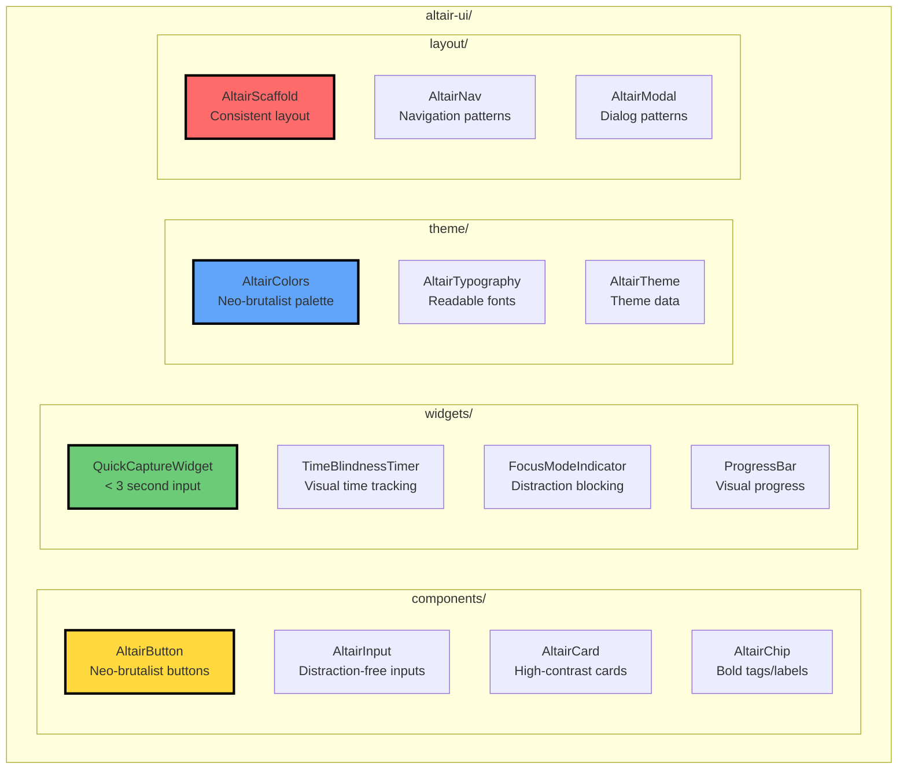
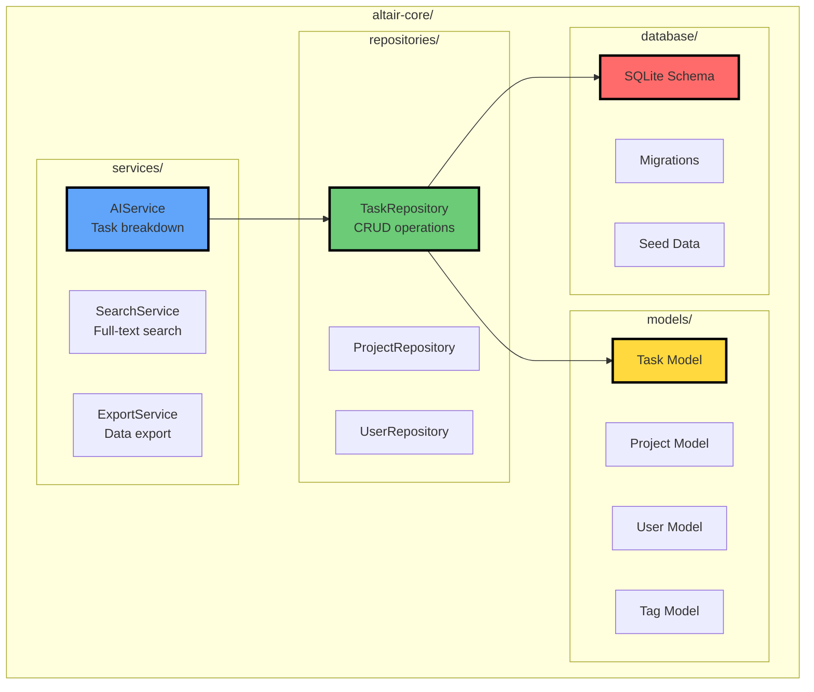
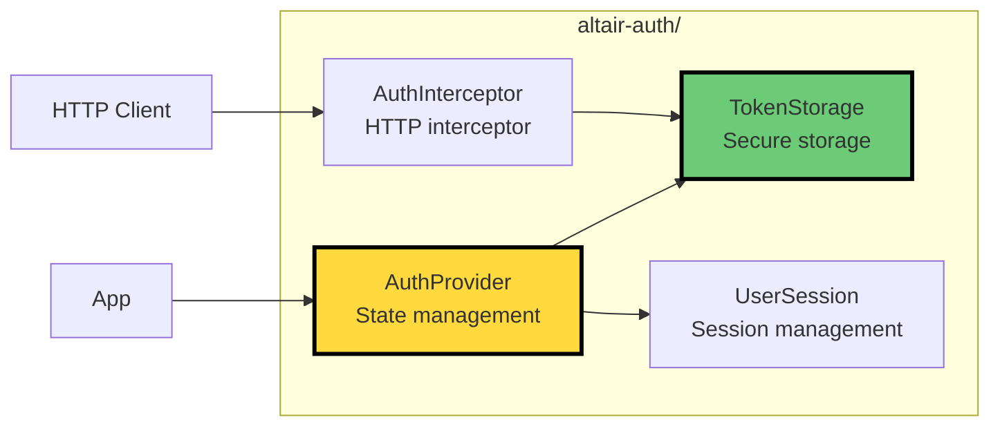
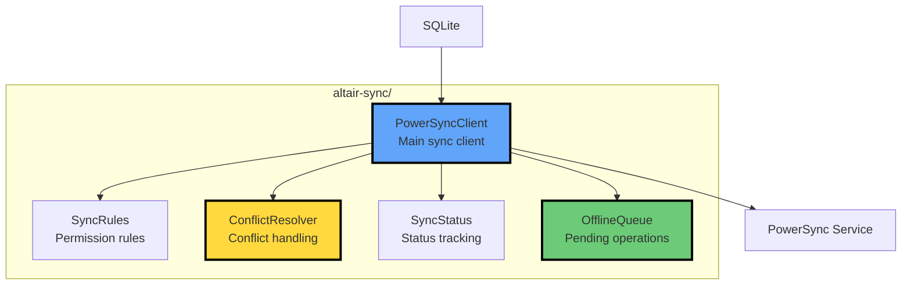
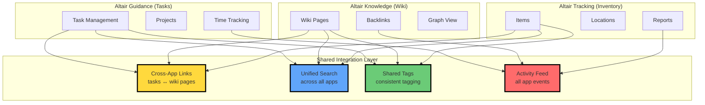
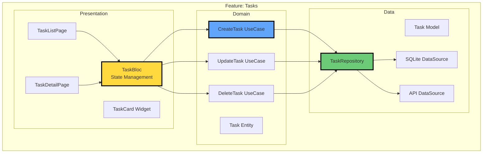
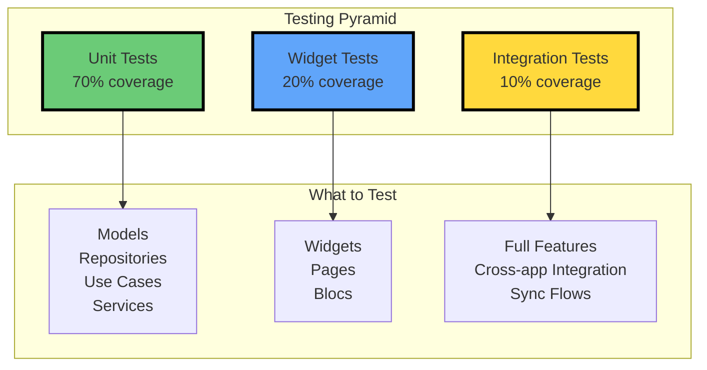

# Component Design

> **TL;DR:** Monorepo with three apps sharing Flutter packages (altair-ui, altair-core, altair-auth, altair-sync). Optional backend services (FastAPI). Everything designed for reusability and ADHD-friendly development.

## Quick Start

**What you need to know in 60 seconds:**

- **Monorepo structure**: Apps + packages + services in one repo
- **Shared packages**: UI components, business logic, auth, sync
- **Three apps**: Guidance, Knowledge, Tracking (all use shared code)
- **Backend services**: Optional FastAPI services for sync mode
- **Feature-based organization**: Each app organized by feature, not layer

**Navigation:**

- [Architecture Overview](./ARCHITECTURE-OVERVIEW.md) - System design
- [Data Flow](./DATA-FLOW.md) - How data moves through system
- [Deployment Guide](./DEPLOYMENT-GUIDE.md) - How to deploy
- [Development Roadmap](./DEVELOPMENT-ROADMAP.md) - Implementation timeline

---

## Repository Structure

Complete monorepo layout with all components.

```mermaid
graph TB
    subgraph "altair/ (root)"
        subgraph "apps/"
            G[altair-guidance/<br/>Task Management]
            K[altair-knowledge/<br/>Personal Wiki]
            T[altair-tracking/<br/>Inventory]
        end

        subgraph "packages/"
            UI[altair-ui/<br/>Shared Components]
            CORE[altair-core/<br/>Business Logic]
            AUTH[altair-auth/<br/>Authentication]
            SYNC[altair-sync/<br/>PowerSync Integration]
        end

        subgraph "services/"
            ASVC[auth-service/<br/>FastAPI Auth]
            SSVC[sync-service/<br/>PowerSync Backend]
            AISVC[ai-service/<br/>AI Proxy (Optional)]
        end

        subgraph "infrastructure/"
            DOCKER[docker/<br/>Compose Files]
            NGINX[nginx/<br/>Reverse Proxy]
            SCRIPTS[scripts/<br/>Deployment Automation]
        end
    end

    G --> UI
    G --> CORE
    G --> AUTH
    G --> SYNC

    K --> UI
    K --> CORE
    K --> AUTH
    K --> SYNC

    T --> UI
    T --> CORE
    T --> AUTH
    T --> SYNC

    SYNC -.->|optional| SSVC
    AUTH -.->|optional| ASVC

    style G fill:#FFD93D,stroke:#000,stroke-width:3px
    style K fill:#60A5FA,stroke:#000,stroke-width:3px
    style T fill:#6BCB77,stroke:#000,stroke-width:3px
    style UI fill:#FF6B6B,stroke:#000,stroke-width:2px
```

### Directory Tree

```text
altair/
├── apps/
│   ├── altair-guidance/          # Task & project management
│   │   ├── lib/
│   │   │   ├── features/
│   │   │   │   ├── tasks/
│   │   │   │   ├── projects/
│   │   │   │   ├── ai/
│   │   │   │   └── focus/
│   │   │   ├── main.dart
│   │   │   └── router.dart
│   │   ├── test/
│   │   └── pubspec.yaml
│   │
│   ├── altair-knowledge/         # Personal wiki
│   │   ├── lib/
│   │   │   ├── features/
│   │   │   │   ├── pages/
│   │   │   │   ├── links/
│   │   │   │   ├── search/
│   │   │   │   └── graph/
│   │   │   └── main.dart
│   │   └── pubspec.yaml
│   │
│   └── altair-tracking/          # Inventory management
│       ├── lib/
│       │   ├── features/
│       │   │   ├── items/
│       │   │   ├── locations/
│       │   │   ├── barcode/
│       │   │   └── reports/
│       │   └── main.dart
│       └── pubspec.yaml
│
├── packages/
│   ├── altair-ui/                # Shared UI components
│   │   ├── lib/
│   │   │   ├── components/       # Buttons, inputs, cards
│   │   │   ├── widgets/          # ADHD-specific widgets
│   │   │   ├── theme/            # Neo-brutalist theme
│   │   │   └── layout/           # Layout components
│   │   └── pubspec.yaml
│   │
│   ├── altair-core/              # Business logic & models
│   │   ├── lib/
│   │   │   ├── models/           # Data models
│   │   │   ├── repositories/     # Data access layer
│   │   │   ├── services/         # Business logic
│   │   │   ├── database/         # SQLite setup
│   │   │   └── utils/            # Helpers
│   │   └── pubspec.yaml
│   │
│   ├── altair-auth/              # Authentication
│   │   ├── lib/
│   │   │   ├── providers/        # Auth providers
│   │   │   ├── models/           # User, session models
│   │   │   ├── storage/          # Secure storage
│   │   │   └── interceptors/     # HTTP interceptors
│   │   └── pubspec.yaml
│   │
│   └── altair-sync/              # PowerSync integration
│       ├── lib/
│       │   ├── client/           # PowerSync client
│       │   ├── rules/            # Sync rules
│       │   ├── conflicts/        # Conflict resolution
│       │   └── status/           # Sync status tracking
│       └── pubspec.yaml
│
├── services/
│   ├── auth-service/             # FastAPI auth backend
│   │   ├── app/
│   │   │   ├── api/              # API routes
│   │   │   ├── models/           # Pydantic models
│   │   │   ├── db/               # Database models
│   │   │   └── core/             # Config, security
│   │   ├── tests/
│   │   └── pyproject.toml
│   │
│   ├── sync-service/             # PowerSync backend
│   │   ├── sync-rules.yaml       # Sync rules config
│   │   ├── Dockerfile
│   │   └── README.md
│   │
│   └── ai-service/               # Optional AI proxy
│       ├── app/
│       │   ├── api/
│       │   └── providers/        # OpenAI, Anthropic adapters
│       └── pyproject.toml
│
└── infrastructure/
    ├── docker/
    │   ├── docker-compose.yml
    │   ├── docker-compose.dev.yml
    │   └── Dockerfile.flutter
    ├── nginx/
    │   └── nginx.conf
    └── scripts/
        ├── setup.sh
        ├── deploy.sh
        └── backup.sh
```

---

## Flutter Package Structure

Detailed breakdown of shared Flutter packages.

### altair-ui Package

ADHD-friendly UI components shared across all apps.



**Component examples:**

```dart
// AltairButton - Neo-brutalist button
AltairButton(
  label: 'Quick Capture',
  onPressed: () {},
  variant: ButtonVariant.primary, // Yellow background, black border
  size: ButtonSize.large,
)

// QuickCaptureWidget - ADHD-optimized input
QuickCaptureWidget(
  onCapture: (text) async {
    // Save to database
    await taskRepository.create(Task(title: text));
  },
  placeholder: 'What needs to be done?',
  maxCaptureTime: Duration(seconds: 3), // Enforce speed
  autoFocus: true,
  showTimer: true, // Visual countdown
)

// TimeBlindnessTimer - Visual time indicator
TimeBlindnessTimer(
  duration: Duration(minutes: 25), // Pomodoro
  onComplete: () {
    // Show completion notification
  },
  visualStyle: TimerVisualStyle.ring, // Ring fills over time
  showRemaining: true,
)
```

### altair-core Package

Business logic and data models shared across apps.



**Usage example:**

```dart
// Define model
class Task {
  final String id;
  final String title;
  final String? description;
  final TaskStatus status;
  final List<String> tags;
  final DateTime createdAt;
  final DateTime? completedAt;

  Task({
    required this.id,
    required this.title,
    this.description,
    this.status = TaskStatus.todo,
    this.tags = const [],
    required this.createdAt,
    this.completedAt,
  });
}

// Use repository
class TaskRepository {
  final Database db;

  Future<Task> create(Task task) async {
    await db.insert('tasks', task.toJson());
    return task;
  }

  Future<List<Task>> findAll() async {
    final results = await db.query('tasks');
    return results.map((r) => Task.fromJson(r)).toList();
  }

  Future<void> update(Task task) async {
    await db.update('tasks', task.toJson(), where: 'id = ?', whereArgs: [task.id]);
  }

  Future<void> delete(String id) async {
    await db.delete('tasks', where: 'id = ?', whereArgs: [id]);
  }
}

// Use service
class AIService {
  final OpenAI client;
  final TaskRepository taskRepo;

  Future<List<Task>> breakdownTask(Task task) async {
    final response = await client.chat([
      Message(role: 'system', content: 'Break down this task into subtasks'),
      Message(role: 'user', content: task.title),
    ]);

    final subtasks = parseSubtasks(response);
    for (final subtask in subtasks) {
      await taskRepo.create(subtask);
    }

    return subtasks;
  }
}
```

### altair-auth Package

Authentication and authorization logic.



**Usage example:**

```dart
// AuthProvider - manages auth state
class AuthProvider extends ChangeNotifier {
  User? _currentUser;
  String? _token;

  Future<void> login(String email, String password) async {
    final response = await authService.login(email, password);
    _token = response.token;
    _currentUser = response.user;
    await tokenStorage.save(_token!);
    notifyListeners();
  }

  Future<void> logout() async {
    _token = null;
    _currentUser = null;
    await tokenStorage.clear();
    notifyListeners();
  }

  bool get isAuthenticated => _token != null;
}

// AuthInterceptor - adds token to requests
class AuthInterceptor extends Interceptor {
  final TokenStorage storage;

  @override
  void onRequest(RequestOptions options, RequestInterceptorHandler handler) async {
    final token = await storage.get();
    if (token != null) {
      options.headers['Authorization'] = 'Bearer $token';
    }
    handler.next(options);
  }
}
```

### altair-sync Package

PowerSync integration for multi-device sync.



**Usage example:**

```dart
// Initialize PowerSync
class SyncManager {
  late PowerSyncDatabase db;

  Future<void> initialize() async {
    db = PowerSyncDatabase(
      schema: schema,
      path: await getDbPath(),
    );

    await db.connect(
      connector: PowerSyncBackendConnector(
        baseUrl: 'https://sync.altair.app',
        getToken: () => tokenStorage.get(),
      ),
    );
  }

  // Custom conflict resolution
  void setupConflictResolver() {
    db.setConflictResolver((conflict) {
      // Last-write-wins for most fields
      final resolved = conflict.remote;

      // Merge tags instead of overwriting
      if (conflict.table == 'tasks') {
        final localTags = jsonDecode(conflict.local['tags']) as List;
        final remoteTags = jsonDecode(conflict.remote['tags']) as List;
        resolved['tags'] = jsonEncode([...localTags, ...remoteTags].toSet().toList());
      }

      return resolved;
    });
  }

  // Monitor sync status
  Stream<SyncStatus> watchSyncStatus() {
    return db.watchSyncStatus().map((status) => SyncStatus(
      isOnline: status.connected,
      pendingUploads: status.uploadQueueSize,
      lastSyncTime: status.lastSyncedAt,
    ));
  }
}
```

---

## FastAPI Service Architecture

Backend services for sync mode (optional).

```mermaid
graph TB
    subgraph "auth-service/ (FastAPI)"
        subgraph "API Layer"
            AUTH_API[/auth/login<br/>/auth/register<br/>/auth/refresh]
            USER_API[/users/me<br/>/users/:id]
        end

        subgraph "Business Logic"
            AUTH_SVC[AuthService<br/>JWT creation]
            USER_SVC[UserService<br/>User management]
            PASS_SVC[PasswordService<br/>Hashing, validation]
        end

        subgraph "Data Layer"
            AUTH_REPO[UserRepository<br/>PostgreSQL access]
            CACHE[Redis Cache<br/>Sessions]
        end

        subgraph "Database"
            PG[(PostgreSQL<br/>users table)]
        end
    end

    AUTH_API --> AUTH_SVC
    USER_API --> USER_SVC
    AUTH_SVC --> PASS_SVC
    AUTH_SVC --> AUTH_REPO
    USER_SVC --> AUTH_REPO
    AUTH_REPO --> PG
    AUTH_SVC --> CACHE

    style AUTH_API fill:#FFD93D,stroke:#000,stroke-width:3px
    style AUTH_SVC fill:#60A5FA,stroke:#000,stroke-width:3px
    style PG fill:#FF6B6B,stroke:#000,stroke-width:3px
```

### Auth Service Structure

```python
# app/api/auth.py - API routes
from fastapi import APIRouter, Depends
from app.services.auth import AuthService
from app.models.auth import LoginRequest, TokenResponse

router = APIRouter(prefix="/auth", tags=["auth"])

@router.post("/login", response_model=TokenResponse)
async def login(
    request: LoginRequest,
    auth_service: AuthService = Depends()
):
    """Login with email and password."""
    user = await auth_service.authenticate(request.email, request.password)
    token = auth_service.create_token(user)
    return TokenResponse(token=token, user=user)

@router.post("/register", response_model=TokenResponse)
async def register(request: RegisterRequest, auth_service: AuthService = Depends()):
    """Register new user."""
    user = await auth_service.register(request.email, request.password)
    token = auth_service.create_token(user)
    return TokenResponse(token=token, user=user)

# app/services/auth.py - Business logic
from passlib.context import CryptContext
from jose import jwt
from datetime import datetime, timedelta

class AuthService:
    def __init__(self, user_repo: UserRepository, config: Config):
        self.user_repo = user_repo
        self.config = config
        self.pwd_context = CryptContext(schemes=["bcrypt"])

    async def authenticate(self, email: str, password: str) -> User:
        """Authenticate user with email and password."""
        user = await self.user_repo.find_by_email(email)
        if not user or not self.pwd_context.verify(password, user.password_hash):
            raise InvalidCredentials()
        return user

    def create_token(self, user: User) -> str:
        """Create JWT token for user."""
        payload = {
            "sub": user.id,
            "exp": datetime.utcnow() + timedelta(days=7),
        }
        return jwt.encode(payload, self.config.secret_key, algorithm="HS256")

# app/db/repositories/user.py - Data access
class UserRepository:
    def __init__(self, db: AsyncSession):
        self.db = db

    async def find_by_email(self, email: str) -> User | None:
        """Find user by email."""
        result = await self.db.execute(
            select(UserModel).where(UserModel.email == email)
        )
        return result.scalar_one_or_none()

    async def create(self, email: str, password_hash: str) -> User:
        """Create new user."""
        user = UserModel(email=email, password_hash=password_hash)
        self.db.add(user)
        await self.db.commit()
        await self.db.refresh(user)
        return user
```

### PowerSync Service

```yaml
# sync-rules.yaml - Sync rules configuration
bucket_definitions:
  # User's own tasks
  user_data:
    parameters:
      - user_id
    data:
      - SELECT * FROM tasks WHERE user_id = bucket.user_id
      - SELECT * FROM projects WHERE user_id = bucket.user_id

  # Shared project data
  shared_projects:
    parameters:
      - user_id
    data:
      - SELECT projects.*
        FROM projects
        JOIN project_members pm ON projects.id = pm.project_id
        WHERE pm.user_id = bucket.user_id

      - SELECT tasks.*
        FROM tasks
        JOIN project_members pm ON tasks.project_id = pm.project_id
        WHERE pm.user_id = bucket.user_id

# Parameter queries - map JWT token to bucket parameters
parameter_queries:
  - SELECT id as user_id FROM users WHERE id = token_parameters.user_id
```

---

## Cross-App Integration Points

How the three apps share functionality and data.



### Integration Examples

**Cross-app linking:**

```dart
// In Guidance app - link task to wiki page
final task = Task(
  title: 'Review architecture',
  linkedResources: [
    ResourceLink(
      type: ResourceType.wikiPage,
      appId: 'altair-knowledge',
      resourceId: 'page-architecture-decisions',
      title: 'Architecture Decisions',
    ),
  ],
);

// Clicking link opens Knowledge app at specific page
await AppLauncher.openResource(task.linkedResources.first);
```

**Unified search:**

```dart
// Search across all installed apps
class UnifiedSearchService {
  Future<SearchResults> search(String query) async {
    final futures = [
      if (isAppInstalled('guidance'))
        searchGuidance(query),
      if (isAppInstalled('knowledge'))
        searchKnowledge(query),
      if (isAppInstalled('tracking'))
        searchTracking(query),
    ];

    final results = await Future.wait(futures);
    return SearchResults.merge(results);
  }
}
```

**Shared tags:**

```dart
// Tags sync across apps via altair-sync package
class TagService {
  // Get all tags from all apps
  Future<List<Tag>> getAllTags() async {
    return await db.query('''
      SELECT DISTINCT tag FROM (
        SELECT tag FROM guidance_tags
        UNION
        SELECT tag FROM knowledge_tags
        UNION
        SELECT tag FROM tracking_tags
      )
    ''');
  }

  // Auto-suggest tags from any app
  Future<List<String>> suggestTags(String prefix) async {
    return await db.query('''
      SELECT DISTINCT tag FROM all_tags
      WHERE tag LIKE ?
      LIMIT 10
    ''', ['$prefix%']);
  }
}
```

---

## Feature Module Pattern

How features are organized within each app.



### Feature Structure

```text
lib/features/tasks/
├── data/
│   ├── models/
│   │   └── task_model.dart           # JSON serialization
│   ├── repositories/
│   │   └── task_repository_impl.dart # Repository implementation
│   └── datasources/
│       ├── task_local_datasource.dart # SQLite operations
│       └── task_remote_datasource.dart # API operations (optional)
│
├── domain/
│   ├── entities/
│   │   └── task.dart                  # Business entity
│   ├── repositories/
│   │   └── task_repository.dart       # Repository interface
│   └── usecases/
│       ├── create_task.dart
│       ├── update_task.dart
│       ├── delete_task.dart
│       └── get_tasks.dart
│
└── presentation/
    ├── pages/
    │   ├── task_list_page.dart
    │   └── task_detail_page.dart
    ├── widgets/
    │   ├── task_card.dart
    │   ├── task_form.dart
    │   └── task_filters.dart
    └── bloc/
        ├── task_bloc.dart             # State management
        ├── task_event.dart
        └── task_state.dart
```

### Example Implementation

```dart
// domain/entities/task.dart - Business entity
class Task {
  final String id;
  final String title;
  final TaskStatus status;

  Task({required this.id, required this.title, required this.status});
}

// domain/usecases/create_task.dart - Use case
class CreateTask {
  final TaskRepository repository;

  CreateTask(this.repository);

  Future<Task> call(String title) async {
    final task = Task(
      id: Uuid().v4(),
      title: title,
      status: TaskStatus.todo,
    );
    return await repository.create(task);
  }
}

// presentation/bloc/task_bloc.dart - State management
class TaskBloc extends Bloc<TaskEvent, TaskState> {
  final CreateTask createTask;

  TaskBloc({required this.createTask}) : super(TaskInitial()) {
    on<CreateTaskEvent>((event, emit) async {
      emit(TaskLoading());
      try {
        final task = await createTask(event.title);
        emit(TaskCreated(task));
      } catch (e) {
        emit(TaskError(e.toString()));
      }
    });
  }
}

// presentation/pages/task_list_page.dart - UI
class TaskListPage extends StatelessWidget {
  @override
  Widget build(BuildContext context) {
    return BlocBuilder<TaskBloc, TaskState>(
      builder: (context, state) {
        if (state is TaskLoading) {
          return CircularProgressIndicator();
        } else if (state is TasksLoaded) {
          return ListView.builder(
            itemCount: state.tasks.length,
            itemBuilder: (context, index) => TaskCard(state.tasks[index]),
          );
        } else {
          return Text('No tasks');
        }
      },
    );
  }
}
```

---

## Dependency Injection

How dependencies are managed and injected.

```dart
// Using get_it for dependency injection
final getIt = GetIt.instance;

void setupDependencies() {
  // Database
  getIt.registerLazySingleton<Database>(() => Database.instance);

  // Repositories (from altair-core package)
  getIt.registerLazySingleton<TaskRepository>(
    () => TaskRepositoryImpl(getIt<Database>()),
  );

  // Services (from altair-core package)
  getIt.registerLazySingleton<AIService>(
    () => AIService(client: OpenAI(apiKey: getApiKey())),
  );

  // Auth (from altair-auth package)
  getIt.registerLazySingleton<AuthProvider>(
    () => AuthProvider(tokenStorage: SecureStorage()),
  );

  // Sync (from altair-sync package)
  getIt.registerLazySingleton<PowerSyncDatabase>(
    () => PowerSyncDatabase(schema: schema, path: dbPath),
  );

  // Use cases
  getIt.registerFactory<CreateTask>(
    () => CreateTask(getIt<TaskRepository>()),
  );

  // Blocs
  getIt.registerFactory<TaskBloc>(
    () => TaskBloc(createTask: getIt<CreateTask>()),
  );
}

// Usage in widget
class TaskListPage extends StatelessWidget {
  @override
  Widget build(BuildContext context) {
    return BlocProvider(
      create: (_) => getIt<TaskBloc>(),
      child: TaskListView(),
    );
  }
}
```

---

## Testing Strategy

How components are tested at different levels.



### Test Examples

**Unit test (repository):**

```dart
// test/data/repositories/task_repository_test.dart
void main() {
  late TaskRepository repository;
  late Database mockDb;

  setUp(() {
    mockDb = MockDatabase();
    repository = TaskRepositoryImpl(mockDb);
  });

  test('create task saves to database', () async {
    final task = Task(id: '1', title: 'Test');

    when(mockDb.insert('tasks', any)).thenAnswer((_) async => 1);

    await repository.create(task);

    verify(mockDb.insert('tasks', task.toJson())).called(1);
  });
}
```

**Widget test (UI):**

```dart
// test/presentation/widgets/task_card_test.dart
void main() {
  testWidgets('TaskCard displays task title', (tester) async {
    final task = Task(id: '1', title: 'Buy groceries', status: TaskStatus.todo);

    await tester.pumpWidget(MaterialApp(
      home: Scaffold(body: TaskCard(task)),
    ));

    expect(find.text('Buy groceries'), findsOneWidget);
    expect(find.byIcon(Icons.check_box_outline_blank), findsOneWidget);
  });
}
```

**Integration test (feature):**

```dart
// integration_test/task_flow_test.dart
void main() {
  testWidgets('Complete task flow', (tester) async {
    await app.main();
    await tester.pumpAndSettle();

    // Create task
    await tester.tap(find.byIcon(Icons.add));
    await tester.pumpAndSettle();
    await tester.enterText(find.byType(TextField), 'Buy milk');
    await tester.tap(find.text('Save'));
    await tester.pumpAndSettle();

    // Task appears in list
    expect(find.text('Buy milk'), findsOneWidget);

    // Mark complete
    await tester.tap(find.byIcon(Icons.check_box_outline_blank));
    await tester.pumpAndSettle();

    // Verify completed
    expect(find.byIcon(Icons.check_box), findsOneWidget);
  });
}
```

---

## Build & Bundle Configuration

How apps are built and bundled for distribution.

### Flutter Build Configuration

```yaml
# apps/altair-guidance/pubspec.yaml
name: altair_guidance
version: 1.0.0+1

dependencies:
  flutter:
    sdk: flutter

  # Shared packages (local)
  altair_ui:
    path: ../../packages/altair-ui
  altair_core:
    path: ../../packages/altair-core
  altair_auth:
    path: ../../packages/altair-auth
  altair_sync:
    path: ../../packages/altair-sync

  # State management
  flutter_bloc: ^8.1.3
  get_it: ^7.6.4

  # Database
  sqflite: ^2.3.0
  powersync: ^1.3.0

  # HTTP & API
  dio: ^5.4.0

  # Storage
  shared_preferences: ^2.2.2
  flutter_secure_storage: ^9.0.0

dev_dependencies:
  flutter_test:
    sdk: flutter
  mockito: ^5.4.4
  build_runner: ^2.4.7

flutter:
  uses-material-design: true
  assets:
    - assets/images/
    - assets/fonts/
```

### Build Commands

```bash
# Development build
flutter run -d macos

# Release build (macOS)
flutter build macos --release

# Release build (Windows)
flutter build windows --release

# Release build (Linux)
flutter build linux --release

# With standalone mode (no sync)
flutter build macos --dart-define=SYNC_ENABLED=false

# With sync enabled
flutter build macos --dart-define=SYNC_ENABLED=true \
  --dart-define=SYNC_URL=https://sync.altair.app
```

### Installer Scripts

```bash
# scripts/build-installers.sh
#!/bin/bash

# Build macOS .dmg
flutter build macos --release
create-dmg \
  --volname "Altair Guidance" \
  --window-pos 200 120 \
  --window-size 600 300 \
  --icon-size 100 \
  --app-drop-link 450 120 \
  "Altair-Guidance-1.0.0.dmg" \
  "build/macos/Build/Products/Release/Altair Guidance.app"

# Build Windows installer (NSIS)
flutter build windows --release
makensis windows/installer.nsi

# Build Linux AppImage
flutter build linux --release
appimagetool build/linux/release/bundle Altair-Guidance-1.0.0-x86_64.AppImage
```

---

## What's Next?

### Related Documentation

- [Architecture Overview](./ARCHITECTURE-OVERVIEW.md) - High-level system design
- [Data Flow](./DATA-FLOW.md) - How data moves through system
- [Deployment Guide](./DEPLOYMENT-GUIDE.md) - How to deploy and install
- [Development Roadmap](./DEVELOPMENT-ROADMAP.md) - Implementation timeline

### For Developers

**Getting started:**

1. Clone repo: `git clone https://github.com/getaltair/altair.git`
2. Install dependencies: `flutter pub get` in each package/app
3. Run Guidance app: `cd apps/altair-guidance && flutter run`
4. Read architecture decisions: `altair-architecture-decisions.md`

**Adding a feature:**

1. Create feature module in `lib/features/<feature-name>/`
2. Follow domain-data-presentation structure
3. Extract reusable components to packages
4. Write tests (unit, widget, integration)
5. Update documentation

---

## FAQ

**Q: Why monorepo instead of separate repos?**
A: Easier to share code, coordinate changes, and maintain consistency across apps.

**Q: Can I use packages independently?**
A: Yes! altair-ui, altair-core, etc. can be used in other Flutter projects.

**Q: How do I add a new shared package?**
A: Create in `packages/`, add to `pubspec.yaml` of apps that need it.

**Q: What state management is used?**
A: Bloc pattern (flutter_bloc) for predictable state management.

**Q: How are API calls mocked for tests?**
A: Using mockito to mock repositories and services.

**Q: Can apps work without shared packages?**
A: No. Apps depend on shared packages for core functionality.

---

**Next:** [Deployment Guide](./DEPLOYMENT-GUIDE.md) → Learn how to deploy Altair
