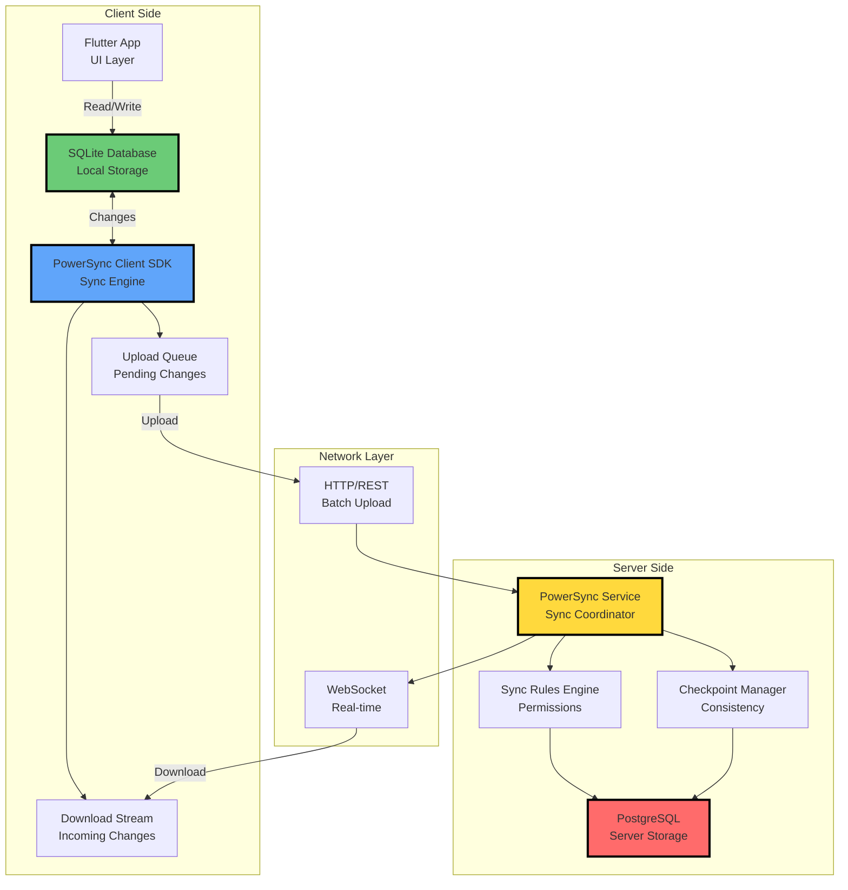
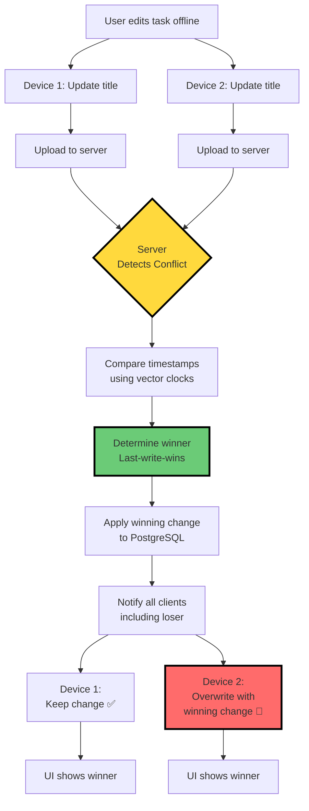
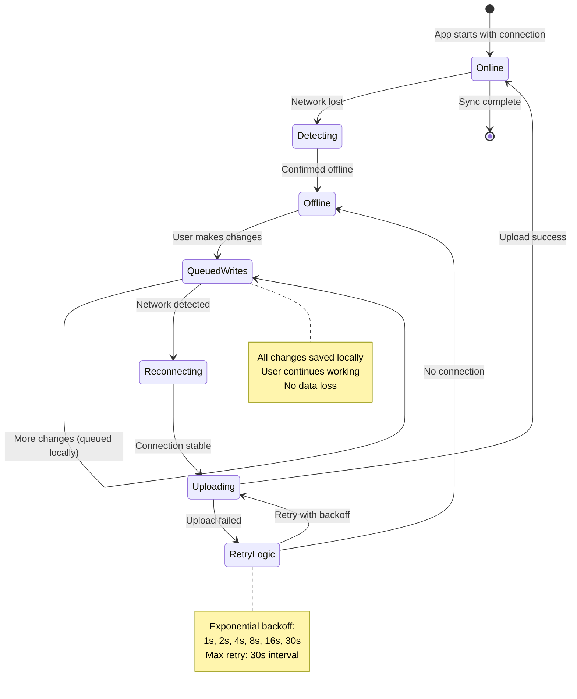
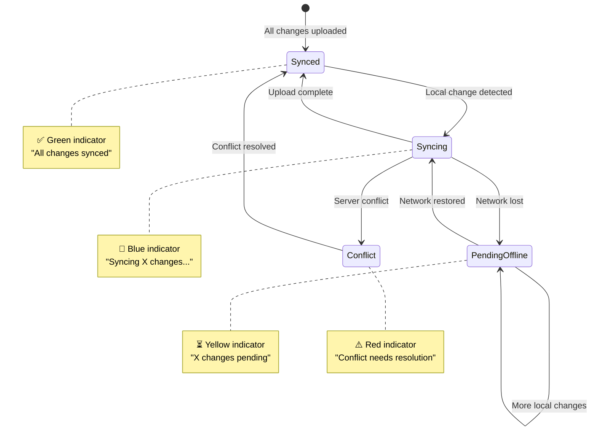

# Data Flow

> **TL;DR:** Data lives in local SQLite first. Sync happens in the background via PowerSync. Offline changes queue up and sync when connected. Conflicts resolve automatically using last-write-wins with vector clocks.

## Quick Start

**What you need to know in 60 seconds:**

- **Standalone mode**: SQLite only → No network, instant saves
- **Sync mode**: SQLite + PowerSync → Background sync, offline queue
- **Write path**: Local first (instant) → Background sync → Other devices
- **Read path**: Local SQLite always → Syncs down in background
- **Conflicts**: Server-authoritative, last-write-wins default

**Navigation:**

- [Architecture Overview](./ARCHITECTURE-OVERVIEW.md) - System design
- [Component Design](./COMPONENT-DESIGN.md) - Component breakdown
- [Deployment Guide](./DEPLOYMENT-GUIDE.md) - How to deploy
- [Development Roadmap](./DEVELOPMENT-ROADMAP.md) - Implementation timeline

---

## Data Flow: Standalone Mode

In standalone mode, everything happens locally with zero network dependency.

```mermaid
sequenceDiagram
    participant U as User
    participant App as Flutter App
    participant SQLite as SQLite DB
    participant AI as AI Provider<br/>(Optional)

    Note over U,SQLite: Creating a Task

    U->>App: Tap "Quick capture"
    App->>App: Validate input
    App->>SQLite: INSERT INTO tasks
    SQLite-->>App: Success (instant)
    App->>App: Update UI
    App-->>U: Task visible<br/>✅ Saved

    Note over U,AI: AI Task Breakdown (Optional)

    U->>App: Request AI breakdown
    App->>AI: Direct API call<br/>(OpenAI/Anthropic/Ollama)
    AI-->>App: Subtasks JSON
    App->>SQLite: INSERT subtasks (batch)
    SQLite-->>App: Success
    App-->>U: Subtasks visible

    Note over U,SQLite: Editing a Task

    U->>App: Edit task title
    App->>SQLite: UPDATE tasks SET title=...
    SQLite-->>App: Success
    App-->>U: Updated visible

    Note over U,SQLite: Deleting a Task

    U->>App: Delete task
    App->>SQLite: DELETE FROM tasks
    SQLite-->>App: Success
    App-->>U: Task removed

    style App fill:#FFD93D,stroke:#000,stroke-width:3px
    style SQLite fill:#6BCB77,stroke:#000,stroke-width:3px
```

### Key Characteristics

**Instant operations:**

- No network latency
- No waiting for server responses
- Optimistic UI updates unnecessary (already instant)
- ACID guarantees from SQLite

**Data location:**

- All data in `~/altair/guidance.db` (or similar)
- User has full control
- Easy to backup (just copy file)
- Privacy-first (data never leaves device)

**No sync overhead:**

- Zero sync logic running
- Lower battery consumption
- No background processes
- Simpler code paths

---

## Data Flow: Sync Mode

Sync mode adds PowerSync for multi-device synchronization while keeping local-first benefits.

```mermaid
sequenceDiagram
    participant U as User
    participant App as Flutter App
    participant SQLite as SQLite DB
    participant PSClient as PowerSync<br/>Client
    participant PSServer as PowerSync<br/>Service
    participant Postgres as PostgreSQL

    Note over U,Postgres: Write Path (Creating Task)

    U->>App: Create task
    App->>SQLite: INSERT task
    SQLite-->>App: Success (instant ✅)
    App-->>U: Task visible immediately

    Note over SQLite,Postgres: Background Sync (Async)

    PSClient->>SQLite: Poll for changes
    SQLite-->>PSClient: New task detected
    PSClient->>PSClient: Add to upload queue
    PSClient->>PSServer: POST /sync/upload<br/>{task data}
    PSServer->>PSServer: Validate & apply sync rules
    PSServer->>Postgres: INSERT task
    Postgres-->>PSServer: ACK
    PSServer-->>PSClient: Checkpoint update
    PSClient->>SQLite: Update sync metadata

    Note over PSServer,Postgres: Propagate to Other Devices

    PSServer->>PSServer: Notify connected clients
    PSServer->>PSClient: WebSocket push<br/>{task update}
    PSClient->>SQLite: INSERT/UPDATE task
    SQLite->>App: Trigger UI update
    App-->>U: Task synced ✅

    style App fill:#FFD93D,stroke:#000,stroke-width:3px
    style SQLite fill:#6BCB77,stroke:#000,stroke-width:3px
    style PSClient fill:#60A5FA,stroke:#000,stroke-width:3px
    style Postgres fill:#FF6B6B,stroke:#000,stroke-width:3px
```

### Write Path Breakdown

**Step 1: Local write (instant)**

- User action → SQLite INSERT/UPDATE/DELETE
- UI updates immediately (no spinner)
- Time to save: ~1-10ms

**Step 2: Queue for sync (background)**

- PowerSync client detects change
- Adds operation to upload queue
- Assigns client-side ID and timestamp

**Step 3: Upload to server (when connected)**

- Batch uploads every ~1-5 seconds
- Retries with exponential backoff if offline
- Compresses multiple operations

**Step 4: Server applies changes**

- Validates permissions (sync rules)
- Writes to PostgreSQL
- Returns checkpoint to client

**Step 5: Propagate to other devices**

- Server pushes to connected clients via WebSocket
- Offline devices pull on reconnect
- Clients apply to local SQLite

### Read Path

**Always read from local SQLite:**

- No network latency
- Works offline
- Instant search and filtering
- Optimistic by default

**Background download sync:**

```mermaid
sequenceDiagram
    participant App as Flutter App
    participant SQLite as SQLite DB
    participant PSClient as PowerSync Client
    participant PSServer as PowerSync Service
    participant Postgres as PostgreSQL

    Note over PSClient,Postgres: Background Download Sync

    PSClient->>PSServer: GET /sync/stream<br/>?last_checkpoint=X
    PSServer->>Postgres: Query changes since X
    Postgres-->>PSServer: Changed records
    PSServer-->>PSClient: Stream of operations
    PSClient->>SQLite: Apply operations
    SQLite->>App: Notify changes
    App->>App: Update UI

    Note over PSClient: Incremental Sync

    PSClient->>PSClient: Store new checkpoint
    PSClient->>PSServer: GET /sync/stream<br/>?last_checkpoint=Y
    PSServer-->>PSClient: Only new changes

    style SQLite fill:#6BCB77,stroke:#000,stroke-width:3px
    style PSClient fill:#60A5FA,stroke:#000,stroke-width:3px
```

---

## PowerSync Integration Architecture

PowerSync handles the complex synchronization logic between SQLite and PostgreSQL.



### PowerSync Components

**Client SDK (Flutter package):**

- Watches SQLite for changes
- Manages upload queue
- Processes download stream
- Handles conflict resolution
- Maintains checkpoints

**PowerSync Service (Server):**

- Coordinates synchronization
- Enforces sync rules (permissions)
- Manages checkpoints
- Pushes changes via WebSocket
- Handles conflict detection

**Sync Rules Engine:**

- SQL-based permission rules
- Determines what each user sees
- Dynamic partial replication
- Server-side filtering

**Checkpoint Manager:**

- Ensures consistency
- Prevents data loss
- Enables incremental sync
- Crash recovery

---

## Conflict Resolution Strategy

Conflicts occur when the same record is modified on multiple devices while offline.



### Conflict Resolution Algorithms

**Default: Last-write-wins (LWW)**

```dart
// Automatic resolution - no code needed
// Server timestamp determines winner
// Simpler, works for 99% of cases
```

**Custom: Field-level merge**

```dart
// For specific tables/fields that need special handling
final conflictResolver = ConflictResolver(
  resolver: (local, remote) {
    return Task(
      id: local.id,
      title: remote.title, // Server wins for title
      tags: [
        ...local.tags,
        ...remote.tags,
      ].toSet().toList(), // Merge tags
      completedAt: remote.completedAt ?? local.completedAt, // First completion wins
    );
  },
);
```

**Manual: User chooses**

```dart
// Show conflict UI for important data
if (conflict.requiresUserInput) {
  final choice = await showConflictDialog(
    local: conflict.local,
    remote: conflict.remote,
  );
  return choice;
}
```

### Conflict Prevention

**Optimistic locking (optional):**

```sql
-- Add version column
ALTER TABLE tasks ADD COLUMN version INTEGER DEFAULT 1;

-- Increment on update
UPDATE tasks SET
  title = 'New title',
  version = version + 1
WHERE id = 'task-123' AND version = 5;
```

**Conflict-free data types:**

- Append-only lists (no conflicts)
- Timestamps (server authoritative)
- Counters (increment operations commute)

---

## SQLite → PostgreSQL Sync Flow

Detailed flow of how changes propagate from local SQLite to server PostgreSQL.

```mermaid
sequenceDiagram
    participant SQLite as SQLite<br/>(Local)
    participant Trigger as SQLite Trigger<br/>(Change Detection)
    participant Queue as Upload Queue<br/>(Client)
    participant PSClient as PowerSync<br/>Client
    participant API as PowerSync<br/>REST API
    participant Rules as Sync Rules<br/>Engine
    participant Postgres as PostgreSQL<br/>(Server)

    Note over SQLite,Postgres: Local Write Detection

    SQLite->>Trigger: INSERT/UPDATE/DELETE
    Trigger->>Trigger: Record change in<br/>ps_oplog table
    Trigger->>Queue: Add to upload queue
    Queue->>Queue: Assign client ID<br/>and timestamp

    Note over Queue,API: Batch Upload

    PSClient->>Queue: Poll for pending changes<br/>(every 1-5 seconds)
    Queue-->>PSClient: Batch of operations
    PSClient->>PSClient: Compress & prepare payload
    PSClient->>API: POST /sync/upload<br/>{batch}

    Note over API,Postgres: Server Processing

    API->>API: Authenticate request
    API->>Rules: Apply sync rules<br/>(permissions check)
    Rules-->>API: Allowed operations
    API->>Postgres: BEGIN TRANSACTION
    API->>Postgres: Execute operations
    Postgres-->>API: Success
    API->>Postgres: COMMIT
    API->>API: Generate new checkpoint
    API-->>PSClient: {checkpoint, conflicts}

    Note over PSClient,SQLite: Update Local State

    PSClient->>SQLite: Update ps_oplog<br/>(mark uploaded)
    PSClient->>SQLite: Store new checkpoint
    PSClient->>PSClient: Handle any conflicts

    style SQLite fill:#6BCB77,stroke:#000,stroke-width:3px
    style Postgres fill:#FF6B6B,stroke:#000,stroke-width:3px
    style PSClient fill:#60A5FA,stroke:#000,stroke-width:3px
```

### Change Detection Mechanism

**SQLite triggers watch for changes:**

```sql
-- Auto-created by PowerSync
CREATE TRIGGER tasks_insert_trigger
AFTER INSERT ON tasks
BEGIN
  INSERT INTO ps_oplog (op, table_name, record_id, data)
  VALUES ('INSERT', 'tasks', NEW.id, json_object('title', NEW.title, ...));
END;

CREATE TRIGGER tasks_update_trigger
AFTER UPDATE ON tasks
BEGIN
  INSERT INTO ps_oplog (op, table_name, record_id, data)
  VALUES ('UPDATE', 'tasks', NEW.id, json_object('title', NEW.title, ...));
END;

CREATE TRIGGER tasks_delete_trigger
AFTER DELETE ON tasks
BEGIN
  INSERT INTO ps_oplog (op, table_name, record_id, data)
  VALUES ('DELETE', 'tasks', OLD.id, NULL);
END;
```

**Operation log structure:**

```sql
CREATE TABLE ps_oplog (
  id INTEGER PRIMARY KEY AUTOINCREMENT,
  op TEXT NOT NULL, -- 'INSERT', 'UPDATE', 'DELETE'
  table_name TEXT NOT NULL,
  record_id TEXT NOT NULL,
  data TEXT, -- JSON blob
  client_timestamp INTEGER NOT NULL,
  uploaded INTEGER DEFAULT 0,
  checkpoint TEXT
);
```

### Sync Rules (Server-Side Filtering)

**Define what each user can sync:**

```yaml
# sync-rules.yaml
bucket_definitions:
  # User's own tasks
  user_tasks:
    data:
      - SELECT * FROM tasks WHERE user_id = token_user_id()

  # Shared project tasks
  shared_project_tasks:
    data:
      - SELECT tasks.*
        FROM tasks
        JOIN project_members pm ON tasks.project_id = pm.project_id
        WHERE pm.user_id = token_user_id()

  # Team members (read-only)
  team_members:
    data:
      - SELECT users.*
        FROM users
        JOIN team_members tm ON users.id = tm.user_id
        WHERE tm.team_id IN (
        SELECT team_id FROM team_members WHERE user_id = token_user_id()
        )
```

**Rules enforcement:**

- Server validates every operation
- Users can't access data they shouldn't see
- Client never downloads unauthorized data
- Dynamic - changes propagate automatically

---

## Offline Queue & Retry Logic

How the system handles offline operation and ensures data integrity.



### Queue Management

**Upload queue properties:**

- Persistent (survives app restart)
- Ordered (FIFO for same record)
- Batched (multiple ops in one request)
- Compressed (reduces bandwidth)

**Retry strategy:**

```dart
class SyncRetryConfig {
  final maxRetries = 10;
  final baseDelay = Duration(seconds: 1);
  final maxDelay = Duration(seconds: 30);

  Duration getDelay(int attemptNumber) {
    final delay = baseDelay * math.pow(2, attemptNumber);
    return delay > maxDelay ? maxDelay : delay;
  }
}

// Usage
for (int i = 0; i < config.maxRetries; i++) {
  try {
    await uploadBatch(batch);
    break; // Success
  } catch (e) {
    if (i == config.maxRetries - 1) throw e;
    await Future.delayed(config.getDelay(i));
  }
}
```

### Data Integrity Guarantees

**Local writes never fail:**

- SQLite ACID guarantees
- Transactions ensure consistency
- No partial writes

**Sync failures don't lose data:**

- Queue persists across app restarts
- Failed uploads retry automatically
- User sees sync status in UI

**Conflict resolution preserves intent:**

- Timestamps track true order
- Vector clocks prevent false conflicts
- Manual resolution for critical data

---

## Real-Time Updates

How changes propagate to other connected devices in real-time.

```mermaid
sequenceDiagram
    participant D1 as Device 1<br/>(Editor)
    participant PSS as PowerSync<br/>Service
    participant D2 as Device 2<br/>(Viewer)
    participant D3 as Device 3<br/>(Offline)

    Note over D1,D3: Device 2 & 3 listening via WebSocket

    D2->>PSS: WebSocket connect
    D3->>PSS: WebSocket connect (then goes offline)

    Note over D1,PSS: Device 1 makes change

    D1->>PSS: Upload task update
    PSS->>PSS: Apply to PostgreSQL
    PSS->>PSS: Generate checkpoint

    Note over PSS,D2: Real-time push to Device 2

    PSS->>D2: WebSocket: {task update}
    D2->>D2: Apply to local SQLite
    D2->>D2: Update UI (instant)

    Note over PSS,D3: Device 3 offline - no push

    PSS->>D3: WebSocket: {task update}
    Note right of D3: Message lost<br/>(offline)

    Note over D3,PSS: Device 3 comes online

    D3->>PSS: WebSocket reconnect
    PSS->>D3: Catch-up sync from checkpoint
    D3->>D3: Apply missed changes
    D3->>D3: Update UI

    style D1 fill:#FFD93D,stroke:#000,stroke-width:3px
    style D2 fill:#60A5FA,stroke:#000,stroke-width:3px
    style D3 fill:#6BCB77,stroke:#000,stroke-width:3px
```

### WebSocket Connection Management

**Connection lifecycle:**

```dart
class PowerSyncConnection {
  WebSocketChannel? _channel;
  Timer? _heartbeat;

  Future<void> connect() async {
    _channel = WebSocketChannel.connect(
      Uri.parse('wss://sync.altair.app/stream'),
      headers: {'Authorization': 'Bearer $token'},
    );

    // Send heartbeat every 30s
    _heartbeat = Timer.periodic(Duration(seconds: 30), (_) {
      _channel?.sink.add(jsonEncode({'type': 'ping'}));
    });

    _channel!.stream.listen(
      _handleMessage,
      onError: _handleError,
      onDone: _reconnect,
    );
  }

  void _handleMessage(dynamic message) {
    final data = jsonDecode(message);
    if (data['type'] == 'operation') {
      applyOperation(data['payload']);
    } else if (data['type'] == 'checkpoint') {
      updateCheckpoint(data['checkpoint']);
    }
  }

  Future<void> _reconnect() async {
    await Future.delayed(Duration(seconds: 2));
    await connect();
    await catchupSync(); // Fetch missed changes
  }
}
```

**Catch-up sync after offline:**

```dart
Future<void> catchupSync() async {
  final lastCheckpoint = await getLastCheckpoint();
  final response = await api.get('/sync/catchup', {
    'checkpoint': lastCheckpoint,
  });

  // Apply all missed operations
  for (final op in response.operations) {
    await applyOperation(op);
  }

  await updateCheckpoint(response.newCheckpoint);
}
```

---

## Performance Optimizations

Techniques to keep sync fast and battery-friendly.

### Batching

**Upload batching:**

- Collect changes for 1-5 seconds
- Send in single HTTP request
- Reduces network overhead
- Better battery life

```dart
class UploadBatcher {
  final buffer = <Operation>[];
  Timer? _timer;

  void addOperation(Operation op) {
    buffer.add(op);

    _timer?.cancel();
    _timer = Timer(Duration(seconds: 2), _flush);

    // Immediate flush if buffer large
    if (buffer.length >= 50) {
      _flush();
    }
  }

  Future<void> _flush() async {
    if (buffer.isEmpty) return;

    final batch = List.of(buffer);
    buffer.clear();

    await uploadBatch(batch);
  }
}
```

### Compression

**Payload compression:**

```dart
// Compress large batches
if (payload.length > 1024) {
  final compressed = gzip.encode(utf8.encode(payload));
  final response = await http.post(
    '/sync/upload',
    headers: {'Content-Encoding': 'gzip'},
    body: compressed,
  );
}
```

### Incremental Sync

**Only sync what changed:**

```sql
-- Server query uses checkpoint
SELECT *
FROM tasks
WHERE updated_at > checkpoint_timestamp
  AND user_id = $1
ORDER BY updated_at
LIMIT 1000;
```

**Benefits:**

- Faster sync on reconnect
- Lower bandwidth usage
- Reduced server load
- Better battery life

---

## Monitoring Sync Status

User-facing sync status indicators.



### Status API

```dart
class SyncStatus {
  final bool isOnline;
  final int pendingUploads;
  final DateTime? lastSyncTime;
  final List<Conflict> conflicts;

  SyncState get state {
    if (conflicts.isNotEmpty) return SyncState.conflict;
    if (pendingUploads > 0 && !isOnline) return SyncState.pendingOffline;
    if (pendingUploads > 0) return SyncState.syncing;
    return SyncState.synced;
  }

  String get message {
    switch (state) {
      case SyncState.synced:
        return 'All changes synced';
      case SyncState.syncing:
        return 'Syncing $pendingUploads changes...';
      case SyncState.pendingOffline:
        return '$pendingUploads changes pending (offline)';
      case SyncState.conflict:
        return '${conflicts.length} conflicts need resolution';
    }
  }
}
```

---

## What's Next?

### Related Documentation

- [Architecture Overview](./ARCHITECTURE-OVERVIEW.md) - High-level system design
- [Component Design](./COMPONENT-DESIGN.md) - Detailed component breakdown
- [Deployment Guide](./DEPLOYMENT-GUIDE.md) - How to deploy and install
- [Development Roadmap](./DEVELOPMENT-ROADMAP.md) - Implementation timeline

### Understanding Sync

**Key takeaways:**

1. Local-first = Writes are instant
2. Sync happens in background
3. Offline queue ensures no data loss
4. Conflicts resolve automatically (usually)
5. Real-time updates via WebSocket

**For developers:**

- PowerSync handles complexity
- You work with SQLite as normal
- Sync "just works" behind the scenes
- Custom conflict resolution when needed

---

## FAQ

**Q: What happens if I edit the same task on two devices offline?**
A: Both edits save locally. When online, server picks the last write. Loser device updates to match.

**Q: Can I lose data if sync fails?**
A: No. Changes stay in upload queue with automatic retry. Data persists across app restarts.

**Q: How fast is sync?**
A: Local write: instant (~1-10ms). Background sync: 1-5 seconds to propagate to other devices.

**Q: What if server is down?**
A: App continues working offline. Changes queue up and sync when server returns.

**Q: How much bandwidth does sync use?**
A: Minimal. Only changed records sync. Batching and compression reduce overhead.

**Q: Can I see what's in the upload queue?**
A: Yes. Query `ps_oplog` table in SQLite to see pending operations.

**Q: What's a checkpoint?**
A: A marker representing sync state. Enables incremental sync (only changes since last checkpoint).

---

**Next:** [Component Design](./COMPONENT-DESIGN.md) → Explore detailed component architecture
