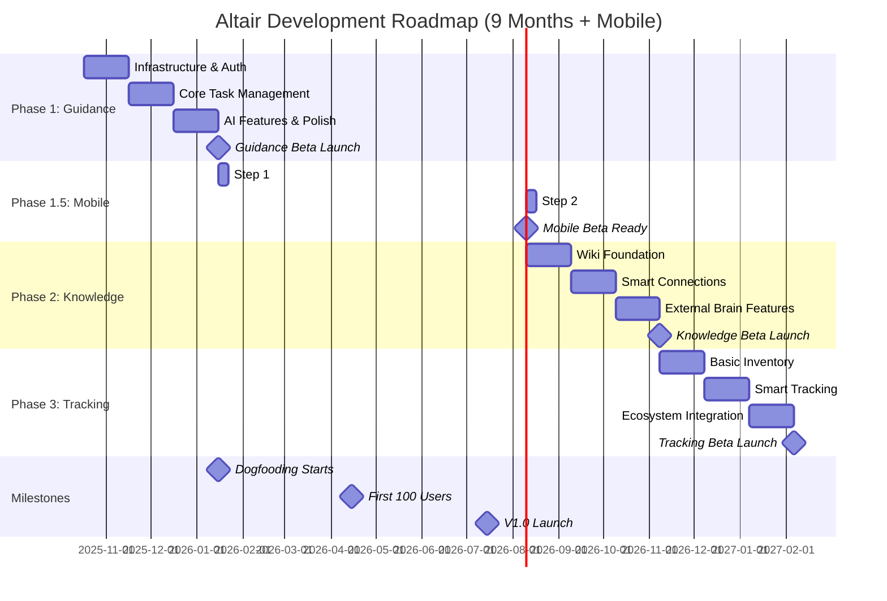
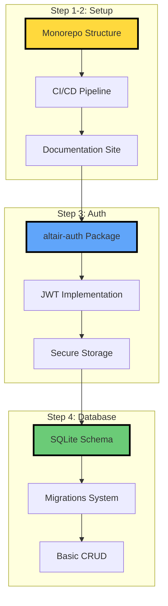
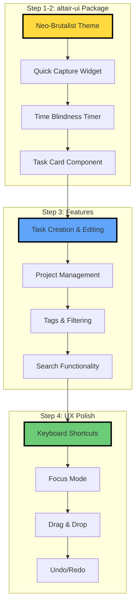
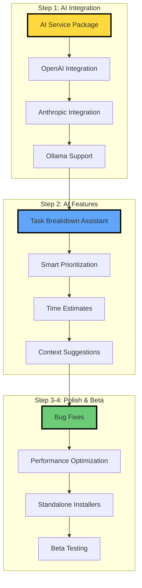
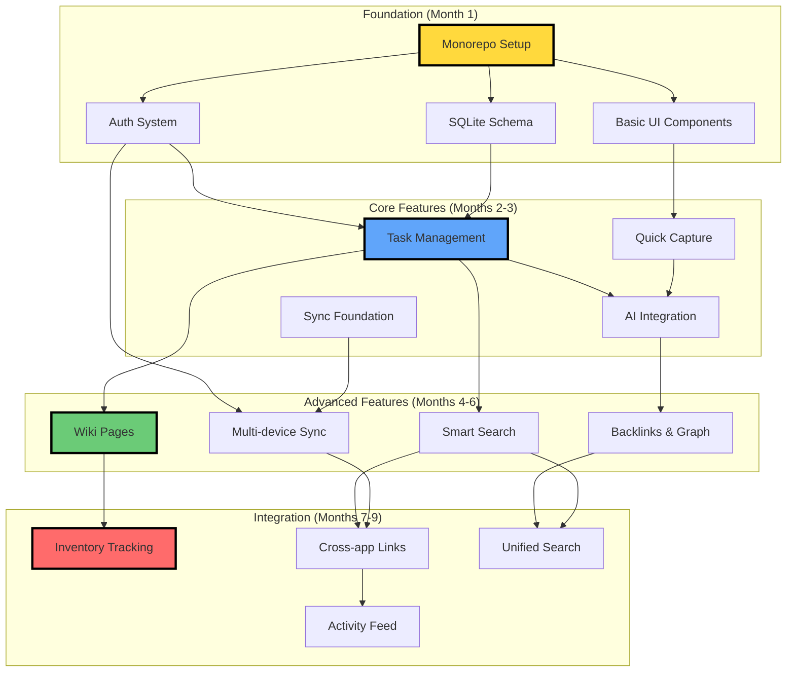
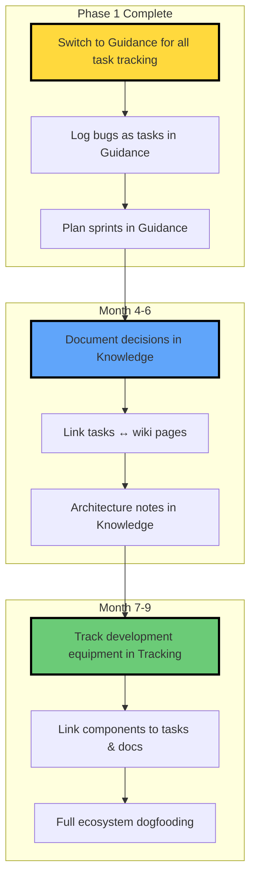

# Development Roadmap

> **TL;DR:** 9-month plan. Guidance MVP in 3 months (dogfooding target). Knowledge in months 4-6. Tracking in months 7-9. Each phase: Foundation → Core features → Polish → Beta.

## Quick Start

**What you need to know in 60 seconds:**

- **Timeline**: 9 months total, 3 apps built sequentially
- **Phase 1** (Months 1-3): Altair Guidance - Task management MVP
- **Phase 2** (Months 4-6): Altair Knowledge - Personal wiki
- **Phase 3** (Months 7-9): Altair Tracking - Inventory management
- **Key milestone**: Dogfooding Guidance by end of Month 3

**Navigation:**

- [Architecture Overview](./ARCHITECTURE-OVERVIEW.md) - System design
- [Data Flow](./DATA-FLOW.md) - How data moves
- [Component Design](./COMPONENT-DESIGN.md) - Component breakdown
- [Deployment Guide](./DEPLOYMENT-GUIDE.md) - How to deploy

---

## Timeline Overview

9-month development plan with focus on shipping and dogfooding.

### Key Milestones

| Milestone               | Target Date | Criteria                                             |
| ----------------------- | ----------- | ---------------------------------------------------- |
| **Foundation Complete** | Month 1     | Auth works, SQLite schema ready, first UI component  |
| **Dogfooding Starts**   | Month 3     | Using Guidance daily for own project management      |
| **Guidance Beta**       | Month 3     | 10 external beta testers, < 5 critical bugs          |
| **Knowledge MVP**       | Month 6     | Personal wiki works, syncs across devices            |
| **Tracking MVP**        | Month 9     | Inventory tracking works, integrates with other apps |
| **V1.0 Launch**         | Month 9     | All three apps stable, < 1% crash rate               |

---

## Phase 1: Altair Guidance (Months 1-3)

Task and project management with ADHD-friendly features.

### Month 1: Infrastructure & Foundation

**Deliverables:**

- ✅ Repository structure (`apps/`, `packages/`, `services/`)
- ✅ GitHub Actions CI/CD (lint, test, build)
- ✅ altair-auth package (JWT, secure storage)
- ✅ SQLite schema for tasks, projects, tags
- ✅ Basic CRUD repositories
- ✅ First Flutter desktop app runs

**Success criteria:**

- [ ] Can create/read/update/delete tasks locally
- [ ] Auth flow works (login/logout/refresh)
- [ ] Database migrations tested
- [ ] CI pipeline passes on all commits

### Month 2: Core Task Management

**Deliverables:**

- ✅ altair-ui package with reusable components
- ✅ Quick capture (< 3 seconds from keyboard shortcut)
- ✅ Task breakdown and subtasks
- ✅ Project organization
- ✅ Tags, filters, search
- ✅ Time tracking with visual feedback

**Success criteria:**

- [ ] Thought to capture < 3 seconds
- [ ] Can manage 100+ tasks without slowdown
- [ ] Quick capture works from anywhere (global hotkey)
- [ ] Visual progress clear at a glance

### Month 3: AI Features & Beta

**Deliverables:**

- ✅ AI task breakdown (GPT-4/Claude)
- ✅ Local AI support (Ollama)
- ✅ Smart prioritization suggestions
- ✅ Time estimate assistance
- ✅ Standalone installers (macOS, Windows, Linux)
- ✅ Beta testing with 10 users

**Success criteria:**

- [ ] Using Guidance daily for own tasks (dogfooding)
- [ ] AI breakdown < 5 seconds
- [ ] Installers work on clean systems
- [ ] < 5 critical bugs reported
- [ ] 8/10 beta testers rate "would use daily"

**Dogfooding milestone:**

- Using Guidance to manage Altair development
- Track all tasks, bugs, features in Guidance
- Test every feature personally before shipping

---

## Phase 1.5: Mobile Platform Support

**Priority shift:** Mobile development begins immediately to target the most ubiquitous device platform.

### Step 1: iOS Platform Setup ✅

**Focus areas:**

- Enable iOS platform for altair_guidance
- Configure iOS build settings and permissions
- Test basic app functionality on iOS
- Ensure UI components work on mobile screens

**Deliverables:**

- ✅ iOS platform enabled
- ✅ iOS build configuration complete
- ✅ Basic app runs on iOS simulator/device
- ✅ UI responsive on iPhone screens

**Success criteria:**

- [x] App builds and runs on iOS devices
- [x] Core features work on mobile
- [x] UI adapts to mobile screen sizes
- [x] No critical iOS-specific bugs

### Step 2: Mobile Optimization & Testing ✅

**Focus areas:**

- Mobile-specific UI/UX improvements
- Touch gesture support
- Mobile performance optimization
- Android testing and refinement
- Cross-platform testing (iOS + Android)

**Deliverables:**

- ✅ Touch-optimized UI components
- ✅ Gesture navigation support (swipe-to-delete, long-press, pull-to-refresh)
- ✅ Performance optimization for mobile
- ✅ Tested on emulators (217 tests passing, 7 integration tests)
- ✅ Mobile CI/CD pipeline created
- ✅ Device testing documentation complete
- ⏳ Physical device testing (deferred to user availability)

**Success criteria:**

- [x] Quick capture works on mobile
- [x] Task management smooth on touch devices
- [x] Platform-specific features implemented (SafeArea, keyboard, back button)
- [x] Mobile tests comprehensive and passing
- [ ] Performance validated on physical devices (pending device access)
- [ ] Beta testers can use mobile version daily (pending physical testing)

### Step 3: Physical Device Validation ⏳

**Focus areas:**

- Test on real Android devices
- Test on real iOS devices (requires macOS)
- Measure performance baselines
- Validate across multiple screen sizes
- Prepare for app store submissions

**Deliverables:**

- ⏳ Android device testing complete
- ⏳ iOS device testing complete (requires macOS)
- ⏳ Performance baselines documented
- ⏳ App store assets prepared
- ⏳ Beta distribution via TestFlight/Play Store

**Success criteria:**

- [ ] Tested on 3+ Android devices
- [ ] Tested on 3+ iOS devices
- [ ] Performance meets targets on mid-range devices
- [ ] Ready for public beta distribution

---

## Phase 2: Altair Knowledge (Months 4-6)

Personal wiki and knowledge management system.

### Month 4: Wiki Foundation

**Focus areas:**

- Markdown editor with live preview
- Page organization (folders, tags)
- Basic linking between pages
- Search functionality
- SQLite schema for wiki pages

**Deliverables:**

- ✅ Wiki page CRUD operations
- ✅ Markdown editor component
- ✅ Page hierarchy/organization
- ✅ Basic [[wiki-link]] syntax
- ✅ Full-text search across pages

**Success criteria:**

- [ ] Can create/edit pages with Markdown
- [ ] Internal links work
- [ ] Search returns results < 500ms
- [ ] Supports 1000+ pages without slowdown

### Month 5: Smart Connections

**Focus areas:**

- Backlinks (pages linking to current page)
- Graph view (visualize connections)
- Smart suggestions (related pages)
- Tag-based organization
- Templates for common page types

**Deliverables:**

- ✅ Automatic backlinks
- ✅ Interactive graph visualization
- ✅ AI-powered page suggestions
- ✅ Tag hierarchy and relationships
- ✅ Page templates (meeting notes, project brief, etc.)

**Success criteria:**

- [ ] Backlinks update in real-time
- [ ] Graph view renders 1000+ nodes
- [ ] AI suggests relevant related pages
- [ ] Templates save time on common tasks

### Month 6: External Brain Features

**Focus areas:**

- Daily notes (automatic daily pages)
- Quick capture from anywhere
- Web clipper (save articles)
- PDF annotation
- PowerSync integration for sync

**Deliverables:**

- ✅ Daily notes with templates
- ✅ Quick capture widget (global hotkey)
- ✅ Web content import
- ✅ Basic PDF annotation
- ✅ Multi-device sync (PowerSync)
- ✅ Knowledge beta launch

**Success criteria:**

- [ ] Daily notes auto-created
- [ ] Can clip web pages in < 5 seconds
- [ ] Sync works across devices
- [ ] Using Knowledge daily for notes (dogfooding)
- [ ] 10 beta testers actively using

---

## Phase 3: Altair Tracking (Months 7-9)

Inventory and resource management system.

### Month 7: Basic Inventory

**Focus areas:**

- Item creation and categorization
- Location management
- Barcode scanning (mobile)
- Basic search and filtering
- Photo attachments

**Deliverables:**

- ✅ Item CRUD operations
- ✅ Location hierarchy
- ✅ Barcode scanner (mobile)
- ✅ Photo upload/storage
- ✅ Quantity tracking

**Success criteria:**

- [ ] Can track 1000+ items
- [ ] Barcode scanning works reliably
- [ ] Photo uploads < 2 seconds
- [ ] Locations organize logically

### Month 8: Smart Tracking

**Focus areas:**

- Low stock alerts
- Usage predictions (AI)
- Quick add via photo (AI recognition)
- Shopping list generation
- Expiration tracking

**Deliverables:**

- ✅ Automated alerts (low stock, expiring)
- ✅ AI item recognition from photos
- ✅ Usage pattern analysis
- ✅ Smart shopping lists
- ✅ Expiration date tracking

**Success criteria:**

- [ ] Alerts prevent running out
- [ ] AI correctly identifies 80% of items from photos
- [ ] Shopping lists save time
- [ ] No expired items forgotten

### Month 9: Ecosystem Integration

**Focus areas:**

- Cross-app linking (items ↔ tasks ↔ wiki pages)
- Unified search across all apps
- Activity feed (all app events)
- Shared tags across apps
- PowerSync for all three apps

**Deliverables:**

- ✅ Cross-app resource linking
- ✅ Global search (all apps)
- ✅ Activity feed dashboard
- ✅ Tag synchronization
- ✅ Full ecosystem sync working
- ✅ V1.0 launch

**Success criteria:**

- [ ] All three apps work together seamlessly
- [ ] Unified search finds results across apps
- [ ] Activity feed provides useful overview
- [ ] Sync works reliably across all apps
- [ ] Using all three apps daily (full dogfooding)

---

## Feature Dependency Tree

How features build on each other.

### Critical Path

**Month 1:** Foundation → **Month 2:** Task Management → **Month 3:** AI + Beta → **Month 6:** Knowledge + Sync → **Month 9:** Full Ecosystem

**Blockers to watch:**

- PowerSync integration (complex, affects all apps)
- AI integration (API limits, costs)
- Standalone installers (platform-specific issues)
- Performance at scale (1000+ tasks/pages/items)

---

## MVP Criteria by App

What defines "minimum viable" for each app.

### Guidance MVP Checklist

**Core functionality:**

- [ ] Quick capture (< 3 seconds)
- [ ] Create/edit/delete tasks
- [ ] Organize into projects
- [ ] Tag and filter tasks
- [ ] Search tasks (< 500ms)
- [ ] Mark tasks complete
- [ ] Basic time tracking

**ADHD features:**

- [ ] Time blindness timer (visual)
- [ ] Focus mode (hide distractions)
- [ ] Keyboard shortcuts (power users)
- [ ] Quick task breakdown
- [ ] Visual progress indicators

**AI features:**

- [ ] Task breakdown (GPT-4/Claude)
- [ ] Time estimates
- [ ] Smart prioritization

**Technical:**

- [ ] Works 100% offline
- [ ] Sync across devices (optional)
- [ ] < 1 second page loads
- [ ] Standalone installers
- [ ] < 5 critical bugs

**Dogfooding proof:**

- [ ] Using daily for ≥ 2 weeks
- [ ] Managing ≥ 50 active tasks
- [ ] AI breakdown used ≥ 10 times
- [ ] Completed ≥ 1 project with subtasks

### Knowledge MVP Checklist

**Core functionality:**

- [ ] Create/edit wiki pages (Markdown)
- [ ] Internal linking ([[page-name]])
- [ ] Backlinks (auto-generated)
- [ ] Graph view (page connections)
- [ ] Full-text search
- [ ] Tag organization
- [ ] Daily notes (auto-created)

**Smart features:**

- [ ] AI page suggestions
- [ ] Related pages discovery
- [ ] Web clipper
- [ ] Quick capture from anywhere

**Technical:**

- [ ] Works offline
- [ ] Sync with Guidance app
- [ ] Supports 1000+ pages
- [ ] Search < 500ms

**Dogfooding proof:**

- [ ] Using for project notes ≥ 2 weeks
- [ ] Created ≥ 30 interconnected pages
- [ ] Graph view shows useful connections
- [ ] Daily notes habit established

### Tracking MVP Checklist

**Core functionality:**

- [ ] Add/edit items
- [ ] Organize by location
- [ ] Barcode scanning (mobile)
- [ ] Quantity tracking
- [ ] Photo attachments
- [ ] Search items

**Smart features:**

- [ ] Low stock alerts
- [ ] AI item recognition (photos)
- [ ] Shopping list generation
- [ ] Expiration tracking

**Integration:**

- [ ] Link items to tasks
- [ ] Link items to wiki pages
- [ ] Unified search across apps
- [ ] Activity feed

**Technical:**

- [ ] Works offline
- [ ] Syncs with other apps
- [ ] Supports 1000+ items

**Dogfooding proof:**

- [ ] Tracking personal inventory ≥ 2 weeks
- [ ] Scanned ≥ 20 barcodes
- [ ] Used shopping list feature
- [ ] Cross-app links useful

---

## Dogfooding Plan

Using Altair to build Altair (meta!).

### Dogfooding Benefits

**Find bugs early:**

- Experience issues before users do
- Real-world usage patterns
- Edge cases discovered naturally

**Feature validation:**

- Does quick capture actually save time?
- Is AI breakdown useful or gimmicky?
- Which features get used daily?

**UX improvements:**

- Identify friction in workflows
- Discover missing features
- Validate ADHD-friendly design choices

**Credibility:**

- "We use it to build it"
- Show real project management in Guidance
- Authentic testimonials from team

---

## Risk Mitigation

Potential issues and how to handle them.

### Technical Risks

**PowerSync integration complexity**

- Risk: Takes longer than expected
- Mitigation: Start with basic sync, iterate
- Fallback: Ship without sync first, add later

**Performance at scale**

- Risk: Slow with 1000+ tasks/pages
- Mitigation: Profile early, optimize incrementally
- Fallback: Pagination, virtual scrolling

**AI API costs**

- Risk: OpenAI/Anthropic bills too high
- Mitigation: Implement rate limiting, caching
- Fallback: Ollama (free, local) as default

### Schedule Risks

**Scope creep**

- Risk: Adding too many features
- Mitigation: Stick to MVP checklists
- Strategy: "One thing well" philosophy

**Dogfooding delays**

- Risk: Don't use Guidance by Month 3
- Mitigation: Force switch, no alternatives
- Accountability: Public commitment to timeline

**Burnout**

- Risk: 9 months is long
- Mitigation: One app at a time, celebrate milestones
- Strategy: Ship early, ship often

### Adoption Risks

**Too complex for users**

- Risk: Features overwhelm new users
- Mitigation: Onboarding flow, progressive disclosure
- Strategy: Start simple, unlock features gradually

**Not ADHD-friendly enough**

- Risk: Doesn't actually help ADHD users
- Mitigation: User testing with ADHD community
- Strategy: Discord feedback, iterate based on needs

---

## Success Metrics

How we measure progress and success.

### Development Metrics

**Velocity:**

- Target: Ship 1 major feature/week
- Track: GitHub issues closed per week
- Goal: Maintain consistent pace

**Quality:**

- Target: < 5 critical bugs per release
- Track: Bug severity distribution
- Goal: 95% of bugs non-critical

**Dogfooding:**

- Target: Daily usage by Month 3
- Track: Personal usage logs
- Goal: Can't live without it

### User Metrics (Post-Launch)

**Engagement:**

- Target: 1000 daily active users by Month 6
- Track: Analytics (privacy-respecting)
- Goal: 80% week-over-week retention

**Performance:**

- Target: 80% task breakdown success rate
- Track: AI feature usage & success
- Goal: Users complete more tasks

**Satisfaction:**

- Target: 8/10 "would recommend" score
- Track: User surveys
- Goal: Genuine enthusiasm from ADHD community

---

## What's Next?

### Immediate Actions (Phase 1 Step 1)

**Day 1-2:**

- [ ] Create GitHub repository
- [ ] Setup monorepo structure (`apps/`, `packages/`, `services/`)
- [ ] Initialize first Flutter app (altair-guidance)
- [ ] Setup CI/CD (GitHub Actions)

**Day 3-4:**

- [ ] Create altair-ui package
- [ ] Implement neo-brutalist theme
- [ ] Build first component (AltairButton)
- [ ] Setup Storybook for component dev

**Day 5:**

- [ ] Create altair-core package
- [ ] Define Task model
- [ ] Setup SQLite database
- [ ] Write first test

### Monthly Check-ins

**End of Month 1:**

- Review: Foundation complete?
- Adjust: Timeline, scope, priorities
- Celebrate: First working features

**End of Month 3:**

- Review: Ready for dogfooding?
- Adjust: Beta timeline, feature cuts
- Celebrate: First public beta

**End of Month 6:**

- Review: Knowledge ready?
- Adjust: Tracking scope, integration priorities
- Celebrate: Two apps shipping

**End of Month 9:**

- Review: V1.0 ready?
- Launch: Public v1.0 release
- Celebrate: Full ecosystem shipped!

---

## Related Documentation

- [Architecture Overview](./ARCHITECTURE-OVERVIEW.md) - High-level system design
- [Data Flow](./DATA-FLOW.md) - How data moves through system
- [Component Design](./COMPONENT-DESIGN.md) - Component breakdown
- [Deployment Guide](./DEPLOYMENT-GUIDE.md) - How to deploy

---

## FAQ

**Q: Why 9 months? Can't it be faster?**
A: Quality over speed. Each app needs 3 months to do it right. Rushing leads to technical debt.

**Q: What if Month 3 dogfooding reveals Guidance isn't working?**
A: Fix it before moving to Knowledge. No point building more apps if first one fails.

**Q: Can features be added after initial release?**
A: Yes! These are MVPs. Iterate based on user feedback.

**Q: What about mobile apps?**
A: Mobile development starts immediately after Phase 1 completion. Android already enabled, iOS to be configured. Mobile and desktop platforms developed in parallel.

**Q: How do you avoid burnout over 9 months?**
A: One app at a time. Celebrate milestones. Ship early, get feedback, stay motivated.

**Q: What if PowerSync doesn't work out?**
A: Ship standalone first. Sync is optional enhancement, not blocker.

---

**Last updated:** October 22, 2025
**Next review:** November 17, 2025 (Monthly)
**Accountability:** Weekly dev logs on Discord
**Recent change:** Added Phase 1.5 (Mobile Platform Support) - prioritizing mobile development after Phase 1 completion
