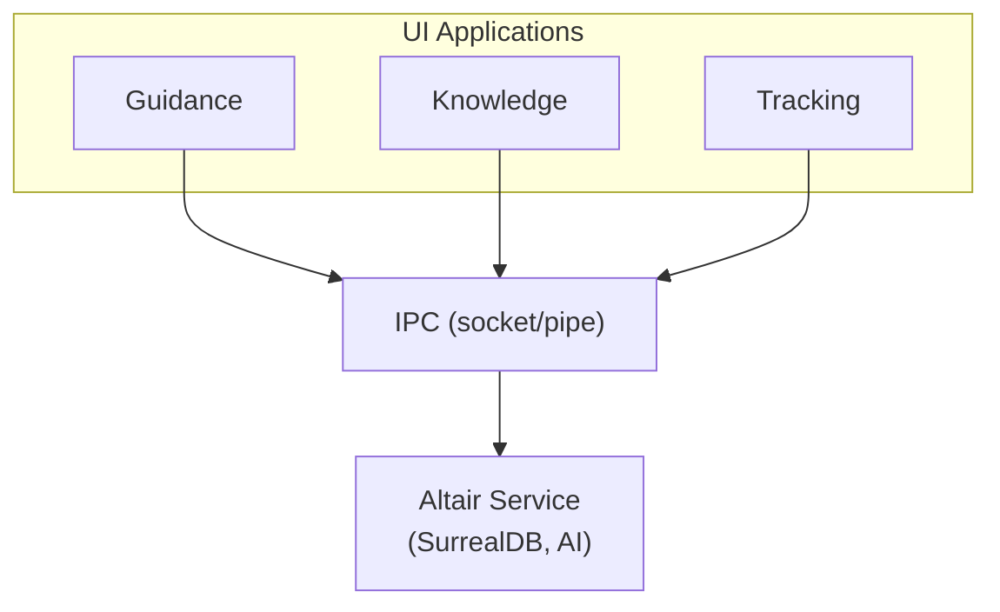

# ADR-001: Single Tauri Application

| Field        | Value           |
| ------------ | --------------- |
| **Status**   | Accepted        |
| **Date**     | 2026-01-08      |
| **Deciders** | Robert Hamilton |

## Context

Altair consists of three logical applications—Guidance (task management), Knowledge (PKM),
and Tracking (inventory)—that share data and need to communicate in real-time. We needed to decide whether to build:

1. **Three separate applications** with a shared background service/daemon
2. **A single application** containing all three modules

The decision impacts development complexity, user experience, deployment, and the feasibility of cross-module features
like auto-discovery and linked data.

## Decision

Build Altair as a **single Tauri application** containing all three modules within one binary. Modules communicate via
in-process event bus and share a single embedded SurrealDB instance.

Users experience the modules as tabs, separate windows, or navigation sections within one application—not as
independently installable programs.

## Consequences

### Positive

- **Simplified data sharing**: All modules access the same SurrealDB instance directly; no IPC serialization overhead
- **Trivial cross-module features**: Event bus is in-process; auto-discovery, linking, and reservations are simple
  function calls
- **Single release cycle**: One binary to build, test, sign, and distribute
- **No lifecycle complexity**: No daemon startup/shutdown, reference counting, or crash recovery between processes
- **Consistent UX**: Shared design system, navigation, and settings across all modules
- **Lower development cost**: Estimated 2-3 months saved vs. multi-process architecture

### Negative

- **Larger binary size**: Users who only want one module still download the full application
- **Coupled releases**: Bug in one module blocks release of all modules
- **Memory footprint**: All module code loaded even if user only uses one
- **No independent scaling**: Cannot run Tracking on a different machine than Guidance

### Neutral

- Users can still have multiple windows (one per module) if desired
- Future extraction to separate apps remains possible if demand emerges

## Alternatives Considered

### Alternative 1: Separate Apps with Shared Daemon

Three independent Tauri applications communicating with a headless background service via Unix sockets (Linux) / named
pipes (Windows).

**Architecture:**

**Rejected because:**

1. **Lifecycle complexity**: Reference counting for service startup/shutdown; crash recovery; platform-specific IPC implementations
2. **Industry trend against daemons**: Research showed Obsidian, Notion, Linear, and Raycast all avoid traditional
   daemons in favor of in-process or child-process architectures
3. **Development overhead**: Estimated 2-3 additional months for IPC layer, lifecycle management, and cross-platform testing
4. **Unclear user demand**: No evidence users specifically need separately installable modules

### Alternative 2: Microservices with Local HTTP

Each module as a separate process, communicating via localhost HTTP/REST APIs.

**Rejected because:**

1. HTTP overhead for high-frequency events (auto-discovery needs sub-100ms response)
2. Same lifecycle complexity as Alternative 1
3. Overkill for single-user desktop application

## References

- [Desktop Application Background Service Architectures Research](../reference/desktop-service-architectures.md) —
  Analysis of Obsidian, 1Password, Notion, Raycast, Linear, Figma, Docker Desktop, VS Code
- PRD Core, Section 5: System Architecture
- FR-G-031: Cross-app drag-drop
- FR-K-130: Cross-app discovery
- FR-T-038: Real-time text analysis for item detection
