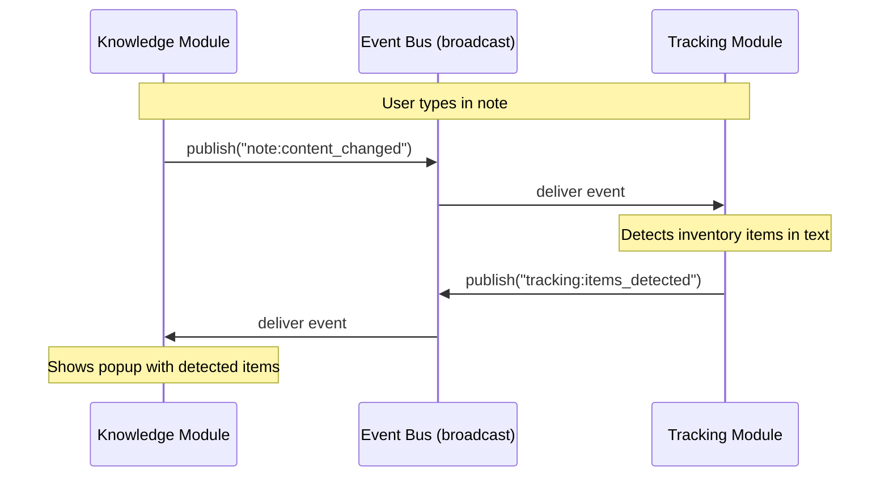

# ADR-003: Event Bus for Inter-Module Communication

| Field        | Value           |
| ------------ | --------------- |
| **Status**   | Accepted        |
| **Date**     | 2026-01-08      |
| **Deciders** | Robert Hamilton |

## Context

Altair's three modules (Guidance, Knowledge, Tracking) need to communicate for features like:

- **Auto-discovery**: Knowledge detects item mentions in notes → Tracking shows popup (FR-T-038)
- **Reactive updates**: Quest completed in Guidance → Tracking releases reserved items
- **Live linking**: Note content changes → related quests/items update their displays

We needed to decide how modules communicate within the single Tauri application.

## Decision

Implement an **internal event bus** using Rust channels (`tokio::sync::broadcast` or similar) for
module-to-module communication. Modules publish events to named topics; other modules subscribe to
topics they care about.

Events are fire-and-forget notifications. For request-response patterns, modules query the shared
database directly.

## Consequences

### Positive

- **Loose coupling**: Modules don't import each other; they only know about event types
- **Reactive patterns**: Natural fit for real-time features like auto-discovery popups
- **Testability**: Can test modules in isolation by mocking event subscriptions
- **Extensibility**: Future plugin system can subscribe to same events
- **No serialization overhead**: In-process channels pass Rust structs directly
- **Debuggable**: Can log all events to trace cross-module interactions

### Negative

- **Eventual consistency**: Events are async; UI may briefly show stale data
- **Event ordering**: Must consider what happens if events arrive out of order
- **Debugging complexity**: Tracing event flows harder than direct function calls
- **No guaranteed delivery**: If subscriber is slow, events may be dropped (with broadcast channels)

### Neutral

- Need to define and maintain event schema (see event-bus.md)
- May need to add event replay/persistence if debugging requires it

## Design Details

### Event Flow Example



### Event Categories

| Category      | Examples                                                 | Subscribers         |
| ------------- | -------------------------------------------------------- | ------------------- |
| `guidance:*`  | `quest_created`, `quest_completed`, `energy_changed`     | Knowledge, Tracking |
| `knowledge:*` | `note_created`, `note_content_changed`, `link_created`   | Guidance, Tracking  |
| `tracking:*`  | `item_created`, `items_detected`, `reservation_released` | Guidance, Knowledge |
| `system:*`    | `sync_started`, `sync_completed`, `ai_ready`             | All modules         |

### Implementation Approach

```rust
// Event definition
#[derive(Clone, Debug)]
pub enum AltairEvent {
    // Guidance events
    QuestCreated { id: QuestId, title: String },
    QuestCompleted { id: QuestId },

    // Knowledge events
    NoteContentChanged { id: NoteId, content: String },

    // Tracking events
    ItemsDetected { note_id: NoteId, items: Vec<ItemMatch> },
}

// Publishing
event_bus.publish(AltairEvent::NoteContentChanged { ... });

// Subscribing
let mut rx = event_bus.subscribe();
while let Ok(event) = rx.recv().await {
    match event {
        AltairEvent::NoteContentChanged { id, content } => {
            // Run item detection
        }
        _ => {}
    }
}
```

## Alternatives Considered

### Alternative 1: Direct Function Calls

Modules import and call each other's functions directly.

```rust
// In Knowledge module
tracking::detect_items(&note_content);
```

**Rejected because:**

- Tight coupling; circular dependencies likely
- Hard to test modules in isolation
- No clean way to add plugin subscribers later
- Synchronous calls block UI thread

### Alternative 2: Shared State with Observers

Modules observe shared state objects (similar to MobX/Redux patterns).

**Rejected because:**

- Complex state management for Rust (not idiomatic)
- Observer pattern in Rust requires `Arc<Mutex<>>` complexity
- Less explicit than event bus; harder to trace what triggered what

### Alternative 3: Actor Model (Actix)

Each module as an actor with message passing.

**Rejected because:**

- Heavier framework dependency
- Request-response model doesn't fit broadcast notifications
- Overkill for single-process application

## References

- [event-bus.md](./event-bus.md) — Full event schema and contracts
- [tokio::sync::broadcast](https://docs.rs/tokio/latest/tokio/sync/broadcast/index.html)
- FR-T-038: Real-time text analysis for item mentions
- FR-K-125: Background discovery process
- FR-G-021: Swap-first behavior (needs event to update UI)
