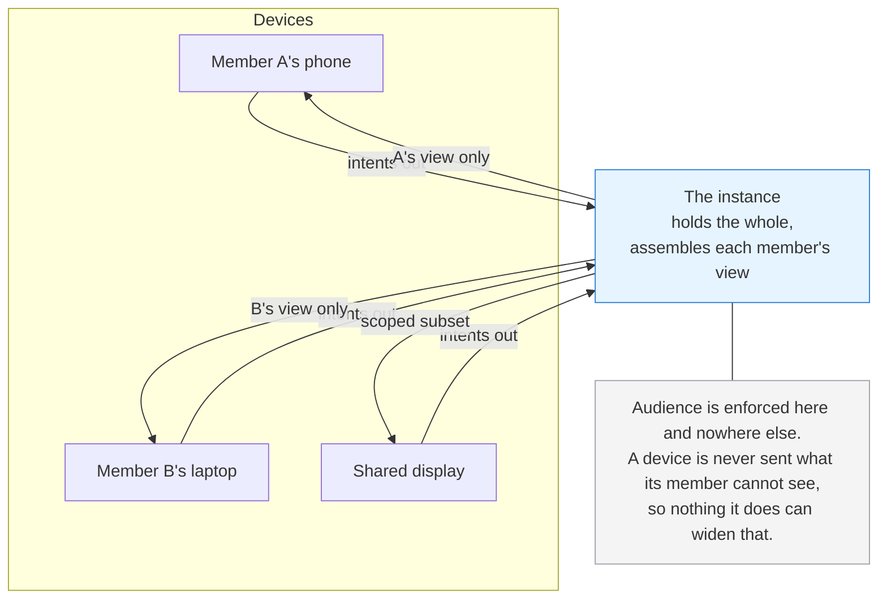
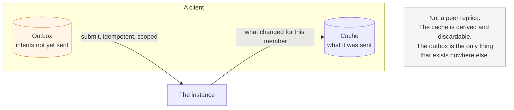
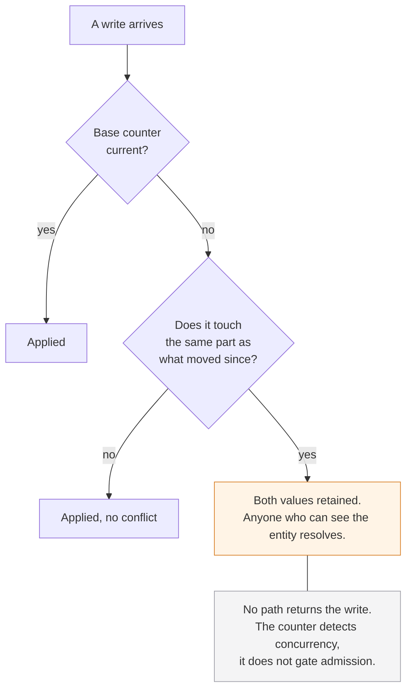
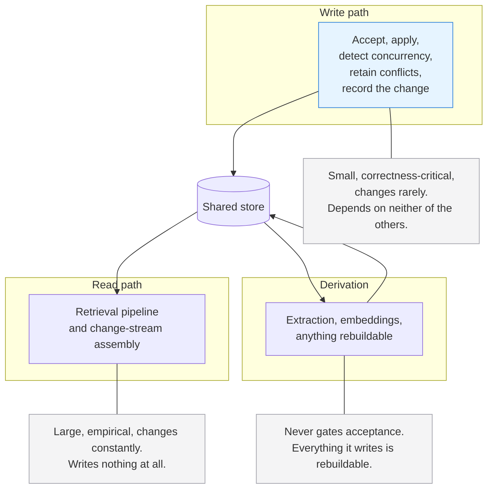

# Altair Architecture Foundations

**Status:** Draft
**Date:** 2026-08-06
**Governed by:** Altair Vision & Scope
**Related:** Altair Substrate Specification, Altair System Architecture, Altair Relation Types Specification

---

## What this document is

What kind of system Altair is, decided before any component is placed and long before any product is named.

It sits in front of the system architecture. That document says what components exist and what they owe each other; this one says what shape of system they are components of, and why.

**It names no products.** A database, a framework, or a runtime brings a topology, a data model, and a consistency model with it. Choosing one first means inheriting those by accident and then reasoning backwards to justify them. The order here is deliberate: the design documents decide what has to be true, this document decides what kind of system delivers it, and only then does anything get chosen to build it with.

**The diagrams carry the same weight as the prose.** Each states the same thing as the text around it rather than illustrating a part of it.

---

## How the requirements in this document are meant to be used

Every requirement below eventually becomes a filter on some product. That only works if the requirements carry weight, because a flat list of thirty mandatory items has exactly one honest outcome, which is that nothing qualifies and the choice gets made on preference with a list attached as cover.

So each requirement is marked:

- **Load-bearing.** A direct consequence of something the vision document or the substrate requires. Failing it means failing a stated guarantee.
- **Strongly preferred.** Failing it costs work that can be named and quantified.
- **Convenience.** Nice, and a good candidate could reasonably lack it.

**A product that meets most of what matters may beat two products that each meet half.** Splitting across systems has its own cost, and the bar for a second product is not that it does something better. It is that the gap is load-bearing and no single product closes it.

> ⚠️ **An accepted gap must be named in advance and carry its workaround.** A gap accepted as negotiable and then never revisited becomes the thing the whole system quietly bends around, which is the failure this ordering exists to prevent. Writing the mitigation next to the gap is what keeps the trade honest.

**Operator convenience is a tiebreaker, not a requirement.** Fewer moving parts is worth something, and packaging already absorbs a great deal of it. Designing around the least willing operator is the same mistake as designing around the least capable hardware: it bends the product toward someone hypothetical. Guarantees come first.

---

## Topology

**One authority holds the whole and assembles each member's view.**

This is not a preference. Three guarantees are unenforceable without it.

**Audience.** It is per member, it is enforced on every query surface, and clients are not trusted components. Any design where devices exchange changes directly requires each device either to hold material its member may not see, or to be trusted to route correctly. Both move enforcement into the untrusted party.

**Erasure.** It has to actually remove. The vision document already concedes that a device holding a copy cannot reliably be made to forget it. That concession survives when the authoritative copy is in one place and devices hold derived copies. It does not survive when the copies are the system.

**Deterministic ranking.** The same query over the same data producing the same order for everyone requires one view of the data to rank against.

**What follows for deployment:** an authority is a role, not a machine. Components may sit on separate hardware on the household's own network, and inference in particular is expected to.

---

## What a client is

**A cache and an outbox, not a peer replica.**

**The cache is derived and discardable.** Everything in it came from the instance and can be rebuilt from the instance. Losing it costs time, not content.

**The outbox is the only thing a client holds that exists nowhere else**, which is why every durability guarantee in the substrate attaches to it and not to the cache.

**A client need not hold everything.** A display showing today's quests is an ordinary consumer of a scoped subset, not a degraded participant.

**A client may be entirely without an outbox.** Something that only displays is conforming. The offline floor is a requirement on clients that create.

---

## Write semantics

**Writes address a part, not a record.** A field for most content, a block for a body. **Load-bearing**, and derived directly from the conflict granularity Must.

**A write is conditional on a base counter value and is never rejected.** Current base applies. Stale base touching different parts applies without conflict. Stale base touching the same part retains both values. **Load-bearing.**

> ⚠️ **This is not optimistic concurrency control**, which it closely resembles and will be mistaken for. There is no reject-and-retry, because a device returning after three weeks cannot win a retry race against a household that has been using the system meanwhile. The counter detects concurrency. It does not gate admission.

**Writes producing the same value are not divergent.** **Load-bearing.** Without it, two people resolving a conflict the same way conflicts again, which is both absurd and the likely case.

**Conflicts are entity-local, non-blocking, and uncounted.** Nothing is queued for anyone's attention and nothing accumulates. **Load-bearing**, from the prohibition on backlogs.

**A client can know of a conflict before the instance does**, and resolving it before sending means the instance never sees one.

---

## Identity

**An identifier exists from the moment a thing is created, before anything else has seen it.** **Load-bearing.**

Capture succeeds with nothing reachable, so the thing has to be held durably where nothing else can see it, and it cannot be held without a name. Whether that name becomes its permanent identity is a separate question, answered below.

**Identity is assigned by whatever brings the thing into existence, which is not always a client.** A client assigns for entities and relations. The instance assigns for blocks, because the division rule needs one implementation or devices disagree about the units reconciliation happens in, and block identity follows that division rather than being settled on its own merits.

**Entity identity is assigned by the creating client.** **Strongly preferred.**

The offline floor does not force this. A client that captures and nothing more has nothing referring to what it made until it arrives, so the instance could assign on arrival without loss. What decides it is that capability beyond the floor is wanted rather than merely tolerated, and client assignment is what keeps that cheap: no client at any capability level holds a mapping from a local name to a canonical one, and the create path never exists in two versions. A cost falls on the alternative that is easy to miss: assigning on arrival and rewriting references during reconciliation means identity is not stable across sync, so anything that captured the earlier value, including an export or a copied link, points at nothing afterwards. The instance assigning entity identity is viable, and is recorded as viable rather than as excluded.

This was previously parked pending the storage decision, which had it backwards. Storage does not get to decide this; capture already did.

**Identifiers do not collide across devices**, since two clients may create entities offline at the same moment with no way to coordinate. **Load-bearing.**

**Identity is stable and opaque.** Nothing else is derivable from it, and it does not encode where or when something was made.

---

## Ordering

**Position in the change sequence is instance-level.** **Load-bearing.**

**It is not wall-clock.** Devices are offline and clocks skew, and no device's clock settles anything.

**It is not the per-entity write counter**, which answers a different question and is named apart deliberately.

---

## What this requires of a data model

Derived from the above and from the substrate. These are the filters a store is judged against.

| Requirement | Weight | Where it comes from |
|---|---|---|
| Entities with typed properties, and a type fixed at creation | Load-bearing | Substrate entity model |
| Relations as records belonging to neither endpoint, addressable and removable without rewriting either | Load-bearing | Relations are first-class and bidirectional by construction |
| Any type related to any type, with no allow-list | Load-bearing | Substrate relations |
| Bodies divided into addressable blocks with stable identity across edits | Load-bearing | Conflict granularity and anchors |
| Writes addressing a part of a record without rewriting it | Load-bearing | Conflict granularity |
| A per-record counter supporting conditional writes | Load-bearing | Concurrent write handling |
| Externally assigned identifiers | Strongly preferred | Identity above |
| Retained history of prior content, bounded and declinable | Strongly preferred | Versions |
| Traversal of relations from either end without cost growing sharply with depth | Strongly preferred | Backlinks are derived, not maintained |

> ℹ️ **Relations as independent records is the requirement that most constrains the shape of a store**, because a record belonging to neither of the things it joins has no natural home in a model built around self-contained documents.

---

## What this requires of queries

| Requirement | Weight | Where it comes from |
|---|---|---|
| The audience predicate resolved inside the query that produces candidates | Load-bearing | Audience is enforced on every query surface |
| Literal text matching over entity content | Load-bearing | Retrieval must stand alone without inference |
| Similarity search over stored vectors | Load-bearing | Findable without recall |
| Both of the above, plus scoping, resolved against one candidate set in one query | Load-bearing | Post-filtering leaks and gets limits wrong |
| A stable order for equal-relevance results | Load-bearing | Deterministic ranking |
| Enough returned to account for why a result is present | Load-bearing | Results are accountable |
| Scoping to a container, a domain, or a time range | Strongly preferred | Scope belongs to the person asking |

---

## Inside the instance: three paths

Not two. Derivation is neither a read nor a write in the sense the other two mean, and naming it separately is what lets the rules for the others be strict.

**They are separated because they change at different rates**, which at household scale matters more than throughput ever will. The write path is small, correctness-critical, and rarely touched. The read path is large, empirical, and expected to churn continuously while retrieval is tuned. The thing that changes constantly should not be able to break the thing that must never fail.

**Nothing in the write path depends on the read path.** **Load-bearing.** If accepting a write required an index to be current or a model to be reachable, capture would fail whenever retrieval was unhealthy.

**The read path writes nothing.** **Load-bearing.** Not entity content, not derived data, not a record of what was asked or what was opened.

> ℹ️ **This makes an exclusion structural rather than a promise.** The vision document rules out ordering that adapts to the person and learning from what was opened. A read path that writes nothing cannot learn from behaviour, because there is nowhere to put what it would learn. The rule stops depending on anyone remembering it.

**Derivation never gates acceptance and never overwrites a person's edit.** **Load-bearing.** Everything it writes is rebuildable, which is what makes it safe for it to be behind, off, or on another machine.

**They share one store.** **Load-bearing**, from read-your-own-writes: someone captures a note and looks for it moments later. A separate read model kept in sync asynchronously would fail exactly that, and buys nothing at this scale.

### What a just-captured entity is findable by

**Immediately: its words.** Literal matching is a permanent arm of the retrieval pipeline rather than a fallback, so a new entity participates through it from the moment it is written.

**Once derivation has run: its meaning.** That may be moments or may be when other hardware wakes up.

**Nothing switches modes**, and there is no second kind of search to explain. The pipeline is the same pipeline; one arm knows about the entity before the other does. Fusion combines what each arm returns, so the practical difference is that a very new entity is found by what it says before it can be found by what it is about.

**The system can say it has not caught up.** Outstanding derivation is reportable, so the honest form of this is visible rather than presenting as quietly worse results.

---

## Atomicity boundaries

**The test: atomicity is required where a partial result leaves information that nothing can reconstruct.** It is not required where a partial result is simply less done.

That distinction does the work here, because less done is normal throughout this system. Capture accepts and derivation catches up later. Retrieval degrades per stage. None of that is a failure. What matters is whether the missing piece can be recovered by anyone, afterwards, by any means.

### Load-bearing

**A write and its entry in the change sequence.** If a write applies and no change is recorded, the household's state and what the instance can report about it have diverged permanently. A device that returns is told nothing happened, believes it is current, and stays wrong. Nothing detects this and nothing repairs it, which makes it the failure the whole change-stream design exists to prevent.

**A grouped deletion and the entities it covers.** Recovery is of entities and a deletion of several is remembered as one, so restore is a single action. If the entities enter the holding state and the grouping does not, the connection between them exists nowhere. Nobody can reconstruct which forty items were deleted together, and at bulk scale they will not remember, so restore is not merely harder, it is impossible as the single action it is required to be.

### Strongly preferred

**An entity and its relations at creation.** They arrive from one gesture and should land as one. But a note created without its relation is a note that exists, capture is satisfied, and the person knows what they meant and can relate it by hand. Recoverable, so not load-bearing.

**Derived content and the record of what produced it.** Without the provenance, nothing can tell later what is stale. Almost certainly one write in any case.

### Must not be atomic

**A bulk capture is not one unit**, which is worth stating because the reflex is the opposite. Two hundred files where the hundredth fails leaves ninety-nine captured. Each entity is independent, and treating the batch as a transaction would discard work the person has already done in order to report a clean failure, which is the exact trade capture never fails refuses.

### Where atomicity is not available

Two stores cannot participate in one transaction, so the object store boundary is ordered rather than atomic. The general form is worth stating, since it will apply to any later split:

> ℹ️ **Order so that failure leaves collectable garbage rather than a broken reference.** Bytes before the record that points at them. An orphan is sweepable by a later pass; a committed record pointing at nothing is a broken entity, and producing one is not permitted.

---

## Rejected models

**Convergent replicated types as the consistency model.** The attraction is real and it is the case that made them worth taking seriously: two people editing one shared note, both keeping their work, with nobody asked to reconcile anything.

Rejected for three reasons. Convergence is not coherence, so two people editing the same sentence get an interleaving neither wrote with nobody told, and someone returning after three weeks would find their own note quietly incoherent. Staying convergent generally requires retaining tombstones indefinitely, and erasure has to actually remove. And it is the hard part of the system, bought against a frequency nobody can currently estimate.

**Block granularity is what recovered most of the attraction.** Two people editing different paragraphs merge. The same paragraph conflicts and both versions survive.

**An event log as the store's source of truth.** Attractive because it makes the change stream nearly free and version history a natural consequence. Rejected because current content would then depend on its own history in order to exist, contradicting the commitment that a household may decline version history without content ever being at risk. At the boundary a log is fine, since full reconciliation always exists; as the model underneath, it reopens a settled question.

**A mesh of equal peers with no authority.** Rejected under Topology above.

**Provisional local acceptance, where a client holds a write pending a verdict.** Rejected because capture succeeding means a created entity will reach the instance. A write awaiting approval is not an accepted write.

---

## Deliberately not decided

Product selection of any kind. Schema evolution posture, meaning whether shape changes are validated on write or tolerated on read, which is resolved alongside the store choice rather than in front of it.

---

## Open questions

None. What remains before a product can be chosen is judging candidates against the requirements above, which is a decision record rather than a question for this document.
