# Altair Architecture Specification

| Field | Value |
|---|---|
| **Document** | Altair Architecture Specification |
| **Version** | 1.0 |
| **Status** | Draft |
| **Last Updated** | 2026-03-11 |
| **Related Docs** | `altair-core-prd.md`, `altair-guidance-prd.md`, `altair-knowledge-prd.md`, `altair-tracking-prd.md` |

---

# 1. Purpose

This document defines the **technical architecture** for Altair.

It translates the product requirements into an implementation plan for:

- **Web application** as a first-class client
- **Android mobile application** as a first-class client
- **Desktop applications** for Linux and Windows
- **Self-hosted backend** for sync, search, AI, and attachments
- **Offline-first operation** with conflict-aware synchronization

This document is intentionally separate from the PRDs. The PRDs describe **what** Altair must do. This document describes **how** it is built.

---

# 2. Architectural Drivers

The architecture is driven by the following product constraints:

- **Mobile is a daily driver**, not a companion
- **Web is a hard requirement**
- **Desktop adds power-user capability**, but is not required for basic viability
- **Offline mode** is mandatory for mobile and desktop
- **Sync conflicts must never silently lose data**
- **Cross-app integration** is a defining product differentiator
- **Self-hosting and privacy** are first-class constraints
- **AI must be optional and degrade gracefully**

These drivers are derived from the PRDs and should override elegance theater, framework fandom, and other forms of engineering goblinry.

---

# 3. Recommended Technology Stack

## 3.1 Final Stack

### Web
- **SvelteKit 2**
- **Svelte 5**
- **TypeScript**
- Optional SSR + SPA hybrid deployment

### Desktop
- **Tauri 2**
- Shared **SvelteKit/Svelte 5** UI
- Targets:
  - Linux
  - Windows

### Mobile
- **Android native**
- **Kotlin**
- **Jetpack Compose**
- Future:
  - WearOS as Android-adjacent extension

### Backend
- **Rust**
- **Axum**
- Background workers in Rust

### Client Local Storage
- **SQLite**
- Local attachment cache
- Operation log / outbox tables

### Server Persistence
Recommended default:
- **Postgres**

Optional advanced variant:
- **SurrealDB**

### Search / AI / Processing
- Full-text indexing in server-side search subsystem
- Embeddings/vector index in dedicated search/AI module
- Object storage abstraction for attachments
- AI providers via pluggable adapters

---

# 4. Architecture Decision Summary

## 4.1 Why not one client stack everywhere?

A single UI stack across web, desktop, and mobile sounds tidy until the requirements start biting:

- camera capture
- barcode scanning
- notifications
- widgets
- background timers
- background sync
- share intents
- future WearOS

Trying to force one tool to do all of that usually produces more integration work, not less.

## 4.2 Chosen strategy

Use the right tool for the job:

- **Web + Desktop:** shared Svelte UI stack
- **Android:** native Kotlin/Compose
- **Backend:** Axum services
- **Sync:** explicit application-layer design, not accidental database behavior

This architecture maximizes delivery realism while preserving coherent product behavior.

---

# 5. System Context

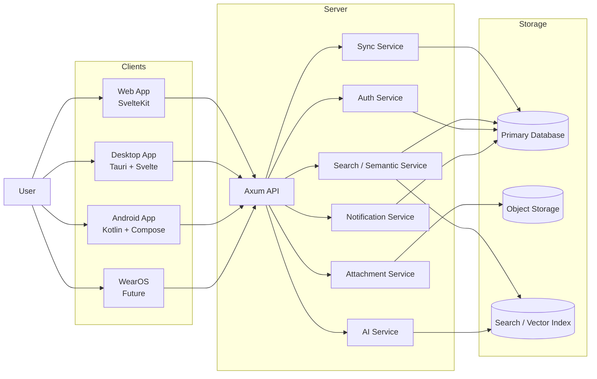

---

# 6. Platform Strategy

## 6.1 Tier 1 Platforms

### Android
Primary client for:
- capture
- notifications
- routines
- barcode/photo scanning
- quick triage
- on-the-go task and inventory operations

### Web
Universal access client for:
- knowledge browsing/editing
- planning
- dashboards
- review
- admin access
- work-computer usage where installs are blocked

## 6.2 Tier 2 Platforms

### Desktop (Linux and Windows)
Power-user client for:
- deep editing
- multi-window workflows
- graph-heavy views
- bulk operations
- local AI later
- imports/exports
- automation-centric workflows

## 6.3 Tier 3 Platforms

### WearOS
Future reduced-scope companion:
- reminders
- routine completion
- simple logging
- quick glance views

### iOS
Best effort / community scope.

---

# 7. High-Level Module Architecture

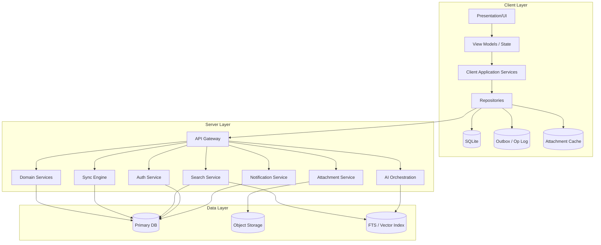

---

# 8. Cross-App Domain Model

Altair is not three unrelated apps in a trench coat. It is one system with shared core concepts.

## 8.1 Shared Core Domains

- **Identity**
- **User Settings**
- **Initiatives**
- **Tags**
- **Universal Inbox**
- **Attachments**
- **Search**
- **Sync**
- **Notifications**
- **AI Jobs**

## 8.2 Product Domains

- **Guidance**
- **Knowledge**
- **Tracking**

## 8.3 Cross-App Domain Overview

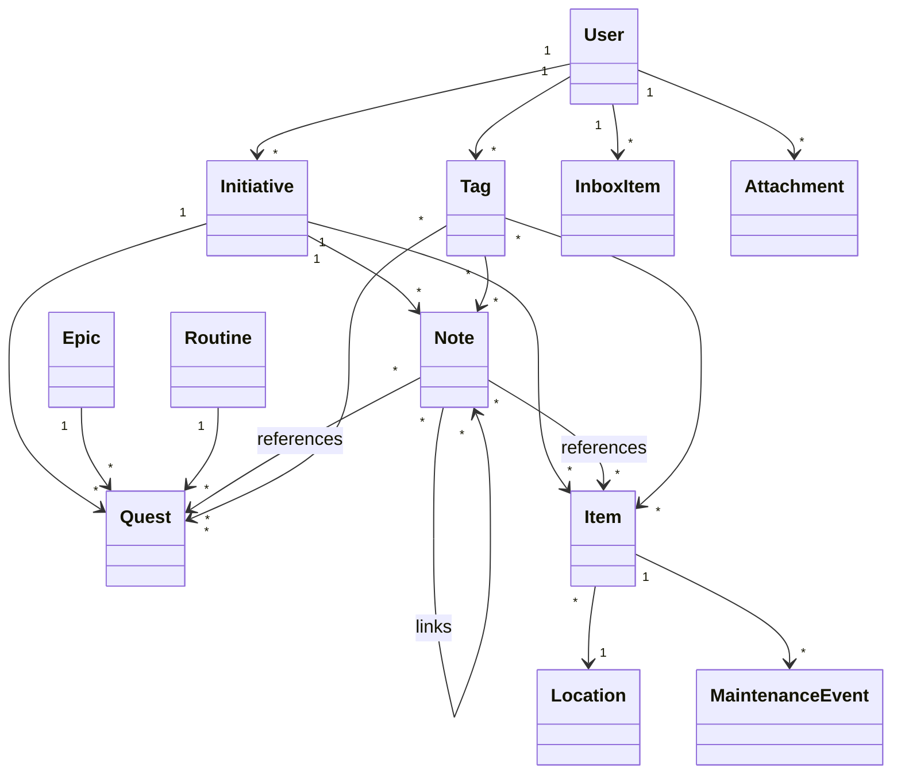

---

# 9. Bounded Contexts

## 9.1 Identity Context
Responsibilities:
- accounts
- auth
- password/OIDC login
- roles
- token/session lifecycle
- per-user isolation

## 9.2 Core Context
Responsibilities:
- initiatives
- inbox
- tags
- attachments metadata
- notification preferences
- shared settings

## 9.3 Guidance Context
Responsibilities:
- epics
- quests
- routines
- checkpoints
- focus sessions
- energy state

## 9.4 Knowledge Context
Responsibilities:
- notes
- backlinks
- graph relationships
- import/export
- semantic enrichment
- OCR/transcription artifact references

## 9.5 Tracking Context
Responsibilities:
- items
- categories
- locations
- stock levels
- reservations
- maintenance
- shopping lists
- BoM parsing outputs

## 9.6 Search Context
Responsibilities:
- keyword indexing
- semantic embeddings
- hybrid ranking
- cross-app result shaping

## 9.7 Sync Context
Responsibilities:
- mutation ingestion
- conflict detection
- device checkpoints
- downstream changes
- reconciliation status

---

# 10. Client Architecture

## 10.1 Shared client principles

All clients should follow the same logical shape even if the UI stack differs:

- presentation layer
- view-model/state layer
- application service layer
- repository abstraction
- local storage
- sync outbox
- background sync coordinator

## 10.2 Web Client Architecture

### Purpose
The web client is a **first-class product surface**, not a limp dashboard.

### Responsibilities
- sign-in
- planning and review flows
- knowledge editing and browsing
- tracking search/editing
- inbox triage
- admin access
- cross-app search
- export/import initiation

### Constraints
- weaker device integration
- limited background execution
- limited local file/device control
- browser storage constraints

### Web Architecture

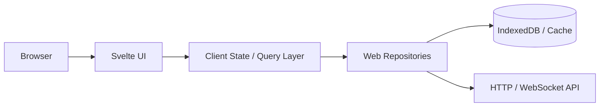

## 10.3 Desktop Client Architecture

### Purpose
The desktop app is the **power-user shell**.

### Responsibilities
- heavy editing
- graph views
- multi-window workflows
- local files
- stronger offline cache
- future local AI adapters
- export/import workflows

### Desktop Architecture

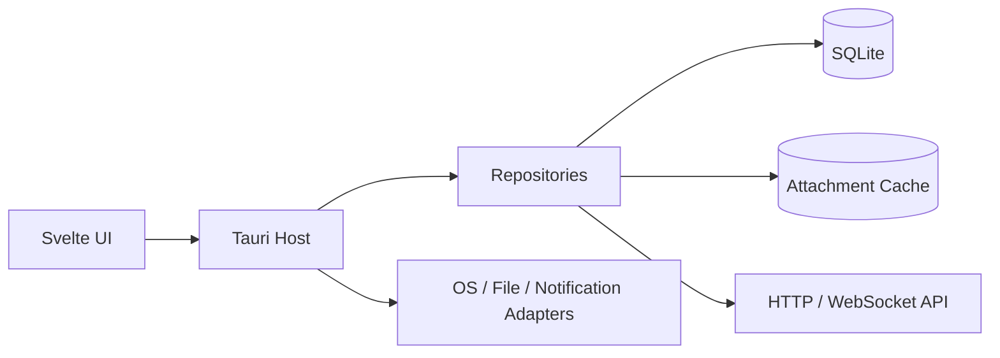

## 10.4 Android Client Architecture

### Purpose
Android is the **daily interaction engine**.

### Responsibilities
- notifications
- widgets
- camera capture
- barcode scanning
- share intents
- offline capture
- background sync
- quick completion flows

### Android Architecture

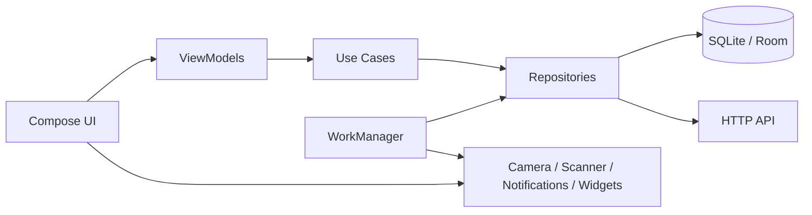

---

# 11. Backend Architecture

## 11.1 Style

The backend should be a **modular monolith first**, not premature microservices cosplay.

Why:
- simpler deployment
- easier local development
- lower operational burden
- easier schema evolution
- still supports modular boundaries

Internally, structure the code by bounded context with clean interfaces. Extract separate deployable services only when justified by scale or isolation needs.

## 11.2 Top-Level Backend Modules

- **API Gateway**
- **Identity/Auth**
- **Core Domain**
- **Guidance Domain**
- **Knowledge Domain**
- **Tracking Domain**
- **Sync Engine**
- **Search/Indexing**
- **AI Orchestration**
- **Attachment Service**
- **Notification Service**
- **Background Jobs**

## 11.3 Backend Container View

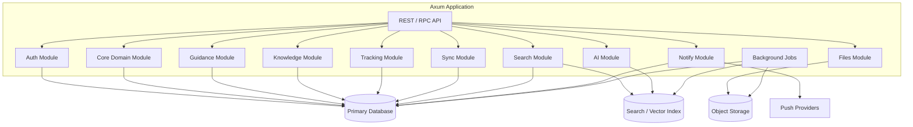

---

# 12. Data Architecture

## 12.1 Recommended persistence strategy

### Client side
- SQLite per device
- local attachment metadata
- cached attachment files
- queued mutations in an outbox table
- tombstones for deleted entities
- per-entity version metadata

### Server side
Preferred:
- Postgres for transactional source of truth
- object storage for attachments
- search index for FTS + semantic data

Optional:
- SurrealDB if graph/document ergonomics outweigh operational risk for your use case

## 12.2 Why SQLite locally?

Because it is:
- proven
- embeddable
- reliable
- excellent offline
- easy to inspect
- suitable for Room on Android and native bindings on desktop

That little database is a cockroach in a tuxedo. It survives everything.

## 12.3 Canonical server data model

The server database is the **authoritative convergence layer**, not necessarily the only execution store.

### Core record patterns
- stable entity IDs
- timestamps
- soft-delete markers
- per-record revision/version
- created_by / updated_by
- attachment references
- initiative references
- tag relationships

## 12.4 Logical ERD

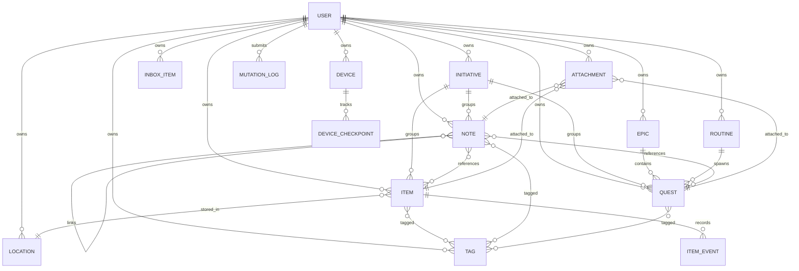

---

# 13. Sync Architecture

This is the most important subsystem in Altair.

If sync is flimsy, the rest of the architecture is just expensive decoration.

## 13.1 Sync principles

- local-first writes
- server-mediated convergence
- explicit conflict handling
- resumable uploads/downloads
- idempotent mutation processing
- no silent overwrite
- per-device checkpoints
- attachment transfers decoupled from metadata sync

## 13.2 Sync model

Use an **operation-based sync** approach.

Clients record mutations as operations in an outbox, then synchronize them to the server.

### Example mutation envelope

```json
{
  "mutation_id": "uuid",
  "device_id": "uuid",
  "user_id": "uuid",
  "entity_type": "quest",
  "entity_id": "uuid",
  "operation": "update",
  "base_version": 42,
  "payload": {
    "title": "Replace UPS batteries",
    "status": "in_progress"
  },
  "occurred_at": "2026-03-11T18:00:00Z"
}
```

## 13.3 Sync flow

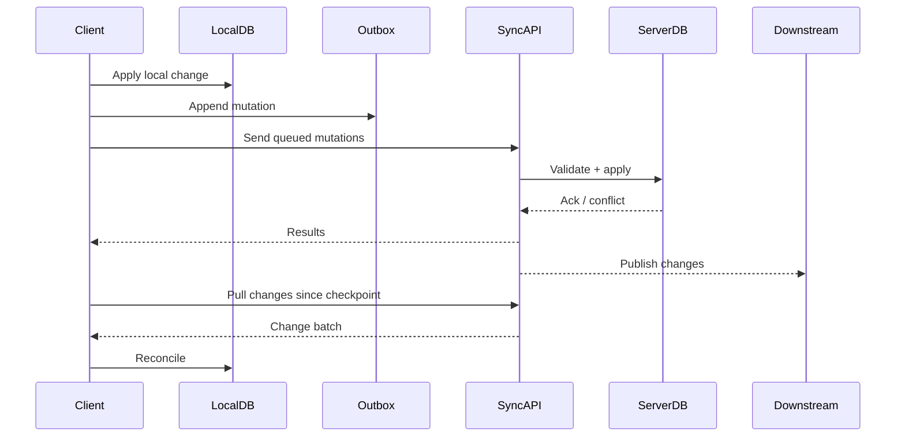

## 13.4 Server sync responsibilities

- authenticate device/user
- verify mutation ownership
- validate schema/business rules
- check base version / causality
- apply or reject mutation
- emit change events
- return conflicts and canonical versions
- advance device checkpoints

## 13.5 Conflict strategy

Different entities need different conflict semantics.

### Guidance
Default:
- field-level or record-level conflict detection
- preserve both versions where ambiguity exists
- prefer explicit user resolution over hidden overwrite

### Knowledge
Notes are more merge-sensitive.
Use:
- conflict copies when text merge is risky
- optionally CRDT-style enhancements later, but not required for v1

### Tracking
Inventory data is stateful and can become dangerous if merged badly.
Use:
- stricter conflict checks for quantities, reservations, and moves
- event log where appropriate for quantity adjustments and maintenance

## 13.6 Delete handling

Use **soft deletes + tombstones**.

Reasons:
- sync needs deletion visibility
- undo/history requirements exist
- attachment cleanup must be deferred safely

## 13.7 Attachments and sync

Do not treat attachment binaries like regular row updates.

### Attachment flow
1. create metadata record locally
2. queue upload
3. upload blob when network available
4. mark upload state
5. sync canonical attachment metadata
6. lazily fetch binary on other devices

This prevents the sync engine from becoming a sad little forklift for giant files.

---

# 14. Search Architecture

## 14.1 Search requirements

Search must support:
- full-text
- title/path/tag search
- cross-app search
- semantic search
- hybrid ranking
- initiative filtering
- recent searches
- result previews

## 14.2 Search pipeline

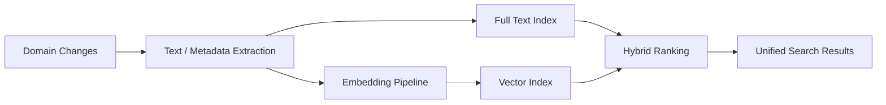

## 14.3 Search implementation notes

### Base design
- transactional data in primary DB
- denormalized search documents in index store
- async indexing jobs
- hybrid retrieval = keyword + semantic + domain boosts

### Cross-app result shaping
Each result should preserve:
- entity type
- app origin
- initiative context
- preview snippet
- relevance score
- optional suggested relationships

---

# 15. AI Architecture

## 15.1 AI principles

- optional
- explicit by default
- user-controlled providers
- graceful degradation
- never required for core CRUD
- never the sole source of truth

## 15.2 AI capabilities
- note summarization
- quest extraction
- suggested links
- semantic enrichment
- OCR/transcription pipelines
- optional proactive suggestions later

## 15.3 AI service design

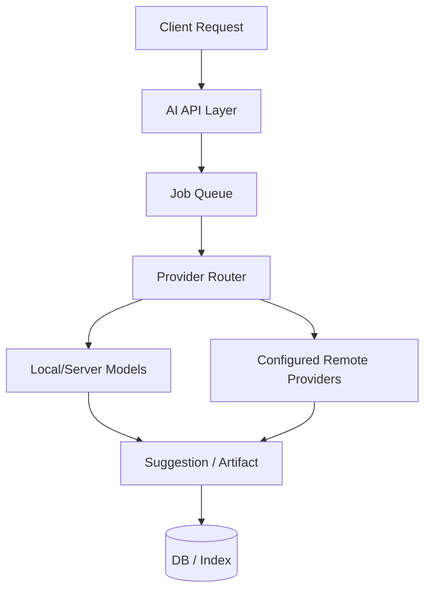

## 15.4 Provider abstraction

Support provider adapters, not provider leakage through the whole codebase.

Examples:
- local embedding model
- local transcription
- Ollama
- OpenAI-compatible APIs
- Anthropic-compatible orchestration

## 15.5 AI failure behavior

If AI is unavailable:
- show failure cleanly
- preserve user work
- do not block editing/capture
- allow retry
- avoid pretending confidence from absent output

---

# 16. Attachment Architecture

## 16.1 Attachment requirements

Must support:
- photos
- scanned docs
- audio
- video
- PDFs
- exports
- note/item/quest attachments

## 16.2 Storage model

- metadata in primary DB
- binary in object storage
- local cache on clients
- dedup/hash optional later
- background thumbnail generation

## 16.3 Attachment pipeline

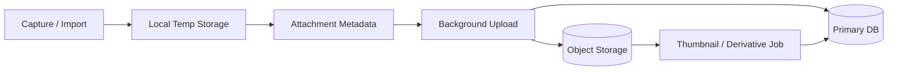

---

# 17. Notification Architecture

## 17.1 Notification types

- routine due
- timer complete
- daily check-in
- evening wrap-up
- weekly harvest
- low stock
- maintenance due
- optional knowledge reminders

## 17.2 Delivery model

- Android native push/local notifications
- desktop notifications where available
- email optional later
- web notifications optional, not primary

## 17.3 Notification ownership

Notification generation belongs on the server for cross-device consistency, with local-device fallback for offline-only timers and local reminders.

---

# 18. Security Architecture

## 18.1 Core security goals

- strict per-user data isolation
- secure self-hosted defaults
- safe attachment access
- auditable auth/session events
- least privilege for plugins/providers

## 18.2 Auth options

Initial:
- username/email + password
- Argon2id password hashing
- refresh/access token or signed session model

Later:
- OIDC
- 2FA

## 18.3 Security controls

- all API access authenticated except bootstrap/setup
- per-user authorization checks in every domain access path
- signed attachment URLs or gated downloads
- CSRF protections for browser session flows
- secrets loaded from environment / secret store
- structured audit logging for security-relevant actions

## 18.4 Multi-user isolation

Even if Altair is mostly used solo, the server must be built for **real tenant isolation** between users sharing the same instance.

---

# 19. Deployment Architecture

## 19.1 Supported deployment mode

Primary target:
- **Self-hosted Docker Compose**

Future:
- Kubernetes only if scale/ops justify it

## 19.2 Deployment topology

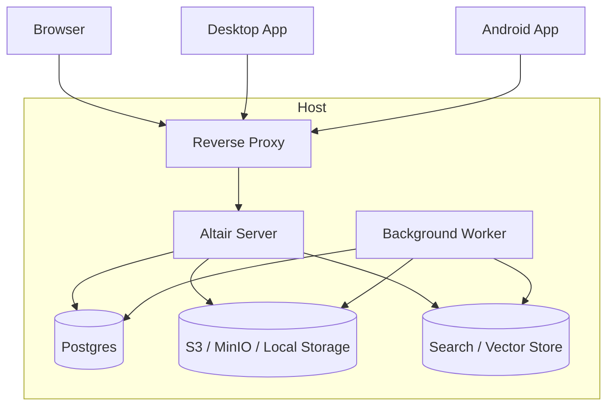

## 19.3 Environment profiles

### Small personal instance
- one server container
- one worker
- postgres
- local object storage or MinIO
- local AI optional

### Prosumer household instance
- reverse proxy
- altair app
- worker
- postgres
- MinIO
- optional search/vector sidecar

### Hosted/community instance
- split worker scaling
- managed object store
- separate AI/search capacity
- stronger observability and quotas

---

# 20. Observability and Operations

## 20.1 Logging
Use structured logs with:
- request IDs
- user ID where safe
- device ID
- mutation IDs
- job IDs

## 20.2 Metrics
Track:
- request latency
- sync success/failure
- queue depth
- indexing lag
- AI job durations
- attachment upload errors
- notification delivery outcomes

## 20.3 Tracing
Use distributed tracing across:
- API request
- sync processing
- background jobs
- AI pipelines
- attachment workflows

## 20.4 Admin surface
The web app should expose:
- instance health
- queue backlog
- storage usage
- user list
- invite/admin controls
- configured providers
- sync error summaries

---

# 21. Repository Strategy

## 21.1 Monorepo recommendation

Use a **monorepo**.

Why:
- shared schemas
- shared docs
- shared API contracts
- easier coordinated refactors
- cleaner release management

## 21.2 Suggested layout

```text
altair/
  apps/
    web/
    desktop/
    android/
    server/
    worker/
  packages/
    api-contracts/
    design-system/
    shared-types/
    search-schema/
    docs/
  infra/
    docker/
    compose/
    migrations/
    scripts/
  docs/
    prd/
    architecture/
    adr/
```

## 21.3 Contract sharing

Do not share entire business logic across every platform just because you can.

Share:
- schemas
- wire contracts
- iconography/design tokens
- protocol definitions
- test fixtures

Keep platform behavior native where it improves product quality.

---

# 22. API Style

## 22.1 Recommendation

Use a pragmatic HTTP API with typed contracts.

Good baseline:
- REST-ish resource APIs for CRUD/query
- dedicated sync endpoints
- background job endpoints for AI/processes
- websocket or SSE for optional live status later

## 22.2 API domains
- `/auth/*`
- `/core/*`
- `/guidance/*`
- `/knowledge/*`
- `/tracking/*`
- `/search/*`
- `/sync/*`
- `/attachments/*`
- `/admin/*`

---

# 23. Key Workflows

## 23.1 Offline quest completion

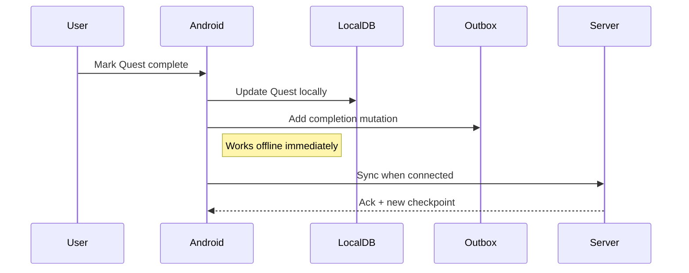

## 23.2 Knowledge capture with image + OCR

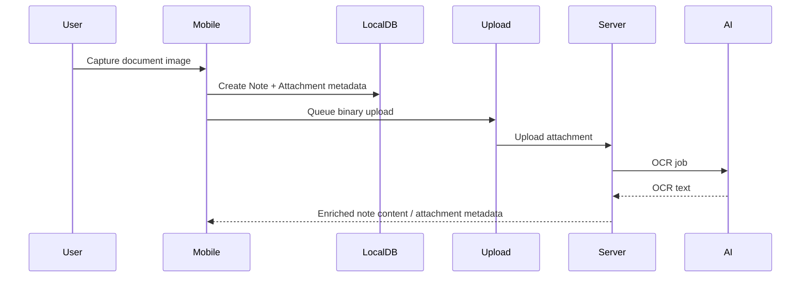

## 23.3 Tracking low-stock to guidance quest

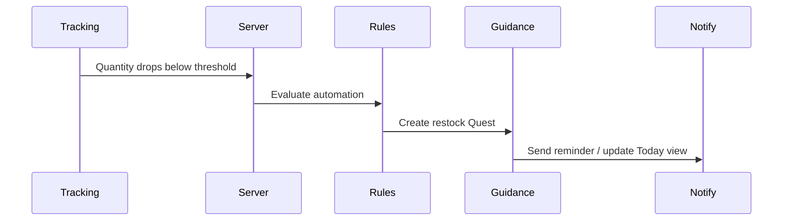

---

# 24. Evolution Strategy

## 24.1 v1 priorities

Build first:
- Android client
- Web client
- self-hosted backend
- robust sync
- Guidance core
- Knowledge core
- Tracking core
- attachments
- search baseline
- optional AI hooks

## 24.2 v1.1 / v2 candidates

- WearOS client
- richer plugin API
- UI plugins
- local desktop AI
- smarter merge behavior for notes
- richer automation rules
- iOS contributor path
- collaborative/shared household spaces

## 24.3 Extraction triggers

Only split the modular monolith when one of these becomes true:
- independent scaling pressure
- deploy cadence conflict
- operational isolation requirement
- security boundary requirement
- team topology demands it

---

# 25. Major Risks and Tradeoffs

## 25.1 Risk: Sync complexity
This is the biggest risk.

Mitigation:
- design sync first
- test offline/merge behavior aggressively
- use mutation IDs and checkpoints
- build conflict UX early

## 25.2 Risk: Mobile-native plus web/desktop split
This adds more codebases.

Mitigation:
- share contracts, not fantasies
- keep UX language and domain behavior consistent
- avoid over-sharing abstractions

## 25.3 Risk: SurrealDB adoption
This may add backend risk relative to Postgres.

Mitigation:
- default to Postgres for v1 unless graph-native ergonomics are worth the cost
- keep repository/storage abstraction clean
- isolate indexing/search concerns from primary persistence

## 25.4 Risk: AI scope creep
AI can consume the roadmap like a black hole with a nice landing page.

Mitigation:
- keep AI optional
- preserve explicit invocation defaults
- measure real user value before broadening scope

---

# 26. Recommended ADRs to Create Next

Create these Architecture Decision Records next:

1. **ADR-001:** Web/Desktop/Android client split
2. **ADR-002:** Postgres vs SurrealDB for primary persistence
3. **ADR-003:** Sync protocol and mutation model
4. **ADR-004:** Search index and embedding strategy
5. **ADR-005:** Attachment storage abstraction
6. **ADR-006:** Auth/session model
7. **ADR-007:** Monorepo structure
8. **ADR-008:** Notification ownership and delivery

---

# 27. Final Recommendation

Use this as the baseline architecture:

- **Web:** SvelteKit 2 + Svelte 5
- **Desktop:** Tauri 2 + shared Svelte UI
- **Mobile:** Android native with Kotlin + Compose
- **Backend:** Axum modular monolith
- **Client local DB:** SQLite
- **Server primary DB:** Postgres by default
- **Alternative server DB:** SurrealDB if consciously chosen
- **Storage:** S3-compatible abstraction
- **Sync:** operation-based, conflict-aware, server-mediated
- **AI:** optional job-based services
- **Deployment:** self-hosted Docker Compose first

This gives Altair the best balance of:

- product fit
- delivery realism
- offline reliability
- privacy
- future extensibility

And, crucially, it avoids building a beautiful universal hammer for a product made of screws, bolts, camera permissions, browser limitations, and human habits.

---
