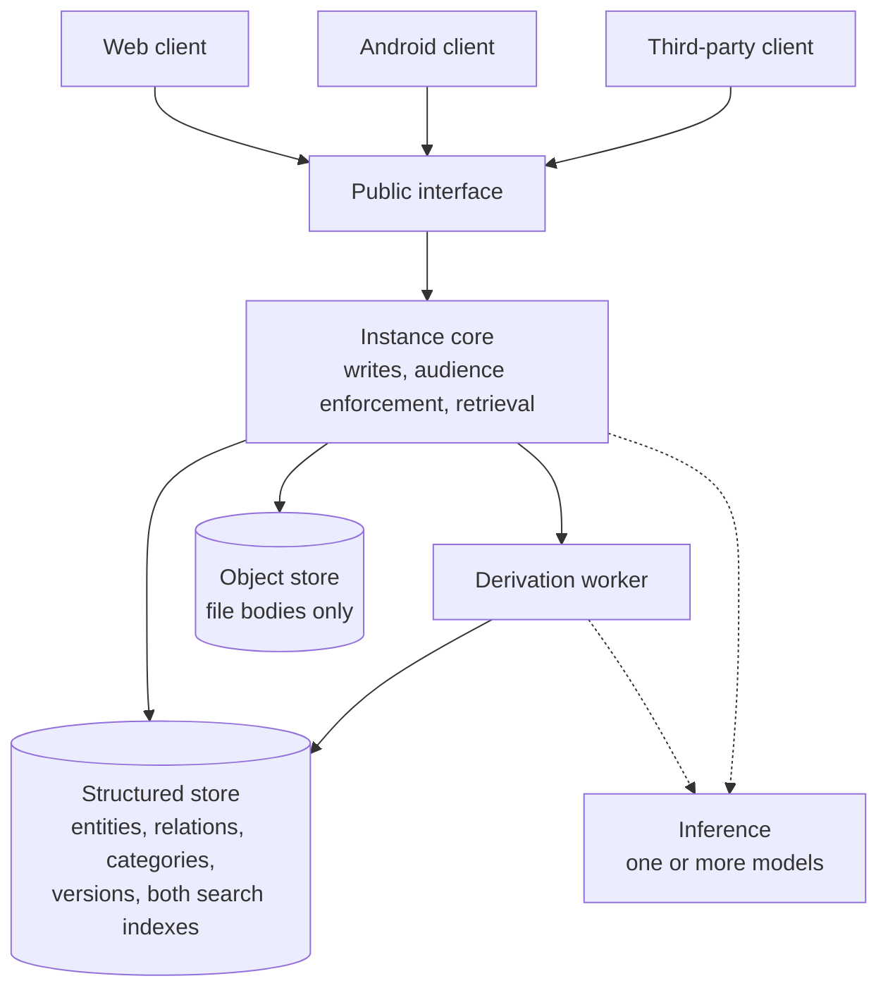
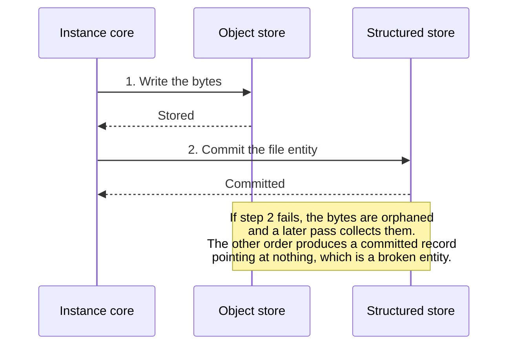
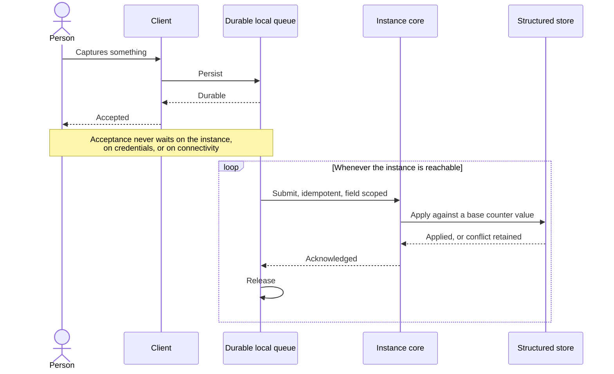
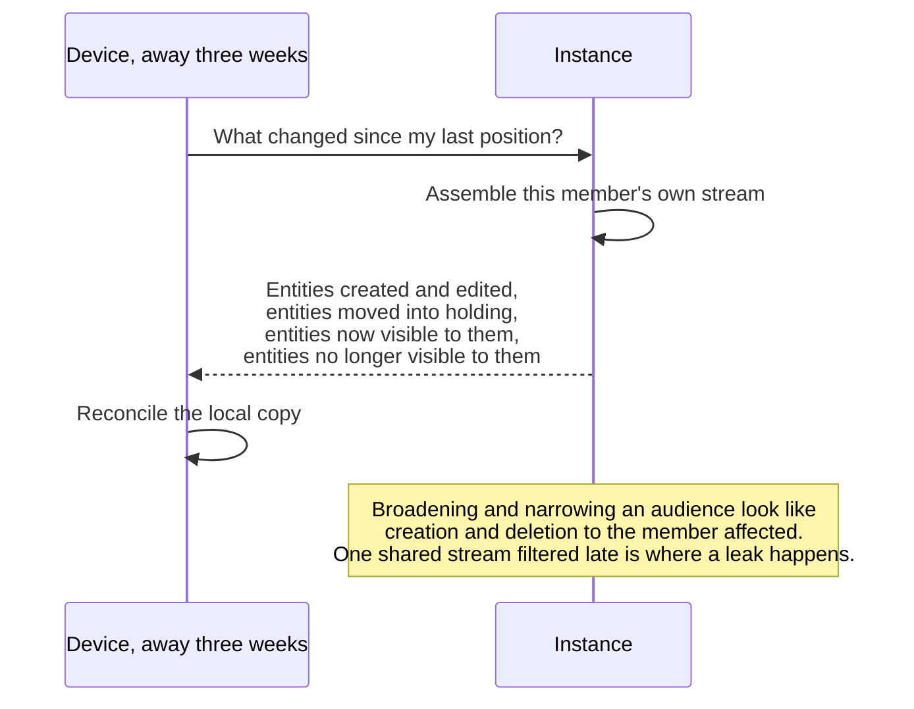
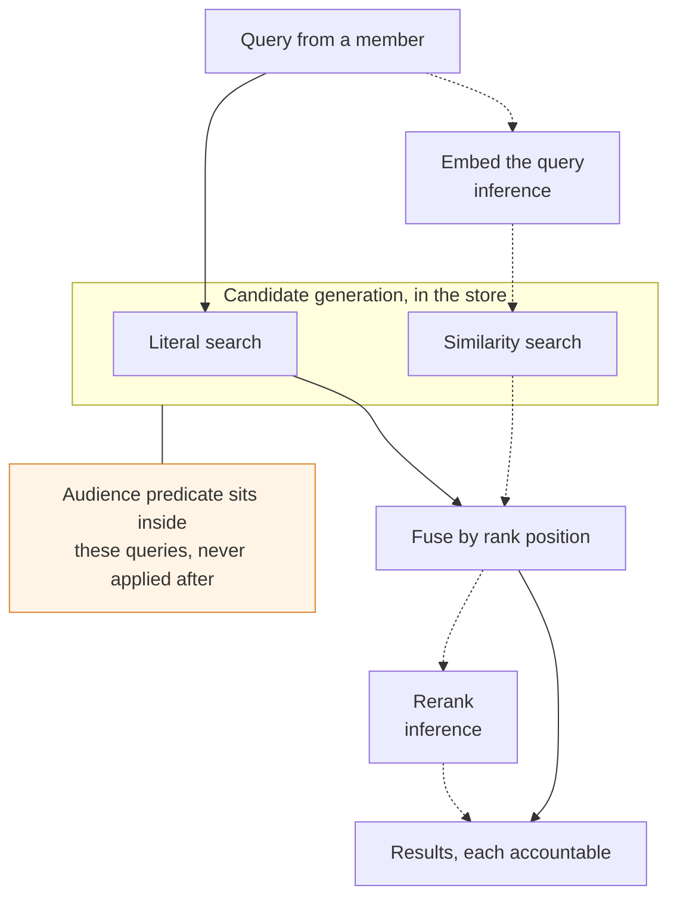

# Altair System Architecture

**Status:** Draft
**Date:** 2026-08-06
**Governed by:** Altair Vision & Scope
**Related:** Altair Substrate Specification, Altair Relation Types Specification, Altair Guidance PRD, Altair Knowledge PRD, Altair Tracking PRD

---

## What this document is

The shape of the system: what components exist, what each is responsible for, and what they owe each other.

It descends from the vision document and the specifications above. Where those state a requirement, this document says what structure delivers it. Where they are silent, this document does not invent product behaviour.

**It does not choose products.** No database, no object store, no model, no framework. Those are decision records made against the requirements here, and making them inside this document would invert the order the project works in: the design drives the architecture, and the architecture drives tool choice.

**The diagrams carry the same weight as the prose.** Each one states the same thing as the text around it rather than illustrating a part of it, so either route through this document is complete on its own. A dotted line marks something that may be absent, and the system is required to work without it.

**Two markings are used throughout.** A decision is called **one-way** when reversing it later means rewriting things that depend on it, and **reversible** when it can be changed behind a boundary without callers noticing. Where a choice is common industry practice rather than a judgement call, it says so.

---

## What the design already fixes

Restated because everything below is downstream of it, and because these are the constraints most easily violated by accident.

**Capture never fails.** Not degraded, not queued-and-hoped. Durable acceptance before acknowledgement, with credentials and connectivity having no bearing on whether a capture succeeds.

**Every capability is reachable through the public interface.** No capability exists only inside a client.

**Audience is enforced on every query surface, with no exceptions.** Nothing returns an entity the requesting member cannot see, on any path, including similarity.

**Ranking is deterministic.** The same query over the same data produces the same order, every time, for every member who can see the same things.

**Retrieval degrades rather than breaks**, and the state of an answer is visible.

**All derived data is rebuildable**, and losing it is a cost rather than a loss.

**One household per deployment.** Single tenant. There is no cross-household surface to get wrong.

**No required third-party service.** An operator may choose one. The project may not require one.

**Export is never foreclosed.** Everything the person put in comes back out, including file bodies.

---

## Deployment shape

**One instance serves one household.** An instance is the authority for everything in it.

**Components may be co-located or spread across machines on the operator's own network.** A second machine on the person's own network is not an external provider, so nothing about this requires a single box, and nothing requires more than one either.

**Process count is packaging, not architecture.** Containers make consolidating or separating processes a deployment decision. This document describes responsibilities and boundaries; how many processes they occupy is the operator's concern and the packaging's.

**No promise is made about minimum hardware.** The deployment Must is about ownership, not footprint: no commercial hosting requirement, no vendor account, no infrastructure the person cannot own or replace. Broadening what Altair runs on is an aim, not a constraint the design is built around.

**Solid lines are always present. Dotted lines may be absent**, and where they are, the section on degradation says what happens instead.

---

## Components

### Instance core

The authority. It owns the public interface, every write, audience enforcement, and the orchestration of retrieval.

**Everything else in this document is either behind the core or in front of it.** Stores are behind it. Clients are in front. Inference is beside it and is never authoritative.

**No component other than the core decides what a member is permitted to see.** This is the single most important boundary in the system, and the reason several things below are arranged the way they are.

**That is authorisation, not presentation.** What a client shows from what it already holds is its own business. Hiding worked quests, narrowing to one category, sorting by when something was last touched, searching the local replica while offline: none of that is a permission decision and none of it needs the instance. The offline floor makes this more than an efficiency argument, since a client with no instance in reach still has to answer questions against what it has.

**The rule is directional.** A client may narrow what it shows. It cannot widen. Nothing a client does can surface an entity the instance never sent it, because the per-member change stream means a local replica only ever contains what that member was already entitled to.

**One line worth drawing.** Ordering by a stated property is presentation. Producing a different relevance order is not, because ranking is specified, deterministic, and accountable, and a client that reorders results by its own judgement breaks all three.

### Structured store

Entities and their properties, relations and their anchors, categories, household membership, versions, derived text, embeddings, and both search indexes.

**Both search indexes live here**, with the structured content rather than in a purpose-built system alongside it.

The reason is not convenience, though the operational case is real: one system to run, one backup, one set of credentials. The reason is that the audience predicate must sit inside the query that produces candidates. A separate search system either has to be taught who may see what or has its results filtered afterwards, and filtering afterwards both risks leaking and gets limits wrong, because trimming a fixed-size candidate set can empty a result that had matches the person was entitled to.

**Reversible**, behind the interface, though not cheaply.

### Object store

File bodies, and nothing else.

**Common practice**, and it fits what a file body already is: canonical, immutable, unversioned, written once and read back whole. It also makes recoverable deletion natural rather than something to arrange, since the record can enter the holding state while the bytes sit untouched.

**The cost, stated because it is easy to omit.** The object store does not participate in transactions with the structured store. Creating a file entity is two writes to two systems and either can fail.

**The ordering that follows is not optional.** Bytes are written first and the entity record is committed second. Orphaned bytes are garbage that a later pass can collect. A committed record pointing at bytes that are not there is a broken entity, and capture never fails does not permit producing one.

**A self-hosted implementation is a first-class path**, not a fallback from a hosted bucket. An operator may point this at a hosted service. The project may not need one.

**Reversible.**

### Inference

Produces embeddings, scores query-document pairs, and whatever later stages require.

**Stateless, callable, and never authoritative.** It holds nothing the instance depends on, so it can live in the same process, on another machine on the household network, or nowhere at all.

**It is several models, not one**, and they are independently present or absent. A bi-encoder embedding documents and queries into the same space is a different model with a different cost profile from a cross-encoder reading a query and a document together. An instance may have one, both, or neither.

**Separating this is what the GPU argument was actually about.** Inference is the component whose appetite is unlike everything else, so it is the one that benefits from moving to hardware that suits it. The vectors it produces stay in the structured store.

**One-way in one respect:** treating inference as required rather than optional would foreclose deployments and contradict the degradation requirement. Building it as optional from the start is cheap; retrofitting optionality is not.

### Derivation worker

Runs the work that produces derived data: text extraction from files, embeddings, and anything later added to that list.

**It has a durable inbound queue of its own**, which is the same shape as the outbound queue on clients and points the other way. Capture must not wait for derivation, and outstanding derivation must be reportable, so the queue is a first-class thing with visible state rather than a background detail.

**Everything it produces records what produced it**, including which model. Changing a model invalidates what was derived under the old one. That is not data loss, since derived data is rebuildable by definition, but it is an operator-visible event and it must be recognisable rather than silently mixed.

**A user's edit to derived content outranks recomputation.** The worker does not overwrite one.

### Reclamation and delivery

**The passage of time produces no writes.** A recurrence is a rule and its occurrences are computed from it when something asks. The holding state expires by comparison against when the entity was deleted. The horizon is a predicate. None of these needs a job to have run in order to be true, which is why an instance that was switched off for a month is correct the moment it comes back.

**What remains on a clock is what cannot be computed.** Bytes belonging to an erased entity have to actually leave, unreferenced bytes have to be collected, the change sequence has to be trimmed once nothing can ask from that far back, and a notification has to reach someone who is not looking.

**It changes no answer.** Everything it removes is already gone by predicate, so it writes no change entries and does not go through the write path. A component that acts without a person is acceptable here precisely because nothing it does is visible.

**Its absence costs storage and notifications.** Neither is correctness.

### Notification delivery

**Notifications are a Should, not a Must.** No core path depends on one arriving, and losing delivery costs notifications and nothing else.

**Transport is the operator's choice, and the project ships no required provider.** The options are not equivalent in what they touch: something self-hosted on the household network reaches nothing outside it, a general forwarding library speaks to many services and the operator picks which, and a mobile platform's push service is outside the household by construction. All three are legitimate. Only the operator can weigh them, because only they know what they are willing to route through where.

**Where a transport reaches outside the household, the existing rules govern it**, unchanged and not specialised: the dependency stays contained rather than becoming a prerequisite for anything else, nothing leaves silently, and what leaves is named plainly before the transport can be enabled.

**What a notification carries is part of what leaves, and is configurable.** A reminder naming the quest is more useful and more revealing than one that does not, and which of those a person wants is not something the project can decide for them.

**There are two independent exposures and they do not move together.**

- **The transport**, meaning whoever is in the middle. Nothing outside the household network is in the middle when delivery stays inside it.
- **The screen**, meaning anyone who can read the device. This is unaffected by the transport. A notification delivered entirely within the household still appears on a phone that someone else in the household may be standing next to.

**The second is an audience question, and the concrete case makes it obvious.** Someone planning a surprise party keeps the quest private. A notification naming it, on their own phone, in their own house, shows it to the one person it was private from. Delivery was correct and the leak still happened, because being delivered to the right person and being displayed only to them are different things.

**So the default follows the entity's audience, and the transport raises it rather than setting it.** A shared entity is already something the household sees, so detail costs nothing on the screen; if the transport also leaves the household, that is a separate reason for caution and it applies on top. A private entity is cautious by default on the screen regardless of how it was delivered.

> ⚠️ **A uniformly cautious default is still not the answer.** A notification carrying no information is indistinguishable from an application asking for attention, and the ordinary response to those is to mute the application. A default that protects the content by getting the channel switched off has protected nothing and cost the feature. Keying it to audience is what avoids being cautious everywhere: most entities are not surprise parties.

**All of it stays configurable**, because someone who lives alone and someone who does not have genuinely different exposure, and neither is a case the project can infer.

**This is the only place in the system where a first-party feature reaches outside the household network by design**, which is why it is stated here rather than left to a client.

### Clients

**The floor is offline creation**, with everything above it a platform decision, and a client offering something above the floor owes the same guarantees as one that does not.

**Clients are not part of this system's trust boundary.** They are callers. See the next section.

---

## The public interface

**This is the product boundary.** Under AGPL, with capabilities required to be reachable through it, and with third-party clients a realistic outcome rather than a hypothetical, the interface is the contract between people who have never met.

**It states what a conforming client owes, not only what it may call.** In a project with two first-party clients, the guarantees can live in shared code and correctness is one maintainer's problem. Once someone else can write a client, guarantees that exist only as an implementation are guarantees nobody outside can meet, and getting them wrong loses a person's data.

What a conforming client owes:

- **Durable local acceptance before acknowledging a capture.** Acknowledging first and persisting after is the one failure that violates the product's hardest guarantee.
- **Idempotent submission.** A retried write is recognised as the same write, not applied twice.
- **No assertion of authority.** A device that has been away is not a source of truth about what the household did while it was gone.
- **Guarantees scale with what is offered.** A constrained client that only creates is conforming. A client that offers more owes the same correctness for the more.

**Whether the first-party clients share an implementation is a build decision, not an architectural one**, and it stays reversible as long as the interface carries the obligations rather than the code.

---

## The write path

The hardest guarantee in the product, crossing every component.

**Acceptance is local and durable.** A capture is safe on the device before anything is acknowledged to the person. Nothing about credentials, connectivity, or the instance's health participates in that.

**The outbound queue carries writes to the instance**, and its properties are specified in the substrate: nothing is lost, retries are safe, order is preserved where it matters, waiting is silent, and a fault is signalled rather than swallowed.

**Writes are field-scoped.** An update names what it changed and the counter value it was based on.

**The write counter detects conflict and holds no content.** It advances on every accepted write and is never shown to anyone. It is not a version in the sense used for content history, and the two are named apart deliberately.

**Overlapping concurrent changes retain both.** Nothing is discarded to make a conflict go away.

---

## Change over time

**The interface expresses what changed, not only what is.**

**One-way.** An interface that answers only "what is the current state" cannot be extended into one that answers "what did I miss" without changing every consumer. Choosing not to have this forecloses offline operation, which is a stated Should, and it forecloses it silently.

**The reason is the same one the product exists for.** No barriers to re-entry has always been about a person coming back after weeks. A device coming back after weeks is that requirement wearing different clothes. Solve it only at the person layer and it reappears at the device layer, where the person experiences it as their phone being wrong.

Three consequences:

**Deletion is a change, not an absence.** Already solved by an existing decision: deletion moves an entity into a holding state rather than removing it, so a returning client learns of it the way it learns of an edit. Permanent erasure is the only thing that truly disappears, it is rare and user-initiated, and it needs its own signal because absence alone is indistinguishable from never having existed.

**The change stream is per member.** Broadening an audience makes something appear in another member's view for the first time; narrowing makes it vanish from theirs. To that member these are indistinguishable from creation and deletion, and they must arrive as such.

> ⚠️ This is the most likely place in the system for a leak. The naive implementation is one stream filtered per consumer, which works until the filter is applied one layer too late.

### Falling behind

**Full reconciliation is always available and always correct.** A client can discard what it holds and rebuild from the instance. Everything below depends on this, and it is what makes a horizon safe to have at all.

**A horizon exists, and it is retained history like version history.** An instance may stop being able to answer what changed since a given position, because retaining every change forever is a cost like any other. It is bounded, the bound is the operator's, and retaining none is valid: with no horizon at all, every client rebuilds, which is always available and always correct.

**It is not expressed as a duration.** Time is a proxy for volume and it is wrong in both directions: a fortnight of heavy use can be more than a quiet quarter, and a quiet quarter may cost nothing to retain. What the instance measures is its own business and it is free to be adaptive.

**It differs from version history in one respect worth noting.** Version history is something a household can see and use, so declining it removes a visible feature. The horizon is invisible except as how long a rarely-used device takes to come back, so it is an operator concern rather than a household preference, and it belongs with the other retention windows in the operator plane.

**Falling past it is detected, never silent.** A client asking from a position the instance can no longer answer is told so, and reconciles fully instead. A partial answer presented as a complete one is the failure mode this exists to prevent, and it is worse than no answer, because the client believes it is current.

> ⚠️ **The horizon is either nothing or longer than every other retention window. A value in between is a bug.** Where something expires on a schedule and that expiry is itself a change, such as a deleted entity leaving the holding state, a client away longer than the horizon but shorter than that window catches up and rebuilds a picture that is wrong rather than merely stale. Nothing is safe, because then no client catches up at all. Any middle value is a correctness problem wearing the costume of a tuning choice, and it surfaces months later as entities that came back from the dead.

**This makes the horizon an optimisation.** Catching up incrementally is cheaper when it is possible, and when it is not, the fallback is complete rather than degraded.

**When to prefer one over the other is the client's judgement, not the instance's.** The instance says what it can answer. Whether catching up is worth doing is a question about the asking device's own memory, storage, power, and connection, and the same answer is not right for two clients of the same instance.

A device holding a handful of quests on a small display can rebuild for almost nothing, so incremental catch-up may never be worth its complexity there, and a client that always fetches current state and never uses the change stream is conforming. A client holding months of material across every domain is the opposite case, and for it a full rebuild is the expensive path. Neither is the general answer, so the interface offers both and neither is privileged.

**A client need not hold everything.** A display showing today's quests is a legitimate consumer of a scoped subset, and asking only about what it shows is not a degraded form of participation. The offline floor is about clients that create; a client that only displays owes nothing beyond not misrepresenting what it holds as more than it is.

**Ordering is instance-level and is not wall-clock.** Devices are offline and clocks skew, and no device's clock settles anything. It is also not the per-entity write counter, which answers a different question. Two ordering concepts, named apart.

---

## Retrieval

**A pipeline of stages, not a single operation.** Some stages are model inference and some are not, and stages are independently present or absent.

**Candidate generation applies the audience predicate, in the store.** The predicate is inside the query that produces candidates. Never a filter over results.

> ℹ️ This is a rule about how the instance builds an answer, not about clients. A client narrowing what it displays from a replica it already holds is presentation, and is covered under [Instance core](#instance-core).

**Literal matching is a permanent arm, not a fallback.** It runs on every query alongside similarity rather than only when inference is unavailable. This is also why a just-captured entity is findable by its words before derivation has produced anything: one arm knows about it and the other does not yet, which is not a mode and needs no explaining to anyone.

**An entity returned by more than one arm is one result.** Fusion deduplicates. An entity matching both literally and semantically is a stronger match rather than two weaker ones, and rank-based fusion already treats appearing in several lists as evidence.

**Fusion combines ranked lists by position.** This removes the need for scores from different retrieval methods to be comparable, and it extends to combining results across domains, which the design records as an open question about whether relevance can be compared across genuinely different kinds of content. Position-based fusion does not require it to be. Whether a merged list is what a person wants remains a question for real data.

**Results carry enough to be accounted for.** A person can tell why something is in front of them, and this matters most where they supplied no words, which is surfacing. This is a requirement on what the pipeline returns, not a presentation concern.

**Ranking is deterministic.** Any stage that is not deterministic by nature is pinned so that it is. This constrains any future generative stage from its first experiment.

### Degradation

Per stage, not a switch. Retrieval answers; it does not fail.

| Stage unavailable | Behaviour |
|---|---|
| Bi-encoder | Literal search only. Answers, and says so |
| Cross-encoder | Fused order, unreranked |
| Any later optional stage | The pipeline without it |
| Structured store | Retrieval is unavailable. This is not degradation, it is the instance being down |

**Literal search stands alone** and never depends on inference being reachable.

---

## Identity and trust

**One household, one instance.** No cross-household anything.

**Members are identified within the instance.** Audience is per member and enforced by the core.

**Device binding is separate from credentials.** A device is bound to an instance in a way that does not require the person to hold credentials at the moment they capture something, because capture cannot depend on credentials.

**Clients are callers, not trusted components.** Nothing is enforced only in a client.

---

## Operations

**Backup covers two stores.** Structured content and file bodies. Derived data is rebuildable and need not be included, which is a meaningful reduction, though rebuilding it costs inference time the operator should be told about rather than discover.

**Upgrading after a long absence is an ordinary case, not an edge case.** A self-hosted instance is updated at random intervals, sometimes across several releases, by a person who has been away. This is the same principle as everything else in the product: coming back is not made expensive by the time spent away.

**Instance health is visible without a support channel**, and it is surfaced early rather than filed somewhere a person has to know to look. Queue depth, outstanding derivation, whether inference is reachable, whether storage is short.

**Diagnosis and repair carry no friction.** Seeing that something is wrong, and doing the thing that fixes it, both belong where the person already is: retrying what was refused, prompting derivation, clearing space. What lives in the operator plane is tuning, and the detail useful only to someone configuring the instance. Someone returning after weeks finds out immediately and can act without going anywhere first.

> ℹ️ This is permitted despite the prohibition on counters that rise while a person is away, and the substrate already draws the line: an instance reporting that it is running out of storage is describing itself, not judging the user. A stuck queue is a fact about the machine, not a backlog of work someone owes.

### The operator plane is a separate surface

**Configuration lives apart from the surfaces people use daily**, rather than behind a settings icon on them.

**The reason is friction, deliberately placed.** Tuning a system is one of the most reliable ways to spend an afternoon feeling productive without anything changing, which is the same trap the vision document names when it rules out a plugin marketplace and keeps configuration near zero. A settings panel a tap away from the daily surface is an invitation to go and adjust something instead of doing the thing. Putting it somewhere else does not prevent that, and is not meant to. It makes it a decision rather than a reflex.

**Intentional, and not impossible.** The friction is separation, not obstruction. Nothing is hidden, nothing requires reading a file by hand, and an operator who needs to change a retention window can. What they cannot do is wander into it.

> ⚠️ **Friction belongs on tuning, not on diagnosis or repair.** Seeing that the queue is stuck, that storage is short, or that derivation is behind is not configuration, and it is exactly what a person needs when they come back to an instance that has been running without them. Making that hard would put a barrier on re-entry, which is the thing the product exists to remove. Health is visible from where the person already is; the knobs are elsewhere.

**Counts belong here that would not belong elsewhere.** How many items are waiting to send is a productivity measure on a daily surface and a system health measure on this one. Depth, queue length, and how far derivation is behind are ordinary here, because nothing on this surface is about what a person owes.

**Reaching it is governed by a flag on a member.** Somebody has to be able to configure the instance, and the alternative to naming who is that everyone can, which is not a decision so much as the absence of one.

**At least one member always has it**, or the instance becomes unconfigurable. Whoever deployed it starts with it. In a household of one, that person has it and the plane is simply another surface they can reach.

> ⚠️ **The flag is for administrative work, not for anyone's own work, and it is not a permission system.** It governs one surface. It does not touch audience, and an administrator does not see another member's private entities, because audience attaches to the entity and answers who may see it regardless of what anyone administers. Roles, groups, and inherited permissions over entities are excluded, and this flag is not an argument otherwise.

---

## Constraints carried from the design documents

Collected here because they are scattered across five documents, easy to violate in the first week of building, and expensive to fix afterwards.

- **Do not foreclose export.** Everything comes back out, including file bodies, in a form that is not hostile to read.
- **Relation types are declarations the system interprets, not hardcoded branches.** The set is provisional and expected to change, and a possible later decision to let people declare their own would then be exposing what already exists rather than building something new.
- **Device binding stays separate from credentials.**
- **No capability exists only in a first-party client.**
- **The audience predicate is never applied after the fact** in any query the instance runs. Client-side narrowing of an already-authorised replica is a different thing and is permitted.
- **Ranking stays deterministic**, including through any stage added later.
- **Nothing enters or leaves a surface without a cause the person can point to.** Another member's edit, a recurrence they configured, and the passage of time all qualify. What is prohibited is the system authoring the change: reordering under them, adapting to them, or derivation altering what they are already looking at. That is what constrains where derivation is allowed to have visible effects.

---

## Deliberately not decided

Product selection. Which structured store, which object store implementation, which models, which languages or frameworks. Each is a decision record made against the requirements above, and each stays reversible for as long as the interface hides it.

Also not decided here: the retrieval pipeline's exact stages, which are empirical and follow from trying things against real data.

---

## Open questions

1. **What the instance measures when deciding it can no longer answer from a given position.** That a horizon exists, that falling past it is detected, and that it has a floor set by other retention windows are all specified under [Change over time](#falling-behind). The shape of the measure is an implementation matter constrained by that floor rather than a behavioural one. The mirror question on the client side is not open: when to prefer a rebuild over catching up is the client's own judgement and varies too much between devices to be specified centrally.
