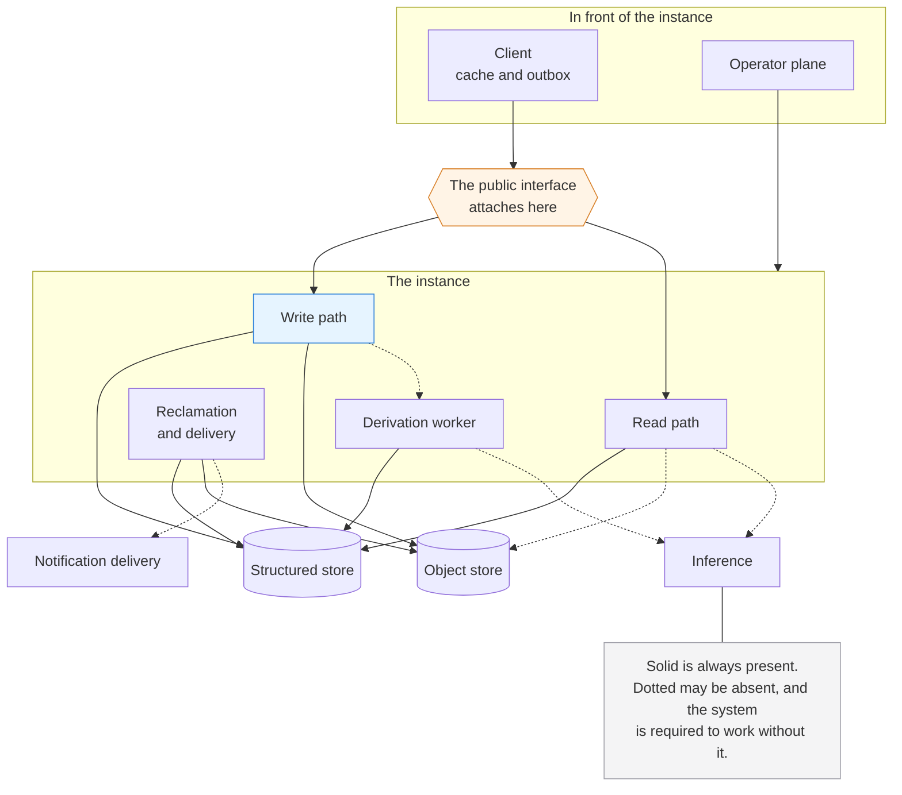

# Altair Component Model

**Status:** Complete. Decisions taken during assembly are listed at the end.
**Date:** 2026-08-14
**Governed by:** Altair Architecture Foundations, Altair System Architecture
**Related:** Altair Vision & Scope, Altair Substrate Specification, Altair Data Model, Altair v0 Scope

---

## What this document is

Every component the system carries, in one place: what each is responsible for, what crosses each of its boundaries, and what happens at each boundary when the other side is absent. The architecture foundations and the system architecture remain the authority. This document states the structure that satisfies them and decides nothing, so where they disagree with it, this document is wrong.

It covers the full system, with no release annotations. What any release instantiates is the business of its scope document.

**The absence column is the load-bearing one.** A list of components and arrows says almost nothing that the deployment sketch does not already say. What a component owes when the thing on the other side of a boundary is not there is where the guarantees either hold or quietly stop holding, and it is the column that is wrong most often in systems that were drawn before they were built.

---

## How to read a boundary

Every boundary below states what crosses it, in which direction, and what happens when the other side is absent.

**Three kinds of absence are distinguished, because they carry different obligations.**

- **Absent by deployment.** The component was never installed. Inference is the case: an instance may have one model, several, or none, and none is a conforming deployment. Nothing may treat this as a fault.
- **Absent for now.** The component exists and is unreachable, or is behind. A device with no signal, a worker whose queue is long, a machine that is off. Recovery is arrival, and nothing is owed in the meantime.
- **Absent by choice.** A capability the operator or the household turned off. Version history declined, a generative feature never enabled, no notification transport configured.

**Absence for now is waiting, and waiting is silent.** A condition the ordinary path clears by continuing to run is not reported as a fault. One that will not clear that way is signalled, and one not known to be self-clearing is treated as a fault. The absence columns below are written on that distinction.

**The obligation is the same in all three**, and stating them apart is what keeps that from looking like an accident: the system answers, says plainly what it could not do, and never presents a partial result as a complete one.

---

## The component map

**Nothing crosses from the read path to the write path**, and the absence of that arrow is a statement rather than an omission.

---

## The boundary the public interface attaches to

**It attaches at the client boundary of the instance, and nowhere else.** Everything a client can cause the instance to do crosses there, in both directions:

- **Inbound.** Intents: create, edit, remove, erase, restore. Queries, with their scope. A request for what changed since a stated position. A request for current instance health.
- **Outbound.** Acknowledgement of an accepted intent. Results, each carrying enough to be accounted for. A change set assembled for one member. A statement that a stated position can no longer be answered. Health, read only.

**Naming the boundary is what makes deferring the interface definition safe.** Defining it later is describing a boundary that already exists and is already fully enumerated, not choosing where to put one. What would foreclose it is a capability that reaches the instance by some other route, and there is none: the operator plane is the only other inbound boundary and it is discussed under its own heading.

**Nothing else reaches the instance through this boundary.** The operator plane is the only other inbound surface, and reclamation and delivery is inside the instance and submits nothing, so there is no capability living somewhere the interface cannot reach.

---

## Components

### Client

**Responsible for** durable local acceptance of a capture, holding the outbox, holding whatever cache it chooses to hold, narrowing what it displays from that cache, and deciding whether to catch up or rebuild.

| Other side | What crosses | When the other side is absent |
|---|---|---|
| The person | A capture, an edit, a query, a request to see something | Nothing waits and nothing accumulates. A returning person is owed no work by the client |
| Its own durable storage | The outbox, which exists nowhere else, and the cache, which is derived | Acceptance is refused and the condition is stated plainly at the moment of the attempt. This is the one place in the system where absence is not survivable, which is why the guarantee attaches here |
| The instance | Out: intents, queries, a position. In: acknowledgements, results, change sets, health | Acceptance already happened locally, so nothing is lost and waiting is silent. The outbox holds and retries. A client above the floor answers from its cache. Anything requiring the instance is unavailable rather than failed, and says which. An item the instance refused will not clear by waiting, so it is signalled |

**Never.** Widen what it shows beyond what it was sent. Produce a relevance order of its own. Assert authority about what the household did while it was away. Acknowledge a capture before it is durable.

**The outbox carries bytes, not only entity records.** A photo taken on a phone is a capture like any other, so acceptance covers the body, and the body is held locally until it can be transmitted. Local storage that cannot hold it is the durability failure above, not a queue condition.

### Instance core: write path

**Responsible for** accepting a submitted intent, applying it against a base counter value, detecting concurrency, retaining both values where a real conflict exists, recording the entry in the change sequence, and carrying out deletion, grouped deletion, restoration, and erasure.

| Other side | What crosses | When the other side is absent |
|---|---|---|
| Callers, via the public interface and from scheduled work | In: intents. Out: acknowledgement | Nothing. The write path holds no state on behalf of a caller that is not there |
| Structured store | Entity content, relations, the change entry, conflict state | No acknowledgement is issued and nothing is accepted. The caller's outbox holds. Acknowledging ahead of a durable commit is the one failure this path is built to prevent |
| Object store | File bytes, written before the record that points at them | The file entity is not committed. The bytes stay in the caller's outbox, and the intent is retried whole |
| Derivation worker | A signal that something changed | Acceptance is unaffected. The outstanding set grows and stays reportable |
| Read path | Nothing | Not applicable, and load-bearing that it is not |

**Never.** Reject a write for a stale base counter. Depend on an index being current, on a model being reachable, or on derivation having run. Discard a value to make a conflict go away.

**It enforces audience, on the same predicate the read path uses.** A write naming an entity the submitting member cannot see is refused exactly as a write naming an entity that does not exist is refused, and the two are indistinguishable from outside, so refusal never reveals that something is there. Clients are not trusted components, and one enforcement rule everywhere is cheaper to keep true than two.

### Instance core: read path

**Responsible for** the retrieval pipeline, assembling each member's change set, reporting instance health, and returning results that can be accounted for.

| Other side | What crosses | When the other side is absent |
|---|---|---|
| Callers, via the public interface | In: queries, scope, a position. Out: results, change sets, health, and the statement that a position is past the horizon | Nothing. No per-client cursor is held here: a client reports its own position, so a client that never returns costs the instance nothing |
| Structured store | Candidate queries with the audience predicate inside them, the change sequence, health facts | Retrieval is unavailable. This is not degradation, it is the instance being down |
| Inference | Out: a query to embed, or a query and document together to score. In: vectors and scores | Literal search answers alone, and the answer says so. Literal matching is a permanent arm, not a fallback |
| Object store | A file body, on request | The entity, its title, its relations, and its derived text are all available. The body is currently unavailable, which is a different statement from missing |

**Never.** Write anything: not entity content, not derived data, not a record of what was asked or opened. Apply the audience predicate after candidate generation. Return an order that varies between members who can see the same things.

### Reclamation and delivery

**Responsible for** the two things the passage of time causes that cannot be computed on demand: removing bytes and history that nothing can ask for any more, and delivering a notification to someone who is not looking.

| Other side | What crosses | When the other side is absent |
|---|---|---|
| Structured store | Removal of entities past their holding window, and trimming of the change sequence below the horizon's floor | Storage is not reclaimed. No answer changes, because everything it would have removed is already gone by predicate |
| Object store | Removal of bytes belonging to an erased entity, and of bytes no record points at | Erased bytes persist until the next pass. This is the one case where its absence has a cost beyond storage, and it is bounded by how often it runs |
| Notification delivery | A date that has come forward, with content whose default follows the entity's audience | Nothing is delivered |
| The clock | The passage of time | Work is late. Nothing is wrong while it waits |

**It writes no change entries and does not use the write path.** Everything it removes is already unreachable to every query, so there is nothing to announce. A component acting without a person is acceptable here precisely because nothing it does is visible.

**Never.** Produce an entity. Remove anything a query could still legitimately return. Report what it has not done yet.

**Why time does not write.** A recurrence is a rule, and its occurrences within the runway are computed from the rule when something asks. The holding state expires by comparison against when the entity was deleted. The horizon is a predicate. Three properties follow, and they are why this is the shape rather than a ticker producing records in advance:

- **An instance that was off for a month is correct the moment it returns.** No catch-up, no backfill that has to avoid producing occurrences for days that already went by.
- **Nothing accumulates in the literal sense.** A recurrence nobody engaged with for six weeks leaves no records behind, because none were made.
- **The horizon is a promise rather than an artifact.** A position is refused because it is past the horizon, not because a trimmer happened to have run.

**An occurrence becomes a record the first time anyone touches it**, which is when it is completed, related to, or written about. Before that it is a projection of the recurrence as it currently stands. This satisfies the Guidance PRD as written: an occurrence has its own identity and is independently editable once it exists, editing a recurrence never rewrites an occurrence that already exists, and a past occurrence is past. The word spawn in that document describes when an occurrence appears to the person, which is unchanged.

**A view whose contents depend on the current time cannot be answered from a client cache**, because no change entry announces that time passed. The client re-reads, or says the period it is showing has ended.

### Derivation worker

**Responsible for** text extraction, embeddings, and anything later added to that list, together with the record of what produced each result.

| Other side | What crosses | When the other side is absent |
|---|---|---|
| Structured store | In: the set of work outstanding. Out: derived content, embeddings, and provenance including which model | It waits. Nothing is lost, because what is outstanding is a fact about the store rather than about the worker |
| Inference | Out: content to embed or extract from. In: vectors and extracted text | Work waits and the outstanding set grows. It stays reportable, so the honest form is visible rather than presenting as quietly worse results |
| Write path | A signal that something changed, which is an optimisation over noticing | Work is found later rather than sooner |

**Absent in whole:** capture is unaffected, a new entity is findable by its words immediately, and it becomes findable by its meaning whenever the worker returns. Nothing switches modes and there is no second kind of search to explain.

**Never.** Gate acceptance. Overwrite a person's edit to derived content. Mix results from a superseded model with current ones without the difference being recognisable.

**The work set is a fact about the store, not about the queue.** Derived content records what produced it, so what is missing or stale by provenance is computable from the store alone. The inbound queue is an optimisation over that computation and is never the only record of it, which is what keeps outstanding derivation reportable after a queue is lost, and derived data being discardable means losing one is expected rather than exceptional.

### Inference

**Responsible for** producing embeddings and scoring query and document pairs. Stateless, callable, and never authoritative.

| Other side | What crosses | When the other side is absent |
|---|---|---|
| Read path | In: a query, or a query and a document. Out: a vector, or a score | Covered at the read path. Per stage, never a switch |
| Derivation worker | In: entity content, including content private to one member. Out: vectors and extracted text | Covered at the derivation worker |

**It is several models, independently present or absent.** A bi-encoder and a cross-encoder are different components with different appetites, and an instance may have one, both, or neither.

**Content crossing this boundary includes private entities**, which is permitted because this is not a query surface and inference sits inside the instance's trust boundary. What it may not do is leave the household: retrieval is core, so it runs on hardware the household controls. A generative feature reaching outward is the other class and carries its own rules.

**Never.** Hold anything the instance depends on. Be required for a write to be accepted, for a capture to succeed, or for literal search to answer.

### Structured store

**Responsible for** entities and their properties, relations and their anchors, categories, membership, versions, conflict state, the change sequence, derived text, embeddings, both search indexes, and the instance's configuration.

| Other side | What crosses | When the other side is absent |
|---|---|---|
| Write path | Scoped writes conditional on a counter, and the change entry, as one unit | The instance accepts nothing |
| Read path | Candidate queries carrying the audience predicate, change sets, health facts | Retrieval is unavailable |
| Derivation worker | The outstanding work set, and derived content with provenance | Derivation stops and resumes |
| Scheduled work | Writes like any other, plus trimming the change sequence | Nothing expires and nothing spawns |
| Operator plane | Configuration and retention windows | The instance runs on what it last held |

**Absent in whole:** the instance is down. Nothing above it degrades gracefully, and pretending otherwise would be the partial answer presented as complete that the rest of the design refuses.

**Both search indexes live here**, because the audience predicate must sit inside the query that produces candidates, and a separate search system either has to be taught the audience rules or has its results filtered afterwards.

**Configuration lives here** rather than in a file beside the instance, so that it is backed up with everything else and reachable by the same queries. The object store holds file bodies and nothing else, which leaves no second candidate.

### Object store

**Responsible for** file bodies, and nothing else.

| Other side | What crosses | When the other side is absent |
|---|---|---|
| Write path | Bytes, written before the record that points at them | No file entity is committed. Every other kind of capture is unaffected |
| Read path | A body, on request | The entity exists and its body is currently unavailable |
| Scheduled work | Removal of unreferenced bytes, and of bytes belonging to an erased entity | Garbage accumulates, which costs storage and nothing else. Bytes belonging to an erased entity are the exception and are treated under ordering below |

**Never.** Hold anything that is not a file body. Participate in a transaction with the structured store, which it cannot, and which is why the ordering rules exist.

### Notification delivery

**Responsible for** delivering a notification through the transport the operator chose, carrying content whose default follows the entity's audience and which the transport may narrow further.

| Other side | What crosses | When the other side is absent |
|---|---|---|
| Scheduled work | A date that has come forward, and what may be said about it | Nothing is delivered |
| The transport | Whatever the operator's choice sends, named plainly before it can be enabled where it leaves the household | Delivery fails. This costs notifications and nothing else, because no core path depends on one arriving |

**Never.** Become a prerequisite for anything. Be the only route by which something is knowable. Escalate, repeat as pressure, or report what was not delivered as a backlog.

**An undelivered notification is dropped, not queued.** A reminder that arrives after the thing it was about has passed is a nag about the past, and the thing itself is still there to be found whenever the person looks.

### Operator plane

**Responsible for** configuration: retention windows, the horizon, transport choice, which models are present, whether a generative feature is enabled, and asking for a rebuild of derived data.

| Other side | What crosses | When the other side is absent |
|---|---|---|
| The instance | Configuration in. Nothing about a member's own material | The instance runs on its current configuration indefinitely, which is a supported state rather than a degraded one |
| A member holding the flag | Reaching the plane at all | At least one member always holds it, or the instance becomes unconfigurable |

**Diagnosis and repair are not confined here.** Whether the queue is stuck, whether derivation is behind, whether inference is reachable, and whether storage is short are surfaced where the person already is, and so is the action that puts each right. What this surface adds is depth: counts that would read as productivity measures on a daily surface are system health measures here. Friction belongs on tuning, never on finding out that something is wrong or on fixing it.

**Never.** Grant sight of another member's private entities. Become a permission system. Be required in order to use the instance.

**Its capabilities are reachable through the public interface**, like every other capability. The requirement is about where a capability lives, not about which surface presents it, and the friction this plane exists to create is the separation of the surface rather than a gap in the interface.

---

## What is not a component

**The public interface.** It is a boundary the core owns, not a thing that can be absent or replaced independently. Drawing it as a box implies otherwise.

**The search indexes.** They are inside the structured store, and the reason is the audience predicate rather than convenience.

**The client cache.** Inside the client, derived, and discardable. The outbox is the part that is not.

**Conflict state, versions, and the change sequence.** Data in the structured store. They appear here only as what crosses a boundary.

**The household.** One per instance, so there is no component that arbitrates between households and no cross-household surface to get wrong.

---

## Ordering where atomicity is not available

Two stores cannot participate in one transaction, so the boundary between them is ordered rather than atomic.

**Creating a file: bytes first, then the record.** An orphan is sweepable by a later pass. A committed record pointing at bytes that are not there is a broken entity, and producing one is not permitted.

**Erasing a file: the record first, then the bytes.** The order inverts because the risk does. Removing the bytes first leaves a live record pointing at nothing, which is the state the creation rule exists to prevent, and it lasts indefinitely if the second step never succeeds. Removing the record first leaves bytes that nothing references, which is the state reclamation already handles, so the window closes on the next pass whether or not the first attempt finished. This makes reclamation load bearing for erasure rather than housekeeping, and it is the reason that component cannot be optional.

---

## Decisions taken during assembly

Recorded so the reasoning is not lost and none of them is relitigated. Each is stated in place above.

| Decision | Why |
|---|---|
| Time produces no writes. Recurrences, holding-state expiry, and the horizon are computed when asked | An instance that was off for a month is correct on return, nothing accumulates, and the horizon is a promise rather than an artifact of when a job ran |
| Reclamation and delivery is the only component acting without a person | What is left after the above is invisible by construction, which is what makes acting without a person acceptable |
| The write path enforces audience on the same predicate as the read path | Clients are not trusted, and one enforcement rule is cheaper to keep true than two |
| The outbox carries bytes | A photo is a capture like any other, so acceptance covers the body |
| Erasing a file removes the record before the bytes | A live record pointing at nothing lasts indefinitely; unreferenced bytes close on the next pass |
| Outstanding derivation is computed from the store, and the queue is an optimisation | Reportability has to survive losing a queue, and losing one is expected |
| Operator plane capabilities are reachable through the public interface | The requirement is about where a capability lives, not which surface presents it |
| Configuration lives in the structured store | It backs up with everything else, and the object store holds bodies and nothing else |

**Two amendments to the architecture followed from assembling this** and are already made: the component above is named there, and the constraint on what may change a surface no longer prohibits the household or the calendar along with the thing it was aimed at.
