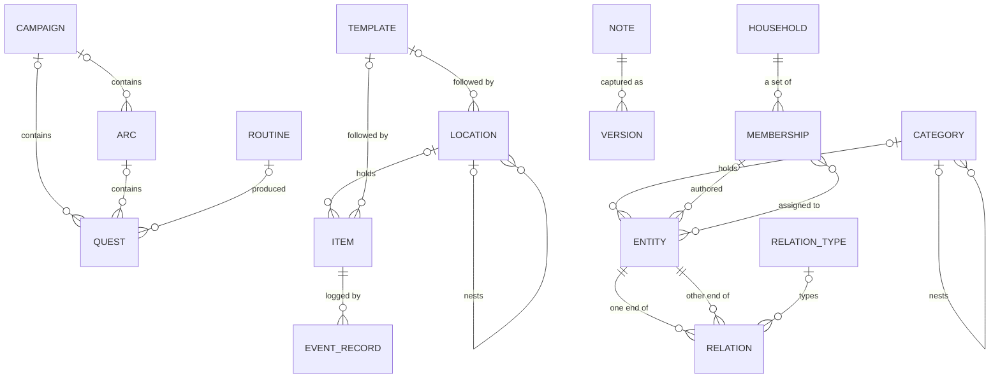

# Altair Data Model

**Status:** Assembled. The gaps this assembly found were settled by amendment on 2026-08-13 and no flags remain.
**Date:** 2026-08-13
**Governed by:** Altair Substrate Specification, Altair Guidance PRD, Altair Knowledge PRD, Altair Tracking PRD, Altair Relation Types Specification
**Related:** Altair Vision & Scope, Altair Architecture Foundations

---

## What this document is

Every persistent thing the system carries, in one place: the entity type inventory, what each type holds beyond the shared set, cardinality, lifecycle states, and the persistent things that are not entities. The substrate specification and the domain PRDs remain the authority. This document states the structure that satisfies them and decides nothing, so where the two disagree, this document is wrong.

It covers the full model, with no release annotations. What any release instantiates is the business of its scope document.

Each type section follows one shape: what the type is, what it holds beyond the universal set, its containment and cardinality, its states where the domain defines any, and which relation types reach it.

---

## The shared model

Every entity carries the following, whatever its type. Each line is an inventory entry; the substrate holds the requirements behind it.

- **Identity.** Globally unique, stable from the moment anything refers to it. Relations refer to entities by identity.
- **Type.** Fixed at creation. An entity never changes type.
- **Title.** Optional on every type. What a type calls it may differ.
- **Author.** A reference to one household member, set at creation and never changed. Absent on an entity created before its device is bound to a household, and acquired at binding.
- **Creation time and update time.** Creation is set once by the creating client; update advances on any change to entity content. Neither settles the order of anything, since no clock is authoritative.
- **Dates.** Any number, each optional. Each is labelled by the person with a label the system does not interpret, and each carries the person's mark for whether it comes forward ahead of time. A label may come from a template; the date is ordinary in every respect.
- **Arrangement.** A position within each container the entity sits in, defaulting to the order it entered. It belongs to the container, not to the entity, so an entity in two containers holds an unrelated position in each, leaving a container forgets the position, and entering one places the entity at the end.
- **Category.** At most one, required by none. Containment, not a relation.
- **Assignment.** Any number of household member references, and most entities have none.
- **Audience.** Who in the household can see this. Private to the author by default, with defaults configurable per entity type. Never inherited through relations, categories, or assignment.
- **Lifecycle state.** Active, deleted, or erased. Deleted is a holding state: out of lists, search, and traversal, relations retained and hidden, restorable in one action, and a deletion of several entities in one act is remembered as one. Erasure is announced before anything becomes unrecoverable.
- **Capture method.** How the entity came to exist, recorded permanently, from an open set of methods.
- **Bulk state.** Whether the entity is still filterable as bulk-captured. Mutable; the initial value derives from the capture method and diverges from it afterwards.

---

## Entity types

### Guidance

No Guidance type carries a body. Guidance holds the shape of the work and Knowledge holds its content, reached by relation.

**Campaign**

The top of the ladder, and nothing contains it. Beyond the shared set it holds one Guidance state.

- **Contains** any number of arcs and quests, mixed, including none. Attachment need not be adjacent, so a quest may sit directly beneath it. An empty campaign is valid indefinitely.
- **State** is Waiting, Working, or Worked: the person's own, never a summary of its children. It moves from Waiting to Working silently when a quest anywhere beneath it starts, and never moves out of the terminal state that way.
- **Reaching the terminal state asks about everything directly beneath**, and deletion asks the same question. Declined children survive as standalone arcs and quests.

**Arc**

The middle of the ladder. Beyond the shared set it holds one Guidance state.

- **Belongs to** at most one campaign, and none is required.
- **Contains** any number of quests, including none.
- **State, terminal, and deletion behave as they do on a campaign.**

**Quest**

The unit of action. The ladder does not deepen, so a quest contains nothing. Beyond the shared set it holds one Guidance state and at most one reference to the recurrence that produced it.

- **Belongs to** at most one ladder parent, an arc or a campaign, and none is required.
- **The recurrence reference is held independently of the ladder parent.** A quest that loses its recurrence is an ordinary quest.
- **State** is the same three. Worked is distinguished as terminal, meaning no longer being worked on rather than achieved. Starting a quest moves every Waiting container above it to Working, climbing the whole chain and never reopening a terminal parent.
- **Relation behaviour lands here.** Completing a quest still blocked warns and does not prevent. A live Uses commits stock, and reaching the terminal state resolves it, with the prompt conditional on anything being committed.
- **Ordering between unrelated quests a person wants in a chosen sequence has no mechanism**, and that is an open question inherited below, not settled here. Arrangement orders what sits in front of the person; it does not express one quest coming before another.

**Routine**

A pattern that produces quests on a schedule. The name is unsettled per the Guidance PRD's first open question; that document's prose uses recurrence. Beyond the shared set it holds its schedule, anchored to the calendar or to the last completion, and the description of the quest it creates: title, ladder parent, category, assignment, audience, and relations meant for occurrences, stamped once at spawn and never reaching an occurrence that already exists. Whether a quantified relation belongs in that description is a Guidance open question.

- **Produces** any number of quests over its life. Occurrences appear roughly a week ahead, each is an ordinary quest holding its reference back to the routine, and a past occurrence produces nothing: nothing carries forward and nothing stands in for what went by.
- **It carries no Guidance state**, because state belongs to the ladder and a routine is not part of it. It has the universal lifecycle only.
- **Deleting one asks about its occurrences** on the same terms deleting a ladder parent does.

**Focus session**

An event record of a bounded window of work. Deferred as a domain by the Guidance PRD, with its shape already settled by the substrate: content is immutable, corrections are appended, and it is an entity in every other respect, so one can be related to the quest worked on during it. What it holds beyond the shared set is the deferred part.

**Check-in**

A short observational record at the end of a day. The same settled shape as a focus session, immutable content and appended corrections, and the same deferral: what it holds beyond the shared set awaits the domain design.

### Knowledge

**Note**

Text a person wrote. Beyond the shared set it holds a body, and nothing about a note is required: a body with no title and a title with no body are both valid and ordinary, the second being what the reference gesture produces.

- **The body is markdown**, per DR-001, and stays plain text: no marker for any relation lives inside it.
- **The body divides into blocks structurally, derived from the text alone**, so every device computes the same division. Blocks are the unit of reconciliation, the container anchors locate within, and something presentation may address. A block keeps its identity as the text around it changes, and as its own text changes; blocks persist, and are inventoried below.
- **Anchors are not part of the note.** A relation formed at a point in the body records where on the relation itself, finer than a block and located within one. Editing anchored text never removes the relation; it survives and loses its anchor.
- **Backlinks are derived**, never stored as a second thing to maintain: what points at a note is visible from it because the relations exist, not because anyone recorded them twice.
- **Versions apply.** A version holds the body and only what tells one version from another in a list. Restore replaces the body and nothing else: containment, relations, and audience are untouched. Version boundaries arise from the person's own editing, at a coarseness that is a tuned threshold rather than a stated number.
- **Granularity is the person's choice.** Nothing prefers short notes, suggests splitting, or treats a long note as undecomposed. The accepted cost sits in the block rule: a long unbroken stretch of prose is one block.

**File**

An entity whose body is a file rather than text. There is no separate attachment concept, and a file and a note about it are two entities.

- **The stored file is canonical and the body is immutable**: never edited, so never versioned. Mutable around it are title, relations, audience, and edited derived text.
- **Extracted text is derived data**, stored separately, optional, and discardable without loss. A person's correction to it survives re-derivation.
- **Replacement and supersession both produce a new file entity**, because there is nothing to swap. A replacement, a better copy of the same thing, is offered the old entity's relations. A supersession, a new edition of a different work, is offered nothing: relations stay where they were true, and the two editions are related to each other, currently untyped or References, with a supersession type an open question in the relation types specification. Discarding the old file is a separate ordinary deletion and is never implied.
- **Display follows media type**, and the entity stores no display preference, because that would be a decision at capture time.

### Tracking

**Item**

A tracked thing, at whatever granularity the person chose. Beyond the shared set it holds an asserted amount with its unit and last-asserted timestamp, template-named property values, and at most one location and one followed template. What the Tracking PRD calls an item's name is the universal title under that domain's word for it, not a property of its own.

- **The asserted amount is what the person last said is there**, changed by nothing except an explicit act: logging consumption, logging a purchase, or setting it to what the cupboard holds. It is not computed from history.
- **Availability is derived**: the asserted amount minus what live quantified relations commit. A relation never changes the asserted amount, availability may go negative, and every commitment is attributable to its quest.
- **No field is required**, on the deliberate path as much as the capture path. An item with a name and nothing else is complete.
- **Nothing declares a kind of item.** Reserved against consumed is a fact about each relation and its resolution, never about the thing.
- **Creating an item from an existing one copies description and never state**: name, unit, location, category, and property values copy; amount, timestamp, logs, and relations do not, and no link back is kept.
- **Values live on the item.** A followed template contributes property names, never content, and detaching keeps every value with the names it had at that moment.

**Location**

A place a thing can be, physical or not, and an entity because of what it needs to carry: credentials, dates, notes, relations, and a presence in retrieval of its own.

- **Nests** under at most one parent location, and nesting is never required.
- **Holds** any number of items, each of which has at most one location, and an item with none is complete. Nothing insists the location be right.
- **Follows** at most one template, from the same shared set items draw on.

**Shopping list**

An entity the person composes, not a view over what is low. Beyond the shared set it holds its entries.

- **An entry may point at a tracked item, and may not.** An entry that points at nothing is text, and a complete entry rather than a degraded one.
- **Filling in bulk on request is expected**: everything currently low, everything low in one location, and similar sets, producing ordinary entries the person owns that do not change afterwards when the stock behind them moves.
- **Nothing adds to a list unasked.**

- **Each entry is a block in the list's body**, with its own identity, and an entry's text is title-shaped plain text. An entry pointing at an item does so by a relation from the list, anchored at the entry's block.

### Cross-domain

**Category**

An entity in its own right, not a label: describable, relatable, and returned by retrieval. The one organising structure besides relations, existing for browsing rather than retrieval.

- **Nests** under at most one parent category, never required, and a flat set is not degraded.
- **Holds** any number of entities of any type across all three domains, each entity in at most one category, and uncategorised is complete. Containment, not a relation.
- **Never sets an audience**, and may carry a creation default that acts once.
- **Deleting one leaves its entities uncategorised**, which is a valid state requiring no repair.

---

## Relations

A relation is one record joining two entities by identity. Beyond its endpoints it holds:

- **An optional type**, from the declared set in the relation types specification. A relation without a type is untyped, not possibly typed, and untyped is the common case. Nothing infers a type from the endpoints, the words nearby, or what a similar relation was typed as before.
- **Direction, as a property of the single record.** An asymmetric type is one relation read from either end: Blocks and blocked by are the same record, never two.
- **Properties its type defines, and no others.** Uses carries a quantity, and its resolution: unresolved while the quest is live, then returned or consumed when the terminal prompt is answered. There is no facility for arbitrary fields on a relation.
- **An optional anchor** into one endpoint's body, recording where the relation was formed. It belongs to the relation, not the body, is available typed or untyped, and carries no behaviour of its own. Editing anchored text leaves the relation intact without its anchor. An anchor attaches at a phrase within a block or at the block itself; a phrase anchor is lost when its text is edited, a block anchor holds while its block remains.

---

## Persistent things that are not entities

**Household**

A set of members. Everything in Altair is scoped to one, and nothing spans two.

**Membership**

A member is not an entity. A membership belongs to one household; someone in two households holds two memberships with nothing connecting them.

- **Referenced, never contained**: by authorship, assignment, audience, and template property values of the member kind. References survive departure, and someone who returns returns to the same membership, authorship and history intact.
- **A departed member's private material stays where it is, readable by nobody**, with per-entity erasure the only removal. How a departed member is presented is deliberately undecided, and the model carries either answer without loss.
- **Administration is a flag on membership.** Any number of members may hold it, more than one is the ordinary arrangement, and it is always available to take: a deliberate act by a person, never a state the instance repairs.

**Relation type**

The declared thing a typed relation points at. It holds a renameable label and its declared behaviour, asymmetric reading and type-defined properties among them; renaming changes the label and nothing the system does. The set is provisional, and whether users may declare their own is an open question in the relation types specification.

**Template**

One shared set reaching items and locations, so that nothing has to be defined twice or remembered as living in one domain.

- **Contributes property names, never values.** Values live on the following entity, and nothing consults two records to know what is on a shelf.
- **A property may declare a kind**: text by default, with dates, numbers, household members, and yes-or-no where ambiguity is real. A kind is not a constraint, and a date property is an ordinary date whose label the template supplies.
- **A date property may seed from another date and an offset**, once: it never recomputes, never overwrites, never reaches an entity retrospectively, and never sets the bring-forward mark.
- **Following is live**: renaming a property reaches everything following. An entity follows at most one, detaching is always available and never destructive, and a new version of a thing is a new template.

**Version**

A point-in-time capture of a mutable entity's content, retained so a prior state can be viewed or restored. In Knowledge it holds the body and only what tells one version from another in a list; what one minimally holds outside Knowledge is an open question inherited below. Retention is bounded on an operator-set window, a household may decline version history entirely with content never at risk, and restore replaces the body and nothing else.

**Event record**

An immutable fact about something that happened: appended, never edited, corrected by appending. Consumption and purchase logs are event records attached to an item, per item and optional, with nothing incomplete for having no log. Deletion of an entity leaves its event records untouched.

**Block**

A part of a body, holding its own identity, its text, and its position in the sequence. A body is its blocks in order, and there is no second representation of the same content for them to disagree with.

- **Boundaries are computed from the text; identity is not.** The division rule is structural and deterministic so that any device computing it arrives at the same boundaries. Identity is assigned when a block first exists and carried forward from there, because a block that has had its own text rewritten is still the same block and nothing in the new text says so.
- **Carrying identity forward is a matching step**, performed where an edit is applied: recomputed boundaries are matched against the blocks already held, surviving blocks keep their identity, and only what changed is written.
- **A block outlives edits to its neighbours and to itself**, which is what a block anchor relies on. Where a block is removed, a relation anchored to it survives without its anchor.
- **Not an entity.** It has no audience, no lifecycle of its own, and no presence in retrieval apart from the body it belongs to. A shopping list entry is a block, which is why entries do not appear among the entity types.

**Conflict state**

Both retained sides of a same-part concurrent edit, held on the entity, non-blocking, resolved by a person. The part is the field, except in a body of text, where the part is the block.

**Derived data**

Extracted text, backlinks, and retrieval structures. Never canonical, discardable and rebuildable without loss, and a person's correction survives re-derivation.

**The outbound queue**

Client-held writes awaiting the instance. Durable across restart, ordered per entity, idempotent, non-blocking, and silent: no badge, count, or banner reflects its depth. Offline capture is create-only at the floor, so the queue's guarantee covers creates; edits and removals offered offline are a client decision above the floor, not a promise.

---

## Cardinality summary

Every structural edge in the model, with its multiplicity. Prose remains authority; this is the checkable view of it.

**What the notation cannot carry:**

- **ENTITY stands for any entity of the twelve types.** Note, File, Shopping list, Focus session, and Check-in have no structural edges of their own and appear only through it.
- **A quest's two containment edges share one slot**: at most one ladder parent in total, an arc or a campaign, never both.
- **A relation's two ends are one record.** Direction is a property of it, and Uses carries its quantity and resolution on the relation, which the notation cannot draw.
- **User-formed relations join any type to any type**, so no per-type relation edges are drawn, and the type set is open.
- **Anchors and entries do not appear.** An anchor is a property of a relation locating into a body, and a shopping list entry is a block, not an entity.
- **Versions are drawn where a domain currently calls for them**, on notes. What a version holds outside Knowledge is an open question, and a file body is immutable and unversioned.
- **Everything is scoped to one household**; only the membership edge is drawn rather than an edge from every box.
- **Only edges that exist as references are drawn.** A routine holds an edge to what it produced; an item created from another keeps no link, so none appears.
- **Conflict state, derived data, and the outbound queue are omitted**, carrying no cardinality worth drawing.

---

## Open questions the model inherits

Stated so that assembling the model does not silently close them. Each lives where cited, not here.

- **Ordering between unrelated quests** a person wants in a chosen sequence has no mechanism. Recorded in the scratchpad as an open gap.
- **What a version minimally holds outside Knowledge.** Substrate.
- **Whether a supersession relation type is needed.** Relation types specification.
- **Whether users may declare relation types.** Relation types specification.
- **How a departed member is presented.** Substrate, deliberately undecided, and the model carries either answer.
- **What the recurrence concept and the schedule surface are called, and the state-name inflections.** Guidance PRD.

The gaps and ambiguities this assembly itself found are flagged in italics inside the sections that hit them, with their decisions and pending amendments recorded in the scratchpad.
