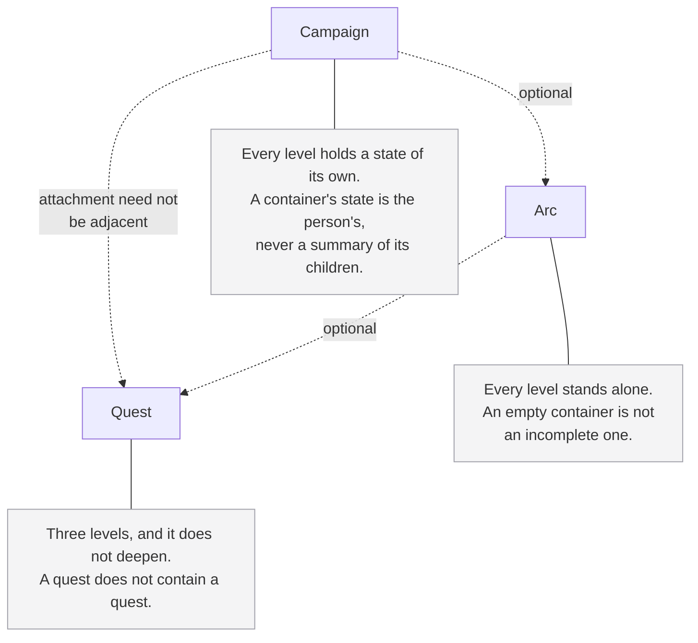
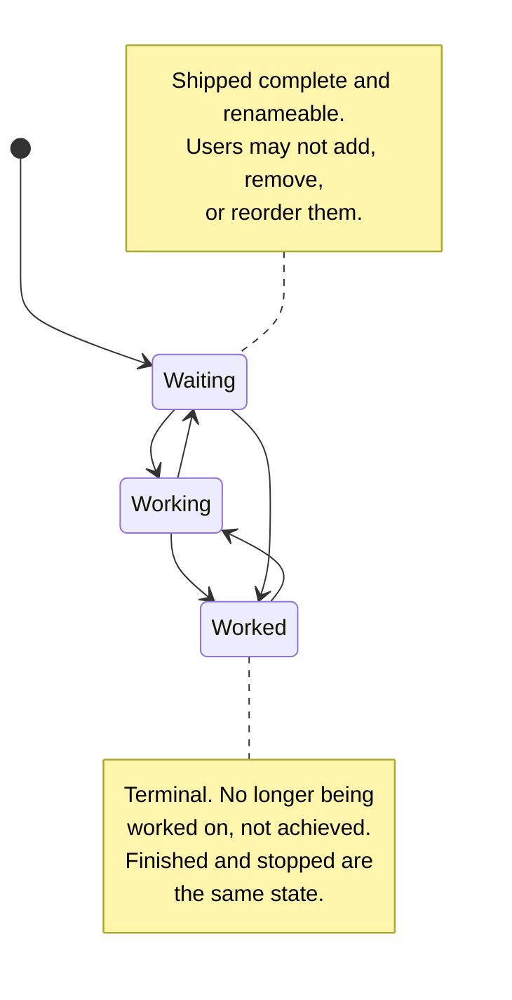

# Altair Guidance PRD

**Status:** Draft
**Date:** 2026-08-05
**Related:** Altair Vision & Scope, Altair Substrate Specification, Altair Relation Types Specification, Altair Knowledge PRD, DR-001
**Date amended:** 2026-08-06

---

## What this document is

**The diagrams carry the same weight as the prose.** Each states the same thing as the text around it rather than illustrating a part of it, so either route through this document is complete on its own. A dotted line marks something optional.

Behavioural requirements for the Guidance domain. It inherits everything in the substrate specification and does not restate it. Where the vision document already settles something, this document points at it rather than re-deciding it.

It is thin on purpose. Guidance has fewer genuinely open behavioural questions than it first appears, because the vision document fixes the vocabulary, the affect, and most of the exclusions.

**What it does not cover:** presentation, which the vision document parks by policy, and mechanism.

---

## What Guidance is for

Two things, and the second is the one most easily lost.

**Initiation.** Guidance answers *what can I start, right now*. The hierarchy exists for decomposition into something small enough to begin, not for tracking.

**Orientation.** Guidance is also a legible record of what the person has done, is doing, and meant to do, held outside their head so that it survives an absence. Someone returning after three weeks should be able to see where they left off rather than reconstruct it. This is the literal reading of *no barriers to re-entry*: the state of the work is readable on arrival, by someone who remembers none of it.

Both readings share a premise. The plan is scaffolding for the person's own working memory, and nobody audits it. That is why most project management behaviour is absent rather than merely unbuilt: a reporting instrument needs estimates, velocity, and escalation because somebody else is reading it. Nobody else is reading this.

**Seeing what has already been dealt with is part of orientation**, and it is worth stating because it sits close to something excluded. A record of what is no longer live is the person's own material shown back to them. What is excluded is measurement of the person: a rate, a proportion, a target, a comparison against a previous period. The line is the same one retrieval draws. Showing is permitted, scoring is not.

It also cuts both ways, and the design should assume it. The same record that reads as evidence of progress on one day reads as evidence of how little got done on another. That is a reason to render it as plain history rather than as achievement, and never as a quantity.

---

## The ladder

**Campaign, then Arc, then Quest.** Three levels, and the ladder does not deepen. A quest does not contain a quest.

**An entity has at most one parent, and that parent is strictly higher in the ladder.** Attachment does not have to be adjacent. A quest may sit directly under a campaign with no arc between.

Refusing that would leave two options and both are worse. An arc invented because the model demanded one is an empty container created for the system's convenience, and a quest left unparented to avoid inventing it loses a connection the person wanted. The ladder decomposes work so that it can be started, so a required middle rung is bookkeeping added at the moment the product says is hardest. It is also what a person is entitled to expect: someone told that no parent is required does not then expect to be told which parent.

**Nothing in the ladder requires anything else.**

- A campaign with no arcs is valid, and stays valid indefinitely.
- An arc with no quests is valid. It is frequently the start of planning, or a placeholder for a chunk of work not yet broken down.
- A quest with no parent is valid.
- An arc need not sit under a campaign.
- A quest under a campaign need not have an arc.

An empty container is not an incomplete one. Nothing prompts to fill it, nothing marks it as unfinished, and nothing counts what is missing.

**A campaign's children are of mixed kinds**, since arcs and quests can both sit directly beneath one. Any surface listing what is under a campaign shows both together, in the arrangement the person gave them, which needs nothing of its own because a campaign is one container holding one order over everything beneath it, whatever kind each child is.

**Moving a parent to the terminal state asks about its children.** Marking a campaign or arc as worked is a reasonable moment to ask whether the things under it are finished with too, and the person answers. It does not cascade silently, because that would change state the person did not touch, and it does not refuse, because the person is usually right.

**Deleting a parent asks about its children too.** The same reasoning applies and the same answer follows: deletion is deliberate, the person arrived intending it, and a question at that moment is affordable in a way it would not be on the path into starting work.

Both questions reach everything directly beneath, which for a campaign means its arcs and any quests attached to it without one.

If the person declines, the children survive as standalone quests and arcs. Nothing about them is broken by losing a parent, because nothing required them to have one in the first place, and they remain reachable rather than stranded inside something that is gone.

If the person accepts, restoring the parent brings back what was removed with it. Deletion is recoverable, and recovering a campaign into an empty shell would be the recoverability the substrate promises in name only. The substrate spec carries the general form of this: recovery is of entities, and a deletion of several is remembered as one.

---

## States

**A small fixed set, shipped complete, and renameable.**

The shipped set is Waiting, Working, and Worked. Users may rename them. They may not add, remove, or reorder them, and they may not define their own set.

These labels describe the work rather than the person, which is why they were chosen over the kanban register they replace. *Worked* matters most: it is past tense without implying achievement, so it fits a quest that was finished and a quest that stopped just as well, and the person is never asked to file their own history under a word that judges it.

The reasoning is the tradeoff the vision document already accepts: flexibility becomes configuration burden, which becomes avoidance. Renaming satisfies most of what people want from custom states without producing a configuration surface, and a person who wants three states and a person who wants to call them something else are the same person with different labels.

**The same three states apply at every level of the ladder.** A campaign, an arc, and a quest all sit in Waiting, Working, or Worked. There is no reduced set for containers and no level that has no state at all.

**A container's state is the person's, not a summary of its children.** A campaign is not Working merely because something under it is Working. It is Working because the person considers it live. Continuous derivation is ruled out: an empty campaign is valid and has nothing to derive from, a person can stop a campaign while quests beneath it sit untouched, and a state that recomputes itself moves without the person, which the ladder refuses to do elsewhere.

**One upward movement exists, and it is the only one.** Starting a quest moves the containers above it from Waiting to Working. Requiring the person to say so twice is bookkeeping they came here to avoid, and the campaign is live once work under it has begun.

It happens silently. Finishing is deliberate, so the prompts on a parent reaching the terminal state are affordable. Starting is the moment initiation is hardest, and a question there is exactly the wrong thing. The person's own action is the proximate cause, which is what the rule against things changing unbidden asks for.

The movement is narrow and every part of the narrowing carries weight:

- **Waiting to Working only**, and never in reverse.
- **Upward only.** Nothing a container does moves a child.
- **It never touches a parent already in the terminal state**, because a stray child would silently reopen something the person deliberately closed.
- **It climbs the whole chain**, skipping any container already Working. A quest attached directly to a campaign moves that campaign, since attachment need not be adjacent.
- **A recurrence is not a container for this.** State belongs to the ladder, so starting an occurrence moves whatever ladder parent it has and nothing else.

The accepted cost is that a container's state can still drift out of step with the work beneath it, because this closes one direction only and nothing corrects it continuously.

**One state is distinguished as terminal.** Recurrence and the schedule surface both need to know which state means the quest is no longer live. Renaming does not change which one that is.

**Terminal means no longer being worked on, not achieved.** A quest abandoned partway because life intervened sits in the same state as one carried through to the end. The system does not distinguish the two and does not ask which it was. Stopping is a legitimate way for a quest to end, and a separate abandoned state would exist only to record that something did not work out, which is a judgement about the person wearing different clothes.

**State is not a measure of the person.** Nothing derives a completion rate, a throughput figure, or a proportion of quests in any state. There is no target and no percentage.

**Reaching the terminal state does not remove a quest.** It remains readable, reachable, and related to whatever it was related to. Nothing archives it out of sight on a schedule, because the record of what happened is half of what Guidance is for.

**Moving a quest is optional and often late.** Someone who finishes work and updates the state two weeks later has used the system correctly. Nothing about the state's age is remarked upon.

---

## Dates

**A date on a quest exists for awareness.** "I want this done before we leave on the tenth" is the case it serves. The date tells the person something is coming, which is what they asked it to do.

The mechanism is a substrate concern: any number of dates, each labelled by the person, each carrying whether the person wants it brought forward ahead of time. Two things belong to this domain.

- **A date is not a commitment to anyone.** The vision document excludes due dates as coordination contracts between people, and this is the distinction: a date the person set for their own awareness is not a contract, because nobody else is party to it.
- **Nothing counts overdue items.** Prohibited outright as a counter that rises during absence.

---

## Recurrence

*The name for this concept is unsettled. "Routine" is used in the vision document and carries habit-tracker connotations that sit close to the excluded reward mechanics. See open questions.*

A recurrence is a pattern that produces quests on a schedule. Mowing the lawn, putting the bins out, changing a filter.

**A schedule expresses either of two anchors.** Calendar-anchored, every Tuesday and the first of the month, for work the world times: the bins go out when collection comes whatever else happened. Completion-anchored, an interval from when the last occurrence reached the terminal state, for work that recurs from when it was last done: mowing and descaling do not care what the calendar says. Both are first-class, and a recurrence uses one.

**A completion-anchored recurrence waits.** While its occurrence is live it produces nothing, and the next interval runs from the state change that ended the last one. Marking a quest late moves the next occurrence late, which is the anchor doing its job rather than an error, and a recurrence whose occurrence is never marked simply holds: one live occurrence, nothing accumulating, recovered the moment the person touches it. Nothing remarks on the waiting.

**A recurrence holds what a person could set on a quest by hand**, and an occurrence is created as that quest: title, ladder parent, category, assignment, audience, and relations meant for its occurrences. Creating a recurrence is describing the quest it will keep creating. Stamping happens once at spawn, the occurrence is thereafter ordinary and independently editable, and editing the recurrence reaches future occurrences only, never ones that already exist. This is deliberately not the live following Tracking's templates use: live following here would rewrite the past, and an occurrence's week belongs to it.

**A recurrence is for planning, not for checking off.** It says when something comes round. It does not hand the person a thing they owe, and an occurrence nobody touched is not a debt.

**Occurrences appear ahead of time, but not far ahead.** Roughly a week of runway. Enough that someone who needs to see work coming can see it, and not so much that a fortnight away produces a wall.

**An occurrence is an ordinary quest.** It has its own identity, so it can be related to, carry a note about that particular week, and be found by retrieval. A note about putting the broken furniture out belongs to the week it was written and to no other.

**A past occurrence is past.** Nothing carries forward, nothing is rescheduled, and no occurrence is produced to stand in for one that went by. Returning after a month finds the recurrence, and what is coming, and nothing waiting to be cleared.

**The person configured this, which is the consent.** A recurrence producing its next occurrence is the thing the person set up doing what they asked, not the system reorganising a view underneath them.

**No streaks, and nothing that degrades through absence.** A recurrence missed for a month is a recurrence, exactly as it would be otherwise.

**A quest holds the recurrence that produced it**, in the same way it holds a ladder parent, and independently of one. A weekly check can also belong to a campaign. Deleting a recurrence asks about its occurrences on the same terms deleting a ladder parent does, and an occurrence that loses its recurrence is an ordinary quest, which is a valid thing to be.

---

## Assignment

A substrate concern rather than a Guidance one, and specified there: any number of household members, on any entity type, coordination rather than accountability, household only, never setting an audience, and asking before something private is assigned to somebody else.

One thing worth stating from this side. Nothing escalates when an assigned quest is not done, and no surface reports who completed what. Assignment is how two people avoid doing the same job twice, and it is the only place in this domain where another person is party to anything.

---

## Relations in Guidance

The type vocabulary is specified in the Altair Relation Types Specification, since types belong to no single domain: *Uses* joins a quest to an item, and *References* is used by all three. Guidance uses *Blocks* and *Uses*, and neither is defined here.

**The hierarchy is structure, not a relation type.** A quest belonging to an arc is the ladder, not a link the person formed.

Two behaviours from that document land in this one.

**Completing something still blocked warns, and does not prevent.** The system says the blocker is still open and the person decides, because the person knows things the system does not.

**A live *Uses* commits stock, and reaching a quest's terminal state resolves it.** Moving a quest to the terminal state asks what happened to anything it had committed: whether the drill came back or the board was soldered in. This is the moment the reversible and irreversible cases separate, and it is the only moment anything asks.

It stays a shallow question. Everything has a default, accepting it is one gesture, and per-item detail may be available but is never required. A prompt that asks for quantities item by item is no longer the cheap thing that justified it. The prompts at the terminal state are conditional, so a quest that committed nothing is asked nothing.

The prompt has a second function worth naming. Asking whether the drill came back is a reminder to put the drill back.

---

## Relations into Knowledge

Specified in the Knowledge PRD and summarised here. None of it needs a relation type that does not already exist.

**Reference material attached to a quest, an arc, or a campaign** is an ordinary relation, typed *References* or untyped.

**Work that begins as a note carries a relation back to it, and it is not asked about.** Someone turning a note into a quest is starting something, which is the moment initiation is hardest and the wrong place for a question. The relation is also the point of the gesture, so asking would be asking whether the person meant to do what they just did. Relations never affect audience, so forming one silently exposes nothing.

**A campaign does not accumulate a body of material of its own.** It can be related to notes directly, like anything else. Everything hanging off a campaign and off the arcs and quests beneath it is reachable by scoping retrieval to the campaign, which is an ordinary query. A second container holding campaign-level material would be that query with manual upkeep attached.

---

## Audience

Guidance inherits private by default from the vision document. Nothing in this domain ships shared.

Assignment is the one workflow that runs into this, and it is handled by asking rather than by broadening the audience silently or by hiding the option.

---

## The schedule surface

A surface answering what is coming up. The vision document has it as a Should, described as suggesting without deciding.

This section defines what may appear and what may never appear. It does not define what a given client shows, because that depends on screen size, density, and what the surface is for on that platform, and a phone deciding to show six things is not the same kind of decision as the system deciding which six matter.

**What is eligible to appear:**

- Any entity carrying a date the person marked for bringing forward, where that date falls in the window
- A current occurrence of a recurrence
- Nothing else

Eligibility is not limited to Guidance. A licence expiring, a warranty ending, and a quest due are the same shape of fact, and a date is a date whichever domain recorded it. This makes the schedule surface the one place the three domains routinely meet, which is a larger claim than the rest of this document makes and is made deliberately.

**Where a client shows less than everything eligible**, two things hold. It says that it is doing so, because a surface that silently truncates teaches the person it cannot be trusted as a picture of what is coming. And what it leaves out follows a stated, boring rule such as chronology, never a judgement about which of the person's own commitments matters more.

**What it does not do:**

- It does not rank by importance, urgency, or anything else that amounts to telling the person what to do first. Ordering by date is not ranking, in the sense the substrate spec defines.
- It is not a count of what is owed, and it does not show one.
- It is not the only route to anything on it. Everything on it is reachable by ordinary retrieval.
- It does not include recently touched work, related work, or anything else that requires a judgement about relevance. That is an addition to be argued for separately, and it is close to a prohibited line.

**An empty one is fine.** Nothing to show is a normal state and is not framed as a problem or an opportunity.

---

## Deferred

**Focus sessions and daily check-ins.** Both are Shoulds. Both are deferred, because there is not yet enough experience of using either to design them with the care everything else has had. Revisit after MVP, and specifically once sustained use makes it possible to say what a check-in would have been for.

The substrate already settles their shape: they are records, so content is immutable and corrections are appended, and they remain entities with identity, audience, and relations. A focus session can be related to the quest worked on during it.

**Energy- and context-aware filtering.** A Should, and untouched. It is the feature that would give a quest properties nothing else in the system has, and it needs its own pass.

---

## Inherited exclusions

Restated only so they are not rediscovered. All are permanent and all come from the vision document.

- No estimation, story points, or capacity planning
- No velocity, burndown, cycle time, or throughput
- No streaks, points, badges, levels, or leaderboards
- No productivity scoring of the person
- No completion metric implying a target
- No counter that rises during absence
- No nag escalation or shame-based notification
- No roles, org hierarchies, or permission matrices

---

## Open questions

1. **What the recurrence concept is called.** "Routine" is in the vision document's vocabulary table, so changing it is an amendment there, not just here.
2. **What the schedule surface is called.** "Today" implies a one-day window resetting at midnight, which has the wrong shape for the people this is built for.
3. **The exact inflections of the state names.** Waiting, Working, and Worked is the settled family. Whether those are the right three forms is not settled: *worked* and *working* are close enough on the page that someone returning cold may have to look twice, and the set is slightly awkward said aloud. The register is right, the wording may still move.
4. **Whether a quantified relation belongs to what a recurrence stamps onto its occurrences.** A stamped *Uses* commits stock the moment an occurrence spawns, roughly a week before the work, and whether that is wanted has not been examined.
