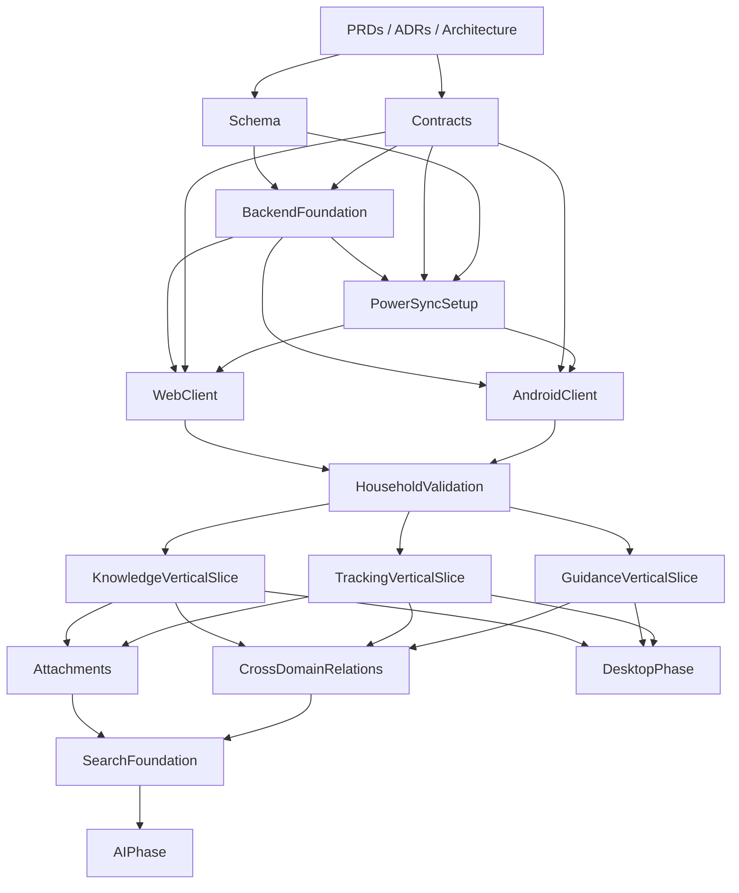

# Altair Comprehensive Implementation Plan

| Field | Value |
|---|---|
| **Document** | Altair Comprehensive Implementation Plan |
| **Version** | 1.0 |
| **Status** | Draft |
| **Last Updated** | 2026-03-11 |
| **Related Docs** | PRDs, Architecture Spec, ADR-002, ADR-003, ADR-004, Schema Design Spec, PowerSync Sync Spec, Shared Contracts Spec |

---

# 1. Purpose

This document defines a **comprehensive, dependency-ordered implementation plan** for Altair.

It is designed to answer:

- what should be built first
- what depends on what
- what can happen in parallel
- what should be deferred
- where the main technical risks live
- what “done enough” looks like at each stage

This plan assumes the currently selected architecture:

- **Web:** SvelteKit + Svelte 5
- **Desktop:** Tauri + shared Svelte UI
- **Mobile:** Android + Kotlin + Compose
- **Backend:** Rust + Axum
- **Primary DB:** Postgres
- **Client DB:** SQLite
- **Sync:** PowerSync
- **Relationships:** first-class domain records
- **Attachments:** object storage, metadata in Postgres

---

# 2. Planning Principles

## 2.1 Build the riskiest foundations early

The highest-risk parts are:

- shared contracts drift
- schema/scope design mistakes
- sync scope mismatch
- multi-user/shared-state behavior
- attachment + metadata coordination
- domain boundaries across Guidance / Knowledge / Tracking

These must be validated **before** polishing UI breadth.

## 2.2 Prefer vertical slices over horizontal perfection

A thin working slice across:

- contracts
- schema
- backend
- sync
- client
- UI

is worth more than a perfectly engineered subsystem that does nothing user-visible.

## 2.3 Separate “must be correct now” from “can evolve later”

Must be correct early:

- contracts
- schema direction
- sync scope shape
- auth model
- entity ownership boundaries

Can evolve later:

- advanced AI
- rich graph visualizations
- fancy automation
- plugin systems
- WearOS

## 2.4 Use explicit gates

Each major phase should end with a **go/no-go review**.

That prevents wandering into the next stage with hidden structural rot.

---

# 3. Dependency Overview



---

# 4. Phase Summary

| Phase | Name | Goal |
|---|---|---|
| 0 | Project Setup & Decision Lock | Freeze architecture direction and repo structure |
| 1 | Shared Contracts Foundation | Eliminate identifier drift |
| 2 | Database & Schema Foundation | Create canonical persistence layer |
| 3 | Backend Core Foundation | Stand up Axum app, auth, migrations, base APIs |
| 4 | PowerSync Foundation | Validate offline-first sync shape |
| 5 | Multi-User Shared-State Validation | Prove household/shared flows |
| 6 | Vertical Slice: Guidance | Deliver usable tasks/routines flow |
| 7 | Vertical Slice: Tracking | Deliver usable inventory flow |
| 8 | Vertical Slice: Knowledge | Deliver usable note/linking flow |
| 9 | Attachments & Media | Attach files/images safely |
| 10 | Cross-Domain Relationships | Make Altair feel like one system |
| 11 | Search Foundation | Cross-app retrieval and discovery |
| 12 | Desktop Shell | Add Tauri power-user surface |
| 13 | AI Integration | Add optional enrichment safely |
| 14 | Hardening & Beta Readiness | Stability, migrations, observability |
| 15 | Post-Beta Expansion | WearOS, automations, richer semantics |

---

# 5. Detailed Step-by-Step Plan

# Phase 0 — Project Setup & Decision Lock

## Objective

Create the repo and document structure so implementation does not immediately dissolve into competing local truths.

## Prerequisites

- PRDs completed
- architecture spec completed
- ADRs accepted
- schema direction selected
- sync direction selected

## Steps

### 0.1 Create monorepo structure

Create:

```text
altair/
  apps/
    server/
    web/
    desktop/
    android/
    worker/
  packages/
    contracts/
    design-system/
    docs/
  infra/
    compose/
    scripts/
    migrations/
  docs/
    prd/
    architecture/
    adr/
```

### 0.2 Decide package manager / workspace conventions

Examples:

- pnpm for TS workspace
- Gradle for Android
- Cargo for Rust
- one root task runner strategy

### 0.3 Define coding standards

Add:

- formatter configs
- linter configs
- editorconfig
- naming rules for shared contracts

### 0.4 Add CI skeleton

Set up:

- contract generation + validation
- Rust lint/test
- TypeScript lint/test
- Kotlin build/test
- migration validation later

## Deliverables

- monorepo skeleton
- basic CI
- docs locations
- coding standards

## Exit Gate

All engineers can clone repo, run baseline tooling, and understand where contracts/schema/backend/client code belong.

---

# Phase 1 — Shared Contracts Foundation

## Objective

Create the shared contracts layer before backend and clients start inventing incompatible identifiers.

## Depends On

- Phase 0

## Steps

### 1.1 Add canonical registry files

Create:

- `entity-types.json`
- `relation-types.json`
- `sync-streams.json`

### 1.2 Add generated bindings

Generate:

- TypeScript constants/types
- Kotlin enums/data classes
- Rust enums/structs

### 1.3 Add schema JSON for core DTOs

Initial schemas:

- `RelationRecord`
- `AttachmentRecord`
- `EntityRef`
- `SyncSubscriptionRequest` (starter)

### 1.4 Add codegen script

Use the generator to emit language bindings from registry JSON.

### 1.5 Add contract validation tests

Tests must fail if:

- registry shape is invalid
- duplicates appear
- generated files drift

### 1.6 Add GitHub Actions workflow

Enforce generation and validation on PRs.

## Deliverables

- canonical contracts package
- generated bindings in all target languages
- CI enforcement

## Exit Gate

No shared identifier can be added informally in app/backend code without repo friction.

---

# Phase 2 — Database & Schema Foundation

## Objective

Create the canonical database model and migration path.

## Depends On

- Phase 1

## Steps

### 2.1 Create migration system

Choose and wire migration tooling for Rust/Postgres stack.

### 2.2 Implement baseline schema

Implement the initial schema for:

- users
- households
- memberships
- initiatives
- tags
- attachments
- entity_relations
- Guidance tables
- Knowledge tables
- Tracking tables
- tag join tables
- attachment join tables

### 2.3 Add indexes and constraints

At minimum:

- ownership/scope indexes
- relation lookup indexes
- item barcode lookup index
- quest assignment/status indexes

### 2.4 Add seed data

Load the dev seed dataset for:

- one user
- second household member
- shared household
- shared chores
- inventory
- notes
- relations

### 2.5 Review schema against sync scopes

Review every table for:

- ownership columns
- household scope
- initiative scope
- whether table should auto-sync / on-demand / server-only

## Deliverables

- migration files
- working local Postgres schema
- seed dataset
- schema review notes

## Exit Gate

You can stand up Postgres locally, apply migrations, seed data, and manually query all major domains coherently.

---

# Phase 3 — Backend Core Foundation

## Objective

Stand up the Axum backend with auth, migrations, config, and first CRUD slices.

## Depends On

- Phase 2

## Steps

### 3.1 Create Axum application skeleton

Set up:

- config loading
- router structure
- DB pool
- health endpoints
- structured logging

### 3.2 Implement auth foundation

Build:

- local account model
- session/token issuance
- password hashing
- current-user resolution
- authorization helpers

### 3.3 Implement ownership and membership guards

Provide reusable checks for:

- user-owned records
- household membership
- initiative visibility
- attachment ownership

### 3.4 Implement core APIs

Start with:

- users/me
- households
- household memberships
- initiatives
- tags

### 3.5 Implement relation write/read model

Provide APIs to:

- create relation
- list relations by entity
- accept/dismiss suggested relations

### 3.6 Add integration tests

Cover:

- auth
- household access boundaries
- initiative visibility
- relation creation rules

## Deliverables

- running server
- auth foundation
- core CRUD endpoints
- authorization middleware/helpers

## Exit Gate

The server can authenticate a user, enforce household membership, and serve real data from the seeded database.

---

# Phase 4 — PowerSync Foundation

## Objective

Validate that the selected sync architecture works with real data and real scopes.

## Depends On

- Phase 1
- Phase 2
- Phase 3

## Steps

### 4.1 Stand up PowerSync locally

Add local/dev environment wiring.

### 4.2 Implement starter Sync Streams

Start with:

- `my_profile`
- `my_memberships`
- `my_personal_data`
- `my_household_data`
- `my_relations`
- `my_attachment_metadata`

### 4.3 Validate auth integration

Ensure:

- user identity is wired correctly
- unauthorized parameters do not leak data
- stream queries enforce access boundaries

### 4.4 Add one on-demand stream

Start with `initiative_detail`.

### 4.5 Create sync verification checklist

Verify:

- first sync
- reconnect
- offline local write
- upstream propagation
- second device reflection

### 4.6 Instrument sync behavior

Capture:

- sync timing
- stream sizes
- missing data cases
- query pain points

## Deliverables

- local PowerSync environment
- initial stream config
- sync smoke tests
- documented pain points

## Exit Gate

At least one Android or desktop-local SQLite client can sync baseline personal + household data successfully.

---

# Phase 5 — Multi-User Shared-State Validation

## Objective

Prove that shared household state works before broad feature development continues.

## Depends On

- Phase 4

## Steps

### 5.1 Build household test matrix

Test scenarios:

- two users in one household
- one user personal only
- one shared initiative
- one private initiative

### 5.2 Validate shared quest updates

Scenario:

- user A completes “take out the trash”
- user B sees updated status quickly
- audit trail remains coherent

### 5.3 Validate shared inventory updates

Scenario:

- user A consumes item
- quantity updates
- user B sees change
- shopping list thresholds remain sensible

### 5.4 Validate conflict cases

Scenario examples:

- both users decrement same item
- one user edits note title while another archives note
- one user removes item while another logs event

### 5.5 Decide conflict UX policy

Document where:

- last-writer-wins is fine
- event history is required
- explicit conflict surfacing is needed

## Deliverables

- multi-user validation report
- conflict policy notes
- schema/API adjustments if required

## Exit Gate

Shared household inventory and shared chores work well enough that the architecture still deserves to exist.

---

# Phase 6 — Vertical Slice: Guidance

## Objective

Deliver the first usable day-to-day workflow.

## Depends On

- Phase 5

## Steps

### 6.1 Backend Guidance APIs

Implement:

- epics CRUD
- quests CRUD
- routine CRUD
- daily check-ins
- focus sessions (basic)

### 6.2 Android Guidance screens

Build:

- Today view
- quest detail
- routine list
- complete quest flow

### 6.3 Web Guidance screens

Build:

- initiative planning view
- epic/quest management
- routine editor
- daily overview

### 6.4 Sync validations

Ensure:

- completing quest offline works
- quest status propagates
- routine updates propagate

### 6.5 Notifications (basic)

Implement:

- local notifications for due routines/tasks on Android
- server-side notification model stub if not fully delivered yet

## Deliverables

- usable Guidance flow on Android + Web
- offline quest completion
- shared chore viability

## Exit Gate

A user can manage real tasks/routines, and a household can complete shared chores reliably.

---

# Phase 7 — Vertical Slice: Tracking

## Objective

Deliver the first real inventory workflow.

## Depends On

- Phase 5

## Steps

### 7.1 Backend Tracking APIs

Implement:

- locations CRUD
- categories CRUD
- items CRUD
- item event logging
- shopping list CRUD

### 7.2 Android Tracking screens

Build:

- item list
- item detail
- quantity update
- shopping list
- simple barcode field entry first

### 7.3 Web Tracking screens

Build:

- inventory browser
- item editing
- location/category management
- shopping list management

### 7.4 Event-state consistency checks

Ensure:

- quantity changes create correct events
- manual adjustments don’t desync from current state
- history remains coherent

### 7.5 Shared household tests

Repeat:

- quantity decrement
- restock
- shopping list propagation

## Deliverables

- household inventory MVP
- item event history
- shopping list flow

## Exit Gate

A household can actually track shared items and trust updates enough to use it in normal life.

---

# Phase 8 — Vertical Slice: Knowledge

## Objective

Deliver the first useful note/linking workflow.

## Depends On

- Phase 5

## Steps

### 8.1 Backend Knowledge APIs

Implement:

- notes CRUD
- note snapshots
- note hierarchy
- tags for notes

### 8.2 Android Knowledge screens

Build:

- quick capture
- note list
- note detail/edit
- offline save

### 8.3 Web Knowledge screens

Build:

- note browser
- richer editing view
- hierarchy navigation
- tag filtering

### 8.4 Snapshot policy

Define:

- manual snapshot
- conflict snapshot
- autosave cadence if used

### 8.5 Sync + content tests

Validate:

- note created offline
- note edits sync cleanly
- snapshots behave reasonably
- household-shared notes stay scoped correctly

## Deliverables

- usable note system on Android + Web
- snapshots/history baseline
- shared vs personal note behavior

## Exit Gate

Users can capture and edit notes across devices without the note system feeling haunted.

---

# Phase 9 — Attachments & Media

## Objective

Add image/file support without destabilizing sync.

## Depends On

- Phase 6
- Phase 7
- Phase 8

## Steps

### 9.1 Object storage setup

Implement:

- local dev object storage
- upload/download path
- signed access or gated backend fetch

### 9.2 Attachment metadata APIs

Implement:

- create metadata
- upload initiation
- processing status updates
- attachment listing by entity

### 9.3 Entity link tables in API

Support note/item/quest attachment linking.

### 9.4 Android capture/import

Support:

- image capture
- file attach
- upload retry state

### 9.5 Web upload flow

Support:

- drag/drop or file picker
- progress
- failed upload retry

### 9.6 Processing pipeline stub

Implement minimal:

- image metadata extraction
- thumbnail job placeholder
- OCR hook placeholder

## Deliverables

- attachment metadata + upload flow
- Android capture
- Web upload
- no sync abuse of binary blobs

## Exit Gate

Users can attach media to notes/items/quests and the system keeps metadata and binaries coherent.

---

# Phase 10 — Cross-Domain Relationships

## Objective

Make Altair behave like a connected system rather than three apps awkwardly sharing a database.

## Depends On

- Phase 6
- Phase 7
- Phase 8

## Steps

### 10.1 Relation APIs

Finish:

- create manual link
- fetch related entities
- accept/reject suggested links
- filter by status/source/type

### 10.2 Relation UI primitives

Add:

- “linked items”
- “related notes”
- “quest requires item”
- “note supports initiative”

### 10.3 Cross-domain use cases

Implement at least:

- note references item
- quest requires item
- note supports initiative
- item related to maintenance note

### 10.4 Relation sync review

Ensure relevant relation rows replicate with each scope.

### 10.5 Explanation UX

For suggested/AI relations show:

- confidence
- source
- evidence snippet if available

## Deliverables

- functional relationship graph primitives
- cross-domain linked navigation
- explainable relation records

## Exit Gate

Altair starts to feel like a unified knowledge/planning/tracking system.

---

# Phase 11 — Search Foundation

## Objective

Deliver cross-domain retrieval before adding fancy AI frosting.

## Depends On

- Phase 10
- Phase 9

## Steps

### 11.1 Search indexing strategy

Implement baseline index source from:

- notes
- quests
- items
- tags
- relation metadata

### 11.2 Search API

Support:

- keyword search
- filter by entity type
- household/personal scope filtering
- initiative filtering

### 11.3 Web search UI

Build:

- global search panel
- grouped results
- quick navigation

### 11.4 Android search UI

Build:

- quick search
- entity-type filters
- recent queries

### 11.5 Measure search usefulness

Track:

- search latency
- result quality
- missing denormalized fields

## Deliverables

- cross-app keyword search
- scoped result filtering
- baseline retrieval utility

## Exit Gate

Users can find notes, items, and quests across the system without manually spelunking.

---

# Phase 12 — Desktop Shell

## Objective

Add desktop power-user workflows only after core mobile/web behavior is real.

## Depends On

- Phase 6
- Phase 7
- Phase 8
- ideally Phase 10

## Steps

### 12.1 Tauri shell setup

Create:

- desktop app wrapper
- shared auth/session handling
- local storage hooks if needed

### 12.2 Reuse web UI where appropriate

Start with:

- planning
- search
- note editing
- item browser

### 12.3 Add desktop-only enhancements

Candidates:

- multi-window support
- better keyboard shortcuts
- file import/export
- richer graph views

### 12.4 Desktop-specific validation

Check:

- local cache behavior
- window state
- OS integration
- attachment flows

## Deliverables

- desktop shell MVP
- power-user workflows
- no desktop-only architectural surprises

## Exit Gate

Desktop adds value rather than creating another fragile client burden.

---

# Phase 13 — AI Integration

## Objective

Add optional AI where it improves the product, not where it can show off.

## Depends On

- Phase 10
- Phase 11
- ideally Phase 9

## Steps

### 13.1 Build AI service abstraction

Support:

- provider interface
- job queue
- retries
- result persistence

### 13.2 Implement first safe use cases

Start with:

- note summarization
- relation suggestions
- OCR/transcription ingestion
- semantic link candidates

### 13.3 Persist suggestions as first-class records

Suggested links should become:

- `entity_relations`
- with `source_type = ai`
- with confidence/evidence

### 13.4 Add user review flow

Users must be able to:

- accept
- dismiss
- reject
- inspect evidence

### 13.5 Add failure-safe behavior

If AI fails:

- core app still works
- edits are preserved
- retry is possible
- no fake confidence theater

## Deliverables

- optional AI enhancement layer
- persisted suggested links
- reviewable AI outputs

## Exit Gate

AI improves discovery/workflows without becoming a required crutch or a nonsense fountain.

---

# Phase 14 — Hardening & Beta Readiness

## Objective

Make the system durable enough for real daily usage.

## Depends On

- All prior MVP phases

## Steps

### 14.1 Observability

Add:

- request logging
- sync metrics
- job metrics
- attachment error tracking

### 14.2 Migration testing

Test:

- schema upgrades
- stale client scenarios
- PowerSync compatibility impacts

### 14.3 Backup/restore path

Define:

- Postgres backup
- object storage backup
- local restore instructions

### 14.4 Reliability testing

Run:

- offline/online flapping
- duplicate writes
- delayed sync
- concurrent household updates

### 14.5 UX hardening

Fix:

- sync state visibility
- stale data confusion
- retry behavior
- destructive action safety

## Deliverables

- beta checklist
- observability baseline
- migration confidence
- reliability test results

## Exit Gate

You can trust the system enough to use it for real household/personal workflows without fear of silent corruption.

---

# Phase 15 — Post-Beta Expansion

## Objective

Add higher-order capabilities after the core system proves itself.

## Candidates

- WearOS
- richer automations
- semantic search / embeddings
- local desktop AI
- graph visualization
- OCR pipelines
- receipt ingestion
- maintenance forecasting
- collaborative household rituals / workflows
- iOS contributor path

These should all wait until the core product proves that users actually want more complexity rather than merely tolerating it.

---

# 6. Recommended Parallelization

## Can be parallel after Phase 1

- backend skeleton
- migration tooling
- client shell setup

## Can be parallel after Phase 4

- Android Guidance slice
- Web Guidance slice
- Tracking backend APIs
- Knowledge backend APIs

## Should stay mostly serialized

- contracts → schema → sync validation
- multi-user household validation before broad feature sprawl
- attachment pipeline before AI media workflows

---

# 7. Minimum Viable Milestones

## Milestone A — Foundations Working

Includes:

- contracts
- schema
- backend auth/core APIs
- baseline PowerSync

## Milestone B — Shared Household Proven

Includes:

- multi-user household validation
- shared chores
- shared inventory updates

## Milestone C — Product Useful

Includes:

- Guidance MVP
- Tracking MVP
- Knowledge MVP

## Milestone D — Product Connected

Includes:

- cross-domain relations
- attachments
- search baseline

## Milestone E — Product Durable

Includes:

- hardening
- observability
- migration confidence
- beta readiness

---

# 8. Explicit Dependency Checklist

## Must happen before Android/Web feature work

- contracts
- base schema
- auth
- initial sync streams

## Must happen before shared household features are trusted

- household membership model
- authorization checks
- shared-state sync validation
- item event logging baseline

## Must happen before AI

- relations model
- search foundation
- attachment metadata flow
- persisted suggestion lifecycle

## Must happen before desktop matters

- web/mobile core flows are already useful

---

# 9. Suggested Immediate Next Actions

## In order

1. **Create the monorepo skeleton** with the agreed package/app layout.
2. **Install the shared contracts package** and wire CI enforcement.
3. **Implement the initial Postgres migration set** and seed data.
4. **Stand up the Axum server** with auth + core household/initiative APIs.
5. **Bring up PowerSync locally** and validate baseline auto-subscribed streams.
6. **Build one Android and one Web slice** for shared household quest completion.
7. **Validate multi-user household behavior** before broadening feature development.

That is the shortest path to learning whether the architecture is actually honest.

---

# 10. Final Recommendation

The implementation order should be driven by this rule:

> **Prove contracts, schema, auth, and sync before building broad feature surfaces.**

Then:

> **Prove shared household behavior before assuming the product model works.**

Then:

> **Build Guidance, Tracking, and Knowledge as vertical slices before adding fancy AI, desktop extras, or graph wizardry.**

That ordering gives you the best chance of discovering real architectural problems while they are still cheap to fix, instead of after the app has already accumulated a decorative layer of lies.
