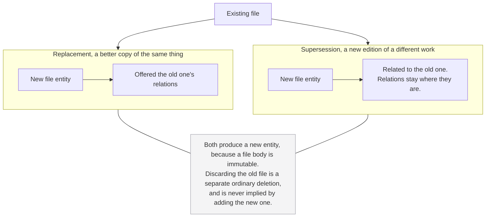
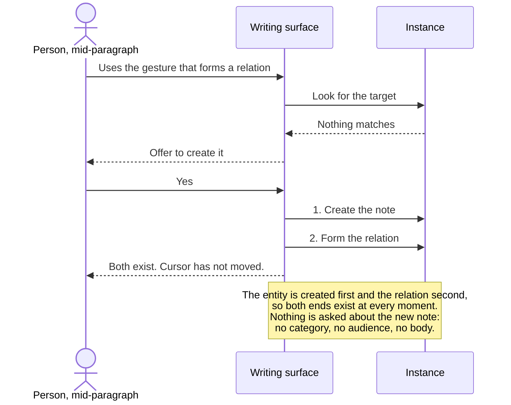

# Altair Knowledge PRD

**Status:** Draft
**Date:** 2026-08-06
**Related:** Altair Vision & Scope, Altair Substrate Specification, Altair Relation Types Specification, Altair Guidance PRD, Altair Tracking PRD, DR-001

---

## What this document is

**The diagrams carry the same weight as the prose.** Each states the same thing as the text around it rather than illustrating a part of it, so either route through this document is complete on its own. A dotted line marks something optional.

Behavioural requirements for the Knowledge domain. It inherits everything in the substrate specification and does not restate it. Where the vision document already settles something, this document points at it rather than re-deciding it.

It is the thinnest of the three, and for a reason worth naming rather than apologising for. Categories, versions, relations, and derived text all turned out to be substrate concerns, and several things this document was expected to define, including tags and links that point at nothing, were removed instead. What is left is what a note is, what a file is, and what the domain does with the mechanisms it inherits.

**What it does not cover:** presentation, which the vision document parks by policy, and mechanism.

---

## What Knowledge is for

**Where the detail lives.** A quest is a thing you can finish. It is not where the plan is, what you decided and why, what the supplier said, or how the machine is descaled. Guidance holds the shape of the work and Knowledge holds its content, and for anything larger than an afternoon the second is the larger body of material.

**And it is worth keeping when nothing is acting on it.** An article on troubleshooting something you own, captured against a breakdown that has not happened, serves no quest, no arc, and no campaign. It is also among the most obviously correct things to have captured. Project plans, class notes, journal entries, and a manual filed against a future problem are all the same domain, and most of what is in it is not currently attached to anything.

The three domains stand alongside one another. None of them is in service of another, and a note does not need a purpose in order to be worth keeping.

**What that does not license.** There is a real risk here, and it is the one the vision document names in its comparison against knowledge management tools: where the graph is the product, building and tuning it becomes an absorbing hobby that substitutes for the work it was meant to support. Parity is a statement about whether notes need a purpose. It is not permission to make the corpus something to cultivate. Linking exists so that material comes back when it applies, not as an artifact with its own upkeep.

**The question it answers is where did I write that down**, and the honest answer is that the person usually cannot remember. That is why retrieval carries more weight here than in either other domain, and why this document has almost nothing to say about organising: the organising was settled elsewhere, and deliberately kept small.

---

## Notes

**A note is text a person wrote.** Its body is markdown, per DR-001, which fixes the body format and nothing about storage.

**Nothing about a note is required.** A note with a body and no title is valid and is the ordinary product of capture. A note with a title and no body is valid and is the ordinary product of the reference gesture described below. Neither is prompted to become the other.

**Granularity is the person's choice**, exactly as it is for items in Tracking. Whether something is one note or three is decided by the person who cares about the difference. Nothing prefers short notes to long ones, nothing suggests splitting, and no surface treats a long note as a failure to decompose.

This is worth stating because the doctrine it refuses is widespread and specific. Atomic notes, one idea per note, is a discipline that produces a better corpus for people who can sustain it and produces nothing at all for people who cannot. It is also the exact shape of the hobby the vision document warns about: work on the collection that feels like work on the subject.

**A note is not required to be about anything.** No relation, no category, no date. An unattached note is a complete note and stays one indefinitely.

---

## Files

**A file is a separate entity type from a note**, per the substrate, which lists them separately and fixes type at creation. The vision document's line that a file is like a note whose body happens to be a file is a comparison and not a claim that they are the same type.

Everything about a file body is settled in the substrate: it is canonical, immutable, and unversioned, while title, relations, audience, and edited derived text are all mutable around it.

**Extracted text is editable, and an edit to it is revertible like any other.** A later extraction pass never overwrites one. That guarantee lives in the substrate's derived-data rules and is not restated here, because restating it would imply the system does more extraction work than it does. Extraction runs when someone asks for it and never on its own.

**Nothing turns on where the words came from.** A paragraph a person pasted in and then edited is not a different kind of content from an extraction a person edited, and the system does not maintain the distinction.

### A file and a note about it are two entities

Annotating a scan produces a file and a note related to it, not one thing. The consequence is acceptable: ordinary retrieval returns two results where a person might think of one.

**The presentation layer is not available as an answer to this**, since presentation is parked by policy. If the pairing turns out to need behaviour rather than a rendering decision, that would be a relation type that acts at the retrieval layer, and it goes through the same test every relation type goes through: it earns its place when the type changes what the system can do.

### Replacing and superseding

The substrate distinguishes a better copy of the same thing from a new edition of a different work, and requires only that if the old body is not retained, the person asked for that explicitly. What follows is the domain's part.

**Both produce a new file entity**, because a file body is immutable and there is nothing to swap. The difference is what the person is offered afterwards.

**A replacement is offered the old one's relations.** A clearer scan of the same receipt has no independent value in its previous form, so moving what pointed at it is usually right, and doing it by hand is tedious enough that people will not.

**A supersession is offered nothing.** A note about the argument on page 340 remains true of the edition it was written about, so relations stay where they are and the two editions are related to each other. The person can move any of them by hand afterwards.

**Discarding the old file is a separate act and is never implied.** It is an ordinary deletion, which is recoverable, and nothing performs it as a side effect of adding the replacement.

---

## Versions

The substrate settles the mechanism, the retention window, and the fact that a household may decline version history without content ever being at risk. Three things belong to this domain.

**A version holds the body**, and alongside it only what is needed to tell one version from another in a list.

**Restore replaces the body and nothing else.** Containment, relations, and audience are untouched by it. The alternative fails in a specific way: restoring the relations a note had last month silently removes a connection made since, and connections are what the product is for.

**Taking back one paragraph is not a feature.** You open an old version and copy it out, which is ordinary editing. Stated deliberately, because it is the case people will ask about and the absence should read as an answer rather than as a gap.

### What causes a version

Knowledge is the one domain where this is difficult, and the substrate gives the reason. Where editing is a discrete act the person performs and completes, that act is the boundary and nothing is inferred. Composition is continuous, so there is no such act.

**Versions arise from the person's own editing, at boundaries coarse enough that the list is readable.** A history of four hundred entries covering one afternoon is not a history, it is a log, and nobody restores from it.

Where exactly the boundary falls is a threshold reached by tuning, which the vision document excludes from normative documents by policy. What is required here is the property, not the number: a person looking at the list should see states they might recognise.

**Version history is not an undo.** The substrate declines action-scoped recovery for deletion on the grounds that it works in the minutes after an act and fails after an absence, when the person remembers the thing and not the act. The same holds here. Someone returning after three weeks knows the note used to say something else and does not know how many edits ago that was.

The two mechanisms answer different questions. Undo answers what did I just do. Version history answers what did this used to say.

**This does not prohibit a client offering undo.** Stepping back through the last few things you did while you are still doing them is an ordinary editing affordance and nothing here withholds it. A client offering one owes what every action in Altair owes: it is deterministic, it reverses the same thing every time, and a person can tell what is about to be reversed before it happens. It may not be a path by which durable content disappears without the person understanding that it did.

What is settled here is what version history is, not what a client may build alongside it.

---

## Categories

**A substrate concern, not a Knowledge one.** The mechanism is specified there: an entity rather than a label, at most one per entity, available to every type and required by none, nesting available and never required, containment rather than a relation, and never setting an audience.

Two things worth noting from this side.

**The set is shared across the domains.** A category may hold notes and items together. That is the point of it rather than a side effect.

**The restraint the substrate describes is tested here first.** Notes are the entity type that accumulates fastest, so this is where someone will be tempted to subdivide. Nothing in this domain prompts to categorise, suggests subdividing, or reads a small set as incomplete.

---

## Relations in Knowledge

**Knowledge defines no relation types.** It uses the set as it stands, which is specified in the Altair Relation Types Specification.

This is not the same as saying no type could ever be needed. That set is provisional and expected to change as the domains are built, and the one candidate this domain raises, a type for a superseding edition of a work, is recorded as an open question there rather than settled here.

**Backlinks are derived and are not a second thing to maintain.** A vision Must, and it means the material pointing at a note is visible from the note without anyone having recorded it twice.

### Anchored relations

**A relation can be formed from inside the writing surface, at the point in the text where the thought occurred.** The reference sits where the thought did, and forming it does not require leaving what is being written.

The substrate carries the model: the anchor is a property of the relation and not a marker in the body, which stays plain text. So removing the relation removes the anchor and rewrites nothing, and editing the anchored text does not remove the relation, which survives and loses its anchor.

**Nothing requires an anchor.** A relation formed any other way is the same relation, and most will have none.

### Creating a note from a reference

The case is ordinary: you are writing, you refer to something you have not written yet, and stopping to create it would break what you were doing.

**The trigger is the person's own gesture.** They used the action that forms a relation, looked for the target, and nothing came back. Offering to create it there is what an empty result should do on a surface the person deliberately opened. It is the same shape as Tracking's rule that recording a purchase can create the item it refers to, and for the same reason: a path that only works once the setup is done is a path that gets abandoned at the moment it is most useful.

**The entity is created first and the relation formed second**, so both ends exist at every moment and nothing ever points at something that is not there.

Two obligations on it:

- **The person stays where they are.** The note is created and related, and the writing surface does not move. Being pulled into an empty note is the interruption this exists to avoid.
- **Nothing is asked about the new note.** No category, no audience, no body. The substrate's test is whether the person could reasonably be somewhere else with something they are about to lose, and someone mid-paragraph qualifies, so this inherits the capture rules despite the gesture being deliberate.

The result is a note with a title and nothing else, which the substrate treats as valid and simply not shown. **What it does not produce is a list of them presented as work outstanding.** Nothing counts them and nothing asks when they will be filled in.

---

## Relations into Guidance

Reference material attached to a quest, an arc, or a campaign is an ordinary relation, typed *References* or untyped. Nothing here needs anything Guidance does not already have.

**Work that begins as a note carries a relation back to it, and it is not asked about.** Someone turning a note into a quest is starting something, which is the moment initiation is hardest and the wrong place for a question. The relation is also the entire point of the gesture, so asking would be asking whether the person meant to do what they just did. Relations never affect audience, so forming one silently costs nothing and exposes nothing.

**A campaign does not accumulate a body of material of its own.** It can be related to notes directly, like anything else, and that is not a separate concept. Everything hanging off a campaign and off the arcs and quests beneath it is reachable by scoping retrieval to the campaign, which the substrate already requires: scope belongs to the person asking, and a campaign and what hangs off it is an ordinary query.

A second container that held campaign-level material would be that query with manual upkeep attached.

---

## Relations into Tracking

A manual, a receipt, a warranty, and a note on how the espresso machine is descaled are all ordinary relations to an item. The prediction the Tracking PRD recorded holds: *References* covers display and retrieval, does nothing else, and that is sufficient.

**Notes on a location behave identically**, which is one of the reasons a location is an entity rather than a field.

**A note that mentions a tracked item does not thereby relate to it.** Surfacing may bring the item into view while the person writes, which the substrate governs and this document does not add to. Surfacing shows; it does not form connections on the person's behalf. If the person wants the relation, they make it, and doing so from where the thing surfaced is an obligation on clients recorded in the scratchpad rather than here.

---

## Audience

Inherited from the substrate without modification.

Worth noting only that this is the domain where private by default earns its keep most obviously. A journal entry is the clearest case in the product of something whose author is its only intended audience, and it should never be a household's configuration mistake that changes that.

**Sharing everything in a category is available as an announced bulk act.** The announcement is not a formality: broadening an audience is reliable and narrowing is best-effort only, so the person is told plainly that it cannot be taken back. A standing rule that shares a note because of where it sits was rejected, because that is inheritance and inheritance is where audience becomes the permission system the vision document excludes.

---

## Deferred

**Diffing between two versions.** A Should in the vision document. The version list and restore are the part this document specifies; showing what changed between two of them is a design problem with no behavioural questions left open, and it is deferred for attention rather than for a decision about whether it belongs.

**Not a domain concern at all: visualising the relation graph.** Whether the material around a note is shown as a diagram is a rendering decision, and which clients can offer it depends on the screen in the person's hand. A desktop can, a watch cannot, a phone is arguable. That is the same shape as barcode scanning in Tracking and it resolves the same way.

What this document requires is only what a client offering it owes:

- **Nothing is reachable only through it.** Everything it shows is reachable by ordinary retrieval and by traversing relations from either end.
- **A client without it is in no way lesser.**

**Nothing constrains which surface a client leads with.** A client where the diagram is the primary way a person moves through their material is permitted, and may well suit some people better than a list does.

The opposite looks defensible and is not. Altair does not change to provide it: the diagram is drawn from the same relations and the same retrieval as every other surface, which makes it a rendering choice, and presentation is parked by policy. The substrate already expects clients to differ this much, since anything above the capture floor is a platform decision and clients may specialise. The first requirement above is what prevents the harm, because a person whose material stays reachable by ordinary retrieval is never stranded by the surface they happen to prefer.

---

## Inherited exclusions

Restated only so they are not rediscovered. All are permanent.

- No tags. A tag asks a person to reproduce a choice they made months ago, which is exactly the recall the vision document's findable-without-recall Must says they cannot be asked for
- No folder hierarchy, no file-browser surface, and no directory synchronisation. Optional categories are containment and not filesystem-shaped navigation
- No references that point at something which does not exist. A relation has two ends and both are real
- No system-created date-anchored notes. Journaling is ordinary notes
- No public sharing, publishing, or community layer
- No real-time multiplayer editing
- No user-defined schemas, custom entity types, or plugin surface
- No ordering that adapts to the person, and no learning from what was opened

---

## Open questions

1. **Whether the file-and-note pairing eventually needs a relation type.** Two results from retrieval is acceptable. If the pairing does turn out to need behaviour, the type is argued against the usual bar rather than added because the situation is awkward.
