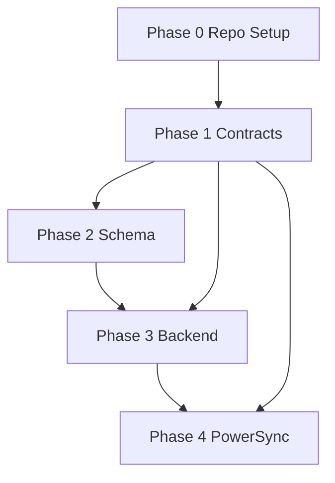

# Altair Phase 0–4 Execution Checklist

| Field | Value |
|---|---|
| **Document** | Altair Phase 0–4 Execution Checklist |
| **Version** | 1.0 |
| **Status** | Draft |
| **Last Updated** | 2026-03-11 |
| **Related Docs** | `altair-implementation-plan.md`, architecture spec, ADR-002/003/004, schema design spec, PowerSync sync spec, shared contracts spec |

---

# 1. Purpose

This document converts **Phases 0–4** of the implementation plan into an execution-ready checklist.

It is optimized for:

- turning architecture into work items
- preserving dependency order
- reducing hidden prerequisite chaos
- making “what do I build next?” obvious

This covers:

- **Phase 0:** Project Setup & Decision Lock
- **Phase 1:** Shared Contracts Foundation
- **Phase 2:** Database & Schema Foundation
- **Phase 3:** Backend Core Foundation
- **Phase 4:** PowerSync Foundation

---

# 2. Execution Rules

## Rule 1

Do not start broad feature work before **contracts, schema, auth, and sync basics** are proven.

## Rule 2

Every task should produce either:

- a working artifact
- a test
- a decision
- or a documented failure mode

## Rule 3

When a task reveals structural mismatch, fix the structure before layering more code on top.

That is less glamorous, but also less stupid.

---

# 3. Status Legend

- **[ ]** Not started
- **[~]** In progress
- **[x]** Complete
- **[!]** Blocked

---

# 4. High-Level Dependency Chain

---

# 5. Phase 0 — Project Setup & Decision Lock

## Goal

Create the repo, tooling, and baseline project structure so the rest of the work can proceed without constant reinvention.

## Exit Criteria

- monorepo exists
- app/package layout exists
- baseline CI exists
- formatting/linting exists
- docs are in repo
- team can clone and run baseline tooling

---

## P0-001 — Create Monorepo Skeleton

**Depends on:** nothing  
**Owner:** platform/dev setup

### Checklist

- [x] Create repo root structure:
  - [x] `apps/server`
  - [x] `apps/web`
  - [x] `apps/desktop`
  - [x] `apps/android`
  - [x] `apps/worker`
  - [x] `packages/`
  - [x] `infra/`
  - [x] `docs/prd`
  - [x] `docs/architecture`
  - [x] `docs/adr`

### Acceptance Criteria

- repo layout matches agreed architecture
- paths are documented in root README

---

## P0-002 — Define Workspace Tooling

**Depends on:** P0-001  
**Owner:** platform/dev setup

### Checklist

- [x] Choose JS workspace manager (decided: bun)
- [x] Add root workspace config
- [x] Add Rust workspace config if needed
- [x] Confirm Android Gradle structure
- [x] Decide root task runner conventions

### Acceptance Criteria

- one documented command path exists for:
  - [x] web install/build
  - [x] server build/test
  - [x] Android build/test
  - [x] shared scripts

---

## P0-003 — Add Formatting and Linting

**Depends on:** P0-001  
**Owner:** platform/dev setup

### Checklist

- [x] Add `.editorconfig`
- [x] Add TS formatter/lint config
- [x] Add Rust fmt/clippy config or scripts
- [x] Add Kotlin formatter/lint config or scripts
- [x] Add root README section for developer setup

### Acceptance Criteria

- [x] formatting can be run locally
- [x] lint commands exist for each active language

---

## P0-004 — Add Baseline CI Skeleton

**Depends on:** P0-002, P0-003  
**Owner:** platform/dev setup

### Checklist

- [x] Add GitHub Actions workflow for:
  - [x] TypeScript install/build placeholder
  - [x] Rust build/test placeholder
  - [x] Kotlin/Gradle build placeholder
  - [x] contract validation placeholder
- [x] Ensure CI runs on PRs

### Acceptance Criteria

- PRs trigger CI
- CI can succeed on baseline repo state

---

## P0-005 — Check In Current Architecture Artifacts

**Depends on:** P0-001  
**Owner:** architecture/docs

### Checklist

- [X] Add PRDs to `docs/prd`
- [X] Add architecture spec to `docs/architecture`
- [X] Add ADRs to `docs/adr`
- [X] Add schema design spec
- [X] Add PowerSync sync spec
- [X] Add shared contracts spec
- [X] Add implementation plan

### Acceptance Criteria

- all current decisions are version-controlled in repo

---

## Phase 0 Review Gate

- [x] Repo structure approved
- [x] Tooling conventions approved
- [x] CI skeleton green
- [x] Current architecture docs committed

---

# 6. Phase 1 — Shared Contracts Foundation

## Goal

Prevent string drift and identifier chaos before backend and clients proliferate.

## Exit Criteria

- registry files exist
- generated bindings exist
- contract tests pass
- CI enforces generation + validation

---

## P1-001 — Add Registry JSON Files

**Depends on:** P0-001  
**Owner:** contracts/platform

### Checklist

- [x] Create `packages/contracts/registry/entity-types.json`
- [x] Create `packages/contracts/registry/relation-types.json`
- [x] Create `packages/contracts/registry/sync-streams.json`
- [x] Populate with current canonical values
- [x] Add README explaining source-of-truth policy

### Acceptance Criteria

- registry files contain all canonical values currently approved
- no duplicate identifiers exist

---

## P1-002 — Add Shared Schema Files

**Depends on:** P1-001  
**Owner:** contracts/platform

### Checklist

- [X] Add `RelationRecord` JSON schema
- [X] Add `AttachmentRecord` JSON schema
- [X] Add `EntityRef` JSON schema
- [x] Add optional starter `SyncSubscriptionRequest` schema

### Acceptance Criteria

- schemas validate basic cross-platform payload shapes

---

## P1-003 — Add Codegen Script

**Depends on:** P1-001  
**Owner:** contracts/platform

### Checklist

- [x] Add generator script under `scripts/`
- [x] Generator reads registry JSON
- [x] Generator emits:
  - [x] TypeScript bindings
  - [x] Kotlin bindings
  - [x] Rust bindings
- [x] Document generator usage

### Acceptance Criteria

- running generator creates outputs without manual edits

---

## P1-004 — Commit Generated Bindings

**Depends on:** P1-003  
**Owner:** contracts/platform

### Checklist

- [x] Add generated TS constants
- [x] Add generated Kotlin enums/data classes
- [x] Add generated Rust enums/structs

### Acceptance Criteria

- generated artifacts are committed and readable
- identifiers match registry exactly

---

## P1-005 — Add Validation Tests

**Depends on:** P1-003, P1-004  
**Owner:** contracts/platform

### Checklist

- [x] Add registry shape tests
- [x] Add duplicate-value tests
- [x] Add generated TS value tests
- [x] Add generated Kotlin value tests
- [x] Add generated Rust value tests

### Acceptance Criteria

- tests fail when registry and generated code drift

---

## P1-006 — Wire Contracts CI

**Depends on:** P1-005, P0-004  
**Owner:** platform/dev setup

### Checklist

- [x] Add contracts generation workflow
- [x] Run generator in CI
- [x] Fail if `git diff --exit-code` finds changes
- [x] Run contract validation tests in CI

### Acceptance Criteria

- PR fails if generated artifacts are stale
- PR fails if registry values are invalid

---

## P1-007 — Replace Magic Strings in Existing Artifacts

**Depends on:** P1-004  
**Owner:** platform/backend/client leads

### Checklist

- [x] Update backend placeholders/docs to reference canonical entity types
- [x] Update PowerSync spec docs to reference canonical stream names
- [x] Update future client scaffolds to import generated constants

### Acceptance Criteria

- no new shared identifier is introduced outside contracts package

---

## Phase 1 Review Gate

- [x] Registry files approved
- [x] Generated bindings checked in
- [x] Validation tests green
- [x] CI enforcement green

---

# 7. Phase 2 — Database & Schema Foundation

## Goal

Stand up Postgres schema and migration flow consistent with contracts and sync needs.

## Exit Criteria

- migrations run cleanly
- seed dataset loads cleanly
- schema supports ownership/scopes
- schema reviewed for sync friendliness

---

## P2-001 — Select and Wire Migration Tooling

**Depends on:** P0-002  
**Owner:** backend/platform

### Checklist

- [x] Choose migration tool for Rust/Postgres stack
- [x] Add migrations folder structure
- [x] Add local migration commands
- [x] Document migration workflow

### Acceptance Criteria

- dev can apply/reset migrations locally

---

## P2-002 — Stand Up Local Postgres in Dev Compose

**Depends on:** P0-001  
**Owner:** infra/platform

### Checklist

- [x] Add Postgres service to local compose
- [x] Add persistent volume
- [x] Add env/config for local credentials
- [x] Document startup command

### Acceptance Criteria

- local Postgres boots reliably from compose

---

## P2-003 — Implement Baseline Core Schema

**Depends on:** P2-001, P2-002, P1-001  
**Owner:** backend/data

### Checklist

- [x] Add migrations for:
  - [x] `users`
  - [x] `households`
  - [x] `household_memberships`
  - [x] `initiatives`
  - [x] `tags`
  - [x] `attachments`
  - [x] `entity_relations`
- [x] Add timestamps / soft delete fields
- [x] Add ownership/scope columns
- [x] Add baseline constraints

### Acceptance Criteria

- core tables exist and apply cleanly from empty DB

---

## P2-004 — Implement Guidance Schema

**Depends on:** P2-003  
**Owner:** backend/data

### Checklist

- [x] Add migrations for:
  - [x] `guidance_epics`
  - [x] `guidance_quests`
  - [x] `guidance_routines`
  - [x] `guidance_focus_sessions`
  - [x] `guidance_daily_checkins`
- [x] Add relevant indexes
- [x] Add status/priority/energy check constraints

### Acceptance Criteria

- Guidance schema supports current-state + basic history tables

---

## P2-005 — Implement Knowledge Schema

**Depends on:** P2-003  
**Owner:** backend/data

### Checklist

- [x] Add migrations for:
  - [x] `knowledge_notes`
  - [x] `knowledge_note_snapshots`
- [x] Add note hierarchy FK
- [x] Add slug uniqueness rules
- [x] Add text fields needed for future search

### Acceptance Criteria

- note model supports personal/shared/initiative-scoped notes

---

## P2-006 — Implement Tracking Schema

**Depends on:** P2-003  
**Owner:** backend/data

### Checklist

- [x] Add migrations for:
  - [x] `tracking_locations`
  - [x] `tracking_categories`
  - [x] `tracking_items`
  - [x] `tracking_item_events`
  - [x] `tracking_shopping_lists`
  - [x] `tracking_shopping_list_items`
- [x] Add barcode/indexing basics
- [x] Add quantity constraints where appropriate

### Acceptance Criteria

- item current-state + item event history both exist

---

## P2-007 — Implement Join Tables

**Depends on:** P2-004, P2-005, P2-006  
**Owner:** backend/data

### Checklist

- [x] Add `initiative_tags`
- [x] Add `quest_tags`
- [x] Add `note_tags`
- [x] Add `item_tags`
- [x] Add `quest_attachments`
- [x] Add `note_attachments`
- [x] Add `item_attachments`

### Acceptance Criteria

- all join tables apply cleanly and support expected FK behavior

---

## P2-008 — Add Updated-At Triggers / DB Helpers

**Depends on:** P2-003  
**Owner:** backend/data

### Checklist

- [x] Add `set_updated_at()` function
- [x] Apply triggers to mutable tables
- [x] Confirm inserts/updates behave as expected

### Acceptance Criteria

- updated timestamps are automatic and consistent

---

## P2-009 — Load Development Seed Dataset

**Depends on:** P2-003 through P2-007  
**Owner:** backend/data

### Checklist

- [x] Add deterministic seed SQL or seeding tool
- [x] Seed:
  - [x] one primary user
  - [x] one secondary household member
  - [x] one household
  - [x] one personal initiative
  - [x] one household initiative
  - [x] shared chores
  - [x] inventory items
  - [x] notes
  - [x] relation records
  - [x] shopping list
- [x] Validate seed idempotence or documented reset flow

### Acceptance Criteria

- seed loads successfully into fresh local DB
- seed data exercises all major domain scopes

---

## P2-010 — Sync Scope Schema Review

**Depends on:** P2-009, P1-001  
**Owner:** backend + sync design

### Checklist

- [x] Review each table for:
  - [x] user ownership
  - [x] household scope
  - [x] initiative scope
  - [x] whether auto-sync vs on-demand vs server-only
- [x] Mark high-volume tables
- [x] Identify tables needing selective replication

### Acceptance Criteria

- every syncable table has an explicit replication strategy note

---

## Phase 2 Review Gate

- [x] Migrations apply from scratch
- [x] Seed dataset loads
- [x] Core scopes are present in schema
- [x] Sync review completed

---

# 8. Phase 3 — Backend Core Foundation

## Goal

Stand up Axum server with auth, config, core APIs, and reusable authorization boundaries.

## Exit Criteria

- local server boots
- auth works
- core APIs work against real DB
- authorization boundaries are enforced
- integration tests cover access basics

---

## P3-001 — Create Server Skeleton

**Depends on:** P0-001, P2-002  
**Owner:** backend

### Checklist

- [x] Create Rust app under `apps/server`
- [x] Add config loader
- [x] Add DB pool
- [x] Add health endpoint
- [x] Add structured logging
- [x] Add error handling baseline

### Acceptance Criteria

- server starts locally and exposes `/health`

---

## P3-002 — Add Server Module Structure

**Depends on:** P3-001  
**Owner:** backend

### Checklist

- [x] Add modules for:
  - [x] auth
  - [x] core
  - [x] guidance
  - [x] knowledge
  - [x] tracking
  - [x] attachments
  - [x] sync
  - [x] search
- [x] Add shared API/router conventions

### Acceptance Criteria

- module layout mirrors architecture spec

> **Note:** The `relations` module was omitted as the architecture spec does not define a `/relations/*` API path. Relations are handled internally via `entity_relations` table and exposed through domain endpoints. The `/admin` domain is deferred to a later phase.

---

## P3-003 — Implement Auth Foundation

**Depends on:** P2-003, P3-001  
**Owner:** backend/auth

### Checklist

- [x] Add password hashing
- [x] Add login endpoint
- [x] Add session/token model
- [x] Add current-user extractor
- [x] Add auth middleware

### Acceptance Criteria

- test user can authenticate and call protected endpoints

---

## P3-004 — Implement Authorization Helpers

**Depends on:** P3-003, P2-009  
**Owner:** backend/auth

### Checklist

- [x] Add helper for user-owned records
- [x] Add helper for household membership checks
- [x] Add helper for initiative visibility
- [x] Add helper for attachment ownership/scope

### Acceptance Criteria

- reusable authorization checks exist and are not duplicated in every handler

> **Implemented in:** `apps/server/src/auth/authorization.rs`
>
> - `can_access_user_owned()` / `require_user_owned()` — generic ownership checks for 9 table types
> - `can_access_household()` / `require_household_role()` — household membership with role hierarchy
> - `can_access_initiative()` / `require_initiative_access()` — dual-path (owner OR member)
> - `can_access_attachment()` / `require_attachment_access()` — multi-path with entity_relations support
> - Plus `can_access_tag()` for tag visibility

---

## P3-005 — Implement Core APIs

**Depends on:** P3-004  
**Owner:** backend/core

### Checklist

- [x] `GET /users/me`
- [x] household list/detail endpoints
- [x] household membership list endpoints
- [x] initiatives CRUD (starter)
- [x] tags CRUD (starter)

### Acceptance Criteria

- authenticated user can fetch personal/household core data from seed DB

> **Implemented:** 17 endpoints total
>
> - Users: `GET /users/me`
> - Households: `GET/POST/PATCH/DELETE /core/households` + `GET /core/households/:id/memberships`
> - Initiatives: Full CRUD at `/core/initiatives`
> - Tags: Full CRUD at `/core/tags`
>
> All routes wired in `main.rs`, handlers in `core/handlers/`

---

## P3-006 — Implement Relation APIs

**Depends on:** P3-004, P2-003  
**Owner:** backend/relations

### Checklist

- [x] create relation endpoint
- [x] list relations by entity endpoint
- [x] accept relation endpoint
- [x] dismiss/reject relation endpoint
- [x] validate entity type/relation type inputs against contracts

### Acceptance Criteria

- relation records can be created and queried safely

---

## P3-007 — Add Backend Integration Tests

**Depends on:** P3-005, P3-006  
**Owner:** backend/test

### Checklist

- [x] auth success/failure tests
- [x] users/me access test
- [x] household membership boundary test
- [x] initiative visibility test
- [x] relation create/list authorization tests

### Acceptance Criteria

- integration tests run locally and in CI

---

## P3-008 — Add API Documentation Stubs

**Depends on:** P3-005  
**Owner:** backend/docs

### Checklist

- [x] document auth endpoints
- [x] document core entity payloads
- [x] document relation payloads
- [x] note which APIs are provisional

### Acceptance Criteria

- first client implementation does not require reverse-engineering handler code

---

## Phase 3 Review Gate

- [x] Server boots locally
- [x] Auth works
- [x] Core APIs work on seeded DB
- [x] Authorization helpers exist
- [ ] Integration tests are green

---

# 9. Phase 4 — PowerSync Foundation

## Goal

Validate baseline Postgres → SQLite sync for personal and household data.

## Exit Criteria

- PowerSync runs locally
- baseline streams work
- auth wiring works
- at least one client can sync baseline data
- one on-demand stream works

---

## P4-001 — Add Local PowerSync Environment

**Depends on:** P2-002, P3-001  
**Owner:** infra/sync

### Checklist

- [x] Add PowerSync service to local compose or dev setup
- [x] Add env/config wiring
- [x] Document startup steps
- [x] Confirm service health

### Acceptance Criteria

- local sync environment boots consistently

---

## P4-002 — Add Starter Sync Streams Config

**Depends on:** P1-001, P2-010, P4-001  
**Owner:** sync/backend

### Checklist

- [ ] Add streams for:
  - [ ] `my_profile`
  - [ ] `my_memberships`
  - [ ] `my_personal_data`
  - [ ] `my_household_data`
  - [ ] `my_relations`
  - [ ] `my_attachment_metadata`
- [ ] Ensure names match contracts registry exactly

### Acceptance Criteria

- config parses and stream names are canonical

---

## P4-003 — Wire Auth Identity into PowerSync

**Depends on:** P3-003, P4-002  
**Owner:** sync/backend

### Checklist

- [ ] propagate user identity into sync context
- [ ] confirm `auth.user_id()` equivalent works as intended
- [ ] validate unauthorized user cannot see other users’ data

### Acceptance Criteria

- stream queries return only authorized rows

---

## P4-004 — Validate Auto-Subscribed Streams

**Depends on:** P4-003, P2-009  
**Owner:** sync/test

### Checklist

- [ ] sync current user profile
- [ ] sync memberships
- [ ] sync personal initiatives/tags/routines/assigned quests
- [ ] sync household initiatives/quests/items/lists
- [ ] sync relations
- [ ] sync attachment metadata only

### Acceptance Criteria

- baseline working set lands in client SQLite correctly

---

## P4-005 — Add One On-Demand Stream

**Depends on:** P4-004  
**Owner:** sync/backend

### Checklist

- [ ] implement `initiative_detail`
- [ ] validate parameter-based subscription
- [ ] ensure server-side authorization still applies
- [ ] verify epics/quests/notes/items for initiative scope

### Acceptance Criteria

- a client can request one initiative’s detail set successfully

---

## P4-006 — Build Sync Verification Harness

**Depends on:** P4-004  
**Owner:** sync/test

### Checklist

- [ ] define test sequence:
  - [ ] first sync
  - [ ] offline local update
  - [ ] reconnect
  - [ ] upstream propagation
  - [ ] second client receives change
- [ ] capture test steps in repo docs
- [ ] run against seeded household data

### Acceptance Criteria

- repeatable sync smoke test exists

---

## P4-007 — Instrument Sync Diagnostics

**Depends on:** P4-004  
**Owner:** sync/backend

### Checklist

- [ ] log stream subscription names
- [ ] log sync failures
- [ ] capture missing-row debugging notes
- [ ] document common sync debugging commands

### Acceptance Criteria

- sync failures are diagnosable without blind guessing

---

## P4-008 — Connect One Thin Client for Proof

**Depends on:** P4-006  
**Owner:** Android or desktop/web prototype

### Checklist

- [ ] choose first proof client
- [ ] initialize local SQLite
- [ ] subscribe to baseline streams
- [ ] display synced data:
  - [ ] profile
  - [ ] one household
  - [ ] one shared quest
  - [ ] one tracking item
- [ ] verify local read path works

### Acceptance Criteria

- at least one real client can sync and display baseline personal + household data

---

## Phase 4 Review Gate

- [ ] PowerSync is running locally
- [ ] baseline streams sync authorized data
- [ ] one on-demand stream works
- [ ] one thin client proves local SQLite sync works
- [ ] sync diagnostics exist

---

# 10. Suggested Execution Order (Strict)

## Block 1

- [x] P0-001
- [x] P0-002
- [x] P0-003
- [x] P0-005
- [x] P0-004

## Block 2

- [x] P1-001
- [x] P1-002
- [x] P1-003
- [x] P1-004
- [x] P1-005
- [x] P1-006
- [x] P1-007

## Block 3

- [x] P2-001
- [x] P2-002
- [x] P2-003
- [x] P2-004
- [x] P2-005
- [x] P2-006
- [x] P2-007
- [x] P2-008
- [x] P2-009
- [x] P2-010

## Block 4

- [x] P3-001
- [x] P3-002
- [x] P3-003
- [x] P3-004
- [x] P3-005
- [x] P3-006
- [x] P3-007
- [x] P3-008

## Block 5

- [ ] P4-001
- [ ] P4-002
- [ ] P4-003
- [ ] P4-004
- [ ] P4-005
- [ ] P4-006
- [ ] P4-007
- [ ] P4-008

This is not a calendar promise. It is an ordering recommendation so dependencies stop playing hide-and-seek.

---

# 11. Parallelizable Work

## Safe parallel work during Phase 1

- generator script
- registry docs
- validation tests

## Safe parallel work during Phase 2

- Guidance schema
- Knowledge schema
- Tracking schema  
Only after core tables are in place.

## Safe parallel work during Phase 3

- core APIs
- relation APIs
- integration tests/docs  
Only after auth/authorization foundation exists.

## Work to avoid parallelizing too early

- PowerSync auth wiring before backend auth exists
- client work before contracts are wired
- feature UI before one thin sync proof exists

---

# 12. Deliverables Checklist

## By end of Phase 0

- [x] monorepo exists
- [x] CI exists
- [x] docs committed

## By end of Phase 1

- [x] contracts package enforced
- [x] generated bindings checked in
- [x] contract CI green

## By end of Phase 2

- [x] schema migration set exists
- [x] seed dataset exists
- [x] sync review notes exist

## By end of Phase 3

- [x] auth + core server works
- [x] authorization boundaries tested
- [x] relation APIs work

## By end of Phase 4

- [ ] PowerSync baseline works
- [ ] one client sync proof exists
- [ ] initiative detail on-demand stream works

---

# 13. Immediate Next Actions

1. **Create the repo skeleton and commit the current docs.**
2. **Install the contracts package and CI enforcement immediately.**
3. **Stand up Postgres + migrations before touching feature APIs.**
4. **Implement auth and household boundaries before sync.**
5. **Prove one thin PowerSync-backed client before building broad UI.**

That is the shortest path to discovering whether the architecture is solid or just very eloquent.
