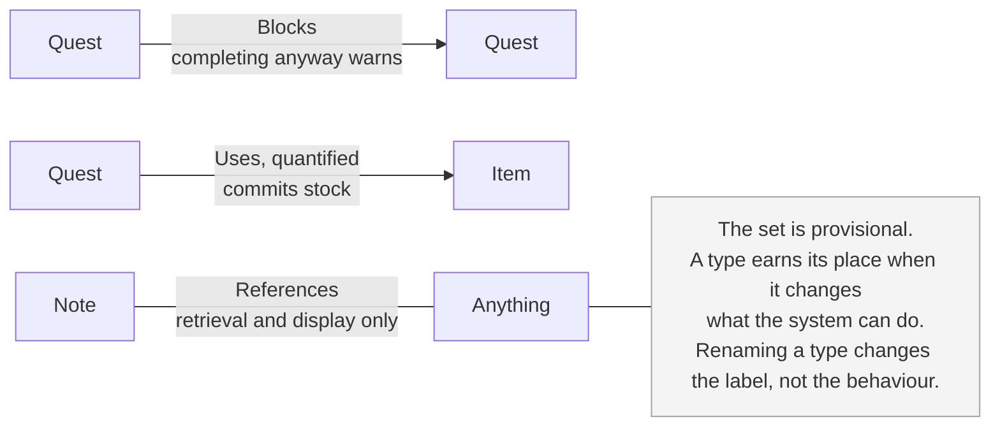

# Altair Relation Types Specification

**Status:** Draft
**Date:** 2026-08-06
**Governed by:** Altair Vision & Scope
**Related:** Altair Substrate Specification, Altair Guidance PRD, Altair Knowledge PRD, Altair Tracking PRD

---

## What this document is

The set of relation types, and what the system does with each one.

It exists separately because relation types belong to no single domain. *Uses* joins a quest to an item, so it is half a Guidance concern and half a Tracking one. *References* is used by all three. Filing the set under whichever domain happened to need it first makes the vocabulary hard to find and harder to reason about as a whole.

**It is not part of the substrate.** The substrate makes relations first-class, optionally typed, optionally directional, and able to carry properties defined by their type. It deliberately holds no domain behaviour, and these types are behaviour: a warning when something blocked is completed, stock committed against a quest. Putting them there would break a scope discipline the substrate keeps carefully.

**It is behavioural.** It says what the system does with a type, not how any of it is built.

---

## The set is provisional

**Nothing here is fixed.** The types below are the current set and are expected to change as the domains are built and used. A type may be added when something concrete needs it, removed when nothing turns out to act on it, or reshaped when its behaviour is understood better than it is now.

This is deliberate rather than a sign the work is unfinished. What a relation type is worth cannot be settled by reasoning about it, only by finding out whether anything uses it. Fixing the set early would mean shipping types nobody needed and missing ones nobody thought of.

**What is settled is the test a type has to pass**, and that is in the next section. The list itself is a current answer to it.

---

## What earns a type

**A type earns its place when it changes what the system can do.** A type that nothing acts on is decoration, and an untyped relation is cheaper to create and already available.

This is the whole test, and it is worth being strict about, because a vocabulary of types that mean something only to the person who chose them is a taxonomy to maintain. The product does not have those anywhere else.

---

## The current set

| Type | Direction | Behaviour it enables |
|------|-----------|---------------------|
| Blocks | Asymmetric | Completing something still blocked warns the person |
| Uses | Asymmetric, quantified | A quest shows what it needs from Tracking, and how much |
| References | Symmetric | Nothing beyond retrieval and display |

*References* is the borderline case by the test above, since nothing acts on it. It is retained because it says what a connection is for at the moment someone forms it, and because the alternative for the most common kind of link is to leave it untyped, which loses that. If it turns out nobody chooses it, it fails the test and goes.

### How a type behaves

**An asymmetric type is one relation read from either end.** *Blocks* and *blocked by* are the same record seen from the two entities it joins, not two types and not two records. The table names the type, not the only phrasing a person will encounter: the quest holding up the work reads as blocking, the quest waiting on it reads as blocked by, and the same is true of *uses* and *used by*. This follows the substrate rule that direction is a property of a single relation rather than a reason to store a second one.

**A type may define properties the relation carries.** A quantified *Uses* needs a number, and that number is a fact about the pairing rather than about either end: the quest does not have a quantity and neither does the item. The relation is the only place it belongs.

**Properties follow from the type, not from the person.** *Uses* carries a quantity because its behaviour needs one. There is no facility for adding arbitrary fields to a relation, because that is a schema system by another name. An untyped relation carries nothing.

**Behaviour warns, it does not prevent.** A blocked quest can be completed. The system says the blocker is still open and the person decides, because the person knows things the system does not.

**A renamed type is the same type.** Users may rename these labels. Renaming changes what the label says and nothing about what the system does.

---

## Untyped relations

**Untyped relations are valid, and they are the common case.** Choosing a type is a question, and the capture path does not ask.

**A relation without a type is untyped, not possibly typed.** Nothing infers a type from the entities at either end, from the words nearby, or from what a similar relation was typed as previously. A relation with no type is never treated as though it might be a blocking one.

**An anchor is not a type.** The substrate permits a relation to record where in a body it was formed. That is available to any relation, typed or not, and carries no behaviour of its own.

---

## What each domain adds

Nothing. The absence is a position rather than an oversight: no domain has needed a type of its own.

**Guidance** uses *Blocks* and *Uses*, and its hierarchy is structure rather than a relation type: a quest belonging to an arc is the ladder, not a link the person formed.

**Tracking** is the other end of *Uses*. The quantity lives on the relation, and reaching a quest's terminal state is when a live commitment resolves.

**Knowledge** defines none and uses the set as it stands.

---

## Open questions

1. **Whether a supersession type is needed.** The substrate treats a new edition of a work as a new entity related to the old one, and that relation is currently untyped or *References*. A type would let the system say which of two editions is the later one, which is a real thing to want and is currently carried only by whatever the person wrote in the two titles. It has not been argued against the test above.

2. **Whether users may declare their own types.** A leaning recorded in the scratchpad: a user-declared type could only inherit behaviour the system already implements, so declaring one asymmetric gets the two-ended reading and declaring one quantified gets a number. It can never invent behaviour, which means a custom type will always do less than one of these, and an interface should not obscure that. Not committed to, and the constraint worth honouring meanwhile is to build these as declarations the system interprets rather than as hardcoded branches, so that exposing the extension point later is exposing what already exists.
