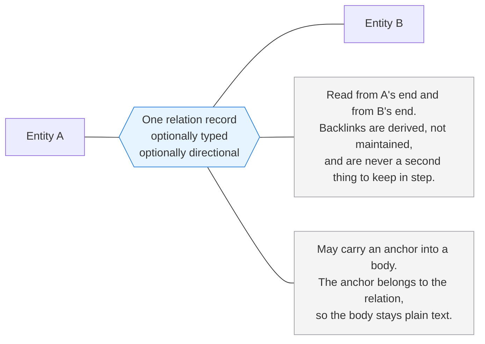
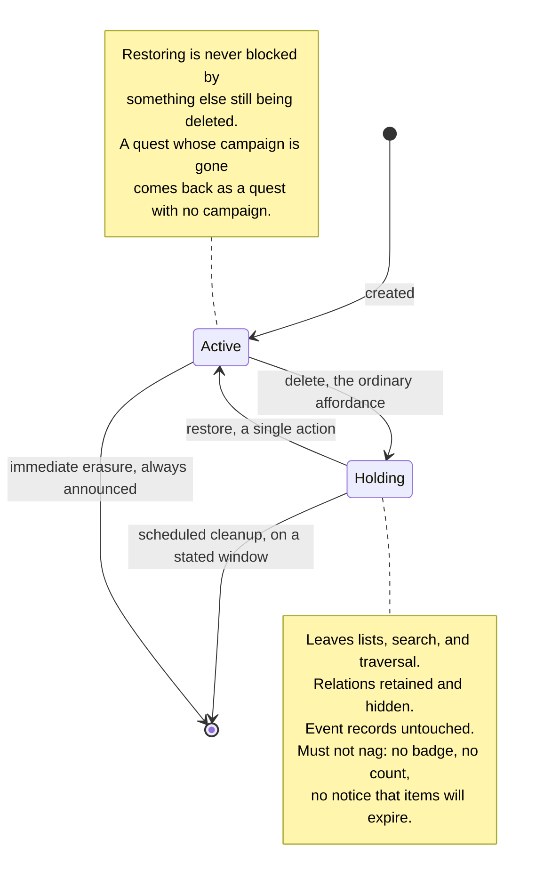

# Altair Substrate Specification

**Status:** Draft
**Date:** 2026-08-06
**Governed by:** Altair Vision & Scope
**Related:** DR-001 (markdown is the note body, not the storage layer), Altair Relation Types Specification

---

## Purpose

This document specifies the layer beneath Guidance, Knowledge, and Tracking: the things all three share and the guarantees they all inherit.

It exists because the expensive-to-reverse decisions in Altair are cross-cutting. A mistake in the entity model or the write path propagates into every domain and every client. A mistake inside one domain does not.

**It is behavioural.** It says what must be true, not what technology provides it. Storage choices are deferred to their own decision records. Where a requirement constrains those choices, it is recorded in [What this asks of storage](#what-this-asks-of-storage) rather than resolved here.

**Scope discipline:** this specifies the substrate and nothing else. Domain behaviour belongs to domain specs. If a section here starts describing what a quest does, it has escaped.

**This document and the domain PRDs are the authority.** The data model states the structure that satisfies what is required here: the inventory of types, what each holds, cardinality, and lifecycle. It decides nothing. Where it and this document disagree, this document is right and the model needs correcting.

---

## Contents

- [Entities](#entities)
- [Relations](#relations)
- [Categories](#categories)
- [Dates](#dates)
- [Arrangement](#arrangement)
- [Assignment](#assignment)
- [Membership](#membership)
- [Capture and the write path](#capture-and-the-write-path)
- [Concurrent writes](#concurrent-writes)
- [History and deletion](#history-and-deletion)
- [Audience](#audience)
- [Files](#files)
- [Derived data](#derived-data)
- [Retrieval](#retrieval)
- [What this asks of storage](#what-this-asks-of-storage)
- [Deliberately not decided](#deliberately-not-decided)

---

## Entities

Everything a user creates is an entity. Campaigns, arcs, quests, routines, focus sessions, check-ins, notes, files, items, locations, categories, and shopping lists are all entity types over one shared model.

Every entity carries the following, whatever its type. The inventory of types and what each holds beyond this shared set is stated in the data model.

**Identity is globally unique, and stable from the moment anything refers to it.** See [Identity](#identity).

**Type is fixed at creation.** An entity does not change type.

**A title is always optional**, on every type. What a type calls it may differ.

**An author is the household member who created it, and never changes.** An entity created before its device is bound to a household has none until binding, and acquires one then.

**A creation time is set once by the client that created it**, and an update time advances on any change to entity content. Neither settles the order of anything, since no device's clock is authoritative.

**Any number of dates, each labelled.** See [Dates](#dates).

**A position in each container it sits in.** See [Arrangement](#arrangement).

**At most one category, and required by none.** See [Categories](#categories).

**Any number of assigned household members, or none.** See [Assignment](#assignment).

**An audience.** See [Audience](#audience).

**A lifecycle state**, which is active, deleted, or erased. See [History and deletion](#history-and-deletion).

**A creation method, set once and never changed**, which records how the entity came to exist.

**A bulk state**, which is whether it is still filterable as bulk-captured, and which is mutable.

### Capture method

**How an entity was created is recorded permanently and never changes.** Quick capture, a form, a barcode scan, a file upload, an import, a routine spawning a quest, the public interface. The set of methods is open and grows as clients add ways to create things.

This is provenance. It is cheap to record and impossible to reconstruct later, and it earns its place twice over before anything is displayed to anyone:

- **Import fidelity.** DR-001 names dropping the provenance of imported data as unrecoverable loss. This is where that is prevented.
- **Debugging the capture guarantee.** If entities go missing, the first useful question is which path created them. Without this field that question cannot be asked.

**Usage reporting is legitimate, and useful.** Which capture paths carry real volume is worth knowing to the operator deciding what to maintain, and worth knowing to the user. "I assumed I captured mostly on mobile, but almost all of it is web" is a fact about your own tooling that is genuinely hard to observe from the inside, and harder still to hold accurately in memory.

> ⚠️ **The line this must not cross.** The distinction is not aggregation, it is what is being measured and whether it implies a target.
>
> - **Permitted:** counts of which paths were used, and when. Descriptive, about the tools, with no baseline and no goal.
> - **Excluded:** anything measuring the user's output rather than their tool use, any target or trend framed as improvement or decline, and any of it appearing where the user did not go looking for it.
>
> "You used barcode capture forty times" is a fact about a feature. "Your capture rate is down this month" is a judgement about a person, and the vision document prohibits it.

### Bulk state

Separately, and mutably, the substrate tracks whether an entity is still filterable as bulk-captured. The vision document requires that high-volume capture not degrade browsable surfaces, and that an entity leaves that state when the user edits anything beyond metadata.

- **Initial value derives from capture method.** A file upload of two hundred scans starts as bulk. A quick capture does not.
- **It then diverges.** The method is what happened once. The state is what is true now.
- **Relations and derived text do not graduate an entity**, because both occur during ordinary bulk workflows. Authored body content does.
- **The transition is one-way, and overridable by the user in both directions.** The heuristic will be wrong sometimes, and a filter that hides something a user needs is the failure this whole mechanism exists to prevent.

---

## Relations

A relation is a first-class record, not a field on an entity.

**Required properties:**

- **Any type to any type.** No domain restriction, no allow-list of valid pairs. A note relates to an item relates to a focus session.
- **Bidirectional by construction.** One record, traversable from either end. Backlinks are not a second record to keep in step, because anything maintained by hand eventually diverges.
- **Typed, though a type is not required.** The relation carries what kind of connection it is, where one is known. The set of relation types is specified elsewhere, since it belongs to no single domain and carries behaviour the substrate holds none of. A relation with no type is valid, since choosing one is a question and the capture path does not ask. Anything acting on types treats an untyped relation as untyped rather than inferring one.
- **Direction is optional.** A relation does not require one, and most will not have one: two things are related and neither end is privileged. Where a type is asymmetric, the direction is a property of that one relation record, read differently from each end, not a second record pointing back.
- **A type may define properties the relation carries.** Some connections are not fully described by the fact that they exist. A relation meaning "this needs three of those" holds a quantity that belongs to neither end, and the relation is the only place it can live. Which properties a relation carries follows from its type, and is specified alongside the type set rather than here. Substrate requires only that the storage exists and that it survives sync, export, and restore like any other content.
- **Properties are defined by the type, not by the person.** There is no facility for attaching arbitrary fields to a relation. A general property bag is a schema system by another name, and the reasoning that keeps entity structure fixed applies here too. An untyped relation carries no properties, which is another reason nothing treats an untyped relation as though it might be a typed one.
- **A relation may carry an anchor into a body.** Where a relation was formed at a particular point in an entity's text, it records where. The anchor belongs to the relation and not to the body, which remains plain text, so removing the relation removes the anchor and rewrites nothing. An anchor is not a type-defined property and does not require a type.
- **Editing or deleting anchored text does not remove the relation.** A relation anchored to a phrase survives such an edit and loses its anchor; one anchored to a block keeps its anchor while the block remains. Removing a person's connection as a side effect of them editing a sentence is not something the system does.
- **Independently addressable.** A relation can be created and removed without rewriting either endpoint.

**On deletion:** relations to a deleted entity are retained, not removed. Deletion is recoverable, so a restore that came back with no connections would be data loss dressed as a feature. A relation to a deleted entity is hidden from traversal while that entity is deleted.

**Removing a relation is itself reversible**, on the same terms as removing an entity. Somebody removing a connection is reaching for the ordinary destructive affordance, and the reasoning that put deletion behind a holding state does not weaken because the thing removed is a link rather than a thing: the moment a person is most certain is frequently the moment they are wrong, and connections are what this product is for. So the relation leaves traversal and can come back.

**A relation comes back with the act that removed it.** Where a single act removed several things, that grouping is retained, so restoring it brings the connections back alongside the entities. There is no restoring one on its own, and that asymmetry with entities is deliberate: nothing lists removed connections for a person to notice one missing from, and forming a connection again costs a gesture, which is not true of an entity whose content nobody can retype from memory. Erasing either endpoint removes the relation outright, which is what erasure means everywhere.

**Relations do not carry permissions.** Linking a private note to a shared quest does not make the note visible. See [Audience](#audience).

---

## Categories

A category is a place to go, and it is the only organising structure in Altair besides relations.

It exists for browsing rather than for retrieval. Retrieval answers a question you can already ask; a category answers "show me my work things," which is what someone does when they do not yet know what they are looking for. That is the state a person returning after an absence is actually in.

**Required properties:**

- **A category is an entity, not a label.** It can be described, related to, and returned by retrieval in its own right. This is the same reasoning that makes a location an entity rather than a field on an item.
- **At most one per entity.** This is what separates a category from a tag and it is not a detail. An open vocabulary applied many times over becomes a set the person cannot recall months later, and being unable to remember which words you chose is the failure retrieval exists to prevent. One slot with a short list of values asks a question a person can answer cold.
- **Available to every entity type, required by none.** The set is shared across the domains rather than partitioned between them, because two vocabularies to remember is worse than one, and because a category that reaches only one domain reintroduces a boundary the product does not otherwise have.
- **Uncategorised is complete.** No entity requires one, nothing prompts to supply one, and no view treats an uncategorised entity as unfinished. The capture path does not ask.
- **Nesting is available and never required.** A flat set is not a degraded one, and nothing suggests deepening it.
- **Containment, not a relation.** An entity is in a category. It is not linked to one, and a category does not appear as a relation from either end.
- **Never sets an audience.** The same rule as relations, and for the same reason. An entity's audience is its own, and a category that granted it would be inheritance, which is where audience becomes the excluded permission system. Broadening the audience of everything currently in a category is permitted as an ordinary bulk act the person asked for and was told the consequences of; a standing rule that shares an entity because of where it sits is not.
- **A category may carry a creation default.** Entities created in it may start with a stated audience. This is the existing per-type default mechanism widened, and it acts once at creation rather than continuously.

**On deletion:** an entity whose category is deleted becomes uncategorised, which is a valid state requiring no repair. Nothing about the entity is broken by losing a category, because nothing required it to have one.

> ⚠️ **The restraint here is not enforced, and cannot be.** Nothing prevents someone creating two hundred categories, at which point the one-per-entity limit protects nothing and the tag failure has been rebuilt. The defence is that nothing encourages it: no prompt to categorise, no suggestion to subdivide, and no surface that reads a small set as incomplete. This is a defence by restraint rather than a solved problem, which is worth stating plainly so that a later feature quietly encouraging growth is recognisable as the thing that breaks it.

<!-- -->

> ℹ️ **Not a folder tree.** The vision document excludes filesystem-shaped navigation, which is a rule about how a person gets to things rather than about containment existing. Optional single-parent grouping is permitted. A surface where the tree is the primary route to anything is not.

---

## Dates

An entity carries any number of dates. Each is optional, and an entity with none is complete.

**Required properties:**

- **Each date is labelled by the person, and the label means nothing to Altair.** Due, expires, renews, opened, bought: the label is read by the person and interpreted by nothing. This is the same rule a unit follows in Tracking, and for the same reason. A shipped set of labels would be wrong for someone within a week, and nothing has cause to compare one date's label against another's.
- **Any number, rather than one slot.** A licence has an expiry and a renewal, and a warranty ends. One slot would force a choice between them, or force the person to keep two records of one thing in step for its whole life.
- **Each date records whether the person wants it brought forward ahead of time.** Surfaces that show what is coming take only dates marked this way.
- **That mark is the person's statement, and nothing infers it.** Whether an approaching date is worth being shown is knowledge the person has and the system does not. A licence expiring on something nobody uses any more is noise, and no property of the date says so.
- **Dates carry no obligation.** A date exists for awareness. A date in the past is a fact about the date and not a judgement, and nothing counts, escalates, or ranks by one.

**Not a filter.** A date the person has not marked for bringing forward is not hidden. It sits on the entity, is visible there, and is reachable by retrieval like anything else. The requirement that a filtered view disclose matches outside it therefore does not attach, and a surface showing what is coming owes no notice that other dates exist.

**Capture does not ask for a date**, and nothing needs a default. A surface the person opened on purpose may ask for whatever it likes, since being asked is what they came for.

**A label may come from a template rather than from the person directly.** Tracking permits a person to name the properties a kind of tracked thing has, and a date named that way is an ordinary date on the entity in every respect. There is no second kind of date and no second place to look for one. Whether it comes forward ahead of time remains the person's mark, set when they set the value.

---

## Arrangement

**A person may put the things in a container into an order, and that order holds.** Nothing derives it, nothing adjusts it, and it does not change while a view is being looked at.

This descends from *no barriers to re-entry*. Predictability is what makes returning cheap, and an order somebody set deliberately is the most durable form of it.

**Required properties:**

- **An order exists wherever a container holds things.** A category is a container. The ladder and the schedule surface define their own, in the Guidance PRD. There is no unordered container and no unarranged member of one.
- **The default is the order things entered the container.** A person moving something is overriding that, not supplying something that was missing.
- **Placing an entity between any two others is always available.**
- **Arrangement belongs to the container, not to the entity.** An entity in two containers holds an unrelated position in each, and moving it in one does not move it in the other. A person tidying an arc does not change what a category looks like.
- **Entering a container places the entity at the end.** This is the whole rule, and it holds whether the entity is newly created, moved from another container, or restored. Where it lands is a thing the person can predict before they act.
- **Leaving a container forgets the position.** Nothing is carried, and nothing needs repair.
- **An entity in no container has no arrangement**, and that is an ordinary state rather than a gap. A surface that is not a container orders by something intrinsic to what it shows: a date, a relevance, the order things were captured.
- **The order is total and stable.** Two entities never sort ambiguously, and the same container produces the same order every time, on every device.

> ℹ️ **Sorting by arrangement is not ranking.** Ranking is an order carrying a judgement the person did not ask for. An arrangement is a judgement the person did ask for, and made themselves.

<!-- -->

> ⚠️ **The accepted cost is that an order does not survive a move.** A quest carefully placed in one arc arrives at the end of the next one. The alternative is an order belonging to the entity, which either lands a moved entity in a position it inherited from a set it is no longer part of, or shifts the entity in every other view it appears in. Both are the system moving something the person did not move, and the person is the only one permitted to change an order.

**Position is assigned by the instance, not by the client.** A client cannot place an entity at the end of a container whose contents it may not hold, and appending is the only placement creation performs. This follows the same reasoning as block identity: one implementation, or devices disagree. Reordering, which is a deliberate act on a surface with the container in front of the person, is submitted as a position like any other edit.

---

## Assignment

Any number of household members may be assigned to an entity, and most entities have none.

**Required properties:**

- **Coordination, not accountability.** Its content is "I will take this one, you take that one." It carries no notion of who is answerable, produces no report of who did what, and nothing escalates when something assigned is not done.
- **Available on every entity type.** A shopping list falls to whoever is going out, and material belonging to work several people share is the same shape of fact. Restricting it to one domain would put back a boundary the product does not otherwise have.
- **Any number, including none.** Two people taking one piece of work together is ordinary, and a single slot would make them decide which of them counts.
- **Household only**, which is the maximum scope of everything else.
- **It is not audience, and does not set one.** The same rule categories and relations follow. Assigning someone to a private entity does not let them see it.

**Assigning something private asks.** A private entity assigned to somebody else is incoherent, so the person is asked whether to share it. This is a surface the person opened on purpose rather than the capture path, so asking is permitted.

---

## Membership

A household is a set of members. Everything in Altair is scoped to one, and nothing spans two.

**Required properties:**

- **A membership belongs to one household.** Someone who is part of two households holds two memberships with nothing connecting them, and no surface presents them as one person.
- **A member is referenced, never contained.** An author is a member, an audience names members, an assignment names members, and a template property may hold one. All four are references to something that exists outside the material.
- **A reference survives departure.** Authorship never changes, so someone who leaves remains the author of what they wrote. An audience entry naming them stays where it is, and no shared thing silently narrows because somebody left.
- **An audience entry records who something was shared with, and confers nothing by itself.** Access follows current participation. A departed member's name in an audience does not readmit them.
- **Someone who returns returns to the same membership**, with their authorship and history intact.
- **A departed member's private material stays where it is, readable by nobody.** Erasure per entity is the only removal, and it is available.

> ℹ️ **How a departed member is presented is deliberately undecided.** Whether the remaining household keeps seeing that name, and where, is not one answer: separation, estrangement, and bereavement are not the same event and people do not want the same thing from them. What is required is that the model can carry either without loss, and that the product does not choose on a household's behalf.

### Administration

**Some capability is administrative**, which means the running instance grants it. Household settings, admission, and arranging where backups go are of this kind.

- **Any number of members may hold it**, and more than one is the ordinary arrangement rather than a special case, since a household with one is a household one departure away from having none.
- **It is always available to take.** A household that has nobody administering it is shown that plainly, and any member may take the role. This is a deliberate act by a person, not a state the instance repairs.
- **Nothing is assigned automatically.** Responsibility does not arrive without somebody accepting it.

> ℹ️ **Where the instance runs is not Altair's concern.** Self-hosted software needs somebody with access to the machine it runs on, and that is true of everything, not of this. It is not a role the product models, grants, or reasons about.

---

## Capture and the write path

*Capture never fails* is a commitment from the vision document, and it is a property of this layer.

### What capture means

**Capture is a mode, not a synonym for creating an entity.** Capture is unplanned and interrupts something else. The idea arrives while the person is doing something they cannot stop, and the only thing that must be true is that it survives until they can come back to it. Deliberate creation is the person arriving on purpose to make something, with attention available and time to spend.

**The guarantees in this section attach to the capture path.** They are not claims about every way an entity can come into being. A form that asks questions is not a violation of *capture never stops to ask*, because being asked is what the person came for.

**Where the two are ambiguous, the capture rules apply.** A client cannot narrow the guarantee by declaring one of its surfaces deliberate. The test is whether the person could reasonably be somewhere else with something they are about to lose.

### What acceptance means

**Captured means the entity survives app closure and device restart with no network available.** A client may not indicate acceptance to the user before that is true.

Every system that loses user data loses it in the gap between the interface saying "saved" and the data being durable. Two rules close it:

- **Acceptance is shown only after durability.** Not before, not concurrently.
- **Nothing about the network or the user's credentials participates in that decision.** Connectivity, server health, session validity, and expired or absent credentials govern when an entity is *transmitted*. They have no bearing on whether it is *accepted*.

The second rule is the one violated by accident, because credential handling and capture are usually built by different people at different times.

**Where durability is not achievable, acceptance is refused and the condition is stated.** Local storage that is full, unwritable, or no longer available to the client is the one condition that reaches the guarantee rather than delaying it, and continuing to run does not clear it. So it is a fault: it is said plainly at the moment of the attempt, and nothing is shown as accepted. Failing loudly here is the whole point, because the alternative is the gap this section exists to close, reopened by a client that had nowhere to put what it took.

This narrows nothing. *Capture never fails* is a commitment about network state, and a device that cannot write to itself is not offline.

### What acceptance promises, and what it does not

**Acceptance promises that a created entity will reach the instance.** There is nothing to arbitrate: the entity is new, no prior state exists, and nothing else in the household knows about it. This is what the capture path produces and it is what the guarantee covers.

**It does not extend to writes that refer to something already there.** An edit or a removal names an entity whose existence is a fact about the household rather than about the device. A client above the floor may offer both while offline, and should, but offering them is a platform decision and not a promise that they will land.

Two cases, and only one of them can cost anything:

- **A removal that cannot land has already happened.** Deleting an entity that was erased, or removing a relation whose other end is gone: the end state the person wanted is already true. This converges, and reporting it as a failure would tell them only that the thing they wanted is the thing that occurred.
- **A content edit to an entity that was erased is the one lossy case**, and it is answered under [Deletion and erasure](#deletion-and-erasure).

### Identity

An entity's identity is stable from the moment anything refers to it, and never changes afterward from the user's point of view. Relations refer to entities by identity, so an identity that shifts underneath them breaks every relation pointing at it.

Offline, this only binds a client that offers more than the floor. Where a client permits relations to be formed before reaching the server, those relations must survive reconciliation intact. A client that captures and nothing more has a correspondingly easier problem, since nothing refers to the entity until it arrives.

How identity is assigned is a mechanism question and is not decided here.

### The outbound queue

Because capture is create-only when offline, the offline problem is a queue of outbound writes, not a bidirectional merge. Requirements:

- **Durable.** The queue survives restart alongside the entities it references.
- **Ordered per entity.** A create precedes its own updates.
- **Idempotent.** The same entity submitted twice produces one entity, not two. Retries are normal, not exceptional.
- **Non-blocking.** A stuck item does not prevent later items from sending, and never gates the interface.
- **Silent while waiting, never silent while failing.** Depth is not reported: no badge, count, or banner reflecting how much is queued, because a counter that rises while the user is away is prohibited by the vision document. A condition the ordinary path will clear by continuing to run is waiting, and an unreachable instance and an expired session are the same wait. A condition that will not clear that way is a fault and is signalled. A condition not known to be self-clearing is treated as a fault, because a wrong signal costs attention and a wrong silence costs data.
- **A signal may quantify the fault and never the backlog.** How many items the instance refused is the instance describing itself, on the same line that lets it report its own storage headroom. How many are waiting to send is the person's own work, and that is the counter the prohibition is about.
- **A signal clears when its condition clears**, and nothing acknowledges or dismisses it, so someone returning after three weeks finds a current statement rather than three weeks of notices. It does not escalate, repeat as pressure, or report how long it has been true.

### No required fields on the capture path

**No field may block capture.** An entity with nothing but an identity, a type, and a timestamp is valid and must persist.

**Domains may require fields on deliberate creation surfaces.** A form may ask for whatever a well-formed entity of that type needs. What it may not do is impose that requirement on the fast path, or refuse to store what the fast path produced because it is incomplete.

**An entity with no content is not rejected, it is simply not shown.** Storing an empty entity costs almost nothing, while validating one puts a check on the path that must not fail, and it fails in the case that matters least. A client need not display an entity that has nothing in it. Refusing to store it is what is prohibited.

### The floor, and what clients may add

**The floor is creation.** Every client, on every platform, must be able to create an entity offline and hold it durably. That is the guarantee, and it is the same everywhere.

**Anything beyond creation is a platform decision.** Linking two things made in the same session, editing offline, browsing a local cache: a client may offer these where the platform makes them reasonable, and may decline where it does not. A capable desktop client and a constrained one are both conforming.

**What a client accepts offline, it owes the same guarantees for.** Optional to offer, not optional to get right. A client that permits offline linking must not lose those links, must not let them break on reconciliation, and must not indicate acceptance before they are durable. The floor is a minimum, not a licence to be lossy above it.

> ℹ️ This does not conflict with the vision document's requirement that no capability live only inside a client. Relating entities is available through the public interface on every platform. Whether a particular client can do it while offline is a local affordance, not a capability withheld from the interface.

### Capture before a device is bound

A device that has been wiped, reinstalled, or never signed in has no author to attribute an entity to and no household it belongs to. **A client should accept capture anyway, to the extent the platform allows.** The case is ordinary rather than exotic: the app was cleared, there is no signal, and the thought is now.

**This sits above the floor and is not a hard requirement.** Signing in before use is a widely held expectation, some platforms make unauthenticated local storage awkward, and a client that requires binding first is conforming. Not every edge case can be covered and this one is bounded by what is reasonable on each platform.

**What a client offering it owes:**

- **Durability on the same terms as any other capture.** Acceptance is shown only once the entity survives closure and restart. Having no author does not lower the bar.
- **Attribution on binding.** The entity has no author until the device is bound, and acquires one then.
- **No audience until attributed.** Audience is defined relative to a household, so an unattributed entity has none and cannot be shared. It becomes shareable once claimed.
- **Honesty about what is readable.** Content captured this way sits on the device without a credential in front of it. That is the cost of the guarantee, and it should not be obscured.

---

## Concurrent writes

The vision document commits to two things that together determine the shape of every write:

- Divergence is judged at the **smallest independently addressable part** of an entity
- Divergent edits to **different parts** are not a conflict and merge without involving the user
- Divergent edits to the **same part** are a conflict, both versions are retained, and the user chooses
- **Writes producing the same value are not divergent**, whatever their base counter said

### Writes are scoped to the part that changed

An update transmits what changed, not the whole entity. Whole-entity writes make every concurrent edit look like a conflict, which would force last-write-wins and violate the Must directly.

**For most content the part is a field.** A quest's title and its due date are independent, so changing one says nothing about the other.

**For a body of text the part is a block.** A body is a single field containing everything, so treating the field as the unit would make two people working on different paragraphs of a shared plan look like a disagreement, and resolving it would discard one person's paragraph wholesale. That is destructive rather than merely inconvenient, and it is the one place where field granularity gives the wrong answer.

**Two people editing the same block still conflict**, and both versions are retained. Merging within a block would produce an interleaving neither person wrote, with nobody told, which is worse than being asked: someone returning after three weeks would find their own note quietly incoherent.

### Addressable parts of a body

A body is divided into blocks, and a block keeps its identity across edits to the rest of the body.

**One definition serves several needs, which is the reason to state it once rather than let each grow its own.**

- **Reconciliation** uses the block as the unit at which edits merge or conflict.
- **Relations** anchor within a block rather than against the body as a whole, so a relation formed in one paragraph is undisturbed when someone rewrites another. Without this, any position is fragile against any edit anywhere.
- **Presentation** may address a block, and clients that do so are relying on something already specified rather than inventing a scheme of their own.

**A block and an anchor are not the same thing and do not collapse into one.** A block is where merging and conflicting are decided. An anchor is where a relation was formed. An anchor attaches at a phrase within a block or at the block itself, and which one follows from where the relation was formed: a reference made in the middle of a sentence anchors to the phrase, and a relation to a whole entry of a list anchors to the entry's block.

**The existing anchor rules are unchanged and compose with this.** Where two people edit different blocks, both merge and anchors in both are undisturbed. Where they edit the same block and one version is chosen, an anchor whose text survives holds, and one whose text does not leaves the relation intact without an anchor, which is the rule already stated under [Relations](#relations). A block anchor holds so long as its block survives, whichever version was chosen, and where the block itself is removed the relation survives without its anchor, which is the same rule at the coarser grain.

### How a body divides into blocks

**The division is structural, and derived from the text alone.** Every device computes the same blocks from the same content, or two clients disagree about the units and reconciliation is incoherent. No client decides boundaries for itself.

**Some constructs are atomic and never split**, whatever blank lines they contain and however large they are. A fenced code block, a diagram, a table. Half a diagram merged with half of another is not a smaller problem than a conflict; it is content that no longer means anything.

**Some constructs contain independently editable parts and split at them.** A list item is a block while the list holds together around it. This is not a detail: two people adding to a shared shopping list is among the most likely concurrent edits in a household, and it has to merge.

**A block is recognisable as the same block after the text around it changes, and after edits to its own text.** This is what anchors and reconciliation both depend on, and the second half is what a block anchor relies on: rewording an entry does not detach a relation anchored to the entry itself, where the same edit would detach one anchored to the words.

> ⚠️ **Accepted limitation: a long unbroken stretch of prose is one block.** Somebody who writes two thousand words without a break gets a single unit, which behaves as the whole body does with no blocks at all. Two people editing it concurrently produces a conflict over the whole stretch, and reconciling it is manual work.
>
> Subdividing further, at sentences or similar, would let those edits merge. It was rejected because merging adjacent sentences of one paragraph is close enough to interleaving to produce prose neither person wrote, with nobody told. A conflict costs effort. Silent incoherence costs the ability to trust what you are reading, and it fails worst for someone returning after weeks to something they can no longer verify.
>
> The cost falls on a writing habit rather than on a kind of person: whoever writes long unbroken stretches. That is not the same as writing without structure. Fragmentary writing, separate short sentences, lists, and code blocks, divides into many blocks and is the pattern this handles best. It is accepted as a known limitation rather than solved, and revisited if it turns out to bite.

### Detecting a real conflict

Each entity carries a **write counter** that advances on every accepted write. An update declares the counter value it was based on.

- Base counter current: apply
- Base counter stale, changed fields disjoint from what moved since: apply, no conflict
- Base counter stale, changed fields overlap: **conflict**

> ⚠️ **A stale base is never a rejection.** The counter detects concurrency; it does not gate admission. Every outcome above is an outcome, and no write is sent back to be retried.
>
> This is the point at which a familiar pattern would be reached for and would be wrong. Reject-and-retry is how optimistic concurrency control usually works, and a device returning after three weeks cannot win a retry race against a household that has been using the system meanwhile. It would spin, then give up, and it would do so in exactly the case the durability guarantees exist for.

The counter is not a version in the sense used under [History and deletion](#history-and-deletion). It advances on every write, retains no content, and is never shown to anyone. A version is retained content a person can look at and restore. Two different mechanisms, and naming them alike would confuse a reader who met one before the other.

### A client can know about a conflict before the instance does

Where a client holds an unsent edit and a change arrives touching the same field, the conflict is not a possibility, it is a certainty: the client knows its base counter and can see what moved. It is the same conflict, known earlier, and it uses the same conflict state rather than a second concept.

**Resolving before sending means the instance never sees a conflict at all.** Keeping the local value sends it against the counter the client now has, which applies cleanly. Taking the incoming value discards the local edit and sends nothing. Either path leaves nothing for anyone else in the household to encounter, and the person decides while they still remember what they were doing.

> ⚠️ **Surfaced at a boundary, never during composition.** Opening the entity, returning to it, leaving it. The change stream arrives when it arrives, so a marker appearing mid-paragraph would be a change on the person's surface caused by somebody else's action, which is prohibited, and it is expensive for these users in a way it is not elsewhere. The knowledge is immediate. The interruption is not.

### Conflict state

A conflict is recorded on the entity itself. Both values are retained until the user resolves it.

**Constraints from the vision document:**

- Entity-local. There is no conflict queue, list, or inbox.
- Non-blocking. A conflicted entity is readable, editable, and relatable.
- Uncounted. Nothing aggregates conflicts into a number.

**Anyone who can see the entity may resolve it.** The rule is audience, which is the rule for everything else. No member has standing over an entity that another lacks, and authorship confers nothing: a resolution right keyed to who wrote something would be the first permission in a design that excludes permissions.

The reasoning is that a conflict does not create the risk it appears to. Overwriting someone else's work on a shared entity is already possible, already unremarkable, and already unprevented. A conflict surfaces one case where it happened concurrently. Guarding the visible case while the invisible one stays open would protect nothing and add a concept.

**Two people may resolve the same conflict at once, and this is handled rather than prevented.**

Resolution is a write like any other, so two concurrent resolutions meet the same rules as two concurrent edits.

- **Where both chose the same value, there is no conflict.** Identical writes are not divergent, which is why that rule is stated above rather than left implicit. This is the likely case: when one value is the obvious keeper, both people pick it.
- **Where they chose differently, a conflict forms again, and that is correct.** Two people disagreed about which text to keep, and the system inventing a winner would be the thing this whole mechanism exists to avoid. Nothing is lost; both values are still retained.

> ℹ️ **This can cycle briefly and does not run away.** Each round changes what the participants can see, because attribution shows whose value each one is, so the second decision is not the first decision repeated. Beyond that it is two people who need to talk, which is not something a system should settle by choosing for them.

**Nothing about a conflict blocks.** The entity is readable, editable, and relatable throughout, including while a resolution is in flight. There is no locking, no claiming, and no state in which one member is waiting on another.

**Resolution is an ordinary edit that also clears the marker.** The chosen value becomes the content. Where the domain has versions and the household has not declined them, the other value is superseded content like any other. Where it has, it is gone, which is the same bargain already accepted for every ordinary overwrite. No separate retention and no special recovery path.

**While a conflict exists, whose edit each value was is known and may be shown.** This is a fact rather than a judgement, and it changes the decision: resolving is a different act when the other value is a household member's than when it is assumed to be one's own earlier draft. It ends when the conflict does.

What resolution looks like on screen is out of scope here and everywhere in this project's normative documents.

---

## History and deletion

Two distinct mechanisms. They are often conflated and should not be.

**Event records** are immutable facts about things that happened: a consumption, a purchase, a completed focus session. They are appended, never updated, never deleted. Correcting one means appending a correction, not editing the original.

**A record is still an entity.** Focus sessions and check-ins are records, so their content is not revised after the fact and a correction is appended rather than applied. They remain entities in every other respect, with identity, audience, and relations, so a focus session can be related to the quest worked on during it. What distinguishes a record is that its content is immutable, not that it sits outside the entity model. Not every event record is an entity, and the two should not be conflated: a consumption or purchase log entry belongs to the item it is about, is reached through that item rather than in its own right, and is not an entity of any type, which is why the list of entity types names focus sessions and check-ins and no log entry.

**Versions** are point-in-time captures of a mutable entity's content, retained so a prior state can be viewed or restored. They apply where the domain calls for them, and what a version holds and what a restore replaces are domain concerns.

**What causes a version follows from how the domain is edited.** Where editing is a discrete act the person performs and completes, that act is the boundary and nothing has to be inferred. Where composition is continuous, as it is in a body of text a person writes over an afternoon, there is no such act and the boundary has to come from somewhere else. Only the second case is difficult, and it is the reason this is left to the domain rather than settled here.

The name matters on a self-hosted product. *Snapshot* reads as an instance backup, which the operator also takes, and the two are unrelated mechanisms.

**Version retention is bounded, and the window is configuration.** Unbounded retention is a cost wherever storage is finite, so a retention and cleanup mechanism exists and how far back it reaches is the operator's to set.

**A household may decline version history entirely, and doing so never puts content at risk.** Versions are a convenience, not a guarantee. Current content therefore does not depend on its own history in order to exist, which is the substantive commitment and not merely a setting. This does not touch event records, which are never deleted and are a different mechanism. Cleanup acts only on superseded versions, never on current entity content, so it does not alter a surface the user browses.

### Deletion and erasure

**The intent is to retain.** Anything that becomes permanent does so visibly, predictably, and never as a side effect of something else.

**Delete is reversible and is what the ordinary affordance does.** The entity leaves lists, search, and traversal. Its relations are retained and hidden. Its event records are untouched, since a deleted item does not unmake the fact that something was consumed. Restoring returns the entity and its relations intact.

**Deleted entities go to a holding state, not straight out.** They remain listed somewhere the user can go and look, and restoring is a single action. This exists because the moment a user feels most certain about deleting something is frequently the moment they are wrong, and a holding period converts an irreversible decision into a revisitable one at almost no cost.

**Recovery is of entities, and a deletion of several is remembered as one.** An entity is what carries the deleted state, and any deleted entity can be restored on its own. This is the floor because it is the only model that survives an absence: someone who returns after weeks, notices something missing, and wants it back is thinking about the thing, not about an act they no longer remember performing.

Where a single act removed several entities at once, that grouping is retained, and restoring any of them can bring back the rest without the person reconstructing the list themselves. Recovering a container into an empty shell is the recoverability this section promises in name only. A relation removed by that same act returns with it, on the terms stated under [Relations](#relations).

Restoring is never blocked by something else still being deleted. A quest whose campaign is gone comes back as a quest with no campaign, which is a valid thing to be. Nor does restoring a container drag back entities that were deleted separately, since they were not part of the same act.

**This is not a general undo.** Deletion is recoverable because it is the one destructive affordance the person reaches for routinely and the one most often regretted. Nothing here commits to reversing arbitrary actions, and treating recovery as a special case of undo would promise a mechanism the rest of the document does not describe.

**Scheduled cleanup may empty the holding state**, on a window that is stated in advance and does not change without the user changing it. This is permitted despite the general prohibition on background change because it acts only on entities the user already deleted. It never alters a surface they browse.

**An edit arriving for an entity that was erased is recreated rather than discarded.** The erasure stands, and so does the person's work.

A client holding an offline edit holds the whole entity: its type, its fields, and the relations it knew about. So the entity comes back as what it was, with the edit applied, rather than as a fragment of salvaged text.

- **The identity is new**, and this is stated to the person rather than left to be inferred. It is a recreation, not a resurrection: someone erased the original and that act is not undone. Anything that pointed at the erased entity pointed at something that no longer exists, and those records are gone, so nothing can be restored on that side.
- **Relations come back where both ends still exist**, since the client was holding them and a person would expect their work to arrive intact. Where the other end is also gone, the relation drops, which is the same convergence rule that governs removals.
- **Audience is private to the author, whatever it was before.** This is a deliberate departure from recreating faithfully. Erasure is the affordance for something that should not have been there, and a device that was offline recreating it with a household audience would re-expose the thing erasure exists to remove. Broadening is trivial and narrowing is unreliable, so the closed default is the safe one, and a person whose material was never sensitive shares it again in one gesture.

> ℹ️ **This is not an exception to the rule against things appearing unbidden.** The requirement is a proximate and attributable cause, and the person's own edit is one. It can be named, and it is.

**Immediate erasure is available and always announced.** A user who uploaded something sensitive should not have to wait out a retention window. The requirement is that permanence is never inferred: before anything becomes unrecoverable, the user is told plainly that it will.

> ⚠️ **The holding state must not nag.** No badge, no count in navigation, no notice that items are about to expire. A bin that reports its own contents is a counter that rises while the user is away, which the vision document prohibits.

This constrains the bin, not the instance. An instance reporting that it is running out of storage is describing itself, not judging the user, and the two must not be conflated. Where and how that is reported belongs to administration surfaces and is out of scope here.

---

## Audience

Audience attaches to the entity and answers exactly one question: who in the household can see this.

**Rules:**

- **Private by default.** Visible to its author until the user says otherwise.
- **Defaults configurable per entity type.** The shipped defaults are conservative. A household that wants inventory shared on creation configures that once.
- **Broadening is reliable. Narrowing is best-effort.** A device that already holds an entity cannot be made to forget it. The substrate must not present narrowing as a guarantee.
- **Never inherited through relations.** A private note linked to a shared quest stays private. Inheritance would mean audience changes as a side effect of linking, and linking is supposed to be free.
- **Never a permission system.** No roles, no groups, no inherited grants. If it grows a second axis, it has become the excluded thing.

**On member removal:** access ends, authored entities remain with the household, and the departing member's export includes their own data.

---

## Files

A file is an entity whose body is a file rather than text. There is no separate attachment concept.

**Rules:**

- **The stored file is canonical.** Never modified in place, never replaced by anything derived from it.
- **A file body is immutable.** It is not edited, so it is not versioned. What is mutable on a file entity is everything around the body: title, relations, audience, and edited derived text. Those are cheap to retain history for. The body is not, and does not need it.
- **It is an ordinary entity in every other respect.** Relations, audience, lifecycle, and search all behave identically.
- **Extracted text is derived**, stored separately, and optional. See [Derived data](#derived-data).
- **Display follows type, not a stored choice.** Whether a file renders inline or as a reference is a client rendering decision based on its media type. The substrate stores no display preference, because that would be a decision at capture time and capture does not stop to ask.

### Replacement and supersession

Two situations look alike and are not.

**A better copy of the same thing** is a replacement: a clearer scan, a repaired download, the same document acquired properly. The old body has no independent value.

**A new edition is a different work.** Its content differs, its pagination differs, and a note saying "the argument on page 340" remains true of the edition it was written about. Treating the new one as a revision of the same entity would silently invalidate every note attached to it.

The substrate therefore treats a superseding work as a **new entity, related to the old one**. Nothing is copied forward and nothing is rewritten. Existing relations stay pointed at the edition they were made about, and the new entity is reachable from them, and them from it, by traversing the relation.

Whether a replacement retains the old body at all is a domain decision. The substrate requires only that if it does not, the user asked for that explicitly.

### Storage growth

Because bodies are immutable and unversioned, file storage grows only when a user deliberately adds a file. There is no background duplication.

Deleted files occupy space until the holding period ends, which is the cost of being able to undo. That window is a real tuning parameter where storage is constrained, and it is the operator's to set.

---

## Derived data

Anything extracted, generated, inferred, or indexed is derived. This includes extracted text, embeddings, search indexes, and computed backlink views.

**Rules:**

- **Never canonical.** Derived data sits beside its source and never replaces it.
- **Always discardable.** Deleting all derived data loses no user content and is always recoverable by recomputation.
- **Distinguishable from authored content.** The substrate knows which is which, because the two have different guarantees.
- **A user's edit outranks recomputation.** Where derived content is editable, a later pass must not overwrite an edit. This is the one place derived data acquires the durability of authored content, and it needs to be explicit or an asked-for pass over many entities will quietly undo work someone did on one of them. Nothing turns on where the words originally came from, so an edited extraction is not a third category of content.

---

## Retrieval

Retrieval is a Must in the vision document, which makes it a substrate concern rather than a feature layered on afterward.

**What the substrate must support:**

- **No domain boundary blocks a query.** Nothing lives in a vacuum, so nothing is walled off from being asked about. This is the same rule as "anything can be linked to anything," applied to retrieval.
- **Scope belongs to the person asking.** Everything, one domain, one campaign and what hangs off it: all are ordinary queries. Breadth is available, never obligatory, and a narrow query is not a degraded one.
- **Nothing is unreachable.** No entity exists in a state where no query reaches it. The vision document requires that filtering never makes something unfindable; that is stated about the lists a person browses, and it holds identically for queries. Bulk-captured material is the case that tests it: filterable out of the surfaces a person reads, never out of retrieval.
- **Matching by meaning as well as by wording**, so that something is findable when the user no longer recalls the words they used.
- **Similarity given a context entity**, so surfacing can answer "what else relates to what I am doing right now."
- **Literal search that stands alone.** If every derived index is discarded, plain search still works. Retrieval degrades, it does not break.
- **Audience-aware results.** Retrieval never returns an entity the requesting member cannot see, on any path, including similarity and surfacing. There is no query surface exempt from this.

**What an answer must convey:**

The two below are properties of what retrieval returns rather than of what it can reach. They answer different questions and a system can satisfy either while failing the other.

- **A result can be accounted for.** A person can tell why something is in front of them. This is not an explanation of ranking and does not require the system to justify an order. It requires that the connection between a result and what was asked is recoverable rather than opaque, because someone who cannot distinguish a weak match from a malfunction stops trusting retrieval itself. It carries the most weight where the person supplied no words, since surfacing leaves them nothing to reconstruct the connection from.
- **The state of an answer is visible.** Nothing matched, retrieval could not be performed, and derivation has not yet covered everything captured are three different situations, and an empty result alone does not tell them apart. Because literal search derives nothing, it is never the delayed path: captured material is reachable immediately, whatever is outstanding above it. Outstanding derivation is a condition of the instance and not a judgement about the person, in the same way that an instance reporting its own storage headroom is. It is reported where it bears on an answer, and it clears when the condition does.

**Ranking means an order carrying a judgement the person did not ask for.** This is what the word means throughout these documents, and the distinction matters because prohibitions on ranking would otherwise read as prohibitions on order itself.

Sorting by date, by name, or by type is not ranking. Nobody looks at an alphabetical list and concludes the system thinks the first entry matters most, because the rule producing the order is visible in the result and the person can see it is not about worth. Ranking is what happens when the order encodes an opinion about which of the person's own things deserve attention first, and they did not specify the basis for it.

Where a prohibition on ranking appears, it prohibits the judgement, never the sort.

**What the substrate must not do:**

- **Adapt ranking to the user's behaviour.** No learning from what was opened, clicked, or dwelt on. No per-member personalisation. Two members running the same query against the same data get the same order.
- **Return results not caused by a user action.** Surfacing is triggered by something the user just did.

**What ranking may use:** anything that is a property of the entity or of its match to the query. Textual and semantic match, obviously. **Recency legitimately among them**, because someone with years of material searching for a component name is usually looking for the current one, not the note about a board revision that left production four years ago.

The distinction is not which signals are used, it is whose they are. A signal about the entity is fine. A signal about the person is a feed.

Two things follow:

- **Ranking is deterministic.** The same query over the same data produces the same order, every time, for everyone. This is what makes it explainable when it does something strange, and strange results are inevitable.
- **The user can override it.** Sorting explicitly by date, or by type, is the user exercising control, not the system adapting. Retrieval that cannot be re-sorted leaves someone stuck with a ranking that is wrong for their case and no way out.

---

## What this asks of storage

This exists so the storage decision can be made against requirements rather than preference. It does not name a technology.

| Requirement | Source |
|-------------|--------|
| Update part of a record without rewriting it | Scoped writes, conflict granularity |
| Hold an order over the members of a container, and place a record between any two | Arrangement |
| Per-record write counter, with conditional writes against a counter value | Conflict detection |
| Query across heterogeneous types without a per-type barrier | Cross-domain search |
| Traverse a relation graph from either end, cheaply | Relations, backlinks, surfacing |
| Append-only tables with no update path | Event records |
| Retain prior content of a mutable entity | Versions |
| Store and serve binary content of arbitrary size | Files |
| Similarity search over derived representations | Retrieval by meaning |
| Rebuild every derived structure from canonical data | Derived data discardability |

---

## Deliberately not decided

- **Storage technology**, and whether one system or several satisfy the table above
- **The client local persistence mechanism**, beyond the durability requirement
- **Relation type vocabulary**, which has its own specification
- **Category vocabulary**, meaning which categories exist. There is no shipped set, and the substrate specifies only the mechanism
- **Which entity types are private by default**, likewise
- **Version retention policy**, meaning how many and for how long
- **The interchange and export format**, deferred per DR-001
- **Everything presentational**, permanently and by policy

---

## Open questions

1. **What a version minimally contains outside Knowledge.** In Knowledge it is the body, plus enough to identify a version in a list, with restore replacing the body and leaving containment, relations, and audience untouched.

   The question is narrower than it looks, for two reasons. The hard part of Knowledge was the boundary between versions, and that difficulty does not transfer: a quest or an item is edited by a discrete act, so the act is the boundary. And neither Guidance nor Tracking currently asks for versions at all, since Tracking's asserted amount carries its own timestamp and its logs are event records. So this is unforced until a domain outside Knowledge says it wants them.
