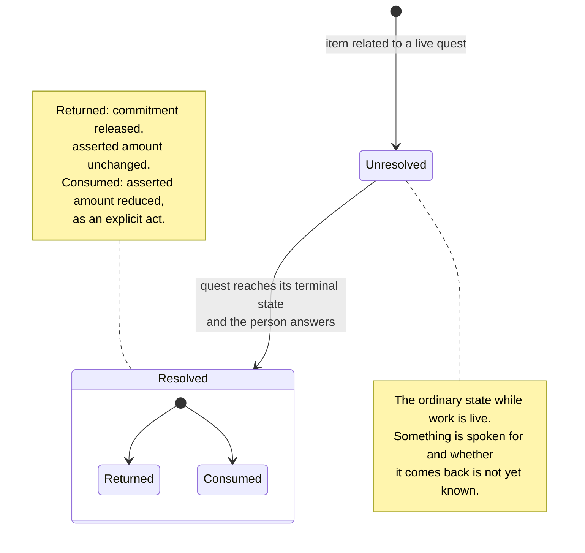
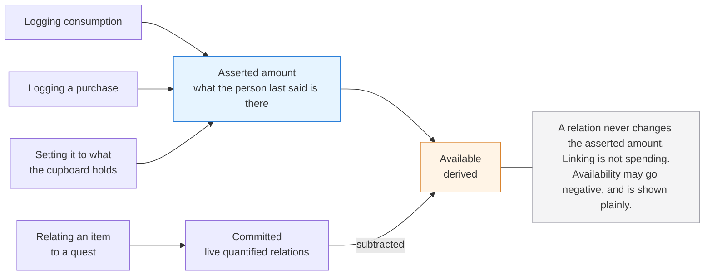

# Altair Tracking PRD

**Status:** Draft
**Date:** 2026-08-05
**Related:** Altair Vision & Scope, Altair Substrate Specification, Altair Relation Types Specification, Altair Guidance PRD, Altair Knowledge PRD, DR-001
**Date amended:** 2026-08-06

---

## What this document is

**The diagrams carry the same weight as the prose.** Each states the same thing as the text around it rather than illustrating a part of it, so either route through this document is complete on its own. A dotted line marks something optional.

Behavioural requirements for the Tracking domain. It inherits everything in the substrate specification and does not restate it. Where the vision document already settles something, this document points at it rather than re-deciding it.

**What it does not cover:** presentation, which the vision document parks by policy, and mechanism.

---

## What Tracking is for

**Not running out of the thing that ruins your week.** The vision document states the purpose in those terms and it is worth keeping literally, because it sets the accuracy bar. The question being answered is do we have any left, and a good answer to that is frequently coarse.

**It is equally household inventory and project inventory.** A drill used across projects, a bag of coffee, a PCB specific to one build, an ESP32 committed and later returned, and a virtual machine are all the same kind of thing here. There is no separate project inventory and no separate household inventory.

This is worth stating because the domain has a gravitational pull toward the pantry. Food is the easiest example to reach for and the least representative of the range, and defaults, examples, and vocabulary should be drawn from across it rather than from the kitchen.

**Partial inventory is permanent and correct.** The vision document places this as the clearest expression of *progress over perfection*. Six tracked things out of four hundred is a working inventory. Nothing counts what is untracked, nothing prompts to complete it, and nothing degrades because most of a household is absent from it.

---

## Items

**An item is one entity, and the person chooses its granularity.**

There is no product-and-stock-entry distinction, no kind-of-thing separate from specific-object. Whether coffee is one item or two is decided by the person who cares about the difference. Someone tracking two bags with different opened dates makes two items. Someone who does not, does not.

This follows from what actually separates Tracking from conventional inventory software. The objection is to information being *required*, not to information being *available*. A serial number, a licence expiry, an opened-on date, and a purchase price are all useful where someone chooses to record them, and none of them may ever be the price of entry.

**Choosing granularity per item is not the same as entering everything twice.** Creating an item from an existing one is permitted and expected. Two rolls of the same filament at different usage levels is the ordinary case, not an awkward one, and nobody should have to retype a name, a unit, and a location to record the second roll.

What copies is description: name, unit, location, category, and the properties recording what the thing is. What does not copy is state: the amount, its last-asserted timestamp, the logs, and the relations. Copying the amount would defeat the reason the second item exists.

The result is an independent item with no link back to the one it came from. Neither item is derived from the other, and there is no stock entry hanging off a product record, because that split is what makes it impossible to answer how much is left without consulting two things.

**Nothing is declared to be a kind of item.** There is no consumable, durable, or virtual designation. Classification questions on the capture path are where partial inventories die.

**The distinction those labels would encode is real, and it is carried by relations rather than by items.** An item is reserved or consumed by something else, and which one it was is a fact about that connection, not about the thing. A drill is only ever reserved, but nothing about the drill says so; it is simply that no relation to it ever resolved to consumption.

This is why the distinction cannot live on the item. The same roll of filament is reserved by a project and partly consumed by it, and a per-item label would have to be wrong about one of those. Two different quests can relate to the same item and mean different things by it.

A relation may also be unresolved, which is the ordinary state while work is live: something is spoken for and whether it comes back is not yet known. Resolution happens when the quest reaches its terminal state and the person answers, which is also what makes the resulting change to the asserted amount an explicit act rather than an inference.

**No required fields.** The substrate fixes this for the capture path. Tracking extends it: no field is required on the deliberate path either. An item with a name and nothing else is a complete item. An item's name is the entity title under this domain's word for it, per the substrate's rule that what a type calls the title may differ, and not a property of its own.

---

## Templates

**A person may name the properties a kind of tracked thing has.** Every spool of filament then records diameter and material by those names, rather than by whatever came to mind that day.

This exists because consistency is exactly what the people this is built for are least able to supply by hand. Leaving them to remember whether it was *diameter* or *width* means they do not get consistency at all. Offering somewhere to say it once is the product doing its job.

**It supports, and does not require.** Nothing prompts for a template, no surface reads an item without one as incomplete, and the product works fully with none ever created. A template that made an item incomplete for lacking a value would put required fields into the one domain whose founding claim is that a partial inventory is permanent and correct.

**Templates reach items and locations, and nothing else.** A tracked thing exists in the world and has properties whether or not Altair records them, so naming them is description rather than invention. A location is included because it is often a thing in its own right: a hosting account holds credentials and a renewal date, which is why it is an entity at all.

**One set, shared between the two.** Remembering which set a template lives in is the recall this product refuses to ask for, and whether a hosting account is tracked as an item or as a location is the person's call. Partitioned sets would make them define the same thing twice.

**An entity follows at most one template**, on the reasoning that gives it at most one category. Two overlapping definitions on one thing is a question nobody can answer cold.

**Following is live, not a copy.** Renaming a property on the template reaches everything following it. If following meant copying names in, drift would return on the second item and nothing would have been gained.

**Values live on the entity, and the template holds none.** A template contributes names, never content. Nothing has to consult two records to know what is on a shelf.

**Detaching is always available and never destructive.** An entity stops following a template and keeps every value it holds, with the names it had at that moment. This is no longer that kind of thing is an ordinary thing to happen.

**A new version of a thing is a new template.** Where a product changes and its old form is still on the shelf, existing entities keep following the template they already follow, and nothing is migrated or rewritten. Editing a template corrects what its properties are called. Changing what it means is a different template.

### Property kinds

**A property may declare what kind of value it holds**, so that a value means one thing regardless of how it was written down. Whether a date was typed day-first or month-first is not something anyone should have to remember about their own records.

- Text is the default, and settles nothing, which is right. A serial number is a serial number.
- Dates, numbers, household members, and yes-or-no are the kinds that remove a real ambiguity.

**A kind is not a constraint.** No lengths, no ranges, no patterns, and nothing required. Those exist to tell a person they have done something wrong, which this product does not do.

**A date property is an ordinary date.** It lands in the same place every other date on an entity does, and the template supplies its label. There is no second kind of date and no second place to look.

**A template does not say whether a date comes forward ahead of time.** That mark is the person's, set when they set the value. Whether a coffee bag going stale is worth being told about is not something a definition can know on behalf of everyone who ever uses it.

**Units stay on the amount.** A number property is a number, and a person wanting millimetres says so in the property name.

### Seeded dates

**A date property may name another date and an offset from it.** Seven days after opening, or one month after purchase, so that nobody has to carry the number in their head.

**It seeds once and lets go.** When the source date is supplied and the target is empty, the value appears. It never recomputes, never changes a value already there, and never reaches an entity retrospectively. Changing the source date afterwards leaves the seeded date exactly where it is.

That boundary is the whole of it. A value produced once and then owned by the person is the same as a client offering to add seven days to a date, which is keystrokes saved toward a result they asked for. A value that stays tied to its source is a formula, and computation of that kind is excluded by the vision document.

**Seeding sets the date, not the mark for bringing it forward.**

> ⚠️ **What this does not solve.** Nothing prevents three filament templates existing, and at that point the mechanism is holding nothing together. The defence is restraint rather than construction: nothing prompts for a template, nothing suggests splitting one, no surface reads an untemplated entity as incomplete, and none of this is anywhere near the capture path. A later feature that quietly encourages growth is the thing that breaks it.

---

## Amount

Two figures, and only one of them is the person's assertion.

**The asserted amount is what the person last said is there.** Nothing changes it except an explicit act: logging consumption, logging a purchase, or setting it to what the cupboard actually holds. It is not computed from history.

The reasoning is about repair rather than accuracy. Logging a consumption and adjusting a count are both easy to skip in the moment, and skipping either one drifts the number the same way, so neither model is protected by being the more rigorous one. What differs is the fix. Setting the number to what you can see is one action requiring no reference to the past. Filing a correcting entry for something you did last Tuesday requires reconstructing it, and a correcting entry that simply declares the new total is an asserted amount wearing a costume.

**A unit is a label, and it means nothing to Altair.** Amounts are counted in something, and what that something is called is free text the person writes.

Nothing compares units across items, because nothing has cause to. An item's amount is expressed in its own unit, the quantity on a *Uses* relation is in that same unit, and no figure anywhere sums or converts between two of them. So two items measured in bottles and bottle are untidy and nothing more, and a shipped set of units would buy tidiness at the price of being wrong for someone within a week.

Offering units already in use while typing is a reasonable client convenience and is not required. It belongs where barcode scanning belongs.

**Precision is per item.** The vision document has this as a positioning claim. An approximate amount is a real answer, not a degraded one. Marking something as low without counting it is a first-class act.

**Availability is derived, and it is the asserted amount minus what is committed.** Live quantified relations commit stock. Three ESP32s with one committed to a quest reads as two available, one committed, and the quest is named.

**A relation never changes the asserted amount.** Linking is not spending. What moves is the derived figure, and it moves back when the relation goes or the quest reaches its terminal state. This is what keeps linking a safe act rather than one to be careful about, and the attribution is what makes it legible: the cause of a decrement is visible next to its effect, so nobody has to hold a rule in their head to predict what their own action will do.

**The two figures encode reversible commitment against irreversible consumption.** The drill comes back. The PCB does not. Neither was declared to be either kind when it was entered.

**Availability may go negative**, when commitments exceed what is on hand, and it is shown plainly rather than prevented. Preventing it would mean refusing to record a link the person just made.

It carries at least two meanings and the system does not choose between them. It can mean buy more. It can equally mean the person intends to use the same thing on a later quest once the current one releases it, which is a plan and not a problem. Only the person knows which, so the figure is reported and never interpreted, and nothing escalates on it.

**An item reports when its amount was last asserted.** A count is only as good as the last time someone looked, and presenting a number from March with full confidence is the system asserting something it does not know.

This must be the amount's own timestamp and not a general modified time. Renaming an item or correcting its notes does not confirm what is on the shelf, and a timestamp that moves when those happen makes a stale count look fresh, which is worse than showing nothing.

---

## Locations and categories

**A location is an entity, not a field on an item.**

A toolbox, a shelf, a VPS, and an account are all places a thing can be. Location does not imply physical space, and the virtual cases are not special.

Entity rather than field is settled by what a location needs to carry. A VPS is a place a virtual machine lives and also a thing with credentials, a renewal date, and notes attached. As a field it could hold none of that, could not be linked to, and could not appear in retrieval as a thing in its own right.

**Nesting exists and is never required.** A shelf inside a cupboard is available to anyone who wants it. An item whose location is a single unnested thing is complete, and so is an item with no location at all.

The restraint is deliberate. A second hierarchy invites tidying, and for these users tidying is a way to spend an afternoon feeling productive without changing anything. Nesting is available. It is not encouraged, nothing suggests deepening it, and no view treats a flat set of locations as unfinished.

**An item has at most one location.** Splitting is what items are for. A toolset in a case is one item if the case is what you track, and each wrench is its own item if that is what you track, and the person picks. Two boxes holding what you think of as one set is the same decision as two rolls of filament.

The case that looks hardest is a fungible stock spread around, meaning twelve rolls of something with four in the hall and eight in the garage. It resolves the same way and mostly resolves by not mattering. Either the split is not worth recording, in which case one item with one nominal location or none is correct, or it is worth recording, in which case they are two items. Tracking which individual units sit where is the accuracy chasing that kills partial inventories, and the question being answered here is whether there are any left.

**Nothing insists the location be right.** A toolset tracked as one thing, with the case in the toolbox and several wrenches carried up to the attic, is in one location as far as Altair is concerned, and that is a normal state rather than an error. Nothing prompts to reconcile it and nothing marks it as suspect.

This is where the single location rule stops being a constraint and starts being the point. The moment someone cares enough about where the wrenches are, they will track wrenches, and they will do it because they want to rather than because the system asked. Partial accuracy is the same first-class condition as partial inventory.

**Categories are a substrate concern**, not a Tracking one. The mechanism is specified there: an entity rather than a label, at most one per item, nesting available and never required, and uncategorised is a complete state.

The set is shared across the domains rather than being Tracking's own, so a category may hold items and notes together. Sorting an inventory by category is unaffected by that and remains the ordinary use.

---

## Logs

**Consumption and purchase records exist for insight, and carry no obligation.**

They no longer keep the count honest, since the asserted amount is not derived from them. What they offer is a pattern: how quickly something goes, what it cost last time, how long the last one lasted.

**Logging is per item and optional.** Nothing accumulates a history by default. Making every consumption two actions would tax the common case to serve the uncommon one.

**Nothing is incomplete for having no log.** An unlogged item is not worse maintained than a logged one, and no surface marks it as lacking.

**Recording a purchase can create the item it refers to.** Requiring the item to exist first makes buying something new a two-step act: create the thing, then say you bought it. A path that only works once you have already done the setup is a path that gets abandoned, and this one would be abandoned at exactly the moment it was most useful, which is when something enters the household for the first time.

So recording a purchase is a capture act and inherits the capture guarantees. It does not require choosing from what already exists, a typed name is enough, and existing items are offered as matches rather than demanded. The item and the record of buying it arrive together.

Duplicates are the accepted cost. Someone will end up with coffee and coffee beans as separate items, and that is the person's business to merge or ignore, in the same way that granularity generally is.

The same reasoning extends to consuming something untracked, and less obviously. Finishing the last of a thing that was never an item creates the item with an amount of none, which sounds pointless until you notice that is precisely the state worth knowing about, and precisely what wants to end up on a shopping list.

**Insight must not become measurement.** A rate of consumption is a fact about the item and is permitted. A figure about how well a person keeps their inventory is a fact about the person, which the vision document excludes outright as productivity scoring of the user. Guidance inherits that exclusion and so does this domain.

Log entries are event records in the substrate's sense: appended, never edited, corrected by appending rather than by rewriting.

---

## Shopping lists

**A list is an entity the person composes, not a view over what is low.**

**An entry may point at a tracked item, and may not.** Much of what goes on a shopping list is needed once and never tracked. An entry that points at nothing is text, and that is a complete entry rather than a degraded one.

The derived alternative was tempting because it stays honest with no effort. It was rejected because it can only ever contain things already tracked, which makes it a report about the inventory rather than something the person writes, and because the case it cannot serve is the common one.

**An entry is a block in the list's content.** The substrate's division of a body into blocks yields one block per list entry, so a list is a sequence of entries with nothing invented for it: entries merge when two people add concurrently, each keeps its identity while the list changes around it and while its own words change, and an entry's text is plain text, title-shaped rather than long form. An entry that points at an item does so by an ordinary relation from the list, anchored at the entry's block, so the link holds while the entry is reworded.

**Composing a list offers existing items as matches**, the way recording a purchase already does: a typed name is enough, matches are offered and never demanded, and an entry left as text is complete.

**An item's own surface offers adding it to a list.** The gesture creates an entry born with its relation, its text the item's title and thereafter ordinary text. Where more than one list exists it asks which, or uses a default the person can trace to an act of their own: one they designated, or their own last choice replayed.

**Crossing an entry off is an act on a surface the person opened**, and what it does is announced there: it may remove the entry, remove the relation behind it, and offer the purchase log, which can create the item at the moment it entered the household. None of that is a side effect; it is what the gesture says it does.

**Filling a list in bulk on request is not the same as deriving one.** A client may offer to add everything currently low, everything low in one location, or any similar set, and doing so is expected rather than grudgingly allowed. Requiring a person to add twenty things one at a time is a reliable way to ensure they add none.

What separates this from the rejected option is who asked and what happens next. The person asked once, and what they get back is ordinary entries they own: editable, removable, and unchanged afterwards when the stock behind them moves. A derived list would keep rewriting itself under them, which the vision document rules out for views generally.

**Nothing adds to a list unasked.**

---

## Relations into Guidance

Tracking is the other end of the *Uses* relation, which is specified in the Altair Relation Types Specification. What is stated there holds here and is not repeated, with two consequences that land on this side.

**A quantified relation carries its number on the relation.** The substrate permits type-defined properties for exactly this case. The quantity belongs to the pairing rather than to the item or the quest.

**Reaching a quest's terminal state asks what happened to committed items.** The prompt belongs to Guidance and is described there. The consequence for Tracking is that this is the moment the reversible and irreversible cases separate, and it is the only moment anything asks.

---

## Relations into Knowledge

Specified in the Knowledge PRD and summarised here. None of it needs a relation type that does not already exist.

**A manual, a receipt, a warranty, and a note on how the espresso machine is descaled** are all ordinary relations to an item. *References* covers display and retrieval, does nothing else, and that is sufficient.

**Notes on a location behave identically**, which is one of the reasons a location is an entity.

**A note that mentions a tracked item does not thereby relate to it.** Surfacing may bring the item into view while the person writes, which the substrate governs. Surfacing shows; it does not form connections on the person's behalf. If the person wants the relation, they make it.

---

## Audience

Inherited from the substrate without modification. Tracking adds nothing.

Worth noting only that a shared item and a private quest are an ordinary combination, and relating them does not change the audience of either.

---

## Deferred

The vision document's Should tier names four things for Tracking. They are named there as features, which is appropriate in a document about scope. Stated as behaviour, two of them turn out to be questions this document defers and two do not survive contact.

**Deferred: what counts as low, and what happens when something is.** A person can say how much of something is enough, and be told when it is not. The threshold is the behavioural part and it is per item, since enough is not a quantity the system can know.

What defers it is that an alert fires on the asserted amount, which may not have been confirmed for months, so it is a statement about the last assertion rather than about the shelf. The design has to say what it does when the number is old, and this document does not.

**Deferred: recording several things in one gesture.** Consuming five things after a build, or logging a shop's worth of purchases, without repeating the same interaction five times. By the vision document's rule that automating what the person could do by hand is not a smart feature, this is closer to expected than to optional. It is deferred for design attention rather than for a decision about whether it belongs.

**Not deferred, because it is already covered: expiry.** An expiry is a date on an item, any entity carries as many dates as it needs, each labelled by the person or by a template, and a date the person marked for bringing forward is eligible for the schedule surface. There is nothing left to design. A licence renewal, a warranty ending, and a carton going off are the same fact wearing different words.

**Not a domain concern at all: barcode scanning.** It is one way a client might fill in a field without typing, and which clients can offer it depends entirely on the hardware in the person's hand. A watch cannot, a phone can, a browser sometimes can.

This document requires only that no capture path depends on it, that anything it fills in can be typed instead, and that an item entered without it is in no way lesser. What a given client does to make capture faster belongs to that client.

---

## Inherited exclusions

Restated only so they are not rediscovered.

- No completeness metric, and no percentage of a household tracked
- No scoring of how well inventory is maintained
- No nagging to confirm counts
- No automatic decrement from any source other than an explicit act
- No required classification of items at capture
- No separate inventory scope per project

---

## Open questions

None outstanding. Questions raised during drafting were either settled in place or found to belong to a client rather than to this domain.
