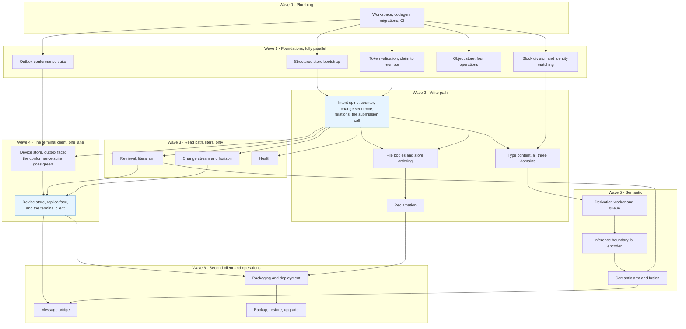

# Altair v0 Implementation Plan

**Status:** Draft, and deliberately uneven in detail.
**Date:** 2026-08-16
**Governed by:** Altair v0 Scope, Component Model, DR-001 through DR-007.
**Built with:** Claude Code + hyperskills.

---

## How to read this

**Early waves are specific. Later waves are vague on purpose.**

Wave 1 through Wave 3 are close enough to reality to plan against. Wave 5 onward will be wrong by the time you get there, so they name outcomes and leave the shape open.

**Revisit at every wave boundary.** Re-run `plan` against the next wave before starting it, using what the previous wave actually taught you. A wave you planned three waves ago is a guess wearing a plan's clothes.

**Nothing here is a file list or a directory layout.** Each item is an outcome with a verification condition. The hyperskills `implement` cadence decides the rest.

**Not every decision is made.** [Deferred decisions](#deferred-decisions-and-their-triggers) names the ones left open on purpose, with the moment each becomes worth taking.

### What is already settled

Named here so no wave reopens it:

- **The wire contract is accepted.** Field numbers are permanent. The gaps the proto records are accepted gaps, not blockers.
- **The schema is applied and exercised** on PostgreSQL 18.6 with pgvector 0.8.6. It is migration one, not something to re-derive.
- **The terminal client is the first client**, and it is the deliberate surface. Every other client comes after the instance and the TUI are settled.

### Mapping to hyperskills

| Situation | Reach for |
|---|---|
| A wave boundary | `plan` for the next wave only |
| A parallel wave with 3+ lanes | `orchestrate`, one worktree per lane |
| Write path, conflict detection, audience | `cross-model-review` before merge |
| An open decision hitting its trigger | `brainstorm`, then `research` if it needs evidence |
| Everything else | `implement` |

---

## The shape of the work

**Two long lanes cross wave boundaries and should not wait:**

- **The terminal client shell** can start against a fake instance from Wave 1 onward. Only wiring it to the real instance needs Wave 3.
- **The outbox conformance suite** needs nothing but the generated contract. DR-006 requires it before the second implementation exists; there is no reason it cannot precede the first.

---

## Wave 0 · Plumbing

**The only work that genuinely blocks everything, and none of it is interesting.**

- Cargo workspace with proto codegen wired into the build. The contract is accepted, so this is generation, not negotiation.
- Migration runner, with `altair-schema.sql` adopted as migration one.
- An integration test harness that stands up a real PostgreSQL, applies migrations, and tears down. **Not a mock.** The audience predicate, both indexes, and `SKIP LOCKED` are all Postgres behaviour.
- CI that runs the above.

**Two schema gaps close cheaply here:** the embedding dimension stays a placeholder in its own late migration (see [deferred decisions](#deferred-decisions-and-their-triggers)), and cycle prevention in nested locations and categories becomes a write-path check rather than a constraint.

> ℹ️ **Neither closed in Wave 0, and neither needed to.** The dimension is a placeholder until Wave 5 chooses the model, which is its trigger, and writing the migration before then would fix a number against nothing. Cycle prevention guards nested locations and nested categories, both of which are type content, so it belongs to 2.2 and is named there. Recorded so that a reader comparing this section against the tree does not go looking for work that was correctly not done.

**Done when:** a fresh checkout runs one command, gets a migrated database, and passes an empty test suite.

---

## Wave 1 · Foundations

**Five lanes. Genuinely independent. One worktree each.**

This is the wave `orchestrate` was built for. None of the five imports another.

### 1.1 Structured store bootstrap

Connection handling, transactions, and the shared query surface the write and read paths both consume.

**The one thing that matters here:** the audience predicate is written **once**, in this layer, and both paths call it. The component model requires the same predicate on both paths. A shared implementation is the cheap way to keep that true; two implementations is how it stops being true in month four.

**Done when:** a test writes an entity and reads it back through both paths, and the predicate appears in exactly one place in the codebase.

### 1.2 Block division and identity matching

A pure function over text, plus the matching step that carries identity forward.

DR-004 put division at the instance so there is exactly one implementation. That makes it the most testable component in the system and the easiest to get subtly wrong.

**What it owes:**

- Deterministic boundaries from text alone.
- Atomic constructs never split: fenced code, tables, diagrams.
- List items split, because concurrent shopping list edits are the named motivating case.
- Identity survives edits to neighbours **and** to a block's own text.
- A long unbroken stretch of prose is one block, and that is correct rather than a bug.

**Done when:** a property test shows the same text always yields the same boundaries, and a mutation suite shows identity surviving rewording, reordering, insertion, and deletion around a block.

### 1.3 Object store

Four operations behind an interface: put, get, delete, enumerate. Filesystem behind it, per DR-003.

**Enumerate is load-bearing, not housekeeping.** Erasure removes the record before the bytes, so the sweep is what closes the erasure window.

**Done when:** the four operations pass their tests and nothing outside the interface reads a path.

### 1.4 Token validation

JWKS fetch and cache, signature verification, claim to membership.

DR-005 is explicit that single-user v0 does not excuse a shortcut. Resolve identity from a validated claim from the first line.

**What it owes:**

- An absent or expired token is a **typed outcome**, not an error and not a page.
- Unauthenticated reaches no query surface.
- Key caching survives the provider being briefly unreachable.

**Done when:** a request with a valid token resolves to a membership, an expired one produces the wait outcome, and a forged one produces nothing.

### 1.5 Outbox conformance suite

The scenarios in `altair-outbox-conformance.md`, made executable.

DR-006's obligation is that these exist before the second implementation. They can exist before the first.

**What it needs:** a controllable fake instance that can accept, refuse, stall, and drop connections, and a way to kill the client process without warning. Not the real instance.

> ⚠️ **Be honest about "written once, run against both."** The scenarios are written once. The harness is implemented twice, in Rust and later in Kotlin. Keep the fake instance's behaviour behind a small, boring interface so the Kotlin mirror is transcription rather than reinterpretation.

**Done when:** every scenario in sections A through G runs and fails, because nothing implements them yet. A red suite is the deliverable.

---

## Wave 2 · Write path

**The correctness core. Small, rarely touched afterward, and the thing everything else assumes works.**

Do not parallelise the spine. Do parallelise what hangs off it.

The schema file already contains this wave's test plan under *"Checks this file cannot make, which the write path owes."* Turn that list into the suite.

**Re-planned at the Wave 1 boundary, 2026-08-17.** Three things were settled before any of this was written, and the scratchpad holds the alternatives so none of them is re-argued:

- **Migration two, taken once at the start of 2.1.** It adds per-part write provenance, without which conflict detection cannot be computed at all: the change sequence carries block identities but no field list and no counter, an intent row carries the counter after a write but not what it wrote, and versions are Knowledge-only and declinable. It also gives a relation a lifecycle, because a removal may name one and the store had nowhere to hold it.
- **2.1 stands up the submission call end to end**, with the other five answering unimplemented. Two of its requirements are observable only at the wire, so neither is testable from an internal function.
- **Relations move out of 2.2 and into 2.1.** Their removal cannot be exercised without their creation, and the owed-checks list already put three relation obligations inside 2.1's done-when while the work itself sat in 2.2.

**That list spans the whole wave, not 2.1 alone**, which the previous draft did not say: it also contains block recomputation and the horizon, and 2.1 owns neither. Each item below now names the lines it closes.

### 2.1 Intent spine

Sequential. This is the load-bearing item in the whole project.

- Migration two: per-part write provenance, and a lifecycle on a relation. Taken once, at the start, because everything below reads one or the other.
- Intent identity, held acknowledgements, idempotent replay. A replayed intent returns the original acknowledgement rather than producing a second effect, and the intent row is written in the transaction it acknowledges.
- **One transaction per intent.** A bulk capture is explicitly not one unit, so this is forced rather than chosen, and it is worth stating because the reflex is to batch.
- Write counter, conditional application, conflict detection over fields. **A stale base is never a rejection.** Reject-and-retry is the familiar pattern here and it is wrong.
- Both values retained on a same-part conflict, with the part named once and the same way on the wire, in the store, and in the conflict row. Something has to hold that mapping and the schema records that it can drift.
- Change sequence entry, allocated from the single position row, in the same transaction as the write. Writes serialise on that row; that is intended.
- Audience enforced on the shared predicate, and every member named in an audience answering to a real membership, which a foreign key cannot reach inside an array.
- Position assigned by the instance, appended on entry to a container. Appending only; explicit reordering is not needed until something reorders.
- Relations: create, remove, erase, restore, with canonical ordering for symmetric and untyped ones, duplicate refusal, and a property permitted only where its type declares it. **Relation types are declarations the system interprets, never hardcoded branches.** That is a build constraint from the relation types spec, cheap now and a rewrite later.
- Lifecycle: removal grouped as one act, erasure stripping to a tombstone, restoration reaching the group. **Erasure removes every dependent row explicitly**, because the schema's cascades hang off a delete of the entity row and erasure does not perform one.
- Batch submission returns a result per item. Never all or nothing.
- Refusal on audience and refusal on nonexistence are indistinguishable from outside, which DR-004 extends to the status code: a submission whose every intent is refused still answers success.
- The submission call, served. The other five answer unimplemented, and a test says that is deliberate.

**Done when:** `cross-model-review` passes on the diff, and the suite covers the owed-checks list except the four lines this item does not own — block recomputation and identity matching, the graduation half of bulk state, ladder position, and the horizon.

### 2.2 Type content, all three domains

Depends on 2.1 and on block division.

**The content each type holds beyond the shared model**, across campaigns, arcs, quests, notes, files, items, locations, categories, shopping lists. The five verbs are 2.1's and apply to every type already; what lands here is what each type is made of. 2.1 creates each type's row with defaults so nothing is ever half-formed, and refuses the three types the schema has no table for.

- Bodies: divide, match against held blocks, write only what changed. Conflict detection reaches blocks here, on the provenance 2.1 laid down.
- Anchors, and the relation properties a type declares. Both need a body or the type table, which is why they stayed behind when the rest of relations moved into 2.1.
- Cycle prevention in nested locations and nested categories, as a write-path check rather than a constraint. Carried from Wave 0, where it was named and correctly not taken.
- Ladder position, which is the container the shared model does not cover.
- Bulk state graduation, which needs authored body content to graduate on.

This lane can subdivide by domain once the shared entity write is in place. Guidance, Knowledge, and Tracking touch different side tables.

**Done when:** every entity type round-trips, every state transition in the Guidance PRD holds, an erased entity's edit produces a recreation rather than a create, and the four owed-checks lines 2.1 left are closed.

### 2.3 File bodies

Parallel with 2.2. Depends on 2.1 and the object store.

**Until this lands, 2.1 refuses a file create**, because the schema requires a file to name a body and there is no way to have uploaded one. That is the honest answer rather than an omission, and it is the only type refused for a reason that expires.

- `PutBody` streaming, idempotent on body identity.
- **Bytes before the record, always.** An orphan is sweepable; a record pointing at nothing is a broken entity.
- `GetBody` streaming.

**Done when:** a kill between the two writes leaves collectable garbage and never a broken entity, demonstrated by a test that kills between them.

### 2.4 Reclamation

Small, and hangs directly off erasure rather than waiting for a later wave.

- Erased bytes removed on a pass.
- Unreferenced bytes swept via enumerate.
- Change sequence trimmed below the horizon.
- The holding window expiring, which now reaches relations as well as entities, since a removed relation holds on the same terms.

**This is where the retention windows and the horizon are chosen**, which is the one deferred decision whose trigger falls inside this wave. Ship constants: the operator plane is not in v0, and the horizon is either null or longer than every other window, so a constant cannot drift into the middle. That last part is the owed-checks line 2.1 deliberately left.

**It writes no change entries and does not use the write path.** Everything it removes is already gone by predicate.

**Done when:** an erasure followed by a pass leaves no bytes, a pass over a healthy store changes no answer to any query, and a test refuses a horizon set between two other retention windows.

> ⚠️ **This did not land, and Wave 3 proceeded without it.** The tree goes 2.1, 2.2, 2.3, Wave 3; there is no retention constant and no horizon value anywhere in the instance, and `Changes` derives its horizon implicitly from the earliest surviving change row. Two consequences, and the second is the one that matters. Nothing expires out of the deleted holding state, so a surface drawing an expiry date is drawing a promise the instance does not keep. And because nothing trims the change sequence, `Changes(since=0)` still replays the whole history — which is the only reason a client can rebuild at all. **Whoever picks this up owes clients a rebuild path before the first row is trimmed**, since trimming without one turns every client's rebuild into `PositionUnanswerable` with nowhere to go. That is a stronger obligation than this item was written with.

---

## Wave 3 · Read path, literal only

**Semantic is Wave 5. This wave makes the instance answerable.**

Three lanes, parallel with each other.

### 3.1 Retrieval, literal arm

- Full text search plus trigram, both over the same maintained search text.
- The audience predicate **inside** the candidate query. Never a filter over results.
- Deterministic order with a stable tiebreak.
- Scoping to a container, a domain, or a type.
- Results carry enough to be accounted for.
- `AnswerState` reports honestly: semantic unavailable, derivation outstanding.

**Done when:** the same query over the same data produces byte-identical ordering across a hundred runs, and a just-captured entity is findable by its words immediately.

### 3.2 Change stream and horizon

**Build the instance half. The TUI need not consume it in v0.**

The architecture explicitly permits a client that always fetches current state and never uses the change stream, and calls it conforming. Omitting the instance side is one-way; omitting the client side is not.

> ℹ️ **The instance half was right and the sentence about the client was wrong.** "Always fetches current state" names no call, and the served interface has none. `Query` is the literal arm, whose predicate matches nothing when the text is empty, so it cannot enumerate; its `Result` carries an entity and never a relation, so backlinks, `uses` commitments and the ladder graph are unreachable through it. `Changes` is the only surface that yields a relation at all, which makes it the only source of client state, and a rebuild from nothing **is** `Changes(since=0)`. The conforming client that never touches the change stream is not currently constructible, and Wave 4 is where that is discovered. Recorded rather than deleted, because the reasoning was sound against the architecture and wrong against the wire, and that gap is worth being able to see.

- Per-member change set assembly, filtered at the source rather than late.
- Position past the horizon returns `PositionUnanswerable`, which is an outcome and not an error.
- The horizon is null, or longer than every other retention window. **A middle value is a bug**, not a tuning choice.

**Done when:** a client polling from position zero receives every change in commit order, and a position below the horizon produces the rebuild signal.

### 3.3 Health

Object store reachability, model presence, outstanding derivation, refused intents, storage headroom.

Outstanding derivation is computed from provenance in the store, never from the queue. Losing the queue must not lose reportability.

**Done when:** health answers with the derivation worker absent entirely.

---

## Wave 4 · The terminal client

**Where the project becomes something you use rather than something you test.**

**Re-planned at the Wave 3 boundary, 2026-08-19.** Two things were settled before any of this was written, and both came out of reading the served interface rather than the documents:

- **The terminal client is a replica client, and this is not a choice.** The instance offers no way to read an entity by identity and no way to list what a container holds. `Query` is the literal arm and cannot enumerate; it answers with entities and never with relations. Every screen that is not search — the ladder, the tracking tree, a detail with its derived backlinks — is assembled on the device from what `Changes` delivered. §3.2 carries the correction.
- **4.1 and 4.2 are one lane, because they are one store.** They were planned as separable and are not. The outbox owes durable local acceptance and has to answer what the person captured while the instance is unreachable; the replica owes the same store the instance's version of the same entities. Two stores would put "what do I show" in neither of them.

### 4.1 The device store, outbox face

The conformance suite from 1.5 goes green.

Durable, ordered per entity, idempotent, non-blocking, silent while waiting and never silent while failing. The suite defines it; do not add behaviour it does not require.

**This face lands first, before anything is drawn.** Thirty-five scenarios turning green one at a time is the deliverable Wave 1.5 was built to produce, and it is only legible if nothing else is moving at the same time.

**Done when:** every scenario in sections A through G passes.

### 4.2 The device store, replica face, and the terminal client

ratatui over crossterm, so Linux and Windows are both served. The deliberate surface: where bodies are written and where the work that is not capture happens.

**It carries the whole editing surface**, because there is no second client to fall back to and no browser. Everything the instance can do is reachable here or is not reachable at all in v0.

The replica half: seeded by `Changes(since=0)`, kept current by polling, and holding pending local writes in the same store as the instance's truth.

**The invariant this wave exists to keep:** what the person sees is instance truth overlaid with pending local writes, and a pending write never becomes invisible because the instance is unreachable. Its other half is already a standing constraint — no surface ever *counts* what is pending. The suite permits exactly one number anywhere in the client, and it is how many the instance refused.

Scope:

- **Capture**, on the fast path, never stopping to ask.
- **Ladder work**: campaigns, arcs, quests, states, moving between them.
- **Body composition**, handed to the person's own editor rather than written here.
- **Relations**, typed and untyped, including the create-from-reference gesture where nothing matches.
- **Tracking**: items, locations, asserting amounts, "just mark it lower."
- **Retrieval**, across all three domains in one pass, with the answer's state visible.
- **Fault signalling and silence.** Depth is never shown. A refusal is.
- **Token flow.** Device flow unless something argues otherwise.

**A body is written in `$EDITOR`; the fast path never leaves the client.** The client suspends, the child inherits the terminal, and the text that comes back is submitted whole. A single line is never worth that, so capture, a field, a search and the word typed to confirm an erasure all stay here — capture that stops to ask is not on the fast path. Resolution is `$ALTAIR_EDITOR`, then `$VISUAL`, then `$EDITOR`, then whatever `nvim` is on the path; having none of them is a **fault** rather than a wait, because no amount of waiting produces an editor.

**This costs less than it appears, because the relation gesture was never inside the editor.** The wire says a body is plain text with no relation markers in it, and that a client never divides one, so a block identity does not exist until the instance has divided and answered. An anchor names a block. Forming a relation from a selection was therefore always a gesture over blocks that came back, whoever wrote the text — the editor holds prose, and what Altair relates against is the division. What is genuinely given up is the promise that the buffer is kept as the person types: the client owns the file the editor writes into, so what survives a crash is that file, recovered on the next launch, and the help surface says that rather than the older, now untrue thing.

**What the surface does not reach in v0**, decided against the mock-ups rather than discovered while building them. Each is refused for a reason that expires, in the same way 2.1 refused a file create:

- **Versions.** Deferred in v0, so nothing writes a version row and there is nothing for a restore to put back. The screen is a view over an empty table.
- **The holding window's expiry.** A deleted thing shows that it is deleted and not when it stops being so, because [2.4](#24-reclamation) did not land and nothing expires.
- **A conflict, reached for real.** Both retained sides render, driven by a fixture. Reaching one needs a second writer, which arrives with the bridge at 6.1.
- **Templates as a gesture**, and creating one thing from the shape of another. The tables exist; the plan already defers the gestures.

**Nothing about this client may become the definition of a client.** DR-006's obligation: a second client arriving must not discover that the first one's habits were load-bearing.

**The visual language is settled and lives outside this repository**, in a Claude Design project holding the screens in both themes. It is deliberately not a terminal convention: no box-drawing frames, no tree glyphs, no gutter, no modal block. Two things in it do not survive contact with a terminal and are the client's to fix rather than the design's. Its state family, its arrows and its hairline indent are all East-Asian-Width *ambiguous*, so terminals disagree about how many cells each occupies and columns drift on somebody else's; the mark, the disclosure triangles and the return and delete keycaps are neutral and safe. And one screen binds a key that does not exist off a Mac.

**Done when:** you capture into it daily and stop reaching for Lattice.

---

## Wave 5 · Semantic

**Last, per the v0 scope, and for a reason: the corpus has to exist first.**

### 5.1 Derivation worker

Queue as a table, claimed with `SELECT ... FOR UPDATE SKIP LOCKED`, notified from the write path.

The queue is an **optimisation over** computing outstanding work from provenance. Losing it must cost time and nothing else.

Never gates acceptance. Never overwrites a person's edit to derived content.

### 5.2 Inference boundary and the bi-encoder

**The embedding model gets chosen here, not before.** Choosing it fixes the dimension in the schema, and doing that against a projection rather than a measurement is the mistake DR-002 warns about.

Build the boundary as callable, stateless, and absent-tolerant from the first line. Retrofitting optionality is the expensive direction.

### 5.3 Semantic arm and fusion

- Similarity search with the audience predicate inside the query.
- Rank-based fusion over the two arms. An entity matching both is one result, ranked stronger.
- The three-tier filter strategy from DR-002's accepted gaps, though single-user v0 does not reach the regime where it bites.

**Done when:** you find a note whose words you no longer remember, and the answer says whether the semantic arm answered.

---

## Wave 6 · Second client and operations

Deliberately thin. Revisit before starting.

### 6.1 Message bridge

The second client, and the first test of whether the interface carries the obligations rather than the TUI's code carrying them.

Small: capture-only, reusing the Rust outbox. Three obligations, and they are behaviour rather than configuration:

- Accepts only from the person it captures for.
- Tracks its own position and treats a gap as a fault. Transport acknowledgement means the transport delivered, not that the instance holds it.
- Answers no queries.

> ℹ️ **Consequence of this ordering, stated once.** Capture away from a desk arrives at Wave 6 rather than Wave 4, so everything between [first useful day](#first-useful-day) and here is desk-only. That is the cost of settling the instance and the TUI before a second client exists, and it is bounded by how long Wave 5 takes.

### 6.2 Operations

- Packaging that makes process count a deployment decision rather than an architectural one.
- Backup covering both stores. Derived data excluded, with the rebuild cost stated rather than discovered.
- Upgrade after a long absence treated as the ordinary case.

---

## Milestones

**Two, and the first matters more than the second.**

### First useful day

**End of Wave 4.**

Capture works from the terminal. Literal search crosses all three domains. Relations form. Nothing is lost.

The v0 scope's first stated purpose is that it supports its author daily. That arrives here, not at v0 complete. **Sequence toward this aggressively.** Everything after it is improvement to a working system rather than construction of a missing one.

### v0 complete

Wave 6 done. Semantic retrieval answers, phone capture lands through the bridge, and the corpus that retrieval tuning needs is accumulating under real use.

---

## Deferred decisions and their triggers

**Taken at the moment they become cheap to take correctly.**

| Decision | Trigger |
|---|---|
| Embedding model and dimension | Start of Wave 5. Keep it in its own migration so re-embedding is a migration and not a rewrite. |
| Bridge transport | Start of 6.1. Whatever you already message yourself on wins. |
| Retention windows and the horizon value | Wave 2.4. Ship constants; the operator plane is not in v0. |
| Templates in v0 | The schema included them on the reading that anything not named as deferred is in force. Create the tables, defer the gestures. Cheap either way. |
| The proto's accepted gaps: relation write counters, positions on nested containers, phrase anchor location | When each becomes load-bearing. Field numbers are permanent, so closing one adds a field rather than editing one. That is the cost of having accepted them, and it is small. |
| Version boundary heuristic | Not in v0. Versions are deferred. |
| Recurrence name, schedule surface name, state name inflections | Never blocking. Use the current words; they are labels over declarations. |
| Intent row trimming, tombstone trimming | When either table's size becomes observable. Both are recorded gaps, neither is urgent. |
| Internal surrogate key on `entity` | When insert cost starts tracking table size rather than staying flat. DR-002 records the condition; do not take it early. |
| Desktop toolkit | After the instance and the TUI are settled, which is what DR-006 already says. |

---

## Standing constraints

**The ones easiest to violate in week one and most expensive to repair after.**

- [ ] **The audience predicate lives inside the query that produces candidates.** Never a filter afterwards, on any path, including similarity.
- [ ] **One predicate implementation, called by both paths.**
- [ ] **Nothing crosses from the read path to the write path.** The read path writes nothing at all, including no record of what was asked.
- [ ] **A stale base counter is never a rejection.**
- [ ] **Acceptance is shown only after local durability**, and credentials and connectivity have no bearing on it.
- [ ] **Bytes before the record on creation. Record before the bytes on erasure.**
- [ ] **Relation types are declarations the system interprets**, not branches.
- [ ] **Derived data is never canonical**, and a person's edit to it outranks recomputation.
- [ ] **Nothing may foreclose export**, carried forward from DR-001 unchanged.
- [ ] **Field numbers are permanent.** Removed fields are reserved, never reused.
- [ ] **Waiting is silent. Faults signal.** An unreachable instance and an expired session are the same wait.
- [ ] **No counter that rises while the person is away.** Queue depth is never reported.
- [ ] **No TUI habit becomes load-bearing.** What crosses the boundary is the component model's list, not what the first client happened to need.

---

## Where I would push back

**Three things, offered because agreement is not useful here.**

### The v0 scope is large for one unpaid person

Instance, terminal client, bridge, and semantic retrieval, against a specification this detailed, is a lot. DR-006 names the dominant risk correctly: the project not being finished.

**The mitigation is the [first useful day](#first-useful-day) milestone, not scope cuts.** Nothing in v0 is obviously droppable — the cross-domain claim is the product, and semantic retrieval carries the organising load that tags and folders do not. What is available is ordering: get to daily use as early as Wave 4 allows, then finish Waves 5 and 6 against a system you are already using.

### The conformance suite's "one suite, two implementations" is aspirational

The scenarios are written once. The harness is not. Expect the Kotlin implementation to disagree with the Rust one on something the prose left ambiguous, and expect the fix to be an amendment to the scenarios.

**This is fine, and it is why the suite exists.** It just is not free, and planning it as free is how it gets skipped.

### The change sequence serialises every write on one row

The schema chose this deliberately, and the reasoning is correct: a sequence leaves gaps, and a poller can read past an uncommitted position and never see it.

**Record why, prominently, near the code.** This is exactly the shape of decision a future reader — including you — will identify as an obvious bottleneck and remove, reintroducing a silent correctness failure that surfaces months later as a client believing it is current when it is not.

---

## After v0

**Deliberately thin. These become plans when they become next.**

- **Android in Kotlin.** Closes the lookup gap. The conformance suite is the gate.
- **Surfacing.** The proactive behaviour. Retrieval underneath it already exists by then.
- **Text extraction from files**, narrowing what the derivation worker does rather than whether it is there.
- **Cross-encoder rerank.** An independently absent model, not a required stage.
- **The household.** Audience stops being constant, the change stream's per-member assembly stops being trivial, conflicts become reachable, and member management gets designed for the first time.
- **Routines, focus sessions, check-ins.** Routines need the schedule expression settled; the other two need sustained use before design.
- **Operator plane.** When there is configuration worth separating.
- **Export and the interchange format.** When there is a user who is not the person running the instance.

---

## Revisit rule

**Re-plan the next wave at each boundary, and only the next wave.**

At every boundary ask three things:

1. What did this wave teach that the next wave's plan does not know?
2. Which deferred decision just hit its trigger?
3. Has the shape drifted from what the component model says it should be?

The third is the hyperskills shape checkpoint, and it is the one that catches sprawl that green tests do not.
