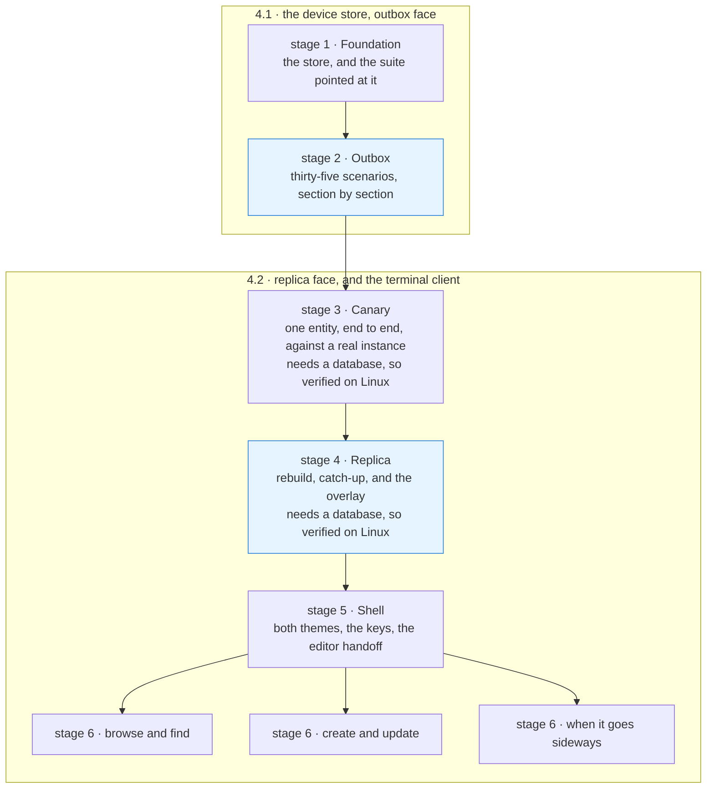

# Altair Wave 4 Plan · The Terminal Client

**Status:** Accepted for build. Sequencing and verification only.
**Date:** 2026-08-19
**Governed by:** Altair v0 Implementation Plan, Component Model, DR-004 through DR-007.
**Related:** `conformance/scenarios.md`, `proto/altair/v1/altair.proto`, `crates/altair-conformance/README.md`

---

## What this document is

**The next wave, planned at its own boundary, and nothing beyond it.** It decides what
Wave 4 builds, in what order, and how each piece is known to work. It records the three
decisions that had to be taken before any of it could be sequenced, with the
alternatives, so none of them is re-argued.

**It decides no module tree.** The implementation plan prescribes no file list and no
directory layout, and this document does not smuggle one in. Every item below is an
outcome with a verification condition; where a path appears it is a file that already
exists. What the crate is called and how it divides is decided while implementing.

**It amends nothing above it.** Where this document and the implementation plan
disagree, the implementation plan is right and this one gets corrected.

---

## What Wave 3 taught that the plan did not know

Three findings, all from reading the served interface rather than the documents.

**The terminal client is a replica client, and this was never a choice.** The instance
offers no way to read an entity by identity and no way to list what a container holds.
`Query` is the literal arm: its predicate matches nothing when the text is empty, so it
cannot enumerate, and its `Result` carries an entity and never a relation. Every screen
that is not search — the ladder, the tracking tree, a detail with its derived backlinks
— is assembled on the device from what `Changes` delivered. A rebuild from nothing
**is** `Changes(since=0)`.

**Wave 2.4 was skipped, and that is currently load-bearing.** Nothing trims the change
sequence, so position zero is always answerable. A client can rebuild today because a
wave did not happen. That is worth knowing before somebody closes the gap.

**4.1 and 4.2 are one lane, because they are one store.** The outbox owes durable local
acceptance and has to answer what the person captured while the instance is unreachable.
The replica owes the same store the instance's version of the same entities. Two stores
would put "what do I show" in neither of them.

---

## The shape of the work

**Six stages, not six waves.** The implementation plan names two items in this wave,
4.1 and 4.2, and both keep their meaning: **4.1 is finished at the end of stage 2**,
which is the moment the conformance suite goes green, and 4.2 is everything after it.
The numbering matters beyond this document — a CI job, a task description and the
conformance crate's own prose all say "Wave 4.1" and mean the outbox.

**Stages 1 to 5 are sequential and that is forced rather than chosen**, because they are
successive layers of one store and one seam. Only the screens genuinely parallelise:
three groups touching different screens over a shell that is already settled.

**Every stage but the middle two runs on both platforms.** The canary and the replica are
integration against a real instance and therefore against a database; everything else —
the store, the outbox against its fake instance, the shell and the screens — needs
neither, and is verified on Linux and Windows from the first commit.

---

## Decisions taken here

### The store holds encoded entities, not columns mirroring the wire

**An entity is kept as its encoded `Entity` message, keyed by identity, with small index
tables beside it for the orders the screens navigate by.** The client does not shred the
wire into a local schema.

This is the decision that removes the most work. A client schema mirroring `Entity`
would have to change every time the contract grows a field, which the contract is
explicitly designed to do — field numbers are permanent and closing a recorded gap adds
a field. Holding the message whole means the proto can grow without a client migration,
a rebuild is a truncate and a replay rather than a reconciliation, and nothing about the
storage forecloses export, which DR-001 requires of everything.

**Reversible.** The index tables are derived from the messages and can be rebuilt or
re-shaped without touching what is stored.

### The device store is SQLite, through `rusqlite`

**The deciding argument is not SQL.** Sections B and F of the conformance scenarios kill
the client process without warning and then assert what survived. The durability
primitive under that must not be new code.

Everything else follows rather than leads: the captures list, the ladder, the tracking
tree and the deleted list all want ordered scans, which come free; it is one file to
back up; and the bundled build removes a system dependency on Windows.

> **Rejected: `redb`.** A pure-Rust build is genuinely nicer, and on a project that must
> compile cleanly on two platforms that counts for something. It loses on the two things
> that matter more — every index and every ordering becomes hand-rolled, and surviving
> `SIGKILL` becomes our own correctness problem rather than a property we inherit.

**Reversible**, behind the store's own boundary, and the encoded-entity decision above is
what keeps it so.

### The conformance adapter is a mode of the real client, not a lookalike

**The adapter is a hidden mode of the client's own binary.** The suite drives it over one
newline-delimited JSON channel, as `crates/altair-conformance/README.md` describes, and
Wave 4 flips one function in `crates/altair-conformance/tests/scenarios.rs` to point at
it.

A separate adapter binary would be a second implementation of local acceptance, and the
suite would then be judging something shaped like the client rather than the client. The
scenarios observe two boundaries only, so a mode that speaks the channel and otherwise
uses exactly the same store is the honest arrangement.

> **Rejected: a second fake instance.** `altair_conformance::instance::FakeInstance` is
> already public, already accepts, refuses, stalls and drops connections, and already
> records what arrived. The outbox develops against it. It answers `Submit` and
> `PutBody` and leaves the rest unimplemented.
>
> **The replica therefore develops against a real instance**, which is better: it makes
> the canary a genuine end-to-end proof rather than a proof about a mock.

### Windows is tested from the first commit, and the instance is not tested at all

**The client's tests take no database, and CI runs them on both platforms from stage 1.**
Not as a late verification pass: the Windows-specific surface is almost entirely in the
first two stages. The bundled SQLite build is a toolchain question that fails first; an
unwarned kill is `TerminateProcess` rather than a signal, and section B is entirely about
surviving one; the adapter's newline-delimited channel is where a carriage return breaks
something quietly rather than loudly; and the harness hands the client a durable
directory and an ephemeral one, which are names for concepts Windows does not have.
Finding all four at the end of the wave means finding two of them as flakiness.

**The split falls along the stages.** Foundation, outbox, shell and screens need no
database — the outbox develops against the conformance crate's fake instance — so they
run on both platforms. The canary and the replica are integration against a real
instance and stay Linux-only. **The most valuable Windows job in this plan is the
conformance suite**, because it is the one that proves durable local acceptance under a
kill, on the platform where a kill is least like the one it was written against.

**One scenario needs a Windows path.** The harness is already portable — `kill` is the
standard library's, every dependency is cross-platform, and the single `#[cfg(unix)]`
behaviour is making the state directory unwritable, which A4 alone uses. On Windows that
is an access control entry rather than a mode bit. Thirty-four scenarios need nothing.

> **The instance stays Linux-only, deliberately.** `altaird` is a self-hosted server,
> DR-002 pins PostgreSQL, and the deployment story has never been anything else. Recorded
> here so that three Linux jobs are read as a decision rather than as an oversight
> somebody later corrects.

**Reversible**, and cheap in this direction only. Adding a platform once the code assumes
one is the expensive direction, which is the whole argument for taking it at stage 1.

### Two glyph sets, and no layout that depends on a glyph's width

**The design's glyphs are the default, a narrow-safe set sits behind configuration, and
nothing is aligned by measuring a glyph.** Each renders into a padded cell of fixed
width.

The locked design's state family, its arrows and its hairline indent are all
East-Asian-Width *ambiguous*: terminals disagree about whether each occupies one cell or
two, and where they disagree, columns drift. The mark, the disclosure triangles and the
return and delete keycaps are neutral and safe.

> **Rejected: substituting globally**, which damages a settled design over a hazard most
> terminals do not have. **Rejected: measuring at startup**, because terminals answer
> that question unreliably and a wrong answer is worse than a fixed cell.

One separate correction, which is a bug rather than a decision: the deliberate-create
screen binds a key that does not exist off a Mac.

---

## The stages

### Stage 1 · Foundation — part of 4.1

- The workspace crate, depending on the generated contract and not on the instance.
- The device store: open, durable write, read back, holding entities as encoded messages
  with index tables beside them.
- The adapter mode, speaking the channel the harness expects.
- `client_under_test()` repointed away from the null stub.

- The test split: the client's own tests take no database, and CI runs them on Linux
  and Windows. A4's unwritable-storage step gains a Windows path or an explicit skip.

**Done when:** the workspace lints clean under the repository's own clippy gate;
`mise run conformance` still reports red — now against the real client rather than
against a stub that implements nothing; and both platforms report that red identically.

### Stage 2 · Outbox — completes 4.1

Sequential, and the longest stretch in this wave without something to look at. Taken
section by section, in the scenarios' own order: acceptance, durability under an
unwarned kill, ordering per entity, idempotent replay, non-blocking, silence and
signalling, and the outcomes the instance returns.

**Silence and signalling is the hard one** — nine scenarios, and almost all of them
assert that the client is showing the person nothing at all.

**Done when:** every scenario in sections A through G passes **on both platforms**, and
the ledger says so on each.
**Nothing here may make a scenario pass without an outbox behind it**; that is the one
way to destroy a deliverable Wave 1.5 spent itself producing.

### Stage 3 · Canary — opens 4.2

**One entity, the whole way through, before anything is generalised.** Captured in the
client, held locally, replayed to a real instance, returned through `Changes`, landed in
the replica, and drawn on the captures list.

**Done when:** with the instance stopped, a capture is accepted and shown; the instance
is started; the row arrives without the person asking.

### Stage 4 · Replica

- Rebuild from `Changes(since=0)`, and incremental catch-up from a held position.
- The overlay: instance truth with pending local writes over it.
- `ConflictRetained` resolving back into the overlay, with both sides kept.
- The projections the screens navigate by — the captures order, the ladder, the location
  tree, relations read from both ends.

**Done when:** a rebuild and an incremental catch-up over the same history produce the
same state, shown by a property test; and a pending write stays visible across an
instance that cannot be reached.

### Stage 5 · Shell

- Both themes as a token swap over one set of markup.
- The glyph table, the keycaps, the modal pill, the section rules.
- The help surface, which is the only place the client's promises are written in the
  person's own words and should be checked against the substrate the way an assembled
  document is.
- The editor handoff, and recovering the file after a crash mid-composition.
- Token flow.

**Done when:** each element has a snapshot in both themes, and an editor round trip
returns what was written on both platforms — including the case where the configured
editor is not installed, which is a fault and not a wait.

### Stage 6 · Screens

Three groups, genuinely parallel, over a shell that is already settled: browse and find;
create and update; when it goes sideways.

**Done when:** every screen has a snapshot in both themes and the whole tree passes
`prek run --all-files`.

---

## Pinned invariants

**Written down because these are what a long build erodes**, not because they are new.
Re-read them at each stage boundary.

- The audience predicate never moves to the client. A client narrows what it already
  holds and can never widen it.
- Acceptance is local and durable before it is shown. Credentials and connectivity do
  not participate.
- **Exactly one number exists anywhere in this client**, and it is how many the instance
  refused. No queue depth, no badge, no counter that rises while the person is away.
- A stale base counter is never a rejection.
- Bytes before the record on creation.
- The client never divides a body, and a body carries no relation markers. Both are the
  wire's words.
- Waiting is silent and faults signal. An unreachable instance and an expired session
  are the same wait, and neither is ever a login page.
- No habit of this client becomes the definition of a client.

---

## Non-goals

**The fence. Downstream checks measure correctness, not sprawl.**

- Versions, and the holding window's expiry.
- A conflict reached for real, as opposed to rendered from a fixture.
- Template gestures, and creating one thing from the shape of another.
- Semantic retrieval, the derivation worker, and the inference boundary.
- Reclamation, retention windows, and choosing the horizon's value.
- A second client, packaging, backup and restore.
- **Any change to the instance at all.** Wave 4 adds no call, no field and no migration.

---

## Deliberately not decided

- **What the crate is called and how it divides.** Decided while implementing, as every
  wave before this one was.
- **How much history the client keeps once it has caught up.** Nothing forces an answer
  until something trims, and nothing trims.
- **Whether incremental catch-up is worth its complexity on this device.** The
  architecture says a client may always rebuild, so this is an optimisation with a
  measurement behind it rather than a design question.

---

## Open questions

- **Whether `writing` stays one modal state.** The design drew it as one when one editor
  was assumed. It now covers a field edited in the client and a body edited elsewhere,
  and the second has no modal state at all because the client is not on screen.
- **What the help surface says about a buffer it no longer holds.** The promise that the
  buffer is kept as the person types belonged to an in-client editor. What is true now is
  that the client owns the file the editor writes into.
