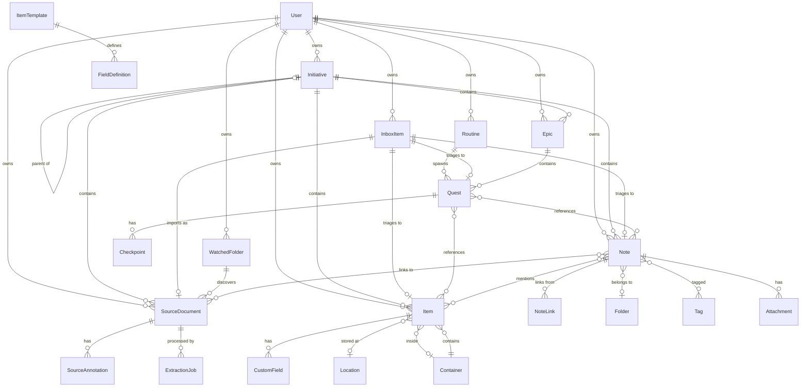

# Domain Model

## Purpose

This document defines Altair's core entities, their relationships, and the business rules that
govern them. It serves as the canonical reference for what data exists and how it behaves across
system-level features and all three modules.

---

## Entity Map



---

## System-Level Entities

### User

An authenticated person using Altair. All user data is isolated per-user.

| Field         | Type       | Constraints                                |
| ------------- | ---------- | ------------------------------------------ |
| id            | identifier | unique                                     |
| username      | text       | required, unique, max 50 chars             |
| email         | text       | optional, unique if present                |
| password_hash | text       | required, Argon2 hashed                    |
| role          | enum       | `admin`, `member`                          |
| status        | enum       | `active`, `disabled`, `deleted`            |
| storage_used  | integer    | bytes, calculated from attachments         |
| storage_quota | integer    | bytes, optional limit (null = unlimited)   |
| created_at    | datetime   | immutable                                  |
| last_login_at | datetime   | updated on successful login                |

**Business Rules:**

- First user to register becomes admin (or set via environment variable)
- Admin users can manage other users but cannot view their content
- Multiple admins allowed (no single point of control)
- Disabled users can log in with limited session to export data
- Deleted users enter 30-day soft delete before permanent purge
- All user-owned entities include `user_id` for data isolation

---

### Initiative

A cross-cutting organizational unit that groups related Quests, Notes, and Items across all three
modules. Initiatives represent "something you're working toward" without heavyweight project management.

| Field        | Type       | Constraints                                    |
| ------------ | ---------- | ---------------------------------------------- |
| id           | identifier | unique                                         |
| user_id      | reference  | required, links to User                        |
| name         | text       | required, max 200 chars                        |
| description  | text       | optional                                       |
| parent_id    | reference  | optional, links to parent Initiative           |
| ongoing      | boolean    | default false; true = area, false = project    |
| target_date  | date       | optional, ignored if ongoing=true              |
| status       | enum       | `active`, `paused`, `completed`, `archived`    |
| focused      | boolean    | default false; only one can be focused per user|
| created_at   | datetime   | immutable                                      |
| updated_at   | datetime   | auto-updated                                   |

**Business Rules:**

- Initiatives are optional—users can use Altair without creating any
- Areas (ongoing=true) can contain projects or other areas
- Projects (ongoing=false) can contain sub-projects but not areas
- Maximum nesting depth: 3 levels (Area → Project → Sub-project)
- Only one Initiative can be "focused" at a time per user
- Status transitions:
  - Active → Paused: "Not working on this now"
  - Active → Completed: Project finished (only if ongoing=false)
  - Active ↔ ongoing toggle: Convert project to area or vice versa
  - Any → Archived: Hide from views, preserve data
- Completed status only valid when ongoing=false

---

### InboxItem

A captured item awaiting triage. Universal Inbox reduces friction by deferring the "what type is this?"
decision until the user has time to process.

| Field       | Type        | Constraints                                     |
| ----------- | ----------- | ----------------------------------------------- |
| id          | identifier  | unique                                          |
| user_id     | reference   | required, links to User                         |
| content     | text        | required, the captured text                     |
| source      | enum        | `keyboard`, `voice`, `camera`, `share`, `widget`, `watch` |
| attachments | reference[] | optional, links to Attachment entities          |
| created_at  | datetime    | immutable                                       |

**Business Rules:**

- Inbox items have no type until triaged
- Triage converts an InboxItem into a Quest, Note, Item, or SourceDocument (then deletes the InboxItem)
- Triage can optionally link the new entity to an Initiative
- "Import as Source Document" option triggers extraction pipeline for file attachments
- Voice captures include transcription in content field; audio in attachments
- Camera captures include extracted text (OCR) in content; image in attachments
- Inbox items older than 90 days without triage may be auto-archived (configurable)

---

### Routine

A recurring template that spawns Quest instances on a schedule. Routines externalize the mental load
of remembering recurring tasks.

| Field        | Type       | Constraints                                        |
| ------------ | ---------- | -------------------------------------------------- |
| id           | identifier | unique                                             |
| user_id      | reference  | required, links to User                            |
| name         | text       | required, max 200 chars                            |
| description  | text       | optional                                           |
| schedule     | text       | required, recurrence pattern (see below)           |
| time_of_day  | time       | optional, for reminders/notifications              |
| energy_cost  | integer    | required, 1-5 for spawned Quests                   |
| initiative_id| reference  | optional, links to Initiative                      |
| active       | boolean    | default true; false stops generating instances     |
| next_due     | datetime   | calculated, next occurrence                        |
| created_at   | datetime   | immutable                                          |
| updated_at   | datetime   | auto-updated                                       |

**Schedule Patterns (v1):**

- `daily` — Every day
- `weekly:1,3,5` — Weekly on specific days (1=Monday, 7=Sunday)
- `monthly:15` — Monthly on specific date
- `monthly:first:1` — Monthly on relative day (first Monday)
- `interval:3` — Every N days

**Business Rules:**

- System generates Quest instances based on schedule
- Only near-term instances generated (not 52 weeks ahead)
- Spawned Quests include `routine_id` reference for tracking
- Completed routine instances roll into Harvest like any Quest
- Skip instance without breaking routine
- Complete early: instance disappears, next generates on schedule
- Pause routine: no new instances until resumed
- Time of day triggers push notifications and desktop toasts
- Deactivated routines preserve history but stop generating

---

### SourceDocument

An imported external document (PDF, Markdown, etc.) that becomes searchable within Knowledge.
SourceDocuments are read-only references to external content; users annotate them rather than
editing them directly.

| Field             | Type       | Constraints                                        |
| ----------------- | ---------- | -------------------------------------------------- |
| id                | identifier | unique                                             |
| user_id           | reference  | required, links to User                            |
| title             | text       | required, max 200 chars (extracted or filename)    |
| source_type       | enum       | `file`, `uri`, `watched`                           |
| source_path       | text       | file path, URL, or watched folder relative path    |
| mime_type         | text       | required, detected content type                    |
| content_hash      | text       | SHA-256 of file content (detect changes)           |
| extracted_text    | text       | full extracted content, searchable                 |
| embedding         | vector     | document-level embedding for semantic search       |
| status            | enum       | `pending`, `processed`, `failed`, `stale`          |
| error_message     | text       | optional, populated if extraction failed           |
| initiative_id     | reference  | optional, links to Initiative                      |
| watched_folder_id | reference  | optional, links to WatchedFolder (if auto-discovered) |
| last_synced_at    | datetime   | when content was last extracted                    |
| created_at        | datetime   | immutable                                          |
| updated_at        | datetime   | auto-updated                                       |
| deleted_at        | datetime   | soft delete timestamp                              |

**Business Rules:**

- SourceDocuments are imported, not created from scratch (use Note for original content)
- Extraction runs server-side asynchronously (status tracks progress)
- When source file changes (hash mismatch), status becomes `stale` and re-extraction queues
- For watched files, deletion of source file soft-deletes SourceDocument (preserves annotations)
- SourceDocuments appear in Knowledge graph and search results
- Notes can link to SourceDocuments via `[[Source:filename.pdf]]` syntax
- Section links supported via `[[Source:filename.pdf#heading-name]]` (v1: heading-level only)
- v1 supports PDF, Markdown, plain text; additional formats (EPUB, DOCX, HTML) in v1.1+

---

### SourceAnnotation

A user's annotation on a SourceDocument. Annotations are anchored to a location within the document
and contain the user's notes, highlights, or thoughts.

| Field              | Type       | Constraints                                    |
| ------------------ | ---------- | ---------------------------------------------- |
| id                 | identifier | unique                                         |
| user_id            | reference  | required, links to User                        |
| source_document_id | reference  | required, links to SourceDocument              |
| anchor_type        | enum       | `document`, `page`, `heading`, `selection`     |
| anchor_value       | text       | type-specific (page number, heading text, etc.) |
| anchor_fingerprint | json       | SimHash-based fingerprint for fuzzy matching   |
| content            | text       | user's annotation, Markdown format             |
| created_at         | datetime   | immutable                                      |
| updated_at         | datetime   | auto-updated                                   |

**Anchor Fingerprint Structure:**

```json
{
  "heading_text": "Initiatives",
  "heading_simhash": "a3f2b7c1",
  "content_simhash": "b7c1d4e2",
  "structural_hint": "h2_position_3"
}
```

**Anchor Resolution Order:**

1. Exact heading match → confidence: high
2. SimHash heading match (Hamming distance < 3) → confidence: high (renamed but similar)
3. SimHash content match (Hamming distance < 5) → confidence: medium (moved, maybe renamed)
4. Structural hint match + content similarity → confidence: medium
5. Fall back to document level → show "section may have moved" indicator

**Business Rules:**

- v1 supports `document` and `heading` anchor types; `page` and `selection` in v1.1+
- Annotations persist even if anchor resolution fails (fall back to document level)
- Annotations can be "promoted" to full Notes (creates Note with link back to source)
- Deleting a SourceDocument prompts user: delete annotations, keep orphaned, or cancel
- User can set "remember my choice" preference for deletion behavior
- Annotations are searchable and appear in Knowledge graph
- Sidebar panel shows list of annotations for current document

---

### WatchedFolder

Configuration for automatic SourceDocument discovery from a file system location.

| Field            | Type       | Constraints                                       |
| ---------------- | ---------- | ------------------------------------------------- |
| id               | identifier | unique                                            |
| user_id          | reference  | required, links to User                           |
| path             | text       | required, absolute path to watched directory      |
| include_patterns | text[]     | glob patterns to include (e.g., `["*.md", "*.pdf"]`) |
| exclude_patterns | text[]     | glob patterns to exclude (e.g., `["*.tmp"]`)      |
| initiative_id    | reference  | optional, auto-link new docs to this Initiative   |
| scan_interval    | integer    | minutes between scans, default 60                 |
| status           | enum       | `active`, `paused`, `error`                       |
| last_scanned_at  | datetime   | when folder was last scanned                      |
| created_at       | datetime   | immutable                                         |
| updated_at       | datetime   | auto-updated                                      |

**Business Rules:**

- Watched folders are scanned periodically (configurable interval)
- New files → create SourceDocument with `status: pending`, queue extraction
- Modified files (hash changed) → mark SourceDocument `stale`, queue re-extraction
- Deleted files → soft-delete SourceDocument (preserves annotations, prompts user later)
- Path must be accessible from server (for server-side extraction)
- Desktop can also scan locally and sync results
- Duplicate detection: if file already imported (same hash), prompt user to merge or skip

---

### ExtractionJob

Tracks the status of content extraction for a SourceDocument. Server-side entity for job queue
management.

| Field              | Type       | Constraints                               |
| ------------------ | ---------- | ----------------------------------------- |
| id                 | identifier | unique                                    |
| source_document_id | reference  | required, links to SourceDocument         |
| status             | enum       | `queued`, `processing`, `completed`, `failed` |
| error_message      | text       | optional, populated if extraction failed  |
| created_at         | datetime   | immutable                                 |
| started_at         | datetime   | when processing began                     |
| completed_at       | datetime   | when processing finished                  |

**Business Rules:**

- Jobs are created when SourceDocuments are imported or marked stale
- Only one active job per SourceDocument at a time
- Failed jobs can be retried (creates new job)
- Completed jobs update SourceDocument with extracted_text and embedding
- Jobs are processed server-side asynchronously
- Extractor selection based on mime_type (PDF, Markdown, plain text in v1)

---

## Guidance Module

### Epic

A large goal that provides context and motivation. Epics are broken into Quests and can belong to an Initiative.

| Field         | Type       | Constraints                       |
| ------------- | ---------- | --------------------------------- |
| id            | identifier | unique                            |
| user_id       | reference  | required, links to User           |
| title         | text       | required, max 200 chars           |
| description   | text       | optional                          |
| status        | enum       | `active`, `completed`, `archived` |
| initiative_id | reference  | optional, links to Initiative     |
| created_at    | datetime   | immutable                         |
| updated_at    | datetime   | auto-updated                      |
| completed_at  | datetime   | set when completed                |

**Business Rules:**

- An Epic is `completed` when all its Quests are `completed`
- Archived Epics are hidden from default views but retain history
- Epics can exist without Quests (planning phase)
- Linking to Initiative is optional but enables cross-app context

---

### Quest

The core unit of work. A focused task completable in one session.

| Field        | Type       | Constraints                                   |
| ------------ | ---------- | --------------------------------------------- |
| id           | identifier | unique                                        |
| user_id      | reference  | required, links to User                       |
| title        | text       | required, max 200 chars                       |
| description  | text       | optional                                      |
| energy_cost  | integer    | required, 1-5                                 |
| status       | enum       | `backlog`, `active`, `completed`, `abandoned` |
| epic_id      | reference  | optional, links to Epic                       |
| routine_id   | reference  | optional, links to spawning Routine           |
| created_at   | datetime   | immutable                                     |
| updated_at   | datetime   | auto-updated                                  |
| started_at   | datetime   | set when activated                            |
| completed_at | datetime   | set when finished                             |

**Business Rules:**

- **WIP Limit = 1** (default, adjustable): Only one Quest can be `active` at a time
- Energy cost represents cognitive load (1 = trivial, 5 = exhausting)
- Only `backlog` Quests can be started
- Completing a Quest deducts energy from the daily budget
- Abandoned Quests don't consume energy
- Routine-spawned Quests have `routine_id` set

---

### Checkpoint

An optional sub-step within a Quest for tracking progress.

| Field        | Type       | Constraints              |
| ------------ | ---------- | ------------------------ |
| id           | identifier | unique                   |
| quest_id     | reference  | required, links to Quest |
| title        | text       | required, max 200 chars  |
| completed    | boolean    | default false            |
| order        | integer    | display sequence         |
| completed_at | datetime   | set when checked         |

**Business Rules:**

- Checkpoints are optional; Quests can have zero
- Completing all Checkpoints does NOT auto-complete the Quest
- Order is user-controlled (drag-and-drop reordering)

---

### Energy Budget

Daily energy allocation. Tracked per calendar day per user.

| Field   | Type       | Constraints                    |
| ------- | ---------- | ------------------------------ |
| user_id | reference  | required, links to User        |
| date    | date       | part of composite primary key  |
| budget  | integer    | default 5, range 1-10          |
| spent   | integer    | computed from completed Quests |

**Business Rules:**

- Budget resets at midnight (user's local timezone)
- Default budget is 5; users can adjust per-day or change the default
- Energy is a soft limit—Quests can complete over budget with a warning
- Historical data preserved for trends and analytics

---

## Knowledge Module

### Note

A unit of knowledge. Markdown content with links, tags, and attachments.

| Field         | Type       | Constraints                                   |
| ------------- | ---------- | --------------------------------------------- |
| id            | identifier | unique                                        |
| user_id       | reference  | required, links to User                       |
| title         | text       | required, max 200 chars, unique within folder |
| content       | text       | Markdown format                               |
| folder_id     | reference  | optional, links to Folder                     |
| initiative_id | reference  | optional, links to Initiative                 |
| embedding     | vector     | generated from content                        |
| created_at    | datetime   | immutable                                     |
| updated_at    | datetime   | auto-updated on content change                |

**Business Rules:**

- Titles must be unique within the same folder (different folders can have same title)
- Content supports wiki-link syntax: `[[Note Title]]`
- Embeddings regenerate automatically on content change (debounced)
- Deleting a Note orphans incoming links (they become broken references)
- Linking to Initiative enables cross-app context via Initiative Card

---

### NoteLink

A directional connection between two Notes. Enables graph navigation.

| Field      | Type       | Constraints                  |
| ---------- | ---------- | ---------------------------- |
| id         | identifier | unique                       |
| source_id  | reference  | Note containing the link     |
| target_id  | reference  | Note being linked to         |
| context    | text       | surrounding text for preview |
| created_at | datetime   | immutable                    |

**Business Rules:**

- Links are parsed from `[[...]]` syntax on Note save
- Linking to a non-existent Note creates a stub for future creation
- Self-links are allowed but typically filtered from views
- Deleting source Note deletes its outgoing links
- Deleting target Note leaves links as broken references

---

### Folder

Hierarchical container for organizing Notes.

| Field      | Type       | Constraints                                   |
| ---------- | ---------- | --------------------------------------------- |
| id         | identifier | unique                                        |
| user_id    | reference  | required, links to User                       |
| name       | text       | required, max 100 chars, unique within parent |
| parent_id  | reference  | optional, links to parent Folder              |
| order      | integer    | display sequence among siblings               |
| created_at | datetime   | immutable                                     |

**Business Rules:**

- Root-level Folders have null parent_id
- Folder names must be unique among siblings
- Deleting a Folder moves its Notes to parent (or root)
- Maximum nesting depth: 10 levels

---

### Tag

A label for categorizing Notes. Flat namespace (no hierarchy). Shared across all three modules.

| Field   | Type       | Constraints                               |
| ------- | ---------- | ----------------------------------------- |
| id      | identifier | unique                                    |
| user_id | reference  | required, links to User                   |
| name    | text       | required, max 50 chars, unique, lowercase |
| color   | text       | optional, hex color code                  |

**Business Rules:**

- Tag names are normalized to lowercase
- Tags are created on first use (inline in editor)
- Unused tags (no entities) can be garbage collected
- Tags can be applied to Notes, Quests, Epics, Items, and Initiatives

---

### Attachment

A file associated with a Note or InboxItem.

| Field      | Type       | Constraints                    |
| ---------- | ---------- | ------------------------------ |
| id         | identifier | unique                         |
| user_id    | reference  | required, links to User        |
| note_id    | reference  | optional, links to Note        |
| inbox_id   | reference  | optional, links to InboxItem   |
| filename   | text       | original filename              |
| mime_type  | text       | detected content type          |
| size_bytes | integer    | file size                      |
| storage_key| text       | S3 object key                  |
| hash       | text       | content hash for deduplication |
| created_at | datetime   | immutable                      |

**Business Rules:**

- Files stored in S3-compatible storage with hash-based keys
- Duplicate files (same hash) share storage
- Deleting a Note deletes orphaned attachments
- Maximum file size: 100 MB
- Attachment size counts toward user's storage quota

---

## Tracking Module

### Item

A physical object being tracked. Core entity of inventory management.

| Field         | Type       | Constraints                     |
| ------------- | ---------- | ------------------------------- |
| id            | identifier | unique                          |
| user_id       | reference  | required, links to User         |
| name          | text       | required, max 200 chars         |
| description   | text       | optional                        |
| quantity      | integer    | default 1, minimum 0            |
| template_id   | reference  | optional, links to ItemTemplate |
| location_id   | reference  | optional, links to Location     |
| container_id  | reference  | optional, links to Container    |
| initiative_id | reference  | optional, links to Initiative   |
| image         | blob       | optional, primary photo         |
| created_at    | datetime   | immutable                       |
| updated_at    | datetime   | auto-updated                    |

**Business Rules:**

- Items can have either a Location OR be inside a Container, not both
- Quantity of 0 means "out of stock" not deleted
- Template provides default fields but can be overridden per-item
- Moving an Item updates location/container and logs history
- Linking to Initiative enables cross-app context

---

### CustomField

User-defined attribute on an Item. Supports multiple data types.

| Field         | Type       | Constraints                                        |
| ------------- | ---------- | -------------------------------------------------- |
| id            | identifier | unique                                             |
| item_id       | reference  | required, links to Item                            |
| name          | text       | required, max 100 chars                            |
| field_type    | enum       | `text`, `number`, `date`, `boolean`, `url`, `enum` |
| value         | any        | type-dependent validation                          |
| definition_id | reference  | optional, links to FieldDefinition                 |

**Business Rules:**

- Field names must be unique per Item
- Type determines validation and UI widget
- Enum fields have predefined options from FieldDefinition
- Fields from templates are pre-populated but editable

---

### Location

A physical place where Items are stored.

| Field       | Type       | Constraints                        |
| ----------- | ---------- | ---------------------------------- |
| id          | identifier | unique                             |
| user_id     | reference  | required, links to User            |
| name        | text       | required, max 100 chars            |
| description | text       | optional                           |
| parent_id   | reference  | optional, links to parent Location |
| created_at  | datetime   | immutable                          |

**Business Rules:**

- Locations are hierarchical (Room → Shelf → Drawer)
- Items at a Location are not inside a Container at that Location
- Deleting a Location moves Items to parent Location
- Maximum nesting depth: 10 levels

---

### Container

A movable storage unit that holds Items and has its own Location.

| Field       | Type       | Constraints                          |
| ----------- | ---------- | ------------------------------------ |
| id          | identifier | unique                               |
| user_id     | reference  | required, links to User              |
| name        | text       | required, max 100 chars              |
| description | text       | optional                             |
| location_id | reference  | optional, where the Container is     |
| parent_id   | reference  | optional, Container inside Container |
| created_at  | datetime   | immutable                            |

**Business Rules:**

- Containers can be nested (box inside box)
- Moving a Container moves all Items inside it
- A Container's Location is independent of its parent Container's Location
- Maximum nesting depth: 5 levels

---

### ItemTemplate

Predefined schema for a category of Items (e.g., "Book", "Tool", "Medication").

| Field       | Type       | Constraints                     |
| ----------- | ---------- | ------------------------------- |
| id          | identifier | unique                          |
| user_id     | reference  | required, links to User         |
| name        | text       | required, max 100 chars, unique |
| description | text       | optional                        |
| icon        | text       | optional, icon identifier       |
| created_at  | datetime   | immutable                       |

**Business Rules:**

- Templates define common fields for a category
- Applying a template pre-populates CustomFields
- Changing a template does NOT update existing Items
- Users can create custom templates

---

### FieldDefinition

A field specification within an ItemTemplate.

| Field         | Type       | Constraints                                        |
| ------------- | ---------- | -------------------------------------------------- |
| id            | identifier | unique                                             |
| template_id   | reference  | required, links to ItemTemplate                    |
| name          | text       | required, max 100 chars                            |
| field_type    | enum       | `text`, `number`, `date`, `boolean`, `url`, `enum` |
| required      | boolean    | default false                                      |
| default_value | any        | optional                                           |
| enum_options  | text[]     | for enum type only                                 |
| order         | integer    | display sequence                                   |

**Business Rules:**

- Field names must be unique within a template
- Required fields must have values when Item is saved
- Enum options are fixed at definition time

---

## Cross-Module Relations

### Quest ↔ Note

Quests can reference Notes for context, research, or documentation.

- Relation is many-to-many
- Created manually by user or suggested by AI
- Deleting either side removes the link, not the other entity
- Both entities can be linked to the same Initiative for context

### Quest ↔ Item

Quests can reference Items they involve (tools needed, items to process).

- Relation is many-to-many
- Useful for "Organize garage" Quest linking to Items being sorted
- Completing a Quest can prompt Item status updates

### Note ↔ Item

Notes can mention Items, creating documentation links.

- Detected automatically via `[[Item:Name]]` syntax or AI
- Enables "where did I document this?" queries
- Bidirectional: Item detail shows linked Notes

### Initiative Linking

Initiatives provide unified context across modules.

- Epics, Notes, Items, and SourceDocuments can all link to an Initiative
- Initiative Card shows aggregated status across all linked content
- Auto-discovery can suggest Initiative linking based on semantic similarity
- WatchedFolders can auto-assign Initiative to new SourceDocuments

### Note ↔ SourceDocument

Notes can link to and annotate SourceDocuments.

- `[[Source:filename.pdf]]` syntax links to a SourceDocument
- `[[Source:filename.pdf#heading-name]]` links to a specific section (v1: heading-level)
- SourceAnnotations can be "promoted" to full Notes with back-link
- Search includes both Notes and SourceDocument content
- Graph view shows SourceDocument nodes with distinct visual style

---

## Identifier Strategy

All entities use ULID (Universally Unique Lexicographically Sortable Identifier):

- Sortable by creation time
- No coordination required (locally generated)
- URL-safe (no special characters)
- 26 characters, case-insensitive

---

## Soft Delete Policy

Entities are soft-deleted by default:

| Entity           | Soft Delete | Hard Delete After              |
| ---------------- | ----------- | ------------------------------ |
| User             | Yes         | 30 days or manual purge        |
| Initiative       | Yes         | 30 days or manual purge        |
| InboxItem        | Yes         | 30 days or manual purge        |
| Routine          | Yes         | 30 days or manual purge        |
| SourceDocument   | Yes         | 30 days (prompts for annotations) |
| SourceAnnotation | Yes         | 30 days or manual purge        |
| WatchedFolder    | No          | Immediate (docs orphaned)      |
| ExtractionJob    | No          | Immediate (logs only)          |
| Epic             | Yes         | 30 days or manual purge        |
| Quest            | Yes         | 30 days or manual purge        |
| Note             | Yes         | 30 days or manual purge        |
| Item             | Yes         | 30 days or manual purge        |
| Folder           | No          | Immediate (contents moved)     |
| Location         | No          | Immediate (contents moved)     |
| Container        | No          | Immediate (contents moved)     |
| Tag              | No          | Immediate                      |

Soft-deleted entities:

- Hidden from normal views
- Appear in "Trash" view
- Can be restored within retention period
- Permanently deleted after retention or manual purge
- User deletion cascades to all owned entities after retention

---

## References

- [altair-prd-core.md](../requirements/altair-prd-core.md) — System-level requirements
- [altair-prd-guidance.md](../requirements/altair-prd-guidance.md) — Guidance module requirements
- [altair-prd-knowledge.md](../requirements/altair-prd-knowledge.md) — Knowledge module requirements
- [altair-prd-tracking.md](../requirements/altair-prd-tracking.md) — Tracking module requirements

---

_Last updated: January 14, 2026_
