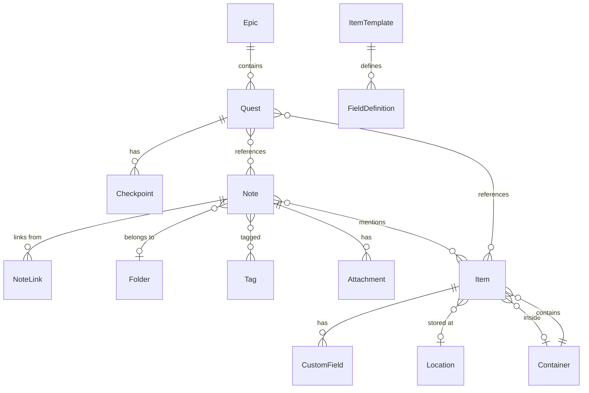

# Domain Model

## Purpose

This document defines Altair's core entities, their relationships, and the business rules that govern them.
It serves as the canonical reference for what data exists and how it behaves across all three modules.

---

## Entity Map

```mermaid
erDiagram
    %% Guidance Module
    Epic ||--o{ Quest : contains
    Quest ||--o{ Checkpoint : has

    %% Knowledge Module
    Note ||--o{ NoteLink : "links from"
    Note }o--o| Folder : "belongs to"
    Note }o--o{ Tag : tagged
    Note ||--o{ Attachment : has

    %% Tracking Module
    Item ||--o{ CustomField : has
    Item }o--o| Location : "stored at"
    Item }o--o| Container : "inside"
    Container ||--o{ Item : contains
    ItemTemplate ||--o{ FieldDefinition : defines

    %% Cross-Module Relations
    Quest }o--o{ Note : references
    Quest }o--o{ Item : references
    Note }o--o{ Item : mentions
```

---

## Guidance Module

### Epic

A large goal that provides context and motivation. Epics are broken into Quests.

| Field        | Type       | Constraints                       |
| ------------ | ---------- | --------------------------------- |
| id           | identifier | unique                            |
| title        | text       | required, max 200 chars           |
| description  | text       | optional                          |
| status       | enum       | `active`, `completed`, `archived` |
| created_at   | datetime   | immutable                         |
| updated_at   | datetime   | auto-updated                      |
| completed_at | datetime   | set when completed                |

**Business Rules:**

- An Epic is `completed` when all its Quests are `completed`
- Archived Epics are hidden from default views but retain history
- Epics can exist without Quests (planning phase)

---

### Quest

The core unit of work. A focused task completable in one session.

| Field        | Type       | Constraints                                   |
| ------------ | ---------- | --------------------------------------------- |
| id           | identifier | unique                                        |
| title        | text       | required, max 200 chars                       |
| description  | text       | optional                                      |
| energy_cost  | integer    | required, 1-5                                 |
| status       | enum       | `backlog`, `active`, `completed`, `abandoned` |
| epic_id      | reference  | optional, links to Epic                       |
| created_at   | datetime   | immutable                                     |
| updated_at   | datetime   | auto-updated                                  |
| started_at   | datetime   | set when activated                            |
| completed_at | datetime   | set when finished                             |

**Business Rules:**

- **WIP Limit = 1**: Only one Quest can be `active` at a time
- Energy cost represents cognitive load (1 = trivial, 5 = exhausting)
- Only `backlog` Quests can be started
- Completing a Quest deducts energy from the daily budget
- Abandoned Quests don't consume energy

---

### Checkpoint

An optional sub-step within a Quest for tracking progress.

| Field        | Type       | Constraints              |
| ------------ | ---------- | ------------------------ |
| id           | identifier | unique                   |
| quest_id     | reference  | required, links to Quest |
| title        | text       | required, max 200 chars  |
| completed    | boolean    | default false            |
| order        | integer    | display sequence         |
| completed_at | datetime   | set when checked         |

**Business Rules:**

- Checkpoints are optional; Quests can have zero
- Completing all Checkpoints does NOT auto-complete the Quest
- Order is user-controlled (drag-and-drop reordering)

---

### Energy Budget

Daily energy allocation. Tracked per calendar day.

| Field  | Type    | Constraints                    |
| ------ | ------- | ------------------------------ |
| date   | date    | unique, primary key            |
| budget | integer | default 5, range 1-10          |
| spent  | integer | computed from completed Quests |

**Business Rules:**

- Budget resets at midnight (user's local timezone)
- Default budget is 5; users can adjust per-day or change the default
- Energy is a soft limit—Quests can complete over budget with a warning
- Historical data preserved for trends and analytics

---

## Knowledge Module

### Note

A unit of knowledge. Markdown content with links, tags, and attachments.

| Field      | Type       | Constraints                                   |
| ---------- | ---------- | --------------------------------------------- |
| id         | identifier | unique                                        |
| title      | text       | required, max 200 chars, unique within folder |
| content    | text       | Markdown format                               |
| folder_id  | reference  | optional, links to Folder                     |
| embedding  | vector     | generated from content                        |
| created_at | datetime   | immutable                                     |
| updated_at | datetime   | auto-updated on content change                |

**Business Rules:**

- Titles must be unique within the same folder (different folders can have same title)
- Content supports wiki-link syntax: `[[Note Title]]`
- Embeddings regenerate automatically on content change (debounced)
- Deleting a Note orphans incoming links (they become broken references)

---

### NoteLink

A directional connection between two Notes. Enables graph navigation.

| Field      | Type       | Constraints                  |
| ---------- | ---------- | ---------------------------- |
| id         | identifier | unique                       |
| source_id  | reference  | Note containing the link     |
| target_id  | reference  | Note being linked to         |
| context    | text       | surrounding text for preview |
| created_at | datetime   | immutable                    |

**Business Rules:**

- Links are parsed from `[[...]]` syntax on Note save
- Linking to a non-existent Note creates a stub for future creation
- Self-links are allowed but typically filtered from views
- Deleting source Note deletes its outgoing links
- Deleting target Note leaves links as broken references

---

### Folder

Hierarchical container for organizing Notes.

| Field      | Type       | Constraints                                   |
| ---------- | ---------- | --------------------------------------------- |
| id         | identifier | unique                                        |
| name       | text       | required, max 100 chars, unique within parent |
| parent_id  | reference  | optional, links to parent Folder              |
| order      | integer    | display sequence among siblings               |
| created_at | datetime   | immutable                                     |

**Business Rules:**

- Root-level Folders have null parent_id
- Folder names must be unique among siblings
- Deleting a Folder moves its Notes to parent (or root)
- Maximum nesting depth: 10 levels

---

### Tag

A label for categorizing Notes. Flat namespace (no hierarchy).

| Field | Type       | Constraints                               |
| ----- | ---------- | ----------------------------------------- |
| id    | identifier | unique                                    |
| name  | text       | required, max 50 chars, unique, lowercase |
| color | text       | optional, hex color code                  |

**Business Rules:**

- Tag names are normalized to lowercase
- Tags are created on first use (inline in editor)
- Unused tags (no Notes) can be garbage collected
- Notes can have unlimited tags

---

### Attachment

A file associated with a Note.

| Field      | Type       | Constraints                    |
| ---------- | ---------- | ------------------------------ |
| id         | identifier | unique                         |
| note_id    | reference  | required, links to Note        |
| filename   | text       | original filename              |
| mime_type  | text       | detected content type          |
| size_bytes | integer    | file size                      |
| hash       | text       | content hash for deduplication |
| created_at | datetime   | immutable                      |

**Business Rules:**

- Files stored in app data directory with hash-based names
- Duplicate files (same hash) share storage
- Deleting a Note deletes orphaned attachments
- Maximum file size: 100 MB

---

## Tracking Module

### Item

A physical object being tracked. Core entity of inventory management.

| Field        | Type       | Constraints                     |
| ------------ | ---------- | ------------------------------- |
| id           | identifier | unique                          |
| name         | text       | required, max 200 chars         |
| description  | text       | optional                        |
| quantity     | integer    | default 1, minimum 0            |
| template_id  | reference  | optional, links to ItemTemplate |
| location_id  | reference  | optional, links to Location     |
| container_id | reference  | optional, links to Container    |
| image        | blob       | optional, primary photo         |
| created_at   | datetime   | immutable                       |
| updated_at   | datetime   | auto-updated                    |

**Business Rules:**

- Items can have either a Location OR be inside a Container, not both
- Quantity of 0 means "out of stock" not deleted
- Template provides default fields but can be overridden per-item
- Moving an Item updates location/container and logs history

---

### CustomField

User-defined attribute on an Item. Supports multiple data types.

| Field         | Type       | Constraints                                        |
| ------------- | ---------- | -------------------------------------------------- |
| id            | identifier | unique                                             |
| item_id       | reference  | required, links to Item                            |
| name          | text       | required, max 100 chars                            |
| field_type    | enum       | `text`, `number`, `date`, `boolean`, `url`, `enum` |
| value         | any        | type-dependent validation                          |
| definition_id | reference  | optional, links to FieldDefinition                 |

**Business Rules:**

- Field names must be unique per Item
- Type determines validation and UI widget
- Enum fields have predefined options from FieldDefinition
- Fields from templates are pre-populated but editable

---

### Location

A physical place where Items are stored.

| Field       | Type       | Constraints                        |
| ----------- | ---------- | ---------------------------------- |
| id          | identifier | unique                             |
| name        | text       | required, max 100 chars            |
| description | text       | optional                           |
| parent_id   | reference  | optional, links to parent Location |
| created_at  | datetime   | immutable                          |

**Business Rules:**

- Locations are hierarchical (Room → Shelf → Drawer)
- Items at a Location are not inside a Container at that Location
- Deleting a Location moves Items to parent Location
- Maximum nesting depth: 10 levels

---

### Container

A movable storage unit that holds Items and has its own Location.

| Field       | Type       | Constraints                          |
| ----------- | ---------- | ------------------------------------ |
| id          | identifier | unique                               |
| name        | text       | required, max 100 chars              |
| description | text       | optional                             |
| location_id | reference  | optional, where the Container is     |
| parent_id   | reference  | optional, Container inside Container |
| created_at  | datetime   | immutable                            |

**Business Rules:**

- Containers can be nested (box inside box)
- Moving a Container moves all Items inside it
- A Container's Location is independent of its parent Container's Location
- Maximum nesting depth: 5 levels

---

### ItemTemplate

Predefined schema for a category of Items (e.g., "Book", "Tool", "Medication").

| Field       | Type       | Constraints                     |
| ----------- | ---------- | ------------------------------- |
| id          | identifier | unique                          |
| name        | text       | required, max 100 chars, unique |
| description | text       | optional                        |
| icon        | text       | optional, icon identifier       |
| created_at  | datetime   | immutable                       |

**Business Rules:**

- Templates define common fields for a category
- Applying a template pre-populates CustomFields
- Changing a template does NOT update existing Items
- Users can create custom templates

---

### FieldDefinition

A field specification within an ItemTemplate.

| Field         | Type       | Constraints                                        |
| ------------- | ---------- | -------------------------------------------------- |
| id            | identifier | unique                                             |
| template_id   | reference  | required, links to ItemTemplate                    |
| name          | text       | required, max 100 chars                            |
| field_type    | enum       | `text`, `number`, `date`, `boolean`, `url`, `enum` |
| required      | boolean    | default false                                      |
| default_value | any        | optional                                           |
| enum_options  | text[]     | for enum type only                                 |
| order         | integer    | display sequence                                   |

**Business Rules:**

- Field names must be unique within a template
- Required fields must have values when Item is saved
- Enum options are fixed at definition time

---

## Cross-Module Relations

### Quest ↔ Note

Quests can reference Notes for context, research, or documentation.

- Relation is many-to-many
- Created manually by user or suggested by AI
- Deleting either side removes the link, not the other entity

### Quest ↔ Item

Quests can reference Items they involve (tools needed, items to process).

- Relation is many-to-many
- Useful for "Organize garage" Quest linking to Items being sorted
- Completing a Quest can prompt Item status updates

### Note ↔ Item

Notes can mention Items, creating documentation links.

- Detected automatically via `[[Item:Name]]` syntax or AI
- Enables "where did I document this?" queries
- Bidirectional: Item detail shows linked Notes

---

## Identifier Strategy

All entities use ULID (Universally Unique Lexicographically Sortable Identifier):

- Sortable by creation time
- No coordination required (locally generated)
- URL-safe (no special characters)
- 26 characters, case-insensitive

---

## Soft Delete Policy

Entities are soft-deleted by default:

| Entity    | Soft Delete | Hard Delete After          |
| --------- | ----------- | -------------------------- |
| Epic      | Yes         | 30 days or manual purge    |
| Quest     | Yes         | 30 days or manual purge    |
| Note      | Yes         | 30 days or manual purge    |
| Item      | Yes         | 30 days or manual purge    |
| Folder    | No          | Immediate (contents moved) |
| Location  | No          | Immediate (contents moved) |
| Container | No          | Immediate (contents moved) |
| Tag       | No          | Immediate                  |

Soft-deleted entities:

- Hidden from normal views
- Appear in "Trash" view
- Can be restored within retention period
- Permanently deleted after retention or manual purge

---

## References

- [altair-prd-guidance.md](../requirements/altair-prd-guidance.md) — Guidance module requirements
- [altair-prd-knowledge.md](../requirements/altair-prd-knowledge.md) — Knowledge module requirements
- [altair-prd-tracking.md](../requirements/altair-prd-tracking.md) — Tracking module requirements
