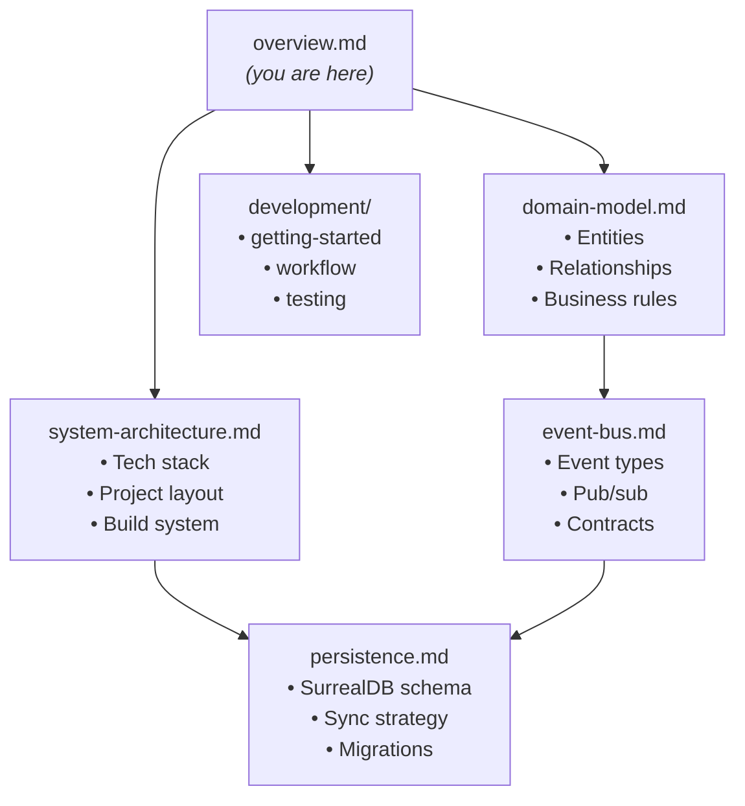

# Altair Architecture Overview

## Purpose

This document provides a high-level map of Altair's architecture documentation.
It serves as the entry point for understanding system design and navigating to detailed specifications.

## System Synopsis

Altair is an ADHD-focused productivity ecosystem consisting of three interconnected modules—Guidance (task management),
Knowledge (PKM), and Tracking (inventory)—built as a single Tauri 2 desktop application with a Svelte 5 frontend and
Rust backend. The system emphasizes local-first architecture, externalized executive function, and seamless cross-module
integration.

### Technology Stack

| Layer              | Technology         | Version              | Purpose                                     |
| ------------------ | ------------------ | -------------------- | ------------------------------------------- |
| Desktop Runtime    | Tauri              | 2.0+                 | Native desktop app with web frontend        |
| Frontend Framework | Svelte             | 5.0+                 | Reactive UI components                      |
| UI Components      | shadcn-svelte      | latest               | Accessible, themeable component library     |
| Backend Language   | Rust               | 1.83+ (2024 edition) | Core logic, performance-critical operations |
| Database           | SurrealDB          | 2.0+                 | Embedded database with optional cloud sync  |
| AI Inference       | ort (ONNX Runtime) | latest               | Local model inference                       |
| AI Providers       | Adapter pattern    | —                    | Ollama, Anthropic, OpenAI, OpenRouter       |

### Core Design Principles

1. **Local-first**: All features work offline; cloud sync is optional
2. **Single application**: One Tauri binary containing all three modules
3. **Shared data layer**: Unified SurrealDB instance accessed by all modules
4. **Event-driven integration**: Loose coupling via internal event bus
5. **ADHD-optimized**: UI enforces constraints that externalize executive function

---

## Architecture Documents

### Core Documents

| Document                                           | Purpose                     | Key Contents                                             |
| -------------------------------------------------- | --------------------------- | -------------------------------------------------------- |
| [system-architecture.md](./system-architecture.md) | Technical infrastructure    | Tauri/Svelte/Rust stack, build system, project structure |
| [domain-model.md](./domain-model.md)               | Business logic and entities | Quest, Note, Item models; cross-module relationships     |
| [persistence.md](./persistence.md)                 | Data storage                | SurrealDB schema, sync strategy, migrations              |
| [event-bus.md](./event-bus.md)                     | Inter-module communication  | Event types, pub/sub patterns, contracts                 |

### Development Documents

Located in `docs/development/`:

| Document                                                          | Purpose                              |
| ----------------------------------------------------------------- | ------------------------------------ |
| [getting-started.md](../development/getting-started.md)           | Dev environment setup                |
| [development-workflow.md](../development/development-workflow.md) | Git flow, commits, versioning, CI/CD |
| [testing-strategy.md](../development/testing-strategy.md)         | Unit, integration, E2E testing       |

### Reference Documents

Located in `docs/reference/`:

| Document                                | Purpose                 |
| --------------------------------------- | ----------------------- |
| [glossary.md](../reference/glossary.md) | Terminology definitions |

### Architecture Decision Records

Located in `docs/adr/`:

| ADR                                               | Decision                                 | Status   |
| ------------------------------------------------- | ---------------------------------------- | -------- |
| [ADR-001](../adr/001-single-tauri-application.md) | Single Tauri application                 | Accepted |
| [ADR-002](../adr/002-surrealdb-embedded.md)       | SurrealDB for persistence                | Accepted |
| [ADR-003](../adr/003-event-bus-for-modules.md)    | Event bus for inter-module communication | Accepted |
| [ADR-004](../adr/004-ai-provider-adapters.md)     | AI provider adapter pattern              | Accepted |

---

## Document Relationships

---

## Application Modules

The three logical modules share infrastructure within a single Tauri application:

| Module        | PRD Reference                                                      | Responsibility                       |
| ------------- | ------------------------------------------------------------------ | ------------------------------------ |
| **Guidance**  | [altair-prd-guidance.md](../requirements/altair-prd-guidance.md)   | Quest-Based Agile task management    |
| **Knowledge** | [altair-prd-knowledge.md](../requirements/altair-prd-knowledge.md) | Personal knowledge management        |
| **Tracking**  | [altair-prd-tracking.md](../requirements/altair-prd-tracking.md)   | Inventory and asset management       |
| **Core**      | [altair-prd-core.md](../requirements/altair-prd-core.md)           | Shared infrastructure, design system |

### Inter-Module Communication

Modules communicate through two mechanisms:

1. **Shared Database (SurrealDB)**
   - Direct queries for cross-module data (e.g., "get all notes linked to this quest")
   - Graph relationships between entities
   - Source of truth for all persistent state

2. **Event Bus (Internal Pub/Sub)**
   - Real-time reactive updates between modules
   - Loose coupling—modules don't call each other directly
   - Enables features like auto-discovery popups

See [event-bus.md](./event-bus.md) for the complete event contract.

---

## Quick Reference

### Finding Information

| I want to understand...       | Go to...                                                          |
| ----------------------------- | ----------------------------------------------------------------- |
| What Altair does              | This document                                                     |
| Project structure and tooling | [system-architecture.md](./system-architecture.md)                |
| Data models and relationships | [domain-model.md](./domain-model.md)                              |
| Database schema and queries   | [persistence.md](./persistence.md)                                |
| How modules communicate       | [event-bus.md](./event-bus.md)                                    |
| Testing approach              | [testing-strategy.md](../development/testing-strategy.md)         |
| Git workflow and CI/CD        | [development-workflow.md](../development/development-workflow.md) |
| Functional requirements       | PRD documents in `docs/requirements/`                             |
| Why we made a decision        | ADR documents in `docs/adr/`                                      |

### Requirement Traceability

Architecture decisions and implementations link to PRD requirements using the format `FR-X-NNN`:

| Prefix   | Source                 |
| -------- | ---------------------- |
| `FR-G-*` | Guidance requirements  |
| `FR-K-*` | Knowledge requirements |
| `FR-T-*` | Tracking requirements  |

---

## Version History

| Version | Date       | Changes                       |
| ------- | ---------- | ----------------------------- |
| 0.1.0   | 2026-01-08 | Initial architecture overview |
