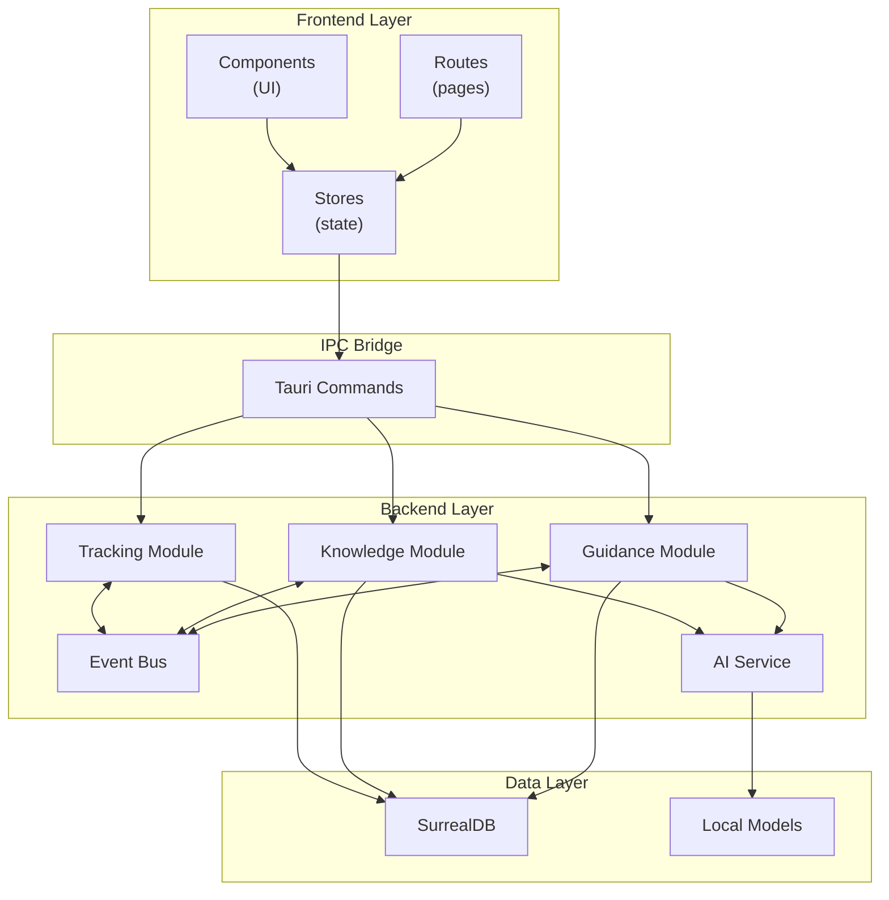

# System Architecture

## Purpose

This document describes Altair's high-level technical architecture: how components relate, where boundaries exist, and
key patterns used throughout the system.

---

## Technology Stack

| Layer           | Technology           | Rationale                                                         |
| --------------- | -------------------- | ----------------------------------------------------------------- |
| Desktop Runtime | Tauri 2              | Native performance, small bundle, Rust backend                    |
| Frontend        | Svelte 5 + SvelteKit | Runes reactivity, file-based routing, good DX                     |
| UI Components   | shadcn-svelte        | Accessible primitives, Tailwind styling, unstyled flexibility     |
| Backend         | Rust 2024 edition    | Memory safety, async performance, ONNX/Whisper bindings           |
| Database        | SurrealDB embedded   | Graph queries, full-text search, vector search, single dependency |
| Local AI        | ort + whisper-rs     | Privacy-first embeddings and transcription                        |

---

## Component Architecture

---

## Layer Responsibilities

### Frontend Layer

Handles user interaction and presentation. No business logic lives here.

- **Routes**: Page-level components, URL-driven navigation
- **Stores**: Reactive state containers, cache Tauri command results
- **Components**: Reusable UI elements, stateless where possible

The frontend communicates with the backend exclusively through Tauri commands. It never accesses the database or file
system directly.

### IPC Bridge

Tauri commands are the contract between frontend and backend. They define a typed API surface.

- Commands are async and return `Result<T, Error>`
- Serialization is automatic (serde JSON)
- Commands should be thin wrappers that delegate to module services

### Backend Layer

Contains all business logic, organized by domain module.

**Modules** (Guidance, Knowledge, Tracking):

- Own their domain logic and validation rules
- Communicate with each other via the Event Bus, not direct calls
- Access the database through a shared abstraction

**Event Bus**:

- Enables loose coupling between modules
- Publish/subscribe pattern using `tokio::sync::broadcast`
- Events are typed and versioned

**AI Service**:

- Abstracts over local and cloud providers
- Exposes capabilities (completion, embedding, transcription)
- See [ADR-004](../adr/004-ai-provider-adapters.md) for provider details

### Data Layer

Persistence and local AI models.

**SurrealDB**:

- Runs embedded (in-process), no separate server
- Uses SurrealKV storage engine
- Stores all entities, relationships, and vector embeddings

**Local Models**:

- ONNX embedding model for semantic search
- Whisper model for transcription
- Loaded lazily on first use

---

## Key Boundaries

### Frontend ↔ Backend

The Tauri IPC layer is a hard boundary. The frontend:

- Cannot import Rust code
- Cannot access the database directly
- Cannot read arbitrary files

This ensures the backend can enforce all business rules.

### Module ↔ Module

Modules communicate through events, not direct function calls. This:

- Prevents circular dependencies
- Allows modules to evolve independently
- Makes cross-module features explicit

Example: When Knowledge detects an item mention in a note, it publishes `ItemMentioned`. Tracking subscribes and can
prompt the user to link or create an item.

### Application ↔ External Services

Cloud AI providers are accessed through the adapter pattern. The application never directly calls provider APIs from
business logic—it goes through `AiService`, which handles:

- Provider selection based on user config
- Fallback logic
- Rate limiting and error handling

---

## Data Flow Patterns

### Command Flow (User Action → Database)

1. User interacts with UI component
2. Component calls store method
3. Store invokes Tauri command
4. Command handler validates input
5. Module service executes business logic
6. Database transaction commits
7. Result flows back up the chain

### Event Flow (Cross-Module Reaction)

1. Module A performs an action
2. Module A publishes event to Event Bus
3. Event Bus delivers to all subscribers
4. Module B receives event
5. Module B performs its reaction
6. (Optionally) Module B publishes its own event

### Query Flow (Database → UI)

1. Store requests data via Tauri command
2. Command executes SurrealQL query
3. Results deserialize to Rust structs
4. Structs serialize to JSON for IPC
5. Store updates reactive state
6. UI re-renders affected components

---

## Security Model

### Process Isolation

The Tauri WebView runs in a separate process from the Rust backend. The WebView:

- Has a restrictive Content Security Policy
- Cannot execute arbitrary system commands
- Cannot access the network except through defined APIs

### Capability-Based Permissions

Tauri 2 uses explicit capability grants. File system access, shell commands, and other sensitive operations require
declared permissions that the user can audit.

### Secret Storage

API keys for cloud providers are stored in the system keychain (macOS Keychain, Windows Credential Manager, Linux Secret
Service), not in config files.

---

## Performance Considerations

### Startup

Target: < 2 seconds to interactive UI

- AI models load lazily (first use, not startup)
- Database connection pooled
- Frontend bundle code-split by route

### Bundle Size

The base application (without AI models) targets ~20 MB. AI models add ~200 MB but can be downloaded on first use rather
than bundled.

### Database

SurrealDB queries should:

- Use indexes for frequently-filtered fields
- Limit result sets for list views
- Leverage graph traversal for relationship queries

---

## References

- [ADR-001: Single Tauri Application](../adr/001-single-tauri-application.md)
- [ADR-002: SurrealDB for Persistence](../adr/002-surrealdb-embedded.md)
- [ADR-003: Event Bus for Modules](../adr/003-event-bus-for-modules.md)
- [ADR-004: AI Provider Adapters](../adr/004-ai-provider-adapters.md)
