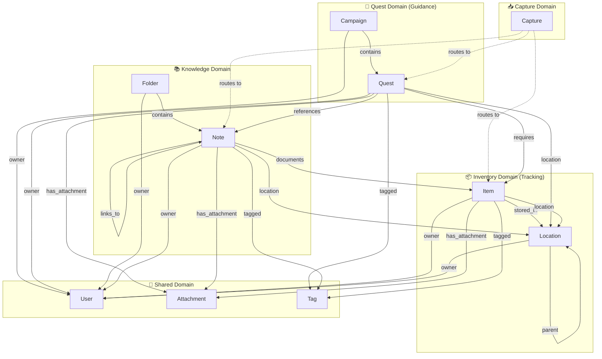
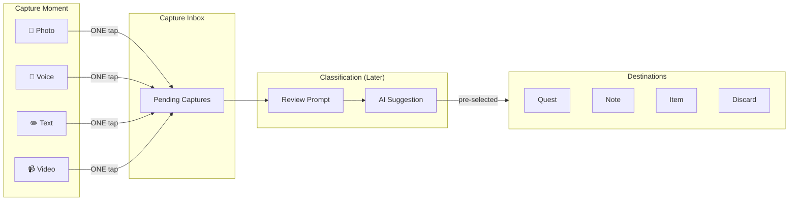
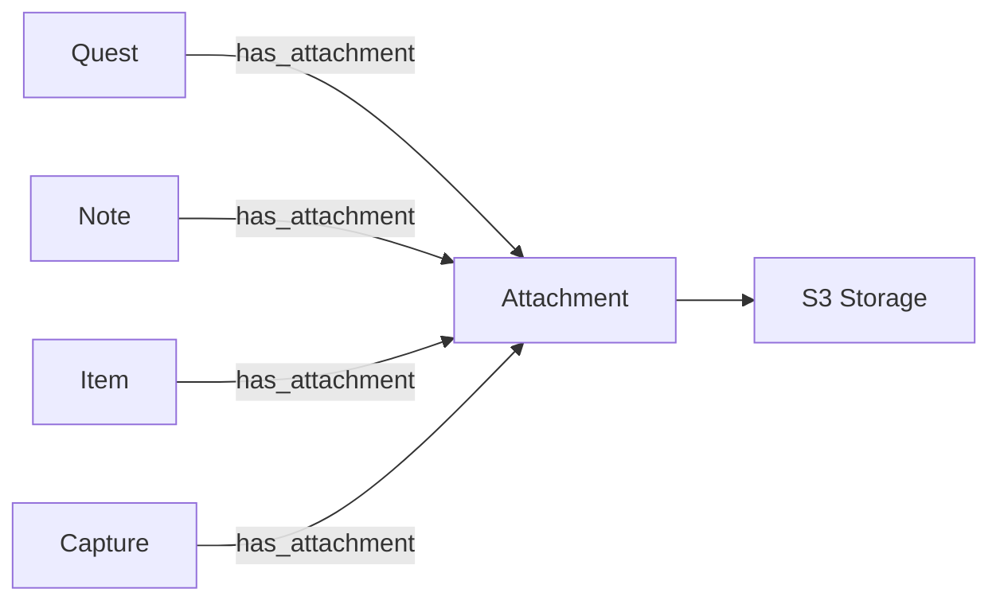
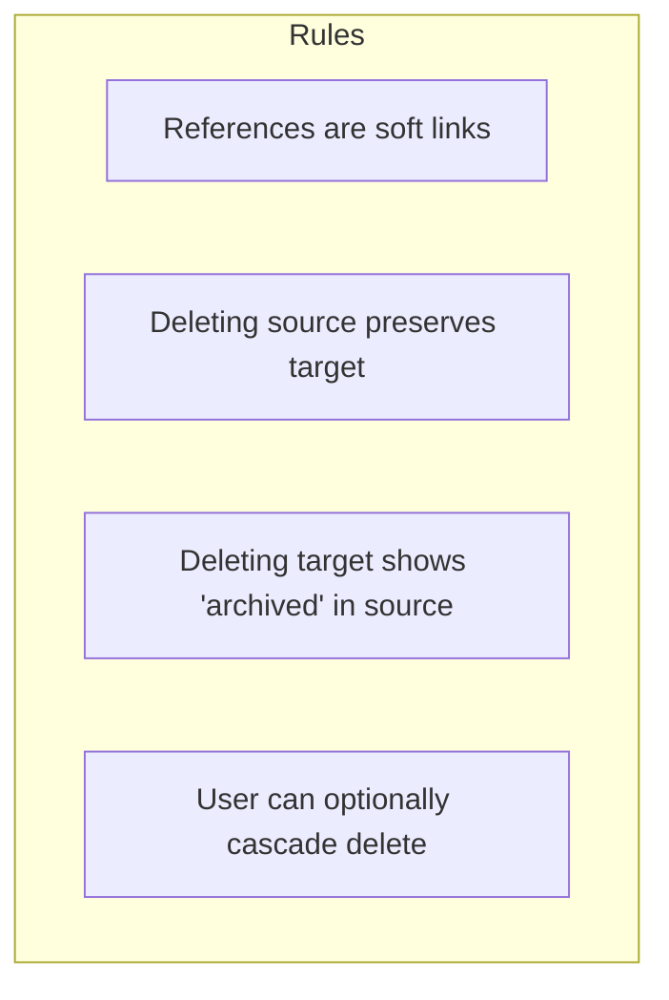
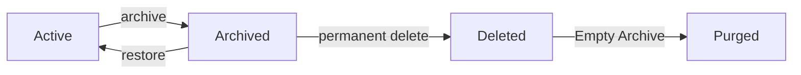
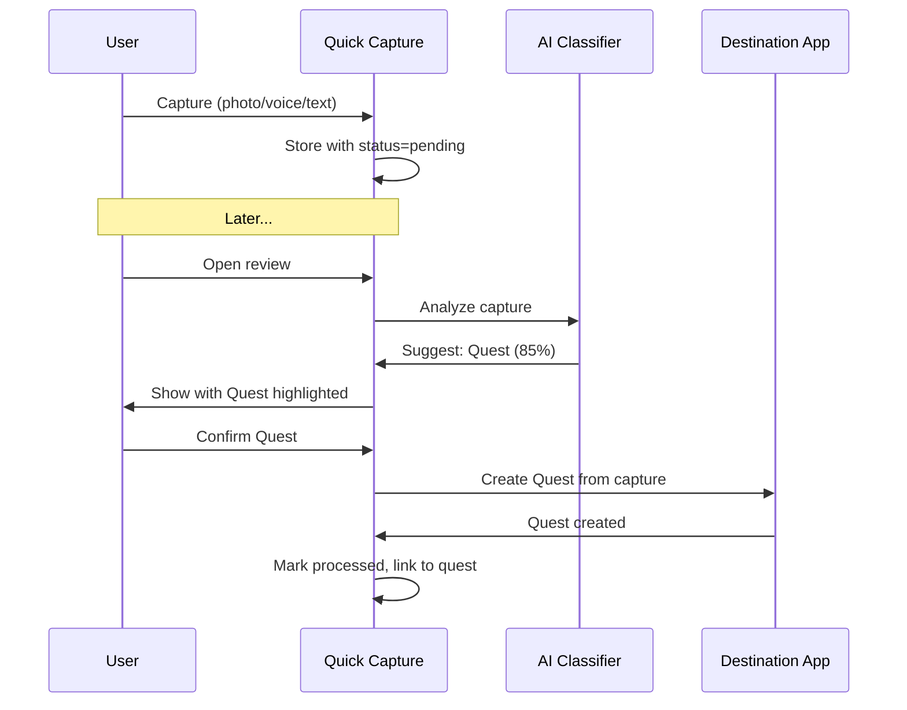
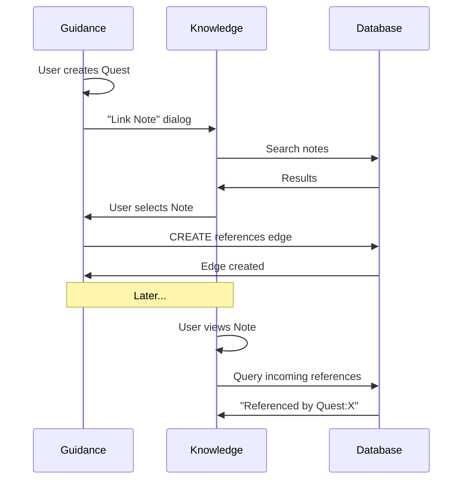
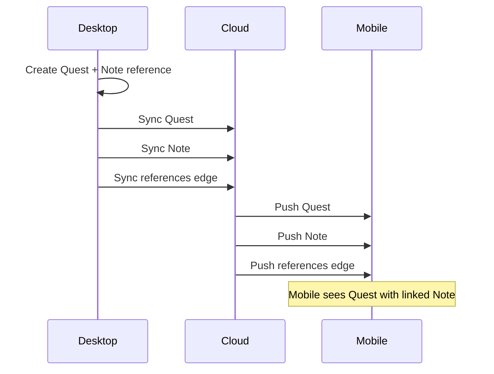
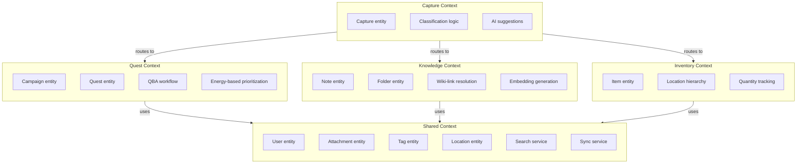

# Altair Domain Model

> **Bounded contexts, entity relationships, and cross-domain rules** for the
> Altair productivity ecosystem

---

## Quick Reference

| Domain        | Primary App | Core Entities         | Key Responsibility                     |
| ------------- | ----------- | --------------------- | -------------------------------------- |
| **Quest**     | Guidance    | Campaign, Quest       | Task lifecycle, ADHD prioritization    |
| **Knowledge** | Knowledge   | Note, Folder          | Content, wiki-links, semantic search   |
| **Inventory** | Tracking    | Item, Location        | Physical asset tracking                |
| **Capture**   | All         | Capture               | Zero-friction input → deferred routing |
| **Shared**    | All         | User, Attachment, Tag | Identity, media, cross-cutting         |

---

## Domain Map



---

## Bounded Contexts

### 🎯 Quest Domain (Guidance App)

**Responsibility:** Task and project management with ADHD-optimized workflows
using Quest-Based Agile (QBA) methodology.

#### Entities

| Entity       | Description                               | Lifecycle States                                |
| ------------ | ----------------------------------------- | ----------------------------------------------- |
| **Campaign** | Container for related quests (like epics) | `active` → `completed` → `archived`             |
| **Quest**    | Individual task with energy cost          | `backlog` → `active` → `completed` → `archived` |

#### Domain Rules

- **Campaigns group quests** — A quest belongs to zero or one campaign
- **Energy cost is required** — Every quest has `low`, `medium`, `high`, or
  `variable` energy
- **Priority is relative** — 0-100 scale, used for sorting within energy level
- **Time estimates are optional** — `estimated_minutes` for planning, not enforcement
- **Due dates are soft** — Guidance, not guilt

#### Aggregate Root

`Campaign` is the aggregate root. Deleting a campaign offers:

- Archive contained quests (default)
- Delete contained quests (user choice)

---

### 📚 Knowledge Domain (Knowledge App)

**Responsibility:** Personal knowledge management with wiki-style linking and
semantic search.

#### Entities

| Entity     | Description                        | Key Features                    |
| ---------- | ---------------------------------- | ------------------------------- |
| **Note**   | Content unit with markdown         | Wiki-links, embeddings, tags    |
| **Folder** | Optional hierarchical organization | Nested folders, flat by default |

#### Domain Rules

- **Notes are independent** — Can exist without folder (Inbox default)
- **Wiki-links are bidirectional** — `[[Note Title]]` creates `links_to` edge
  both ways
- **Folders are optional** — Flat organization is valid and encouraged
- **Search is primary navigation** — Folders are secondary organization
- **Embeddings auto-generate** — Every note gets vector embedding on save

#### Folder Structure (Suggested, Not Enforced)

```text
Knowledge/
├── Inbox/              ← Default for new notes
├── Projects/           ← Active work
├── Areas/              ← Ongoing responsibilities
├── Resources/          ← Reference material
└── Archive/            ← Completed/inactive
```

#### Aggregate Root

`Note` is independent (no aggregate root). Folders are organizational only.

---

### 📦 Inventory Domain (Tracking App)

**Responsibility:** Physical asset tracking with location hierarchy and quantity
management.

#### Entities

| Entity       | Description                   | Key Features                 |
| ------------ | ----------------------------- | ---------------------------- |
| **Item**     | Physical object or consumable | Quantity, category, location |
| **Location** | Where items are stored        | Hierarchical, optional geo   |

#### Domain Rules

- **Items require quantity** — Minimum 0, tracks "have" vs "need"
- **Locations are hierarchical** — `Home > Office > Desk > Top Drawer`
- **Categories are flat** — Single category per item, no hierarchy
- **Items can be location-less** — For items without fixed storage
- **Geo is optional** — GPS coordinates for locations (privacy setting)

#### Location Hierarchy Example

```text
Home (geo: optional)
├── Kitchen
│   ├── Pantry
│   └── Fridge
├── Office
│   ├── Desk
│   │   ├── Top Drawer
│   │   └── Bottom Drawer
│   └── Shelf
└── Garage
    └── Toolbox
```

#### Aggregate Root

`Location` is an aggregate root for its hierarchy. Deleting a location:

- Moves child locations up one level (default)
- Deletes children recursively (user choice)
- Items in deleted location become location-less

---

### 📥 Capture Domain (Quick Capture)

**Responsibility:** Zero-friction input capture with deferred classification.

#### The Inbox Pattern



#### Entity

| Entity      | Description                       | States                                |
| ----------- | --------------------------------- | ------------------------------------- |
| **Capture** | Raw input awaiting classification | `pending` → `processed` / `discarded` |

#### Domain Rules

- **Zero decisions at capture** — One tap/click, no destination selection
- **Deferred classification** — User decides later when they have bandwidth
- **AI assists, doesn't decide** — Suggests destination, user confirms
- **Batch processing** — Review multiple captures at once
- **Prompts are gentle** — "3 captures to review" badge, not interruptions
- **30-day retention** — Unprocessed captures auto-archive after 30 days

#### Classification Flow

1. User opens app with pending captures
2. Badge shows count: "3 captures to review"
3. Review screen shows capture with AI suggestion highlighted
4. User taps destination (Quest/Note/Item) or discards
5. System creates entity in target domain
6. Capture marked `processed`, links to created entity

#### AI Classification Signals

| Signal           | Weight | Example                 |
| ---------------- | ------ | ----------------------- |
| Content keywords | High   | "buy", "todo" → Quest   |
| Recent context   | Medium | Was in Tracking → Item  |
| Time of day      | Low    | Morning capture → Quest |
| Location         | Low    | At store → Item         |
| Media type       | Medium | Photo of receipt → Item |

---

### 🔗 Shared Domain

**Responsibility:** Cross-cutting entities used by all apps.

#### Entities

| Entity         | Used By              | Purpose                                  |
| -------------- | -------------------- | ---------------------------------------- |
| **User**       | All                  | Identity, preferences, ownership         |
| **Attachment** | All                  | Media files (photos, audio, video, docs) |
| **Tag**        | All                  | Cross-domain categorization              |
| **Location**   | Knowledge, Inventory | Shared location hierarchy                |

#### User

Single-user system with potential for sharing:

```text
User
├── email (unique identifier)
├── display_name
├── role: owner | viewer
└── preferences
    ├── theme
    ├── default_energy_filter
    ├── location_auto_tag: boolean
    ├── location_precision: city | neighborhood | exact
    └── ...
```

#### Attachment

Polymorphic attachment to any entity:



| Field         | Purpose                               |
| ------------- | ------------------------------------- |
| `filename`    | Original filename                     |
| `mime_type`   | Content type                          |
| `size_bytes`  | For quota/limits                      |
| `storage_key` | S3 object key                         |
| `checksum`    | SHA-256 for dedup                     |
| `media_type`  | `photo`, `audio`, `video`, `document` |

#### Tags

Global tags with optional namespace:

```text
Tags (examples)
├── #urgent              ← Global
├── #guidance/sprint-1   ← Namespaced
├── #knowledge/research  ← Namespaced
├── #tracking/consumable ← Namespaced
└── #home                ← Global
```

**Rules:**

- Tags are globally searchable
- Optional `app/` prefix for namespacing
- Auto-complete suggests existing tags
- Unused tags are not auto-deleted

#### Location (Shared)

Used by Inventory (required) and Knowledge (optional):

| App           | Usage                  | Auto-tag                |
| ------------- | ---------------------- | ----------------------- |
| **Tracking**  | Where items are stored | N/A (manual)            |
| **Knowledge** | Where note was created | Optional (user setting) |
| **Guidance**  | Context for quest      | Optional (user setting) |

**Privacy settings per user:**

```
☐ Auto-tag location on notes
  └── Precision: [City ▾]
☐ Auto-tag location on captures
☑ Enable location for inventory items
```

---

## Cross-Domain Relationships

### Reference Types

All cross-domain links are **references**, not containment:

| Relationship     | From  | To         | Semantics                    |
| ---------------- | ----- | ---------- | ---------------------------- |
| `references`     | Quest | Note       | "Related documentation"      |
| `documents`      | Note  | Item       | "Note describes this item"   |
| `requires`       | Quest | Item       | "Need this item to complete" |
| `links_to`       | Note  | Note       | "Wiki-style link"            |
| `stored_in`      | Item  | Location   | "Physical location"          |
| `has_attachment` | Any   | Attachment | "Associated media"           |

### Reference Rules



#### Example: Quest with linked Notes

```text
Quest:project-alpha [DELETED]
  └── references → Note:requirements [ACTIVE] ← Still exists
  └── references → Note:meeting-notes [ACTIVE] ← Still exists

Note view shows: "Referenced by: Quest:project-alpha (archived)"
```

---

## Deletion Model

### Soft Delete Everywhere

All entities use soft delete:

| State      | Visible         | Recoverable         | Sync           |
| ---------- | --------------- | ------------------- | -------------- |
| `active`   | Yes             | N/A                 | Yes            |
| `archived` | In Archive view | Yes                 | Yes            |
| `deleted`  | No              | Via "Empty Archive" | Tombstone only |

### Cascade Behavior

User-configurable in settings:

```text
When deleting a Campaign:
○ Archive contained quests (default)
○ Delete contained quests

When deleting a Folder:
○ Move notes to parent folder (default)
○ Move notes to Inbox
○ Delete contained notes

When deleting a Location:
○ Move child locations up (default)
○ Delete children recursively
○ Items become locationless
```

### Archive Flow



---

## Event Flows

### Capture → Classification



### Cross-App Reference



### Sync with References



---

## Search Across Domains

### Unified Search

Single search bar queries all domains:

```text
Search: "project alpha"

Results:
─────────
🎯 Quest: Project Alpha Setup
   Campaign: Q4 Goals

📚 Note: Project Alpha Requirements
   Folder: Projects/Alpha

📚 Note: Alpha Meeting Notes
   Folder: Projects/Alpha

📦 Item: Alpha Prototype Board
   Location: Office > Shelf
```

### Search Modes

| Mode              | Syntax     | Example                         |
| ----------------- | ---------- | ------------------------------- |
| **Global**        | (default)  | `project alpha`                 |
| **Domain filter** | `in:quest` | `in:quest project`              |
| **Tag filter**    | `#tag`     | `#urgent`                       |
| **Semantic**      | `~query`   | `~how to set up authentication` |

### Hybrid Search Implementation

```text
Query: "authentication setup"

1. BM25 (keyword)     → Score documents by term frequency
2. Vector (semantic)  → Score by embedding similarity
3. Reciprocal Rank Fusion (k=60)
4. Return merged results
```

---

## Domain Boundaries Summary



---

## Implementation Notes

### Module Boundaries

```text
packages/
├── domain-capture/     # Capture entity, classification
├── domain-quest/       # Campaign, Quest, QBA logic
├── domain-knowledge/   # Note, Folder, wiki-links
├── domain-inventory/   # Item, Location hierarchy
└── domain-shared/      # User, Attachment, Tag, Search
```

### API Boundaries

Each domain exposes:

- **Commands** — Create, Update, Archive, Delete
- **Queries** — Get, List, Search
- **Events** — Created, Updated, Archived, Deleted

Cross-domain operations go through Shared domain services.

### Database Organization

All tables in single SurrealDB namespace, prefixed by domain:

```surql
-- Quest domain
DEFINE TABLE campaign ...
DEFINE TABLE quest ...

-- Knowledge domain
DEFINE TABLE note ...
DEFINE TABLE folder ...

-- Inventory domain
DEFINE TABLE item ...
DEFINE TABLE location ...

-- Capture domain
DEFINE TABLE capture ...

-- Shared domain
DEFINE TABLE user ...
DEFINE TABLE attachment ...
DEFINE TABLE tag ...

-- Graph edges (cross-domain)
DEFINE TABLE contains ...     -- campaign->quest, folder->note
DEFINE TABLE references ...   -- quest->note
DEFINE TABLE links_to ...     -- note->note
DEFINE TABLE requires ...     -- quest->item
DEFINE TABLE stored_in ...    -- item->location
DEFINE TABLE documents ...    -- note->item
DEFINE TABLE has_attachment . -- *->attachment
DEFINE TABLE tagged ...       -- *->tag
```

---

## Appendix: Entity Summary

| Entity         | Domain    | Fields (Key)                                   | Relations                      |
| -------------- | --------- | ---------------------------------------------- | ------------------------------ |
| **User**       | Shared    | email, display_name, role, preferences         | owns all                       |
| **Campaign**   | Quest     | title, status, color                           | contains→Quest                 |
| **Quest**      | Quest     | title, status, energy_cost, priority, due_date | references→Note, requires→Item |
| **Note**       | Knowledge | title, content, embedding                      | links_to→Note, documents→Item  |
| **Folder**     | Knowledge | name, parent, color                            | contains→Note                  |
| **Item**       | Inventory | name, quantity, category                       | stored_in→Location             |
| **Location**   | Shared    | name, parent, geo                              | parent→Location                |
| **Capture**    | Capture   | type, content, status, processed_to            | has_attachment→Attachment      |
| **Attachment** | Shared    | filename, mime_type, storage_key               | —                              |
| **Tag**        | Shared    | name                                           | —                              |
