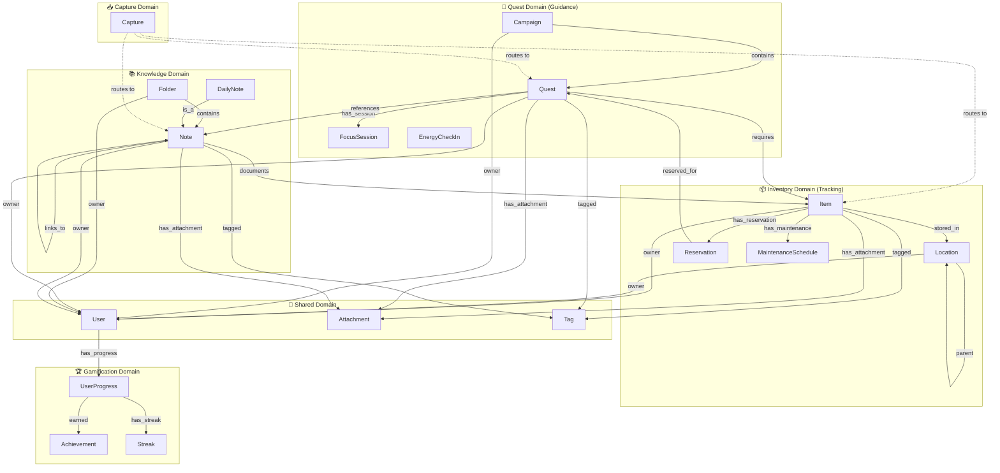
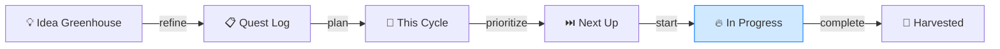
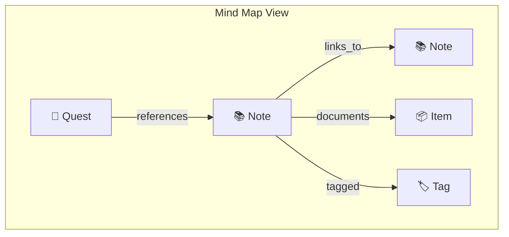
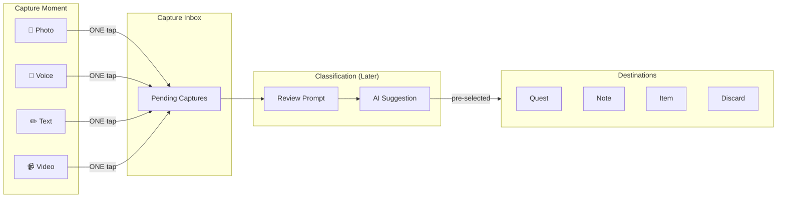
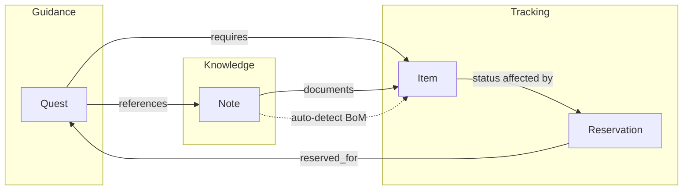

# Altair Domain Model

**Version**: 2.0  
**Status**: APPROVED  
**Created**: 2025-11-29  
**Author**: Robert Hamilton

> **Bounded contexts, entity relationships, and cross-domain rules** for the Altair productivity ecosystem

---

## Quick Reference

| Domain | Primary App | Core Entities | Key Responsibility |
|--------|-------------|---------------|-------------------|
| **Quest** | Guidance | Campaign, Quest, FocusSession, EnergyCheckIn | QBA board, focus mode, energy management |
| **Knowledge** | Knowledge | Note, Folder, DailyNote | PKM, wiki-links, mind maps, semantic search |
| **Inventory** | Tracking | Item, Location, Reservation, MaintenanceSchedule | Asset tracking, reservations, maintenance |
| **Capture** | All | Capture | Zero-friction input → deferred routing |
| **Gamification** | All | UserProgress, Achievement, Streak | XP, levels, badges, motivation |
| **Shared** | All | User, Attachment, Tag | Identity, media, cross-cutting |

---

## Domain Map



---

## Bounded Contexts

### 🎯 Quest Domain (Guidance App)

**Responsibility:** Quest-Based Agile (QBA) task management with 6-column Kanban, focus mode, and energy management.

#### QBA Board — Six Columns



| Column | Purpose | Limits |
|--------|---------|--------|
| **Idea Greenhouse** | Unrefined ideas and thoughts | Unlimited |
| **Quest Log** | Refined, actionable quests | Unlimited |
| **This Cycle's Quest** | Current cycle focus | Max 1 |
| **Next Up** | Priority queue | Max 5 |
| **In Progress** | Active work (WIP=1) | **Strictly 1** |
| **Harvested** | Completed quests | Unlimited |

#### Entities

| Entity | Description | Key Fields |
|--------|-------------|------------|
| **Campaign** | Container for related quests (epic) | title, status, color |
| **Quest** | Individual task with energy cost | title, column, energy_level, estimated_minutes, xp_value |
| **FocusSession** | Active work session on a quest | quest, start_time, duration, completed_steps |
| **EnergyCheckIn** | Daily energy self-assessment | date, level, notes |

#### Quest States (Column-Based)

```surql
DEFINE FIELD column ON quest TYPE string
    ASSERT $value IN [
        'idea_greenhouse',
        'quest_log', 
        'this_cycle',
        'next_up',
        'in_progress',
        'harvested',
        'archived'
    ];
```

#### Energy Levels (5-Point Scale)

| Level | Icon | Description | Typical Tasks |
|-------|------|-------------|---------------|
| **Tiny** | ⚡ | Minimal cognitive load | Reply to message, file document |
| **Small** | ⚡⚡ | Light work | Review notes, simple fixes |
| **Medium** | ⚡⚡⚡ | Standard tasks | Write documentation, code review |
| **Large** | ⚡⚡⚡⚡ | Complex work | Feature implementation |
| **Huge** | ⚡⚡⚡⚡⚡ | Major projects | Architecture design, deep research |

```surql
DEFINE FIELD energy_level ON quest TYPE string
    ASSERT $value IN ['tiny', 'small', 'medium', 'large', 'huge'];
```

#### Domain Rules

- **WIP = 1 strictly enforced** — Only one quest in "In Progress" at a time
- **This Cycle max 1** — Focus on single cycle goal
- **Next Up max 5** — Prevents overwhelm
- **Energy required** — Every quest has an energy level
- **Campaigns group quests** — Optional grouping for related work
- **XP on completion** — Quests award XP when harvested

#### Focus Session (Zen Mode)

```
FocusSession
├── quest: record<quest>
├── started_at: datetime
├── planned_duration: duration (e.g., 25m)
├── actual_duration: duration
├── completed_steps: array<string>
├── status: 'active' | 'paused' | 'completed' | 'abandoned'
└── notes: string
```

**Focus Mode UI Elements:**

- Full-screen single quest view
- Visual timer (progress bar, not just numbers)
- Progressive disclosure of quest steps
- "On Deck" preview (Next Up queue)
- Large "MARK COMPLETE" button
- Energy status indicator
- Level indicator

#### Weekly Harvest Ritual

Triggered Sunday evening (configurable):

1. Review completed quests from the week
2. Celebrate achievements (XP summary, badges earned)
3. Archive old quests from Harvested
4. Plan next cycle's focus
5. Reflect on patterns (energy accuracy, estimates vs actual)

#### Quest Dependency Graph

Quests can have relationships with other quests:

| Relationship | Meaning |
|--------------|---------|
| `blocks` | This quest must complete before target |
| `blocked_by` | This quest waits on target |
| `related_to` | Informational link |
| `parent_of` | Epic/sub-quest relationship |
| `follows` | Sequential ordering |

**Visualization Options:**

- Top-to-bottom tree
- Left-to-right timeline
- Force-directed network
- Gantt-style view
- Critical path highlighting

---

### 📚 Knowledge Domain (Knowledge App)

**Responsibility:** Personal knowledge management with daily notes, wiki-links, mind mapping, and semantic search.

#### Entities

| Entity | Description | Key Fields |
|--------|-------------|------------|
| **Note** | Markdown content unit | title, content, embedding, is_daily |
| **DailyNote** | Auto-created daily entry point | date, note_id |
| **Folder** | Optional hierarchical organization | name, parent, color |

#### Daily Notes

Daily notes are the **default entry point** to Knowledge:

```
DailyNote
├── date: datetime (date only, unique)
├── note: record<note>
└── auto_created: boolean

-- Auto-created on first access each day
-- Title format: "2024-11-29" or "Friday, November 29, 2024"
-- Serves as scratch pad and daily log
```

#### Note Features

| Feature | Description |
|---------|-------------|
| **Markdown editor** | Live preview, split view, syntax highlighting |
| **Wiki-links** | `[[Note Title]]` with autocomplete |
| **Backlinks** | Panel showing all notes linking to current |
| **Unlinked mentions** | Detect references without explicit links |
| **Aliases** | `[[note\|Display Name]]` support |
| **Embeddings** | Auto-generated vector for semantic search |
| **Templates** | Reusable note structures |
| **Version history** | Track changes over time |
| **LaTeX math** | Mathematical notation support |
| **Mermaid diagrams** | Embedded diagram rendering |
| **Code blocks** | Syntax highlighted code |

#### Mind Mapping (Graph Visualization)

Mind maps are a **view**, not a separate entity. They visualize relationships:



**Node Types:**

- Note nodes (with title preview)
- Quest nodes (from Guidance)
- Item nodes (from Tracking)
- Tag/topic nodes

**Features:**

- Interactive zoom/pan navigation
- Force-directed or manual layout
- Layout persistence (save manual arrangements)
- Color coding by type
- Expandable node details
- Cluster detection
- Local graph (current note) or global graph (all)
- Canvas/whiteboard mode

#### Auto-Discovery of Relationships

System automatically suggests relationships:

| Mechanism | Threshold | Example |
|-----------|-----------|---------|
| Semantic similarity | Cosine > 0.7 | Similar topic notes |
| Fuzzy title matching | Levenshtein < 3 | "RPi" ≈ "Raspberry Pi" |
| Smart aliasing | Dictionary | "JS" ≈ "JavaScript" |
| Entity recognition | NLP extraction | Mentions of known items |
| Shared keywords | TF-IDF overlap | Common terminology |

#### Domain Rules

- **Daily note is default** — Opening Knowledge creates/opens today's note
- **Wiki-links are bidirectional** — `[[Note]]` creates link both directions
- **Folders are optional** — Flat organization valid, search is primary nav
- **Embeddings auto-generate** — Background processing on save
- **Templates speed capture** — Pre-defined structures for common note types

---

### 📦 Inventory Domain (Tracking App)

**Responsibility:** Physical asset tracking with locations, reservations, maintenance schedules, and BoM intelligence.

#### Entities

| Entity | Description | Key Fields |
|--------|-------------|------------|
| **Item** | Physical object or consumable | name, quantity, status, category |
| **Location** | Hierarchical storage place | name, parent, geo |
| **Reservation** | Item reserved for a quest | item, quest, quantity, status |
| **MaintenanceSchedule** | Recurring maintenance tasks | item, interval, last_performed, next_due |

#### Item Status

```surql
DEFINE FIELD status ON item TYPE string DEFAULT 'available'
    ASSERT $value IN ['available', 'reserved', 'in_use', 'depleted', 'archived'];
```

| Status | Description |
|--------|-------------|
| **available** | Ready for use |
| **reserved** | Reserved for a specific quest |
| **in_use** | Currently being used |
| **depleted** | Quantity = 0 |
| **archived** | Soft deleted |

#### Reservation System

```
Reservation
├── item: record<item>
├── quest: record<quest>
├── quantity: int (how many reserved)
├── status: 'pending' | 'active' | 'released'
├── reserved_at: datetime
└── released_at: datetime?
```

**Flow:**

1. Quest requires item → Create reservation (pending)
2. Quest moves to In Progress → Reservation becomes active
3. Quest completed/cancelled → Reservation released
4. Item status updates based on active reservations

#### Bill of Materials (BoM) Intelligence

Auto-detect item mentions in notes and quests:

```
Note content: "Need 2x Raspberry Pi 4 and 1x 32GB SD card for the project"

Auto-detected:
┌──────────────────────────────────────┐
│ Found in inventory:                  │
│ ├── 2x Raspberry Pi 4  (3 available) │
│ └── 1x 32GB SD Card    (5 available) │
│                                      │
│ [Create Reservations] [Dismiss]      │
└──────────────────────────────────────┘
```

#### Maintenance Tracking

```
MaintenanceSchedule
├── item: record<item>
├── task_name: string (e.g., "Oil change", "Battery check")
├── interval: duration (e.g., 90d, 1y)
├── last_performed: datetime?
├── next_due: datetime
├── notes: string?
└── notify_days_before: int (default 7)
```

**Triggers:**

- Push notification when maintenance due
- Badge on item showing overdue status
- Dashboard widget for upcoming maintenance

#### Domain Rules

- **Items require quantity** — Minimum 0
- **Locations are hierarchical** — `Home > Office > Desk`
- **Reservations track allocation** — Items can be reserved for quests
- **Maintenance is optional** — Not all items need schedules
- **Categories are flat** — Single category per item
- **Custom fields supported** — Flexible schema for item-specific data
- **QR/barcode support** — Generate and scan codes for items

---

### 📥 Capture Domain (Quick Capture)

**Responsibility:** Zero-friction multi-modal capture with deferred classification.

#### Capture Modes

| Mode | Icon | Max Size | Notes |
|------|------|----------|-------|
| **Text** | 📝 | Unlimited | Quick note field with auto-save |
| **Voice** | 🎤 | 5 minutes | AI transcription available |
| **Photo** | 📸 | 10MB | Camera or gallery |
| **Video** | 📹 | 2 minutes | Compressed storage, thumbnail generation |

#### Entity

```
Capture
├── type: 'text' | 'voice' | 'photo' | 'video' | 'mixed'
├── text_content: string?
├── attachments: array<record<attachment>>
├── status: 'pending' | 'processed' | 'discarded'
├── processed_to: record<quest|note|item>?
├── ai_suggestion: string? (quest/note/item)
├── ai_confidence: float?
├── captured_at: datetime
├── location: geo? (if enabled)
└── source: 'desktop' | 'mobile' | 'widget' | 'voice_assistant'
```

#### The Inbox Pattern



#### Domain Rules

- **Zero decisions at capture** — One tap, no categorization
- **Deferred classification** — Process later with full attention
- **AI assists, user decides** — Suggestions highlighted, not auto-applied
- **30-day retention** — Unprocessed captures auto-archive
- **Video limits enforced** — 2-minute max, compressed storage

---

### 🏆 Gamification Domain

**Responsibility:** XP, levels, achievements, and streaks to motivate without pressure.

#### Entities

| Entity | Description | Key Fields |
|--------|-------------|------------|
| **UserProgress** | Overall progress tracking | xp_total, level, title |
| **Achievement** | Unlockable badges | name, description, icon, unlocked_at |
| **Streak** | Consecutive day tracking | type, current_count, longest_count |

#### XP System

| Action | XP Awarded |
|--------|------------|
| Complete tiny quest | 10 XP |
| Complete small quest | 25 XP |
| Complete medium quest | 50 XP |
| Complete large quest | 100 XP |
| Complete huge quest | 200 XP |
| Daily energy check-in | 5 XP |
| Weekly harvest completed | 50 XP |
| Create note | 5 XP |
| Complete focus session | 15 XP |

#### Levels

| Level | XP Required | Title |
|-------|-------------|-------|
| 1 | 0 | Apprentice |
| 2 | 100 | Novice |
| 3 | 300 | Journeyman |
| 4 | 600 | Adept |
| 5 | 1000 | Expert |
| 10 | 5000 | Master |
| 20 | 20000 | Grandmaster |

#### Achievements (Examples)

| Achievement | Condition | Icon |
|-------------|-----------|------|
| First Quest | Complete first quest | 🌱 |
| Week Warrior | 7-day streak | 🔥 |
| Focus Master | 10 focus sessions | 🧘 |
| Knowledge Seeker | 50 notes created | 📚 |
| Inventory Pro | 100 items tracked | 📦 |
| Harvester | Complete weekly harvest 4x | 🌾 |

#### Streaks

```
Streak
├── type: 'daily_checkin' | 'quest_completion' | 'focus_session'
├── current_count: int
├── longest_count: int
├── last_activity: datetime
└── started_at: datetime
```

**Forgiveness Mechanism:** Streaks have a 24-hour grace period before breaking.

#### Domain Rules

- **XP never decreases** — Progress is permanent
- **Achievements are celebratory** — No shame for missing them
- **Streaks have grace periods** — Life happens
- **Opt-out available** — Gamification can be disabled entirely
- **Customizable rewards** — Users can set personal milestones

---

### 🔗 Shared Domain

**Responsibility:** Cross-cutting entities used by all apps.

#### Entities

| Entity | Used By | Purpose |
|--------|---------|---------|
| **User** | All | Identity, preferences, ownership |
| **Attachment** | All | Media files (photos, audio, video, docs) |
| **Tag** | All | Cross-domain categorization |
| **Location** | Knowledge, Inventory | Shared location hierarchy |

#### User

```
User
├── email (unique identifier)
├── display_name
├── role: 'owner' | 'viewer'
├── preferences
│   ├── theme: 'light' | 'dark' | 'system'
│   ├── energy_filter_default: energy_level?
│   ├── location_auto_tag: boolean
│   ├── location_precision: 'city' | 'neighborhood' | 'exact'
│   ├── gamification_enabled: boolean
│   ├── weekly_harvest_day: 'sunday' | 'saturday' | 'friday'
│   ├── weekly_harvest_time: time
│   ├── focus_session_duration: duration (default 25m)
│   └── pomodoro_break_duration: duration (default 5m)
├── created_at
└── updated_at
```

#### Attachment

Polymorphic attachment supporting all capture types:

| Field | Purpose |
|-------|---------|
| `filename` | Original filename |
| `mime_type` | Content type |
| `size_bytes` | For quota/limits |
| `storage_key` | S3 object key |
| `checksum` | SHA-256 for dedup |
| `media_type` | `photo`, `audio`, `video`, `document` |
| `duration` | For audio/video |
| `thumbnail_key` | S3 key for video thumbnails |
| `transcription` | AI transcription for voice |

#### Tags

Global tags with optional namespace:

```
#urgent                 ← Global
#guidance/sprint-1      ← Namespaced  
#knowledge/research     ← Namespaced
#tracking/consumable    ← Namespaced
#projects/altair/backend ← Hierarchical
```

---

## Cross-Domain Relationships

### Reference Types

| Relationship | From | To | Semantics |
|--------------|------|-----|-----------|
| `contains` | Campaign | Quest | Parent-child |
| `contains` | Folder | Note | Organization |
| `references` | Quest | Note | Related documentation |
| `requires` | Quest | Item | Materials needed |
| `documents` | Note | Item | Note describes item |
| `links_to` | Note | Note | Wiki-style link (bidirectional) |
| `stored_in` | Item | Location | Physical location |
| `reserved_for` | Reservation | Quest | Item allocation |
| `blocks` | Quest | Quest | Dependency |
| `has_attachment` | Any | Attachment | Media association |
| `tagged` | Any | Tag | Categorization |

### Cross-App Intelligence



---

## Deletion Model

### Soft Delete Everywhere

| State | Visible | Recoverable | Sync |
|-------|---------|-------------|------|
| `active` | Yes | N/A | Yes |
| `archived` | Archive view | Yes | Yes |
| `deleted` | No | Empty Archive | Tombstone |

### Cascade Behavior (User-Configurable)

```
When archiving a Campaign:
○ Archive contained quests (default)
○ Move quests to Quest Log

When archiving a Folder:
○ Move notes to parent folder (default)
○ Move notes to Inbox

When archiving a Quest with reservations:
→ Auto-release all reservations

When archiving an Item with active reservations:
→ Warn user, require confirmation
```

---

## Search Across Domains

### Unified Search

```
Search: "raspberry pi"

Results:
─────────
🎯 Quest: Set up Raspberry Pi cluster
   Campaign: Home Lab | Energy: Large
   
📚 Note: Raspberry Pi GPIO Pinout
   Folder: Projects/Home Lab
   
📦 Item: Raspberry Pi 4 Model B
   Location: Office > Shelf | Qty: 3
```

### Search Modes

| Mode | Syntax | Example |
|------|--------|---------|
| Global | (default) | `raspberry pi` |
| Domain filter | `in:quest` | `in:quest raspberry` |
| Tag filter | `#tag` | `#projects/homelab` |
| Semantic | `~query` | `~single board computer setup` |
| Status filter | `status:reserved` | Items only |
| Energy filter | `energy:tiny` | Quests only |

---

## Database Schema

```surql
-- Quest domain
DEFINE TABLE campaign SCHEMAFULL CHANGEFEED 7d;
DEFINE TABLE quest SCHEMAFULL CHANGEFEED 7d;
DEFINE TABLE focus_session SCHEMAFULL CHANGEFEED 7d;
DEFINE TABLE energy_checkin SCHEMAFULL CHANGEFEED 7d;

-- Knowledge domain  
DEFINE TABLE note SCHEMAFULL CHANGEFEED 7d;
DEFINE TABLE folder SCHEMAFULL CHANGEFEED 7d;
DEFINE TABLE daily_note SCHEMAFULL CHANGEFEED 7d;

-- Inventory domain
DEFINE TABLE item SCHEMAFULL CHANGEFEED 7d;
DEFINE TABLE location SCHEMAFULL CHANGEFEED 7d;
DEFINE TABLE reservation SCHEMAFULL CHANGEFEED 7d;
DEFINE TABLE maintenance_schedule SCHEMAFULL CHANGEFEED 7d;

-- Capture domain
DEFINE TABLE capture SCHEMAFULL CHANGEFEED 7d;

-- Gamification domain
DEFINE TABLE user_progress SCHEMAFULL CHANGEFEED 7d;
DEFINE TABLE achievement SCHEMAFULL CHANGEFEED 7d;
DEFINE TABLE streak SCHEMAFULL CHANGEFEED 7d;

-- Shared domain
DEFINE TABLE user SCHEMAFULL CHANGEFEED 7d;
DEFINE TABLE attachment SCHEMAFULL CHANGEFEED 7d;
DEFINE TABLE tag SCHEMAFULL CHANGEFEED 7d;

-- Graph edges
DEFINE TABLE contains SCHEMAFULL CHANGEFEED 7d;
DEFINE TABLE references SCHEMAFULL CHANGEFEED 7d;
DEFINE TABLE links_to SCHEMAFULL CHANGEFEED 7d;
DEFINE TABLE requires SCHEMAFULL CHANGEFEED 7d;
DEFINE TABLE stored_in SCHEMAFULL CHANGEFEED 7d;
DEFINE TABLE documents SCHEMAFULL CHANGEFEED 7d;
DEFINE TABLE reserved_for SCHEMAFULL CHANGEFEED 7d;
DEFINE TABLE blocks SCHEMAFULL CHANGEFEED 7d;
DEFINE TABLE has_attachment SCHEMAFULL CHANGEFEED 7d;
DEFINE TABLE tagged SCHEMAFULL CHANGEFEED 7d;
```

---

## Appendix: Entity Summary

| Entity | Domain | Key Fields | Relations |
|--------|--------|------------|-----------|
| **User** | Shared | email, display_name, preferences | owns all |
| **Campaign** | Quest | title, status, color | contains→Quest |
| **Quest** | Quest | title, column, energy_level, xp_value | references→Note, requires→Item, blocks→Quest |
| **FocusSession** | Quest | quest, duration, completed_steps | belongs_to→Quest |
| **EnergyCheckIn** | Quest | date, level, notes | belongs_to→User |
| **Note** | Knowledge | title, content, embedding, is_daily | links_to→Note, documents→Item |
| **DailyNote** | Knowledge | date | references→Note |
| **Folder** | Knowledge | name, parent, color | contains→Note |
| **Item** | Inventory | name, quantity, status, category | stored_in→Location |
| **Location** | Shared | name, parent, geo | parent→Location |
| **Reservation** | Inventory | quantity, status | item→Item, reserved_for→Quest |
| **MaintenanceSchedule** | Inventory | interval, next_due | belongs_to→Item |
| **Capture** | Capture | type, content, status | processed_to→Quest/Note/Item |
| **UserProgress** | Gamification | xp_total, level | belongs_to→User |
| **Achievement** | Gamification | name, unlocked_at | earned_by→User |
| **Streak** | Gamification | type, current_count | belongs_to→User |
| **Attachment** | Shared | filename, storage_key, media_type | — |
| **Tag** | Shared | name, namespace | — |
