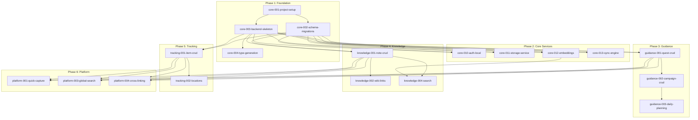

# Altair Spec Backlog

> **Ordered specifications** — What to spec next, with dependencies

---

## Quick Reference

| Component     | Prefix           | Scope                             |
| ------------- | ---------------- | --------------------------------- |
| **core**      | `core-NNN-`      | Infrastructure all apps depend on |
| **guidance**  | `guidance-NNN-`  | Quest/campaign management app     |
| **knowledge** | `knowledge-NNN-` | Note/wiki-link PKM app            |
| **tracking**  | `tracking-NNN-`  | Item/location inventory app       |
| **platform**  | `platform-NNN-`  | Cross-app features                |

---

## Status Legend

| Status | Meaning     |
| ------ | ----------- |
| ⬜     | Not started |
| 🟨     | In progress |
| 🟩     | Complete    |
| 🚫     | Blocked     |

---

## Phase 1: Foundation

> No dependencies — these can be worked in parallel

| Spec ID                      | Title                         | Weight      | Status | Notes                              |
| ---------------------------- | ----------------------------- | ----------- | ------ | ---------------------------------- |
| `core-001-project-setup`     | Monorepo & Build System       | STANDARD    | ⬜     | pnpm, Turborepo, folder structure  |
| `core-002-schema-migrations` | SurrealDB Schema & Migrations | STANDARD    | ⬜     | All tables, migration runner       |
| `core-003-backend-skeleton`  | Tauri Backend Service         | STANDARD    | ⬜     | Axum, Tauri commands, tauri-specta |
| `core-004-type-generation`   | Type Safety Pipeline          | LIGHTWEIGHT | ⬜     | tauri-specta setup, shared types   |

---

## Phase 2: Core Services

> Depends on: Phase 1 complete

| Spec ID                    | Title                 | Weight   | Status | Depends On         |
| -------------------------- | --------------------- | -------- | ------ | ------------------ |
| `core-010-auth-local`      | Local Authentication  | STANDARD | ⬜     | core-003           |
| `core-011-storage-service` | S3 Object Storage     | STANDARD | ⬜     | core-003           |
| `core-012-embeddings`      | Local ONNX Embeddings | STANDARD | ⬜     | core-003           |
| `core-013-sync-engine`     | Change Feed Sync      | FORMAL   | ⬜     | core-002, core-003 |

---

## Phase 3: Guidance MVP

> Depends on: core-002, core-003, core-010

| Spec ID                         | Title                           | Weight      | Status | Depends On         |
| ------------------------------- | ------------------------------- | ----------- | ------ | ------------------ |
| `guidance-001-quest-crud`       | Quest Create/Read/Update/Delete | STANDARD    | ⬜     | core-002, core-003 |
| `guidance-002-campaign-crud`    | Campaign Management             | STANDARD    | ⬜     | guidance-001       |
| `guidance-003-daily-planning`   | Energy-Based Planning           | STANDARD    | ⬜     | guidance-001       |
| `guidance-004-quest-completion` | Quest Completion Flow           | LIGHTWEIGHT | ⬜     | guidance-001       |

---

## Phase 4: Knowledge MVP

> Depends on: core-002, core-003, core-010, core-012

| Spec ID                    | Title                          | Weight   | Status | Depends On              |
| -------------------------- | ------------------------------ | -------- | ------ | ----------------------- |
| `knowledge-001-note-crud`  | Note Create/Read/Update/Delete | STANDARD | ⬜     | core-002, core-003      |
| `knowledge-002-wiki-links` | Bidirectional Wiki-Links       | STANDARD | ⬜     | knowledge-001           |
| `knowledge-003-folders`    | Folder Organization            | STANDARD | ⬜     | knowledge-001           |
| `knowledge-004-search`     | Hybrid Search (BM25 + Vector)  | STANDARD | ⬜     | knowledge-001, core-012 |

---

## Phase 5: Tracking MVP

> Depends on: core-002, core-003, core-010

| Spec ID                    | Title                          | Weight      | Status | Depends On         |
| -------------------------- | ------------------------------ | ----------- | ------ | ------------------ |
| `tracking-001-item-crud`   | Item Create/Read/Update/Delete | STANDARD    | ⬜     | core-002, core-003 |
| `tracking-002-locations`   | Location Hierarchy             | STANDARD    | ⬜     | core-002           |
| `tracking-003-quantity`    | Quantity Adjustments           | LIGHTWEIGHT | ⬜     | tracking-001       |
| `tracking-004-item-search` | Item Search & Filters          | STANDARD    | ⬜     | tracking-001       |

---

## Phase 6: Platform Features

> Depends on: At least one app MVP complete

| Spec ID                        | Title                      | Weight   | Status | Depends On                                    |
| ------------------------------ | -------------------------- | -------- | ------ | --------------------------------------------- |
| `platform-001-quick-capture`   | Quick Capture & Inbox      | FORMAL   | ⬜     | guidance-001 OR knowledge-001 OR tracking-001 |
| `platform-002-capture-routing` | AI-Assisted Classification | STANDARD | ⬜     | platform-001                                  |
| `platform-003-global-search`   | Cross-App Search           | STANDARD | ⬜     | guidance-001, knowledge-001, tracking-001     |
| `platform-004-cross-linking`   | Quest↔Note↔Item References | STANDARD | ⬜     | guidance-001, knowledge-001, tracking-001     |

---

## Phase 7: Sync & Multi-Device

> Depends on: At least one app MVP + core-013

| Spec ID                        | Title                    | Weight   | Status | Depends On         |
| ------------------------------ | ------------------------ | -------- | ------ | ------------------ |
| `core-020-offline-queue`       | Offline Operation Queue  | STANDARD | ⬜     | core-013           |
| `core-021-conflict-resolution` | LWW Conflict Handling    | STANDARD | ⬜     | core-013           |
| `core-022-cloud-sync`          | Cloud Backend Deployment | FORMAL   | ⬜     | core-013, core-020 |

---

## Phase 8: Mobile

> Depends on: Cloud sync working

| Spec ID                   | Title                | Weight   | Status | Depends On             |
| ------------------------- | -------------------- | -------- | ------ | ---------------------- |
| `core-030-mobile-app`     | Tauri Android App    | FORMAL   | ⬜     | core-022               |
| `core-031-mobile-sync`    | Mobile Sync Strategy | STANDARD | ⬜     | core-030, core-022     |
| `core-032-mobile-capture` | Mobile Quick Capture | STANDARD | ⬜     | core-030, platform-001 |

---

## Phase 9: Polish & Enhancement

> Depends on: All MVPs complete

| Spec ID                   | Title                   | Weight      | Status | Depends On    |
| ------------------------- | ----------------------- | ----------- | ------ | ------------- |
| `guidance-010-tags`       | Quest Tagging           | LIGHTWEIGHT | ⬜     | guidance-001  |
| `knowledge-010-tags`      | Note Tagging            | LIGHTWEIGHT | ⬜     | knowledge-001 |
| `tracking-010-tags`       | Item Tagging            | LIGHTWEIGHT | ⬜     | tracking-001  |
| `platform-010-tag-search` | Cross-App Tag Filtering | STANDARD    | ⬜     | \*-010-tags   |
| `knowledge-011-backlinks` | Backlinks Panel         | LIGHTWEIGHT | ⬜     | knowledge-002 |
| `core-040-oauth`          | OAuth Authentication    | STANDARD    | ⬜     | core-010      |
| `core-041-ai-providers`   | AI Provider Plugins     | STANDARD    | ⬜     | core-003      |

---

## Phase 10: Advanced Features

> Future — Not yet scheduled

| Spec ID                      | Title                   | Weight      | Status | Notes                |
| ---------------------------- | ----------------------- | ----------- | ------ | -------------------- |
| `tracking-020-attachments`   | Item Photos & Documents | STANDARD    | ⬜     | Needs core-011       |
| `knowledge-020-attachments`  | Note Attachments        | STANDARD    | ⬜     | Needs core-011       |
| `platform-020-location-auto` | Auto Location Tagging   | STANDARD    | ⬜     | Privacy-first design |
| `guidance-020-recurring`     | Recurring Quests        | STANDARD    | ⬜     | —                    |
| `guidance-021-templates`     | Quest Templates         | LIGHTWEIGHT | ⬜     | —                    |
| `knowledge-021-templates`    | Note Templates          | LIGHTWEIGHT | ⬜     | —                    |
| `core-050-backup-export`     | Data Backup & Export    | STANDARD    | ⬜     | —                    |
| `core-051-import`            | Data Import             | STANDARD    | ⬜     | From other apps      |

---

## Dependency Graph

---

## How to Use This Backlog

### Starting a New Spec

1. **Check dependencies** — Ensure all "Depends On" specs are complete
2. **Copy spec template** — Use the spec template from your workflow
3. **Name the file** — `specs/{spec-id}/spec.md`
4. **Update status** — Change ⬜ to 🟨 in this backlog
5. **Follow SDD workflow** — Spec → Plan → Tasks → Implement

### Completing a Spec

1. **Implementation complete** — All tasks done
2. **Update status** — Change 🟨 to 🟩 in this backlog
3. **Check unblocked specs** — Update any specs that were waiting on this one

### Adding New Specs

1. **Determine component** — core/guidance/knowledge/tracking/platform
2. **Assign next number** — Check existing specs in that component
3. **Add to appropriate phase** — Based on dependencies
4. **Document dependencies** — What must exist first?

---

## Notes

- **Phases are guidelines** — You can work on Phase 4 before Phase 3 is
  complete if dependencies allow
- **Weight determines effort** — LIGHTWEIGHT <2 days, STANDARD 2-10 days,
  FORMAL >10 days
- **Dependencies are hard requirements** — Don't skip them
- **Specs can be split** — If a spec grows too large, split it
