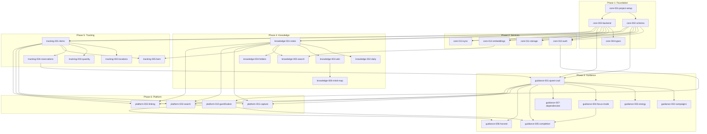

# Altair Spec Backlog

**Version**: 2.2
**Status**: APPROVED
**Created**: 2025-11-29
**Updated**: 2025-12-06
**Author**: Robert Hamilton

> **Ordered specifications with scope and references** — What to spec, what
> each covers, which docs to consult

---

## Quick Reference

### Component Prefixes

| Prefix       | Scope                                    |
| ------------ | ---------------------------------------- |
| `core-`      | Infrastructure all apps depend on        |
| `guidance-`  | Quest/campaign management (Guidance app) |
| `knowledge-` | Notes/PKM (Knowledge app)                |
| `tracking-`  | Items/inventory (Tracking app)           |
| `platform-`  | Cross-app features                       |

### Status Legend

| Status | Meaning     |
| ------ | ----------- |
| ⬜     | Not started |
| 🟨     | In progress |
| 🟩     | Complete    |
| 🚫     | Blocked     |

### Reference Documents

| Abbrev    | Document                    | Purpose                  |
| --------- | --------------------------- | ------------------------ |
| **REQ**   | `requirements.md`           | Full requirements        |
| **ARCH**  | `technical-architecture.md` | Technical design         |
| **DOM**   | `domain-model.md`           | Entities & relationships |
| **UF**    | `user-flows.md`             | User interactions        |
| **GLOSS** | `glossary.md`               | Terminology              |
| **DS**    | `design-system.md`          | UI/UX guidelines         |
| **ADR**   | `decision-log.md`           | Design decisions         |

---

## Phase 1: Foundation

> No dependencies — infrastructure setup

### core-001-project-setup

**Scope:** Monorepo structure, build system, tooling

| Attribute      | Value                   |
| -------------- | ----------------------- |
| **Weight**     | STANDARD                |
| **Status**     | 🟩                      |
| **References** | ARCH §Project Structure |

**Covers:**

- pnpm workspace configuration
- Turborepo build pipeline
- App scaffolding (guidance, knowledge, tracking, mobile)
- Package scaffolding (ui, bindings, db, sync, storage, search, editor)
- Shared TypeScript/ESLint/Prettier config
- Use `prek` for pre-commit linting, formatting, and type-checking

**Does NOT cover:**

- Actual app implementation
- Database schema
- UI components

---

### core-002-schema-migrations

**Scope:** SurrealDB schema definition and migration system

| Attribute      | Value                                       |
| -------------- | ------------------------------------------- |
| **Weight**     | STANDARD                                    |
| **Status**     | 🟩                                          |
| **Depends On** | core-001                                    |
| **References** | DOM (all entities), ARCH §Database, ADR-001 |

**Covers:**

- All table definitions (SCHEMAFULL)
- Field constraints and assertions
- Graph edge tables
- CHANGEFEED configuration (7d retention)
- Index definitions
- Migration runner (version tracking)
- Initial seed data (if any)

**Tables to define:**

```
Quest domain: campaign, quest, focus_session, energy_checkin
Knowledge domain: note, folder, daily_note
Inventory domain: item, location, reservation, maintenance_schedule
Capture domain: capture
Gamification domain: user_progress, achievement, streak
Shared domain: user, attachment, tag
Edges: contains, references, links_to, requires, stored_in, documents, reserved_for, blocks, has_attachment, tagged
```

---

### core-003-backend-skeleton

**Scope:** Tauri backend service foundation

| Attribute      | Value                                          |
| -------------- | ---------------------------------------------- |
| **Weight**     | STANDARD                                       |
| **Status**     | 🟩                                             |
| **Depends On** | core-001                                       |
| **References** | ARCH §Communication Patterns, ADR-003, ADR-008 |

**Covers:**

- Tauri 2.0 project setup
- Embedded SurrealDB initialization
- Tauri command registration pattern
- Error handling (ApiError type)
- State management (AppState)
- Logging/tracing setup
- Health check endpoint
- Configuration loading

**Does NOT cover:**

- Specific domain commands (quest CRUD, etc.)
- Sync, auth, embeddings

---

### core-004-type-generation

**Scope:** Type-safe Rust ↔ TypeScript boundary

| Attribute      | Value             |
| -------------- | ----------------- |
| **Weight**     | LIGHTWEIGHT       |
| **Status**     | 🟨                |
| **Depends On** | core-003          |
| **References** | ARCH §Type Safety |

**Covers:**

- tauri-specta integration
- Type generation pipeline
- packages/bindings output
- Build-time type checking
- Shared types (enums, structs)

---

## Phase 2: Core Services

> Depends on Phase 1

### core-010-auth-local

**Scope:** Local authentication and user management

| Attribute      | Value                 |
| -------------- | --------------------- |
| **Weight**     | STANDARD              |
| **Status**     | 🟩                    |
| **Depends On** | core-002, core-003    |
| **References** | ARCH §Auth, DOM §User |

**Covers:**

- Local user creation (single-user default)
- Password hashing (Argon2)
- Session management
- User preferences storage
- Auth plugin trait definition

**Does NOT cover:**

- OAuth (future: core-040)
- Multi-user/sharing

---

### core-011-storage-service

**Scope:** S3-compatible object storage

| Attribute      | Value                         |
| -------------- | ----------------------------- |
| **Weight**     | STANDARD                      |
| **Status**     | 🟩                            |
| **Depends On** | core-003                      |
| **References** | ARCH §Object Storage, ADR-004 |

**Covers:**

- Minio local setup
- aws-sdk-s3 integration
- Presigned URL generation
- Upload/download handlers
- Thumbnail generation (images, video)
- Checksum verification
- Storage quota tracking

---

### core-012-embeddings

**Scope:** Local ONNX embeddings for semantic search

| Attribute      | Value                     |
| -------------- | ------------------------- |
| **Weight**     | STANDARD                  |
| **Status**     | ⬜                        |
| **Depends On** | core-003                  |
| **References** | ARCH §Embeddings, ADR-005 |

**Covers:**

- ONNX runtime integration
- all-MiniLM-L6-v2 model loading
- Embedding generation API
- Background processing queue
- Batch embedding on startup
- Incremental embedding on save

---

### core-013-sync-engine

**Scope:** Change feed synchronization

| Attribute      | Value               |
| -------------- | ------------------- |
| **Weight**     | FORMAL              |
| **Status**     | ⬜                  |
| **Depends On** | core-002, core-003  |
| **References** | ARCH §Sync, ADR-007 |

**Covers:**

- Change feed polling
- LWW conflict resolution
- Offline queue management
- Sync status tracking
- Tombstone handling
- Delta sync protocol

---

## Phase 3: Guidance MVP

> QBA Board with 6 columns, energy, focus mode

### guidance-001-quest-crud

**Scope:** Quest entity operations with QBA board columns

| Attribute      | Value                                                        |
| -------------- | ------------------------------------------------------------ |
| **Weight**     | STANDARD                                                     |
| **Status**     | ⬜                                                           |
| **Depends On** | core-002, core-003                                           |
| **References** | REQ §1.1, DOM §Quest, UF §G-1 §G-2, GLOSS §QBA Board Columns |

**Covers:**

- Quest create/read/update/archive
- 6-column state machine (idea_greenhouse → harvested)
- Energy level (5-point: tiny → huge)
- Column limits enforcement (This Cycle=1, Next Up=5, WIP=1)
- Drag-and-drop column transitions
- Quest detail view
- Time estimates
- Tags
- Due dates (soft guidance)

**UI Components:**

- QBA Board (6-column Kanban)
- Quest Card
- Quick Add Quest modal
- Quest Detail panel

---

### guidance-002-campaign-crud

**Scope:** Campaign management

| Attribute      | Value                  |
| -------------- | ---------------------- |
| **Weight**     | STANDARD               |
| **Status**     | ⬜                     |
| **Depends On** | guidance-001           |
| **References** | DOM §Campaign, UF §G-4 |

**Covers:**

- Campaign create/read/update/archive
- Quest assignment to campaigns
- Campaign filtering on board
- Campaign color coding
- Campaign completion (archive quests)

---

### guidance-003-energy-checkin

**Scope:** Daily energy self-assessment

| Attribute      | Value                                                    |
| -------------- | -------------------------------------------------------- |
| **Weight**     | STANDARD                                                 |
| **Status**     | ⬜                                                       |
| **Depends On** | guidance-001, core-010                                   |
| **References** | REQ §1.3, DOM §EnergyCheckIn, UF §G-3, DS §Tangible Time |

**Covers:**

- Energy check-in entity
- 5-level selection UI
- Optional notes field
- Daily reminder (configurable time)
- Pattern recognition
- Energy filter on board
- Check-in XP award (5 XP)

---

### guidance-004-focus-mode

**Scope:** Zen Mode distraction-free interface

| Attribute      | Value                                                |
| -------------- | ---------------------------------------------------- |
| **Weight**     | FORMAL                                               |
| **Status**     | ⬜                                                   |
| **Depends On** | guidance-001                                         |
| **References** | REQ §1.2, DOM §FocusSession, UF §G-4, DS §Focus Mode |

**Covers:**

- Full-screen focus view
- Visual timer (progress bar, not just numbers)
- Pomodoro timer integration (configurable cycles)
- Quest step checkboxes (progressive disclosure)
- "On Deck" preview (Next Up queue)
- Session persistence (FocusSession entity)
- Pause/resume
- Auto-advance to next quest option
- Keyboard shortcuts (Space, Enter, Esc)
- XP award on completion (15 XP)

**UI Elements:**

- Level indicator
- Energy indicator
- Large completion button
- Visual progress bar

---

### guidance-005-quest-completion

**Scope:** Quest completion flow with celebration

| Attribute      | Value                                   |
| -------------- | --------------------------------------- |
| **Weight**     | LIGHTWEIGHT                             |
| **Status**     | ⬜                                      |
| **Depends On** | guidance-001, platform-010-gamification |
| **References** | UF §G-5, DOM §Gamification              |

**Covers:**

- Completion modal
- XP award display
- Optional notes/reflection
- Follow-up quest creation
- Link to note option
- Quick complete (skip modal)
- Achievement check trigger

---

### guidance-006-weekly-harvest

**Scope:** Weekly reflection and planning ritual

| Attribute      | Value                                   |
| -------------- | --------------------------------------- |
| **Weight**     | STANDARD                                |
| **Status**     | ⬜                                      |
| **Depends On** | guidance-001, platform-010-gamification |
| **References** | REQ §1.4, UF §G-6                       |

**Covers:**

- Weekly summary view
- Quest completion stats
- XP earned display
- Streak status
- Pattern analysis
- Archive old harvested quests
- Set This Cycle focus
- Optional reflection notes
- Configurable reminder (day/time)
- XP award (50 XP)

---

### guidance-007-quest-dependencies

**Scope:** Quest relationship graph (blocks/blocked by)

| Attribute      | Value                                       |
| -------------- | ------------------------------------------- |
| **Weight**     | STANDARD                                    |
| **Status**     | ⬜                                          |
| **Depends On** | guidance-001                                |
| **References** | REQ §1.6, DOM §blocks relationship, UF §G-7 |

**Covers:**

- Dependency edge (blocks)
- DAG visualization
- Layout options (tree, Gantt, force-directed)
- Critical path highlighting
- Blocked quest indicators
- Add/remove dependencies UI

---

## Phase 4: Knowledge MVP

> Daily notes, wiki-links, mind maps

### knowledge-001-note-crud

**Scope:** Note entity operations with TipTap editor

| Attribute      | Value                                 |
| -------------- | ------------------------------------- |
| **Weight**     | STANDARD                              |
| **Status**     | ⬜                                    |
| **Depends On** | core-002, core-003                    |
| **References** | REQ §2.1, DOM §Note, UF §K-1, ADR-013 |

**Covers:**

- Note create/read/update/archive
- TipTap editor with StarterKit
- `@tiptap/markdown` bidirectional markdown support
- `@tiptap/extension-code-block-lowlight` syntax highlighting
- `@aarkue/tiptap-math-extension` LaTeX math rendering
- `@syfxlin/tiptap-starter-kit` Mermaid diagram support
- Auto-save (500ms debounce)
- Version history
- Tags

**Editor Package (`packages/editor/`):**

```
packages/editor/
├── src/
│   ├── index.ts               # Editor factory
│   ├── extensions/
│   │   ├── WikiLink.ts        # Custom WikiLinks (knowledge-003)
│   │   └── index.ts
│   ├── utils/
│   │   └── markdown.ts
│   └── types.ts
├── package.json
└── tsconfig.json
```

**Dependencies:**

```json
{
  "@tiptap/core": "^3.11.0",
  "@tiptap/starter-kit": "^3.11.0",
  "@tiptap/markdown": "^3.11.0",
  "@tiptap/extension-code-block-lowlight": "^3.11.0",
  "@aarkue/tiptap-math-extension": "latest",
  "@syfxlin/tiptap-starter-kit": "latest",
  "lowlight": "^3.1.0",
  "katex": "^0.16.0",
  "mermaid": "^10.0.0"
}
```

**Does NOT cover:**

- WikiLinks (knowledge-003)
- Split view / plain markdown toggle (knowledge-001-enhanced)
- Daily notes (knowledge-002)

---

### knowledge-002-daily-notes

**Scope:** Auto-created daily note as entry point

| Attribute      | Value                             |
| -------------- | --------------------------------- |
| **Weight**     | LIGHTWEIGHT                       |
| **Status**     | ⬜                                |
| **Depends On** | knowledge-001                     |
| **References** | REQ §2.1, DOM §DailyNote, UF §K-1 |

**Covers:**

- DailyNote entity
- Auto-creation on app open
- Date-based title format
- Previous daily notes navigation
- Daily note sidebar

---

### knowledge-003-wiki-links

**Scope:** Bidirectional wiki-style linking with custom TipTap extension

| Attribute      | Value                                     |
| -------------- | ----------------------------------------- |
| **Weight**     | STANDARD                                  |
| **Status**     | ⬜                                        |
| **Depends On** | knowledge-001                             |
| **References** | REQ §2.3, DOM §links_to, UF §K-2, ADR-013 |

**Covers:**

- Custom WikiLink TipTap extension (`packages/editor/src/extensions/WikiLink.ts`)
- `[[Note Title]]` syntax parsing
- `[[note|Display Name]]` alias syntax
- Autocomplete popup via `@tiptap/suggestion` (triggers on `[[`)
- Create new note from link (if target doesn't exist)
- Bidirectional edge creation (`links_to` table)
- Backlinks panel UI
- Unlinked mentions detection
- Link navigation (click, Cmd+click split)
- Markdown round-trip serialization

**WikiLink Extension Implementation:**

```typescript
// Extension uses ProseMirror Suggestion plugin
WikiLink.configure({
  onWikiLinkClick: (title) => navigateToNote(title),
  renderSuggestion: (query) => searchNotes(query),
});
```

**Backend: Backlinks detection on save:**

```rust
// Extract wiki-links and create/update links_to edges
fn extract_wiki_links(markdown: &str) -> Vec<String> {
    // Regex: \[\[([^\]|]+)(?:\|[^\]]+)?\]\]
}
```

**Complexity Estimate:** ~3 days (reference: aarkue/tiptap-wikilink-extension)

---

### knowledge-004-folders

**Scope:** Optional hierarchical organization

| Attribute      | Value                |
| -------------- | -------------------- |
| **Weight**     | LIGHTWEIGHT          |
| **Status**     | ⬜                   |
| **Depends On** | knowledge-001        |
| **References** | DOM §Folder, UF §K-4 |

**Covers:**

- Folder create/rename/delete
- Nested folders
- Move notes to folder
- Folder sidebar
- Unfiled notes view
- Delete cascade options

---

### knowledge-005-search

**Scope:** Hybrid search (keyword + semantic)

| Attribute      | Value                                 |
| -------------- | ------------------------------------- |
| **Weight**     | STANDARD                              |
| **Status**     | ⬜                                    |
| **Depends On** | knowledge-001, core-012               |
| **References** | REQ §2.5, DOM §Hybrid Search, UF §K-4 |

**Covers:**

- BM25 keyword search
- Vector semantic search
- Hybrid mode (RRF fusion)
- Search modes toggle
- `~` prefix for semantic
- Filter by tags
- Result highlighting

---

### knowledge-006-mind-map

**Scope:** Graph visualization of relationships

| Attribute      | Value             |
| -------------- | ----------------- |
| **Weight**     | STANDARD          |
| **Status**     | ⬜                |
| **Depends On** | knowledge-003     |
| **References** | REQ §2.2, UF §K-3 |

**Covers:**

- Interactive node-based visualization
- Local graph (current note connections)
- Global graph (all notes)
- Node types (Note, Quest, Item, Tag)
- Color coding by type
- Zoom/pan navigation
- Force-directed layout
- Manual layout persistence
- Click node to navigate

---

### knowledge-007-auto-discovery

**Scope:** Automatic relationship suggestions

| Attribute      | Value                   |
| -------------- | ----------------------- |
| **Weight**     | STANDARD                |
| **Status**     | ⬜                      |
| **Depends On** | knowledge-001, core-012 |
| **References** | REQ §2.6                |

**Covers:**

- Semantic similarity detection (cosine > 0.7)
- Fuzzy title matching
- Smart aliasing ("RPi" ≈ "Raspberry Pi")
- Entity recognition
- Suggestion UI (non-intrusive)
- Accept/dismiss suggestions

---

## Phase 5: Tracking MVP

> Items, locations, reservations

### tracking-001-item-crud

**Scope:** Item entity operations

| Attribute      | Value                        |
| -------------- | ---------------------------- |
| **Weight**     | STANDARD                     |
| **Status**     | ⬜                           |
| **Depends On** | core-002, core-003           |
| **References** | REQ §3.1, DOM §Item, UF §T-1 |

**Covers:**

- Item create/read/update/archive
- Name, quantity, category
- Status (available, reserved, in_use, depleted)
- Photo attachments
- Custom fields
- Tags
- QR/barcode generation
- Item list view
- Item detail view

---

### tracking-002-locations

**Scope:** Hierarchical location management

| Attribute      | Value                  |
| -------------- | ---------------------- |
| **Weight**     | STANDARD               |
| **Status**     | ⬜                     |
| **Depends On** | core-002               |
| **References** | DOM §Location, UF §T-4 |

**Covers:**

- Location create/rename/delete
- Nested locations (tree)
- Location picker UI
- Move items between locations
- Geo coordinates (optional)
- Delete cascade options

---

### tracking-003-quantity

**Scope:** Quantity tracking and adjustments

| Attribute      | Value        |
| -------------- | ------------ |
| **Weight**     | LIGHTWEIGHT  |
| **Status**     | ⬜           |
| **Depends On** | tracking-001 |
| **References** | UF §T-2      |

**Covers:**

- Quantity adjustment UI
- Adjustment history
- Quick adjust buttons (+1, -1, +5, -5)
- Optional notes on adjustment
- Minimum 0 (item remains)

---

### tracking-004-reservations

**Scope:** Item reservation for quests

| Attribute      | Value                               |
| -------------- | ----------------------------------- |
| **Weight**     | STANDARD                            |
| **Status**     | ⬜                                  |
| **Depends On** | tracking-001, guidance-001          |
| **References** | REQ §3.2, DOM §Reservation, UF §T-2 |

**Covers:**

- Reservation entity (item, quest, quantity, status)
- Reserve from Quest (requires relationship)
- Reserve from Item
- Pending → Active → Released lifecycle
- Item status update based on reservations
- Available quantity calculation
- Release on quest completion

---

### tracking-005-bom-intelligence

**Scope:** Auto-detect item mentions (Bill of Materials)

| Attribute      | Value                       |
| -------------- | --------------------------- |
| **Weight**     | STANDARD                    |
| **Status**     | ⬜                          |
| **Depends On** | tracking-001, knowledge-001 |
| **References** | REQ §3.2, UF §T-3           |

**Covers:**

- Real-time text analysis
- Quantity pattern matching (2x, x2, two)
- Fuzzy item name matching
- Non-intrusive suggestion popup
- Create reservations from popup
- Add missing items (quantity 0)
- Dismiss/ignore suggestions

---

### tracking-006-maintenance

**Scope:** Maintenance schedules and reminders

| Attribute      | Value                                                 |
| -------------- | ----------------------------------------------------- |
| **Weight**     | STANDARD                                              |
| **Status**     | ⬜                                                    |
| **Depends On** | tracking-001                                          |
| **References** | REQ §3.2 (implied), DOM §MaintenanceSchedule, UF §T-4 |

**Covers:**

- MaintenanceSchedule entity
- Interval configuration (days, weeks, months)
- Due date calculation
- Reminder notifications
- Mark complete
- Snooze/skip
- Overdue indicator on items
- Dashboard widget

---

### tracking-007-search

**Scope:** Item search with filters

| Attribute      | Value        |
| -------------- | ------------ |
| **Weight**     | LIGHTWEIGHT  |
| **Status**     | ⬜           |
| **Depends On** | tracking-001 |
| **References** | UF §T-5      |

**Covers:**

- Full-text item search
- Category filter
- Location filter
- Status filter (in stock, etc.)
- Result display with quantity/location

---

## Phase 6: Platform Features

> Cross-app functionality

### platform-001-quick-capture

**Scope:** Multi-modal capture with deferred classification

| Attribute      | Value                                                            |
| -------------- | ---------------------------------------------------------------- |
| **Weight**     | FORMAL                                                           |
| **Status**     | ⬜                                                               |
| **Depends On** | guidance-001 OR knowledge-001 OR tracking-001                    |
| **References** | REQ §2.4, DOM §Capture, UF §QC-1 §QC-2, DS §Frictionless Capture |

**Covers:**

- Capture modes: text, voice, photo, video
- Video recording (2 min max, compression)
- Voice transcription (AI)
- Global hotkey trigger
- Zero-decision capture
- Pending captures badge
- Review interface
- AI classification suggestions
- Destination selection (Quest/Note/Item)
- Batch processing
- 30-day auto-archive
- Keyboard shortcuts (1/2/3/0)

---

### platform-002-global-search

**Scope:** Cross-app unified search

| Attribute      | Value                                     |
| -------------- | ----------------------------------------- |
| **Weight**     | STANDARD                                  |
| **Status**     | ⬜                                        |
| **Depends On** | guidance-001, knowledge-001, tracking-001 |
| **References** | DOM §Search, UF §X-1                      |

**Covers:**

- Omnibar UI
- Global hotkey (Cmd+Space)
- Results grouped by domain
- Domain filter syntax (in:quest)
- Tag filter syntax (#tag)
- Semantic search prefix (~)
- Navigate to result

---

### platform-003-cross-linking

**Scope:** Quest ↔ Note ↔ Item references

| Attribute      | Value                                     |
| -------------- | ----------------------------------------- |
| **Weight**     | STANDARD                                  |
| **Status**     | ⬜                                        |
| **Depends On** | guidance-001, knowledge-001, tracking-001 |
| **References** | DOM §Cross-Domain Relationships, UF §X-2  |

**Covers:**

- Link Note from Quest (references)
- Link Item from Quest (requires)
- Link Item from Note (documents)
- Linked entities panel
- Search and select UI
- Navigate to linked entity
- Backlinks display

---

### platform-010-gamification

**Scope:** XP, levels, achievements, streaks

| Attribute      | Value                                                     |
| -------------- | --------------------------------------------------------- |
| **Weight**     | STANDARD                                                  |
| **Status**     | ⬜                                                        |
| **Depends On** | core-010                                                  |
| **References** | REQ §1.5, DOM §Gamification, UF §X-2, GLOSS §Gamification |

**Covers:**

- UserProgress entity (xp_total, level)
- XP award system
- Level calculation
- Level titles
- Achievement entity
- Achievement unlock conditions
- Streak entity (daily, completion, focus)
- Streak grace period (24h)
- Gamification dashboard
- Celebration animations
- Opt-out setting

---

## Phase 7: Sync & Multi-Device

> Cloud synchronization

### core-020-offline-queue

**Scope:** Offline operation handling

| Attribute      | Value      |
| -------------- | ---------- |
| **Weight**     | STANDARD   |
| **Status**     | ⬜         |
| **Depends On** | core-013   |
| **References** | ARCH §Sync |

**Covers:**

- Operation queue for offline changes
- Queue persistence
- Retry with backoff
- Queue status UI
- Conflict detection

---

### core-021-conflict-resolution

**Scope:** LWW conflict handling

| Attribute      | Value    |
| -------------- | -------- |
| **Weight**     | STANDARD |
| **Status**     | ⬜       |
| **Depends On** | core-013 |
| **References** | ADR-007  |

**Covers:**

- LWW implementation
- Timestamp comparison
- Conflict logging
- Conflict notification (if desired)

---

### core-022-cloud-sync

**Scope:** Cloud backend deployment

| Attribute      | Value                         |
| -------------- | ----------------------------- |
| **Weight**     | FORMAL                        |
| **Status**     | ⬜                            |
| **Depends On** | core-013, core-020            |
| **References** | ARCH §Mobile↔Cloud, REQ §5.5 |

**Covers:**

- Cloud SurrealDB setup
- REST API for mobile
- WebSocket sync channel
- Authentication tokens
- TLS configuration
- Deployment automation

---

## Phase 8: Mobile

> Tauri Android app

### core-030-mobile-app

**Scope:** Tauri Android application

| Attribute      | Value                |
| -------------- | -------------------- |
| **Weight**     | FORMAL               |
| **Status**     | ⬜                   |
| **Depends On** | core-022             |
| **References** | REQ §5, ARCH §Mobile |

**Covers:**

- Tauri Android project
- Shared UI components
- Touch-optimized layouts
- Mobile navigation
- Camera integration
- Push notifications setup

---

### core-031-mobile-capture

**Scope:** Mobile-optimized capture

| Attribute      | Value                  |
| -------------- | ---------------------- |
| **Weight**     | STANDARD               |
| **Status**     | ⬜                     |
| **Depends On** | core-030, platform-001 |
| **References** | REQ §5.4               |

**Covers:**

- Quick capture widget
- Batch photo mode
- Voice capture
- NFC tag support (future)
- Location-based triggers

---

## Phase 9: Polish & Enhancement

> Tags, templates, additional features

### platform-020-tags

**Scope:** Cross-app tagging system

| Attribute      | Value                                     |
| -------------- | ----------------------------------------- |
| **Weight**     | STANDARD                                  |
| **Status**     | ⬜                                        |
| **Depends On** | guidance-001, knowledge-001, tracking-001 |
| **References** | DOM §Tags, ADR-012                        |

**Covers:**

- Tag entity
- Tag CRUD
- Namespaced tags
- Tag autocomplete
- Filter by tag
- Tag management UI

---

### knowledge-020-templates

**Scope:** Note templates

| Attribute      | Value         |
| -------------- | ------------- |
| **Weight**     | LIGHTWEIGHT   |
| **Status**     | ⬜            |
| **Depends On** | knowledge-001 |
| **References** | REQ §2.1      |

**Covers:**

- Template entity
- Template CRUD
- Insert template on new note
- Template picker

---

### guidance-020-recurring

**Scope:** Recurring quests

| Attribute      | Value        |
| -------------- | ------------ |
| **Weight**     | STANDARD     |
| **Status**     | ⬜           |
| **Depends On** | guidance-001 |
| **References** | —            |

**Covers:**

- Recurrence pattern (daily, weekly, monthly)
- Auto-create new quest
- Skip/complete handling
- Recurrence UI

---

### core-040-oauth

**Scope:** OAuth authentication

| Attribute      | Value                       |
| -------------- | --------------------------- |
| **Weight**     | STANDARD                    |
| **Status**     | ⬜                          |
| **Depends On** | core-010                    |
| **References** | ARCH §Auth plugins, ADR-006 |

**Covers:**

- OAuth plugin implementation
- Google provider
- GitHub provider
- Provider selection UI

---

### core-041-ai-providers

**Scope:** AI provider plugins

| Attribute      | Value                     |
| -------------- | ------------------------- |
| **Weight**     | STANDARD                  |
| **Status**     | ⬜                        |
| **Depends On** | core-003                  |
| **References** | ARCH §AI plugins, ADR-006 |

**Covers:**

- AI provider trait
- Claude provider
- OpenAI provider
- Ollama provider (local)
- Provider settings UI
- Rate limit configuration

---

## Phase 10: Advanced

> Future features

### tracking-020-attachments

**Scope:** Item photos and documents

| Attribute      | Value                  |
| -------------- | ---------------------- |
| **Weight**     | STANDARD               |
| **Status**     | ⬜                     |
| **Depends On** | tracking-001, core-011 |

---

### knowledge-021-canvas

**Scope:** Whiteboard/canvas mode

| Attribute      | Value         |
| -------------- | ------------- |
| **Weight**     | FORMAL        |
| **Status**     | ⬜            |
| **Depends On** | knowledge-006 |
| **References** | REQ §2.3      |

---

### core-050-backup-export

**Scope:** Data backup and export

| Attribute      | Value    |
| -------------- | -------- |
| **Weight**     | STANDARD |
| **Status**     | ⬜       |
| **Depends On** | core-002 |

---

---

## Dependency Graph



---

## How to Use This Backlog

### Starting a New Spec

1. **Check dependencies** — Ensure all "Depends On" specs are complete
2. **Read reference docs** — All documents listed in References
3. **Copy spec template** — `specs/template.md`
4. **Name the spec folder** — `specs/{spec-id}/spec.md`
5. **Update status**
6. Change the previous spec from 🟨 to 🟩 in this backlog, if not done already
7. Change the current spec from ⬜ to 🟨 in this backlog
8. **Follow SDD** — Spec → Plan → Tasks → Implement

### Reference Doc Priority

When writing a spec, read docs in this order:

1. **REQ** — What the feature should do (source of truth)
2. **DOM** — Entity definitions and relationships
3. **UF** — User interactions and UI patterns
4. **DS** — Visual and UX guidelines
5. **ARCH** — Technical constraints
6. **ADR** — Relevant design decisions
7. **GLOSS** — Terminology to use
