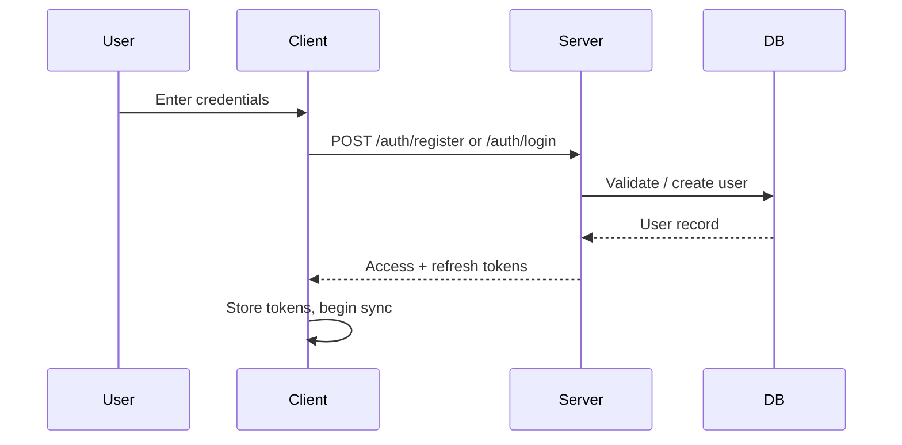
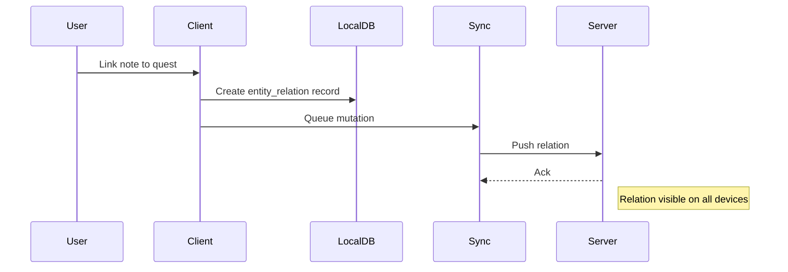
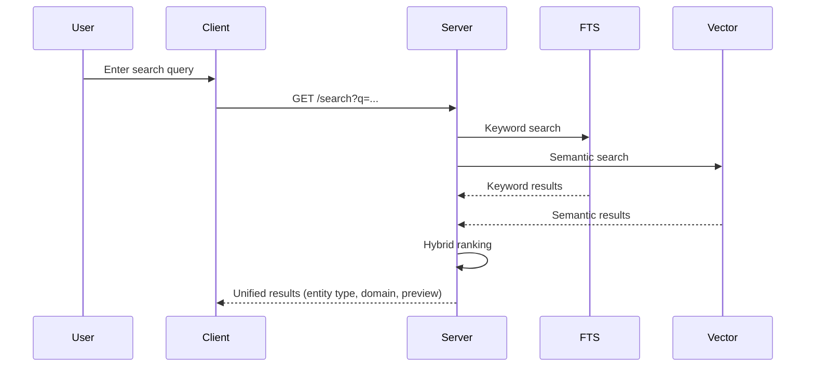

# PRD-001: Core Platform

| Field | Value |
|---|---|
| **Document** | 01-PRD-001-core |
| **Version** | 1.0 |
| **Status** | Draft |
| **Last Updated** | 2026-04-12 |
| **Source Docs** | `docs/altair-core-prd.md`, `docs/altair-architecture-spec.md`, `docs/altair-shared-contracts-spec.md` |

---

## Overview

The Core Platform provides the shared foundation that all Altair domains depend on: identity, synchronization, attachments, search, tags, entity relationships, and the shared contracts layer. Without Core, Guidance, Knowledge, and Tracking are disconnected silos.

---

## Problem Statement

Users need a single system that connects their goals, notes, and household inventory. Existing tools are fragmented — a task app, a note app, an inventory spreadsheet — with no shared search, no cross-domain linking, and no offline-first sync. The Core Platform solves this by providing the unified infrastructure that makes cross-domain integration possible.

---

## Goals

### P0 — Must Have
- G-C-1: User authentication (local username/password)
- G-C-2: Per-user data isolation on shared server instances
- G-C-3: Offline-first sync with conflict detection and no silent data loss
- G-C-4: Cross-domain entity relationship graph
- G-C-5: Universal tagging system across all domains
- G-C-6: Attachment support (images, audio, documents) on any entity
- G-C-7: Cross-app search across all domains

### P1 — Should Have
- G-C-8: Household membership and shared data scopes
- G-C-9: Universal inbox for cross-domain triage
- G-C-10: OIDC authentication support
- G-C-11: Semantic/vector search alongside keyword FTS

### P2 — Nice to Have
- G-C-12: Two-factor authentication
- G-C-13: Plugin/automation API for third-party integrations
- G-C-14: Shared design token package across all clients

---

## Key Concepts

### Identity
Users authenticate locally or via hosted service. Argon2id password hashing. Refresh/access token model.

### Sync
Clients record mutations as operations in an outbox, then synchronize them to the server. PowerSync mediates bidirectional replication. See `docs/altair-powersync-sync-spec.md` for stream design.

### Entity Relations
A polymorphic `entity_relations` table allows any entity to link to any other entity with typed relationships (`references`, `supports`, `requires`, `related_to`, etc.). This enables cross-domain graph queries without a graph database.

### Shared Contracts
A registry-first approach: canonical identifiers for entity types, relation types, and sync streams live in machine-readable JSON files and are generated into TypeScript, Kotlin, and Rust constants. See `docs/altair-shared-contracts-spec.md`.

---

## User Personas

### Solo Power User
Individual who manages personal goals, notes, and household inventory. Primary device is Android for daily capture, web for planning and review.

### Household Member
Part of a shared household. Uses shared shopping lists, chore quests, and tracking locations. Needs real-time sync of shared data.

### Self-Hoster
Runs their own Altair instance via Docker Compose. Requires straightforward deployment, no cloud dependencies, full data ownership.

---

## Use Cases

### UC-C-1: User Registration and Login

### UC-C-2: Cross-Domain Entity Linking

### UC-C-3: Cross-App Search

---

## Testable Assertions

- A-001: A user can register, log in, and receive valid tokens within 1s
- A-002: Data created by user A is never visible to user B on the same server instance
- A-003: A mutation created offline is synced to the server within 10s of connectivity restoration
- A-004: If two devices edit the same record offline, the server detects a conflict and does not silently overwrite
- A-005: An entity_relation linking a note to a quest is queryable from both the Knowledge and Guidance views
- A-006: A tag applied to a quest is visible when searching from the Knowledge or Tracking domain
- A-007: An attachment uploaded on Android is downloadable on web after sync completes
- A-008: Cross-app search returns results from all three domains in a single result set
- A-009: Household members see shared quests, shopping lists, and tracking items after joining

---

## Functional Requirements

| ID | Requirement | Priority | Assertions |
|---|---|---|---|
| FR-1.1 | Username/password registration and login with Argon2id hashing | P0 | A-001 |
| FR-1.2 | Per-user data isolation enforced at the query layer | P0 | A-002 |
| FR-1.3 | Operation-based sync with outbox, checkpoints, and conflict detection | P0 | A-003, A-004 |
| FR-1.4 | Polymorphic entity_relations table with typed relationships | P0 | A-005 |
| FR-1.5 | Universal tagging with tag-to-entity junction tables | P0 | A-006 |
| FR-1.6 | Attachment metadata in DB, binaries in object storage, background upload | P0 | A-007 |
| FR-1.7 | Full-text search across all domains with entity type, domain, and preview in results | P0 | A-008 |
| FR-1.8 | Household creation, membership invitations, shared data scopes | P1 | A-009 |
| FR-1.9 | Universal inbox for cross-domain triage items | P1 | — |
| FR-1.10 | OIDC login support | P1 | — |
| FR-1.11 | Semantic/vector search with hybrid ranking | P1 | — |

---

## Non-Functional Requirements

| ID | Requirement | Target |
|---|---|---|
| NFR-1.1 | Local actions (read, write, navigate) | < 200ms |
| NFR-1.2 | Remote actions (sync, search, upload) | < 1s |
| NFR-1.3 | Tolerate intermittent connectivity | Offline writes always succeed locally |
| NFR-1.4 | Self-hosted deployment via Docker Compose | Single `docker compose up` |
| NFR-1.5 | Per-user tenant isolation | No data leakage under concurrent load |

---

## UI Requirements

All UI across Altair follows the **"Digital Sanctuary / Ethereal Canvas"** design system defined in [`./DESIGN.md`](../../DESIGN.md):

- **No-line rule**: Visual hierarchy through tonal shifts and negative space, not borders
- **Color system**: Dual-mode (light/dark) with the signature teal-to-aqua gradient for primary CTAs
- **Typography**: Manrope for Display/Headline, Plus Jakarta Sans for Body/Label/UI
- **Transitions**: 300ms `cubic-bezier(0.4, 0, 0.2, 1)` for all state changes
- **Error states**: Sophisticated Terracotta (`#9f403d`), never alert red

---

## Data Requirements

### Entity Types (from shared contracts registry)

**Core:** `user`, `household`, `initiative`, `tag`, `attachment`

### Relation Types
`references`, `supports`, `requires`, `related_to`, `depends_on`, `duplicates`, `similar_to`, `generated_from`

### Relation Sources
`user`, `ai`, `import`, `rule`, `migration`, `system`

### Relation Statuses
`accepted`, `suggested`, `dismissed`, `rejected`, `expired`

See `docs/altair-shared-contracts-spec.md` for the full registry.

---

## Invariants

- **I-C-1**: Sync conflicts must never silently lose data (see `03-invariants.md` S-1)
- **I-C-2**: Per-user data isolation must be enforced at every query path (see `03-invariants.md` SEC-1)
- **I-C-3**: Entity type identifiers must come from the canonical registry — no inline magic strings (see `03-invariants.md` C-1)
- **I-C-4**: Attachment binaries must never flow through the sync engine (see `03-invariants.md` S-5)

---

## State Machines

- **Attachment processing**: `pending` → `uploaded` → `processing` → `ready` | `failed` | `deleted` (see `06-state-machines.md`)
- **Entity relation status**: `suggested` → `accepted` | `dismissed` | `rejected` | `expired` (see `06-state-machines.md`)
- **Sync mutation lifecycle**: `queued` → `sending` → `acked` | `conflicted` | `failed` (see `06-state-machines.md`)

---

## Integration Points

| System | Interface | Direction |
|---|---|---|
| PowerSync | Sync streams, CRUD upload endpoint | Bidirectional |
| PostgreSQL | sqlx queries from Axum services | Server → DB |
| Object Storage | S3-compatible API for attachment binaries | Server → Storage |
| Search Index | Async indexing jobs, hybrid query API | Server ↔ Index |
| AI Service | Optional job-based enrichment | Server → AI |

---

## Success Metrics

- Zero silent data loss incidents in sync
- < 200ms local action latency on Tier 1 platforms
- < 1s sync round-trip on stable connection
- Cross-app search returns relevant results from all domains

---

## Dependencies

- PostgreSQL instance (server)
- PowerSync service (sync layer)
- S3-compatible object storage (attachments)
- SQLite / Room (Android local), PowerSync JS SDK (web local)

---

## Open Questions

- OQ-C-1: Should household invitations use email or invite codes?
- OQ-C-2: What is the conflict resolution UX for non-trivial merge conflicts?
- OQ-C-3: Should the universal inbox be a separate sync stream or derived client-side?
- OQ-C-4: What quotas (storage, entity count) should a self-hosted instance enforce?
