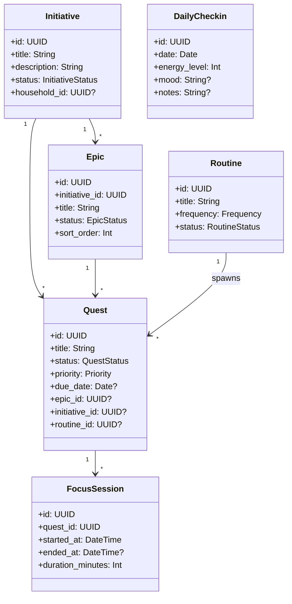
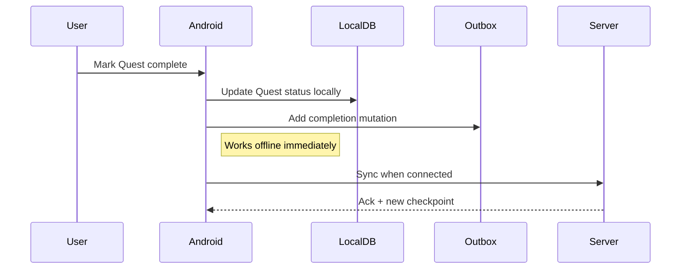
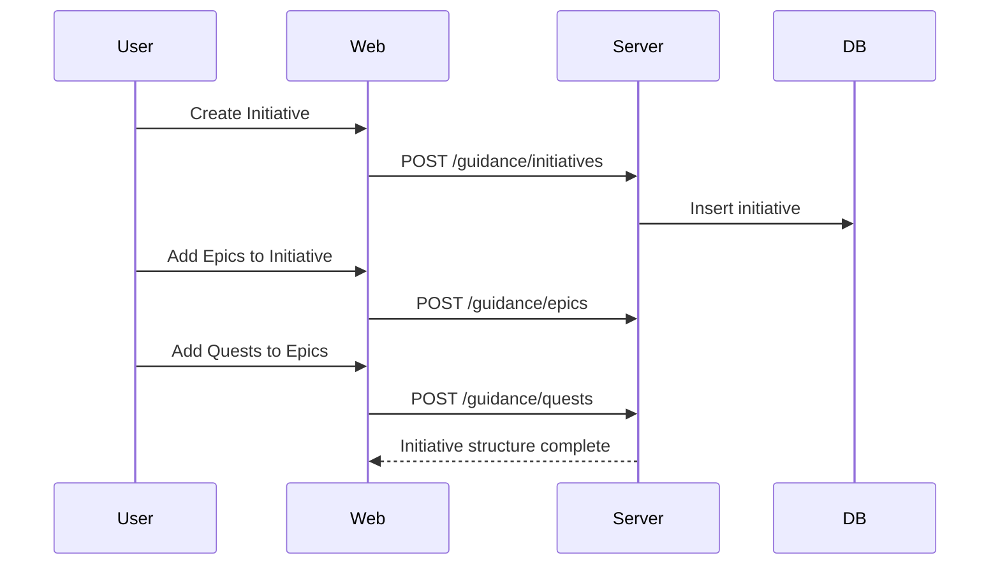
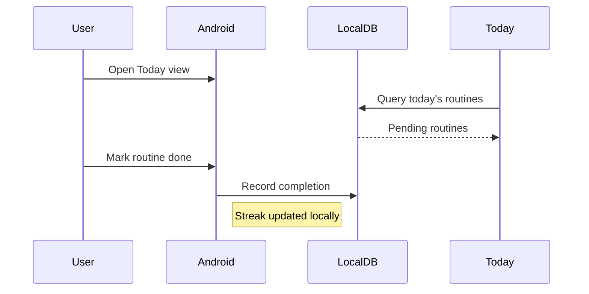

# PRD-002: Guidance Domain

| Field | Value |
|---|---|
| **Document** | 01-PRD-002-guidance |
| **Version** | 1.0 |
| **Status** | Draft |
| **Last Updated** | 2026-04-12 |
| **Source Docs** | `docs/altair-guidance-prd.md`, `docs/altair-architecture-spec.md`, `docs/altair-schema-design-spec.md` |

---

## Overview

Guidance helps users translate long-term goals into daily actions through structured planning. It provides the motivational backbone of Altair — the answer to "what should I do today?" and "am I making progress on things that matter?"

---

## Problem Statement

People set goals but lose track of them in the noise of daily life. Existing task apps are flat lists with no hierarchy or reflection capability. Users need a system that connects long-term aspirations to daily actionable work, supports recurring habits, and enables honest reflection on progress.

---

## Goals

### P0 — Must Have
- G-G-1: Create and manage Initiatives (structured efforts toward goals)
- G-G-2: Break Initiatives into Epics (milestones) and Quests (discrete tasks)
- G-G-3: Define Routines (recurring habits/behaviors) with frequency scheduling
- G-G-4: Present a "Today" view with today's quests and routines
- G-G-5: Mark quests complete (works offline)
- G-G-6: Daily check-in for energy/mood reflection

### P1 — Should Have
- G-G-7: Focus sessions (timed work blocks tied to quests)
- G-G-8: Weekly/monthly reflection and progress review
- G-G-9: Quest priority and energy-level matching
- G-G-10: Initiative progress visualization

### P2 — Nice to Have
- G-G-11: AI-suggested quest extraction from notes
- G-G-12: Automation rules (e.g., low stock → create restock quest)
- G-G-13: Streak tracking for routines

---

## Key Concepts

### Initiative
A structured effort toward a long-term goal. Groups epics, quests, notes, and items under a shared purpose. Can be personal or shared within a household.

### Epic
A milestone within an initiative. Groups related quests into a coherent deliverable phase.

### Quest
A discrete actionable unit. The atomic work item in Altair. Can be standalone or grouped under an epic/initiative. Has status, priority, due date, and energy level.

### Routine
A recurring habit or behavior with a defined frequency (daily, weekly, specific days). Generates quest-like completion entries on each occurrence.

### Focus Session
A timed work block tied to a quest. Tracks focused effort duration.

### Daily Check-in
A daily reflection capturing energy level, mood, and brief notes. Feeds into the guidance engine for better daily planning.

---

## User Personas

### The Structured Planner
Sets quarterly initiatives, breaks them into epics and quests, reviews weekly. Uses web for planning, Android for daily execution.

### The Habit Builder
Relies heavily on routines. Checks off daily habits on Android, reviews streaks on web. Needs the "Today" view to be fast and focused.

### The Reflective User
Values daily check-ins and weekly reviews. Wants to see progress over time and adjust course based on energy patterns.

---

## Use Cases

### UC-G-1: Daily Task Completion (Offline)

### UC-G-2: Initiative Planning

### UC-G-3: Routine Completion

---

## Testable Assertions

- A-010: A quest marked complete on Android appears complete on web after sync
- A-011: The "Today" view shows all quests due today plus all routines scheduled for today
- A-012: An initiative's progress reflects the completion ratio of its child quests
- A-013: A routine with daily frequency appears in Today every day
- A-014: A daily check-in can be submitted offline and syncs when connected
- A-015: Focus session duration is accurately recorded even if the app is backgrounded
- A-016: Quests can be filtered by priority and energy level
- A-017: Completing a quest offline does not block or delay other local operations

---

## Functional Requirements

| ID | Requirement | Priority | Assertions |
|---|---|---|---|
| FR-2.1 | CRUD for Initiatives with title, description, status, optional household scope | P0 | — |
| FR-2.2 | CRUD for Epics within an Initiative, with sort order | P0 | — |
| FR-2.3 | CRUD for Quests with status, priority, due date, epic/initiative assignment | P0 | A-010, A-017 |
| FR-2.4 | CRUD for Routines with frequency configuration (daily, weekly, specific days) | P0 | A-013 |
| FR-2.5 | Today view aggregating due quests and scheduled routines | P0 | A-011 |
| FR-2.6 | Offline quest completion with outbox sync | P0 | A-010, A-017 |
| FR-2.7 | Daily check-in submission (energy, mood, notes) | P0 | A-014 |
| FR-2.8 | Focus session start/stop/duration tracking | P1 | A-015 |
| FR-2.9 | Initiative progress visualization | P1 | A-012 |
| FR-2.10 | Quest priority and energy-level filtering | P1 | A-016 |
| FR-2.11 | Weekly/monthly progress review views | P1 | — |

---

## Non-Functional Requirements

| ID | Requirement | Target |
|---|---|---|
| NFR-2.1 | Today view render time | < 200ms from local DB |
| NFR-2.2 | Quest completion latency | < 100ms local write |
| NFR-2.3 | Routine scheduling accuracy | Correct day-of-week matching across timezones |

---

## UI Requirements

Guidance screens follow the [`./DESIGN.md`](../../DESIGN.md) system:

- **Today view**: Cards for each quest/routine on Gossamer White (`#ffffff`) over Pale Seafoam Mist (`#f0f4f5`). Completion state toggles use the signature gradient CTA style.
- **Initiative planning**: Asymmetric layout — wide content panel for epic/quest tree, narrow metadata strip for initiative details.
- **Check-in**: Minimal input form, energy level as "The Pulse" progress indicator (Dusty Mineral Blue track, Deep Muted Teal-Navy fill).
- **Focus mode**: Active focus session dims surrounding UI to Soft Slate Haze (`#cfddde`), focused container scales to 1.02x.

---

## Data Requirements

### Entity Types
`guidance_epic`, `guidance_quest`, `guidance_routine`, `guidance_focus_session`, `guidance_daily_checkin`

### Sync Strategy
- Quests and routines: auto-subscribed (always available offline)
- Epics: on-demand via `initiative_detail` stream
- Focus sessions and daily check-ins: selective/on-demand (can grow large)

---

## Invariants

- **I-G-1**: A quest's initiative_id must reference a valid initiative owned by the same user or household (see `03-invariants.md` E-3)
- **I-G-2**: Routine frequency must produce at least one scheduled occurrence per period (see `03-invariants.md` E-4)
- **I-G-3**: Quest status transitions must follow the defined state machine (see `06-state-machines.md`)

---

## State Machines

- **Quest status**: `not_started` → `in_progress` → `completed` | `cancelled` | `deferred` (see `06-state-machines.md`)
- **Initiative status**: `draft` → `active` → `completed` | `paused` | `archived` (see `06-state-machines.md`)
- **Epic status**: `not_started` → `in_progress` → `completed` (see `06-state-machines.md`)
- **Routine status**: `active` → `paused` | `archived` (see `06-state-machines.md`)

---

## Integration Points

| System | Interface | Notes |
|---|---|---|
| Core / Tags | Tag quests, initiatives | Via universal tagging system |
| Core / Relations | Link quests to notes, items | Via entity_relations |
| Knowledge | Note references quest | Cross-domain relationship |
| Tracking | Low stock → create restock quest | Automation rule (P2) |
| Notifications | Routine due, timer complete | Via notification subsystem |

---

## Success Metrics

- Users complete > 60% of daily quests shown in Today view
- Average time from app open to first quest completion < 10s on Android
- Daily check-in completion rate > 50% among active users

---

## Open Questions

- OQ-G-1: Should quests support subtasks, or should that be modeled as quest-to-quest relations?
- OQ-G-2: How should routine "streaks" be calculated across timezone changes?
- OQ-G-3: Should the Today view algorithmically sort by priority/energy or let users drag-sort?
