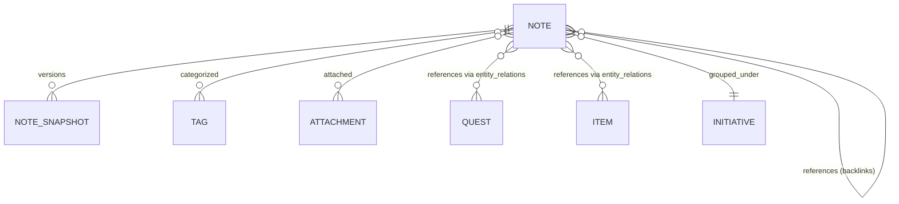
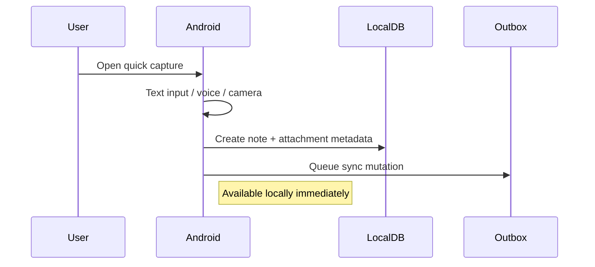
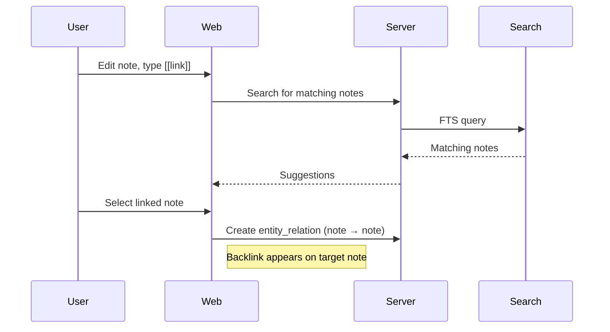
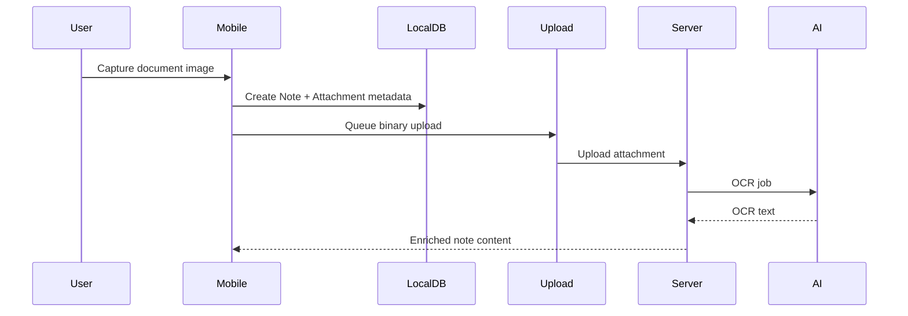

# PRD-003: Knowledge Domain

| Field | Value |
|---|---|
| **Document** | 01-PRD-003-knowledge |
| **Version** | 1.0 |
| **Status** | Draft |
| **Last Updated** | 2026-04-12 |
| **Source Docs** | `docs/altair-knowledge-prd.md`, `docs/altair-architecture-spec.md`, `docs/altair-schema-design-spec.md` |

---

## Overview

Knowledge provides a persistent personal knowledge base. Notes are the primary information unit — text, voice, images, and imported documents. Notes link to each other and to entities in other domains via the entity relationship graph, forming an evolving web of personal knowledge.

---

## Problem Statement

Personal knowledge is scattered across apps — a notes app, a bookmarks folder, random screenshots, voice memos that never get transcribed. Users need a single capture-first system where information can be quickly stored, then organized and connected over time. The system must support discovery through search, backlinks, and relationship graphs — not just folder hierarchies.

---

## Goals

### P0 — Must Have
- G-K-1: Create and edit text notes
- G-K-2: Tag notes for organization
- G-K-3: Search notes by keyword (full-text)
- G-K-4: Link notes to other notes (backlinks)
- G-K-5: Link notes to quests, items, and initiatives via entity relations
- G-K-6: Offline note creation and editing

### P1 — Should Have
- G-K-7: Image capture and attachment to notes
- G-K-8: Voice note capture with audio attachment
- G-K-9: Document import (PDF, etc.)
- G-K-10: Note snapshots (version history)
- G-K-11: Semantic search across notes

### P2 — Nice to Have
- G-K-12: OCR/transcription of image and audio attachments
- G-K-13: AI-suggested note links and summaries
- G-K-14: Graph visualization of note relationships
- G-K-15: Markdown or rich-text editing

---

## Key Concepts

### Note
The primary information unit. Contains text content, optional attachments, tags, and relationships to other entities. Notes can reference other notes, creating a bidirectional link graph.

### Note Snapshot
A versioned snapshot of a note's content at a point in time. Used for version history and conflict resolution during sync.

### Backlink
When note A references note B, note B automatically shows a backlink to note A. This enables bottom-up discovery — you don't need to organize notes into folders ahead of time.

---

## User Personas

### The Quick Capturer
Grabs information on the go — text, photos, voice. Organizes later. Needs frictionless capture on Android and fast sync.

### The Knowledge Gardener
Regularly revisits and connects notes. Uses backlinks and tags to build a web of knowledge. Prefers web for deep editing.

### The Researcher
Searches across all notes, quests, and items. Relies on cross-domain search and semantic discovery. Values graph views.

---

## Use Cases

### UC-K-1: Quick Note Capture (Android)

### UC-K-2: Note Linking and Discovery (Web)

### UC-K-3: Knowledge Capture with Image + OCR

<!-- INFERRED: verify this flow against actual AI pipeline design -->

---

## Testable Assertions

- A-018: A note created offline on Android is searchable on web after sync
- A-019: A backlink from note A to note B appears in note B's backlinks list
- A-020: A note linked to a quest via entity_relation is discoverable from the Guidance domain search
- A-021: Note snapshots preserve the content at the time of capture
- A-022: Tags applied to a note are searchable and filterable
- A-023: Full-text search across notes returns results within 1s
- A-024: An image attachment created on Android is viewable on web after sync + upload

---

## Functional Requirements

| ID | Requirement | Priority | Assertions |
|---|---|---|---|
| FR-3.1 | CRUD for notes with text content | P0 | A-018 |
| FR-3.2 | Note tagging via universal tag system | P0 | A-022 |
| FR-3.3 | Full-text search across notes | P0 | A-023 |
| FR-3.4 | Note-to-note linking with bidirectional backlinks | P0 | A-019 |
| FR-3.5 | Cross-domain linking via entity_relations | P0 | A-020 |
| FR-3.6 | Offline note creation and editing | P0 | A-018 |
| FR-3.7 | Image capture and attachment | P1 | A-024 |
| FR-3.8 | Voice note capture with audio attachment | P1 | — |
| FR-3.9 | Document import (PDF) | P1 | — |
| FR-3.10 | Note snapshots for version history | P1 | A-021 |
| FR-3.11 | Semantic search | P1 | — |
| FR-3.12 | OCR/transcription pipeline for attachments | P2 | — |
| FR-3.13 | AI-suggested links and summaries | P2 | — |

---

## Non-Functional Requirements

| ID | Requirement | Target |
|---|---|---|
| NFR-3.1 | Note creation latency | < 100ms local write |
| NFR-3.2 | Full-text search response | < 1s |
| NFR-3.3 | Backlink indexing | Visible within same sync cycle |

---

## UI Requirements

Knowledge screens follow the [`./DESIGN.md`](../../DESIGN.md) system:

- **Note editor**: Wide content area on Gossamer White, metadata strip in Pale Seafoam Mist. No borders — content zones defined by tonal shift.
- **Backlinks section**: Below note content, tags and linked entities displayed as chips with Dusty Mineral Blue (`#dae5e6`) or Sky-Washed Aqua (`#c7e7fa`) backgrounds, all-caps label treatment.
- **Search results**: Each result shows entity type, domain origin, preview snippet. Results rendered as standard cards with rounded-2xl corners.
- **Quick capture**: Minimal input surface, pill-shaped with embedded icon, Cool Linen Gray (`#e9eff0`) inactive background.

---

## Data Requirements

### Entity Types
`knowledge_note`, `knowledge_note_snapshot`

### Sync Strategy
- Notes: on-demand via `note_detail` stream (not all notes auto-synced)
- Note tags and attachments: on-demand with note detail
- Note snapshots: selective (can grow large)

---

## Invariants

- **I-K-1**: A backlink must be symmetric — if note A references note B, note B's backlinks include note A (see `03-invariants.md` E-5)
- **I-K-2**: Note snapshots must be immutable once created (see `03-invariants.md` E-6)
- **I-K-3**: Note text content must survive sync conflict without silent loss (see `03-invariants.md` S-1)

---

## State Machines

Notes do not have a complex lifecycle — they are either `active` or `deleted` (soft delete). Note snapshots are immutable.

<!-- TODO: Define note editing lock state if collaborative editing is added -->

---

## Integration Points

| System | Interface | Notes |
|---|---|---|
| Core / Tags | Tag notes | Via universal tagging system |
| Core / Relations | Link notes to quests, items, initiatives | Via entity_relations |
| Core / Attachments | Image, audio, document attachments | Via attachment subsystem |
| Core / Search | Full-text and semantic note search | Via search service |
| Guidance | Note references quest | Cross-domain relationship |
| Tracking | Note references item | Cross-domain relationship |
| AI | OCR, transcription, suggested links | Optional enrichment pipeline |

---

## Success Metrics

- Note capture to local availability < 200ms
- Users create > 3 cross-domain links per week (indicating integration value)
- Search recall covers notes, quests, and items in a single query

---

## Open Questions

- OQ-K-1: Should notes support rich text / Markdown, or is plain text sufficient for v1?
- OQ-K-2: How should note-to-note links be rendered in the editor (inline, sidebar, graph)?
- OQ-K-3: Should note snapshots be automatic (on edit) or manual (user-triggered)?
- OQ-K-4: What conflict resolution strategy for concurrent text edits — conflict copies or CRDT merge?
