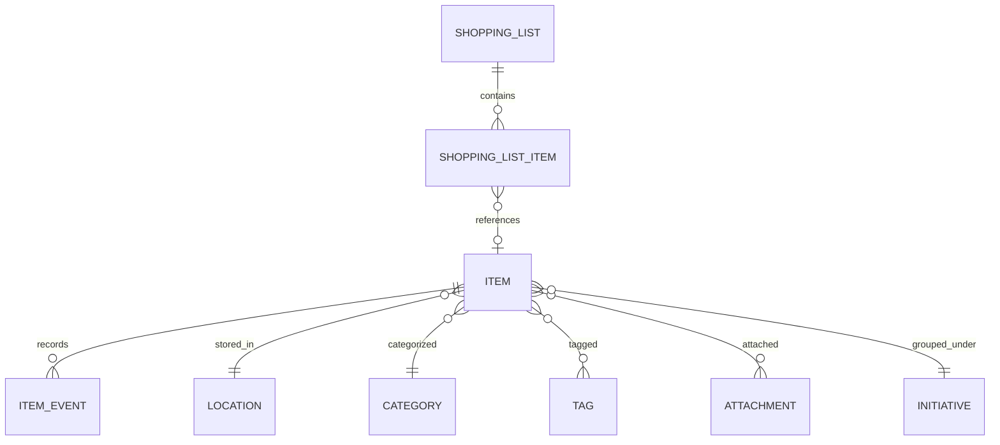
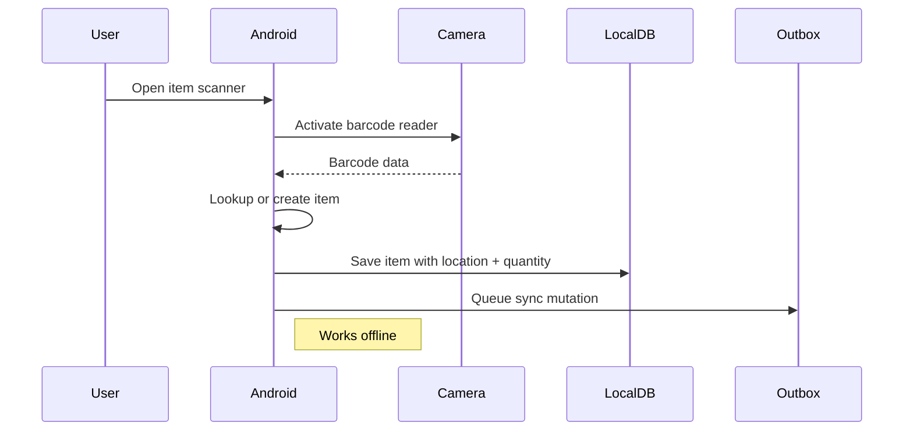
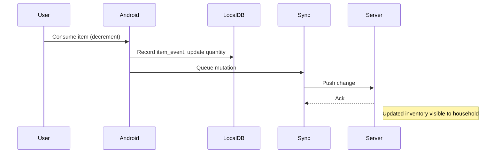
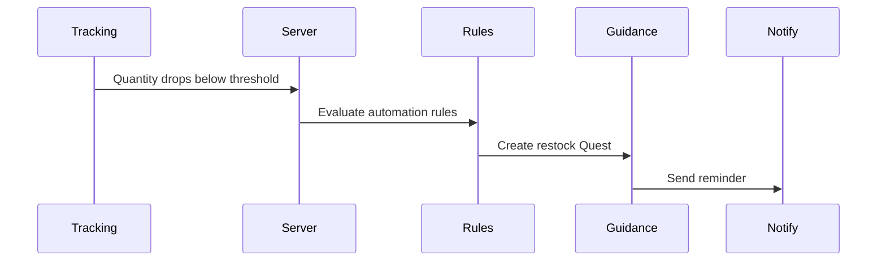

# PRD-004: Tracking Domain

| Field | Value |
|---|---|
| **Document** | 01-PRD-004-tracking |
| **Version** | 1.0 |
| **Status** | Draft |
| **Last Updated** | 2026-04-12 |
| **Source Docs** | `docs/altair-tracking-prd.md`, `docs/altair-architecture-spec.md`, `docs/altair-schema-design-spec.md` |

---

## Overview

Tracking enables monitoring of personal resources and inventory — household goods, consumables, equipment, and any physical or digital items users want to manage. It supports quantity tracking, location management, consumption logging, shopping lists, and cross-domain linking to notes and quests.

---

## Problem Statement

Household inventory management is either a spreadsheet that nobody updates or a mental model that nobody shares. Users need a frictionless system for tracking what they have, where it is, how much is left, and when to restock. The system must work offline (e.g., scanning items in a basement with no signal) and sync to shared household views.

---

## Goals

### P0 — Must Have
- G-T-1: Create and manage Items with name, category, location, quantity
- G-T-2: Track item Locations (storage areas, rooms)
- G-T-3: Record consumption Events (use, purchase, move, discard)
- G-T-4: Shopping lists with item references
- G-T-5: Offline item creation and event logging
- G-T-6: Shared household inventory

### P1 — Should Have
- G-T-7: Barcode scanning for item creation
- G-T-8: Image capture for items
- G-T-9: Category-based organization
- G-T-10: Low-stock alerts
- G-T-11: Item history and event timeline

### P2 — Nice to Have
- G-T-12: Automated restock quest creation when stock is low
- G-T-13: Bill of Materials (BoM) parsing
- G-T-14: Maintenance scheduling for equipment
- G-T-15: Item reservation system

---

## Key Concepts

### Item
A physical or digital resource. Has a name, category, location, quantity, and optional attachments. Can be personal or shared within a household.

### Location
A storage location (room, shelf, closet, garage). Items are assigned to locations.

### Category
Organizational grouping for items (e.g., "Kitchen Supplies", "Electronics", "Tools").

### Item Event
A consumption, purchase, move, or change record for an item. Events form an audit trail of item quantity changes over time.

### Shopping List
A curated list of items to purchase. Items on the list can reference existing inventory items or be freeform entries.

---

## User Personas

### The Household Manager
Manages inventory for a family. Uses Android for scanning items, web for reviewing stock levels and shopping lists. Shares data with household members.

### The Maker / Hobbyist
Tracks tools, components, and supplies. Needs location tracking and quantity management. Uses item events to log consumption.

### The Prepper
Monitors consumables and emergency supplies. Needs low-stock alerts and item expiry tracking. Values offline reliability.

---

## Use Cases

### UC-T-1: Item Creation via Barcode

### UC-T-2: Consumption Logging

### UC-T-3: Low Stock to Restock Quest

<!-- INFERRED: verify automation rule engine design -->

---

## Testable Assertions

- A-025: An item created offline on Android is visible in the web inventory after sync
- A-026: An item_event recording consumption decrements the item's displayed quantity
- A-027: A shopping list shared in a household is visible to all household members
- A-028: Items can be filtered by location and category
- A-029: Item event history shows a chronological timeline of all changes
- A-030: Barcode scanning creates or links to an existing item
- A-031: Quantity-sensitive sync conflicts are detected (not silently merged)

---

## Functional Requirements

| ID | Requirement | Priority | Assertions |
|---|---|---|---|
| FR-4.1 | CRUD for Items with name, category, location, quantity | P0 | A-025 |
| FR-4.2 | CRUD for Locations | P0 | A-028 |
| FR-4.3 | Record item_events (consume, purchase, move, discard) | P0 | A-026, A-029 |
| FR-4.4 | Shopping list creation and item management | P0 | A-027 |
| FR-4.5 | Offline item creation and event logging | P0 | A-025 |
| FR-4.6 | Household-shared inventory | P0 | A-027 |
| FR-4.7 | Barcode scanning for item creation | P1 | A-030 |
| FR-4.8 | Image capture for items | P1 | — |
| FR-4.9 | Category-based organization and filtering | P1 | A-028 |
| FR-4.10 | Low-stock threshold alerts | P1 | — |
| FR-4.11 | Item event timeline view | P1 | A-029 |
| FR-4.12 | Automated restock quest creation | P2 | — |

---

## Non-Functional Requirements

| ID | Requirement | Target |
|---|---|---|
| NFR-4.1 | Item creation latency | < 200ms local write |
| NFR-4.2 | Barcode scan to item display | < 2s |
| NFR-4.3 | Quantity sync conflict detection | No silent merges on quantity fields |

---

## UI Requirements

Tracking screens follow the [`./DESIGN.md`](../../DESIGN.md) system:

- **Inventory list**: Cards on Gossamer White over Pale Seafoam Mist. Quantity badge uses Dusty Mineral Blue (`#dae5e6`) with Midnight Charcoal text. Low-stock items get a Sophisticated Terracotta (`#9f403d`) quantity badge — calm urgency, not alarm.
- **Item detail**: Asymmetric layout — wide area for event timeline and attachments, narrow strip for location/category/quantity metadata.
- **Shopping list**: Checklist pattern with pill-shaped checkboxes. Completed items dim to Ghost Border Ash opacity.
- **Barcode scanner**: Full-screen camera overlay with Deep Muted Teal-Navy (`#446273`) scan frame. Result appears as a slide-up card.

---

## Data Requirements

### Entity Types
`tracking_location`, `tracking_category`, `tracking_item`, `tracking_item_event`, `tracking_shopping_list`, `tracking_shopping_list_item`

### Sync Strategy
- Locations, categories, items, shopping lists: auto-subscribed (household-scoped)
- Item events: on-demand via `item_history` stream (can grow large)

---

## Invariants

- **I-T-1**: Item quantity must never go negative from a consumption event (see `03-invariants.md` E-7)
- **I-T-2**: Quantity sync conflicts must use stricter checks, not last-write-wins (see `03-invariants.md` S-3)
- **I-T-3**: An item's location_id must reference a valid location within the same household scope (see `03-invariants.md` E-8)

---

## State Machines

Items do not have a complex lifecycle — they are `active` or `deleted` (soft delete).

Item events are immutable records (append-only log).

Shopping list items: `pending` → `purchased` | `removed`

---

## Integration Points

| System | Interface | Notes |
|---|---|---|
| Core / Tags | Tag items | Via universal tagging system |
| Core / Relations | Link items to notes, quests | Via entity_relations |
| Core / Attachments | Image attachments on items | Via attachment subsystem |
| Knowledge | Note references item | Cross-domain relationship |
| Guidance | Low stock → restock quest (P2) | Via automation rules |
| Notifications | Low-stock alert, maintenance due | Via notification subsystem |

---

## Success Metrics

- Household inventory accuracy > 90% (items reflect actual stock)
- Users log > 5 item events per week
- Shopping list completion rate > 70%

---

## Open Questions

- OQ-T-1: Should item quantity be an integer or support decimal (e.g., 2.5 liters)?
- OQ-T-2: How should item moves between locations be tracked — as a single event or two events (remove + add)?
- OQ-T-3: Should barcode lookup use an external database or only local item matching?
- OQ-T-4: How should item expiry dates be modeled — per-item field or per-event metadata?
