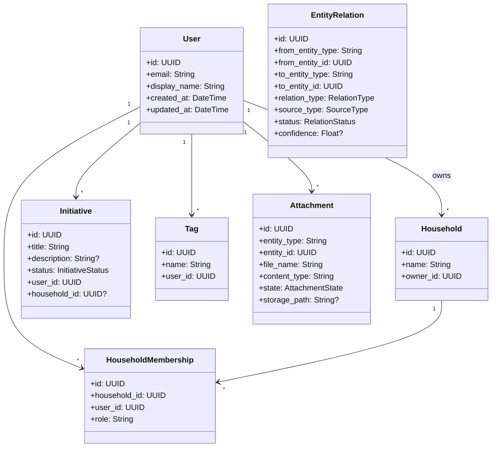
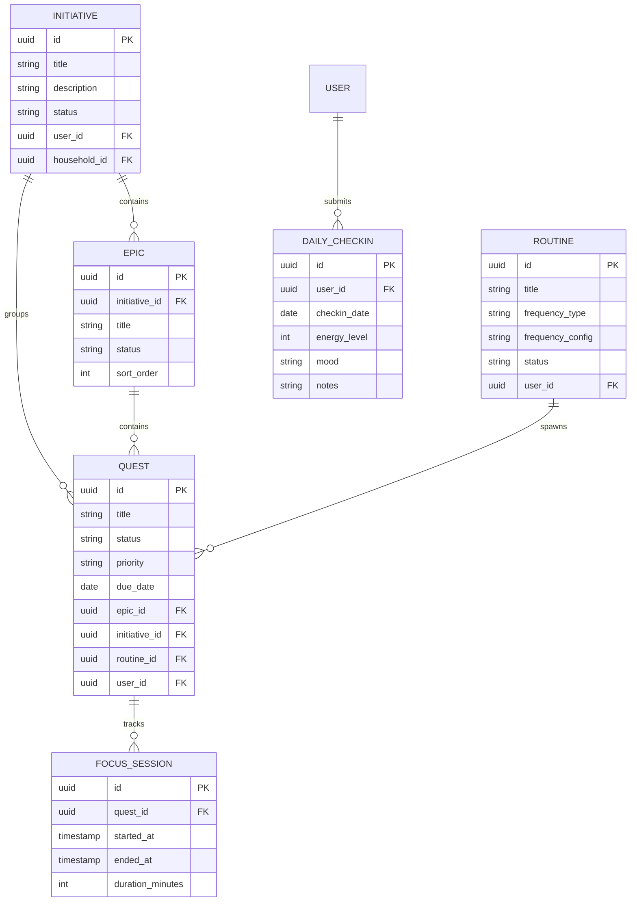
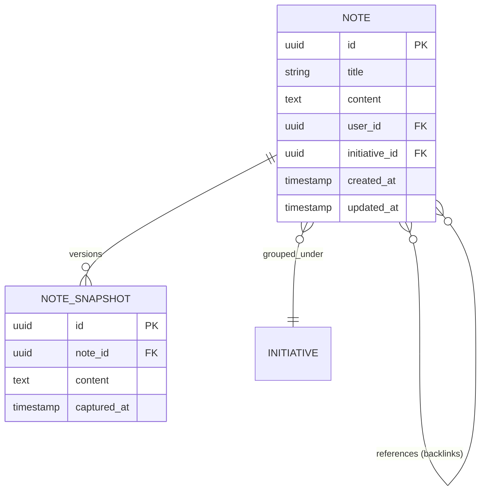
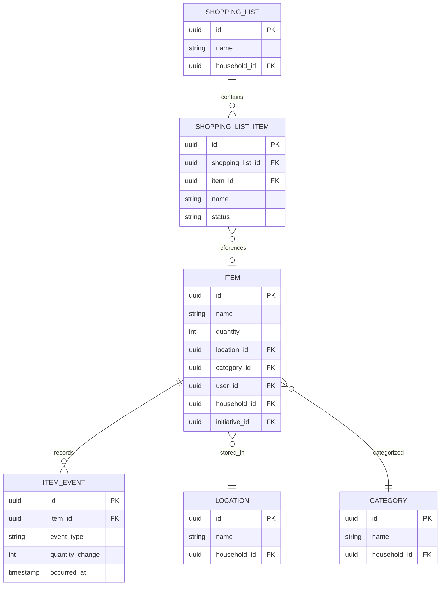
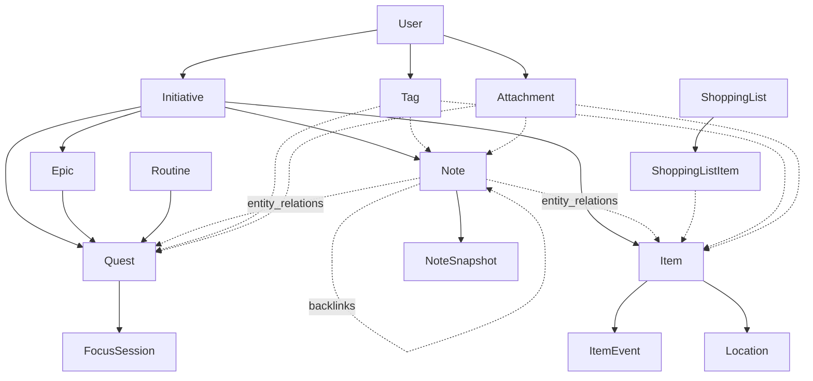

# Domain Model

| Field | Value |
|---|---|
| **Document** | 02-domain-model |
| **Version** | 1.0 |
| **Status** | Draft |
| **Last Updated** | 2026-04-12 |
| **Source Docs** | `docs/altair-architecture-spec.md` (sections 8-9), `docs/altair-schema-design-spec.md`, `docs/altair-shared-contracts-spec.md` |

---

## Bounded Contexts

| Context | Responsibilities | Agent Type |
|---|---|---|
| **Identity** | Accounts, auth, password/OIDC login, roles, token/session lifecycle, per-user isolation | Backend |
| **Core** | Initiatives, inbox, tags, attachment metadata, notification preferences, shared settings | Full-stack |
| **Guidance** | Epics, quests, routines, checkpoints, focus sessions, energy state, daily check-ins | Full-stack |
| **Knowledge** | Notes, backlinks, graph relationships, import/export, semantic enrichment, OCR/transcription | Full-stack |
| **Tracking** | Items, categories, locations, stock levels, reservations, maintenance, shopping lists | Full-stack |
| **Search** | Keyword indexing, semantic embeddings, hybrid ranking, cross-app result shaping | Backend |
| **Sync** | Mutation ingestion, conflict detection, device checkpoints, downstream changes, reconciliation | Backend |

---

## Entity Hierarchy

---

## Aggregate Roots

| Aggregate Root | Context | Owned Entities |
|---|---|---|
| **User** | Identity | HouseholdMembership, personal settings |
| **Household** | Core | HouseholdMembership, shared Initiatives |
| **Initiative** | Core | Epics, Quests (scoped), Notes (scoped), Items (scoped) |
| **Quest** | Guidance | FocusSessions (child) |
| **Routine** | Guidance | Spawned Quests (via routine_id) |
| **Note** | Knowledge | NoteSnapshots (child) |
| **Item** | Tracking | ItemEvents (child) |
| **ShoppingList** | Tracking | ShoppingListItems (child) |

---

## Core Entities

### Guidance Domain

### Knowledge Domain

### Tracking Domain

---

## Value Objects

| Value Object | Used By | Fields |
|---|---|---|
| `EntityRef` | EntityRelation, Search | `entity_type: String`, `entity_id: UUID` |
| `Frequency` | Routine | `type: FrequencyType`, `config: JSON` (days, interval) |
| `Priority` | Quest | `level: low \| medium \| high \| urgent` |
| `MutationEnvelope` | Sync | `mutation_id`, `device_id`, `entity_type`, `entity_id`, `operation`, `base_version`, `payload`, `occurred_at` |

---

## Enumerations

### Entity Types (from canonical registry)

**Core:** `user`, `household`, `initiative`, `tag`, `attachment`

**Guidance:** `guidance_epic`, `guidance_quest`, `guidance_routine`, `guidance_focus_session`, `guidance_daily_checkin`

**Knowledge:** `knowledge_note`, `knowledge_note_snapshot`

**Tracking:** `tracking_location`, `tracking_category`, `tracking_item`, `tracking_item_event`, `tracking_shopping_list`, `tracking_shopping_list_item`

### Relation Types
`references`, `supports`, `requires`, `related_to`, `depends_on`, `duplicates`, `similar_to`, `generated_from`

### Relation Source Types
`user`, `ai`, `import`, `rule`, `migration`, `system`

### Relation Statuses
`accepted`, `suggested`, `dismissed`, `rejected`, `expired`

### Attachment States
`pending`, `uploaded`, `processing`, `ready`, `failed`, `deleted`

### Quest Statuses
`not_started`, `in_progress`, `completed`, `cancelled`, `deferred`

### Initiative Statuses
`draft`, `active`, `completed`, `paused`, `archived`

<!-- INFERRED: verify these status enums against actual implementation when it exists -->

---

## Domain Events

| Event | Emitted By | Consumers | Description |
|---|---|---|---|
| `QuestCompleted` | Guidance | Notifications, Analytics | A quest transitions to `completed` |
| `RoutineDue` | Guidance | Notifications | A routine's next occurrence is now |
| `ItemQuantityChanged` | Tracking | Notifications (low stock), Guidance (restock automation) | An item_event modifies quantity |
| `NoteLinked` | Knowledge | Search (re-index) | A note-to-entity relation is created |
| `AttachmentUploaded` | Core | AI (OCR/transcription), Search | Attachment binary is available server-side |
| `SyncConflictDetected` | Sync | Client notification | Server detected conflicting mutations |
| `MemberJoinedHousehold` | Core | Sync (expand scope), Notifications | A user joins a household |

---

## Relationships Summary

Solid arrows = direct foreign key. Dashed arrows = via `entity_relations` or junction table.

---

## Consistency Rules

1. All entity IDs are UUIDs generated client-side (for offline-first creation)
2. `updated_at` is maintained server-side via database trigger
3. Soft deletes (`deleted_at` timestamp) are required for all synced entities
4. Entity type identifiers must come from the canonical registry — no inline strings
5. Cross-domain references use `entity_relations`, not direct foreign keys
6. Attachment metadata syncs; binary blobs do not flow through the sync engine

---

## Query Patterns

| Pattern | Description | Index Hint |
|---|---|---|
| Today's quests | Quests where `due_date = today` and `status != completed` for user | `idx_quests_user_due_status` |
| Today's routines | Routines where `status = active` and frequency matches today | `idx_routines_user_status` |
| Initiative tree | Epic → Quest hierarchy for an initiative | `idx_epics_initiative`, `idx_quests_epic` |
| Note backlinks | entity_relations where `to_entity_type = knowledge_note` and `to_entity_id = X` | `idx_relations_to` |
| Item inventory | Items for a household, filtered by location and category | `idx_items_household_location_category` |
| Shopping list | Shopping list items for a list, with item reference details | `idx_sli_list` |
| Cross-app search | FTS across notes, quests, items | Search index (external) |
