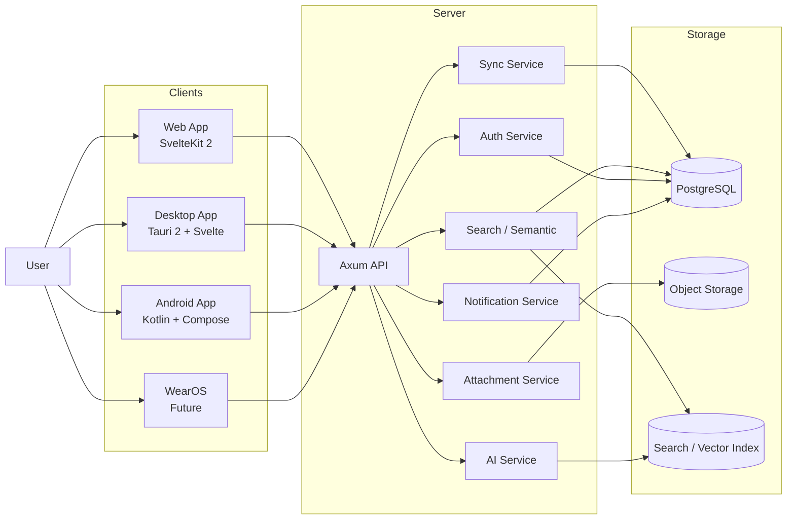
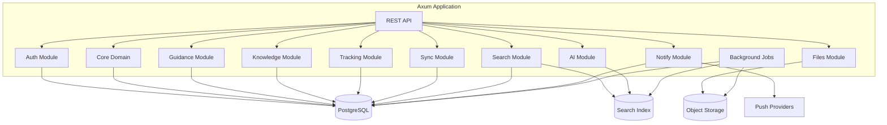
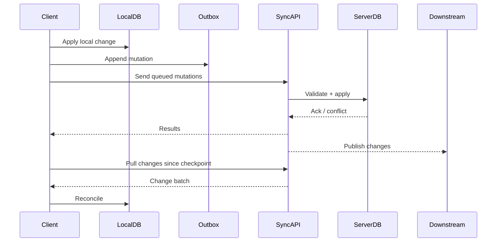
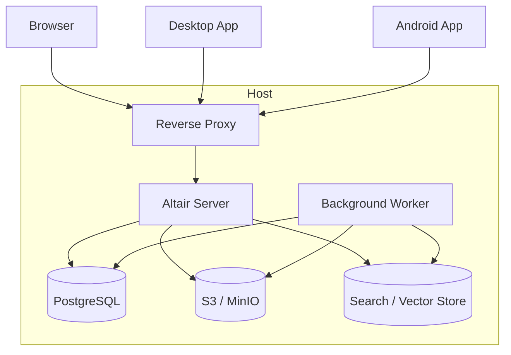

# Architecture

| Field | Value |
|---|---|
| **Document** | 04-architecture |
| **Version** | 1.0 |
| **Status** | Draft |
| **Last Updated** | 2026-04-12 |
| **Source Docs** | `docs/altair-architecture-spec.md` |

---

## High-Level Architecture

---

## Layer Responsibilities

### Client Layer
All clients follow the same logical shape:
- **Presentation / UI** — Svelte components (web/desktop) or Compose screens (Android)
- **View Model / State** — Reactive state management (Svelte runes or Android ViewModels)
- **Application Services** — Business logic coordination
- **Repositories** — Data access abstraction (local DB + remote API)
- **Local Storage** — SQLite (PowerSync-managed on web, Room on Android)
- **Sync Outbox** — Queued mutations for offline-first writes

### Server Layer
Modular monolith structured by bounded context:
- **API Gateway** — Axum router, auth middleware, request validation
- **Domain Modules** — Core, Guidance, Knowledge, Tracking (each: handlers → service → models)
- **Sync Engine** — Mutation ingestion, conflict detection, checkpoint management
- **Search Service** — FTS + semantic indexing and hybrid query
- **AI Orchestration** — Optional job-based enrichment pipelines
- **Attachment Service** — Object storage upload/download, thumbnail generation
- **Notification Service** — Push, local, and scheduled reminders
- **Background Jobs** — Async indexing, AI pipelines, attachment processing

### Data Layer
- **PostgreSQL** — Transactional source of truth
- **Object Storage** — S3-compatible (MinIO for self-hosted) for attachment binaries
- **Search Index** — FTS + vector store for hybrid search

---

## Module Structure

Each domain module follows the pattern: `mod.rs` → `models.rs` + `service.rs` + `handlers.rs`

---

## Data Flow — Write Path

---

## Data Flow — Sync Streams (PowerSync)

### Auto-subscribed (always available offline)
- `my_profile` — current user profile
- `my_memberships` — household memberships
- `my_personal_data` — user-owned initiatives, tags, routines, quests
- `my_household_data` — shared items, locations, categories, shopping lists, chores
- `my_relations` — entity_relations for synced scopes
- `my_attachment_metadata` — attachment records (no binaries)

### On-demand (subscribed when navigating into detail)
- `initiative_detail` — epics, quests, notes, items for an initiative
- `note_detail` — note + snapshots + tags + attachments + relations
- `item_history` — item + recent events + tags + attachments
- `quest_detail` — quest + tags + attachments + relations + focus sessions

See `docs/altair-powersync-sync-spec.md` for the full stream design.

---

## Background Processing

| Job | Trigger | Description |
|---|---|---|
| Attachment upload | Client queues binary | Background upload to object storage |
| Thumbnail generation | Attachment uploaded | Generate preview thumbnails for images |
| Search indexing | Entity created/updated | Async FTS + embedding index update |
| OCR/transcription | Image/audio attachment uploaded | AI pipeline extracts text |
| AI enrichment | User-triggered or batch | Suggested links, summaries |
| Notification scheduling | Routine due, timer complete | Schedule push/local notifications |

---

## Key Architecture Decisions

| Decision | Choice | Rationale | Status |
|---|---|---|---|
| Client split | Native Android + shared SvelteKit (web/desktop) | Mobile needs camera, barcode, notifications, background sync; web/desktop share UI | ADR-CANDIDATE |
| Server persistence | PostgreSQL (default) | Proven, relational, strong ecosystem; SurrealDB as optional alternative | ADR-CANDIDATE |
| Sync protocol | Operation-based with PowerSync | Explicit conflict handling, resumable, idempotent mutations | ADR-CANDIDATE |
| Server structure | Modular monolith | Simpler deployment, easier local dev, lower ops burden; extract services only when justified | ADR-CANDIDATE |
| Search strategy | FTS + vector hybrid | Keyword for precision, semantic for recall, hybrid ranking | ADR-CANDIDATE |
| Attachment storage | S3-compatible abstraction | Decoupled from sync; MinIO for self-hosted, S3 for hosted | ADR-CANDIDATE |
| Auth model | Access + refresh tokens, Argon2id | Standard JWT flow; OIDC as future P1 | ADR-CANDIDATE |
| Deployment | Docker Compose first | Self-hosted primary target; Kubernetes only if justified | ADR-CANDIDATE |

---

## Dependency Injection

### Server (Rust/Axum)
- Application state passed via Axum's `Extension` or `State` extractors
- Database pool, config, and service clients injected at startup
- No runtime DI framework; compile-time wiring via module construction

### Android (Kotlin)
- Koin for dependency injection
- Modules: Database, Repository, ViewModel, Sync, Preferences

### Web (SvelteKit)
- No DI framework; module-level singletons and context-based dependency passing
- PowerSync client initialized at app startup, available via Svelte context

---

## Error Handling Strategy

### Server
- Concrete error types via `thiserror`; no `Box<dyn Error>`
- `AppError` enum maps to HTTP status codes
- All domain errors carry structured context (entity ID, operation, reason)

### Android
- Sealed classes for error states: `UiState.Loading`, `UiState.Success(data)`, `UiState.Error(message)`
- Coroutine exception handlers at scope boundaries
- Never swallow `CancellationException`

### Web
- SvelteKit `error()` helper for HTTP errors in load functions
- Typed error boundaries at route level
- Async operations surface errors to UI state, never swallow silently

---

## Security Architecture

- Per-user data isolation enforced at every query path
- JWT access/refresh token model
- Argon2id password hashing
- Signed attachment URLs or gated downloads
- CSRF protections for browser sessions
- Secrets loaded from environment, never hardcoded
- Structured audit logging for security-relevant actions

See `03-invariants.md` SEC-1 through SEC-6.

---

## Performance Considerations

- Local actions < 200ms (client-side SQLite reads/writes)
- Remote actions < 1s (sync, search, upload)
- Connection pooling via sqlx pool configuration
- Async indexing to avoid blocking write path
- Lazy attachment binary fetching on non-origin devices
- Auto-subscribed sync streams for fast baseline offline availability

---

## Deployment Architecture

### Environment Profiles

| Profile | Components |
|---|---|
| **Personal instance** | 1 server, 1 worker, Postgres, local storage, optional local AI |
| **Household instance** | Reverse proxy, server, worker, Postgres, MinIO, optional search sidecar |
| **Hosted/community** | Split worker scaling, managed object store, separate search capacity, stronger observability |

---

## API Domains

| Path | Domain |
|---|---|
| `/auth/*` | Identity / Authentication |
| `/core/*` | Core (initiatives, tags, relations, attachments) |
| `/guidance/*` | Guidance (quests, epics, routines, focus sessions, check-ins) |
| `/knowledge/*` | Knowledge (notes, snapshots) |
| `/tracking/*` | Tracking (items, locations, categories, events, shopping lists) |
| `/search/*` | Cross-app search |
| `/sync/*` | Sync endpoints |
| `/attachments/*` | Attachment upload/download |
| `/admin/*` | Instance administration |
