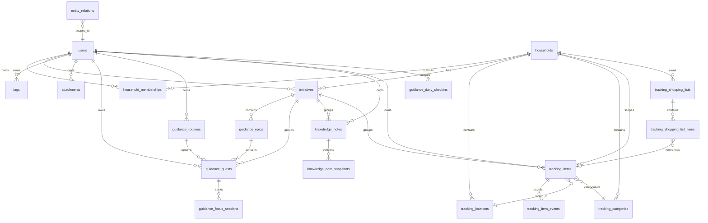

# Entity-Relationship Design

| Field | Value |
|---|---|
| **Document** | 05-erd |
| **Version** | 1.0 |
| **Status** | Draft |
| **Last Updated** | 2026-04-12 |
| **Source Docs** | `docs/altair-schema-design-spec.md`, `docs/altair-architecture-spec.md` (section 12), `docs/altair-shared-contracts-spec.md` |

---

## Complete ERD



---

## Table Schemas

### Identity / Core

#### users

| Column | Type | Constraints | Notes |
|---|---|---|---|
| `id` | UUID | PK | Client-generated |
| `email` | VARCHAR(255) | UNIQUE, NOT NULL | Login identifier |
| `display_name` | VARCHAR(100) | NOT NULL | |
| `password_hash` | TEXT | NOT NULL | Argon2id |
| `created_at` | TIMESTAMPTZ | NOT NULL, DEFAULT now() | |
| `updated_at` | TIMESTAMPTZ | NOT NULL | Trigger-maintained |
| `deleted_at` | TIMESTAMPTZ | NULL | Soft delete |

#### households

| Column | Type | Constraints | Notes |
|---|---|---|---|
| `id` | UUID | PK | Client-generated |
| `name` | VARCHAR(100) | NOT NULL | |
| `owner_id` | UUID | FK → users, NOT NULL | |
| `created_at` | TIMESTAMPTZ | NOT NULL, DEFAULT now() | |
| `updated_at` | TIMESTAMPTZ | NOT NULL | Trigger-maintained |
| `deleted_at` | TIMESTAMPTZ | NULL | Soft delete |

#### household_memberships

| Column | Type | Constraints | Notes |
|---|---|---|---|
| `id` | UUID | PK | |
| `household_id` | UUID | FK → households, NOT NULL | |
| `user_id` | UUID | FK → users, NOT NULL | |
| `role` | VARCHAR(20) | NOT NULL | `owner`, `member` |
| `created_at` | TIMESTAMPTZ | NOT NULL, DEFAULT now() | |
| `updated_at` | TIMESTAMPTZ | NOT NULL | |
| `deleted_at` | TIMESTAMPTZ | NULL | |

UNIQUE constraint on (`household_id`, `user_id`).

#### initiatives

| Column | Type | Constraints | Notes |
|---|---|---|---|
| `id` | UUID | PK | Client-generated |
| `title` | VARCHAR(255) | NOT NULL | |
| `description` | TEXT | NULL | |
| `status` | VARCHAR(20) | NOT NULL, DEFAULT 'draft' | See `06-state-machines.md` |
| `user_id` | UUID | FK → users, NOT NULL | Owner |
| `household_id` | UUID | FK → households, NULL | NULL = personal |
| `created_at` | TIMESTAMPTZ | NOT NULL, DEFAULT now() | |
| `updated_at` | TIMESTAMPTZ | NOT NULL | |
| `deleted_at` | TIMESTAMPTZ | NULL | |

#### tags

| Column | Type | Constraints | Notes |
|---|---|---|---|
| `id` | UUID | PK | Client-generated |
| `name` | VARCHAR(100) | NOT NULL | |
| `user_id` | UUID | FK → users, NOT NULL | |
| `created_at` | TIMESTAMPTZ | NOT NULL, DEFAULT now() | |
| `updated_at` | TIMESTAMPTZ | NOT NULL | |
| `deleted_at` | TIMESTAMPTZ | NULL | |

UNIQUE constraint on (`user_id`, `name`).

#### attachments

| Column | Type | Constraints | Notes |
|---|---|---|---|
| `id` | UUID | PK | Client-generated |
| `entity_type` | VARCHAR(50) | NOT NULL | From canonical registry |
| `entity_id` | UUID | NOT NULL | Polymorphic FK |
| `file_name` | VARCHAR(255) | NOT NULL | |
| `content_type` | VARCHAR(100) | NOT NULL | MIME type |
| `size_bytes` | BIGINT | NULL | Populated after upload |
| `state` | VARCHAR(20) | NOT NULL, DEFAULT 'pending' | See `06-state-machines.md` |
| `storage_path` | TEXT | NULL | Set after upload |
| `user_id` | UUID | FK → users, NOT NULL | |
| `created_at` | TIMESTAMPTZ | NOT NULL, DEFAULT now() | |
| `updated_at` | TIMESTAMPTZ | NOT NULL | |
| `deleted_at` | TIMESTAMPTZ | NULL | |

#### entity_relations

| Column | Type | Constraints | Notes |
|---|---|---|---|
| `id` | UUID | PK | |
| `from_entity_type` | VARCHAR(50) | NOT NULL | From canonical registry |
| `from_entity_id` | UUID | NOT NULL | |
| `to_entity_type` | VARCHAR(50) | NOT NULL | From canonical registry |
| `to_entity_id` | UUID | NOT NULL | |
| `relation_type` | VARCHAR(30) | NOT NULL | From canonical registry |
| `source_type` | VARCHAR(20) | NOT NULL | `user`, `ai`, `import`, `rule`, `migration`, `system` |
| `status` | VARCHAR(20) | NOT NULL, DEFAULT 'accepted' | See `06-state-machines.md` |
| `confidence` | FLOAT | NULL | AI-sourced relations only |
| `evidence` | TEXT | NULL | Optional justification |
| `user_id` | UUID | FK → users, NOT NULL | Scoping |
| `created_at` | TIMESTAMPTZ | NOT NULL, DEFAULT now() | |
| `updated_at` | TIMESTAMPTZ | NOT NULL | |
| `deleted_at` | TIMESTAMPTZ | NULL | |

---

### Guidance Domain

#### guidance_epics

| Column | Type | Constraints | Notes |
|---|---|---|---|
| `id` | UUID | PK | Client-generated |
| `initiative_id` | UUID | FK → initiatives, NOT NULL | |
| `title` | VARCHAR(255) | NOT NULL | |
| `description` | TEXT | NULL | |
| `status` | VARCHAR(20) | NOT NULL, DEFAULT 'not_started' | |
| `sort_order` | INTEGER | NOT NULL, DEFAULT 0 | |
| `user_id` | UUID | FK → users, NOT NULL | |
| `created_at` | TIMESTAMPTZ | NOT NULL, DEFAULT now() | |
| `updated_at` | TIMESTAMPTZ | NOT NULL | |
| `deleted_at` | TIMESTAMPTZ | NULL | |

#### guidance_quests

| Column | Type | Constraints | Notes |
|---|---|---|---|
| `id` | UUID | PK | Client-generated |
| `title` | VARCHAR(255) | NOT NULL | |
| `description` | TEXT | NULL | |
| `status` | VARCHAR(20) | NOT NULL, DEFAULT 'not_started' | See `06-state-machines.md` |
| `priority` | VARCHAR(10) | NOT NULL, DEFAULT 'medium' | `low`, `medium`, `high`, `urgent` |
| `due_date` | DATE | NULL | |
| `epic_id` | UUID | FK → guidance_epics, NULL | |
| `initiative_id` | UUID | FK → initiatives, NULL | |
| `routine_id` | UUID | FK → guidance_routines, NULL | If spawned by routine |
| `user_id` | UUID | FK → users, NOT NULL | |
| `created_at` | TIMESTAMPTZ | NOT NULL, DEFAULT now() | |
| `updated_at` | TIMESTAMPTZ | NOT NULL | |
| `deleted_at` | TIMESTAMPTZ | NULL | |

#### guidance_routines

| Column | Type | Constraints | Notes |
|---|---|---|---|
| `id` | UUID | PK | Client-generated |
| `title` | VARCHAR(255) | NOT NULL | |
| `description` | TEXT | NULL | |
| `frequency_type` | VARCHAR(20) | NOT NULL | `daily`, `weekly`, `interval`, `custom` |
| `frequency_config` | JSONB | NOT NULL | Days, interval, cron-like config |
| `status` | VARCHAR(20) | NOT NULL, DEFAULT 'active' | See `06-state-machines.md` |
| `user_id` | UUID | FK → users, NOT NULL | |
| `created_at` | TIMESTAMPTZ | NOT NULL, DEFAULT now() | |
| `updated_at` | TIMESTAMPTZ | NOT NULL | |
| `deleted_at` | TIMESTAMPTZ | NULL | |

#### guidance_focus_sessions

| Column | Type | Constraints | Notes |
|---|---|---|---|
| `id` | UUID | PK | Client-generated |
| `quest_id` | UUID | FK → guidance_quests, NOT NULL | |
| `started_at` | TIMESTAMPTZ | NOT NULL | |
| `ended_at` | TIMESTAMPTZ | NULL | NULL = in progress |
| `duration_minutes` | INTEGER | NULL | Computed on end |
| `user_id` | UUID | FK → users, NOT NULL | |
| `created_at` | TIMESTAMPTZ | NOT NULL, DEFAULT now() | |
| `updated_at` | TIMESTAMPTZ | NOT NULL | |
| `deleted_at` | TIMESTAMPTZ | NULL | |

#### guidance_daily_checkins

| Column | Type | Constraints | Notes |
|---|---|---|---|
| `id` | UUID | PK | Client-generated |
| `user_id` | UUID | FK → users, NOT NULL | |
| `checkin_date` | DATE | NOT NULL | |
| `energy_level` | INTEGER | NOT NULL | 1-5 scale |
| `mood` | VARCHAR(30) | NULL | |
| `notes` | TEXT | NULL | |
| `created_at` | TIMESTAMPTZ | NOT NULL, DEFAULT now() | |
| `updated_at` | TIMESTAMPTZ | NOT NULL | |
| `deleted_at` | TIMESTAMPTZ | NULL | |

UNIQUE constraint on (`user_id`, `checkin_date`).

---

### Knowledge Domain

#### knowledge_notes

| Column | Type | Constraints | Notes |
|---|---|---|---|
| `id` | UUID | PK | Client-generated |
| `title` | VARCHAR(255) | NOT NULL | |
| `content` | TEXT | NULL | |
| `user_id` | UUID | FK → users, NOT NULL | |
| `initiative_id` | UUID | FK → initiatives, NULL | |
| `created_at` | TIMESTAMPTZ | NOT NULL, DEFAULT now() | |
| `updated_at` | TIMESTAMPTZ | NOT NULL | |
| `deleted_at` | TIMESTAMPTZ | NULL | |

#### knowledge_note_snapshots

| Column | Type | Constraints | Notes |
|---|---|---|---|
| `id` | UUID | PK | |
| `note_id` | UUID | FK → knowledge_notes, NOT NULL | |
| `content` | TEXT | NOT NULL | Immutable after insert (E-6) |
| `captured_at` | TIMESTAMPTZ | NOT NULL | |
| `created_at` | TIMESTAMPTZ | NOT NULL, DEFAULT now() | |

No `updated_at` — snapshots are immutable (invariant E-6). No UPDATE path exists.

---

### Tracking Domain

#### tracking_locations

| Column | Type | Constraints | Notes |
|---|---|---|---|
| `id` | UUID | PK | Client-generated |
| `name` | VARCHAR(100) | NOT NULL | |
| `household_id` | UUID | FK → households, NOT NULL | |
| `created_at` | TIMESTAMPTZ | NOT NULL, DEFAULT now() | |
| `updated_at` | TIMESTAMPTZ | NOT NULL | |
| `deleted_at` | TIMESTAMPTZ | NULL | |

#### tracking_categories

| Column | Type | Constraints | Notes |
|---|---|---|---|
| `id` | UUID | PK | Client-generated |
| `name` | VARCHAR(100) | NOT NULL | |
| `household_id` | UUID | FK → households, NOT NULL | |
| `created_at` | TIMESTAMPTZ | NOT NULL, DEFAULT now() | |
| `updated_at` | TIMESTAMPTZ | NOT NULL | |
| `deleted_at` | TIMESTAMPTZ | NULL | |

#### tracking_items

| Column | Type | Constraints | Notes |
|---|---|---|---|
| `id` | UUID | PK | Client-generated |
| `name` | VARCHAR(255) | NOT NULL | |
| `description` | TEXT | NULL | |
| `quantity` | NUMERIC | NOT NULL, DEFAULT 0 | Never negative (E-7). Decimal for fractional quantities (OQ-T-1). |
| `barcode` | VARCHAR(50) | NULL | UPC/EAN barcode for external product lookup |
| `location_id` | UUID | FK → tracking_locations, NULL | Must match household (E-8) |
| `category_id` | UUID | FK → tracking_categories, NULL | |
| `user_id` | UUID | FK → users, NOT NULL | Creator |
| `household_id` | UUID | FK → households, NULL | |
| `initiative_id` | UUID | FK → initiatives, NULL | |
| `expires_at` | TIMESTAMPTZ | NULL | Optional expiry date (OQ-T-4). One per item for v1; batch tracking deferred. |
| `created_at` | TIMESTAMPTZ | NOT NULL, DEFAULT now() | |
| `updated_at` | TIMESTAMPTZ | NOT NULL | |
| `deleted_at` | TIMESTAMPTZ | NULL | |

#### tracking_item_events

| Column | Type | Constraints | Notes |
|---|---|---|---|
| `id` | UUID | PK | |
| `item_id` | UUID | FK → tracking_items, NOT NULL | |
| `event_type` | VARCHAR(20) | NOT NULL | `consume`, `purchase`, `move`, `discard`, `adjust` |
| `quantity_change` | NUMERIC | NOT NULL | Positive or negative delta |
| `from_location_id` | UUID | FK → tracking_locations, NULL | For `move` events (OQ-T-2): source location |
| `to_location_id` | UUID | FK → tracking_locations, NULL | For `move` events (OQ-T-2): destination location |
| `notes` | TEXT | NULL | |
| `occurred_at` | TIMESTAMPTZ | NOT NULL | |
| `created_at` | TIMESTAMPTZ | NOT NULL, DEFAULT now() | |

No `updated_at` or `deleted_at` — item events are append-only (invariant D-5). No UPDATE or DELETE path exists.

#### tracking_shopping_lists

| Column | Type | Constraints | Notes |
|---|---|---|---|
| `id` | UUID | PK | Client-generated |
| `name` | VARCHAR(255) | NOT NULL | |
| `household_id` | UUID | FK → households, NOT NULL | |
| `created_at` | TIMESTAMPTZ | NOT NULL, DEFAULT now() | |
| `updated_at` | TIMESTAMPTZ | NOT NULL | |
| `deleted_at` | TIMESTAMPTZ | NULL | |

#### tracking_shopping_list_items

| Column | Type | Constraints | Notes |
|---|---|---|---|
| `id` | UUID | PK | Client-generated |
| `shopping_list_id` | UUID | FK → tracking_shopping_lists, NOT NULL | |
| `item_id` | UUID | FK → tracking_items, NULL | Optional inventory ref (E-9) |
| `name` | VARCHAR(255) | NOT NULL | Freeform or copied from item |
| `quantity` | NUMERIC | NOT NULL, DEFAULT 1 | |
| `status` | VARCHAR(20) | NOT NULL, DEFAULT 'pending' | `pending`, `purchased`, `removed` |
| `created_at` | TIMESTAMPTZ | NOT NULL, DEFAULT now() | |
| `updated_at` | TIMESTAMPTZ | NOT NULL | |
| `deleted_at` | TIMESTAMPTZ | NULL | |

---

## Junction Tables

### Tag Assignments

Tags are applied to entities via junction tables per entity type:

| Table | Columns | Notes |
|---|---|---|
| `quest_tags` | `quest_id`, `tag_id` | |
| `note_tags` | `note_id`, `tag_id` | |
| `item_tags` | `item_id`, `tag_id` | |
| `initiative_tags` | `initiative_id`, `tag_id` | |

Each has a composite PK of (`entity_id`, `tag_id`) plus `created_at`.

---

## Indices

| Index | Table | Columns | Purpose |
|---|---|---|---|
| `idx_users_email` | users | `email` | Login lookup |
| `idx_hm_user` | household_memberships | `user_id` | Membership queries |
| `idx_hm_household` | household_memberships | `household_id` | Household member list |
| `idx_initiatives_user` | initiatives | `user_id`, `status` | Personal initiative list |
| `idx_initiatives_household` | initiatives | `household_id`, `status` | Shared initiative list |
| `idx_epics_initiative` | guidance_epics | `initiative_id` | Initiative tree |
| `idx_quests_user_due_status` | guidance_quests | `user_id`, `due_date`, `status` | Today's quests |
| `idx_quests_epic` | guidance_quests | `epic_id` | Epic → quest hierarchy |
| `idx_quests_initiative` | guidance_quests | `initiative_id` | Initiative quests |
| `idx_quests_routine` | guidance_quests | `routine_id` | Routine-spawned quests |
| `idx_routines_user_status` | guidance_routines | `user_id`, `status` | Active routines |
| `idx_focus_quest` | guidance_focus_sessions | `quest_id` | Quest focus history |
| `idx_checkins_user_date` | guidance_daily_checkins | `user_id`, `checkin_date` | Date lookup |
| `idx_notes_user` | knowledge_notes | `user_id` | User's notes |
| `idx_notes_initiative` | knowledge_notes | `initiative_id` | Initiative notes |
| `idx_snapshots_note` | knowledge_note_snapshots | `note_id`, `captured_at` | Version history |
| `idx_items_household_location_category` | tracking_items | `household_id`, `location_id`, `category_id` | Inventory filtering |
| `idx_items_user` | tracking_items | `user_id` | Personal items |
| `idx_items_barcode` | tracking_items | `barcode` | Barcode lookup |
| `idx_items_expires` | tracking_items | `expires_at` | Expiry date queries |
| `idx_item_events_item` | tracking_item_events | `item_id`, `occurred_at` | Event timeline |
| `idx_sli_list` | tracking_shopping_list_items | `shopping_list_id` | Shopping list items |
| `idx_attachments_entity` | attachments | `entity_type`, `entity_id` | Entity attachments |
| `idx_relations_from` | entity_relations | `from_entity_type`, `from_entity_id` | Forward traversal |
| `idx_relations_to` | entity_relations | `to_entity_type`, `to_entity_id` | Backlink / reverse traversal |
| `idx_relations_user` | entity_relations | `user_id` | User-scoped relations |

---

## Local Database Schema (SQLite / Room)

Client-side SQLite mirrors the PostgreSQL schema with these differences:

| Aspect | PostgreSQL | SQLite (Room / PowerSync) |
|---|---|---|
| Primary keys | UUID (pg `uuid` type) | TEXT (UUID stored as string) |
| Timestamps | TIMESTAMPTZ | TEXT (ISO 8601 string) |
| JSON fields | JSONB | TEXT (serialized JSON) |
| Boolean fields | BOOLEAN | INTEGER (0/1) |
| Auto-update trigger | DB trigger on `updated_at` | Application-managed |

Column names must match exactly between PostgreSQL and SQLite (invariant D-4).

### Additional Client-Side Tables

| Table | Purpose |
|---|---|
| `sync_outbox` | Queued mutations awaiting sync |
| `device_checkpoints` | Per-stream checkpoint tracking |
| `attachment_cache` | Local binary cache metadata |

---

## Data Type Mappings

| Domain Type | PostgreSQL | Kotlin (Room) | TypeScript (PowerSync) | Rust (sqlx) |
|---|---|---|---|---|
| UUID | `uuid` | `String` | `string` | `Uuid` |
| DateTime | `timestamptz` | `Long` (epoch ms) or `String` | `string` (ISO) | `chrono::DateTime<Utc>` |
| JSON config | `jsonb` | `String` (TypeConverter) | `string` (JSON.parse) | `serde_json::Value` |
| Status enum | `varchar(20)` | `String` (enum mapping) | `string` (union type) | `String` (enum) |
| Money/quantity | `numeric` | `BigDecimal` | `number` | `rust_decimal::Decimal` |

---

## Migration Strategy

1. Migrations use sqlx `migrate!` macro with numbered files: `YYYYMMDDHHMMSS_description.sql`
2. Each migration includes both `up` and `down` SQL (invariant D-1)
3. Applied migrations are never modified — checksums are validated in CI (invariant D-2)
4. PowerSync schema changes must be validated against Postgres output (invariant D-3)
5. Seed data migrations are separate from schema migrations

### Migration Ordering

| Phase | Tables |
|---|---|
| 1 | `users`, `households`, `household_memberships` |
| 2 | `initiatives`, `tags` |
| 3 | `guidance_epics`, `guidance_routines`, `guidance_quests`, `guidance_focus_sessions`, `guidance_daily_checkins` |
| 4 | `knowledge_notes`, `knowledge_note_snapshots` |
| 5 | `tracking_locations`, `tracking_categories`, `tracking_items`, `tracking_item_events` |
| 6 | `tracking_shopping_lists`, `tracking_shopping_list_items` |
| 7 | `attachments`, `entity_relations` |
| 8 | Junction tables (`quest_tags`, `note_tags`, `item_tags`, `initiative_tags`) |
| 9 | Indices, triggers (`updated_at` auto-maintenance) |

---

## Query Examples

### Today's Quests

```sql
SELECT q.*
FROM guidance_quests q
WHERE q.user_id = $1
  AND q.due_date = CURRENT_DATE
  AND q.status NOT IN ('completed', 'cancelled')
  AND q.deleted_at IS NULL
ORDER BY q.priority DESC, q.created_at;
```

### Initiative Tree (Epics + Quests)

```sql
SELECT e.id AS epic_id, e.title AS epic_title, e.sort_order,
       q.id AS quest_id, q.title AS quest_title, q.status, q.priority
FROM guidance_epics e
LEFT JOIN guidance_quests q ON q.epic_id = e.id AND q.deleted_at IS NULL
WHERE e.initiative_id = $1
  AND e.deleted_at IS NULL
ORDER BY e.sort_order, q.priority DESC;
```

### Note Backlinks

```sql
SELECT er.from_entity_type, er.from_entity_id, er.relation_type
FROM entity_relations er
WHERE er.to_entity_type = 'knowledge_note'
  AND er.to_entity_id = $1
  AND er.status = 'accepted'
  AND er.deleted_at IS NULL;
```

### Household Inventory by Location

```sql
SELECT i.*, l.name AS location_name, c.name AS category_name
FROM tracking_items i
LEFT JOIN tracking_locations l ON i.location_id = l.id
LEFT JOIN tracking_categories c ON i.category_id = c.id
WHERE i.household_id = $1
  AND i.deleted_at IS NULL
ORDER BY l.name, c.name, i.name;
```

### Item Event Timeline

```sql
SELECT ie.*
FROM tracking_item_events ie
WHERE ie.item_id = $1
ORDER BY ie.occurred_at DESC
LIMIT 50;
```

---

## Contract Surfaces

| Surface | Path / Interface | Producer | Consumer | Notes |
|---|---|---|---|---|
| Sync mutations | `/sync/push` | All clients | Sync engine | MutationEnvelope DTO |
| Sync pull | `/sync/pull` | Sync engine | All clients | Change batch + checkpoint |
| Entity relations | `/core/relations` | All clients, AI | Core service | RelationRecord DTO |
| Attachment upload | `/attachments/upload` | All clients | Attachment service | Multipart binary |
| Attachment download | `/attachments/:id` | Attachment service | All clients | Signed URL or stream |
| Search query | `/search/query` | All clients | Search service | Cross-domain results with EntityRef |
| Tag assignment | Junction tables | All clients | Core service | Per-entity-type tag endpoints |

See `docs/altair-shared-contracts-spec.md` for DTO definitions (EntityRef, RelationRecord, SyncSubscriptionRequest, AttachmentRecord).
