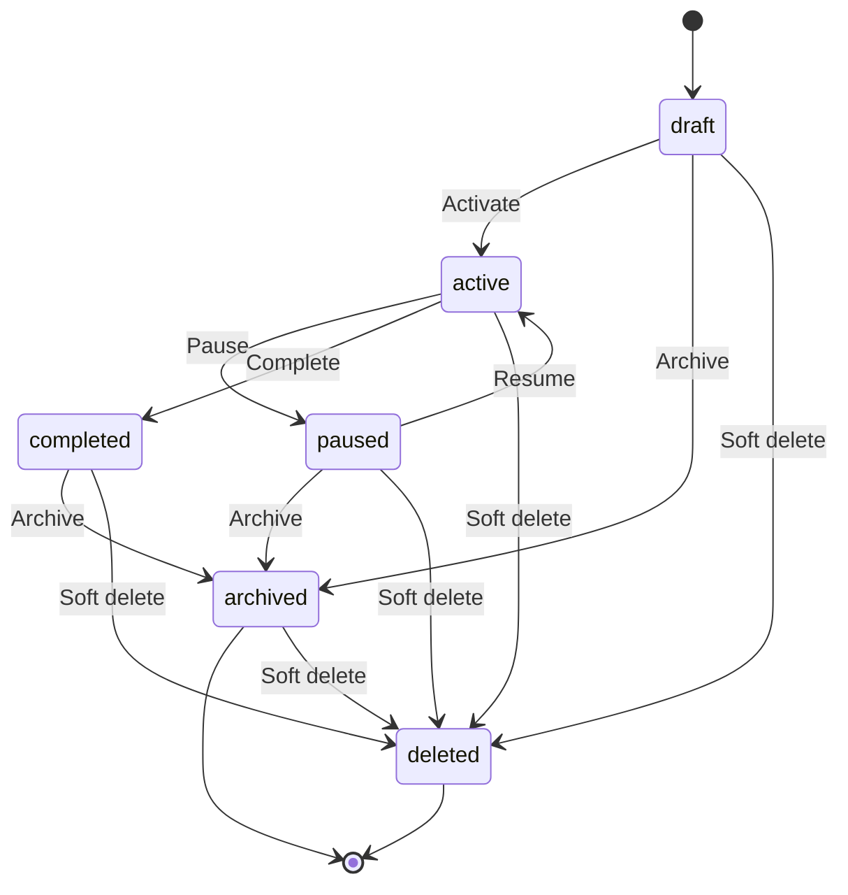
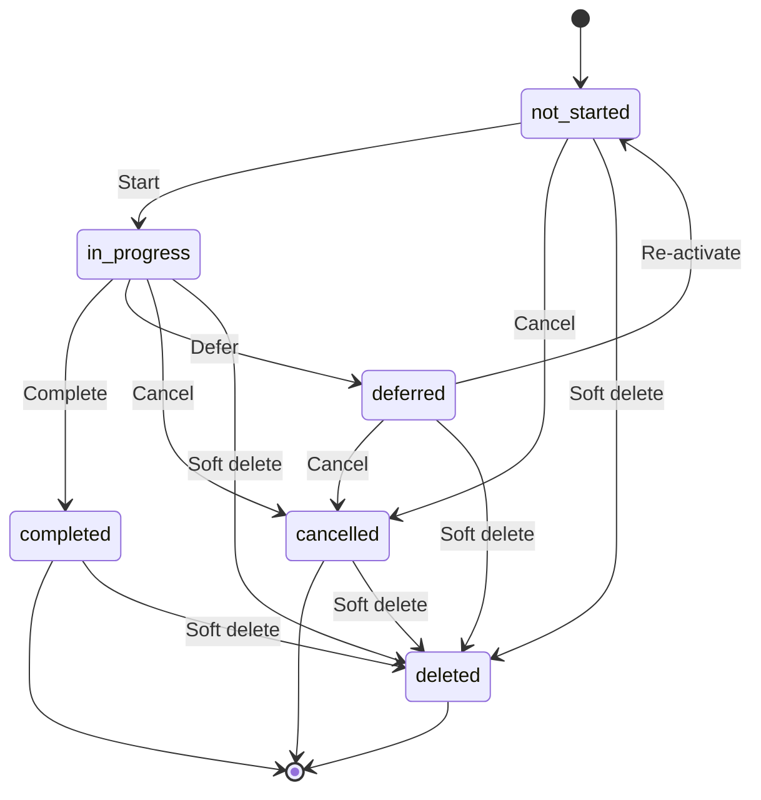
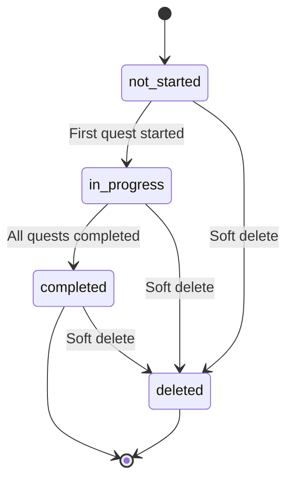
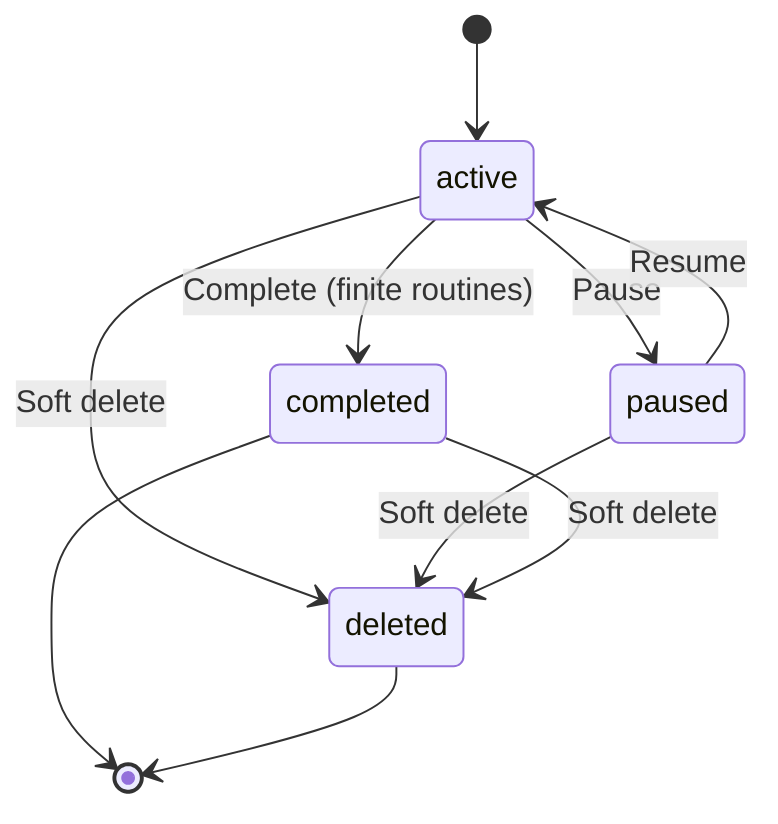
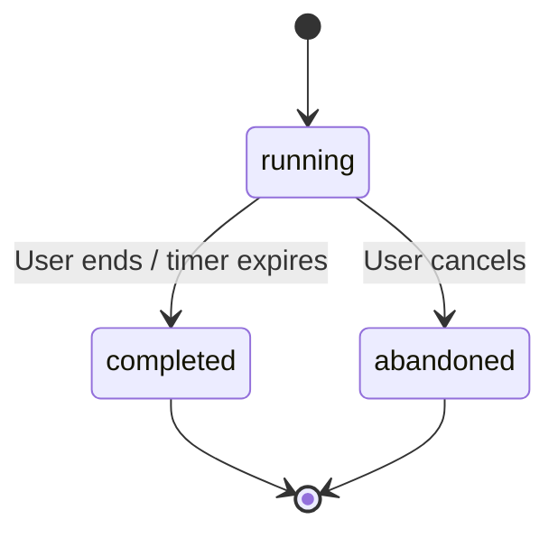
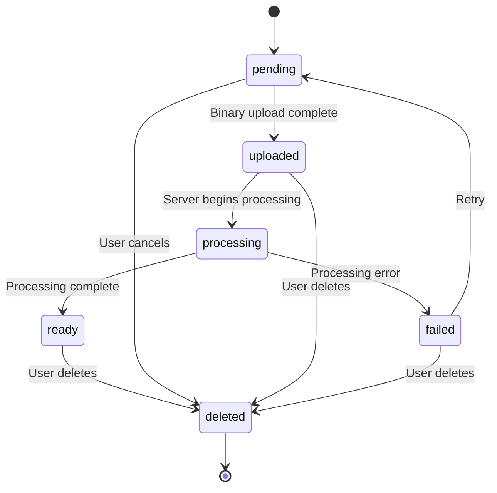
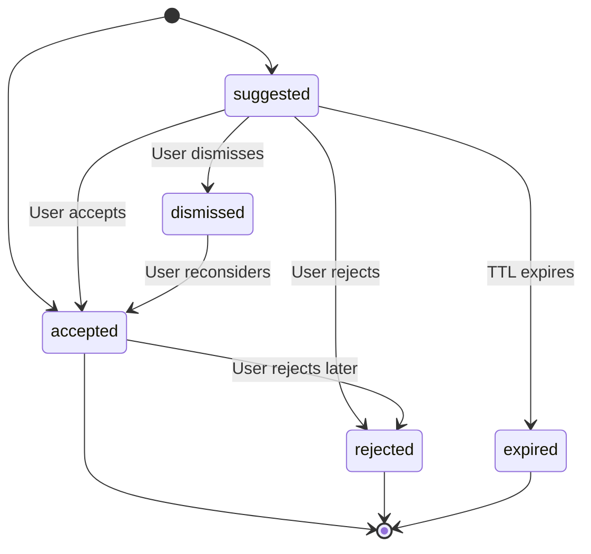
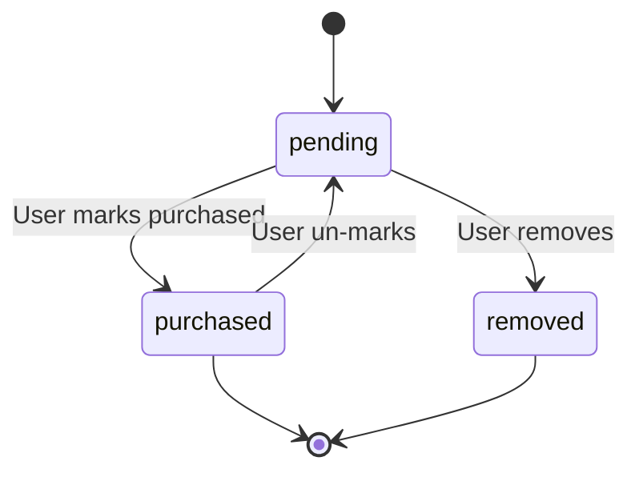
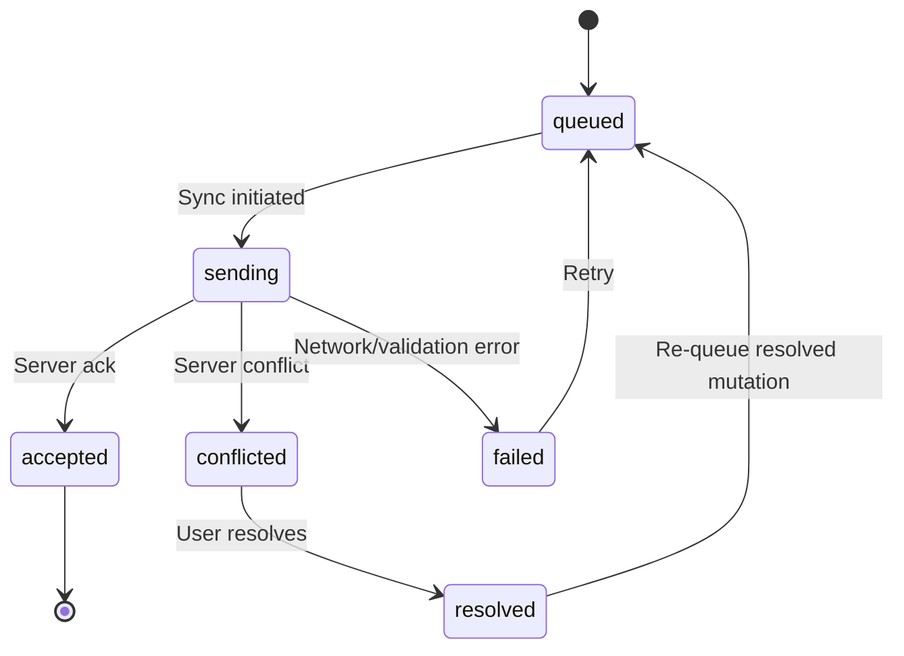
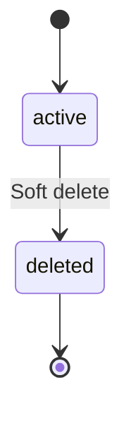

# State Machines

| Field | Value |
|---|---|
| **Document** | 06-state-machines |
| **Version** | 1.0 |
| **Status** | Draft |
| **Last Updated** | 2026-04-12 |
| **Source Docs** | `docs/altair-shared-contracts-spec.md`, `docs/altair-architecture-spec.md`, PRD specs |

---

## Primary Entity Lifecycles

### Initiative Status



| From | To | Trigger | Side Effects |
|---|---|---|---|
| `draft` | `active` | User activates | Quests become schedulable |
| `active` | `paused` | User pauses | Quests retain state but excluded from Today view |
| `paused` | `active` | User resumes | Quests re-enter scheduling |
| `active` | `completed` | User completes | All child quests reviewed; completion event emitted |
| `*` | `archived` | User archives | Removed from active views, retained for history |
| `*` | `deleted` | User deletes | Soft delete with `deleted_at` timestamp |

### Quest Status



| From | To | Trigger | Side Effects |
|---|---|---|---|
| `not_started` | `in_progress` | User starts or first focus session | |
| `in_progress` | `completed` | User completes | `QuestCompleted` event; focus sessions finalized |
| `in_progress` | `deferred` | User defers | Removed from Today view |
| `deferred` | `not_started` | User re-activates | Re-enters scheduling |
| `*` | `cancelled` | User cancels | Removed from active views |

### Epic Status



| From | To | Trigger | Side Effects |
|---|---|---|---|
| `not_started` | `in_progress` | First child quest moves to `in_progress` | Derived state |
| `in_progress` | `completed` | All child quests `completed` or `cancelled` | Derived state |

<!-- INFERRED: Epic status may be derived from child quest states rather than independently managed — verify during implementation -->

### Routine Status



| From | To | Trigger | Side Effects |
|---|---|---|---|
| `[*]` | `active` | User creates routine | Begins spawning quests per frequency |
| `active` | `paused` | User pauses | Stops spawning; existing quests unaffected |
| `paused` | `active` | User resumes | Resumes spawning from next occurrence |
| `active` | `completed` | Finite routine exhausted | No more quests spawned |

---

## Focus Session Lifecycle



| From | To | Trigger | Side Effects |
|---|---|---|---|
| `[*]` | `running` | User starts focus session | `started_at` set; quest moves to `in_progress` if `not_started` |
| `running` | `completed` | User ends or timer expires | `ended_at` and `duration_minutes` set |
| `running` | `abandoned` | User cancels mid-session | `ended_at` set; `duration_minutes` may be partial |

<!-- INFERRED: Focus session states may be derived from started_at/ended_at rather than stored explicitly — verify during implementation -->

---

## Attachment States

From the shared contracts spec (section 10):



| From | To | Trigger | Side Effects |
|---|---|---|---|
| `[*]` | `pending` | Client creates attachment metadata | Metadata synced; binary queued for upload |
| `pending` | `uploaded` | Binary upload completes | `storage_path` set |
| `uploaded` | `processing` | Server picks up processing job | Thumbnail generation, OCR, transcription |
| `processing` | `ready` | Processing completes | Derivatives available; `AttachmentUploaded` event |
| `processing` | `failed` | Processing error | Error logged; retry available |
| `failed` | `pending` | User or system retries | Re-queues upload |
| `*` | `deleted` | User deletes | Binary cleanup deferred; metadata soft-deleted |

---

## Entity Relation Status



| From | To | Trigger | Side Effects |
|---|---|---|---|
| `[*]` | `suggested` | AI or rule creates relation | Shown to user for review |
| `[*]` | `accepted` | User creates relation directly | Immediately active |
| `suggested` | `accepted` | User accepts suggestion | Relation active in graph |
| `suggested` | `dismissed` | User dismisses | Hidden from UI, not deleted |
| `suggested` | `rejected` | User explicitly rejects | Stronger signal than dismiss (AI training) |
| `suggested` | `expired` | TTL-based expiration | Auto-cleanup of stale suggestions |
| `accepted` | `rejected` | User removes relation | Relation removed from graph |
| `dismissed` | `accepted` | User reconsiders | Relation re-activated |

---

## Shopping List Item Status



| From | To | Trigger | Side Effects |
|---|---|---|---|
| `[*]` | `pending` | Item added to shopping list | |
| `pending` | `purchased` | User checks off item | If linked to inventory item, creates `purchase` item_event |
| `pending` | `removed` | User removes from list | |
| `purchased` | `pending` | User un-checks | |

---

## Sync Mutation Lifecycle



| From | To | Trigger | Side Effects |
|---|---|---|---|
| `[*]` | `queued` | Client records mutation in outbox | Local change applied optimistically |
| `queued` | `sending` | Sync coordinator picks up batch | |
| `sending` | `accepted` | Server acknowledges | Mutation removed from outbox; checkpoint advanced |
| `sending` | `conflicted` | Server detects version conflict | `SyncConflictDetected` event; user resolution required |
| `sending` | `failed` | Network error or validation rejection | Retry with backoff |
| `conflicted` | `resolved` | User resolves conflict | |
| `resolved` | `queued` | Resolved mutation re-queued | |

---

## Note Lifecycle

Notes have a simple lifecycle — `active` or `deleted` (soft delete).



Note snapshots are immutable records (invariant E-6). They have no state transitions — once created, they exist permanently.

---

## Item Lifecycle

Items have a simple lifecycle — `active` or `deleted` (soft delete).


Item events are append-only records (invariant D-5). They have no state transitions or deletions.

---

## Transition Summary

| Entity | States | Transitions | Invariant Refs |
|---|---|---|---|
| Initiative | `draft`, `active`, `paused`, `completed`, `archived`, `deleted` | 9 | — |
| Quest | `not_started`, `in_progress`, `completed`, `deferred`, `cancelled`, `deleted` | 9 | — |
| Epic | `not_started`, `in_progress`, `completed`, `deleted` | 4 | — |
| Routine | `active`, `paused`, `completed`, `deleted` | 5 | E-4 |
| Focus Session | `running`, `completed`, `abandoned` | 3 | — |
| Attachment | `pending`, `uploaded`, `processing`, `ready`, `failed`, `deleted` | 8 | S-5 |
| Entity Relation | `suggested`, `accepted`, `dismissed`, `rejected`, `expired` | 8 | C-2 |
| Shopping List Item | `pending`, `purchased`, `removed` | 4 | — |
| Sync Mutation | `queued`, `sending`, `accepted`, `conflicted`, `failed`, `resolved` | 7 | S-1, S-2 |
| Note | `active`, `deleted` | 1 | E-6 (snapshots) |
| Item | `active`, `deleted` | 1 | E-7, D-5 (events) |

---

## Implementation Patterns

### Rust (Server)

Status enums are represented as string-backed enums with `serde` serialization:

```rust
#[derive(Debug, Clone, PartialEq, Serialize, Deserialize, sqlx::Type)]
#[sqlx(type_name = "varchar", rename_all = "snake_case")]
pub enum QuestStatus {
    NotStarted,
    InProgress,
    Completed,
    Deferred,
    Cancelled,
}
```

Transition validation lives in the service layer, not the handler:

```rust
impl QuestStatus {
    pub fn can_transition_to(&self, target: &QuestStatus) -> bool {
        matches!(
            (self, target),
            (Self::NotStarted, Self::InProgress)
                | (Self::InProgress, Self::Completed)
                | (Self::InProgress, Self::Deferred)
                | (Self::Deferred, Self::NotStarted)
                | (_, Self::Cancelled)
        )
    }
}
```

### Kotlin (Android)

Status enums are sealed interfaces for exhaustive pattern matching:

```kotlin
sealed interface QuestStatus {
    data object NotStarted : QuestStatus
    data object InProgress : QuestStatus
    data object Completed : QuestStatus
    data object Deferred : QuestStatus
    data object Cancelled : QuestStatus
}
```

### TypeScript (Web/Desktop)

Status types are union string literals:

```typescript
type QuestStatus = 'not_started' | 'in_progress' | 'completed' | 'deferred' | 'cancelled';
```

Transition guards are pure functions:

```typescript
function canTransition(from: QuestStatus, to: QuestStatus): boolean {
  const allowed: Record<QuestStatus, QuestStatus[]> = {
    not_started: ['in_progress', 'cancelled'],
    in_progress: ['completed', 'deferred', 'cancelled'],
    deferred: ['not_started', 'cancelled'],
    completed: [],
    cancelled: [],
  };
  return allowed[from].includes(to);
}
```
