# User Flows

| Field | Value |
|---|---|
| **Document** | 07-user-flows |
| **Version** | 1.0 |
| **Status** | Draft |
| **Last Updated** | 2026-04-12 |
| **Source Docs** | `docs/altair-architecture-spec.md` (section 23), PRD specs, `./DESIGN.md` |

---

## Flow Index

| ID | Flow | Primary Platform | Domain |
|---|---|---|---|
| UF-01 | First Launch / Onboarding | All | Identity |
| UF-02 | Daily Morning Start | Android / Web | Guidance |
| UF-03 | Quest Creation | All | Guidance |
| UF-04 | Offline Quest Completion | Android / Desktop | Guidance |
| UF-05 | Focus Session | Android / Desktop | Guidance |
| UF-06 | Quick Note Capture | Android | Knowledge |
| UF-07 | Note Linking and Discovery | Web / Desktop | Knowledge |
| UF-08 | Knowledge Capture with OCR | Android | Knowledge |
| UF-09 | Item Creation (Manual) | All | Tracking |
| UF-10 | Item Creation (Barcode) | Android | Tracking |
| UF-11 | Consumption Logging | Android / Web | Tracking |
| UF-12 | Shopping List Workflow | All | Tracking |
| UF-13 | Low Stock to Restock Quest | Server-driven | Cross-domain |
| UF-14 | Cross-App Search | All | Search |
| UF-15 | Sync Conflict Resolution | All | Sync |

---

## UF-01: First Launch / Onboarding

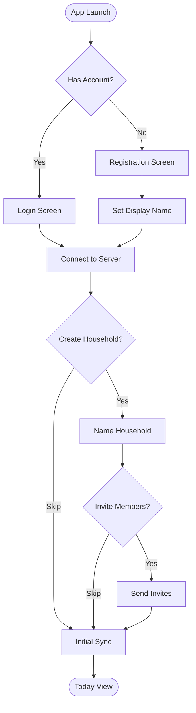

### Screen Sequence
1. **Welcome** — App name + tagline on Foggy Canvas White (`#f8fafa`). Single primary CTA (pill-shaped, signature gradient).
2. **Register / Login** — Inputs on Pale Seafoam Mist (`#f0f4f5`), no borders. Focus state transitions to Gossamer White with teal ghost border.
3. **Profile Setup** — Display name input. Minimal — one field, one action.
4. **Household Setup** — Optional. Card on Gossamer White with Manrope headline.
5. **Today View** — Landing screen. Auto-subscribed sync streams begin loading.

---

## UF-02: Daily Morning Start

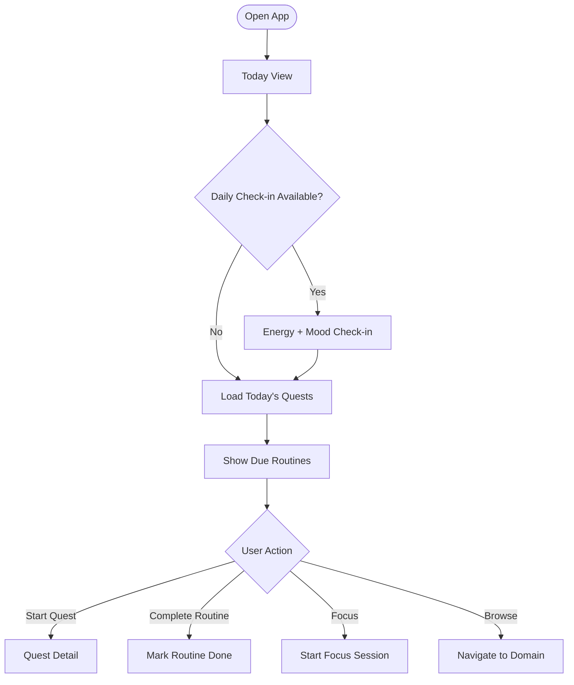

### Screen: Today View
The Today view follows the [`./DESIGN.md`](../../DESIGN.md) layout principles:
- Manrope greeting ("Good morning, {name}") as Display text
- Check-in prompt: Pulse indicator using Deep Muted Teal-Navy (`#446273`) with 2px outer glow
- Quest cards: Gossamer White on Pale Seafoam Mist, rounded-2xl corners, no borders
- Priority badges: pill-shaped with color mapping (urgent = Sophisticated Terracotta `#9f403d`)
- Routine pills: Cool Linen Gray (`#e9eff0`) inactive, Sky-Washed Aqua (`#c7e7fa`) when due

---

## UF-03: Quest Creation

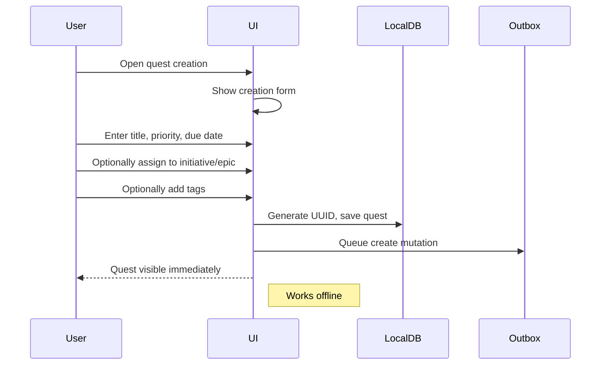

### Form Design
- Title input: wide, Pale Seafoam Mist fill, Manrope placeholder
- Priority selector: pill chips (low/medium/high/urgent)
- Due date: calendar picker with teal accent
- Initiative/Epic: searchable dropdown
- Tags: chip input with autocomplete from existing tags

---

## UF-04: Offline Quest Completion

From architecture spec section 23.1:

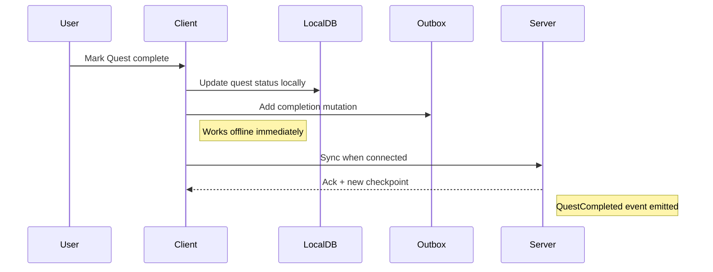

### UI Behavior
- Completion action: swipe-right or tap checkmark
- Immediate visual feedback: card transitions to completed state with 300ms `cubic-bezier(0.4, 0, 0.2, 1)`
- Completed quest: text dims to Weathered Slate (`#566162`), strikethrough
- Offline indicator: subtle icon when mutation is queued but not yet synced

---

## UF-05: Focus Session

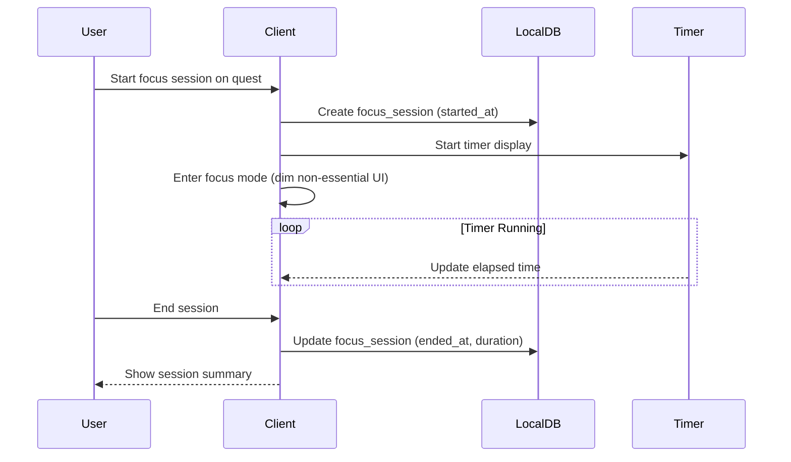

### Focus Mode UI
Per [`./DESIGN.md`](../../DESIGN.md):
- Background dims to Soft Slate Haze (`#cfddde`)
- Active quest card remains on Gossamer White — "spotlight" effect
- Timer uses Manrope Display size, centered
- Signature gradient on the progress ring
- End button: pill-shaped, secondary style

---

## UF-06: Quick Note Capture (Android)

From PRD-003 UC-K-1:

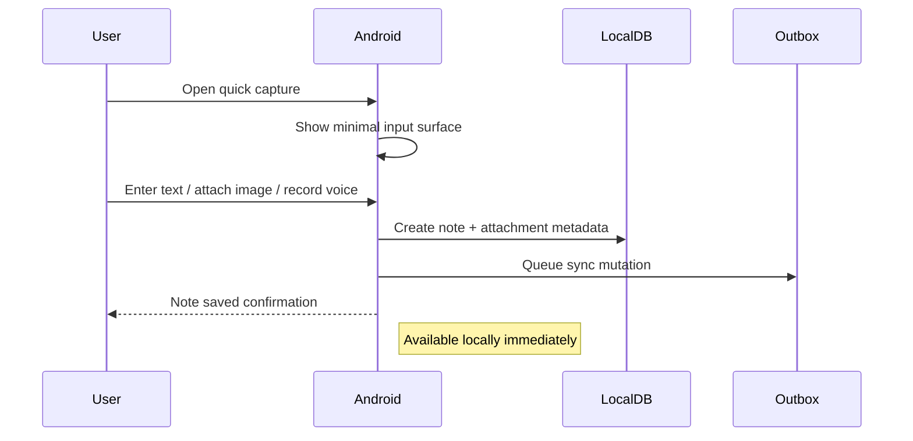

### Quick Capture UI
Per [`./DESIGN.md`](../../DESIGN.md):
- Minimal input surface: pill-shaped with embedded icon
- Background: Cool Linen Gray (`#e9eff0`) when inactive
- On focus: expands to full note editor
- Attachment buttons: circular icon buttons with Pale Seafoam Mist background

---

## UF-07: Note Linking and Discovery (Web)

From PRD-003 UC-K-2:

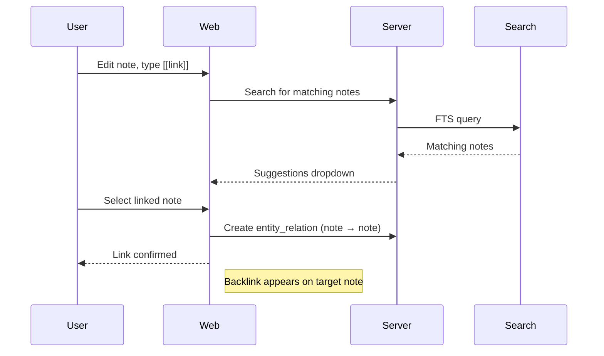

### Linking UI
- `[[` trigger: inline autocomplete dropdown
- Suggestions: cards with note title, preview snippet, domain origin tag
- Backlinks section: below note content, rendered as chips on Dusty Mineral Blue (`#dae5e6`) or Sky-Washed Aqua (`#c7e7fa`) backgrounds
- All-caps label treatment for entity type tags

---

## UF-08: Knowledge Capture with OCR

From architecture spec section 23.2:

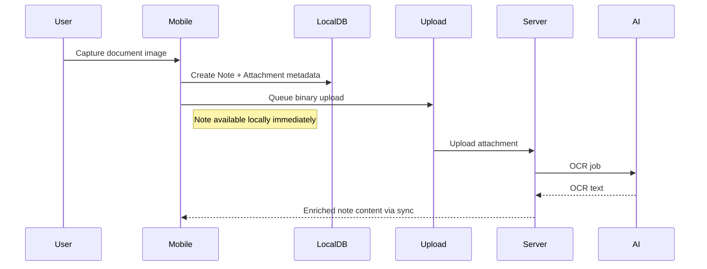

### Processing Indicators
- Attachment state badge: shows current processing state
- `pending` → pulsing indicator
- `processing` → spinner
- `ready` → checkmark
- `failed` → Sophisticated Terracotta (`#9f403d`) icon with retry action

---

## UF-09: Item Creation (Manual)

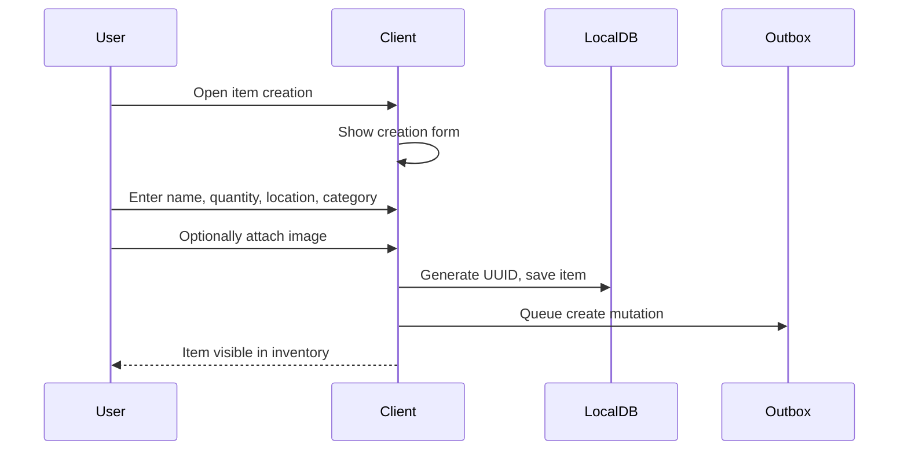

### Form Design
- Name: wide text input
- Quantity: stepper control with +/- buttons
- Location: searchable dropdown filtered to household locations
- Category: searchable dropdown filtered to household categories
- Image: camera button (Android) or file picker (Web/Desktop)

---

## UF-10: Item Creation via Barcode (Android)

From PRD-004 UC-T-1:

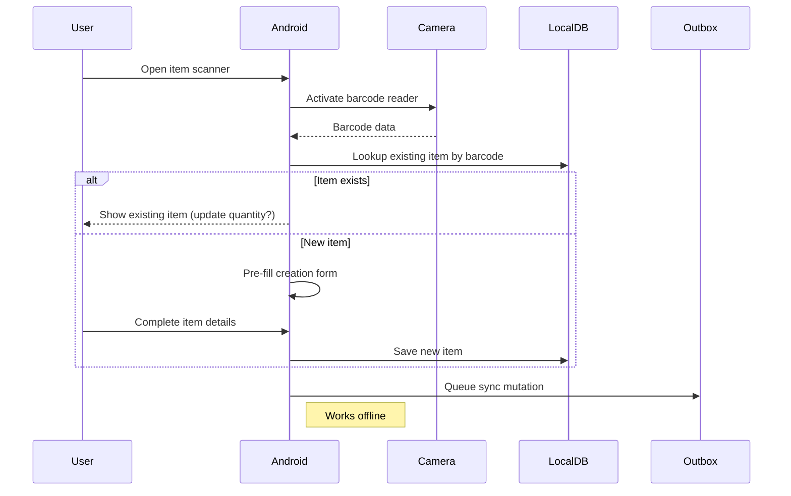

### Scanner UI
Per [`./DESIGN.md`](../../DESIGN.md):
- Full-screen camera overlay
- Scan frame: Deep Muted Teal-Navy (`#446273`) border
- Result: slide-up card on Gossamer White with rounded-2xl corners
- Match indicator: existing item shows Sky-Washed Aqua highlight

---

## UF-11: Consumption Logging

From PRD-004 UC-T-2:

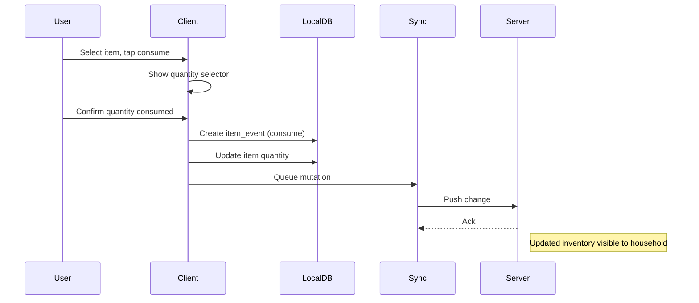

### UI Behavior
- Quantity selector: stepper with current stock shown
- Validation: prevents consuming more than available (invariant E-7)
- Confirmation: brief toast with undo option
- Low-stock warning: quantity badge turns Sophisticated Terracotta (`#9f403d`) when below threshold

---

## UF-12: Shopping List Workflow

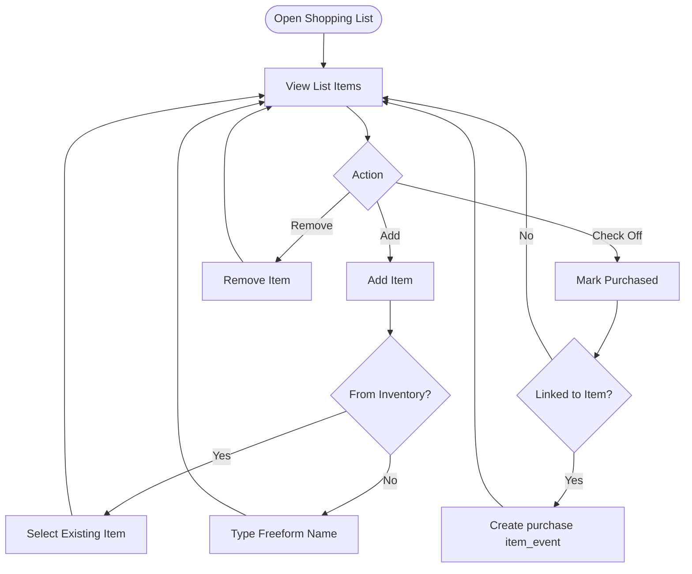

### Shopping List UI
Per [`./DESIGN.md`](../../DESIGN.md):
- Checklist pattern with pill-shaped checkboxes
- Completed items: dim to Ghost Border Ash (`#a9b4b5`) opacity
- Item reference: linked items show inventory quantity badge
- Add button: pill-shaped primary CTA at bottom

---

## UF-13: Low Stock to Restock Quest

From architecture spec section 23.3:

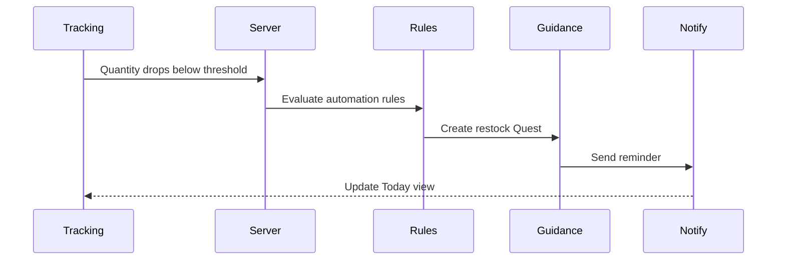

<!-- INFERRED: Automation rule engine design not yet specified — verify during implementation -->

This is a P2 server-driven flow. No direct user interaction required beyond setting thresholds and receiving notifications.

---

## UF-14: Cross-App Search

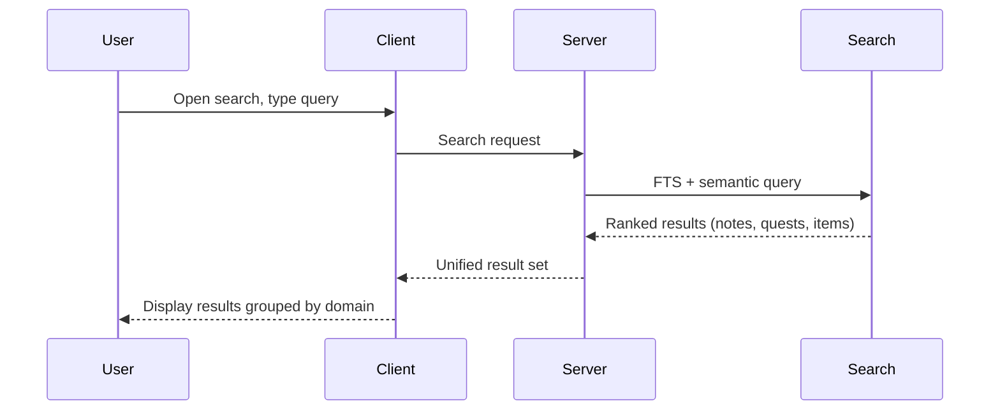

### Search Results UI
Per [`./DESIGN.md`](../../DESIGN.md):
- Each result: standard card (rounded-2xl, Gossamer White)
- Shows: entity type tag (all-caps label, Dusty Mineral Blue chip), domain origin, preview snippet
- Domain grouping: tabs or sections with Manrope headlines
- Search bar: pill-shaped with embedded icon, Cool Linen Gray inactive

---

## UF-15: Sync Conflict Resolution

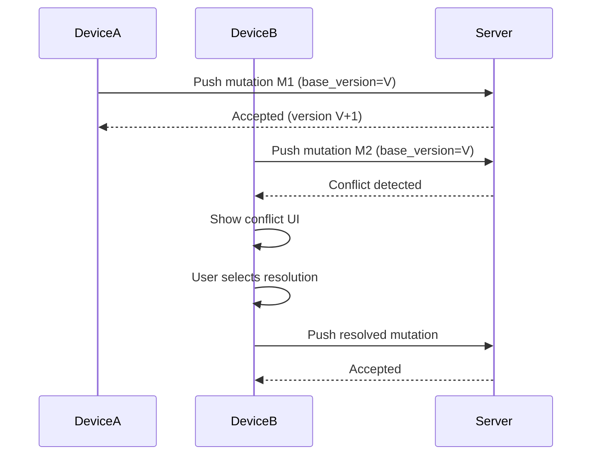

### Conflict UI
- Conflict notification: Sophisticated Terracotta (`#9f403d`) badge — calm urgency
- Side-by-side comparison: two cards showing local vs server version
- Resolution actions: "Keep Mine", "Keep Theirs", "Merge" (where applicable)
- For quantity conflicts (invariant S-3): explicit numeric resolution required

---

## Error States

| Error | UI Treatment | Recovery |
|---|---|---|
| Network offline | Subtle offline indicator (Weathered Slate icon) | Auto-retry on reconnect |
| Sync conflict | Terracotta badge with conflict count | Manual resolution flow (UF-15) |
| Upload failed | Attachment card shows failed state | Retry button |
| Search timeout | Inline message in results area | Retry action |
| Auth expired | Modal overlay requesting re-login | Re-authenticate |
| Validation error | Field-level message in Sophisticated Terracotta | User corrects input |

---

## Empty States

| Screen | Empty State Design |
|---|---|
| Today View (no quests) | Manrope Display heading: "Nothing on the horizon." Subtext in Plus Jakarta Sans. Primary CTA to create first quest. |
| Initiative (no epics) | Illustration area + "Start building" prompt |
| Notes list (empty) | Quick capture prompt with pill-shaped CTA |
| Inventory (no items) | "Track your first item" with scan + manual creation options |
| Shopping list (empty) | "Add items to get started" |
| Search (no results) | "No matches found" with suggestion to broaden query |

All empty states use Foggy Canvas White background with centered content. Headings in Manrope, body in Plus Jakarta Sans. CTAs use the signature gradient.

---

## Interaction Specs

### Transitions
All screen transitions: 300ms `cubic-bezier(0.4, 0, 0.2, 1)` per [`./DESIGN.md`](../../DESIGN.md).

### Gestures (Android)
- Swipe right on quest card: complete
- Swipe left on quest card: defer
- Long press on item: show context menu
- Pull down on list: refresh / sync

### Gestures (Web/Desktop)
- Click to select, double-click to edit
- Keyboard shortcuts for common actions (complete quest, new note)
- Drag and drop for reordering (epics, shopping list items)

---

## Accessibility

- All interactive elements: minimum 44x44dp touch targets (Android), 44x44px click targets (Web)
- Color is never the sole indicator of state — always paired with icon or text
- Focus indicators: Ghost Border Ash (`#a9b4b5`) ring at 100% opacity for keyboard navigation
- Screen reader labels on all icon buttons
- Reduced motion preference: disable transitions, show immediate state changes
- Contrast ratios: all text meets WCAG AA minimum (4.5:1 body, 3:1 large)
