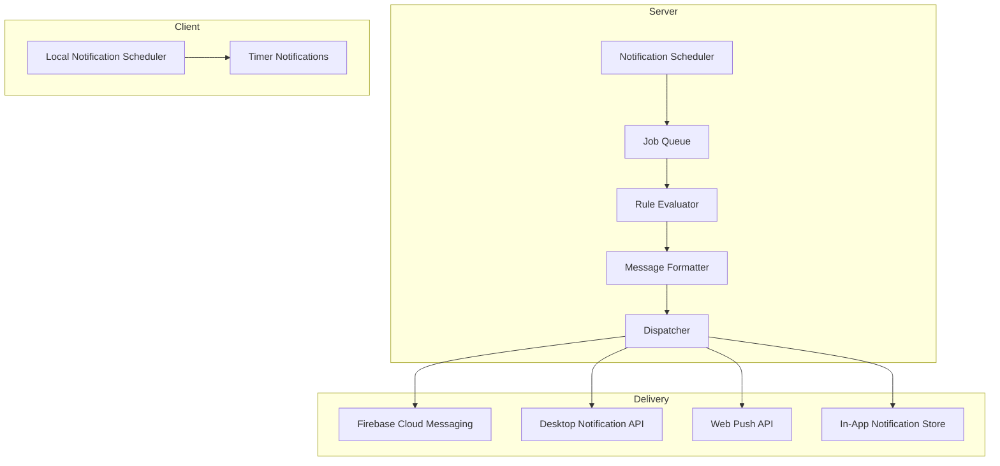

# SUB-001: Notification Subsystem

| Field | Value |
|---|---|
| **Document** | 08-SUB-001-notifications |
| **Version** | 1.0 |
| **Status** | Draft |
| **Last Updated** | 2026-04-12 |
| **Source Docs** | `docs/altair-architecture-spec.md` (section 17), PRD specs |

---

## Philosophy

Notifications in Altair are **gentle nudges, not interruptions**. The system respects the user's attention budget. Notifications should feel like a thoughtful assistant reminding you of something relevant — never like an app fighting for engagement metrics.

Design principles:
- **Relevant by default** — only notify for things the user has opted into or explicitly scheduled
- **Calm urgency** — use Sophisticated Terracotta (`#9f403d`) sparingly; most notifications are informational
- **Cross-device consistency** — notification generation lives on the server; local fallback for offline timers
- **Batching over bombardment** — group related notifications into digests where possible

---

## Notification Categories

| Category | Domain | Priority | Default State |
|---|---|---|---|
| Routine Due | Guidance | Normal | Enabled |
| Timer Complete | Guidance | High | Enabled |
| Daily Check-in | Guidance | Normal | Enabled |
| Evening Wrap-up | Guidance | Low | Enabled |
| Weekly Harvest | Guidance | Low | Enabled |
| Quest Due Soon | Guidance | Normal | Disabled |
| Low Stock Alert | Tracking | Normal | Enabled (if threshold set) |
| Maintenance Due | Tracking | Normal | Disabled |
| Knowledge Reminder | Knowledge | Low | Disabled |
| Household Activity | Core | Low | Disabled |
| Sync Conflict | Sync | High | Enabled |

---

## Notification Types

### Routine Due

| Field | Value |
|---|---|
| **Trigger** | Routine's next occurrence matches current time |
| **Title** | `{routine.title}` |
| **Body** | "Time for your {frequency_type} routine" |
| **Action** | Open routine's spawned quest |
| **Platform** | Android push, Desktop notification, Web optional |

### Timer Complete

| Field | Value |
|---|---|
| **Trigger** | Focus session timer expires |
| **Title** | "Focus session complete" |
| **Body** | `{quest.title} — {duration} minutes` |
| **Action** | Open focus session summary |
| **Platform** | Android push (high priority), Desktop notification |

### Daily Check-in

| Field | Value |
|---|---|
| **Trigger** | Scheduled morning time (user-configurable) |
| **Title** | "Good morning" |
| **Body** | "How are you feeling today?" |
| **Action** | Open daily check-in flow |
| **Platform** | Android push, Desktop notification |

### Evening Wrap-up

| Field | Value |
|---|---|
| **Trigger** | Scheduled evening time (user-configurable) |
| **Title** | "Daily wrap-up" |
| **Body** | "{completed_count} quests completed today" |
| **Action** | Open Today view summary |
| **Platform** | Android push |

### Weekly Harvest

| Field | Value |
|---|---|
| **Trigger** | Scheduled weekly time (user-configurable, default Sunday evening) |
| **Title** | "Weekly review" |
| **Body** | "{completed_count} quests this week across {initiative_count} initiatives" |
| **Action** | Open weekly summary view |
| **Platform** | Android push, Desktop notification |

### Low Stock Alert

| Field | Value |
|---|---|
| **Trigger** | Item quantity drops below user-set threshold |
| **Title** | "Low stock: {item.name}" |
| **Body** | "{quantity} remaining at {location.name}" |
| **Action** | Open item detail or add to shopping list |
| **Platform** | Android push, Desktop notification |

### Sync Conflict

| Field | Value |
|---|---|
| **Trigger** | Server detects conflicting mutations |
| **Title** | "Sync conflict" |
| **Body** | "{entity_type}: {entity_title} has conflicting changes" |
| **Action** | Open conflict resolution UI |
| **Platform** | Android push, Desktop notification, Web in-app |

---

## Message Guidelines

- Titles: concise, max 50 characters
- Body: one sentence, max 100 characters
- Tone: informational, not urgent (except timer complete and sync conflicts)
- Never include sensitive data (note content, item quantities) in push notification body on lock screen
- Use the user's display name sparingly — only in greetings

---

## Scheduling Architecture

### Server-Generated Notifications
The server owns notification generation for cross-device consistency:
- Routine scheduling evaluates user timezone + frequency config
- Daily/weekly notifications scheduled per user preferences
- Low stock alerts triggered by item_event processing
- Sync conflict notifications triggered by conflict detection

### Client-Local Notifications
Local fallback for latency-sensitive or offline scenarios:
- Focus session timer completion (must fire even offline)
- Local reminders set by user on device
- Offline routine reminders (if server unreachable at scheduled time)

---

## Action Handling

| Action Type | Behavior |
|---|---|
| `open_quest` | Navigate to quest detail screen |
| `open_checkin` | Navigate to daily check-in flow |
| `open_item` | Navigate to item detail screen |
| `open_conflict` | Navigate to sync conflict resolution |
| `open_summary` | Navigate to Today view or weekly summary |
| `add_to_list` | Add item to default shopping list |
| `dismiss` | Mark notification as read |

Actions are encoded as deep links:
- Android: `altair://quest/{quest_id}`, `altair://checkin`, `altair://item/{item_id}`
- Web/Desktop: route-based navigation

---

## User Preferences

| Preference | Type | Default | Scope |
|---|---|---|---|
| Quiet hours start | Time | 22:00 | Per-user |
| Quiet hours end | Time | 07:00 | Per-user |
| Morning check-in time | Time | 08:00 | Per-user |
| Evening wrap-up time | Time | 20:00 | Per-user |
| Weekly harvest day | Day of week | Sunday | Per-user |
| Weekly harvest time | Time | 18:00 | Per-user |
| Category toggles | Boolean per category | See defaults above | Per-user |
| Low stock threshold | Integer per item | NULL (disabled) | Per-item |

Preferences are stored in the user's profile and synced across devices.

---

## Platform Behavior

### Android
- Push notifications via FCM
- Notification channels mapped to categories (Android O+)
- High-priority channel for timer complete and sync conflicts
- Grouped notifications for batch scenarios
- Widget refresh triggered by relevant notifications

### Desktop (Tauri)
- Native OS notification API via Tauri plugin
- Tray icon badge for unread count
- Click-to-navigate deep linking

### Web
- Web Push API (requires user permission)
- In-app notification bell with unread count
- Toast-style in-app notifications for real-time events
- Web is not the primary notification surface — in-app indicators preferred

### WearOS (Future)
- Simplified notification cards
- Routine completion action on wrist
- No deep navigation — quick actions only

---

## Technical Implementation

### Notification Record

| Column | Type | Notes |
|---|---|---|
| `id` | UUID | |
| `user_id` | UUID | FK → users |
| `category` | VARCHAR(30) | Notification category |
| `title` | VARCHAR(100) | |
| `body` | TEXT | |
| `action_type` | VARCHAR(30) | Deep link action |
| `action_target` | VARCHAR(255) | Entity ID or route |
| `read_at` | TIMESTAMPTZ | NULL until read |
| `delivered_at` | TIMESTAMPTZ | NULL until delivered |
| `scheduled_for` | TIMESTAMPTZ | When to deliver |
| `created_at` | TIMESTAMPTZ | |

### Delivery Guarantees
- At-least-once delivery via job queue with retry
- Idempotent processing (notification_id dedup)
- Quiet hours enforcement at dispatch time
- Failed deliveries logged, not retried indefinitely (max 3 attempts)

---

## Metrics

| Metric | Target |
|---|---|
| Notification delivery latency | < 5s from trigger to device |
| Delivery success rate | > 95% |
| User opt-out rate per category | < 30% |
| Action completion rate (tap → action) | > 40% |
| Quiet hours violation rate | 0% |
