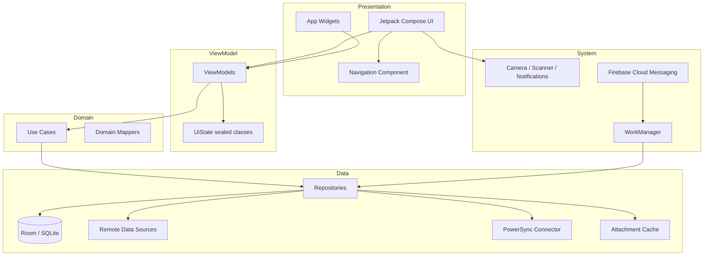

# PLAT-001: Android Platform

| Field | Value |
|---|---|
| **Document** | 09-PLAT-001-android |
| **Version** | 1.0 |
| **Status** | Draft |
| **Last Updated** | 2026-04-12 |
| **Source Docs** | `docs/altair-architecture-spec.md` (sections 6, 10.4), `./DESIGN.md` |

---

## Philosophy

Android is the **daily interaction engine** — the device users carry everywhere. It handles capture, triage, and quick completions. The Android app must feel native, fast, and reliable regardless of network conditions. It is a Tier 1 platform.

---

## Constraints

| Constraint | Impact |
|---|---|
| Diverse hardware | Must support Android 8+ (API 26+), varying screen sizes |
| Battery management | Background sync must respect Doze mode and battery optimization |
| Network variability | Full offline-first; sync is opportunistic |
| Storage limits | Local DB + attachment cache must be bounded |
| Permission model | Runtime permissions for camera, storage, notifications |

---

## Feature Scope

### P0 — Must Ship
- Guidance: quest management, routine completion, focus sessions, daily check-in
- Knowledge: quick note capture (text + image), note browsing
- Tracking: item CRUD, consumption logging, shopping lists
- Core: authentication, sync, offline operation
- Notifications: push notifications for routines, timers, low stock

### P1 — Should Ship
- Barcode scanning for item creation
- Voice note capture
- Camera attachment for notes/items
- Widgets (Today view, quick capture)
- Share intents (receive text/images into notes)

### P2 — Later
- WearOS companion
- Background AI processing
- NFC tag scanning

---

## Architecture

### Key Architectural Decisions
- **Koin** for dependency injection (modules: Database, Repository, ViewModel, Sync, Preferences)
- **Room** for local SQLite storage with PowerSync integration
- **WorkManager** for background sync and attachment upload
- **Jetpack Compose** for all UI — no XML layouts
- **Coroutines + Flow** for reactive data streams

---

## Components

### Navigation
- Bottom navigation: Today, Knowledge, Tracking, Settings
- Nested navigation for detail screens
- Deep link handling for notifications

### DI Modules

| Module | Provides |
|---|---|
| `DatabaseModule` | Room database, DAOs |
| `RepositoryModule` | All repository implementations |
| `ViewModelModule` | All ViewModels |
| `SyncModule` | PowerSync connector, sync coordinator |
| `PreferencesModule` | DataStore preferences |
| `NetworkModule` | HTTP client, API services |

---

## App Screens

### Today View
- Greeting header (Manrope Display)
- Daily check-in card (if not completed)
- Due routines section
- Today's quests list
- Quick action FAB (new quest, new note, scan item)

### Quest Detail
- Title + status + priority
- Epic/initiative breadcrumb
- Focus session history
- Tags and attachments
- Related notes and items (via entity_relations)

### Note Editor
- Title input
- Content area (text editing)
- Attachment strip (images, audio)
- Tags and links section
- Backlinks display

### Inventory List
- Search/filter bar
- Location and category filters
- Item cards with quantity badge
- Low-stock highlighting (Sophisticated Terracotta quantity badge)

### Item Detail
- Name, quantity, location, category
- Event timeline (append-only history)
- Attachments
- Related notes and quests

### Shopping List
- Checklist with pill-shaped checkboxes
- Linked item quantities shown
- Add from inventory or freeform
- Completed items dimmed

### Barcode Scanner
- Full-screen camera overlay
- Scan frame with Deep Muted Teal-Navy border
- Result slide-up card
- Match/create item flow

---

## Design System Application

The Android app translates the [`./DESIGN.md`](../../DESIGN.md) "Ethereal Canvas" design into Material 3 / Compose:

| Design System Token | Android Implementation |
|---|---|
| Foggy Canvas White (`#f8fafa`) | `MaterialTheme.colorScheme.background` |
| Gossamer White (`#ffffff`) | `MaterialTheme.colorScheme.surface` |
| Pale Seafoam Mist (`#f0f4f5`) | `MaterialTheme.colorScheme.surfaceContainerLow` |
| Deep Muted Teal-Navy (`#446273`) | `MaterialTheme.colorScheme.primary` |
| Sky-Washed Aqua (`#c7e7fa`) | `MaterialTheme.colorScheme.primaryContainer` |
| Midnight Charcoal (`#2a3435`) | `MaterialTheme.colorScheme.onSurface` |
| Sophisticated Terracotta (`#9f403d`) | `MaterialTheme.colorScheme.error` |

Typography mapping:
- Manrope → `Typography.displayLarge`, `Typography.headlineLarge`
- Plus Jakarta Sans → `Typography.bodyLarge`, `Typography.labelMedium`

Component mapping:
- Cards: `ElevatedCard` with `RoundedCornerShape(16.dp)` — no explicit elevation shadow for static cards
- Buttons: pill-shaped via `RoundedCornerShape(50)` with primary color
- Inputs: filled style with `surfaceContainerLow` color, no outline

---

## Data Sync Architecture

### PowerSync Integration
- Room database acts as the PowerSync-managed SQLite store
- PowerSync connector handles bidirectional sync
- Auto-subscribed streams load on app start
- On-demand streams subscribed when navigating to detail views

### Offline Behavior
- All reads from local Room database — never blocked by network
- Writes go to local DB + outbox immediately
- Sync coordinator (WorkManager) processes outbox when network available
- Conflict resolution UI shown on next app foreground if conflicts detected

### Attachment Sync
- Metadata synced via PowerSync
- Binary upload via WorkManager (background, resumable)
- Binary download: lazy fetch when user opens attachment
- Local cache with LRU eviction

---

## Background Processing

| Task | Scheduler | Constraints |
|---|---|---|
| Sync outbox | WorkManager (periodic) | Network required |
| Attachment upload | WorkManager (one-time) | Network required, unmetered preferred for large files |
| Notification scheduling | WorkManager (periodic) | None |
| Cache cleanup | WorkManager (periodic) | Battery not low |

---

## Performance Targets

| Metric | Target |
|---|---|
| Cold start | < 1.5s |
| Screen transition | < 300ms |
| Local write | < 200ms |
| Barcode scan to result | < 2s |
| Sync cycle | < 5s (typical batch) |

---

## Testing Strategy

| Layer | Framework | Notes |
|---|---|---|
| Unit (ViewModels, Use Cases) | JUnit 5 + Turbine | Flow testing with Turbine |
| Room DAOs | AndroidX Test + in-memory DB | |
| Compose UI | Compose Testing | Semantics-based assertions |
| Integration | AndroidX Test | Koin test modules |
| E2E | Maestro or UI Automator | Critical user flows |
