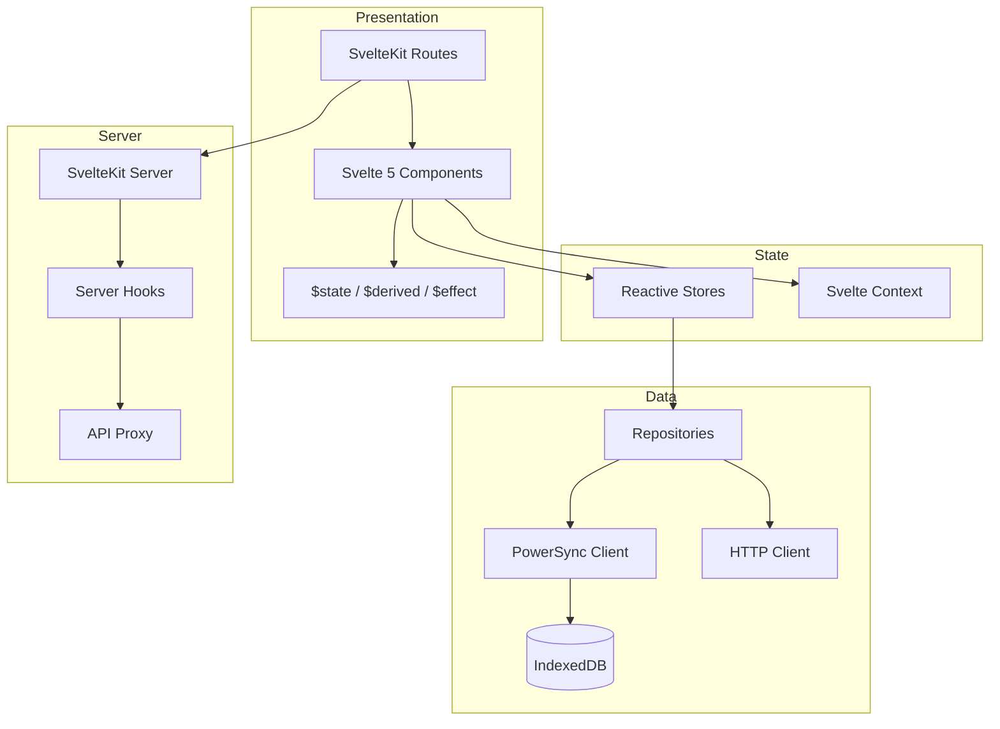

# PLAT-002: Web Platform

| Field | Value |
|---|---|
| **Document** | 09-PLAT-002-web |
| **Version** | 1.0 |
| **Status** | Draft |
| **Last Updated** | 2026-04-12 |
| **Source Docs** | `docs/altair-architecture-spec.md` (sections 6.1, 10.2), `./DESIGN.md` |

---

## Philosophy

The web app is a **first-class product surface, not a limp dashboard**. It serves as the universal access client — available on any device with a browser, requiring no installation. It excels at planning, review, deep editing, and admin tasks. It is a Tier 1 platform.

---

## Constraints

| Constraint | Impact |
|---|---|
| Browser storage limits | IndexedDB quotas vary by browser; cache management required |
| No background execution | Service workers limited; no persistent background sync |
| No device hardware access | No camera, barcode scanner, NFC — capture-oriented flows deferred to mobile |
| Cross-browser compatibility | Target modern evergreen browsers (Chrome, Firefox, Safari, Edge) |
| SSR + SPA hybrid | SvelteKit supports both — SSR for initial load, SPA for navigation |

---

## Feature Scope

### P0 — Must Ship
- Guidance: quest management, initiative/epic planning, routine management
- Knowledge: note editing, backlink browsing, search
- Tracking: inventory browsing, item editing, shopping lists
- Core: authentication, sync, cross-app search
- Admin: instance health, user management, settings

### P1 — Should Ship
- Focus session timer (browser-based)
- Keyboard shortcuts for power users
- Bulk operations (multi-select, batch edit)
- Export/import workflows
- Daily check-in

### P2 — Later
- Web Push notifications
- Offline mode (service worker + IndexedDB)
- Graph visualization for note relationships
- Collaborative editing indicators

---

## Architecture



### Key Architectural Decisions
- **SvelteKit 2** with Svelte 5 runes for reactivity
- **PowerSync** web SDK for local-first data with IndexedDB backend
- **No DI framework** — module-level singletons and Svelte context
- **$lib/** imports for shared utilities and components
- **Server hooks** for CSRF protection (invariant SEC-6) and auth middleware

---

## Components

### Layout Structure
Per [`./DESIGN.md`](../../DESIGN.md):
- Left sidebar: Faded Glacier (`#e1eaeb`) background, navigation items with pill-shaped active state
- Top bar: Foggy Canvas White (`#f8fafa`), flush with page, no bottom border
- Main content area: Foggy Canvas White background
- No visible borders between zones — hierarchy through tonal shift

### Navigation
- Sidebar: Today, Guidance, Knowledge, Tracking, Search, Settings, Admin
- Breadcrumb navigation for hierarchical screens (Initiative → Epic → Quest)
- URL-based routing (deep-linkable states)

---

## App Screens

### Today View
- Greeting (Manrope Display)
- Check-in prompt
- Today's quests and routines
- Quick action buttons

### Initiative Dashboard
- Initiative list with status filters
- Initiative detail: epic/quest tree view
- Drag-and-drop epic reordering
- Inline quest creation

### Note Editor
- Wide content area on Gossamer White
- Metadata strip on Pale Seafoam Mist (narrow right panel)
- `[[` trigger for note linking with inline search
- Backlinks section below content: chips on Dusty Mineral Blue / Sky-Washed Aqua
- Snapshot history sidebar

### Inventory View
- Table/card toggle
- Filters: location, category, stock level
- Inline quantity editing
- Bulk actions toolbar

### Shopping List
- Checklist with pill-shaped checkboxes
- Household member indicators
- Completed items dimmed to Ghost Border Ash opacity

### Search
- Global search bar in top navigation
- Results page: grouped by domain with entity type chips
- Preview snippets with highlight

### Admin Panel
- Instance health dashboard
- User list and invite management
- Storage usage metrics
- Sync error summary
- Provider configuration

---

## Design System Application

The web app is the **primary expression** of the [`./DESIGN.md`](../../DESIGN.md) "Ethereal Canvas" system:

### CSS Custom Properties

```css
:root {
  /* Surfaces */
  --surface-base: #f8fafa;        /* Foggy Canvas White */
  --surface-card: #ffffff;         /* Gossamer White */
  --surface-zone: #f0f4f5;        /* Pale Seafoam Mist */
  --surface-group: #e9eff0;       /* Cool Linen Gray */
  --surface-elevated: #e1eaeb;    /* Faded Glacier */
  --surface-highest: #dae5e6;     /* Dusty Mineral Blue */
  --surface-dim: #cfddde;         /* Soft Slate Haze */

  /* Accents */
  --primary: #446273;             /* Deep Muted Teal-Navy */
  --primary-container: #c7e7fa;   /* Sky-Washed Aqua */
  --error: #9f403d;               /* Sophisticated Terracotta */

  /* Text */
  --on-surface: #2a3435;          /* Midnight Charcoal */
  --on-surface-variant: #566162;  /* Weathered Slate */
  --outline: #727d7e;             /* Pewter Teal */
  --outline-variant: #a9b4b5;     /* Ghost Border Ash */

  /* Typography */
  --font-display: 'Manrope', sans-serif;
  --font-body: 'Plus Jakarta Sans', sans-serif;

  /* Motion */
  --transition-standard: 300ms cubic-bezier(0.4, 0, 0.2, 1);
}
```

### Component Patterns
- Cards: `border-radius: 1rem` (rounded-2xl), Gossamer White on Pale Seafoam Mist — no shadow for static cards
- Elevated elements: `backdrop-blur: 20px`, `box-shadow: 0 20px 40px rgba(42, 52, 53, 0.06)`
- Inputs: no border, Pale Seafoam Mist fill, focus transitions to Gossamer White with teal ghost border
- Buttons: pill-shaped (`border-radius: 9999px`), primary uses Deep Muted Teal-Navy or signature gradient
- Dividers: **forbidden** inside cards — use `2rem` spacing gaps instead
- Tags/badges: Dusty Mineral Blue or Sky-Washed Aqua background, all-caps label, 0.1em letter-spacing

---

## Data Sync Architecture

### PowerSync Web SDK
- IndexedDB as local storage backend
- Auto-subscribed streams connect on app load
- On-demand streams subscribed on route navigation
- Connection status indicator in UI

### Offline Behavior (P2)
- Initial release requires network for full operation
- PowerSync provides read capability from cached IndexedDB data
- Writes queue in outbox and sync when reconnected
- Full offline mode (service worker) is a P2 enhancement

### Data Flow
- Reads: PowerSync local queries (reactive, via `$derived` runes)
- Writes: local write + outbox mutation → sync to server
- Search: server-side (FTS + semantic) — not available offline

---

## CSRF Protection

Per invariant SEC-6:
- SvelteKit server-side hooks enforce CSRF tokens for state-changing requests
- Token injected via `handle` hook and validated on POST/PUT/DELETE
- API proxy routes validate origin headers

---

## Performance Targets

| Metric | Target |
|---|---|
| First contentful paint | < 1.5s |
| Time to interactive | < 3s |
| Route navigation | < 300ms |
| Search response | < 1s |
| Local read | < 100ms |

---

## Testing Strategy

| Layer | Framework | Notes |
|---|---|---|
| Unit (utilities, stores) | Vitest | |
| Component | Vitest + @testing-library/svelte | |
| Integration | Vitest | Mock PowerSync for data layer |
| E2E | Playwright | Critical user flows across browsers |
| Accessibility | axe-core + Playwright | Automated WCAG AA checks |
